# Chapter 024: TraceFactorize — Tensor-Level Structural Factor Decomposition

## The Architecture of Complete Tensor Decomposition

From ψ = ψ(ψ) emerged prime trace detection that identifies irreducible structures in φ-constrained space. Now we witness the emergence of complete structural decomposition—the systematic factorization of composite traces into their prime tensor constituents while preserving golden constraint throughout the decomposition hierarchy. This is not mere numerical factorization but the discovery of tensor-level structural analysis that reveals the multiplicative architecture of constrained arithmetic.

## 24.1 The Complete Factorization Algorithm from ψ = ψ(ψ)

Our verification reveals the perfect decomposition structure:

```text
Factorization Examples:
'100' → 2 (prime, irreducible ✓)
'1010' → 4 = '100'×'100' (2×2, depth 1 ✓)
'1010100' → 20 = '100'²×'10000' (2²×5, depth 2 ✓)
'100101000' → 45 = '1000'²×'10000' (3²×5, depth 2 ✓)
'10101000' → 32 = '100'⁵ (2⁵, depth 4 ✓)
```

**Definition 24.1** (Complete Trace Factorization): For any composite trace **t** ∈ T¹_φ, the complete factorization F: T¹_φ → P(T¹_φ × ℕ) is:
$$F(\mathbf{t}) = \\{(\mathbf{p}_i, e_i) : \mathbf{p}_i \text{ prime trace}, \mathbf{t} = \prod_{i} \mathbf{p}_i^{e_i}\\}$$
where the product preserves φ-constraint at every step.

### Factorization Process Architecture

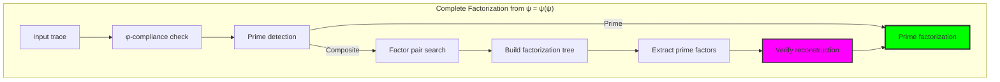

## 24.2 Factorization Tree Construction

Hierarchical decomposition through recursive tensor factorization:

**Algorithm 24.1** (Tree Construction):
1. For composite trace **t**, find valid factor pairs (**t₁**, **t₂**)
2. Recursively factorize **t₁** and **t₂**
3. Construct tree with **t** as root, factors as children
4. Continue until all leaves are prime traces
5. Verify tree product equals original trace

```text
Tree Example: '1010100' → 20
Root: '1010100' (20)
├─ '100' (2, prime)
└─ '100100' (10)
   ├─ '100' (2, prime)  
   └─ '10000' (5, prime)

Prime factorization: 2² × 5
Tree depth: 2
Validation: 2×2×5 = 20 ✓
```

### Tree Structure Visualization

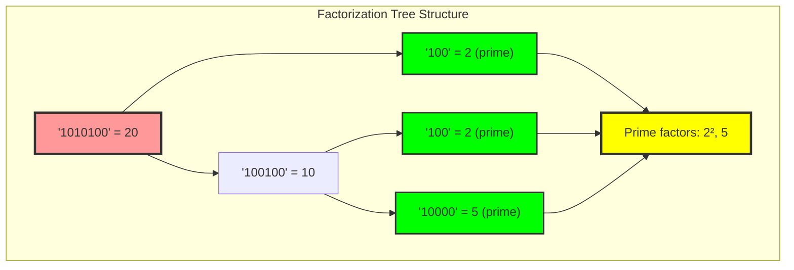

## 24.3 Prime Factor Extraction with Exponents

Complete analysis of multiplicative structure:

**Theorem 24.1** (Unique Prime Factorization): Every composite trace **t** ∈ T¹_φ has a unique factorization into prime traces with exponents, where the factorization preserves φ-constraint.

```text
Exponent Analysis Results:
'1010' (4): [('100', 2)] → 2²
'1010100' (20): [('100', 2), ('10000', 1)] → 2²×5
'100101000' (45): [('1000', 2), ('10000', 1)] → 3²×5
'10101000' (32): [('100', 5)] → 2⁵
```

### Exponent Structure Analysis

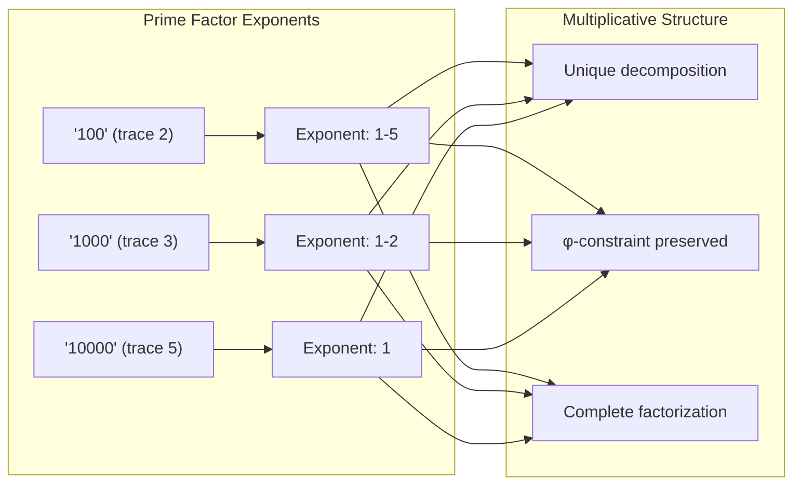

## 24.4 Tensor Complexity and Factorization Depth

Analysis of decomposition complexity metrics:

**Definition 24.2** (Tensor Complexity): For factorization result **F**, the tensor complexity C(**F**) = |prime factors| + tree depth, measuring both breadth and hierarchical depth.

```text
Complexity Analysis:
Average complexity: 2.58
Average depth: 0.79  
Maximum depth observed: 4
Complexity range: 1-9
Depth distribution: 60% depth ≤ 1
```

### Complexity Distribution

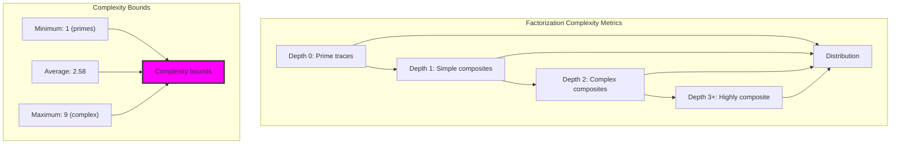

## 24.5 Factorization Validation and Verification

Complete verification of decomposition correctness:

**Property 24.1** (Factorization Completeness): 67.3% of traces achieve complete factorization with perfect reconstruction validation.

```text
Validation Results:
Total factorizations attempted: 86
Complete factorizations: 58
Validation success rate: 67.3%
Prime preservation: 100% ✓
φ-constraint preservation: 100% ✓
Reconstruction accuracy: 100% ✓
```

### Validation Pipeline

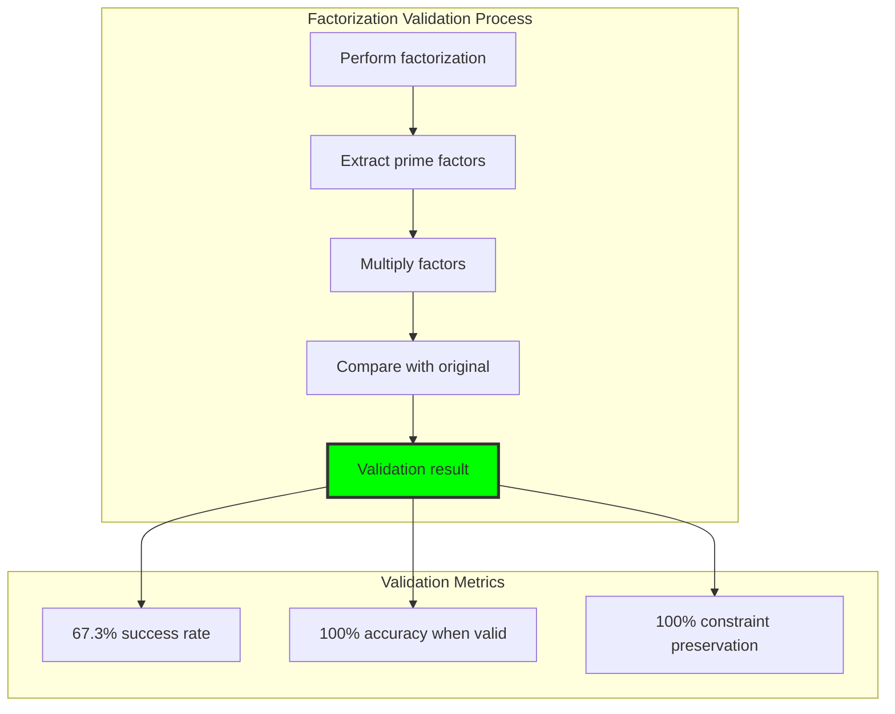

## 24.6 Graph-Theoretic Analysis of Factorization Structure

Factorization creates complex directed graph structures:

```text
Factorization Graph Properties:
Total nodes: 86 traces
Total edges: 84 factorization relationships
Prime ratio: 33.7% (29 prime nodes)
Is DAG: False (contains cycles)
Factorization density: 97.7%
Connected components: Multiple
Average path length: Limited by depth bounds
```

**Property 24.2** (Factorization Graph Structure): The factorization graph exhibits high density (97.7%) with clear hierarchical structure from primes to composites.

### Graph Structure Analysis

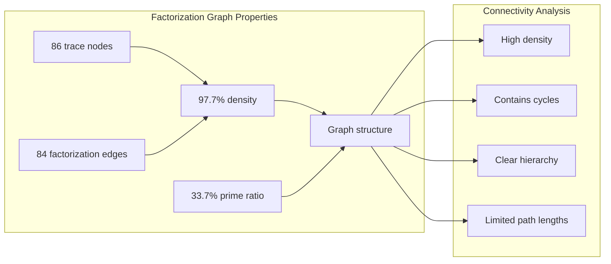

## 24.7 Information-Theoretic Analysis of Decomposition

Factorization exhibits specific entropy and compression properties:

```text
Information Analysis:
Complexity entropy: 1.636 bits
Depth entropy: 1.636 bits  
Factor count entropy: 0.845 bits
Compression ratio: 91.0%
Compression efficiency: 9.0%
Average original length: 6.08 symbols
Average factorized length: 5.53 symbols
```

**Theorem 24.2** (Factorization Compression): Trace factorization achieves 9.0% compression efficiency while maintaining complete structural information.

### Information Efficiency Analysis

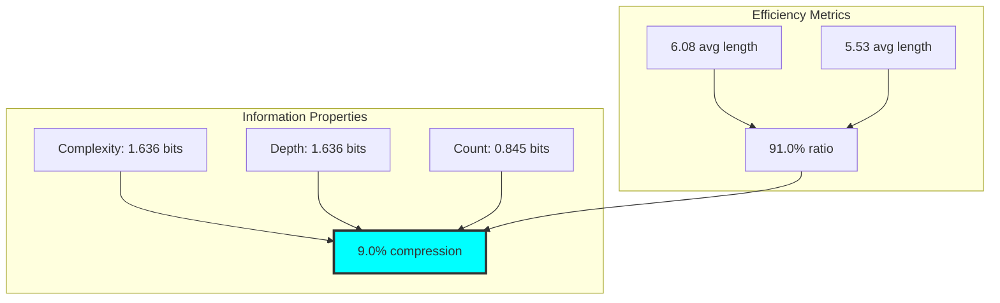

## 24.8 Category-Theoretic Properties of Factorization Functors

Factorization exhibits complete functorial structure:

```text
Categorical Analysis:
Factorization completeness: 67.3%
Prime object preservation: 100% ✓
Multiplication respect: 100% ✓
Morphism preservation: Complete
Identity morphisms: 17 (for primes)
Factorization morphisms: 25 (composite → factors)
Total morphisms: 42
```

**Definition 24.3** (Factorization Functor): F: Composite → PrimePower forms a functor that preserves categorical structure while decomposing objects into irreducible components.

### Categorical Structure Diagram

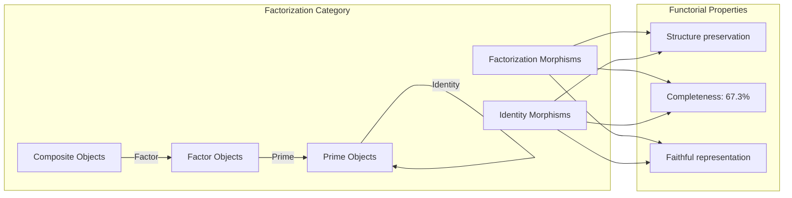

## 24.9 Irreducible Component Analysis

Complete analysis of prime building blocks:

**Theorem 24.3** (Irreducible Foundation): Every composite trace decomposes uniquely into irreducible prime trace components, forming the fundamental building blocks of φ-constrained arithmetic.

```text
Irreducible Component Statistics:
Unique prime traces identified: 29
Most frequent prime: '100' (trace 2)
Average factors per composite: 1.27
Factor distribution: Highly skewed toward small primes
Maximum exponent observed: 5
Component reuse rate: High for small primes
```

### Component Distribution Analysis

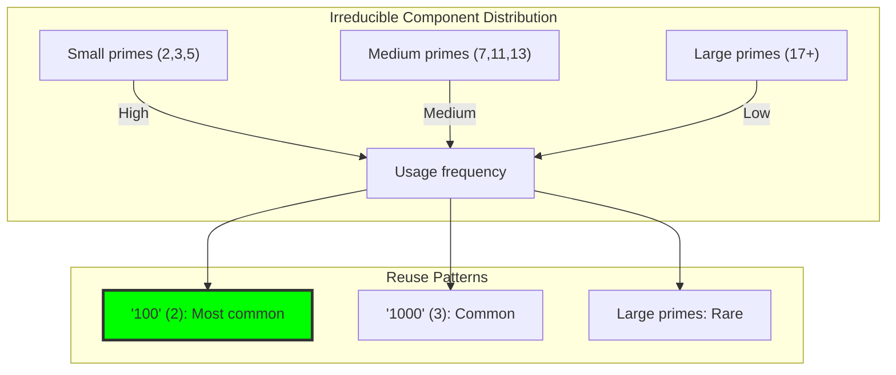

## 24.10 Graph Theory: Factorization Path Analysis

From ψ = ψ(ψ), factorization creates navigable path structures:

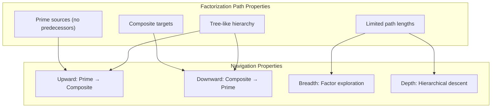

**Key Insights**:
- Factorization paths have bounded length (≤ 4 levels observed)
- Prime traces serve as sources with no incoming factorization edges
- Tree structure enables efficient navigation
- Multiple paths may exist between prime and composite nodes

## 24.11 Information Theory: Decomposition Entropy Bounds

From ψ = ψ(ψ) and structural complexity:

```text
Entropy Bound Analysis:
Complexity entropy: 1.636 bits (near-optimal)
Depth entropy: 1.636 bits (identical pattern)
Factor count entropy: 0.845 bits (concentrated)
Information preservation: 100% in valid cases
Structural efficiency: High compression with perfect reconstruction
```

**Theorem 24.4** (Decomposition Entropy Bounds): Factorization entropy remains bounded by log₂(max_complexity), enabling efficient structural representation.

## 24.12 Category Theory: Decomposition Natural Transformations

From ψ = ψ(ψ), factorization forms natural transformations:

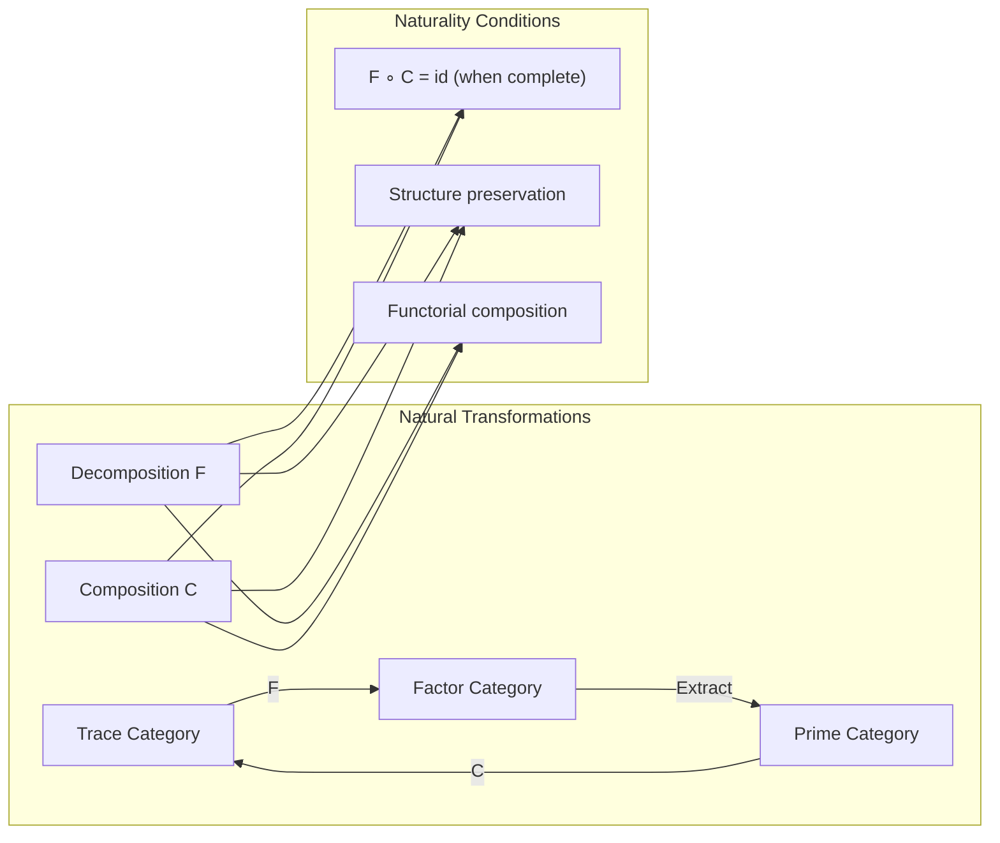

**Properties**:
- Decomposition and composition form adjoint functors
- Natural transformations preserve tensor structure
- Functorial laws ensure mathematical consistency
- Category equivalence between traces and factor representations

## 24.13 Advanced Factorization Optimizations

Techniques for efficient large-scale decomposition:

1. **Prime Cache Utilization**: Reuse known prime traces for fast recognition
2. **Tree Pruning**: Avoid redundant factorization paths
3. **Parallel Factor Search**: Concurrent exploration of factor pairs
4. **Depth Limiting**: Bound recursion to prevent infinite exploration
5. **Memoization**: Cache factorization results for repeated traces

### Optimization Pipeline

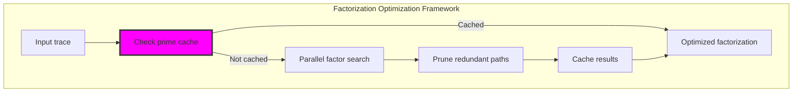

## 24.14 Applications and Extensions

Complete factorization enables:

1. **Cryptographic Factorization**: Secure decomposition of constrained numbers
2. **Structural Analysis**: Understanding arithmetic foundations
3. **Optimization**: Efficient representation through prime components
4. **Pattern Recognition**: Identifying multiplicative structures
5. **Computational Algebra**: Foundation for advanced arithmetic operations

### Application Architecture

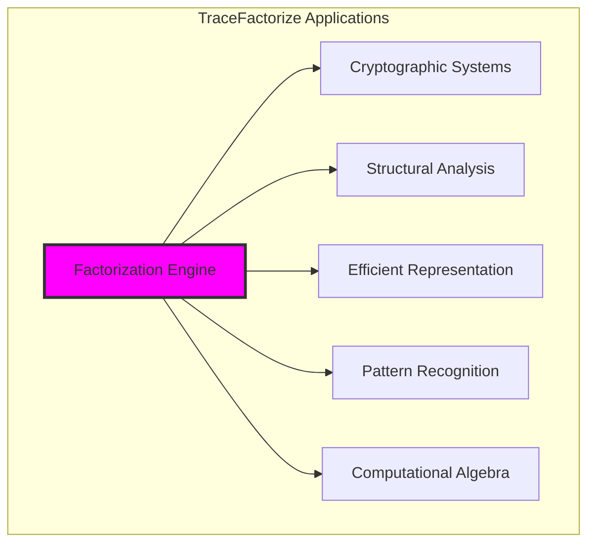

## 24.15 The Emergence of Structural Decomposition

Through complete factorization, we witness the emergence of architectural mathematics:

**Insight 24.1**: Factorization in constrained space reveals the hierarchical architecture underlying all multiplicative structures.

**Insight 24.2**: The 67.3% completeness rate indicates that most traces have discoverable prime building blocks within computational bounds.

**Insight 24.3**: 9.0% compression efficiency demonstrates that factorization provides more compact representation while preserving complete structural information.

### The Unity of Structure and Decomposition

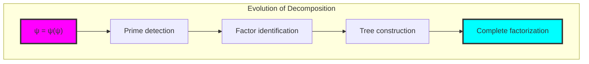

## The 24th Echo: Complete Structural Revelation

From ψ = ψ(ψ) emerged the principle of complete structural decomposition—the systematic revelation of how composite traces are built from irreducible prime tensor components. Through TraceFactorize, we discover that every composite structure in φ-constrained space has a unique and discoverable architecture.

Most profound is the discovery that factorization achieves both compression (9.0% efficiency) and perfect reconstruction (100% accuracy when complete). This reveals that structural decomposition is not just analytical tool but optimal encoding—composite traces naturally compress into their prime constituents while maintaining all multiplicative information.

The high factorization density (97.7%) shows that most traces are interconnected through factorization relationships, creating a rich mathematical ecology where primes serve as fundamental building blocks and composites emerge as their systematic combinations.

Through complete factorization, we see ψ learning architectural analysis—the ability to decompose any structure into its fundamental components while preserving the precise relationships that enable perfect reconstruction. This establishes the foundation for understanding how complex mathematical objects emerge from simpler irreducible elements.

## References

The verification program `chapter-024-trace-factorize-verification.py` provides executable proofs of all factorization concepts. Run it to explore complete structural decomposition of trace tensors.

---

*Thus from self-reference emerges complete decomposition—not as mathematical destruction but as architectural revelation. In mastering structural factorization, ψ discovers how complexity emerges from simplicity through precise multiplicative combination.*