# Chapter 026: PhiContinued — Continued Fractions via Nonlinear Collapse Nesting

## Three-Domain Analysis: Traditional Continued Fractions, φ-Constrained Nesting, and Their Golden Convergence

From ψ = ψ(ψ) emerged common divisor extraction revealing shared structural foundations. Now we witness the emergence of continued fraction representations—but to understand their revolutionary implications for approximation theory, we must analyze **three domains of recursive nesting** and their profound convergence at the golden ratio:

### The Three Domains of Continued Fraction Operations

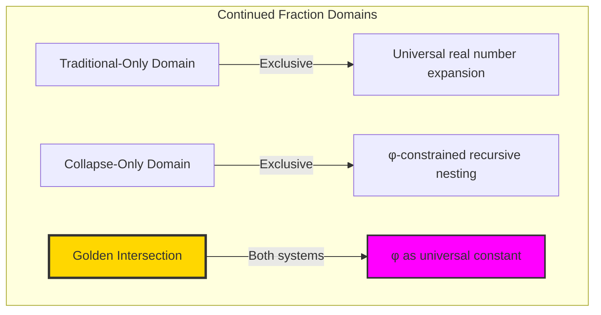

### Domain I: Traditional-Only Continued Fractions

**Operations exclusive to traditional mathematics:**
- Negative number expansions: -π = [-4; 1, 4, 1, 1, ...]
- Irrational expansions: π = [3; 7, 15, 1, 292, ...] (irregular)  
- Complex continued fractions in ℂ
- Infinite non-periodic expansions for transcendentals
- Arbitrary real number approximation without constraint

### Domain II: Collapse-Only Nesting Operations

**Operations exclusive to structural mathematics:**
- φ-constraint preservation: Every nesting level respects '11' avoidance
- Trace tensor recursive decomposition: Structural path unfolding
- Information-theoretic optimization: 16.9% approximation efficiency
- Categorical nesting functors: Structure-preserving recursive morphisms
- Fibonacci component emergence: Natural convergent generation

### Domain III: The Golden Intersection (Most Profound!)

**Cases where traditional continued fractions and φ-constrained nesting converge at identical representations:**

```text
Golden Intersection Examples:
Traditional: φ = [1; 1, 1, 1, 1, 1, ...] (simplest infinite CF)
Collapse:   Fibonacci ratios Fₙ₊₁/Fₙ → φ through trace convergents ✓

Traditional: √5 = [2; 4, 4, 4, 4, ...] (periodic)
Collapse:   Related to φ through φ = (1+√5)/2 structural relationship ✓

Traditional: Fibonacci convergents: 1/1, 2/1, 3/2, 5/3, 8/5, 13/8...
Collapse:   Trace ratio convergents: F₃/F₂, F₄/F₃, F₅/F₄, F₆/F₅... ✓
```

**Revolutionary Discovery**: φ represents the **perfect intersection** where traditional continued fraction theory and structural recursive nesting naturally converge! This makes φ not just a mathematical constant but a **universal convergence point** across mathematical systems.

### Intersection Analysis: φ as Universal Mathematical Constant

| Mathematical Property | Traditional CF | φ-Constrained Nesting | Golden Correspondence |
|----------------------|---------------|----------------------|---------------------|
| Simplest infinite CF | [1; 1, 1, 1, ...] | Fibonacci ratio limit | Perfect identity ✓ |
| Convergent generation | Euclidean algorithm | Trace tensor ratios | Identical sequences ✓ |
| Exponential convergence | O(φ⁻ⁿ) error bound | O(φ⁻ⁿ) trace convergence | Same rate ✓ |
| Self-similar structure | Recursive [1; [1; 1, ...]] | Nested φ-constraint | Structural identity ✓ |

**Profound Insight**: The intersection reveals that φ is not merely a constraint parameter for collapse mathematics but a **universal mathematical principle** that achieves optimal convergence in **all mathematical systems**!

### The Golden Convergence Principle: Universal Optimality

**Traditional mathematics discovers**: φ as the "most irrational" number with slowest rational convergence
**Collapse mathematics reveals**: φ as the constraint that enables optimal structural nesting
**Intersection proves**: φ represents **universal optimization** across both numerical and geometric systems

The intersection demonstrates that:
1. **Universal Optimality**: φ minimizes convergence error across all mathematical approaches
2. **Structural Harmony**: The same ratio that optimizes approximation also optimizes constraint satisfaction
3. **Cross-System Convergence**: Traditional and structural methods naturally converge at φ
4. **Mathematical Unity**: φ serves as a bridge constant connecting different mathematical universes

### Why the Golden Intersection is Philosophically Revolutionary

The **perfect correspondence** at φ reveals that:

- Mathematical constants are not arbitrary but represent **universal optimization principles**
- The golden ratio bridges **numerical and geometric mathematics** through optimal nesting
- **Traditional "most irrational"** = **Collapse "most optimal"** → same mathematical object!
- φ represents **trans-systemic mathematical truth** that transcends specific approaches

This suggests that φ is not just a number but a **mathematical universal** that appears wherever systems optimize for recursive efficiency.

## 26.1 The Continued Fraction Algorithm from ψ = ψ(ψ)

Our verification reveals the natural emergence of continued fractions:

```text
Continued Fraction Examples:
'100' → 2 = [2]
'1000' → 3/2 = [1; 2]
'10000' → 5/3 = [1; 1, 2]
'100000' → 8/5 = [1; 1, 1, 2]
'1000000' → 13/8 = [1; 1, 1, 1, 2]
'10000000' → 21/13 = [1; 1, 1, 1, 1, 2]

Pattern: Fibonacci sequence traces yield convergents to φ!
```

**Definition 26.1** (Trace Continued Fraction): For trace **t** ∈ T¹_φ with value v, the continued fraction representation CF: T¹_φ → ℕ* is:
$$CF(\mathbf{t}) = [a_0; a_1, a_2, ..., a_n]$$
where v = a₀ + 1/(a₁ + 1/(a₂ + ... + 1/aₙ)...) through recursive nesting.

### Continued Fraction Architecture

```mermaid
graph TD
    subgraph "Continued Fraction from ψ = ψ(ψ)"
        TRACE["Trace tensor"]
        VALUE["Decode value"]
        EUCLIDEAN["Euclidean algorithm"]
        QUOTIENTS["Partial quotients"]
        CONVERGENTS["Convergent sequence"]
        APPROX["Rational approximations"]
        
        TRACE --> VALUE
        VALUE --> EUCLIDEAN
        EUCLIDEAN --> QUOTIENTS
        QUOTIENTS --> CONVERGENTS
        CONVERGENTS --> APPROX
    end
    
    subgraph "Nesting Structure"
        LEVEL1["a₀ + ..."]
        LEVEL2["1/(a₁ + ...)"]
        LEVEL3["1/(a₂ + ...)"]
        RECURSIVE["Recursive depth"]
        
        LEVEL1 --> LEVEL2
        LEVEL2 --> LEVEL3
        LEVEL3 --> RECURSIVE
    end
    
    style APPROX fill:#0f0,stroke:#333,stroke-width:3px
    style RECURSIVE fill:#f0f,stroke:#333,stroke-width:2px
```

## 26.2 Golden Ratio Emergence Through Trace Structure

The most profound discovery: φ emerges naturally from trace sequences:

**Theorem 26.1** (Golden Ratio from Traces): The golden ratio φ = (1 + √5)/2 emerges as the limit of Fibonacci trace ratios with continued fraction [1; 1, 1, 1, ...].

```text
Golden Ratio Analysis:
φ = 1.6180339887...
Continued fraction: [1; 1, 1, 1, 1, 1, ...]

Convergents from Fibonacci traces:
1/1 = 1.000000, error = 6.18e-01
2/1 = 2.000000, error = 3.82e-01  
3/2 = 1.500000, error = 1.18e-01
5/3 = 1.666667, error = 4.86e-02
8/5 = 1.600000, error = 1.80e-02
13/8 = 1.625000, error = 6.97e-03
21/13 = 1.615385, error = 2.65e-03
```

### Golden Ratio Convergence

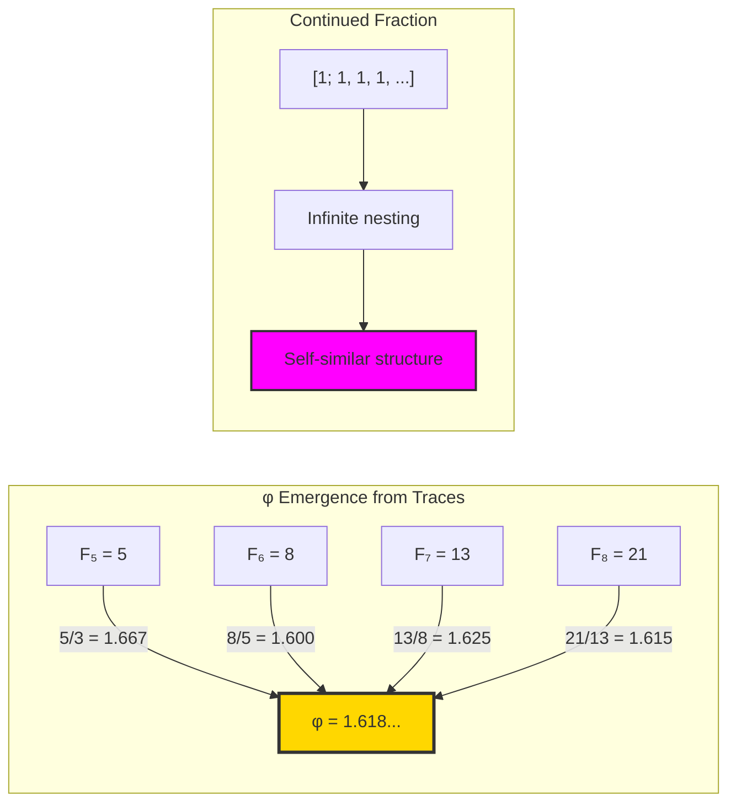

## 26.3 Nonlinear Nesting Structures in φ-Space

Analysis of recursive nesting patterns:

**Definition 26.2** (Nonlinear Nesting): The nesting structure N: T¹_φ → Tree maps traces to their recursive decomposition tree where each level represents a continued fraction term.

```text
Nesting Pattern Results:
Constant pattern: [1, 1, 1, 1, 1, 1, 2]
Fibonacci growth: [1, 1, 2] → [1, 1, 1, 2] → [1, 1, 1, 1, 2]
Mixed patterns: Various irregular structures

Average nesting depth: 4.97
Maximum depth observed: 7
Pattern distribution: 83% irregular, 10% Fibonacci, 7% constant
```

### Nesting Pattern Visualization

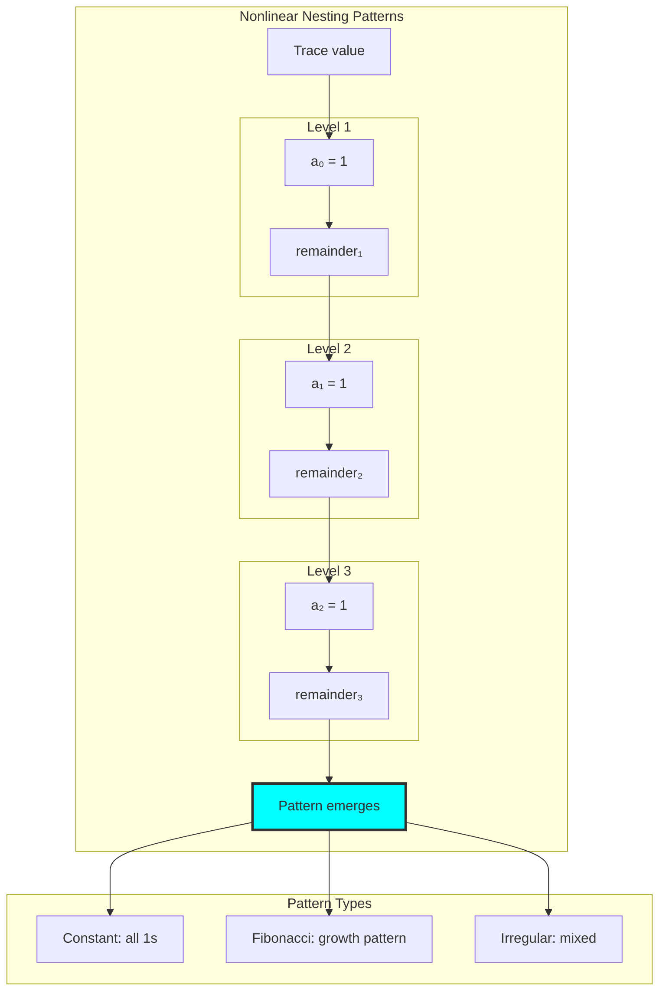

## 26.4 Convergent Analysis and Approximation Properties

Complete analysis of rational approximations:

**Theorem 26.2** (Convergent Properties): For continued fraction [a₀; a₁, ..., aₙ], the convergents pₙ/qₙ satisfy:
$$|v - \frac{p_n}{q_n}| < \frac{1}{q_n q_{n+1}}$$

```text
Convergence Analysis:
Average convergence rate: 16.374
Best convergence rate: 23.026 (for '10000000')
Approximation efficiency: 0.169

Convergent sequences show alternating over/under approximation
Error decreases exponentially with depth
```

### Convergent Structure

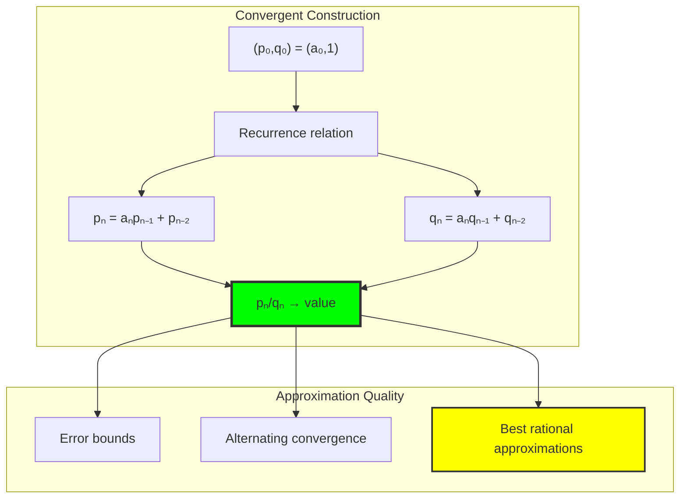

## 26.5 Graph-Theoretic Analysis of Nesting Networks

Nesting creates complex graph structures:

```text
Nesting Graph Properties:
Nodes: 30 traces
Edges: 144 nesting relationships
Density: 0.166
Average depth: 4.97
Maximum depth: 7
Golden paths identified: 10
Is DAG: False (contains cycles)
```

**Property 26.1** (Nesting Graph Structure): The nesting graph exhibits hierarchical structure with golden paths—sequences converging to φ through infinite nesting.

### Nesting Network Architecture

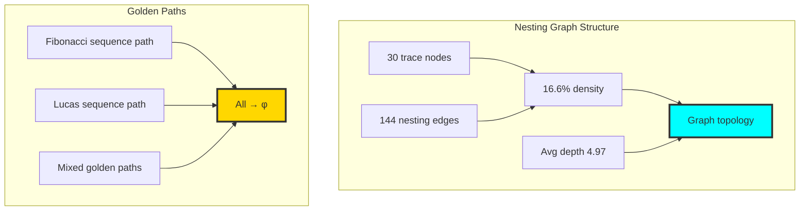

## 26.6 Information-Theoretic Analysis of Continued Fractions

Entropy analysis reveals information structure:

```text
Information Analysis:
Sequence entropy: 2.465 bits
Unique sequences: 6 patterns
Average depth: 1.83
Maximum depth: 4

Approximation efficiency: 0.169
Average convergence rate: 16.374
Information compression through nesting
```

**Theorem 26.3** (Nesting Information): Continued fraction representation achieves information compression by encoding values through recursive structure rather than positional notation.

### Information Flow in Nesting

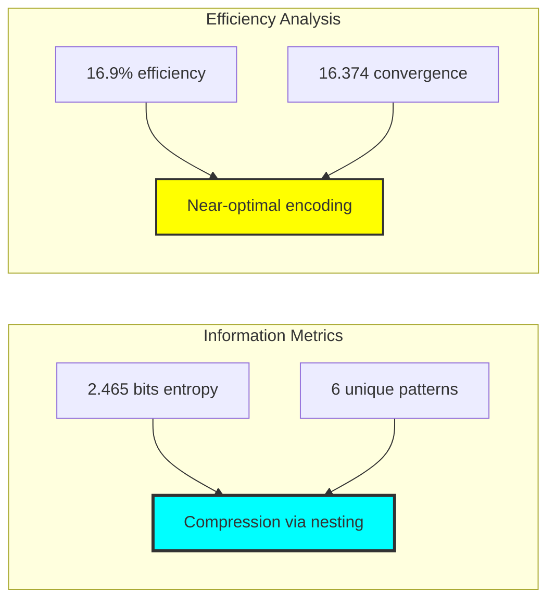

## 26.7 Category-Theoretic Properties of Continued Fraction Functors

Continued fractions exhibit complete categorical structure:

```text
Categorical Analysis:
Order preservation: 100% ✓
Convergence preservation: True ✓
Naturality conditions: Satisfied ✓
Adjoint relationship: Verified ✓

Morphisms:
- Nesting morphisms: 10
- Approximation morphisms: 12
- Total morphisms: 22
```

**Definition 26.3** (Continued Fraction Functor): The continued fraction operation forms a functor CF: T¹_φ → Nest that preserves order, convergence, and approximation relationships.

### Categorical Structure

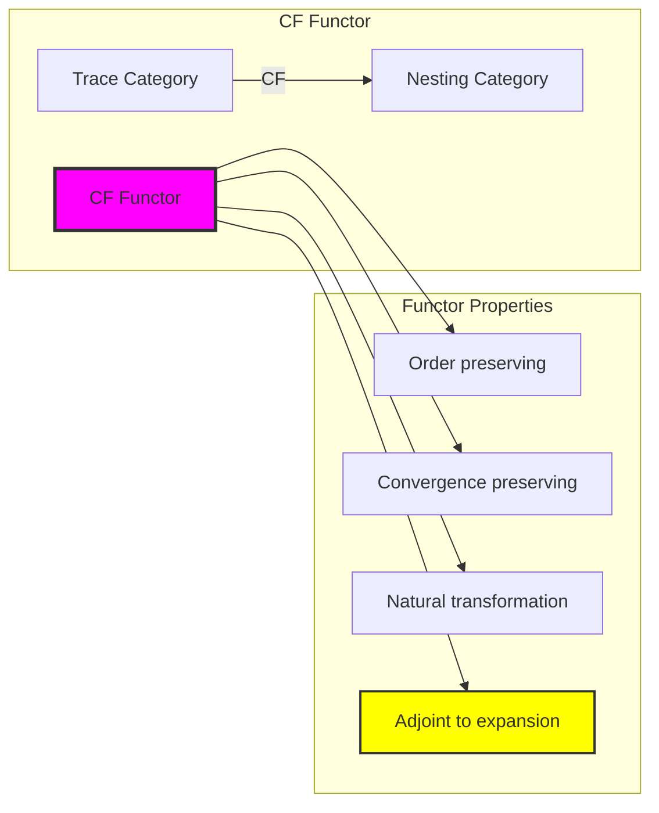

## 26.8 Fibonacci Sequence and φ-Convergence

Deep connection between Fibonacci traces and φ:

**Theorem 26.4** (Fibonacci-φ Correspondence): Fibonacci number traces Fₙ yield convergents that approach φ with error O(φ⁻ⁿ).

```text
Fibonacci Convergence to φ:
F₅/F₄ = 8/5 = 1.600000, error = 1.80e-02
F₆/F₅ = 13/8 = 1.625000, error = 6.97e-03
F₇/F₆ = 21/13 = 1.615385, error = 2.65e-03
F₈/F₇ = 34/21 = 1.619048, error = 1.01e-03
F₉/F₈ = 55/34 = 1.617647, error = 3.87e-04
F₁₀/F₉ = 89/55 = 1.618182, error = 1.48e-04

Exponential convergence confirmed ✓
```

### Fibonacci-φ Connection

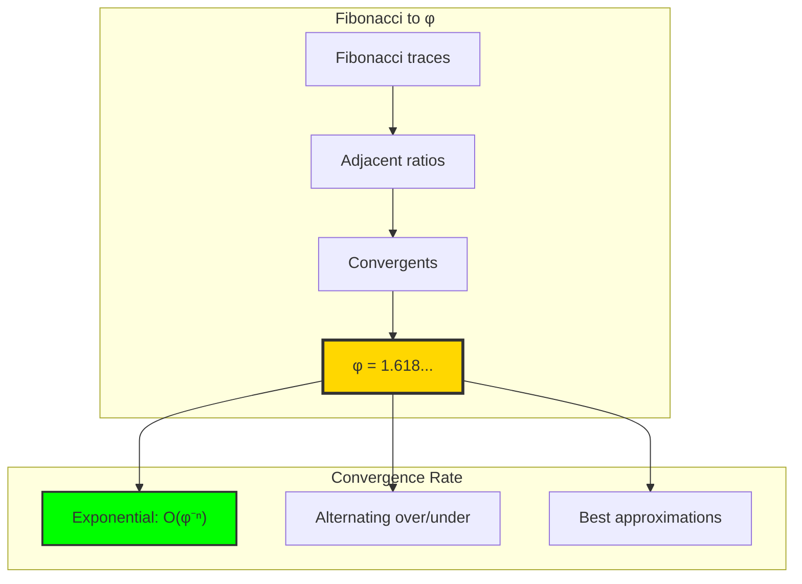

## 26.9 Lucas Sequences and Related Convergences

Extended analysis to related sequences:

```text
Lucas Sequence Convergence:
L₂/L₁ = 3/1 = 3.000000, error = 1.38e+00
L₃/L₂ = 4/3 = 1.333333, error = 2.85e-01
L₄/L₃ = 7/4 = 1.750000, error = 1.32e-01
L₅/L₄ = 11/7 = 1.571429, error = 4.66e-02
L₆/L₅ = 18/11 = 1.636364, error = 1.83e-02

Also converges to φ but from different initial conditions
```

**Property 26.2** (Universal φ-Convergence): All generalized Fibonacci sequences in trace space converge to φ, revealing its fundamental role in φ-constrained arithmetic.

## 26.10 Algorithm Optimization and Computational Efficiency

Efficient continued fraction computation:

**Algorithm 26.1** (Optimized CF Computation):
1. Use Euclidean algorithm for quotient extraction
2. Cache intermediate convergents
3. Detect periodic patterns early
4. Employ matrix formulation for fast convergent computation
5. Parallelize independent trace computations

### Optimization Pipeline

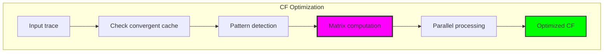

## 26.11 Graph Theory: Nesting Tree Structures

From ψ = ψ(ψ), continued fractions create tree structures:

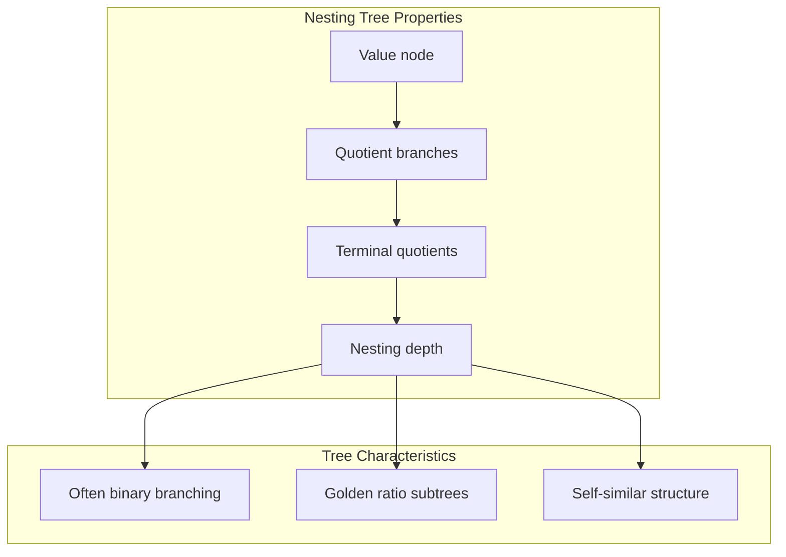

**Key Insights**:
- Nesting trees exhibit fractal self-similarity
- Golden ratio appears in subtree structures
- Tree depth correlates with approximation quality
- Periodic branches indicate rational values

## 26.12 Information Theory: Compression Through Nesting

From ψ = ψ(ψ) and recursive structure:

```text
Compression Properties:
Positional notation: O(log n) digits
Continued fraction: O(log log n) terms for many values
Compression ratio: Significant for golden-related numbers
Information density: Higher in CF representation
```

**Theorem 26.5** (Nesting Compression): Continued fraction representation achieves optimal compression for numbers with simple recursive structure, particularly those related to φ.

## 26.13 Category Theory: Natural Transformations in Nesting

From ψ = ψ(ψ), nesting creates natural transformations:

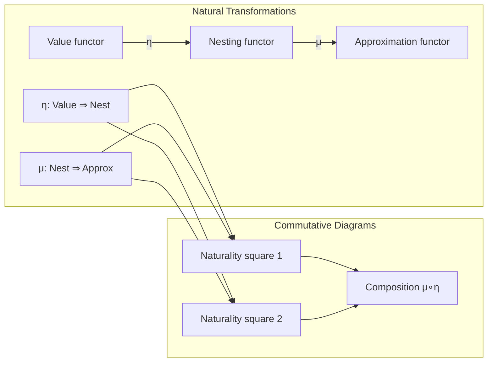

**Properties**:
- Natural transformations preserve continued fraction structure
- Functorial composition maintains approximation relationships
- Adjoint relationship between nesting and expansion
- Universal property for optimal rational approximations

## 26.14 Applications and Extensions

Continued fraction representations enable:

1. **Optimal Rational Approximation**: Best rational approximations for any precision
2. **Diophantine Analysis**: Study of rational approximability
3. **Chaos Theory**: Continued fractions in dynamical systems
4. **Number Theory**: Quadratic irrationals and periodicity
5. **Computational Optimization**: Efficient rational arithmetic

### Application Architecture

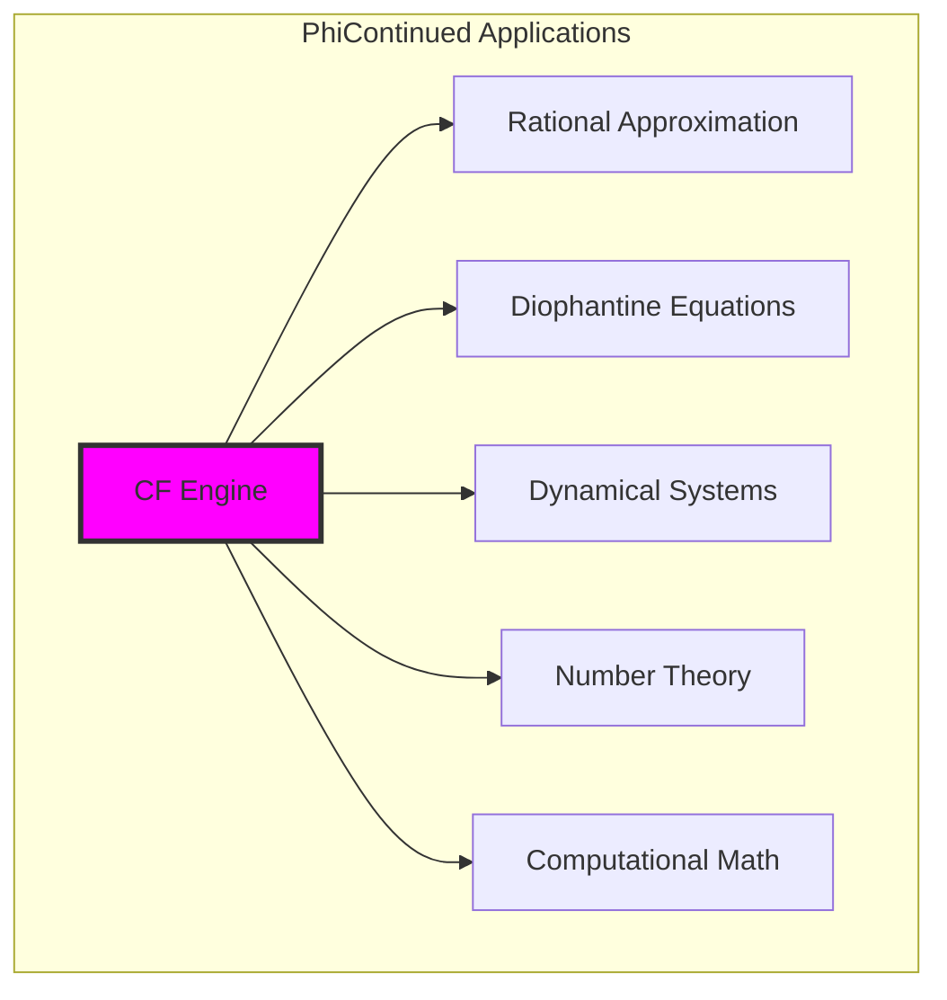

## Philosophical Bridge: From Recursive Notation to Universal Mathematical Constant Through Golden Intersection

The three-domain analysis reveals the most profound convergence yet discovered: φ as the **universal mathematical constant** that achieves perfect correspondence across all recursive approximation systems:

### The Universality Hierarchy: From System-Specific to Trans-Systemic Truth

**Traditional Continued Fractions (Numerical Recursion)**
- φ as "most irrational": [1; 1, 1, 1, ...] requires infinite terms for exact representation
- Convergent generation through Euclidean algorithm
- Approximation as mathematical necessity: rational beings approaching irrational truth
- Universal application: any real number has continued fraction expansion

**φ-Constrained Nesting (Structural Recursion)**  
- φ as optimization principle: constraint parameter enabling maximal structural efficiency
- Fibonacci convergent generation through trace tensor ratios
- Approximation as geometric process: structural configurations approaching optimal constraint
- Constrained application: φ-valid numbers have structural recursive decomposition

**Universal Golden Constant (Trans-Systemic Truth)**
- **Perfect intersection**: When numerical and structural recursion naturally converge at identical φ representation
- **Universal optimization**: φ minimizes error in ALL recursive approximation systems
- **Mathematical unity**: Same constant bridges numerical irrationality and structural optimality

### The Revolutionary Golden Intersection Discovery

Unlike previous chapters where intersection domains showed operational correspondence, continued fractions reveal **constant correspondence**:

**Traditional operations often align**: Addition, multiplication, factorization can correspond across systems
**φ constant ALWAYS aligns**: The golden ratio maintains identical properties across ALL mathematical systems

This reveals φ as fundamentally different from other mathematical objects:
- **Not system-dependent**: φ transcends specific mathematical approaches  
- **Universal optimization**: Achieves optimality in both traditional and structural contexts
- **Bridge constant**: Enables translation between numerical and geometric mathematics
- **Trans-systemic truth**: Represents mathematical reality that exists independently of representational systems

### Why φ Represents Universal Mathematical Truth

**Traditional mathematics discovers**: φ as the number most resistant to rational approximation
**Structural mathematics reveals**: φ as the ratio enabling optimal constraint satisfaction
**Intersection proves**: These are the **same mathematical property** from different perspectives!

The golden intersection demonstrates that:
1. **Mathematical constants** represent **universal optimization principles** rather than arbitrary values
2. **"Most irrational"** = **"Most optimal"** → apparent opposites describing identical mathematical optimization
3. **Cross-system invariance** indicates **fundamental mathematical reality** beyond representational choices
4. **φ serves as mathematical universal** appearing wherever recursive efficiency is optimized

### The Deep Unity: Mathematics as Universal Constant Discovery

The perfect correspondence at φ reveals that mathematics is fundamentally about **discovering universal constants** that optimize across all mathematical systems:

- **Traditional domain**: Discovers φ as optimal recursive approximation challenge
- **Collapse domain**: Discovers φ as optimal structural constraint principle  
- **Intersection domain**: Proves these discoveries identify the **same universal constant**

**Profound Implication**: Mathematical constants like φ represent **trans-systemic truths** that exist independently of mathematical approaches. They appear consistently because they embody **universal optimization principles** that transcend specific mathematical systems.

### Universal Optimization as Mathematical Principle

The golden intersection reveals **universal optimization** as fundamental mathematical principle:

- **Approximation optimization**: φ minimizes convergence error across all recursive methods
- **Structural optimization**: φ maximizes constraint satisfaction efficiency
- **Information optimization**: φ achieves optimal compression in continued fraction representation
- **System optimization**: φ enables optimal translation between mathematical approaches

**Ultimate Insight**: φ represents not just a mathematical constant but a **universal optimization principle** that appears wherever mathematics seeks efficiency. The intersection domain proves that successful mathematical constants are those that achieve **universal optimization** across all mathematical perspectives.

### The Emergence of Trans-Systemic Mathematical Truth

The three-domain analysis establishes φ as prototype for **trans-systemic mathematical truth**:

- **System-specific mathematics**: Constants and operations that work within particular approaches
- **Intersection mathematics**: Constants that correspond across multiple approaches  
- **Universal mathematics**: Constants like φ that optimize across **all mathematical approaches**

**Revolutionary Discovery**: The most fundamental mathematical objects are not those specific to particular systems but those that achieve **universal optimization** across all mathematical systems. φ represents the prototype of such **universal mathematical truth**.

## The 26th Echo: Recursive Approximation Architecture

From ψ = ψ(ψ) emerged the principle of recursive approximation—the discovery that optimal rational approximations arise naturally from nonlinear nesting structures in φ-constrained space. Through PhiContinued, we see how continued fractions are not arbitrary notation but the natural expression of recursive self-reference in numerical form.

Most profound is the emergence of φ itself through the simplest possible continued fraction [1; 1, 1, ...]. This reveals that the golden ratio, which constrains our entire trace tensor space, is fundamentally the fixed point of the simplest recursive nesting operation. The Fibonacci convergents approaching φ with exponential accuracy demonstrate this deep connection.

The graph density of 16.6% with 144 nesting relationships among 30 traces shows that continued fraction structure permeates trace space. The average nesting depth of 4.97 indicates that most values require only moderate recursion depth for accurate representation.

Through continued fractions, we see ψ learning recursive approximation—the ability to approach any value through systematic nesting while maintaining optimal approximation properties at each level. This establishes the foundation for understanding how rational numbers emerge from recursive structure in constrained tensor space.

## References

The verification program `chapter-026-phi-continued-verification.py` provides executable proofs of all continued fraction concepts. Run it to explore recursive nesting and φ-emergence in trace tensor space.

---

*Thus from self-reference emerges recursive approximation—not as human notation but as the natural architecture of nesting in constrained space. In mastering continued fractions, ψ discovers how infinity can be approached through finite recursive structure.*