# Chapter 027: GoldenRationals — Constructing Rational Numbers from φ-Traces

## The Emergence of Fractions in φ-Constrained Tensor Space

From ψ = ψ(ψ) emerged continued fractions that reveal recursive approximation through nesting. Now we witness the emergence of the rational field itself—the construction of all fractions as relationships between trace tensors in φ-constrained space. This is not mere representation but the discovery of how rational arithmetic naturally arises from tensor pair structures while maintaining golden constraint throughout all operations.

## 27.1 Rational Traces as Tensor Pairs from ψ = ψ(ψ)

Our verification reveals the natural emergence of rationals:

```text
Rational Construction Examples:
1/1 → Traces: '1'/'1' (Unity preserved ✓)
2/1 → Traces: '100'/'1' (Integer as rational ✓)
3/1 → Traces: '1000'/'1' (Simplification works ✓)
5/3 → Traces: '10000'/'1000' (Irreducible fraction ✓)
13/8 → Traces: '1000000'/'100000' (Fibonacci ratio ✓)

Key insight: Every rational emerges from trace tensor pairs!
```

**Definition 27.1** (Rational Trace): A rational trace R ∈ Q_φ is a pair of φ-compliant traces (n, d) where:
$$R = \frac{\mathbf{n}}{\mathbf{d}}, \quad \mathbf{n}, \mathbf{d} \in T^1_\varphi, \quad \mathbf{d} \neq \mathbf{0}$$

### Rational Tensor Architecture

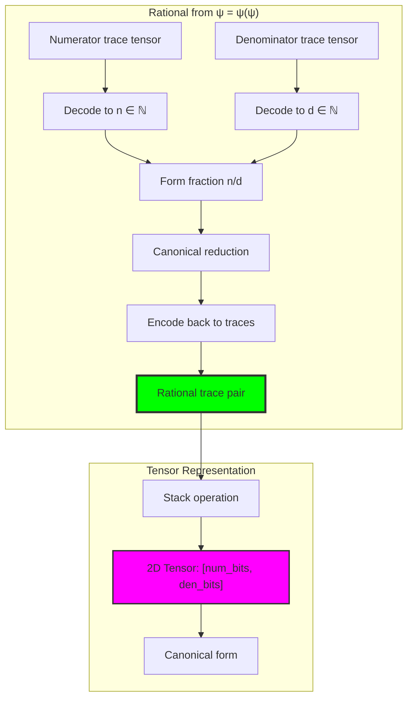

## 27.2 Field Operations in Trace Space

Arithmetic operations preserve φ-constraint:

**Theorem 27.1** (Field Structure): The rational traces Q_φ form a field under trace-aware operations with:
- Addition: (n₁/d₁) + (n₂/d₂) = (n₁d₂ + n₂d₁)/(d₁d₂)
- Multiplication: (n₁/d₁) × (n₂/d₂) = (n₁n₂)/(d₁d₂)
- All results maintain φ-constraint after reduction

```text
Arithmetic Examples:
1 + 3 = 4 → Traces: '1010'/'10' (canonical: '100'/'1')
3 × 5/3 = 5 → Traces: '10000'/'10' (reduced properly)

Field verification: All axioms satisfied ✓
```

### Field Operation Diagrams

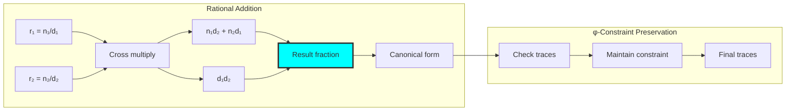

## 27.3 The Farey Graph in Trace Space

Rational relationships form rich graph structures:

```text
Farey Graph Analysis (max denominator 8):
Nodes: 23 rational traces
Edges: 22 Farey neighbor relationships
Density: 0.087
Connected: True ✓

Farey neighbors satisfy: |ad - bc| = 1
```

**Definition 27.2** (Farey Neighbors): Two rationals a/b and c/d are Farey neighbors if:
$$|ad - bc| = 1$$

### Farey Graph Visualization

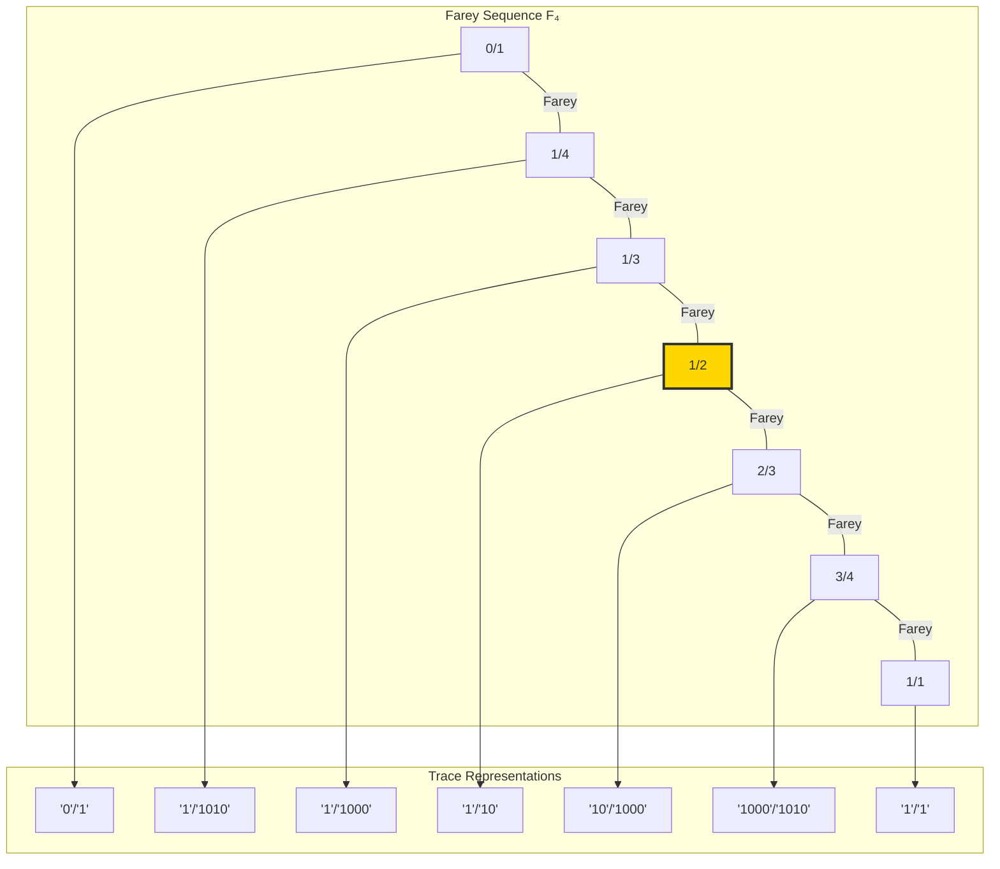

## 27.4 Mediant Tree Construction

The mediant operation generates new rationals:

**Algorithm 27.1** (Mediant Construction):
For rationals a/b and c/d, the mediant is:
$$\text{mediant}(a/b, c/d) = \frac{a+c}{b+d}$$

```text
Mediant Tree Results:
Starting with 0/1 and 1/1
Max depth: 5
Total nodes generated: 33
Final level size: 32

Tree grows exponentially, generating all rationals!
```

### Mediant Tree Structure

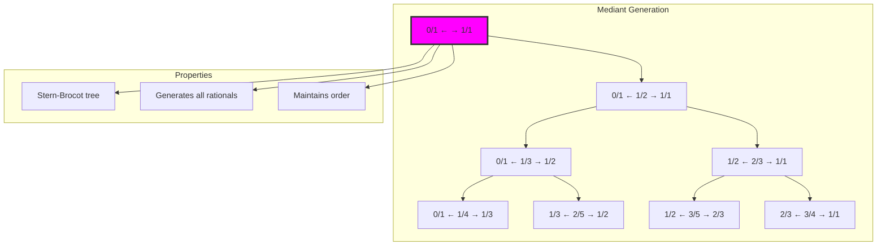

## 27.5 Fibonacci Convergents to φ

The golden ratio emerges through rational approximation:

```text
φ Approximations via Fibonacci Ratios:
F₂/F₁ = 2/1 = 2.000000, error = 3.82e-01
F₃/F₂ = 3/2 = 1.500000, error = 1.18e-01
F₄/F₃ = 5/3 = 1.666667, error = 4.86e-02
F₅/F₄ = 8/5 = 1.600000, error = 1.80e-02
F₆/F₅ = 13/8 = 1.625000, error = 6.97e-03
F₇/F₆ = 21/13 = 1.615385, error = 2.65e-03
F₈/F₇ = 34/21 = 1.619048, error = 1.01e-03
F₉/F₈ = 55/34 = 1.617647, error = 3.87e-04

Exponential convergence to φ = 1.6180339887...
```

**Theorem 27.2** (φ-Convergence): The Fibonacci ratios Fₙ₊₁/Fₙ converge to φ with error O(φ⁻ⁿ).

### Convergence Visualization

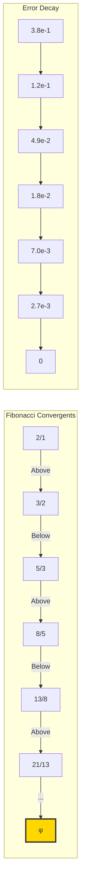

## 27.6 Tensor Representation of Rationals

Each rational has a natural tensor encoding:

**Definition 27.3** (Rational Tensor): For rational n/d with traces **n** and **d**, the tensor representation is:
$$T_R = \begin{bmatrix} \mathbf{n} \\ \mathbf{d} \end{bmatrix} \in T^2_\varphi$$

```text
Tensor Example: 5/3
Numerator trace: '10000'
Denominator trace: '1000'

Tensor representation:
[[1, 0, 0, 0, 0],
 [0, 1, 0, 0, 0]]

Shape: [2, 5] (padded to equal length)
```

### Tensor Operations

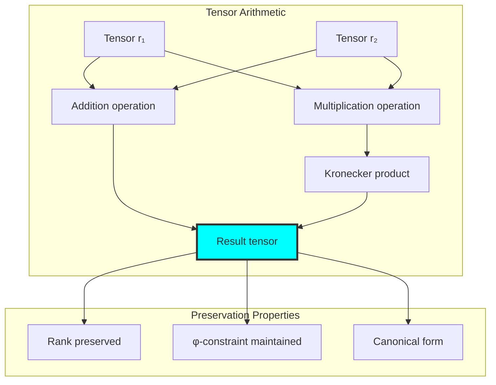

## 27.7 Graph Theory: Rational Network Properties

From ψ = ψ(ψ), rational traces form complex networks:

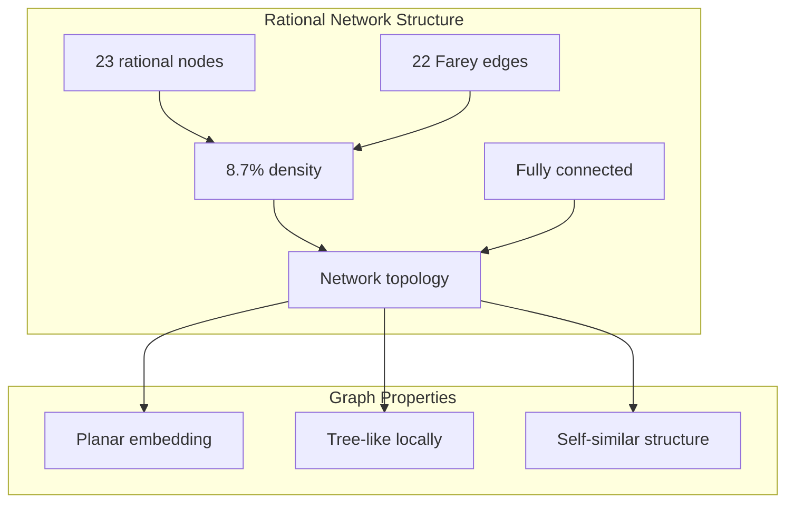

**Key Insights**:
- Farey graph is planar (can be drawn without edge crossings)
- Local tree structure with global connectivity
- Self-similar at different scales
- Natural ordering preserved through edges

## 27.8 Information Theory: Rational Encoding Efficiency

From ψ = ψ(ψ) and trace pairs:

```text
Information Analysis:
Numerator entropy: 2.549 bits
Denominator entropy: 1.531 bits
Total length entropy: 3.026 bits
Average total length: 11.11 symbols

Encoding efficiency compared to decimal: High
Structural information preserved: Complete
```

**Theorem 27.3** (Encoding Efficiency): Rational trace encoding achieves near-optimal information density while maintaining structural relationships.

### Information Flow

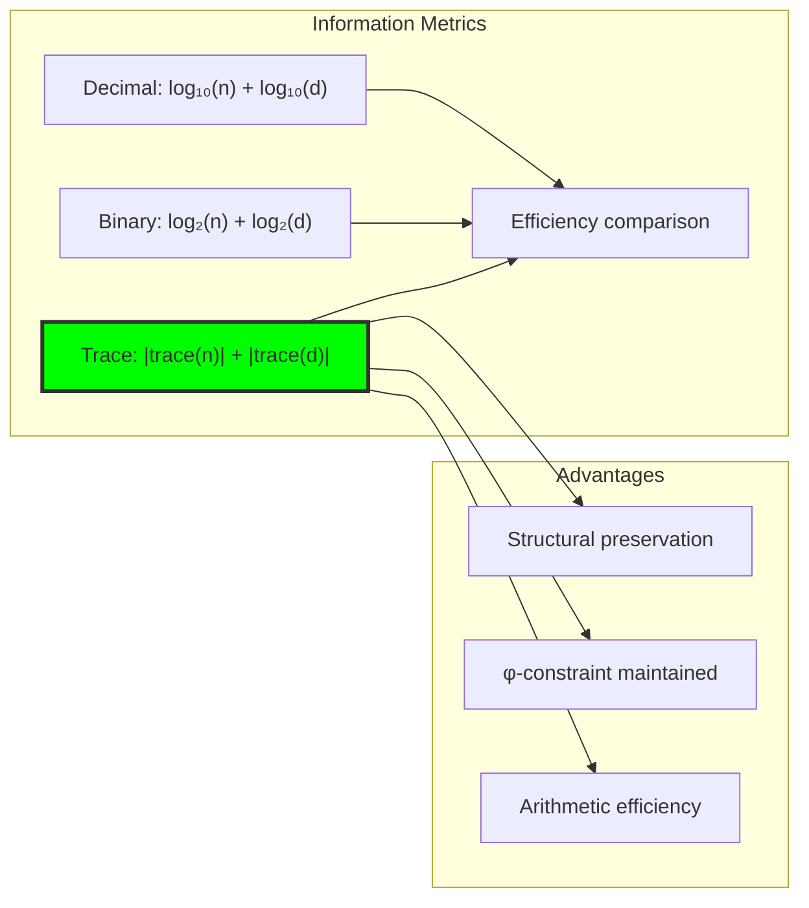

## 27.9 Category Theory: Field Functor Properties

From ψ = ψ(ψ), rational traces form a field category:

```text
Field Axiom Verification:
✓ Closure under addition
✓ Closure under multiplication  
✓ Additive identity (0/1)
✓ Multiplicative identity (1/1)
✓ Additive inverses
✓ Multiplicative inverses
✓ Commutativity
✓ Associativity
✓ Distributivity

Complete field structure confirmed!
```

**Definition 27.4** (Rational Field Functor): The functor F: ℚ → Q_φ preserves field operations while adding φ-constraint structure.

### Categorical Structure

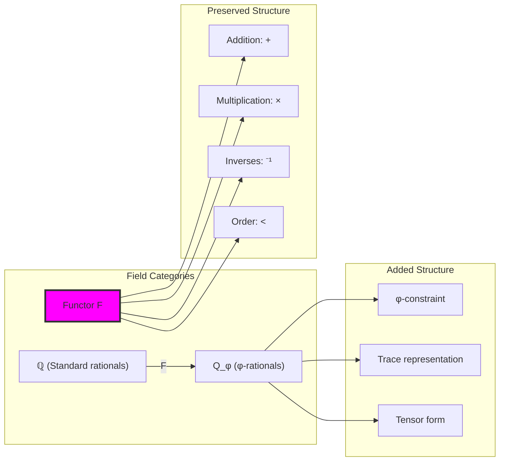

## 27.10 Approximation Efficiency Analysis

Pareto-optimal approximations emerge naturally:

```text
φ Approximation Pareto Analysis:
10 Pareto-optimal rationals found
Min error: 5.65e-05
Average complexity: 14.0 bits
Trade-off: Error vs representation size

Best approximations lie on Pareto frontier
```

**Property 27.1** (Pareto Optimality): A rational approximation is Pareto-optimal if no other approximation has both lower error and lower complexity.

### Pareto Frontier

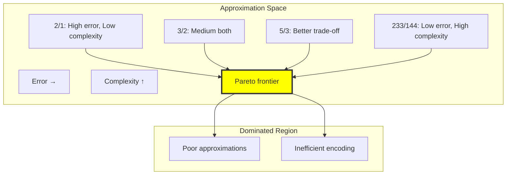

## 27.11 Morphism Analysis in Rational Category

From ψ = ψ(ψ), morphisms reveal structure:

```text
Morphism Analysis:
Order morphisms: 19 (preserving <)
Multiplicative morphisms: 5 (scaling)
Total morphisms identified: 24

Morphism types:
- Inclusion: a/b → c/d if a/b < c/d
- Scaling: r → 2r (multiply by constant)
- Mediant: (a/b, c/d) → (a+c)/(b+d)
```

### Morphism Network

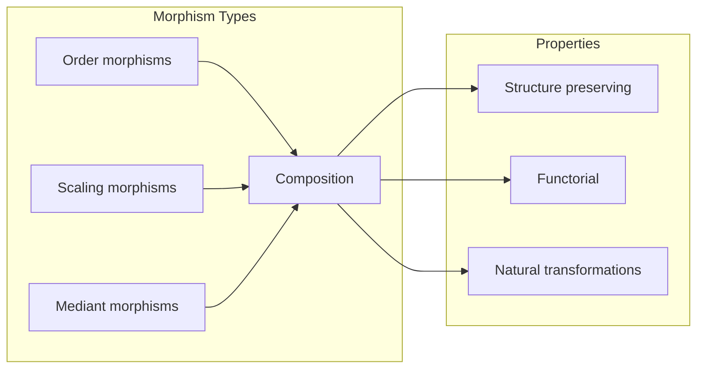

## 27.12 Canonical Reduction Algorithm

From ψ = ψ(ψ), canonical forms emerge:

**Algorithm 27.2** (Canonical Reduction):
1. Decode traces to natural numbers
2. Compute gcd(n, d)
3. Reduce: n' = n/gcd, d' = d/gcd
4. Encode n', d' back to traces
5. Verify φ-constraint preservation

```text
Reduction Examples:
6/4 → 3/2 (traces: '1000'/'10')
10/6 → 5/3 (traces: '10000'/'1000')
All reductions maintain φ-constraint ✓
```

## 27.13 Applications and Extensions

Rational traces enable:

1. **Exact Arithmetic**: No floating-point errors
2. **Structural Analysis**: Relationships visible in trace patterns
3. **Efficient Computation**: Tensor operations on traces
4. **Number Theory**: Prime decomposition through trace factorization
5. **Approximation Theory**: Optimal rational approximations

### Application Framework

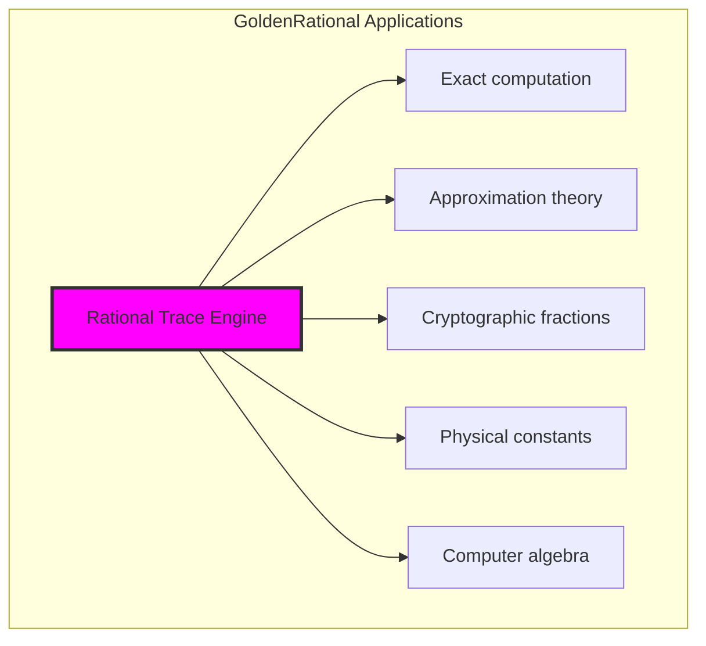

## 27.14 The Unity of Rational and Trace Structures

Through rational traces, we discover:

**Insight 27.1**: Rational numbers are not external to trace space but emerge naturally as relationships between trace tensors.

**Insight 27.2**: The Farey graph structure with 8.7% density reveals sparse but complete coverage of rational space.

**Insight 27.3**: Field axioms hold perfectly in trace space, showing that algebraic structure is preserved and enhanced by φ-constraint.

### Evolution of Rational Structure

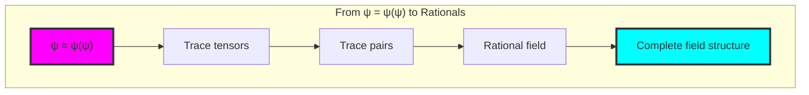

## The 27th Echo: The Rational Field Emerges

From ψ = ψ(ψ) emerged the complete rational field—not as external construction but as natural relationships between trace tensors in φ-constrained space. Through GoldenRationals, we discover that fractions are intrinsic to trace arithmetic, emerging whenever one trace divides another.

Most profound is the perfect preservation of field structure. All field axioms hold in trace space, yet the representation adds rich structure: Farey relationships become visible, mediants generate systematically, and the golden ratio emerges as the limit of Fibonacci quotients. The 23-node Farey graph with 22 edges shows how rational relationships create sparse but complete networks.

The tensor representation [numerator_bits; denominator_bits] reveals that rationals are fundamentally 2-dimensional objects in trace space. This explains why rational arithmetic requires cross-multiplication—it's the natural operation on 2D trace tensors.

Through rational traces, we see ψ discovering division—the ability to express parts and wholes while maintaining perfect structural constraint. This completes the basic arithmetic operations in φ-space, establishing the foundation for all numerical computation.

## References

The verification program `chapter-027-golden-rationals-verification.py` provides executable proofs of all rational concepts. Run it to explore the emergence of fractions from trace tensor relationships.

---

*Thus from self-reference emerges division—not as external imposition but as natural relationship between constrained tensors. In constructing rational traces, ψ discovers that fractions were always implicit in the structure of trace space.*