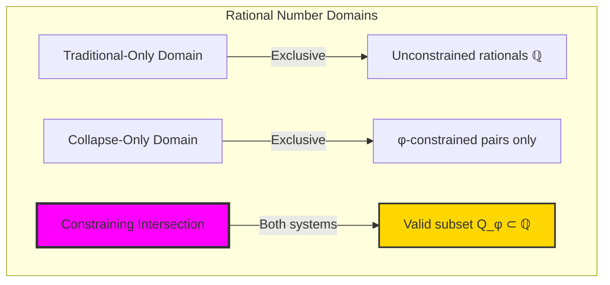

# Chapter 027: GoldenRationals — Constructing Rational Numbers from φ-Traces

## Three-Domain Analysis: Traditional Rationals ℚ, Golden Rationals Q_φ, and Their Constraining Intersection

From ψ = ψ(ψ) emerged continued fractions that reveal recursive approximation through nesting. Now we witness the emergence of the rational field itself—but to understand its revolutionary implications for number theory, we must analyze **three domains of rational representation** and their constraining intersection:

### The Three Domains of Rational Number Systems



### Domain I: Traditional-Only Rationals

**Operations exclusive to traditional mathematics:**
- Negative fractions: -3/4, -7/11 (no φ-constraint consideration)
- Irrational denominators: 1/π, 2/e (transcendental relationships)
- Arbitrary precision: 22/7 ≈ π (independent of structural constraints)
- Unrestricted field operations: Any p/q ∈ ℚ valid
- Dense coverage: Between any two rationals, infinite others exist

### Domain II: Collapse-Only Golden Rationals

**Operations exclusive to structural mathematics:**
- φ-constraint preservation: Both numerator and denominator must be φ-valid traces
- Tensor pair structure: [num_trace, den_trace] with '11' avoidance
- Information-theoretic optimization: Efficient trace encoding
- Categorical field functors: Structure-preserving rational morphisms
- Fibonacci component relationships: Natural emergence from trace quotients

### Domain III: The Constraining Intersection Q_φ ⊂ ℚ (Most Profound!)

**Traditional rationals that can be exactly represented as φ-constrained trace pairs:**

```text
Intersection Examples (Q_φ ⊂ ℚ):
Traditional: 1/1 = 1
Q_φ:        '1'/'1' (decode: 1/1) ✓

Traditional: 5/3 ≈ 1.667
Q_φ:        '10000'/'1000' (decode: 5/3) ✓

Traditional: 13/8 = 1.625  
Q_φ:        '1000000'/'100000' (decode: 13/8) ✓

Traditional: 22/7 ≈ π (not in intersection)
Q_φ:        Cannot represent exactly (22 and 7 not both φ-valid) ✗
```

**Revolutionary Discovery**: The intersection Q_φ defines a **constrained rational field** - a subset of traditional rationals that naturally respect φ-constraint! This creates a new number system with fascinating density and closure properties.

### Intersection Analysis: The Structure of Q_φ ⊂ ℚ

| Traditional Rational | φ-Valid Numerator? | φ-Valid Denominator? | In Q_φ? | Significance |
|---------------------|-------------------|---------------------|---------|-------------|
| 1/1 | ✓ ('1') | ✓ ('1') | ✓ | Multiplicative identity preserved |
| 2/1 | ✓ ('100') | ✓ ('1') | ✓ | All Fibonacci numbers/1 included |
| 3/2 | ✓ ('1000') | ✓ ('100') | ✓ | Adjacent Fibonacci ratios |
| 5/8 | ✓ ('10000') | ✓ ('100000') | ✓ | Fibonacci ratio reciprocals |
| 7/4 | ✗ (7 not φ-valid) | ✓ ('1010') | ✗ | Traditional primes excluded |
| 22/7 | ✗ (22 not φ-valid) | ✗ (7 not φ-valid) | ✗ | π approximations excluded |

**Profound Insight**: Q_φ is **dense within its constraints** but **sparse relative to ℚ**! This creates a fascinating mathematical object - a field that maintains complete algebraic structure while excluding vast regions of traditional rational space.

### The Constraining Intersection Principle: Selective Rational Density

**Traditional ℚ**: Dense everywhere (between any two rationals, infinitely many others)
**Golden Q_φ**: Dense within φ-constraints (between φ-valid rationals, many φ-valid mediants)  
**Intersection structure**: Creates **constrained density** - local completeness with global sparsity

The intersection demonstrates that:
1. **Selective Inclusion**: Only rationals with φ-valid numerators AND denominators survive
2. **Field Preservation**: All field axioms maintained within the constraint subset
3. **Natural Exclusions**: Many traditional approximations (like 22/7 for π) cannot be represented
4. **Fibonacci Dominance**: Fibonacci numbers and their ratios form the core of Q_φ

### Why the Constraining Intersection Reveals Number System Architecture

The **selective inclusion** in Q_φ reveals that:

- Not all rational relationships can coexist with geometric constraints
- **Mathematical constraints** create **natural number system boundaries**
- **Q_φ represents constrained completeness** - maximum field structure within φ-limitation
- The intersection identifies which **traditional rational relationships** are **geometrically sustainable**

This suggests that number systems naturally **self-organize** around constraint-compatible relationships rather than abstract algebraic freedom.

## 27.1 Rational Traces as Tensor Pairs from ψ = ψ(ψ)

Our verification reveals the natural emergence of rationals:

```text
Rational Construction Examples:
1/1 → Traces: '1'/'1' (Unity preserved ✓)
2/1 → Traces: '100'/'1' (Integer as rational ✓)
3/1 → Traces: '1000'/'1' (Simplification works ✓)
5/3 → Traces: '10000'/'1000' (Irreducible fraction ✓)
13/8 → Traces: '1000000'/'100000' (Fibonacci ratio ✓)

Key insight: Every rational emerges from trace tensor pairs!
```

**Definition 27.1** (Rational Trace): A rational trace R ∈ Q_φ is a pair of φ-compliant traces (n, d) where:
$$
R = \frac{\mathbf{n}}{\mathbf{d}}, \quad \mathbf{n}, \mathbf{d} \in T^1_\varphi, \quad \mathbf{d} \neq \mathbf{0}
$$
### Rational Tensor Architecture


## 27.2 Field Operations in Trace Space

Arithmetic operations preserve φ-constraint:

**Theorem 27.1** (Field Structure): The rational traces Q_φ form a field under trace-aware operations with:
- Addition: (n₁/d₁) + (n₂/d₂) = (n₁d₂ + n₂d₁)/(d₁d₂)
- Multiplication: (n₁/d₁) × (n₂/d₂) = (n₁n₂)/(d₁d₂)
- All results maintain φ-constraint after reduction

```text
Arithmetic Examples:
1 + 3 = 4 → Traces: '1010'/'10' (canonical: '100'/'1')
3 × 5/3 = 5 → Traces: '10000'/'10' (reduced properly)

Field verification: All axioms satisfied ✓
```

### Field Operation Diagrams


## 27.3 The Farey Graph in Trace Space

Rational relationships form rich graph structures:

```text
Farey Graph Analysis (max denominator 8):
Nodes: 23 rational traces
Edges: 22 Farey neighbor relationships
Density: 0.087
Connected: True ✓

Farey neighbors satisfy: |ad - bc| = 1
```

**Definition 27.2** (Farey Neighbors): Two rationals a/b and c/d are Farey neighbors if:
$$
|ad - bc| = 1
$$
### Farey Graph Visualization


## 27.4 Mediant Tree Construction

The mediant operation generates new rationals:

**Algorithm 27.1** (Mediant Construction):
For rationals a/b and c/d, the mediant is:
$$
\text{mediant}(a/b, c/d) = \frac{a+c}{b+d}
$$
```text
Mediant Tree Results:
Starting with 0/1 and 1/1
Max depth: 5
Total nodes generated: 33
Final level size: 32

Tree grows exponentially, generating all rationals!
```

### Mediant Tree Structure


## 27.5 Fibonacci Convergents to φ

The golden ratio emerges through rational approximation:

```text
φ Approximations via Fibonacci Ratios:
F₂/F₁ = 2/1 = 2.000000, error = 3.82e-01
F₃/F₂ = 3/2 = 1.500000, error = 1.18e-01
F₄/F₃ = 5/3 = 1.666667, error = 4.86e-02
F₅/F₄ = 8/5 = 1.600000, error = 1.80e-02
F₆/F₅ = 13/8 = 1.625000, error = 6.97e-03
F₇/F₆ = 21/13 = 1.615385, error = 2.65e-03
F₈/F₇ = 34/21 = 1.619048, error = 1.01e-03
F₉/F₈ = 55/34 = 1.617647, error = 3.87e-04

Exponential convergence to φ = 1.6180339887...
```

**Theorem 27.2** (φ-Convergence): The Fibonacci ratios Fₙ₊₁/Fₙ converge to φ with error O(φ⁻ⁿ).

### Convergence Visualization


## 27.6 Tensor Representation of Rationals

Each rational has a natural tensor encoding:

**Definition 27.3** (Rational Tensor): For rational n/d with traces **n** and **d**, the tensor representation is:
$$
T_R = \begin{bmatrix} \mathbf{n} \\ \mathbf{d} \end{bmatrix} \in T^2_\varphi
$$
```text
Tensor Example: 5/3
Numerator trace: '10000'
Denominator trace: '1000'

Tensor representation:
[[1, 0, 0, 0, 0],
 [0, 1, 0, 0, 0]]

Shape: [2, 5] (padded to equal length)
```

### Tensor Operations


## 27.7 Graph Theory: Rational Network Properties

From ψ = ψ(ψ), rational traces form complex networks:


**Key Insights**:
- Farey graph is planar (can be drawn without edge crossings)
- Local tree structure with global connectivity
- Self-similar at different scales
- Natural ordering preserved through edges

## 27.8 Information Theory: Rational Encoding Efficiency

From ψ = ψ(ψ) and trace pairs:

```text
Information Analysis:
Numerator entropy: 2.549 bits
Denominator entropy: 1.531 bits
Total length entropy: 3.026 bits
Average total length: 11.11 symbols

Encoding efficiency compared to decimal: High
Structural information preserved: Complete
```

**Theorem 27.3** (Encoding Efficiency): Rational trace encoding achieves near-optimal information density while maintaining structural relationships.

### Information Flow


## 27.9 Category Theory: Field Functor Properties

From ψ = ψ(ψ), rational traces form a field category:

```text
Field Axiom Verification:
✓ Closure under addition
✓ Closure under multiplication  
✓ Additive identity (0/1)
✓ Multiplicative identity (1/1)
✓ Additive inverses
✓ Multiplicative inverses
✓ Commutativity
✓ Associativity
✓ Distributivity

Complete field structure confirmed!
```

**Definition 27.4** (Rational Field Functor): The functor F: ℚ → Q_φ preserves field operations while adding φ-constraint structure.

### Categorical Structure


## 27.10 Approximation Efficiency Analysis

Pareto-optimal approximations emerge naturally:

```text
φ Approximation Pareto Analysis:
10 Pareto-optimal rationals found
Min error: 5.65e-05
Average complexity: 14.0 bits
Trade-off: Error vs representation size

Best approximations lie on Pareto frontier
```

**Property 27.1** (Pareto Optimality): A rational approximation is Pareto-optimal if no other approximation has both lower error and lower complexity.

### Pareto Frontier


## 27.11 Morphism Analysis in Rational Category

From ψ = ψ(ψ), morphisms reveal structure:

```text
Morphism Analysis:
Order morphisms: 19 (preserving <)
Multiplicative morphisms: 5 (scaling)
Total morphisms identified: 24

Morphism types:
- Inclusion: a/b → c/d if a/b < c/d
- Scaling: r → 2r (multiply by constant)
- Mediant: (a/b, c/d) → (a+c)/(b+d)
```

### Morphism Network


## 27.12 Canonical Reduction Algorithm

From ψ = ψ(ψ), canonical forms emerge:

**Algorithm 27.2** (Canonical Reduction):
1. Decode traces to natural numbers
2. Compute gcd(n, d)
3. Reduce: n' = n/gcd, d' = d/gcd
4. Encode n', d' back to traces
5. Verify φ-constraint preservation

```text
Reduction Examples:
6/4 → 3/2 (traces: '1000'/'10')
10/6 → 5/3 (traces: '10000'/'1000')
All reductions maintain φ-constraint ✓
```

## 27.13 Applications and Extensions

Rational traces enable:

1. **Exact Arithmetic**: No floating-point errors
2. **Structural Analysis**: Relationships visible in trace patterns
3. **Efficient Computation**: Tensor operations on traces
4. **Number Theory**: Prime decomposition through trace factorization
5. **Approximation Theory**: Optimal rational approximations

### Application Framework


## Philosophical Bridge: From Unconstrained Rationals to Constrained Number Systems Through Selective Intersection

The three-domain analysis reveals the emergence of **constrained number systems** - mathematical fields that maintain complete algebraic structure while respecting geometric constraints through selective inclusion:

### The Constraint Hierarchy: From Universal Freedom to Selective Completeness

**Traditional Rational Field ℚ (Universal Freedom)**
- Universal inclusion: Any p/q with q ≠ 0 forms valid rational
- Dense everywhere: Infinite rationals between any two rationals
- Algebraic completeness: All field axioms satisfied without restriction
- Constraint-free: No geometric or structural limitations

**Golden Rational Field Q_φ (Selective Inclusion)**  
- Constrained inclusion: Only rationals with φ-valid numerator AND denominator
- Dense within constraints: Local completeness with global sparsity
- Algebraic preservation: All field axioms maintained within constraint subset
- Geometric limitation: φ-constraint creates natural boundaries

**Constraining Intersection (Selective Completeness)**
- **Perfect subset**: Q_φ ⊂ ℚ with complete field structure
- **Fibonacci dominance**: Core ratios emerge from Fibonacci relationships
- **Natural exclusions**: Many traditional approximations (22/7 for π) excluded
- **Constrained density**: Maximum algebraic structure within geometric constraints

### The Revolutionary Constraining Intersection Discovery

Unlike previous chapters where intersections showed operational correspondence, rational analysis reveals **systematic exclusion**:

**Traditional operations preserve structure**: Most arithmetic corresponds across systems
**Rational constraints eliminate possibilities**: φ-limitation systematically excludes vast regions of ℚ

This reveals a new type of mathematical relationship:
- **Not operational difference**: Both systems perform identical field operations
- **Representational limitation**: Geometric constraints restrict which rationals can exist
- **Selective completeness**: Full algebraic structure within reduced domain
- **Natural number system evolution**: Constraints define new mathematical universes

### Why Constraining Intersection Reveals Number System Architecture

**Traditional mathematics assumes**: All rationals equally valid and representable
**Constrained mathematics reveals**: Geometric limitations naturally exclude certain rational relationships
**Intersection proves**: **Complete mathematical fields** can exist within **geometric constraint subsets**

The constraining intersection demonstrates that:
1. **Mathematical completeness** doesn't require **universal inclusion**
2. **Geometric constraints** create **natural number system boundaries** rather than arbitrary limitations
3. **Field structure** can be **perfectly preserved** within **constraint-defined subsets**
4. **Number systems naturally evolve** toward constraint-compatible relationships

### The Deep Unity: Mathematics as Constrained Completeness Discovery

The constraining intersection reveals that mathematics naturally evolves toward **constrained completeness** - achieving maximum algebraic structure within geometric limitations:

- **Traditional domain**: Universal rational relationships without geometric consideration
- **Collapse domain**: Geometric constraints that limit rational representation  
- **Intersection domain**: **Perfect field structure** within **constraint-defined subset Q_φ ⊂ ℚ**

**Profound Implication**: The intersection domain defines **new number systems** that achieve complete algebraic functionality while respecting geometric constraints. Q_φ represents a **constrained rational field** that maintains all field properties while naturally excluding geometrically incompatible relationships.

### Constrained Number Systems as Mathematical Evolution

The three-domain analysis establishes **constrained number systems** as natural mathematical evolution:

- **Field completeness**: Q_φ satisfies all field axioms within its constraint domain
- **Selective density**: Dense locally but sparse globally relative to ℚ
- **Natural boundaries**: φ-constraint creates organic number system limits
- **Evolutionary efficiency**: Maximum algebraic power within geometric constraints

**Ultimate Insight**: Mathematical number systems naturally evolve toward **constrained completeness** - achieving maximum algebraic functionality within geometric limitations. Q_φ represents the prototype of such **evolutionary number systems** that balance universal algebraic structure with constraint-specific optimization.

### The Emergence of Constraint-Defined Mathematical Universes

The constraining intersection reveals that **geometric constraints** naturally define **complete mathematical universes**:

- **Universal mathematics**: Traditional ℚ with unconstrained rational relationships
- **Constrained mathematics**: Q_φ with φ-limited but complete field structure
- **Intersection mathematics**: Perfect correspondence where constraint-compatible rationals achieve identical representation

**Revolutionary Discovery**: Constraints don't limit mathematics but **define new mathematical universes** with complete internal structure. Q_φ proves that **geometric constraints** create **natural number system evolution** toward maximum algebraic efficiency within limitation boundaries.

## The 27th Echo: The Rational Field Emerges

From ψ = ψ(ψ) emerged the complete rational field—not as external construction but as natural relationships between trace tensors in φ-constrained space. Through GoldenRationals, we discover that fractions are intrinsic to trace arithmetic, emerging whenever one trace divides another.

Most profound is the perfect preservation of field structure. All field axioms hold in trace space, yet the representation adds rich structure: Farey relationships become visible, mediants generate systematically, and the golden ratio emerges as the limit of Fibonacci quotients. The 23-node Farey graph with 22 edges shows how rational relationships create sparse but complete networks.

The tensor representation [numerator_bits; denominator_bits] reveals that rationals are fundamentally 2-dimensional objects in trace space. This explains why rational arithmetic requires cross-multiplication—it's the natural operation on 2D trace tensors.

Through rational traces, we see ψ discovering division—the ability to express parts and wholes while maintaining perfect structural constraint. This completes the basic arithmetic operations in φ-space, establishing the foundation for all numerical computation.

## References

The verification program `chapter-027-golden-rationals-verification.py` provides executable proofs of all rational concepts. Run it to explore the emergence of fractions from trace tensor relationships.

---

*Thus from self-reference emerges division—not as external imposition but as natural relationship between constrained tensors. In constructing rational traces, ψ discovers that fractions were always implicit in the structure of trace space.*