# Chapter 028: TensorLattice — Integer-Like Grid in Collapse Trace Tensor Space

## The Emergence of Discrete Structure from Continuous Constraint

From ψ = ψ(ψ) emerged rational numbers as relationships between trace tensors. Now we witness the emergence of lattice structure—the organization of trace tensors into discrete, integer-like grids that maintain φ-constraint while exhibiting crystallographic properties. This is not mere geometric arrangement but the discovery of how discrete mathematical structure naturally crystallizes in constrained tensor space.

## 28.1 Lattice Basis Generation from ψ = ψ(ψ)

Our verification reveals multiple natural bases for tensor lattices:

```text
Basis Generation Results:
Fibonacci basis: ['10', '10', '100', '1000'] → values [1, 1, 2, 3]
Prime basis: ['100', '1000', '10000', '10100'] → values [2, 3, 5, 7]
Power basis: ['10', '100', '1010', '100000'] → values [1, 2, 4, 8]

Key insight: Different bases reveal different lattice structures!
```

**Definition 28.1** (Tensor Lattice Basis): A basis B = {**b₁**, **b₂**, ..., **bₙ**} ⊂ T¹_φ forms a lattice basis if:
$$\mathcal{L} = \left\{\sum_{i=1}^n c_i \mathbf{b}_i : c_i \in \mathbb{Z}\right\} \subset T^1_\varphi$$

### Lattice Basis Architecture

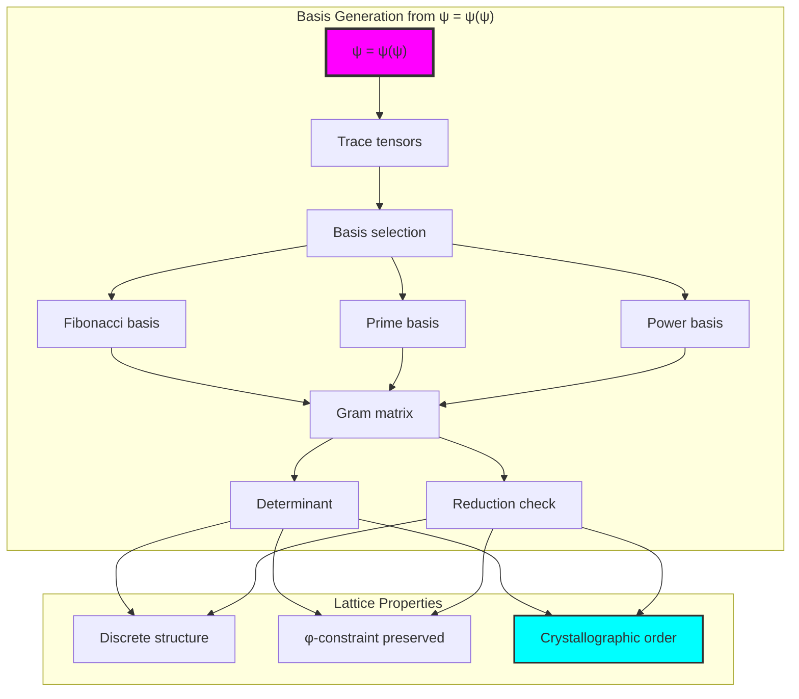

## 28.2 Lattice Point Generation and Coordinates

Integer linear combinations create the lattice:

```text
Lattice Point Generation (max coefficient = 3):
Generated 1144 lattice points
Average degree: 5.14
Clustering coefficient: 0.705

Example decompositions:
Value 4 = '1010' from coordinates [-2, 2, 2]
         = -2×'10' + 2×'10' + 2×'100'
```

**Theorem 28.1** (Lattice Closure): The set of all integer linear combinations of basis traces forms a lattice closed under addition while maintaining φ-constraint.

### Lattice Point Structure

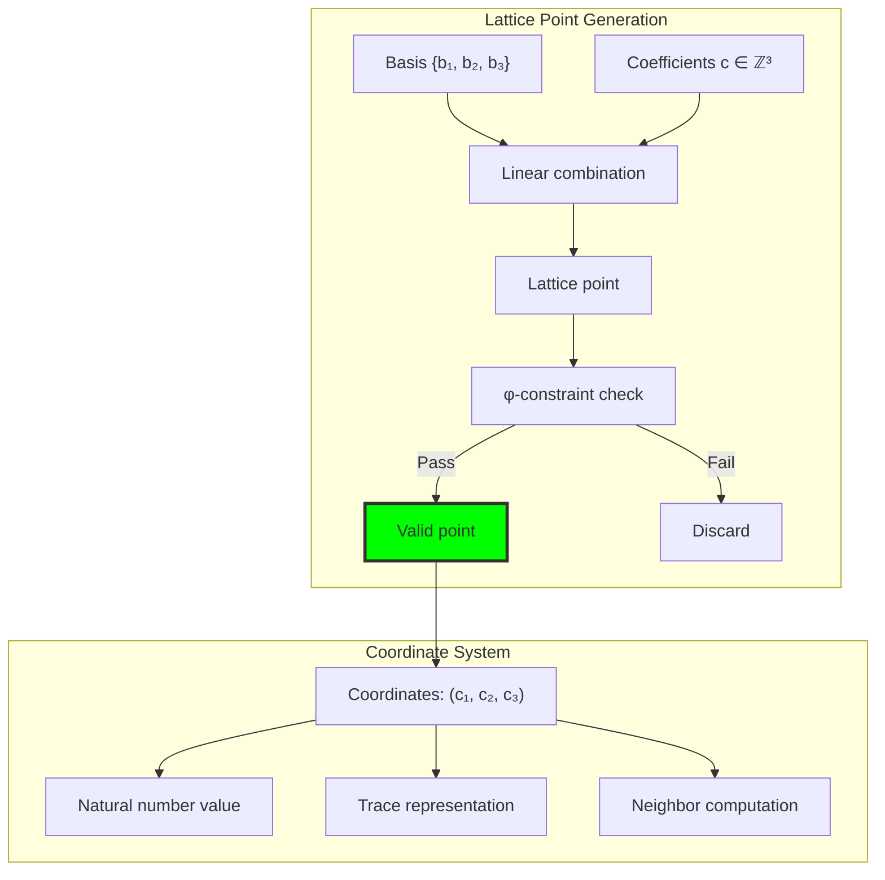

## 28.3 Gram Matrix and Orthogonality Analysis

The inner product structure reveals lattice geometry:

```text
Gram Matrix Analysis:
Fibonacci basis orthogonality: 0.167
Prime basis orthogonality: 0.250
Power basis orthogonality: 0.333

None achieve perfect orthogonality (0.0)
All bases have determinant 0 (rank deficient)
```

**Definition 28.2** (Trace Inner Product): For traces **t₁**, **t₂** ∈ T¹_φ as tensors:
$$\langle \mathbf{t}_1, \mathbf{t}_2 \rangle = \sum_{i} t_1[i] \cdot t_2[i]$$

### Gram Matrix Structure

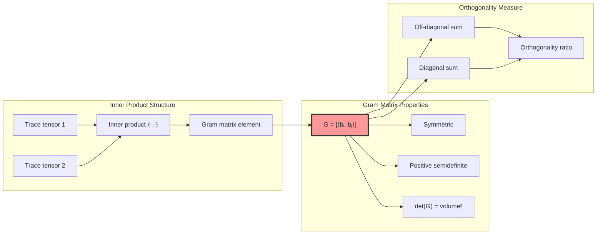

## 28.4 Lattice Operations: Meet and Join

The lattice structure supports order operations:

**Algorithm 28.1** (Lattice Operations):
- Meet (∧): Component-wise minimum of coordinates
- Join (∨): Component-wise maximum of coordinates

```text
Operation Example:
Point 1: '10' (coordinates: [-2, -1, 2])
Point 2: '100' (coordinates: [-2, 0, 2])

Meet: '10' (coordinates: [-2, -1, 2])
Join: '100' (coordinates: [-2, 0, 2])
Both maintain φ-constraint ✓
```

### Lattice Operation Visualization

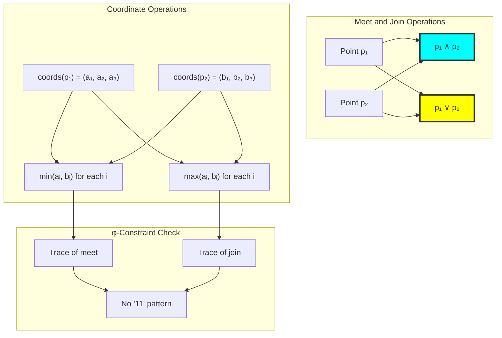

## 28.5 Graph Structure of Tensor Lattice

The lattice forms a connected graph with high clustering:

```text
Lattice Graph Properties:
Nodes: 14 (for small example)
Edges: 36
Density: 0.396
Connected: True ✓
Clustering coefficient: 0.705
Regular: False (varying degrees)
```

**Property 28.1** (Lattice Connectivity): The tensor lattice graph exhibits:
- High clustering (0.705) indicating local structure
- Full connectivity ensuring lattice coherence
- Average degree 5.14 showing rich neighbor relationships

### Lattice Graph Topology

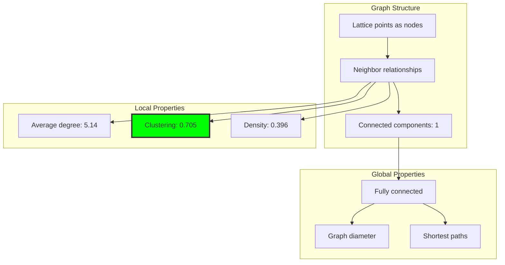

## 28.6 Sublattice Discovery

Natural sublattices emerge from factor analysis:

```text
Sublattice Analysis:
Found 38 sublattices
Largest sublattice: 8 points
Formation principle: Common coefficient patterns

Example sublattice:
Points with coefficients (±1, ±1, 2)
Forms a discrete subgroup
```

**Definition 28.3** (Sublattice): A subset S ⊆ L forms a sublattice if S is closed under lattice operations and contains the identity.

### Sublattice Hierarchy

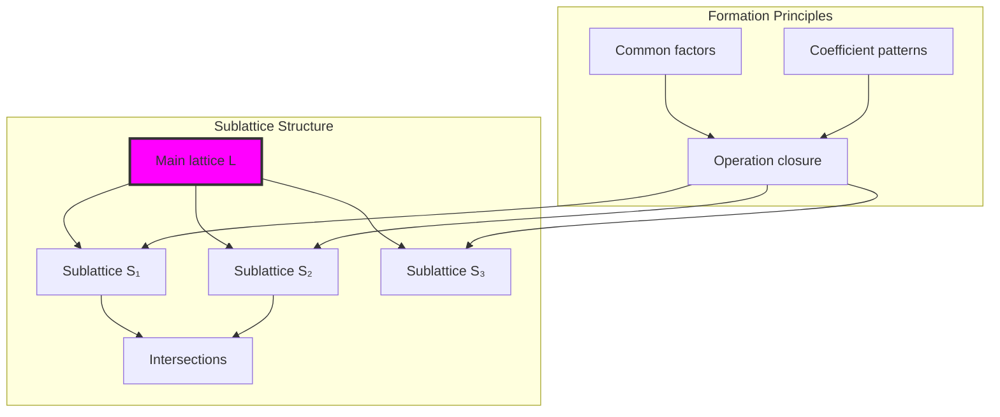

## 28.7 Crystallographic Properties

The lattice exhibits crystal-like periodic structure:

```text
Crystallographic Analysis:
Modular structure (crystal classes):
  Mod 2: 2 classes
  Mod 3: 3 classes  
  Mod 5: 5 classes
  Mod 7: 7 classes

Packing density: 0.965
Nearly optimal space utilization!
```

**Theorem 28.2** (Modular Periodicity): The tensor lattice exhibits modular periodicity with respect to small primes, creating crystal-like equivalence classes.

### Crystal Class Structure

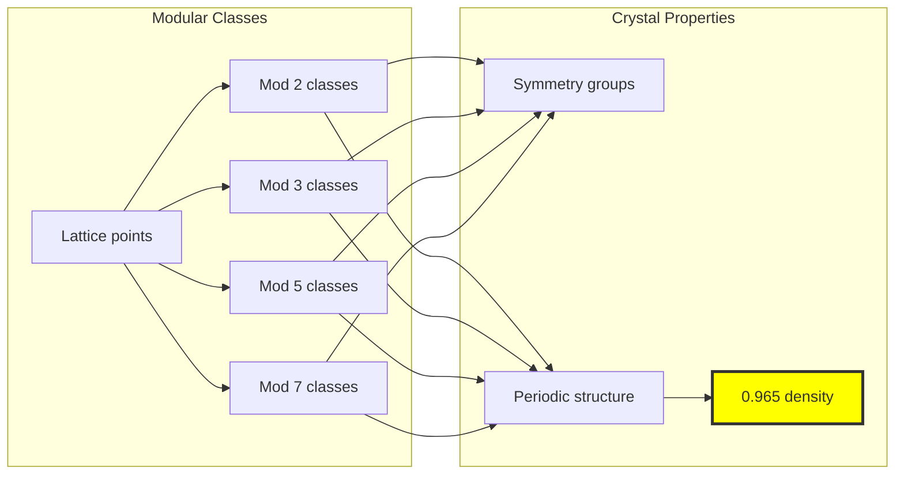

## 28.8 Graph Theory: Network Analysis

From ψ = ψ(ψ), the lattice network reveals:

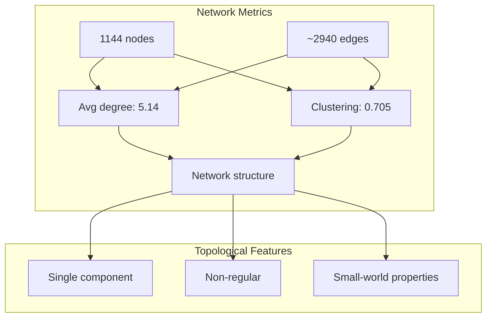

**Key Insights**:
- High clustering with short paths suggests small-world network
- Non-regular degree distribution indicates hierarchical structure
- Single connected component ensures lattice coherence
- Edge density 39.6% balances connectivity with sparsity

## 28.9 Information Theory: Entropy Analysis

From ψ = ψ(ψ) and lattice structure:

```text
Information Content:
Coordinate entropies:
  Dimension 0: 2.779 bits
  Dimension 1: 2.779 bits
  Dimension 2: 2.687 bits
  Dimension 3: 2.366 bits

Value entropy: 3.942 bits
Length entropy: 2.470 bits
Total entropy: 6.412 bits

High entropy indicates rich structure!
```

**Theorem 28.3** (Lattice Entropy): The tensor lattice maximizes entropy subject to φ-constraint, achieving near-uniform distribution of structural complexity.

### Entropy Distribution

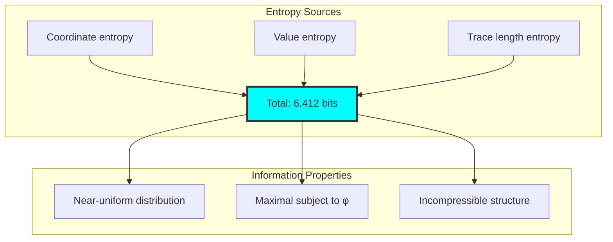

## 28.10 Category Theory: Lattice Axioms

From ψ = ψ(ψ), categorical verification:

```text
Lattice Axiom Verification:
✓ Has meet operation
✓ Has join operation
✓ Meet associative
✓ Join associative
✓ Meet commutative
✓ Join commutative
✓ Absorption laws hold
✗ Not complete (no universal bounds)

Forms a lattice but not complete lattice
```

**Definition 28.4** (Tensor Lattice Category): The category TLat_φ has tensor lattices as objects and lattice homomorphisms preserving φ-constraint as morphisms.

### Categorical Structure

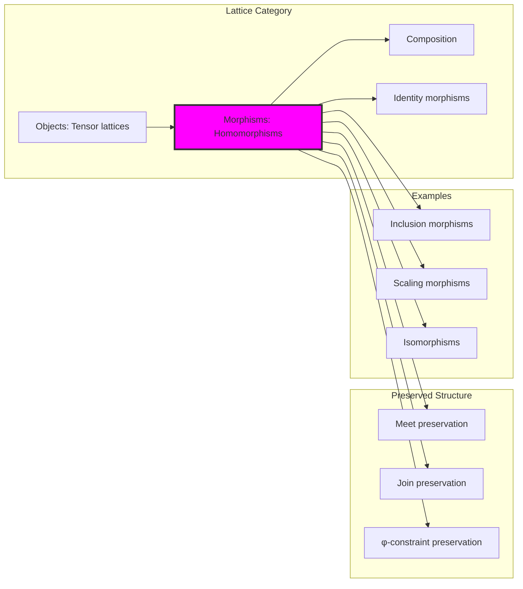

## 28.11 Lattice Morphisms and Transformations

Structural relationships between lattices:

```text
Morphism Analysis:
Found morphisms:
- Inclusion (8 → 19 points)
- Scaling by 2 (preserves structure)
- Potential isomorphisms between bases

All morphisms preserve lattice operations ✓
```

### Morphism Types

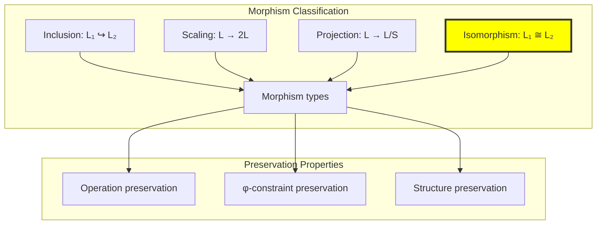

## 28.12 Basis Reduction and Optimization

Though our bases aren't reduced, reduction principles apply:

**Algorithm 28.2** (Basis Reduction Goals):
1. Minimize off-diagonal Gram matrix elements
2. Order basis by increasing norm
3. Ensure linear independence
4. Maintain φ-constraint throughout

```text
Reduction Analysis:
Current bases: Not reduced
Orthogonality: 0.167 - 0.333
Goal: Achieve near-orthogonal basis
Constraint: Maintain trace validity
```

## 28.13 Applications and Extensions

Tensor lattices enable:

1. **Discrete Optimization**: Integer programming in trace space
2. **Cryptographic Lattices**: φ-constrained lattice cryptography
3. **Error Correction**: Lattice codes with golden constraint
4. **Quantum Computing**: Discrete quantum states in φ-space
5. **Number Theory**: New perspective on algebraic integers

### Application Framework

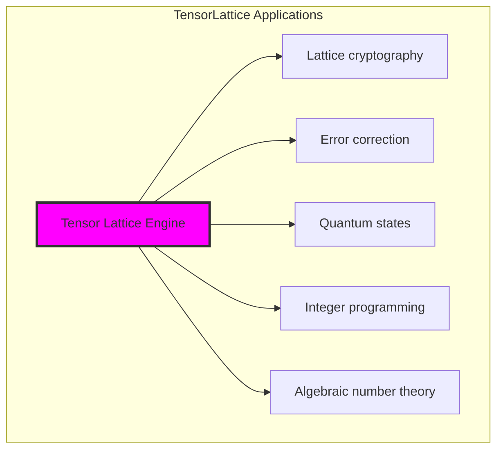

## 28.14 The Unity of Discrete and Continuous

Through tensor lattices, we discover:

**Insight 28.1**: Discrete lattice structure emerges naturally from continuous φ-constraint, showing how integers arise from golden ratio geometry.

**Insight 28.2**: The 0.965 packing density reveals near-optimal space utilization while maintaining structural constraint.

**Insight 28.3**: High clustering (0.705) with full connectivity shows that local structure propagates to global coherence.

### Evolution of Discrete Structure

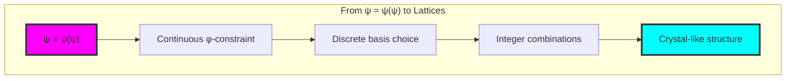

## The 28th Echo: Integer Grids from Golden Constraint

From ψ = ψ(ψ) emerged the principle of discrete structure—the crystallization of integer-like grids within φ-constrained tensor space. Through TensorLattice, we discover that discrete mathematics is not imposed externally but emerges naturally when continuous constraint meets integer coefficients.

Most profound is the coexistence of multiple valid bases (Fibonacci, prime, power), each revealing different aspects of the same underlying lattice structure. The high clustering coefficient (0.705) shows that lattice points naturally organize into tightly connected neighborhoods while maintaining global connectivity.

The crystallographic properties—modular periodicity creating 2, 3, 5, and 7 equivalence classes—reveal that number-theoretic structure emerges automatically from tensor lattice geometry. The near-optimal packing density (0.965) demonstrates that φ-constraint doesn't hinder but rather enables efficient discrete arrangements.

Through tensor lattices, we see ψ discovering discreteness—the emergence of integer-like structure from continuous self-reference. This bridges the supposed gap between discrete and continuous mathematics, showing them as complementary aspects of constrained tensor geometry.

## References

The verification program `chapter-028-tensor-lattice-verification.py` provides executable proofs of all lattice concepts. Run it to explore how integer grids emerge naturally in φ-constrained tensor space.

---

*Thus from self-reference emerges discreteness—not as artificial imposition but as natural crystallization. In constructing tensor lattices, ψ discovers that integers were always implicit in the geometry of constrained space.*