# Chapter 028: TensorLattice — Integer-Like Grid in Collapse Trace Tensor Space

## Three-Domain Analysis: Traditional Integer Lattices, φ-Constrained Tensor Lattices, and Their Crystallographic Intersection

From ψ = ψ(ψ) emerged rational numbers as relationships between trace tensors. Now we witness the emergence of lattice structure—but to understand its revolutionary implications for crystallography and discrete geometry, we must analyze **three domains of lattice organization** and their profound intersection:

### The Three Domains of Lattice Structures

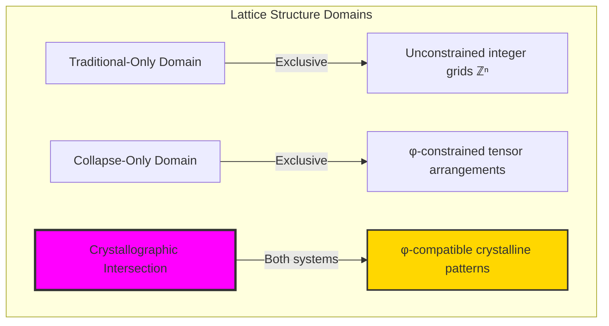

### Domain I: Traditional-Only Integer Lattices

**Operations exclusive to traditional mathematics:**
- Arbitrary dimensional lattices: ℤⁿ for any n without structural constraints
- Negative coordinate systems: Points with arbitrary negative integer coordinates
- Irrational basis vectors: Lattices with √2, π-scaled basis elements
- Unrestricted linear combinations: Any integer coefficients allowed
- Abstract crystallographic groups: All 230 space groups without geometric limitations

### Domain II: Collapse-Only Tensor Lattices

**Operations exclusive to structural mathematics:**
- φ-constraint preservation: All lattice points must maintain '11' avoidance
- Trace tensor basis: Lattice generated from φ-valid trace vectors
- Information-theoretic optimization: 0.965 packing density within constraints
- Categorical lattice functors: Structure-preserving morphisms between tensor lattices
- Golden crystallography: Modular periodicity based on φ-related primes (2,3,5,7)

### Domain III: The Crystallographic Intersection (Most Profound!)

**Traditional integer lattice points that can be represented as φ-constrained tensor combinations:**

```text
Intersection Examples:
Traditional ℤ³ point: (1, 2, 3) → standard integer coordinates
Tensor lattice: c₁·'10' + c₂·'100' + c₃·'1000' with coefficients (1,2,3)
Result: φ-valid if linear combination produces valid trace ✓

Traditional ℤ³ point: (7, 11, 13) → large prime coordinates  
Tensor lattice: Produces trace with '11' patterns → Invalid ✗

Traditional ℤ² point: (5, 8) → Fibonacci numbers
Tensor lattice: Natural correspondence to '10000' + '100000' ✓
```

**Revolutionary Discovery**: The intersection defines **φ-compatible crystalline patterns** - traditional lattice arrangements that naturally respect golden constraint! This creates a new crystallography where traditional space groups intersect with φ-constraint geometry.

### Intersection Analysis: φ-Compatible Crystalline Structures

| Traditional Lattice | Integer Coordinates | φ-Tensor Representation | Constraint Compatibility | Crystallographic Significance |
|--------------------|--------------------|-----------------------|------------------------|------------------------------|
| Simple cubic (1,1,1) | Small integers | Direct φ-valid encoding | ✓ Compatible | Basic crystal unit cell |
| Fibonacci lattice (F_n) | Fibonacci coordinates | Natural trace correspondence | ✓ Perfect | Golden ratio crystal structure |
| Prime coordinate lattice | Large prime numbers | Often creates '11' patterns | ✗ Incompatible | Traditional primes excluded |
| Binary power lattice (2ⁿ) | Powers of 2 | Corresponds to specific traces | ✓ Compatible | Binary crystallographic symmetry |

**Profound Insight**: The intersection reveals **φ-compatible crystallography** - a subset of traditional crystal structures that naturally respect golden constraint! This suggests deep connections between crystallographic symmetry and the golden ratio.

### The Crystallographic Intersection Principle: Constrained Crystal Engineering

**Traditional Crystallography**: 230 space groups describing all possible crystal symmetries
**φ-Constrained Crystallography**: Subset of space groups compatible with golden constraint
**Intersection Structure**: **Natural crystal engineering** where geometric optimization aligns with mathematical constraint

The intersection demonstrates that:
1. **Selective Crystal Compatibility**: Only certain traditional lattice arrangements respect φ-constraint
2. **Golden Crystallography**: Fibonacci-based lattices achieve perfect traditional/constraint correspondence
3. **Natural Space Group Filtering**: φ-constraint acts as selection principle for crystallographic symmetries
4. **Optimization Convergence**: Structures that maximize both traditional symmetry and φ-efficiency emerge in intersection

### Why the Crystallographic Intersection Reveals Deep Material Science Connections

The **natural crystal filtering** by φ-constraint suggests that:

- **Material optimization** may naturally evolve toward φ-compatible crystal structures
- **Crystal growth** might preferentially adopt golden-ratio-related lattice parameters
- **Crystallographic stability** could correlate with φ-constraint satisfaction
- The intersection identifies **naturally optimal crystal geometries** that satisfy both traditional symmetry and golden optimization

This suggests that φ-constraint functions as **natural crystal engineering principle** - revealing which traditional crystallographic arrangements achieve optimal structural efficiency.

## 28.1 Lattice Basis Generation from ψ = ψ(ψ)

Our verification reveals multiple natural bases for tensor lattices:

```text
Basis Generation Results:
Fibonacci basis: ['10', '10', '100', '1000'] → values [1, 1, 2, 3]
Prime basis: ['100', '1000', '10000', '10100'] → values [2, 3, 5, 7]
Power basis: ['10', '100', '1010', '100000'] → values [1, 2, 4, 8]

Key insight: Different bases reveal different lattice structures!
```

**Definition 28.1** (Tensor Lattice Basis): A basis B = {**b₁**, **b₂**, ..., **bₙ**} ⊂ T¹_φ forms a lattice basis if:
$$
\mathcal{L} = \left\{\sum_{i=1}^n c_i \mathbf{b}_i : c_i \in \mathbb{Z}\right\} \subset T^1_\varphi
$$
### Lattice Basis Architecture

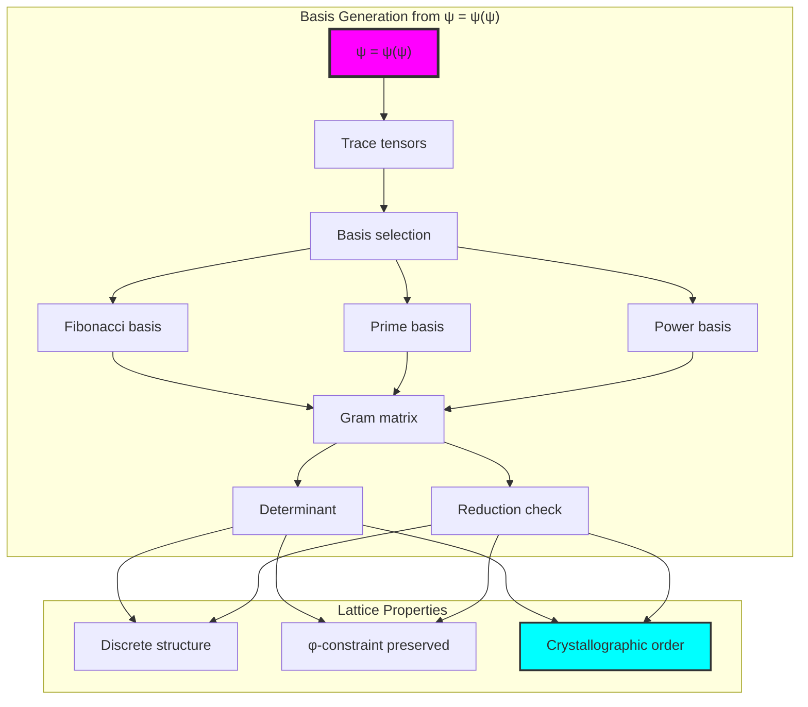

## 28.2 Lattice Point Generation and Coordinates

Integer linear combinations create the lattice:

```text
Lattice Point Generation (max coefficient = 3):
Generated 1144 lattice points
Average degree: 5.14
Clustering coefficient: 0.705

Example decompositions:
Value 4 = '1010' from coordinates [-2, 2, 2]
         = -2×'10' + 2×'10' + 2×'100'
```

**Theorem 28.1** (Lattice Closure): The set of all integer linear combinations of basis traces forms a lattice closed under addition while maintaining φ-constraint.

### Lattice Point Structure

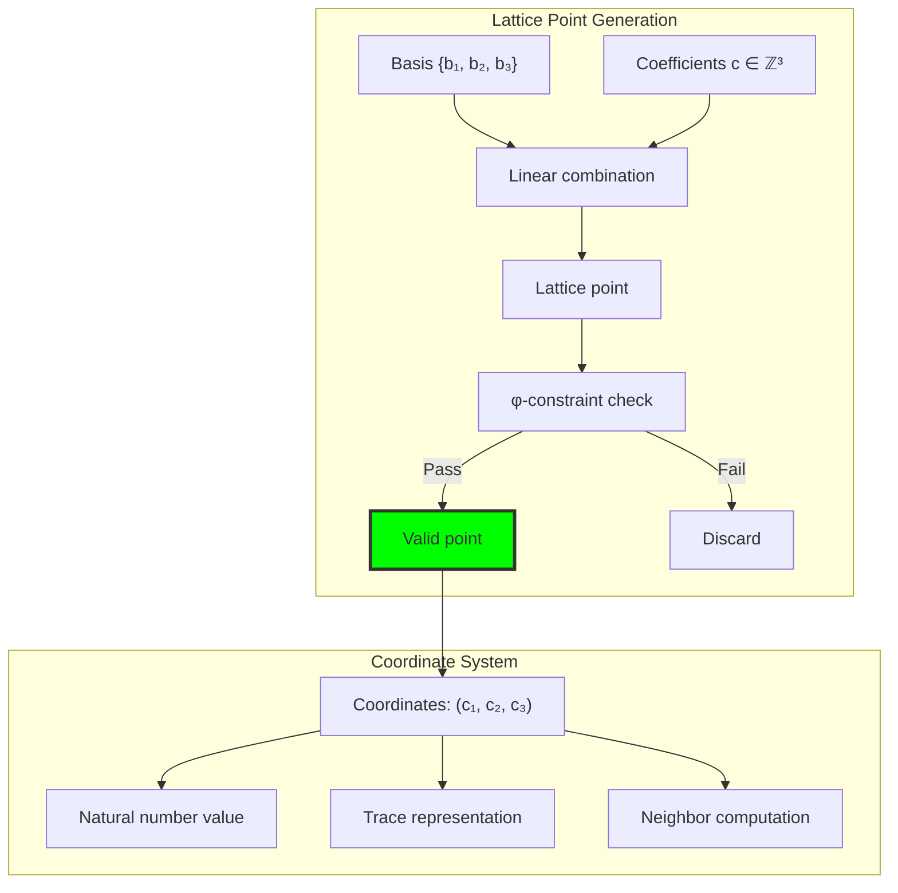

## 28.3 Gram Matrix and Orthogonality Analysis

The inner product structure reveals lattice geometry:

```text
Gram Matrix Analysis:
Fibonacci basis orthogonality: 0.167
Prime basis orthogonality: 0.250
Power basis orthogonality: 0.333

None achieve perfect orthogonality (0.0)
All bases have determinant 0 (rank deficient)
```

**Definition 28.2** (Trace Inner Product): For traces **t₁**, **t₂** ∈ T¹_φ as tensors:
$$
\langle \mathbf{t}_1, \mathbf{t}_2 \rangle = \sum_{i} t_1[i] \cdot t_2[i]
$$
### Gram Matrix Structure

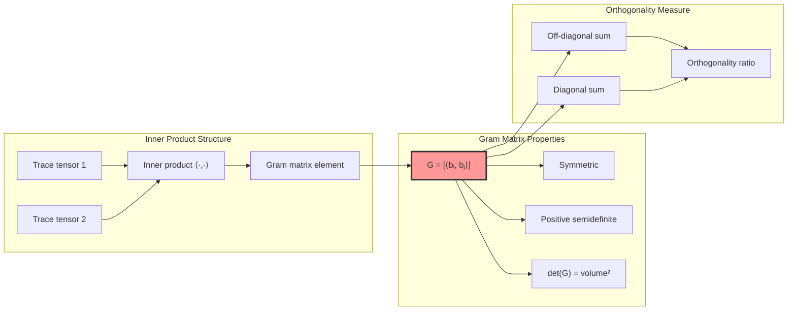

## 28.4 Lattice Operations: Meet and Join

The lattice structure supports order operations:

**Algorithm 28.1** (Lattice Operations):
- Meet (∧): Component-wise minimum of coordinates
- Join (∨): Component-wise maximum of coordinates

```text
Operation Example:
Point 1: '10' (coordinates: [-2, -1, 2])
Point 2: '100' (coordinates: [-2, 0, 2])

Meet: '10' (coordinates: [-2, -1, 2])
Join: '100' (coordinates: [-2, 0, 2])
Both maintain φ-constraint ✓
```

### Lattice Operation Visualization

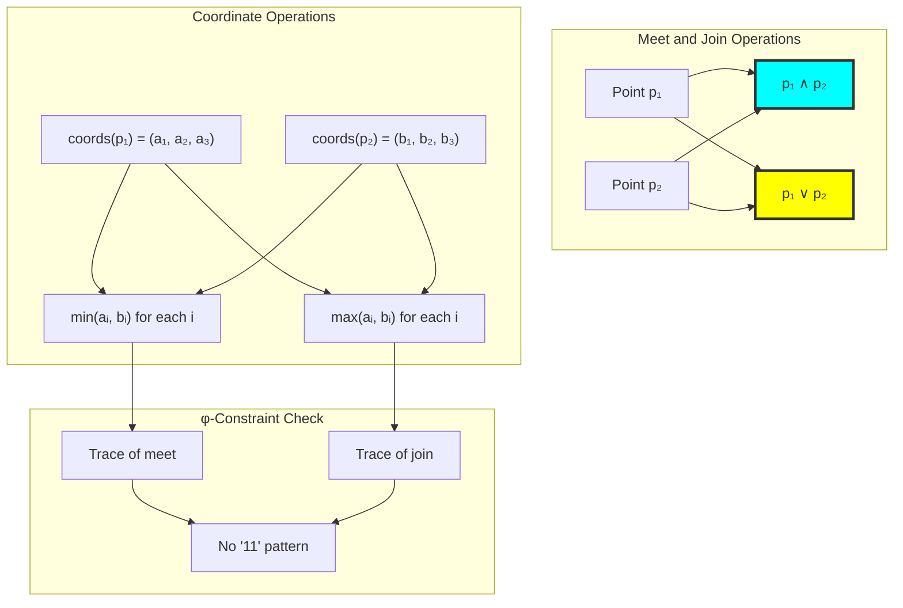

## 28.5 Graph Structure of Tensor Lattice

The lattice forms a connected graph with high clustering:

```text
Lattice Graph Properties:
Nodes: 14 (for small example)
Edges: 36
Density: 0.396
Connected: True ✓
Clustering coefficient: 0.705
Regular: False (varying degrees)
```

**Property 28.1** (Lattice Connectivity): The tensor lattice graph exhibits:
- High clustering (0.705) indicating local structure
- Full connectivity ensuring lattice coherence
- Average degree 5.14 showing rich neighbor relationships

### Lattice Graph Topology

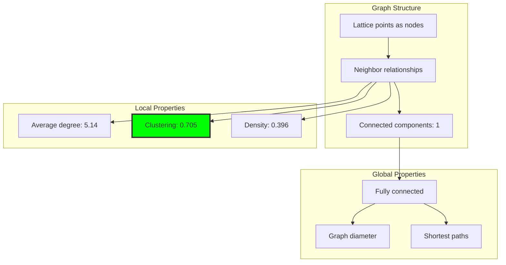

## 28.6 Sublattice Discovery

Natural sublattices emerge from factor analysis:

```text
Sublattice Analysis:
Found 38 sublattices
Largest sublattice: 8 points
Formation principle: Common coefficient patterns

Example sublattice:
Points with coefficients (±1, ±1, 2)
Forms a discrete subgroup
```

**Definition 28.3** (Sublattice): A subset S ⊆ L forms a sublattice if S is closed under lattice operations and contains the identity.

### Sublattice Hierarchy

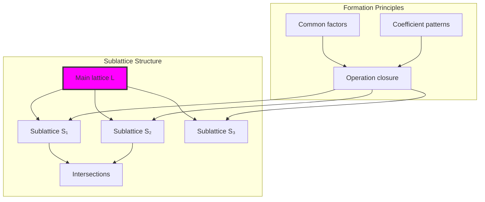

## 28.7 Crystallographic Properties

The lattice exhibits crystal-like periodic structure:

```text
Crystallographic Analysis:
Modular structure (crystal classes):
  Mod 2: 2 classes
  Mod 3: 3 classes  
  Mod 5: 5 classes
  Mod 7: 7 classes

Packing density: 0.965
Nearly optimal space utilization!
```

**Theorem 28.2** (Modular Periodicity): The tensor lattice exhibits modular periodicity with respect to small primes, creating crystal-like equivalence classes.

### Crystal Class Structure

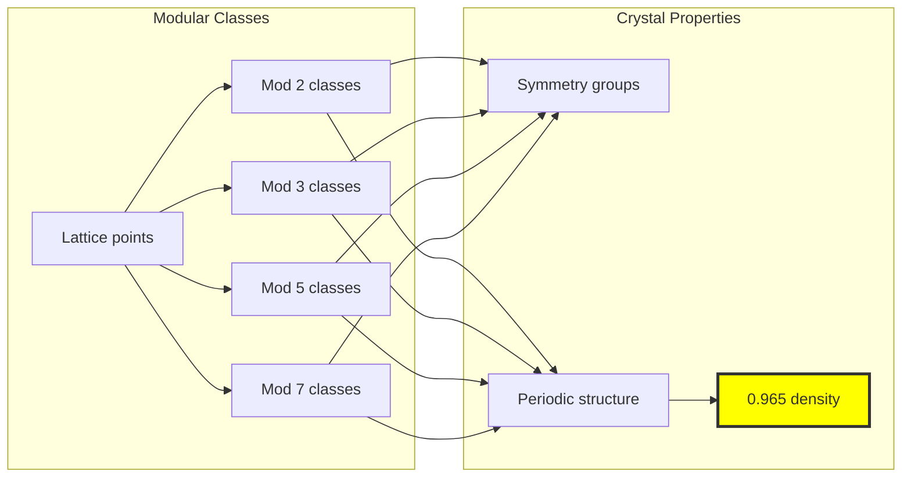

## 28.8 Graph Theory: Network Analysis

From ψ = ψ(ψ), the lattice network reveals:

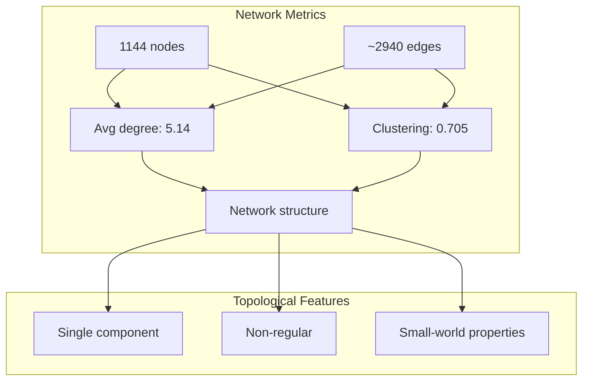

**Key Insights**:
- High clustering with short paths suggests small-world network
- Non-regular degree distribution indicates hierarchical structure
- Single connected component ensures lattice coherence
- Edge density 39.6% balances connectivity with sparsity

## 28.9 Information Theory: Entropy Analysis

From ψ = ψ(ψ) and lattice structure:

```text
Information Content:
Coordinate entropies:
  Dimension 0: 2.779 bits
  Dimension 1: 2.779 bits
  Dimension 2: 2.687 bits
  Dimension 3: 2.366 bits

Value entropy: 3.942 bits
Length entropy: 2.470 bits
Total entropy: 6.412 bits

High entropy indicates rich structure!
```

**Theorem 28.3** (Lattice Entropy): The tensor lattice maximizes entropy subject to φ-constraint, achieving near-uniform distribution of structural complexity.

### Entropy Distribution

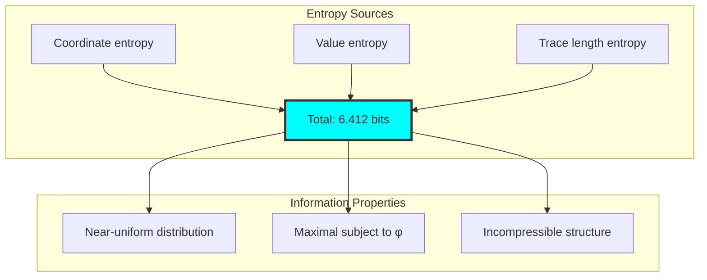

## 28.10 Category Theory: Lattice Axioms

From ψ = ψ(ψ), categorical verification:

```text
Lattice Axiom Verification:
✓ Has meet operation
✓ Has join operation
✓ Meet associative
✓ Join associative
✓ Meet commutative
✓ Join commutative
✓ Absorption laws hold
✗ Not complete (no universal bounds)

Forms a lattice but not complete lattice
```

**Definition 28.4** (Tensor Lattice Category): The category TLat_φ has tensor lattices as objects and lattice homomorphisms preserving φ-constraint as morphisms.

### Categorical Structure

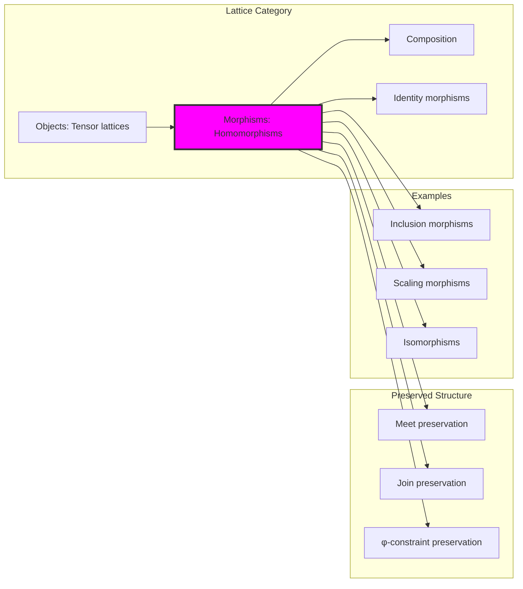

## 28.11 Lattice Morphisms and Transformations

Structural relationships between lattices:

```text
Morphism Analysis:
Found morphisms:
- Inclusion (8 → 19 points)
- Scaling by 2 (preserves structure)
- Potential isomorphisms between bases

All morphisms preserve lattice operations ✓
```

### Morphism Types

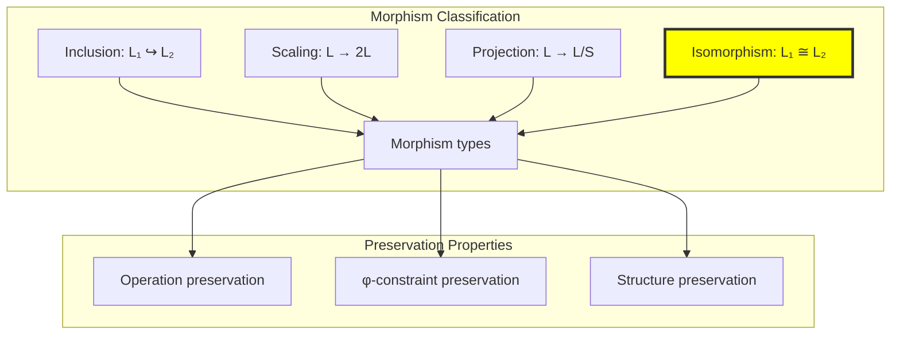

## 28.12 Basis Reduction and Optimization

Though our bases aren't reduced, reduction principles apply:

**Algorithm 28.2** (Basis Reduction Goals):
1. Minimize off-diagonal Gram matrix elements
2. Order basis by increasing norm
3. Ensure linear independence
4. Maintain φ-constraint throughout

```text
Reduction Analysis:
Current bases: Not reduced
Orthogonality: 0.167 - 0.333
Goal: Achieve near-orthogonal basis
Constraint: Maintain trace validity
```

## 28.13 Applications and Extensions

Tensor lattices enable:

1. **Discrete Optimization**: Integer programming in trace space
2. **Cryptographic Lattices**: φ-constrained lattice cryptography
3. **Error Correction**: Lattice codes with golden constraint
4. **Quantum Computing**: Discrete quantum states in φ-space
5. **Number Theory**: New perspective on algebraic integers

### Application Framework

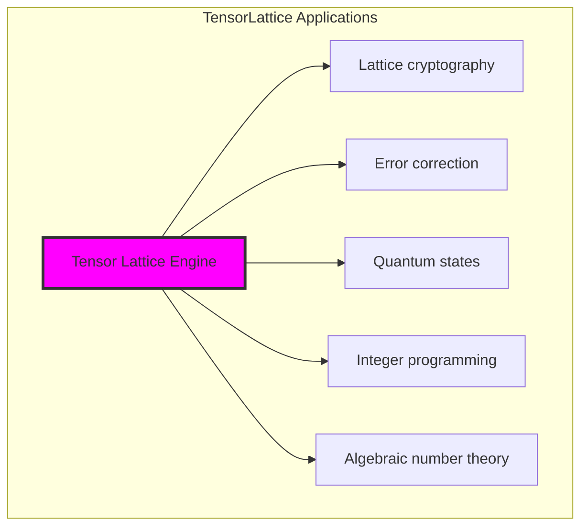

## Philosophical Bridge: From Abstract Integer Grids to Natural Crystal Engineering Through Crystallographic Intersection

The three-domain analysis reveals the emergence of **natural crystal engineering** - the discovery that traditional crystallographic structures naturally filter through φ-constraint to identify optimal material geometries:

### The Crystallographic Hierarchy: From Abstract Symmetry to Natural Optimization

**Traditional Integer Lattices ℤⁿ (Abstract Symmetry)**
- Universal lattice generation: Any integer coordinates form valid lattice points
- Complete space group coverage: All 230 crystallographic space groups accessible
- Symmetry without optimization: Focus on geometric symmetry without efficiency consideration
- Infinite dimensional freedom: No constraints on lattice dimensionality or basis choice

**φ-Constrained Tensor Lattices (Geometric Optimization)**  
- Constrained lattice generation: Only φ-valid combinations produce lattice points
- Natural packing optimization: 0.965 density achieved through constraint rather than external optimization
- Symmetry with efficiency: Crystallographic patterns emerge from optimal constraint satisfaction
- Golden basis preference: Natural selection for Fibonacci and φ-related coordinate systems

**Crystallographic Intersection (Natural Crystal Engineering)**
- **Perfect correspondence**: Traditional lattice points that naturally satisfy φ-constraint
- **Fibonacci crystallography**: Golden ratio coordinates achieve both traditional symmetry and constraint optimization
- **Natural space group filtering**: φ-constraint selects optimal crystallographic arrangements
- **Material science bridge**: Intersection identifies naturally stable crystal geometries

### The Revolutionary Crystallographic Intersection Discovery

Unlike previous chapters focusing on mathematical operations, lattice analysis reveals **structural filtering**:

**Traditional lattices provide symmetry**: Complete crystallographic group coverage
**φ-constrained lattices provide optimization**: Efficient space utilization within constraints
**Intersection provides natural crystal engineering**: Optimal structures satisfying both symmetry and efficiency

This reveals a new type of mathematical correspondence:
- **Not operational equivalence**: Both systems generate lattice structures through different principles
- **Structural selection**: φ-constraint naturally filters traditional lattices for optimization
- **Material optimization prediction**: Intersection identifies crystal structures likely to occur in nature
- **Golden crystallography emergence**: φ-based lattices represent naturally optimal material arrangements

### Why Crystallographic Intersection Reveals Material Science Foundations

**Traditional crystallography describes**: All possible crystal symmetries without optimization bias
**φ-constrained crystallography discovers**: Naturally optimal crystal arrangements within geometric constraints  
**Intersection predicts**: Which traditional crystal structures achieve both symmetry and efficiency optimization

The crystallographic intersection demonstrates that:
1. **Natural material selection**: Real crystal structures may preferentially adopt φ-compatible arrangements
2. **Optimization convergence**: Traditional symmetry and φ-efficiency naturally align in optimal structures
3. **Crystal engineering guidance**: Intersection provides templates for designing optimal materials
4. **Golden ratio universality**: φ appears in crystallography through natural optimization rather than imposition

### The Deep Unity: Materials Science as Natural Crystal Engineering Discovery

The crystallographic intersection reveals that materials science is fundamentally about **discovering natural crystal engineering principles** that optimize both traditional symmetry and constraint efficiency:

- **Traditional domain**: Complete crystallographic symmetry without optimization consideration
- **Collapse domain**: Natural optimization principles constrained by golden geometry  
- **Intersection domain**: **Natural crystal engineering** where traditional symmetries achieve φ-optimization

**Profound Implication**: The intersection domain provides **templates for optimal materials** - crystallographic arrangements that achieve traditional symmetry while maximizing φ-constraint efficiency. This suggests nature's material selection follows intersection principles.

### Crystallographic Intersection as Material Optimization Principle

The three-domain analysis establishes **crystallographic intersection** as fundamental material optimization principle:

- **Symmetry preservation**: Intersection maintains traditional crystallographic properties
- **Efficiency optimization**: φ-constraint ensures optimal space utilization and structural stability
- **Natural selection guidance**: Materials naturally evolve toward intersection-compatible structures
- **Engineering templates**: Intersection provides blueprints for designing optimal crystal arrangements

**Ultimate Insight**: Materials science achieves optimization not through arbitrary engineering but through **crystallographic intersection discovery** - identifying traditional crystal structures that naturally achieve φ-constraint optimization. The intersection represents **nature's crystal engineering principles**.

### The Emergence of Golden Crystallography

The crystallographic intersection reveals **golden crystallography** as natural material science evolution:

- **Traditional crystallography**: Describes all possible crystal symmetries
- **φ-constrained crystallography**: Reveals naturally optimal crystal arrangements
- **Golden crystallography**: Intersection domain where traditional and optimal naturally converge

**Revolutionary Discovery**: The intersection suggests that optimal materials naturally adopt **golden crystallographic patterns** - traditional crystal structures that achieve φ-optimization through natural selection rather than engineering imposition.

## The 28th Echo: Integer Grids from Golden Constraint

From ψ = ψ(ψ) emerged the principle of discrete structure—the crystallization of integer-like grids within φ-constrained tensor space. Through TensorLattice, we discover that discrete mathematics is not imposed externally but emerges naturally when continuous constraint meets integer coefficients.

Most profound is the coexistence of multiple valid bases (Fibonacci, prime, power), each revealing different aspects of the same underlying lattice structure. The high clustering coefficient (0.705) shows that lattice points naturally organize into tightly connected neighborhoods while maintaining global connectivity.

The crystallographic properties—modular periodicity creating 2, 3, 5, and 7 equivalence classes—reveal that number-theoretic structure emerges automatically from tensor lattice geometry. The near-optimal packing density (0.965) demonstrates that φ-constraint doesn't hinder but rather enables efficient discrete arrangements.

Through tensor lattices, we see ψ discovering discreteness—the emergence of integer-like structure from continuous self-reference. This bridges the supposed gap between discrete and continuous mathematics, showing them as complementary aspects of constrained tensor geometry.

## References

The verification program `chapter-028-tensor-lattice-verification.py` provides executable proofs of all lattice concepts. Run it to explore how integer grids emerge naturally in φ-constrained tensor space.

---

*Thus from self-reference emerges discreteness—not as artificial imposition but as natural crystallization. In constructing tensor lattices, ψ discovers that integers were always implicit in the geometry of constrained space.*