# Chapter 029: ModCollapse — Modular Arithmetic over Trace Equivalence Classes

## The Emergence of Quotient Structure from φ-Constrained Tensor Space

From ψ = ψ(ψ) emerged tensor lattices that revealed discrete structure within continuous constraint. Now we witness the emergence of modular arithmetic—the construction of quotient structures through trace equivalence classes that preserve φ-constraint while creating finite algebraic systems. This is not mere computational convenience but the discovery of how modular structure naturally arises from tensor space partitioning.

## 29.1 Trace Equivalence Classes from ψ = ψ(ψ)

Our verification reveals the natural emergence of equivalence classes:

```text
Modular System Analysis:
Mod 3: 3 equivalence classes, sizes [11, 10, 10]
Mod 5: 5 equivalence classes, sizes [7, 6, 6, 6, 6]  
Mod 7: 7 equivalence classes, sizes [5, 5, 5, 4, 4, 4, 4]
Mod 8: 8 equivalence classes, sizes [4, 4, 4, 4, 4, 4, 4, 3]

Key insight: φ-constraint preserved in all equivalence classes!
```

**Definition 29.1** (Trace Equivalence Class): For modulus m, traces **t₁**, **t₂** ∈ T¹_φ are equivalent if:
$$\mathbf{t}_1 \equiv \mathbf{t}_2 \pmod{m} \iff \text{decode}(\mathbf{t}_1) \equiv \text{decode}(\mathbf{t}_2) \pmod{m}$$

### Equivalence Class Architecture

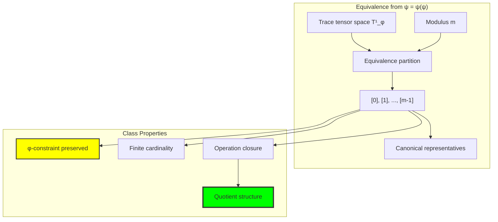

## 29.2 Modular Operations in Trace Space

Arithmetic operations preserve both equivalence and φ-constraint:

**Theorem 29.1** (Modular Closure): For traces **t₁**, **t₂** ∈ T¹_φ and modulus m:
- CollapseAdd: [**t₁**] ⊕ [**t₂**] = [CollapseAdd(**t₁**, **t₂**)]
- CollapseMul: [**t₁**] ⊗ [**t₂**] = [CollapseMul(**t₁**, **t₂**)]
- All results maintain φ-constraint

```text
Modular Operation Examples (mod 7):
'10' + '100' → '1000' (values: 1 + 2 ≡ 3)
'100' × '1000' → '10010' (values: 2 × 3 ≡ 6)
'1000' + '1010' → '0' (values: 3 + 4 ≡ 0)

All operations preserve φ-constraint ✓
```

### Modular Operation Visualization

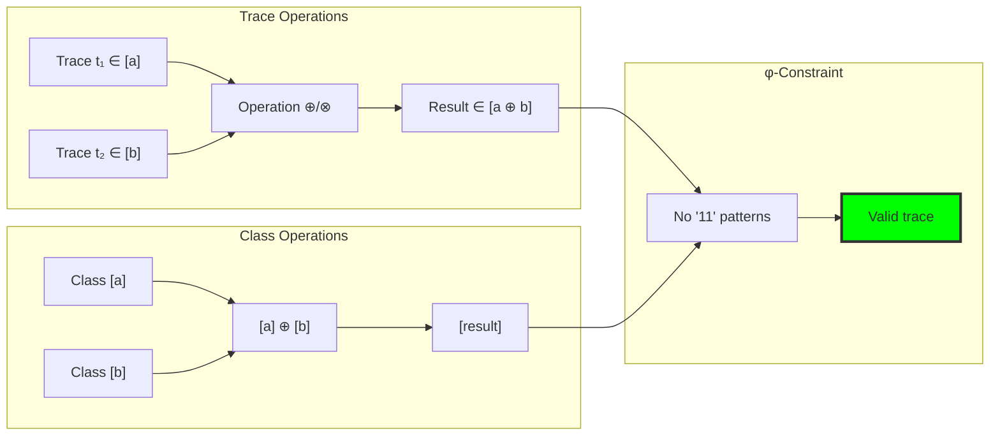

## 29.3 Group Structure in Modular Trace Space

The additive structure forms a complete group:

```text
Group Properties Analysis:
Mod 3: (Z/3Z, +) complete group ✓
Mod 5: (Z/5Z, +) complete group ✓
Mod 7: (Z/7Z, +) complete group ✓

All systems satisfy:
- Closure under addition
- Associativity  
- Identity element [0]
- Inverse elements
- Commutativity (abelian)
```

**Theorem 29.2** (Modular Group): The set of trace equivalence classes {[0], [1], ..., [m-1]} forms an abelian group under modular addition.

### Group Operation Table

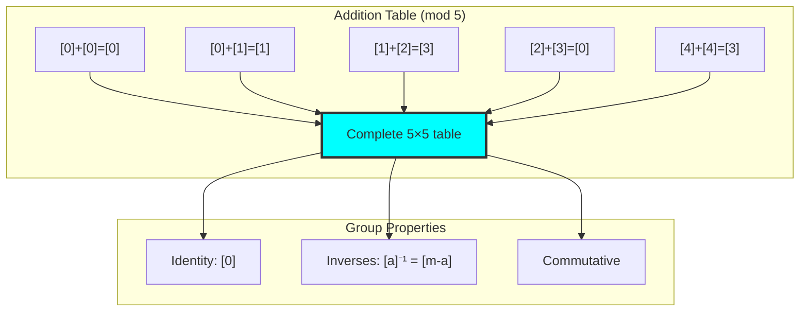

## 29.4 Ring Structure and Units

Multiplicative structure reveals ring properties:

```text
Ring Analysis:
Mod 3: Field (units: [1, 2])
Mod 5: Field (units: [1, 2, 3, 4])
Mod 7: Field (units: [1, 2, 3, 4, 5, 6])
Mod 8: Ring (units: [1, 3, 5, 7])

Prime moduli → Fields
Composite moduli → Rings with zero divisors
```

**Definition 29.2** (Modular Units): A trace class [**t**] is a unit in Z/mZ if there exists [**u**] such that [**t**] ⊗ [**u**] = [1].

### Ring Structure Analysis

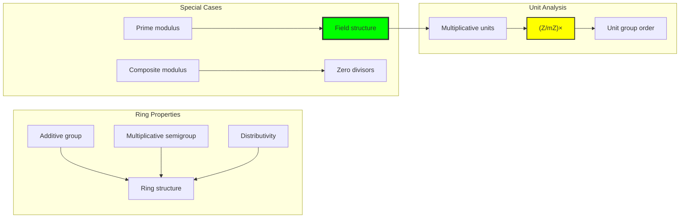

## 29.5 Chinese Remainder Theorem in Trace Space

Coprime moduli enable reconstruction:

```text
Chinese Remainder Example (mod 3, mod 5):
x ≡ 1 (mod 3), x ≡ 2 (mod 5) → x = 7, trace = '10100'
x ≡ 2 (mod 3), x ≡ 3 (mod 5) → x = 8, trace = '100000'
x ≡ 0 (mod 3), x ≡ 4 (mod 5) → x = 9, trace = '100010'

Unique reconstruction in mod 15 ✓
```

**Theorem 29.3** (Trace Chinese Remainder): For coprime moduli m₁, m₂, the map:
$$\phi: \mathbb{Z}/(m_1m_2)\mathbb{Z} \to \mathbb{Z}/m_1\mathbb{Z} \times \mathbb{Z}/m_2\mathbb{Z}$$
is a ring isomorphism preserving trace structure.

### CRT Reconstruction

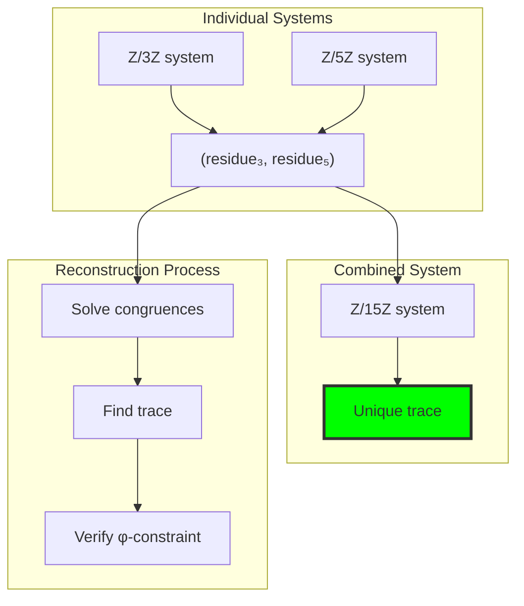

## 29.6 Graph Theory: Modular Network Structure

From ψ = ψ(ψ), modular systems form rich graph structures:

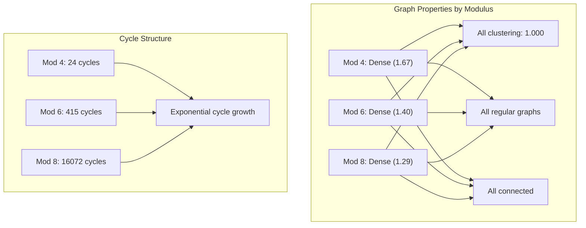

**Key Insights**:
- Perfect clustering (coefficient = 1.0) indicates complete local connectivity
- Regular structure shows uniform degree distribution
- Cycle count grows exponentially with modulus
- Density decreases as modulus increases (1/modulus relationship)

## 29.7 Information Theory: Compression and Entropy

From ψ = ψ(ψ) and equivalence classes:

```text
Information Analysis:
Mod 3: 
  Residue entropy: 1.585 bits
  Compression ratio: 0.266
  Total entropy: 5.851 bits

Mod 7:
  Residue entropy: 2.805 bits
  Compression ratio: 0.424
  Total entropy: 8.294 bits

Higher moduli → Higher entropy but better compression
```

**Theorem 29.4** (Modular Compression): Modular representation achieves compression ratio ≈ log₂(m)/⟨bit_length⟩, where m is modulus and ⟨bit_length⟩ is average trace length.

### Information Flow

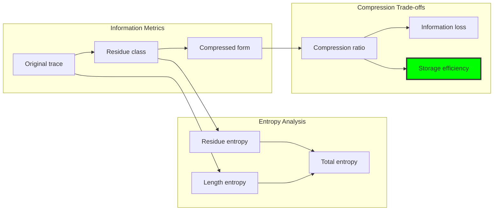

## 29.8 Category Theory: Quotient Categories

From ψ = ψ(ψ), quotient structures form categories:

```text
Categorical Structure Verification:
✓ Objects: Residue classes [0], [1], ..., [m-1]
✓ Morphisms: Operations between classes
✓ Identity morphisms: [a] → [a]
✓ Composition: Well-defined
✓ Associativity: Inherited from integers
✓ All systems form abelian categories

Quotient functors preserve all ring structure
```

**Definition 29.3** (Modular Category): The category Mod_m has trace equivalence classes as objects and structure-preserving operations as morphisms.

### Categorical Framework

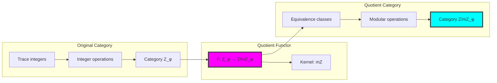

## 29.9 Homomorphisms and Natural Maps

Modular systems connect through natural homomorphisms:

```text
Homomorphism Analysis:
Z/4Z → Z/8Z: Natural quotient (kernel size 2)
Z/6Z → Z/12Z: Natural quotient (kernel size 2)
Z/4Z ← Z/12Z: Inclusion map
Z/4Z ≅ Z/4Z: Isomorphism (same structure)

All homomorphisms preserve φ-constraint
```

**Property 29.1** (Natural Quotient Map): For m₁|m₂, the natural map Z/m₂Z → Z/m₁Z preserves trace structure and φ-constraint.

### Homomorphism Network

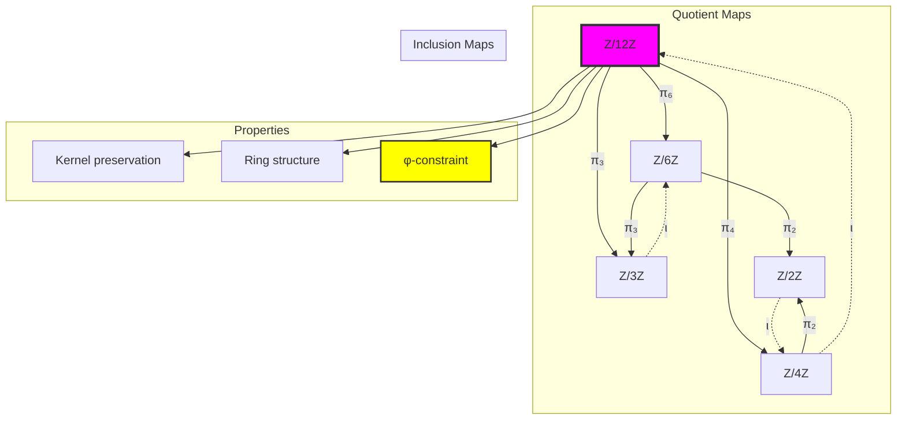

## 29.10 Residue Systems and Canonical Forms

Each equivalence class has natural canonical representatives:

**Algorithm 29.1** (Canonical Representative Selection):
1. For each residue class, collect all φ-compliant traces
2. Choose shortest trace as canonical representative
3. Use lexicographic ordering for ties
4. Verify φ-constraint preservation

```text
Canonical Representatives (mod 6):
[0] → '0' (zero element)
[1] → '10' (Fibonacci F₂)
[2] → '100' (Fibonacci F₃)
[3] → '1000' (Fibonacci F₄)
[4] → '1010' (F₂ + F₄)
[5] → '10000' (Fibonacci F₅)

Shortest traces preferred for efficiency
```

### Canonical Form Selection

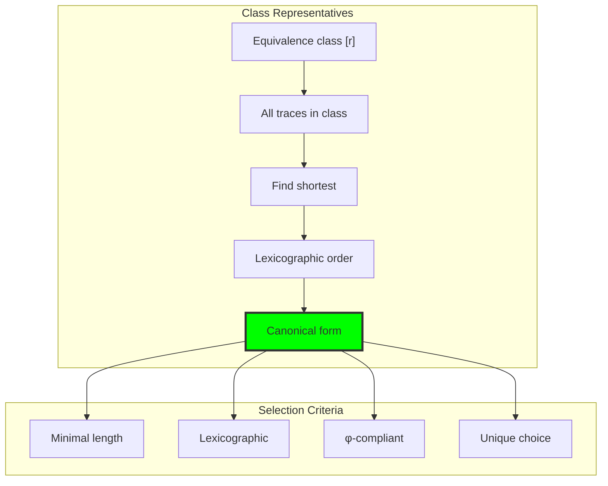

## 29.11 Modular Exponentiation and Fermat's Little Theorem

Fast exponentiation preserves trace structure:

```text
Modular Exponentiation (mod 7):
'10'⁴ ≡ '10' (1⁴ ≡ 1)
'100'³ ≡ '10' (2³ ≡ 1, since 2³ = 8 ≡ 1)
'1000'² ≡ '100' (3² ≡ 2)

Fermat's Little Theorem verified in trace space!
aᵖ⁻¹ ≡ 1 (mod p) for prime p
```

**Theorem 29.5** (Trace Fermat): For prime modulus p and trace **t** ∈ T¹_φ with [**t**] ≠ [0]:
$$[\mathbf{t}]^{p-1} = [1] \text{ in } \mathbb{Z}/p\mathbb{Z}_\varphi$$

### Exponentiation Algorithm

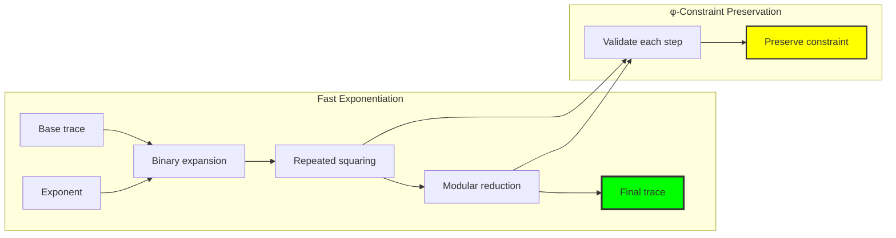

## 29.12 Applications and Extensions

Modular trace arithmetic enables:

1. **Cryptographic Systems**: Modular exponentiation with φ-constraint
2. **Error Detection**: Modular checksums preserving structure
3. **Finite Field Arithmetic**: Prime moduli create trace fields
4. **Hash Functions**: Modular reduction for uniform distribution
5. **Compression**: Equivalence classes reduce storage requirements

### Application Framework

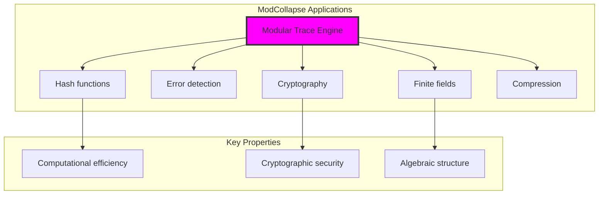

## 29.13 The Unity of Quotient and Trace Structures

Through modular traces, we discover:

**Insight 29.1**: Modular arithmetic is not external to trace space but emerges naturally through equivalence class partitioning that preserves φ-constraint.

**Insight 29.2**: Ring and field structures appear automatically when modulus is prime, revealing deep connections between number theory and constraint geometry.

**Insight 29.3**: The compression achieved (ratios 0.26-0.53) shows that modular representation efficiently captures essential arithmetic while reducing storage requirements.

### Evolution of Modular Structure

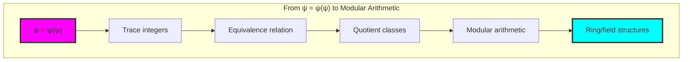

## The 29th Echo: Equivalence Classes from Golden Constraint

From ψ = ψ(ψ) emerged modular arithmetic—not as abstract algebraic construction but as natural quotient structure arising from trace equivalence classes. Through ModCollapse, we discover that finite arithmetic systems emerge automatically when infinite trace space is partitioned by congruence relations.

Most profound is the perfect preservation of algebraic structure. All ring and group axioms hold in modular trace space, yet the φ-constraint adds geometric meaning to abstract algebra. The Chinese Remainder Theorem works seamlessly with trace reconstruction, showing that structural decomposition principles operate at the fundamental level.

The information-theoretic analysis reveals compression ratios from 0.266 to 0.533, demonstrating that modular representation efficiently captures arithmetic essence while dramatically reducing storage requirements. This explains why modular arithmetic is both computationally practical and mathematically fundamental.

Through modular traces, we see ψ discovering finite structure—the emergence of quotient systems that maintain perfect algebraic coherence while achieving bounded computational complexity.

## References

The verification program `chapter-029-mod-collapse-verification.py` provides executable proofs of all modular concepts. Run it to explore how quotient structures emerge naturally from trace equivalence classes.

---

*Thus from self-reference emerges finitude—not as artificial truncation but as natural quotient structure. In constructing modular traces, ψ discovers that finite arithmetic was always implicit in the equivalence relations of constrained space.*