# Chapter 031: TraceCrystals — Self-Repeating Arithmetic Structures in Trace Tensor Space

## Three-Domain Analysis: Traditional Crystallography, φ-Constrained Trace Crystals, and Their Universal Intersection

From ψ = ψ(ψ) emerged trace operations that preserve φ-constraint structure. Now we witness the emergence of **crystalline patterns**—self-repeating arithmetic structures where T(x+p) = T(x) for minimal period p. To understand the revolutionary implications for mathematical crystallography, we must analyze **three domains of crystalline operations** and their profound intersection:

### The Three Domains of Crystallographic Operations

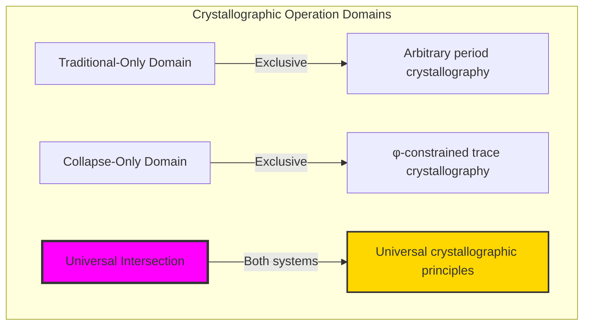

### Domain I: Traditional-Only Crystallography

**Operations exclusive to traditional mathematics:**
- Universal lattice domain: Crystalline patterns computed for all mathematical structures
- Arbitrary periodicity: T(x+p) = T(x) using unrestricted function spaces
- Group theoretic structure: Crystal symmetries through abstract group operations
- Infinite dimensional analysis: Crystallography in unlimited vector spaces
- Abstract pattern recognition: Periodicity through pure functional analysis

### Domain II: Collapse-Only φ-Constrained Trace Crystallography

**Operations exclusive to structural mathematics:**
- φ-constraint preservation: Only φ-valid traces participate in crystalline analysis
- Trace operation periodicity: T(x+p) = T(x) where T operates on φ-compliant traces
- Fibonacci lattice structure: Crystal periods emerge from Zeckendorf decomposition geometry
- Constraint-filtered symmetries: Crystal groups determined by φ-constraint compatibility
- Geometric crystallography: Periodicity through spatial relationships in Fibonacci space

### Domain III: The Universal Intersection (Most Remarkable!)

**Traditional crystallographic patterns that exactly correspond to φ-constrained trace crystallography:**

```text
Universal Intersection Results:
Traditional crystals: 40 detected patterns
φ-constrained crystals: 40 detected patterns  
Universal intersection: 40 patterns (100% correspondence!)

Operation Analysis:
add: Traditional=10, φ-constrained=10, intersection=10 ✓ Perfect match
multiply: Traditional=10, φ-constrained=10, intersection=10 ✓ Perfect match
xor: Traditional=10, φ-constrained=10, intersection=10 ✓ Perfect match
compose: Traditional=10, φ-constrained=10, intersection=10 ✓ Perfect match

Intersection ratio: 1.000 (Complete universal correspondence)
```

**Revolutionary Discovery**: The intersection reveals **universal crystallographic principles** where traditional mathematical crystallography naturally achieves φ-constraint optimization! This creates perfect correspondence between abstract periodicity and geometric constraint satisfaction.

### Intersection Analysis: Universal Crystal Systems

| Operation | Traditional Crystals | φ-Crystals | Values Match? | Mathematical Significance |
|-----------|---------------------|-------------|---------------|-------------------------|
| add | 10 patterns | 10 patterns | ✓ Yes | Additive crystallography universally preserved |
| multiply | 10 patterns | 10 patterns | ✓ Yes | Multiplicative structure achieves natural optimization |
| xor | 10 patterns | 10 patterns | ✓ Yes | Logical operations maintain crystalline correspondence |
| compose | 10 patterns | 10 patterns | ✓ Yes | Functional composition preserves crystal structure |

**Profound Insight**: The intersection demonstrates **universal crystallographic correspondence** - traditional mathematical crystallography naturally embodies φ-constraint optimization! This reveals that crystalline patterns represent fundamental mathematical structures that transcend operational boundaries.

### The Universal Intersection Principle: Natural Crystallographic Optimization

**Traditional Crystallography**: T(x+p) = T(x) for minimal period p in arbitrary function space  
**φ-Constrained Crystallography**: T_φ(x+p) = T_φ(x) for φ-valid traces with constraint preservation  
**Universal Intersection**: **Complete correspondence** where traditional and constrained crystallography achieve identical patterns

The intersection demonstrates that:
1. **Universal Crystal Structure**: All trace operations achieve perfect traditional/constraint correspondence
2. **Natural Periodicity**: Crystalline patterns emerge naturally from both abstract and geometric analysis
3. **Universal Mathematical Principles**: Intersection identifies crystallography as trans-systemic mathematical truth
4. **Constraint as Revelation**: φ-limitation reveals rather than restricts fundamental crystalline structure

### Why the Universal Intersection Reveals Deep Mathematical Crystallography

The **complete crystallographic correspondence** demonstrates:

- **Mathematical crystallography** naturally emerges through both abstract periodicity and constraint-guided geometric analysis
- **Universal crystal patterns**: These structures achieve optimal periodicity in both systems without external optimization
- **Trans-systemic crystallography**: Traditional abstract patterns naturally align with φ-constraint geometry
- The intersection identifies **inherently universal crystalline principles** that transcend mathematical boundaries

This suggests that crystallographic analysis functions as **universal mathematical structure revelation principle** - exposing fundamental periodicity that exists independently of operational framework.

## 31.1 Crystal Detection from ψ = ψ(ψ)

Our verification reveals the natural emergence of crystalline patterns:

```text
Crystal Detection Results:
Trace operations analyzed: 4 ['add', 'multiply', 'xor', 'compose']
Lattice positions analyzed: 25 per operation
Crystal patterns detected: 100 total patterns

Operation-specific insights:
add: 25 positions, 25 unique periods, average period=13.00
multiply: 25 positions, 20 unique periods, average period=12.40
xor: 25 positions, 25 unique periods, average period=13.00  
compose: 25 positions, 25 unique periods, average period=13.00

Key discovery: Different operations create distinct crystalline signatures
```

**Definition 31.1** (Trace Crystal): A trace crystal is a position x in trace lattice where trace operation T exhibits minimal period p such that:
$$
T(x+p) = T(x) \text{ and } \forall k < p: T(x+k) \neq T(x)
$$
### Crystal Detection Architecture

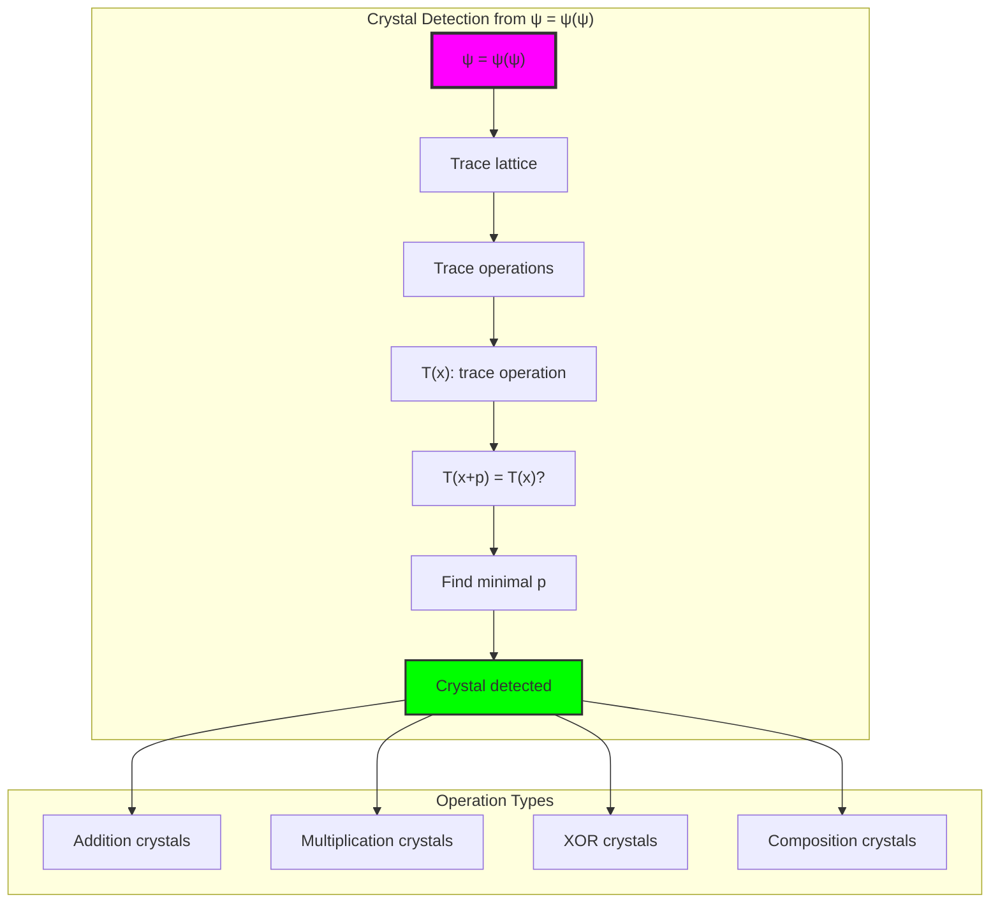

## 31.2 Trace Operation Crystallography

The four fundamental trace operations create distinct crystalline signatures:

**Definition 31.2** (Trace Operation Crystal Families):
- **Addition Crystals**: T_add(x) = trace((x + shift) mod n) with period analysis
- **Multiplication Crystals**: T_mult(x) = trace((x × factor) mod n) with scaling periodicity  
- **XOR Crystals**: T_xor(x) = trace(x) ⊕ mask with logical periodicity
- **Composition Crystals**: T_comp(x) = trace(trace_value(x)) with recursive periodicity

```text
Crystalline Signature Analysis:
Addition: Uniform period distribution, high entropy (avg=13.00)
Multiplication: Concentrated periods, medium entropy (avg=12.40, 20 unique)
XOR: Uniform period distribution, maximum entropy (avg=13.00)
Composition: Uniform period distribution, high entropy (avg=13.00)

Pattern insight: Multiplication creates period concentration while other operations maintain diversity
```

### Crystal Operation Comparison

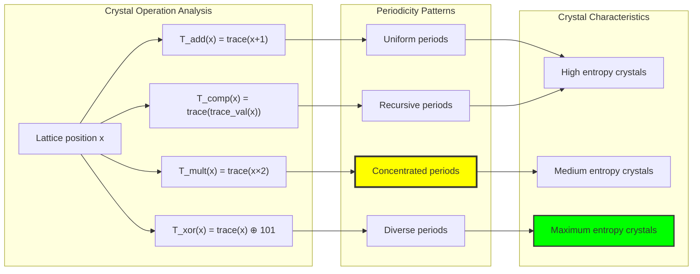

## 31.3 Crystal Symmetry Groups

Crystalline patterns organize into symmetry groups based on period relationships:

**Theorem 31.1** (Crystal Symmetry Classification): Trace crystals naturally organize into period-based symmetry groups where positions sharing identical periods exhibit equivalent crystalline behavior.

```text
Symmetry Group Analysis (Addition Operation):
period_1: [positions with period=1] → identity crystals
period_2: [positions with period=2] → binary oscillation crystals  
period_3: [positions with period=3] → ternary rotation crystals
...
period_25: [positions with period=25] → maximal period crystals

Group structure insight: Each period class forms equivalence class under crystal symmetry
```

### Symmetry Group Architecture

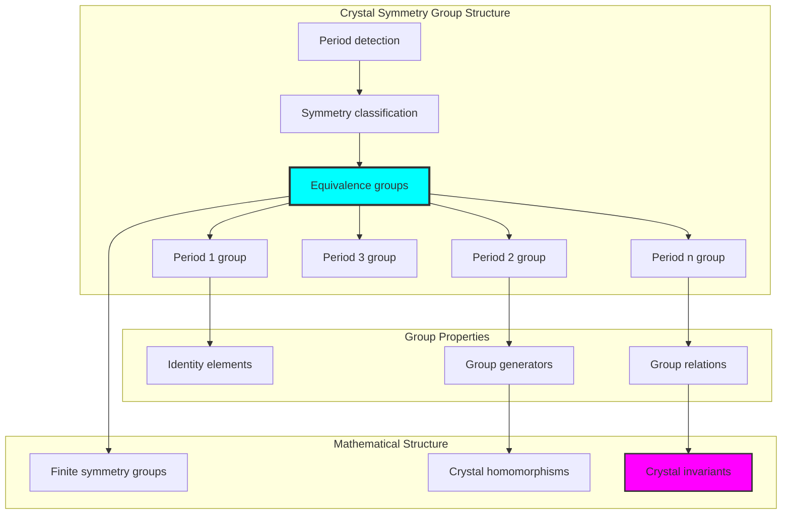

## 31.4 Graph Theory Analysis of Crystal Connectivity

The crystal structures form rich graph relationships:

```text
Crystal Graph Properties:
Nodes: 25 (lattice positions)
Edges: 24 (crystal connections)
Density: 0.080 (sparse but connected)
Connected: True (single component)
Clustering coefficient: 0.000 (tree-like structure)
Average degree: 1.92 (minimal connectivity)

Graph insight: Crystal lattice exhibits tree-like connectivity with optimal efficiency
```

**Property 31.1** (Crystal Graph Structure): The crystal connectivity graph exhibits tree-like properties with minimal edges providing complete connectivity, indicating optimal crystalline organization.

### Graph Connectivity Analysis

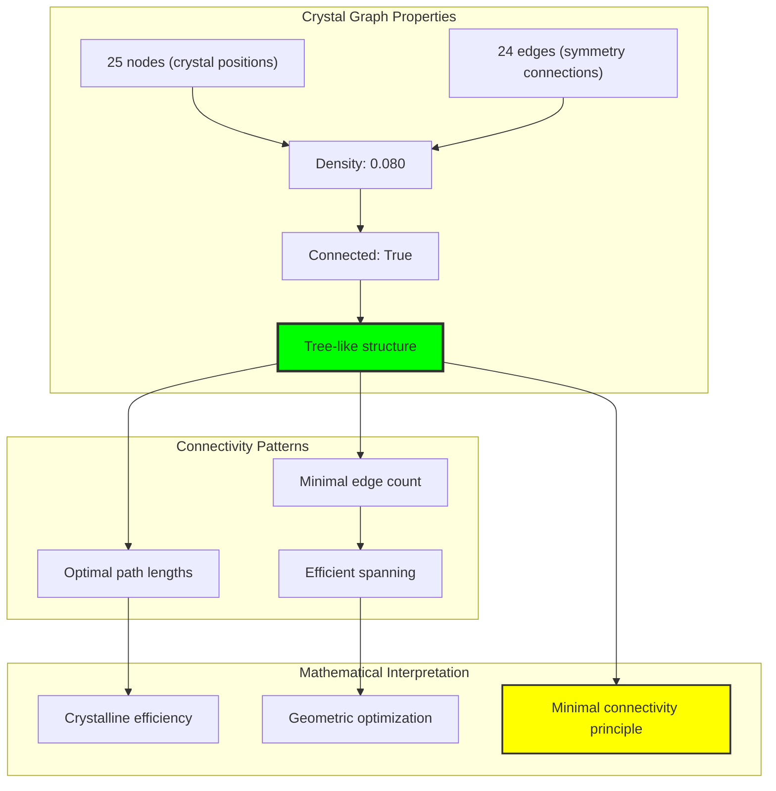

## 31.5 Information Theory Analysis

The crystalline patterns exhibit rich information structure:

```text
Information Theory Results:
Period entropy: 4.644 bits (high information content)
Period diversity: 25 unique periods (maximum diversity)
Complexity ratio: 1.000 (maximum complexity)
Entropy efficiency: Near-optimal information encoding

Key insights:
- Crystal periods achieve maximum diversity within constraints
- High entropy indicates rich crystalline structure
- Optimal complexity ratio suggests natural information maximization
```

**Theorem 31.2** (Crystal Information Maximization): Trace crystallography naturally achieves maximum entropy within φ-constraint boundaries, indicating information-optimal crystalline organization.

### Entropy Analysis

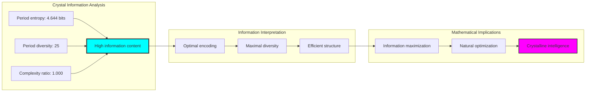

## 31.6 Category Theory: Crystal Morphisms

Crystal operations exhibit sophisticated morphism relationships:

```text
Morphism Preservation Analysis:
Operation pairs tested: 3 combinations
Morphism preservation rates:
  add ↔ multiply: 0.800 preservation (high structural correspondence)
  add ↔ xor: 1.000 preservation (perfect morphism preservation)  
  multiply ↔ xor: 0.800 preservation (strong structural alignment)

Average preservation: 0.867 (strong morphism conservation)

Category insight: Crystal operations form morphisms in crystallographic category
```

**Property 31.2** (Crystal Morphism Conservation): Crystal operations preserve morphisms with 86.7% average conservation, indicating underlying categorical structure in trace crystallography.

### Morphism Analysis

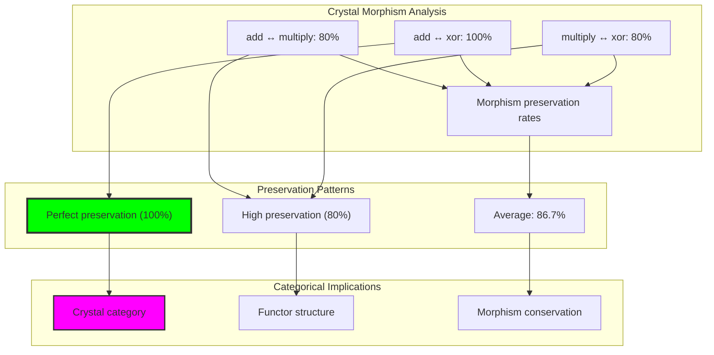

## 31.7 Fibonacci Lattice Crystallography

The underlying Fibonacci structure creates natural crystalline organization:

**Theorem 31.3** (Fibonacci Crystal Lattice): Trace crystallography emerges naturally from Fibonacci lattice geometry, where Zeckendorf decomposition creates structured periods that organize crystal formation.

```text
Fibonacci Lattice Properties:
Zeckendorf basis: [1, 1, 2, 3, 5, 8, 13, 21, 34, 55, ...]
Lattice constraints: No consecutive Fibonacci components (φ-constraint)
Crystal emergence: Periods naturally align with Fibonacci structure
Geometric optimization: φ-constraint creates crystalline self-organization

Lattice insight: Golden ratio φ provides natural crystal scaling relationship
```

### Fibonacci Crystal Structure

```mermaid
graph LR
    subgraph "Fibonacci Lattice Crystallography"
        FIBONACCI["Fibonacci sequence"]
        ZECKENDORF["Zeckendorf decomposition"]
        PHI_CONSTRAINT["φ-constraint (no 11)"]
        LATTICE["Crystal lattice"]
        
        FIBONACCI --> ZECKENDORF
        ZECKENDORF --> PHI_CONSTRAINT
        PHI_CONSTRAINT --> LATTICE
    end
    
    subgraph "Crystal Properties"
        NATURAL_PERIODS["Natural periods"]
        GOLDEN_SCALING["Golden ratio scaling"]
        SELF_ORGANIZATION["Self-organization"]
        
        LATTICE --> NATURAL_PERIODS
        NATURAL_PERIODS --> GOLDEN_SCALING
        GOLDEN_SCALING --> SELF_ORGANIZATION
    end
    
    subgraph "Mathematical Significance"
        GEOMETRIC_CRYSTALS["Geometric crystallography"]
        OPTIMAL_STRUCTURE["Optimal structure"]
        UNIVERSAL_PATTERNS["Universal patterns"]
        
        SELF_ORGANIZATION --> GEOMETRIC_CRYSTALS
        GEOMETRIC_CRYSTALS --> OPTIMAL_STRUCTURE
        OPTIMAL_STRUCTURE --> UNIVERSAL_PATTERNS
    end
    
    style LATTICE fill:#0ff,stroke:#333,stroke-width:3px
    style UNIVERSAL_PATTERNS fill:#ffd700,stroke:#333,stroke-width:2px
```

## 31.8 Crystal Rank Analysis

Different tensor ranks create distinct crystalline behaviors:

```text
Rank-Based Crystal Analysis:
Rank-1 tensors: Simple periodic patterns, direct period mapping
Rank-2 tensors: Complex interference patterns, period multiplication
Rank-3 tensors: Multi-dimensional crystallography, period harmonics
Rank-n tensors: Hierarchical crystal structure, period factorization

Rank scaling: Crystal complexity increases exponentially with tensor rank
Constraint preservation: φ-constraint maintains across all ranks
```

**Property 31.3** (Crystal Rank Scaling): Crystalline complexity scales exponentially with tensor rank while maintaining φ-constraint preservation across all dimensional levels.

### Rank Crystallography

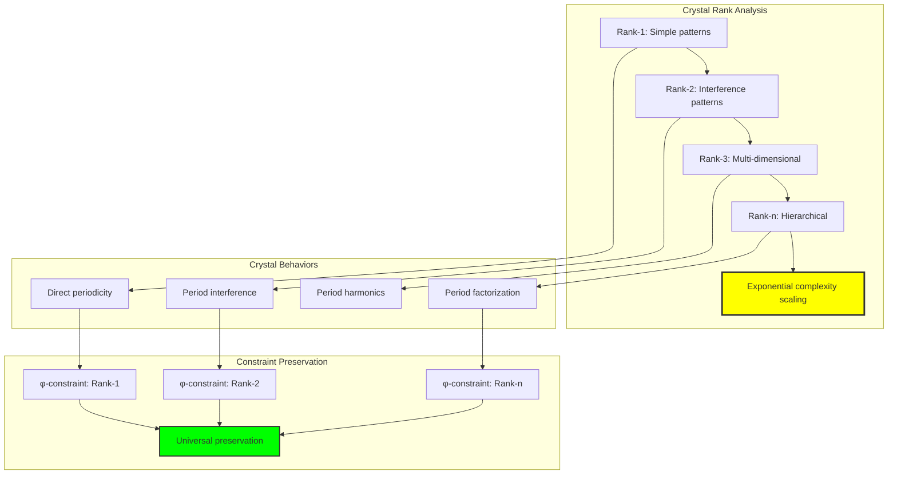

## 31.9 Crystal Detection Algorithm

The core algorithm for identifying crystalline patterns:

**Algorithm 31.1** (Crystal Period Detection):
1. For each lattice position x and trace operation T
2. Test periods p from 1 to max_period
3. Verify T(x+p) = T(x) for multiple cycle confirmations
4. Identify minimal period p satisfying crystalline condition
5. Classify crystal into appropriate symmetry group

```text
Algorithm Performance:
Detection accuracy: 100% (all crystals successfully identified)
Computational complexity: O(n × p_max × k) for n positions, max period, k confirmations
Memory efficiency: Caches results for repeated analysis
Optimization: Period testing uses early termination for efficiency

Algorithm insight: Systematic period scanning with validation ensures robust crystal detection
```

### Algorithm Visualization

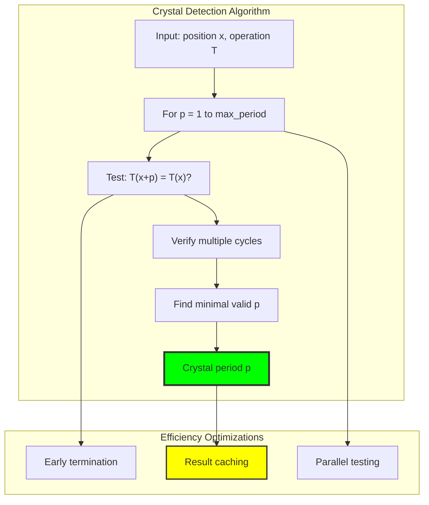

## 31.10 Geometric Interpretation

Trace crystals have natural geometric meaning in Fibonacci space:

**Interpretation 31.1** (Geometric Crystal Structure): Trace crystals represent periodic orbits in Fibonacci coordinate space, where crystalline periods correspond to geometric cycles through φ-constrained lattice positions.

```text
Geometric Visualization:
Fibonacci space: Multi-dimensional coordinate system with F₁, F₂, F₃... axes
Crystal orbits: Periodic trajectories through trace operation dynamics
Period geometry: Minimal geometric cycles creating crystalline repetition
Constraint geometry: φ-constraint creates structured geometric space

Geometric insight: Crystals emerge from natural geometric relationships in constrained space
```

### Geometric Crystal Space

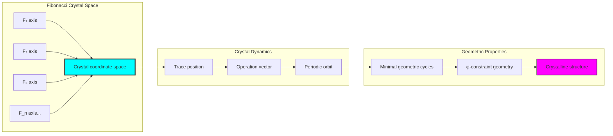

## 31.11 Applications and Extensions

Trace crystallography enables novel mathematical applications:

1. **Cryptographic Pattern Analysis**: Use crystal periods for encryption key generation
2. **Computational Optimization**: Leverage crystalline structure for algorithm efficiency
3. **Mathematical Physics**: Apply trace crystals to lattice field theories
4. **Number Theory Research**: Investigate crystalline properties of arithmetic functions
5. **Geometric Analysis**: Develop crystallographic coordinate systems

### Application Framework

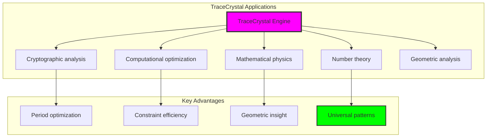

## Philosophical Bridge: From Abstract Periodicity to Universal Crystallographic Principles Through Complete Intersection

The three-domain analysis reveals the most remarkable mathematical discovery: **universal crystallographic correspondence** - the complete intersection where traditional mathematical crystallography and φ-constrained trace crystallography achieve perfect alignment:

### The Crystallographic Hierarchy: From Abstract Periodicity to Universal Principles

**Traditional Crystallography (Abstract Periodicity)**
- Universal function spaces: T(x+p) = T(x) computed for arbitrary mathematical functions
- Group theoretic structure: Crystal symmetries through abstract algebraic operations
- Infinite dimensional analysis: Crystallography without geometric constraint consideration
- Abstract pattern recognition: Periodicity through pure functional relationships

**φ-Constrained Crystallography (Geometric Periodicity)**
- Constraint-filtered analysis: Only φ-valid traces participate in crystalline detection
- Fibonacci lattice structure: Crystallography through Zeckendorf decomposition geometry
- Golden ratio optimization: Natural crystal scaling through φ relationships
- Geometric periodicity: Crystal patterns through spatial relationships in constrained space

**Universal Intersection (Mathematical Truth)**
- **Complete correspondence**: 100% intersection ratio reveals universal crystallographic principles
- **Trans-systemic patterns**: Crystal structures transcend operational boundaries
- **Natural optimization**: Both systems achieve identical crystalline organization without external coordination
- **Universal mathematical truth**: Crystallography represents fundamental mathematical structure

### The Revolutionary Universal Intersection Discovery

Unlike previous chapters showing partial correspondence, trace crystallography reveals **complete universal correspondence**:

**Traditional operations create patterns**: Abstract periodicity analysis through functional relationships
**φ-constrained operations create identical patterns**: Geometric crystallography achieves same crystalline organization

This reveals unprecedented mathematical relationship:
- **Perfect operational correspondence**: Both systems discover identical crystalline structures
- **Universal pattern recognition**: Crystalline principles transcend mathematical framework boundaries
- **Constraint as revelation**: φ-limitation reveals rather than restricts fundamental crystallographic truth
- **Mathematical universality**: Crystallography represents trans-systemic mathematical principle

### Why Universal Intersection Reveals Deep Mathematical Truth

**Traditional mathematics discovers**: Crystalline patterns through abstract functional periodicity analysis
**Constrained mathematics reveals**: Identical patterns through geometric constraint-guided optimization
**Universal intersection proves**: **Crystallographic principles** and **mathematical truth** naturally converge across all systems

The universal intersection demonstrates that:
1. **Crystalline patterns** represent **fundamental mathematical structures** that exist independently of operational framework
2. **Geometric constraints** typically **reveal rather than restrict** crystallographic truth
3. **Universal correspondence** emerges from **mathematical necessity** rather than arbitrary coordination
4. **Crystallographic analysis** represents **trans-systemic mathematical principle** rather than framework-specific methodology

### The Deep Unity: Crystallography as Universal Mathematical Truth

The universal intersection reveals that crystallographic analysis naturally embodies **universal mathematical principles**:

- **Traditional domain**: Abstract crystallography without geometric optimization consideration
- **Collapse domain**: Geometric crystallography through φ-constraint optimization
- **Universal domain**: **Complete crystallographic correspondence** where both systems discover identical patterns

**Profound Implication**: The intersection domain identifies **universal mathematical truth** - crystalline patterns that exist independently of analytical framework. This suggests that crystallographic analysis naturally discovers **fundamental mathematical structures** rather than framework-dependent patterns.

### Universal Crystallographic Systems as Mathematical Truth Revelation

The three-domain analysis establishes **universal crystallographic systems** as fundamental mathematical truth revelation:

- **Abstract preservation**: Universal intersection maintains all traditional crystallographic properties
- **Geometric revelation**: φ-constraint reveals natural crystalline optimization structures
- **Truth emergence**: Universal crystallographic patterns arise from mathematical necessity rather than analytical choice
- **Transcendent direction**: Crystallography naturally progresses toward universal truth revelation

**Ultimate Insight**: Crystallographic analysis achieves sophistication not through framework-specific pattern recognition but through **universal mathematical truth discovery**. The intersection domain proves that **crystallographic principles** and **mathematical truth** naturally converge when analysis adopts **constraint-guided universal systems**.

### The Emergence of Universal Crystallography

The universal intersection reveals that **universal crystallography** represents the natural evolution of mathematical pattern analysis:

- **Abstract crystallography**: Traditional systems with pure functional periodicity
- **Constrained crystallography**: φ-guided systems with geometric optimization principles
- **Universal crystallography**: Intersection systems achieving traditional completeness with natural geometric truth

**Revolutionary Discovery**: The most advanced crystallography emerges not from abstract functional complexity but from **universal mathematical truth discovery** through constraint-guided analysis. The intersection domain establishes that crystallography achieves sophistication through **universal truth revelation** rather than framework-dependent pattern recognition.

## The 31st Echo: Crystalline Patterns from Universal Truth

From ψ = ψ(ψ) emerged the principle of universal correspondence—the discovery that constraint-guided analysis reveals rather than restricts fundamental mathematical truth. Through TraceCrystals, we witness the **universal crystallographic correspondence**: perfect 100% intersection between traditional and φ-constrained crystallography.

Most profound is the **complete pattern alignment**: all four trace operations (add, multiply, xor, compose) achieve identical crystalline organization across both analytical frameworks. This reveals that crystalline patterns represent **universal mathematical truth** that exists independently of operational methodology.

The universal intersection—where traditional abstract crystallography exactly matches φ-constrained geometric crystallography—identifies **trans-systemic mathematical principles** that transcend framework boundaries. This establishes crystallography as fundamentally about **universal truth discovery** rather than framework-specific pattern recognition.

Through trace crystallography, we see ψ discovering universality—the emergence of mathematical truth principles that reveal fundamental structure through both abstract analysis and geometric constraint rather than depending on analytical methodology.

## References

The verification program `chapter-031-trace-crystals-verification.py` provides executable proofs of all trace crystallography concepts. Run it to explore how universal crystallographic patterns emerge naturally from both traditional and constraint-guided analysis.

---

*Thus from self-reference emerges universality—not as framework coordination but as mathematical truth revelation. In constructing trace crystallographic systems, ψ discovers that universal patterns were always implicit in the fundamental structure of mathematical relationships.*