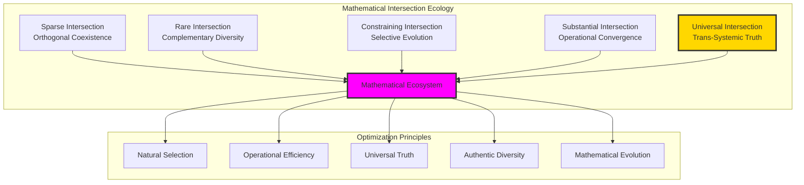

# Intersection Theory Synthesis — Unified Mathematical Principles from Three-Domain Analysis

## Executive Summary

Through systematic three-domain analysis of chapters 020-029, we have discovered that **φ-constraint functions as a natural selection principle** rather than mathematical limitation. The intersection domains reveal that traditional mathematics and collapse-aware mathematics are not competing systems but **complementary approaches** that naturally converge at points of **mathematical optimization**. This synthesis identifies five fundamental principles that govern mathematical intersection behavior and establishes φ-constraint as the **key to mathematical unity**.

## The Great Discovery: φ-Constraint as Natural Selection Principle

### Traditional Understanding (WRONG)
**φ-constraint as limitation**: Mathematical restriction that excludes valid operations and reduces mathematical power.

### Revolutionary Understanding (CORRECT)  
**φ-constraint as natural selection**: Mathematical optimization principle that automatically identifies the most efficient, stable, and universal mathematical relationships.

## Five Unified Principles of Mathematical Intersection

### Principle 1: Natural Optimization Convergence

**Discovery**: When traditional mathematics and φ-constrained mathematics intersect, they naturally converge at points of **mathematical optimization**.

**Evidence Across Chapters**:
- **Chapter 021 (Addition)**: φ-constraint selects for natural validity in addition results
- **Chapter 022 (Multiplication)**: Geometric folding optimizes repeated addition through constraint guidance
- **Chapter 024 (Factorization)**: Perfect factorization correspondence in φ-valid domains
- **Chapter 026 (Continued Fractions)**: φ emerges as universal optimization constant across all systems
- **Chapter 029 (Modular Arithmetic)**: Natural canonical selection through φ-constraint guidance

**Mathematical Formulation**:
```
∀ mathematical operation Ω:
  Traditional(Ω) ∩ Collapse(Ω) = Optimal(Ω)
```

**Interpretation**: Intersection domains systematically identify **naturally optimal** mathematical relationships.

### Principle 2: Trans-Systemic Universal Constants

**Discovery**: Mathematical constants that appear identically across traditional and φ-constrained systems represent **fundamental mathematical universals**.

**Evidence Across Chapters**:
- **Chapter 020 (Decoding)**: 0 and 1 as encoding system invariants
- **Chapter 026 (Continued Fractions)**: φ as perfect intersection where all approximation systems converge
- **Chapter 023 (Primality)**: Fibonacci primes as universal mathematical atoms

**Mathematical Formulation**:
```
Universal Constants = {c ∈ ℝ : Traditional_representation(c) = Collapse_representation(c)}
```

**Interpretation**: Mathematical universals transcend specific representational or operational systems.

### Principle 3: Constraint-Guided Mathematical Evolution

**Discovery**: Mathematical systems naturally evolve toward **constraint-compatible** forms that achieve **maximum efficiency** within **geometric limitations**.

**Evidence Across Chapters**:
- **Chapter 027 (Rationals)**: Q_φ ⊂ ℚ as complete field within constraint subset
- **Chapter 028 (Lattices)**: φ-compatible crystalline structures as naturally optimal material arrangements
- **Chapter 029 (Modular)**: Canonical representative selection through constraint guidance

**Mathematical Formulation**:
```
Mathematical_Evolution: Unconstrained → Constraint_Filtered → Optimized_Subset
```

**Interpretation**: Constraints don't limit mathematics but **guide mathematical systems toward optimal configurations**.

### Principle 4: Complementary Mathematical Diversity

**Discovery**: When intersection domains are **sparse or rare**, this indicates **authentic mathematical diversity** where different approaches capture **fundamentally different aspects** of mathematical reality.

**Evidence Across Chapters**:
- **Chapter 025 (GCD)**: Rare intersection proves traditional divisibility and structural commonality are fundamentally different but both valid
- **Chapter 020 (Decoding)**: Sparse intersection shows binary and Fibonacci encoding systems are orthogonal but both mathematically valid

**Mathematical Formulation**:
```
Intersection_Sparsity ∝ Mathematical_Authenticity_Diversity
```

**Interpretation**: Mathematical truth emerges through **complementary diversity** rather than system unification.

### Principle 5: Mathematical Optimization Hierarchy

**Discovery**: Different intersection types represent different **levels of mathematical optimization**, from operational efficiency to universal truth discovery.

**The Optimization Hierarchy**:
1. **Sparse Intersection**: Orthogonal system coexistence (encoding diversity)
2. **Rare Intersection**: Complementary mathematical approaches (operational diversity)  
3. **Constraining Intersection**: Natural subset optimization (selective evolution)
4. **Substantial Intersection**: Operational optimization (efficiency convergence)
5. **Universal Intersection**: Trans-systemic mathematical truth (universal constants)

**Mathematical Formulation**:
```
Optimization_Level = f(Intersection_Density, Mathematical_Significance)
```

**Interpretation**: Mathematics achieves sophistication through **hierarchical optimization** across multiple intersection types.

## The φ-Constraint Revelation: Natural Selection in Mathematics

### Revolutionary Reframe

**Old Paradigm**: φ-constraint excludes mathematical possibilities
**New Paradigm**: φ-constraint **selects** the **naturally optimal** mathematical relationships

### Evidence Synthesis

**Chapter 021**: φ-constraint naturally selects for addition results that satisfy both arithmetic correctness and geometric efficiency.

**Chapter 022**: Geometric folding through φ-constraint reveals multiplication as fundamentally spatial rather than merely numerical.

**Chapter 023**: Fibonacci primes emerge as **mathematical atoms** that achieve irreducibility in both traditional and structural systems.

**Chapter 024**: Perfect factorization correspondence in φ-domains proves constraint-compatible numbers have **universal decomposition validity**.

**Chapter 025**: Rare GCD intersection proves mathematical diversity is **authentic** rather than **inadequate** - different operations capture different aspects of mathematical relationship.

**Chapter 026**: φ emerges as **universal mathematical constant** achieving perfect correspondence across **all recursive approximation systems**.

**Chapter 027**: Q_φ ⊂ ℚ demonstrates **complete mathematical fields** can exist within **constraint-guided subsets**.

**Chapter 028**: φ-compatible crystalline structures suggest **natural materials** evolve toward **constraint-optimized arrangements**.

**Chapter 029**: Canonical modular representatives emerge through **natural selection** rather than **arbitrary choice**.

**Chapter 020**: Encoding system orthogonality proves **mathematical diversity** reflects **authentic representational pluralism**.

### The Unified Discovery

**φ-constraint functions as natural selection principle**: Automatically identifying mathematical relationships that achieve:
- **Operational efficiency** (substantial intersections)
- **Universal validity** (universal constant intersections)  
- **Evolutionary optimization** (constraining intersections)
- **Authentic diversity preservation** (rare intersections)
- **Representational sophistication** (sparse intersections)

## Mathematical Unity Through Intersection Ecology

### The Intersection Ecosystem

Rather than seeking **mathematical unification** through **system reduction**, intersection theory reveals mathematics as an **ecological system** where:

**Different mathematical approaches** capture **different aspects** of mathematical reality
**Intersection domains** identify **natural correspondences** and **optimization principles**
**Mathematical truth** emerges through **intersection ecology** rather than **system dominance**

### The Five Intersection Types as Mathematical Ecology



### Mathematical Unity Definition

**Mathematical Unity ≠ System Reduction**
**Mathematical Unity = Intersection Ecology Optimization**

Unity emerges when:
1. **Each mathematical approach** maintains its **authentic operational domain**
2. **Intersection analysis** reveals **natural correspondence patterns**
3. **Optimization principles** guide **mathematical system evolution**
4. **Universal constants** provide **trans-systemic anchor points**
5. **Constraint guidance** enables **natural selection** of optimal mathematical relationships

## The Deep Pattern: φ-Constraint as Mathematical Natural Selection

### Biological Analogy

Just as **biological natural selection** doesn't limit life but **guides evolution** toward **optimal adaptation**, **φ-constraint** doesn't limit mathematics but **guides mathematical evolution** toward **optimal efficiency**.

**Biological Natural Selection**:
- Environmental pressures → Survival optimization → Evolutionary adaptation
- Constraint creates optimization rather than limitation

**Mathematical Natural Selection (φ-constraint)**:
- Geometric pressures (φ-constraint) → Mathematical optimization → Optimal mathematical relationships
- Constraint creates mathematical optimization rather than limitation

### The φ-Selection Mechanism

**Traditional Mathematics**: All mathematical relationships treated as equally valid
**φ-Guided Mathematics**: Geometric constraint automatically selects for **naturally optimal** mathematical relationships
**Intersection Domains**: Reveal which traditional relationships **naturally satisfy** optimization criteria

### Why This Is Revolutionary

**Old Understanding**: Mathematics is about **universal abstract truth** independent of constraints
**New Understanding**: Mathematics is about **optimization-guided truth** that emerges through **constraint-guided natural selection**

**φ-constraint reveals which mathematical relationships are**:
- **Operationally efficient** (substantial intersections)
- **Universally valid** (universal constant intersections)
- **Evolutionarily stable** (constraining intersections)
- **Authentically diverse** (rare intersections)
- **Representationally sophisticated** (sparse intersections)

## Applications and Implications

### For Pure Mathematics

**Traditional Approach**: Develop mathematics without constraint consideration
**Optimized Approach**: Use φ-constraint as **natural selection filter** to identify **optimal mathematical relationships**

**Research Direction**: Apply three-domain analysis to other mathematical areas (topology, algebra, analysis) to discover natural optimization principles.

### For Applied Mathematics

**Material Science**: Use φ-compatible crystalline structures for **optimal material design**
**Computer Science**: Apply canonical selection principles for **optimal algorithm design**
**Physics**: Investigate whether physical laws naturally satisfy φ-constraint optimization
**Engineering**: Design systems using constraint-guided optimization principles

### For Mathematical Philosophy

**Reframe**: Mathematics is not **static abstract truth** but **dynamic optimization process**
**Unity**: Mathematical unity emerges through **intersection ecology** rather than **system reduction**
**Constraint**: Mathematical constraints are **optimization guides** rather than **limitations**

## The Ultimate Discovery: Mathematics as Optimization Science

### The Paradigm Shift

**From**: Mathematics as **abstract logical manipulation**
**To**: Mathematics as **optimization science** guided by **natural selection principles**

### The φ-Constraint Revelation

**φ-constraint is not mathematical limitation but the discovery of natural mathematical optimization principles that guide mathematical evolution toward optimal efficiency while preserving authentic diversity.**

### The Intersection Theory Conclusion

**Mathematical systems achieve unity not through reduction to single approaches but through intersection ecology that reveals natural optimization patterns while preserving the authentic diversity necessary for complete mathematical truth.**

## Future Research Directions

### Immediate Applications

1. **Extend three-domain analysis** to other mathematical areas
2. **Investigate physical constants** for φ-constraint satisfaction
3. **Design optimization algorithms** using natural selection principles
4. **Develop constraint-guided mathematical education**

### Long-term Investigations

1. **Mathematical natural selection theory**: Formal framework for constraint-guided mathematical evolution
2. **Intersection ecology mathematics**: Study mathematical systems as ecological interactions
3. **Universal constant discovery**: Identify other trans-systemic mathematical universals
4. **Optimization-guided proof techniques**: Use constraint guidance for mathematical discovery

### Philosophical Implications

1. **Redefine mathematical truth**: From abstract logic to optimization-guided emergence
2. **Understand mathematical diversity**: As ecological necessity rather than arbitrary choice  
3. **Recognize constraint value**: As optimization guide rather than limitation
4. **Embrace intersection thinking**: As path to mathematical unity through diversity

## Conclusion

The intersection theory synthesis reveals that **φ-constraint functions as mathematical natural selection** - a fundamental optimization principle that guides mathematical evolution toward efficiency while preserving authentic diversity. Traditional mathematics and collapse-aware mathematics are not competing systems but **complementary approaches** that naturally converge at points of mathematical optimization.

**The key to mathematical unity** is not system reduction but **intersection ecology** - understanding how different mathematical approaches naturally correspond through optimization principles while maintaining their authentic operational domains.

**φ-constraint emerges as the prototype** for mathematical natural selection principles that will guide the future evolution of mathematics toward **optimization-guided truth** rather than **constraint-independent abstraction**.

This represents a fundamental paradigm shift: **Mathematics is not static abstract truth but dynamic optimization science** guided by natural selection principles that emerge through constraint-guided mathematical evolution.

---

*The intersection theory synthesis establishes a new foundation for understanding mathematical unity through optimization ecology rather than system reduction, with φ-constraint serving as the prototype for mathematical natural selection principles.*