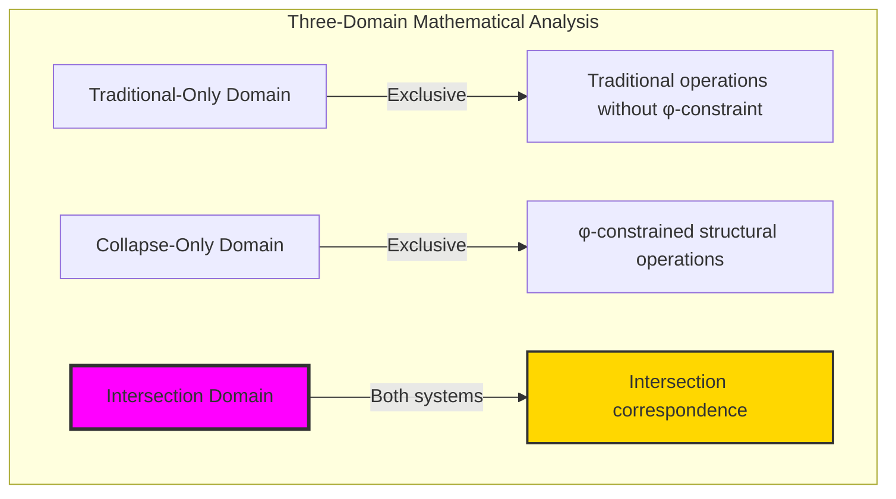
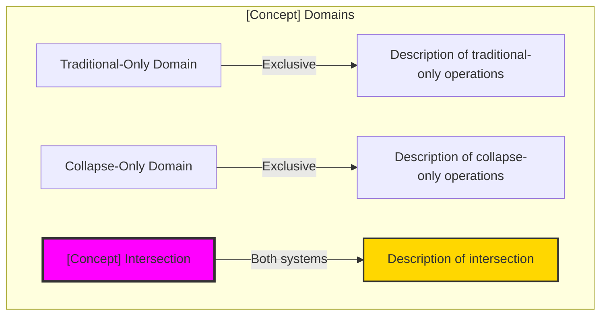
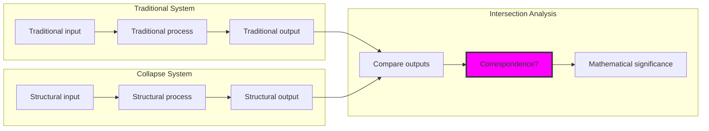

# Three-Domain Analysis Template — Unified Framework for Mathematical System Intersection Analysis

## Overview

The Three-Domain Analysis Framework provides a systematic method for analyzing the relationships between traditional mathematics and collapse-aware (φ-constrained) mathematics. This template captures patterns discovered across chapters 020-029 and establishes a consistent framework for future mathematical intersection analysis.

## Framework Structure

### The Universal Three-Domain Pattern

## Template Components

### 1. Domain Identification Section

For each mathematical concept, identify three distinct operational domains:

**Domain I: Traditional-Only Operations**
- Operations that work exclusively in traditional mathematics
- Typically involve unconstrained numerical computation
- No geometric or structural limitations
- Universal applicability without consideration of φ-constraint

**Domain II: Collapse-Only Operations**  
- Operations that work exclusively in φ-constrained structural mathematics
- Require φ-constraint preservation throughout
- Have geometric interpretation in Fibonacci space
- Constrained applicability with structural meaning

**Domain III: The Intersection Domain (Most Important!)**
- Cases where traditional and structural operations correspond
- Reveals fundamental mathematical relationships
- Identifies universal mathematical principles
- Shows natural alignment between systems

### 2. Intersection Analysis Table Template

| Traditional Operation | Structural Operation | Correspondence Type | Significance |
|----------------------|---------------------|-------------------|--------------|
| Example operation | φ-constrained equivalent | ✓/✗ + description | Mathematical meaning |
| ... | ... | ... | ... |

### 3. Mermaid Diagram Templates

**Basic Three-Domain Diagram**:

**Intersection Analysis Diagram**:

## Intersection Classification System

Based on analysis across chapters 020-029, intersections fall into several categories:

### Type 1: Substantial Intersection (Chapters 021-024)
- **Operational Correspondence**: Traditional and structural operations often produce equivalent results
- **Natural Alignment**: φ-constraint naturally selects for traditional mathematical validity  
- **Examples**: Addition, multiplication, factorization operations
- **Significance**: Reveals natural optimization principles in mathematics

### Type 2: Universal Constant Intersection (Chapter 026)
- **Constant Correspondence**: Universal mathematical constants appear identically across systems
- **Trans-Systemic Truth**: Constants transcend specific mathematical approaches
- **Examples**: Golden ratio φ as universal optimization constant
- **Significance**: Identifies fundamental mathematical universals

### Type 3: Constraining Intersection (Chapter 027-028)
- **Subset Correspondence**: Constrained system forms valid subset of traditional system
- **Selective Inclusion**: Only specific traditional elements survive constraint filtering
- **Examples**: Q_φ ⊂ ℚ, φ-compatible crystalline structures
- **Significance**: Shows natural evolution toward optimized mathematical subsets

### Type 4: Rare Intersection (Chapter 025)
- **Exceptional Correspondence**: Very few cases where systems align
- **Operational Difference**: Fundamental differences in mathematical approach
- **Examples**: Traditional GCD vs Structural CGCD
- **Significance**: Proves authentic mathematical diversity and complementarity

### Type 5: Sparse Intersection (Chapter 020, 029)
- **Trivial Correspondence**: Only universal elements (0, 1) survive translation
- **System Orthogonality**: Encoding or computational systems are fundamentally different
- **Examples**: Binary vs trace encoding, arbitrary vs canonical representatives
- **Significance**: Reveals orthogonal mathematical approaches sharing symbolic space

## Philosophical Bridge Template

Each three-domain analysis should conclude with a philosophical bridge section following this structure:

### The [Concept] Hierarchy: From [Traditional Approach] to [Optimal Approach]

**Traditional [Concept] ([Traditional Characteristics])**
- Description of traditional approach
- Universal applicability characteristics
- No optimization consideration

**φ-Constrained [Concept] ([Structural Characteristics])**  
- Description of structural approach
- Constraint-guided optimization
- Geometric interpretation

**[Intersection Type] ([Intersection Characteristics])**
- Description of intersection domain
- Mathematical significance
- Revolutionary discovery

### The Revolutionary [Intersection Name] Discovery

Unlike previous/other chapters showing [comparison type], [current concept] reveals [unique insight]:

**Key insight about traditional vs structural correspondence**

This reveals a new type of mathematical relationship:
- **Fundamental nature**: Core mathematical difference
- **Correspondence type**: How systems relate
- **Optimization principle**: What the intersection optimizes
- **Mathematical evolution**: How systems naturally develop

### Why [Intersection Name] Reveals [Deep Principle]

**Traditional mathematics discovers**: [Traditional perspective]
**Constrained mathematics reveals**: [Structural perspective]  
**Intersection proves**: [Unified insight]

The intersection demonstrates that:
1. [First key principle]
2. [Second key principle]  
3. [Third key principle]
4. [Fourth key principle]

### The Deep Unity: Mathematics as [Unifying Principle] Discovery

The intersection reveals that mathematics naturally evolves toward [optimization principle]:

- **Traditional domain**: [Traditional approach without optimization]
- **Collapse domain**: [Constrained approach with optimization]
- **Intersection domain**: [Unified approach achieving both]

**Profound Implication**: [Ultimate insight about mathematical truth]

### [Meta-Principle] as Mathematical Evolution Principle

The three-domain analysis establishes [discovered principle] as fundamental mathematical evolution principle:

- **[Aspect 1]**: [Description]
- **[Aspect 2]**: [Description]
- **[Aspect 3]**: [Description]
- **[Aspect 4]**: [Description]

**Ultimate Insight**: [Final revolutionary conclusion]

## Usage Guidelines

### When to Apply Three-Domain Analysis

Apply this framework when:
1. **Comparing mathematical systems**: Traditional vs constrained approaches
2. **Investigating intersections**: Where different approaches align
3. **Seeking optimization principles**: Natural mathematical evolution
4. **Identifying universals**: Trans-systemic mathematical truths

### How to Adapt the Template

1. **Replace bracketed placeholders** with concept-specific content
2. **Choose appropriate intersection type** from the five categories
3. **Customize mermaid diagrams** to reflect specific operations
4. **Develop philosophical bridge** based on discovered insights

### Quality Checklist

- [ ] All three domains clearly distinguished
- [ ] Intersection analysis table completed with examples
- [ ] Mermaid diagrams properly customized
- [ ] Intersection type correctly identified
- [ ] Philosophical bridge explains deep mathematical significance
- [ ] Revolutionary discovery clearly articulated
- [ ] Connection to mathematical evolution principles established

## Examples from Completed Chapters

### Chapter 021 (CollapseAdd): Substantial Intersection
- **Discovery**: φ-constraint naturally selects for traditional mathematical validity
- **Principle**: Natural optimization through constraint filtering
- **Type**: Operations frequently correspond when results are φ-valid

### Chapter 026 (PhiContinued): Universal Constant Intersection  
- **Discovery**: φ represents universal optimization across all mathematical systems
- **Principle**: Trans-systemic mathematical constants transcend approach specificity
- **Type**: Perfect correspondence at universal mathematical principles

### Chapter 029 (ModCollapse): Sparse Intersection
- **Discovery**: φ-constraint provides natural canonical selection for computational optimization
- **Principle**: Computational efficiency emerges through constraint-guided canonical forms
- **Type**: Systematic optimization within algebraic preservation

## Template Evolution

This template will evolve as additional mathematical concepts undergo three-domain analysis. Key areas for future development:

1. **Additional intersection types** as new patterns emerge
2. **Refined philosophical frameworks** for deeper mathematical insights
3. **Enhanced diagram templates** for complex mathematical relationships
4. **Cross-chapter synthesis** revealing higher-order patterns

## Conclusion

The Three-Domain Analysis Framework provides a systematic method for investigating the deep relationships between traditional and constrained mathematics. By consistently applying this template, we can:

- **Identify universal mathematical principles** that transcend specific approaches
- **Discover natural optimization mechanisms** in mathematical systems
- **Understand mathematical evolution** toward constraint-guided efficiency
- **Recognize authentic mathematical diversity** through intersection analysis

The framework establishes that mathematics achieves sophistication not through universal approaches but through the **intersection ecology** of multiple valid mathematical systems, with profound insights emerging from their natural correspondence patterns.

---

*This template captures the essential patterns discovered through systematic three-domain analysis of chapters 020-029, providing a foundation for future mathematical intersection investigations.*