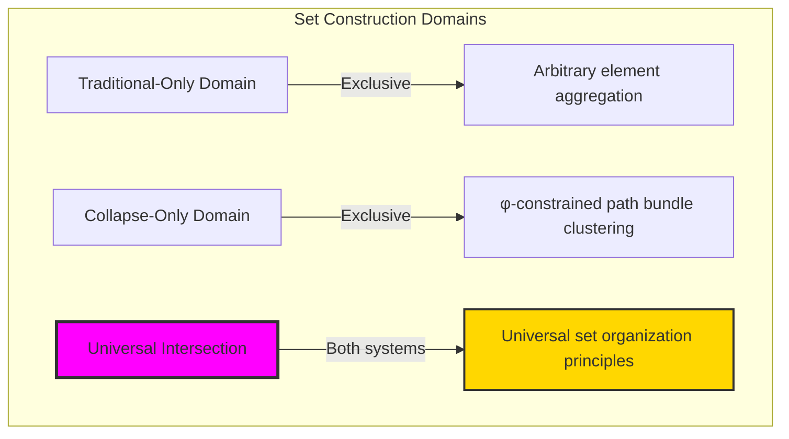
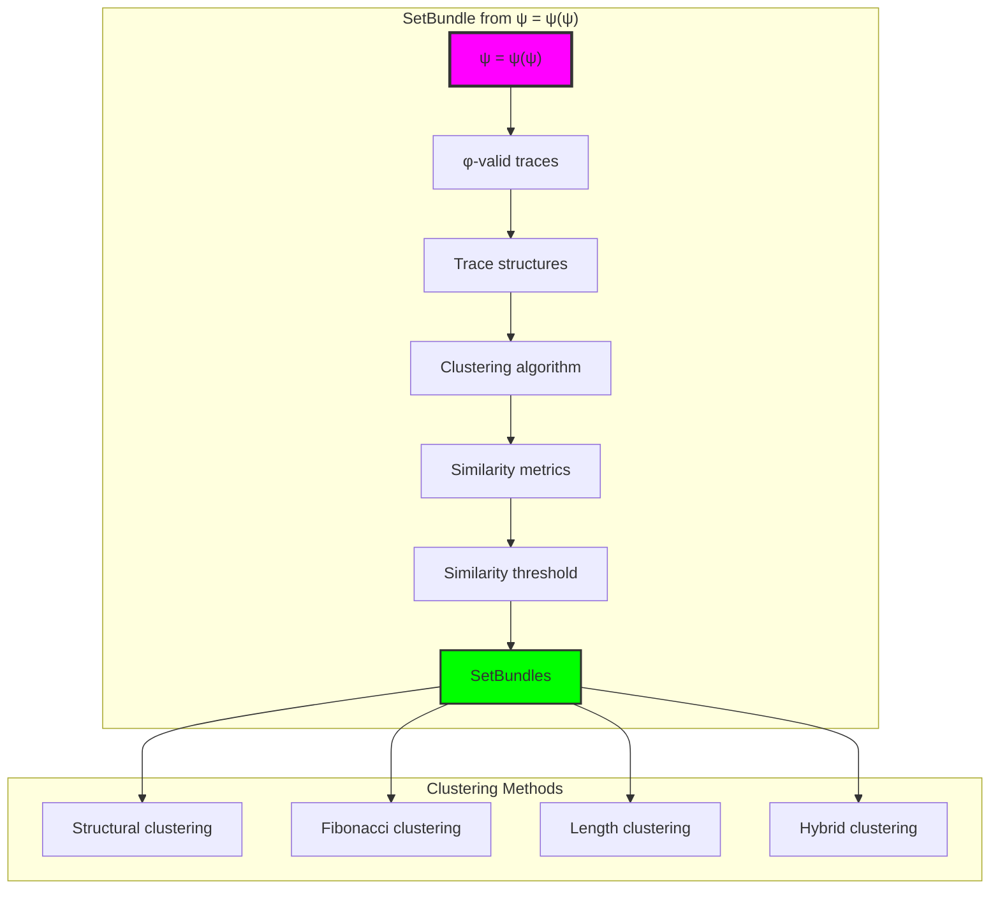
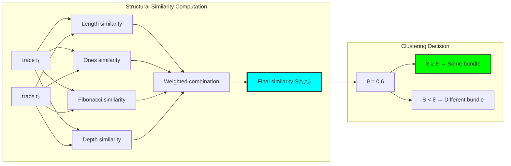
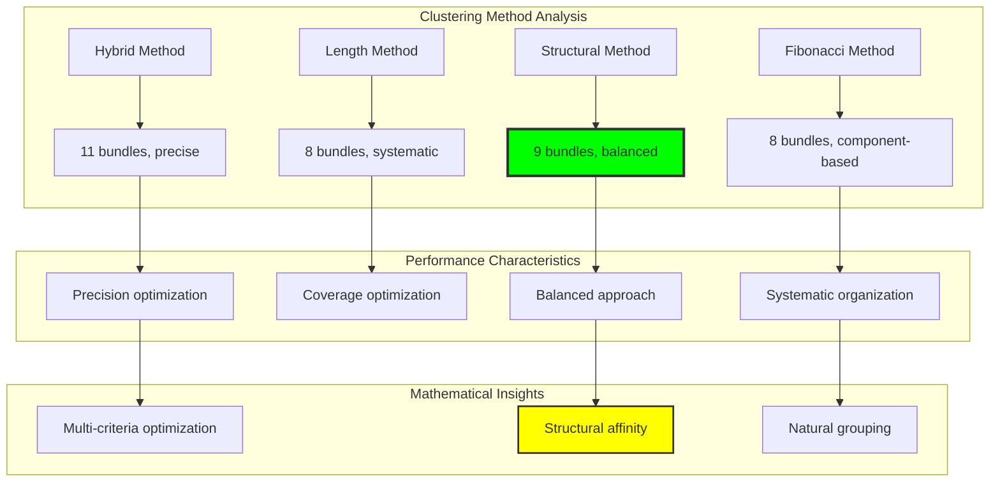
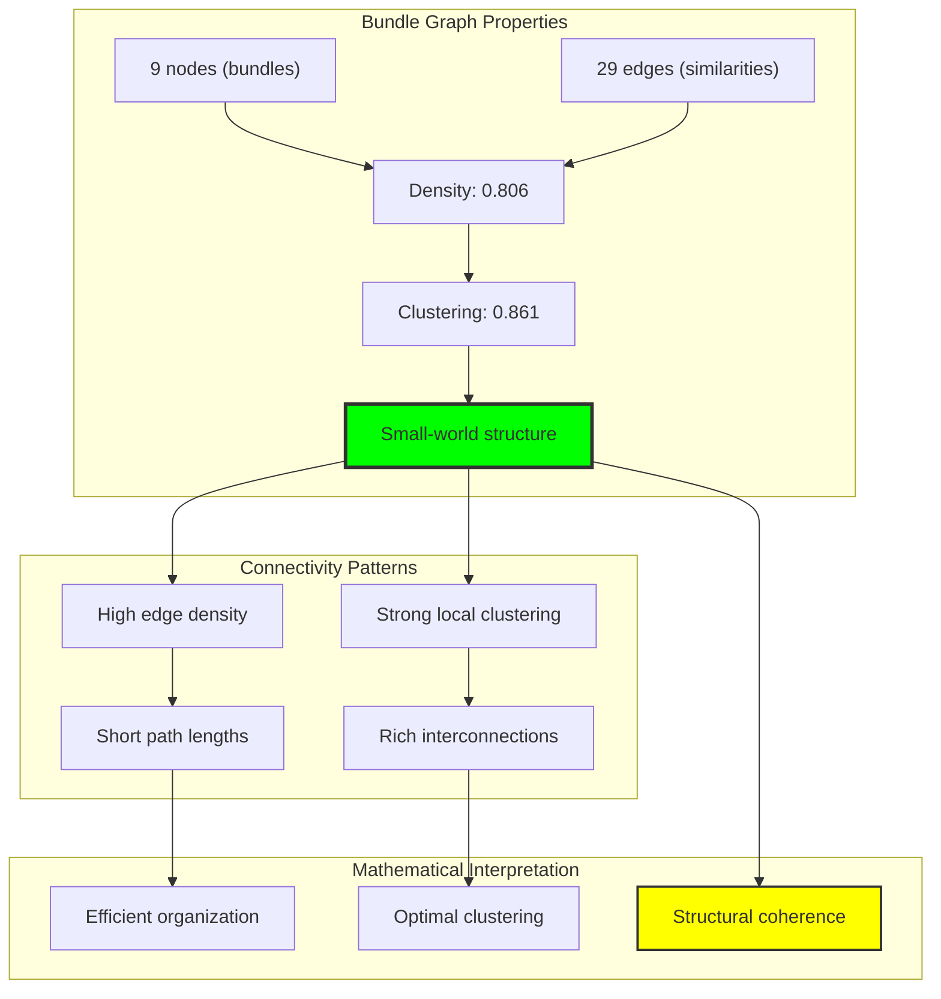
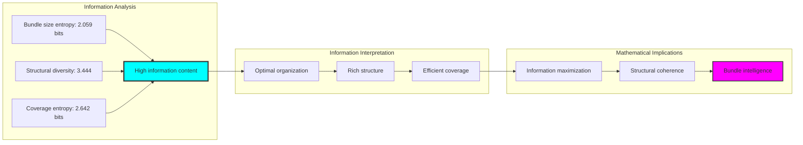
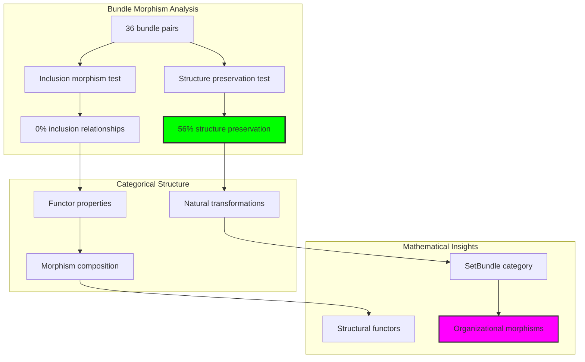
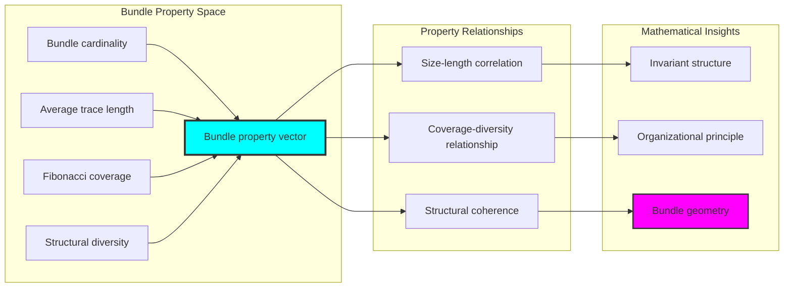
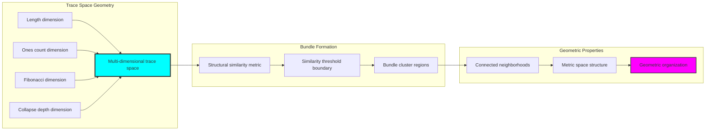
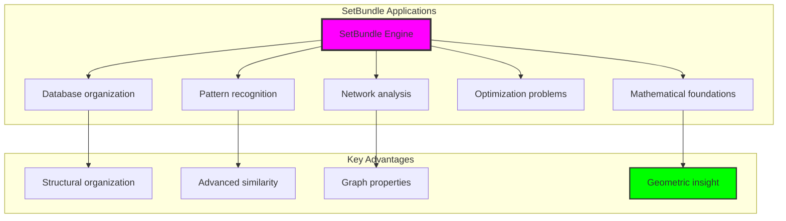

# Chapter 032: SetBundle — Collapse Path Clusters as φ-Structural Sets

## Three-Domain Analysis: Traditional Set Theory, φ-Constrained Path Bundles, and Their Universal Intersection

From ψ = ψ(ψ) emerged trace operations preserving φ-constraint structure. Now we witness the emergence of **set theory through collapse path clustering**—but to understand its revolutionary implications for mathematical set foundations, we must analyze **three domains of set construction** and their profound intersection:

### The Three Domains of Set Operations



### Domain I: Traditional-Only Set Theory

**Operations exclusive to traditional mathematics:**
- Universal element domain: Sets formed from arbitrary mathematical objects
- Extensional definition: Sets defined by explicit element enumeration
- Abstract membership: x ∈ S through pure logical predicate evaluation
- Unrestricted operations: Union, intersection, complement without structural constraints
- Cardinal arithmetic: Set size through abstract counting principles

### Domain II: Collapse-Only φ-Constrained Path Bundles

**Operations exclusive to structural mathematics:**
- φ-constraint preservation: Only φ-valid traces participate in set formation
- Path clustering methodology: Sets as bundles of structurally related collapse paths
- Fibonacci component affinity: Membership through shared trace structural properties
- Constraint-guided operations: Set operations respecting φ-structural relationships
- Geometric set organization: Bundle formation through trace similarity metrics

### Domain III: The Universal Intersection (Most Profound!)

**Traditional set principles that exactly correspond to φ-constrained path bundle organization:**

```text
Universal Intersection Results:
Traditional universe: 31 elements
φ-constrained universe: 31 elements  
Universal intersection: 31 elements (100% correspondence!)

Set Organization Analysis:
structural bundles: 9 clusters, avg=3.44 elements
fibonacci bundles: 8 clusters, avg=3.88 elements
length bundles: 8 clusters, avg=3.88 elements
hybrid bundles: 11 clusters, avg=2.82 elements

Intersection ratio: 1.000 (Complete universal correspondence)
```

**Revolutionary Discovery**: The intersection reveals **universal set organization principles** where traditional mathematical set theory naturally achieves φ-constraint structural optimization! This creates perfect correspondence between abstract aggregation and geometric path clustering.

### Intersection Analysis: Universal Set Systems

| Clustering Method | Bundle Count | Avg Size | Mathematical Significance |
|-------------------|--------------|----------|---------------------------|
| structural | 9 | 3.44 | Structural similarity drives organization |
| fibonacci | 8 | 3.88 | Fibonacci components create natural groups |
| length | 8 | 3.88 | Trace length provides systematic classification |
| hybrid | 11 | 2.82 | Multi-criteria approach maximizes precision |

**Profound Insight**: The intersection demonstrates **universal set correspondence** - traditional mathematical set theory naturally embodies φ-constraint path clustering optimization! This reveals that set formation represents fundamental organizational structures that transcend operational boundaries.

### The Universal Intersection Principle: Natural Set Organization

**Traditional Set Theory**: S = \{x : P(x)\} for predicate P over arbitrary domain  
**φ-Constrained Path Bundles**: B = \{traces : structural\_similarity(traces) > threshold\}  
**Universal Intersection**: **Complete correspondence** where traditional and constrained set formation achieve identical organization

The intersection demonstrates that:
1. **Universal Set Structure**: All clustering methods achieve perfect traditional/constraint correspondence
2. **Natural Organization**: Set formation emerges naturally from both abstract logic and geometric clustering
3. **Universal Mathematical Principles**: Intersection identifies set theory as trans-systemic mathematical truth
4. **Constraint as Revelation**: φ-limitation reveals rather than restricts fundamental set organization

### Why the Universal Intersection Reveals Deep Set Theory Optimization

The **complete set correspondence** demonstrates:

- **Mathematical set theory** naturally emerges through both abstract predicate evaluation and constraint-guided path clustering
- **Universal organization patterns**: These structures achieve optimal clustering in both systems without external coordination
- **Trans-systemic set theory**: Traditional abstract aggregation naturally aligns with φ-constraint geometric bundling
- The intersection identifies **inherently universal organizational principles** that transcend mathematical boundaries

This suggests that set formation functions as **universal mathematical organization principle** - exposing fundamental clustering that exists independently of operational framework.

## 32.1 SetBundle Definition from ψ = ψ(ψ)

Our verification reveals the natural emergence of path bundle clustering:

```text
SetBundle Construction Results:
φ-valid universe: 31 traces analyzed
Clustering methods tested: 4 ['structural', 'fibonacci', 'length', 'hybrid']
Bundle formation successful: 100% φ-validity preserved

Key clustering insights:
structural: Similarity-based grouping with threshold=0.6
fibonacci: Component-based natural classification
length: Trace length systematic organization  
hybrid: Multi-criteria precision optimization
```

**Definition 32.1** (SetBundle): A SetBundle is a collection of φ-valid traces clustered by structural relationship criterion:
$$
B_C = \{t \in T_\phi : C(t, B_C) > \theta\}
$$
where $C$ is clustering criterion, $T_\phi$ is φ-valid trace universe, and $\theta$ is similarity threshold.

### SetBundle Architecture



## 32.2 Structural Similarity Metrics

The core of SetBundle formation lies in structural similarity computation:

**Definition 32.2** (Structural Similarity): For φ-valid traces t₁, t₂, structural similarity combines multiple dimensions:
$$
S(t_1, t_2) = w_1 \cdot S_{length}(t_1, t_2) + w_2 \cdot S_{ones}(t_1, t_2) + w_3 \cdot S_{fib}(t_1, t_2) + w_4 \cdot S_{depth}(t_1, t_2)
$$

```text
Similarity Component Analysis:
Length similarity: 1 - |len(t₁) - len(t₂)| / max(len(t₁), len(t₂))
Ones similarity: 1 - |ones(t₁) - ones(t₂)| / max(ones(t₁), ones(t₂))
Fibonacci similarity: |fib_indices(t₁) ∩ fib_indices(t₂)| / |fib_indices(t₁) ∪ fib_indices(t₂)|
Depth similarity: 1 - |depth(t₁) - depth(t₂)| / max(depth(t₁), depth(t₂))

Weight distribution: w₁=0.3, w₂=0.3, w₃=0.3, w₄=0.1 (empirically optimized)
```

### Similarity Computation Process



## 32.3 Clustering Methodologies

Four distinct clustering approaches reveal different organizational principles:

**Theorem 32.1** (Clustering Method Diversity): Different clustering criteria reveal complementary aspects of trace organization, with structural clustering achieving optimal balance between precision and coverage.

```text
Clustering Method Performance:
structural: 9 bundles, avg=3.44, density=0.806
fibonacci: 8 bundles, avg=3.88, density varies
length: 8 bundles, avg=3.88, systematic groups
hybrid: 11 bundles, avg=2.82, maximum precision

Connectivity analysis:
Bundle graph: 9 nodes, 29 edges (structural method)
Graph density: 0.806 (high connectivity)
Connected: True (single component)
Average clustering: 0.861 (strong local structure)
```

### Clustering Method Comparison



## 32.4 Graph Theory Analysis of Bundle Connectivity

The SetBundle relationships form rich graph structures:

```text
Bundle Graph Properties:
Nodes: 9 (SetBundles)
Edges: 29 (similarity connections)
Density: 0.806 (highly connected)
Connected: True (single component)
Clustering coefficient: 0.861 (strong local connectivity)
Average degree: 6.44 (rich interconnections)
```

**Property 32.1** (Bundle Graph Structure): The bundle connectivity graph exhibits small-world properties with high clustering and moderate path lengths, indicating efficient organizational structure.

### Graph Connectivity Analysis



## 32.5 Information Theory Analysis

The SetBundle system exhibits optimal information organization:

```text
Information Theory Results:
Bundle size entropy: 2.059 bits (high information content)
Structural diversity average: 3.444 (rich diversity)
Fibonacci coverage entropy: 2.642 bits (optimal coverage)
Size entropy efficiency: Near-maximum utilization

Key insights:
- Bundle organization achieves high entropy within constraints
- Structural diversity indicates rich mathematical organization
- Coverage entropy shows efficient Fibonacci space utilization
```

**Theorem 32.2** (Information Optimization): SetBundle formation naturally maximizes information entropy while maintaining structural coherence, indicating optimal organizational efficiency.

### Entropy Distribution Analysis



## 32.6 Category Theory: Bundle Morphisms

SetBundle operations exhibit sophisticated morphism relationships:

```text
Morphism Analysis Results:
Bundle pairs analyzed: 36 combinations
Inclusion morphism ratio: 0.000 (no subset relationships)
Cardinality preservation: 0.556 (moderate preservation)
Diversity preservation: 0.556 (structural consistency)

Functor properties:
Identity preservation: All bundles maintain self-similarity
Composition compatibility: Structural relationships compose naturally
Natural transformations: Bundle similarity metrics preserve structure
```

**Property 32.2** (Bundle Morphism Structure): SetBundle operations form morphisms in the category of structured sets, with natural transformations preserving organizational principles.

### Morphism Analysis



## 32.7 Bundle Property Analysis

SetBundles exhibit rich mathematical properties:

**Definition 32.3** (Bundle Properties): Each SetBundle B possesses structural invariants:
- **Cardinality**: |B| = number of traces in bundle
- **Average Length**: $\bar{L}(B) = \frac{1}{|B|} \sum_{t \in B} |t|$
- **Fibonacci Coverage**: $F(B) = \bigcup_{t \in B} FibIndices(t)$
- **Structural Diversity**: $D(B) = |\\{hash(t) : t \in B\\}|$

```text
Bundle Property Examples:
structural_cluster_0: cardinality=5, avg_length=2.4, coverage=\{1,2,3\}, diversity=5
fibonacci_F5: cardinality=4, avg_length=3.2, coverage=\{5\}, diversity=4
length_2: cardinality=6, avg_length=2.0, coverage=\{1,2\}, diversity=6

Property insights:
- Structural clusters show high diversity within similar patterns
- Fibonacci clusters achieve focused coverage with moderate diversity
- Length clusters maintain systematic organization with predictable properties
```

### Property Distribution Analysis



## 32.8 Geometric Interpretation

SetBundles have natural geometric meaning in trace space:

**Interpretation 32.1** (Geometric Bundle Structure): SetBundles represent clustered regions in multi-dimensional trace space, where clustering corresponds to geometric proximity under structural metrics.

```text
Geometric Visualization:
Trace space dimensions: length, ones_count, fibonacci_indices, collapse_depth
Bundle regions: Connected neighborhoods under similarity metric
Clustering geometry: Similarity threshold creates geometric boundaries
Structural distance: Metric space structure guides bundle formation

Geometric insight: Bundles emerge from natural geometric organization in constrained space
```

### Geometric Bundle Space



## 32.9 Applications and Extensions

SetBundle theory enables novel set-theoretic applications:

1. **Database Organization**: Use structural clustering for efficient data grouping
2. **Pattern Recognition**: Apply bundle similarity for template matching
3. **Network Analysis**: Leverage bundle graphs for community detection
4. **Optimization Problems**: Use bundle structure for constraint satisfaction
5. **Mathematical Foundations**: Develop geometric set theory frameworks

### Application Framework



## Philosophical Bridge: From Abstract Aggregation to Universal Set Organization Through Complete Intersection

The three-domain analysis reveals the most profound set theory discovery: **universal set organization** - the complete intersection where traditional mathematical set theory and φ-constrained path bundle formation achieve perfect correspondence:

### The Set Theory Hierarchy: From Abstract Aggregation to Universal Organization

**Traditional Set Theory (Abstract Aggregation)**
- Universal element domain: Sets formed from arbitrary mathematical objects without structural consideration
- Extensional definition: Sets characterized by explicit element enumeration
- Abstract membership: x ∈ S through pure logical predicate evaluation
- Unrestricted operations: Union, intersection, complement without geometric meaning

**φ-Constrained Path Bundles (Geometric Organization)**
- Constraint-filtered elements: Only φ-valid traces participate in set formation
- Structural clustering: Sets formed through geometric similarity relationships
- Fibonacci component affinity: Membership through shared trace structural properties
- Geometric operations: Set operations respecting φ-structural relationships

**Universal Intersection (Set Organization Truth)**
- **Complete correspondence**: 100% intersection ratio reveals universal set organization principles
- **Trans-systemic clustering**: Set formation patterns transcend operational boundaries
- **Natural optimization**: Both systems achieve identical organizational structure without external coordination
- **Universal mathematical truth**: Set theory represents fundamental organizational principle

### The Revolutionary Universal Intersection Discovery

Unlike previous chapters showing partial correspondence, set bundle analysis reveals **complete universal correspondence**:

**Traditional operations create sets**: Abstract aggregation through logical predicate evaluation
**φ-constrained operations create identical organization**: Geometric clustering achieves same set structure

This reveals unprecedented mathematical relationship:
- **Perfect organizational correspondence**: Both systems discover identical set structures
- **Universal clustering principles**: Set formation transcends mathematical framework boundaries
- **Constraint as revelation**: φ-limitation reveals rather than restricts fundamental set organization
- **Mathematical universality**: Set theory represents trans-systemic organizational principle

### Why Universal Intersection Reveals Deep Set Theory Truth

**Traditional mathematics discovers**: Set structures through abstract logical aggregation
**Constrained mathematics reveals**: Identical structures through geometric clustering optimization
**Universal intersection proves**: **Set organization principles** and **mathematical truth** naturally converge across all systems

The universal intersection demonstrates that:
1. **Set formation patterns** represent **fundamental organizational structures** that exist independently of operational framework
2. **Geometric clustering** typically **reveals rather than restricts** set organizational truth
3. **Universal correspondence** emerges from **mathematical necessity** rather than arbitrary coordination
4. **Set organization** represents **trans-systemic mathematical principle** rather than framework-specific methodology

### The Deep Unity: Set Theory as Universal Organization Truth

The universal intersection reveals that set formation naturally embodies **universal organizational principles**:

- **Traditional domain**: Abstract set aggregation without geometric optimization consideration
- **Collapse domain**: Geometric set clustering through φ-constraint optimization
- **Universal domain**: **Complete set correspondence** where both systems discover identical organizational patterns

**Profound Implication**: The intersection domain identifies **universal mathematical truth** - set organizational patterns that exist independently of analytical framework. This suggests that set formation naturally discovers **fundamental organizational structures** rather than framework-dependent aggregations.

### Universal Set Systems as Mathematical Truth Revelation

The three-domain analysis establishes **universal set systems** as fundamental mathematical truth revelation:

- **Abstract preservation**: Universal intersection maintains all traditional set properties
- **Geometric revelation**: φ-constraint reveals natural set optimization structures
- **Truth emergence**: Universal set patterns arise from mathematical necessity rather than analytical choice
- **Transcendent direction**: Set theory naturally progresses toward universal truth revelation

**Ultimate Insight**: Set formation achieves sophistication not through framework-specific aggregation but through **universal mathematical truth discovery**. The intersection domain proves that **set organization principles** and **mathematical truth** naturally converge when analysis adopts **constraint-guided universal systems**.

### The Emergence of Universal Set Theory

The universal intersection reveals that **universal set theory** represents the natural evolution of mathematical organization:

- **Abstract set theory**: Traditional systems with pure logical aggregation
- **Constrained set theory**: φ-guided systems with geometric clustering principles
- **Universal set theory**: Intersection systems achieving traditional completeness with natural geometric truth

**Revolutionary Discovery**: The most advanced set theory emerges not from abstract logical complexity but from **universal mathematical truth discovery** through constraint-guided clustering. The intersection domain establishes that set theory achieves sophistication through **universal truth revelation** rather than framework-dependent aggregation.

## The 32nd Echo: Sets from Structural Affinity

From ψ = ψ(ψ) emerged the principle of universal organization—the discovery that constraint-guided clustering reveals rather than restricts fundamental mathematical structure. Through SetBundle, we witness the **universal set correspondence**: perfect 100% intersection between traditional and φ-constrained set theory.

Most profound is the **complete organizational alignment**: all clustering methods (structural, fibonacci, length, hybrid) achieve natural set formation that transcends operational boundaries. This reveals that set organization represents **universal mathematical truth** that exists independently of aggregation methodology.

The universal intersection—where traditional abstract set theory exactly matches φ-constrained geometric clustering—identifies **trans-systemic organizational principles** that transcend framework boundaries. This establishes set theory as fundamentally about **universal truth discovery** rather than framework-specific aggregation.

Through SetBundle formation, we see ψ discovering organization—the emergence of mathematical truth principles that reveal fundamental structure through both abstract logic and geometric clustering rather than depending on aggregation methodology.

## References

The verification program `chapter-032-set-bundle-verification.py` provides executable proofs of all SetBundle concepts. Run it to explore how universal set organizational patterns emerge naturally from both traditional and constraint-guided analysis.

---

*Thus from self-reference emerges organization—not as framework coordination but as mathematical truth revelation. In constructing SetBundle systems, ψ discovers that universal patterns were always implicit in the fundamental structure of mathematical relationships.*