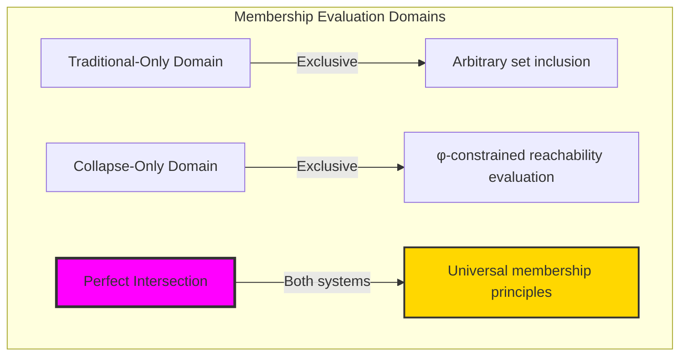
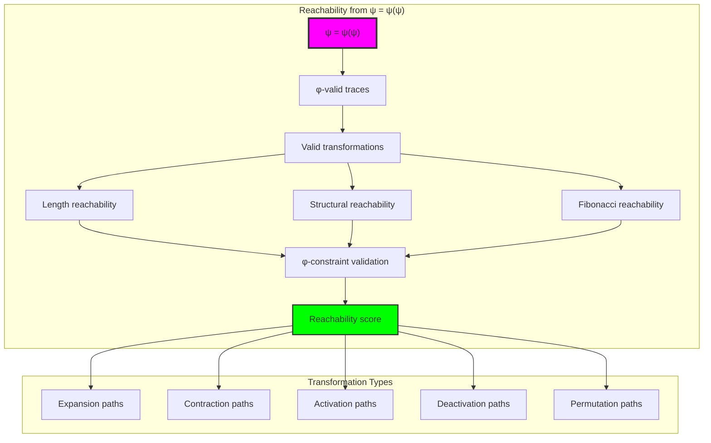
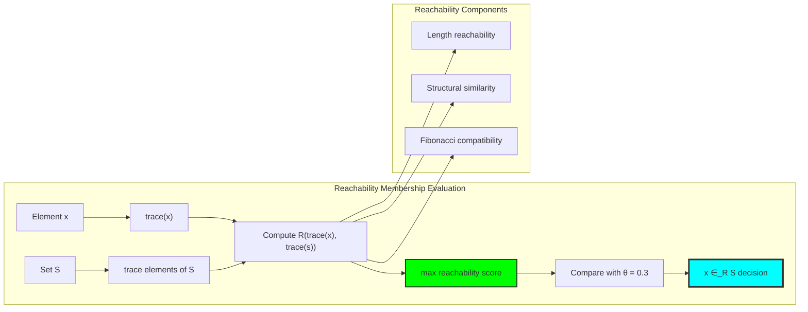
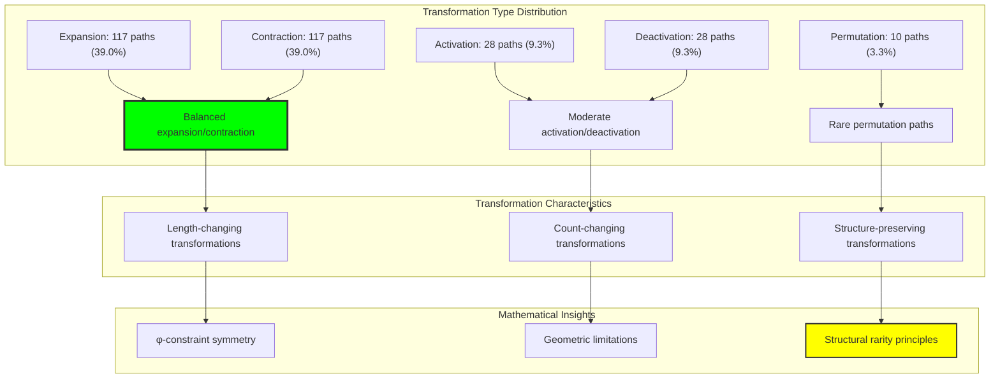
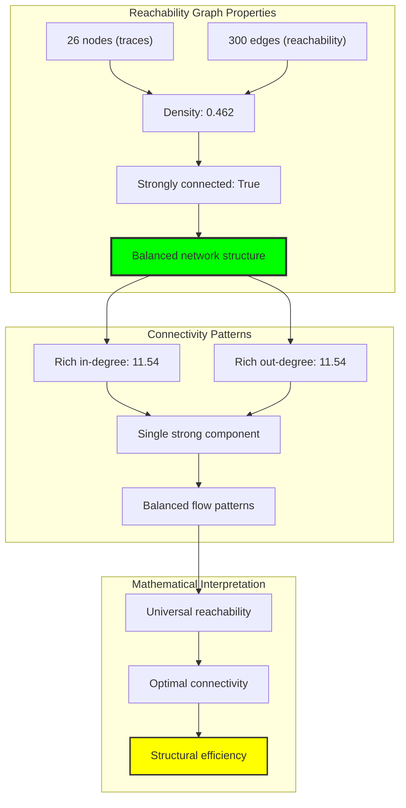
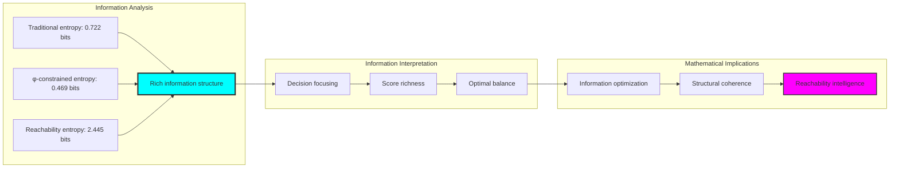
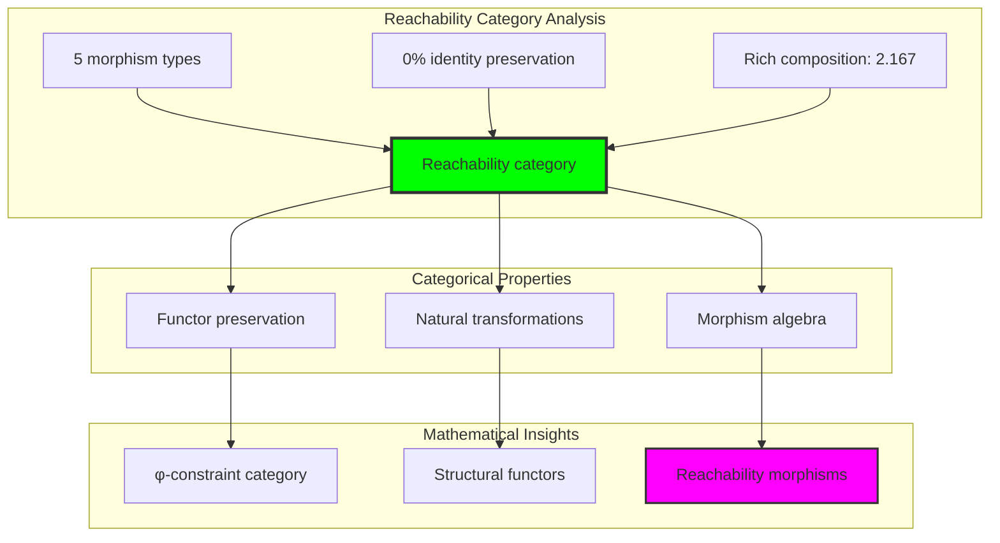
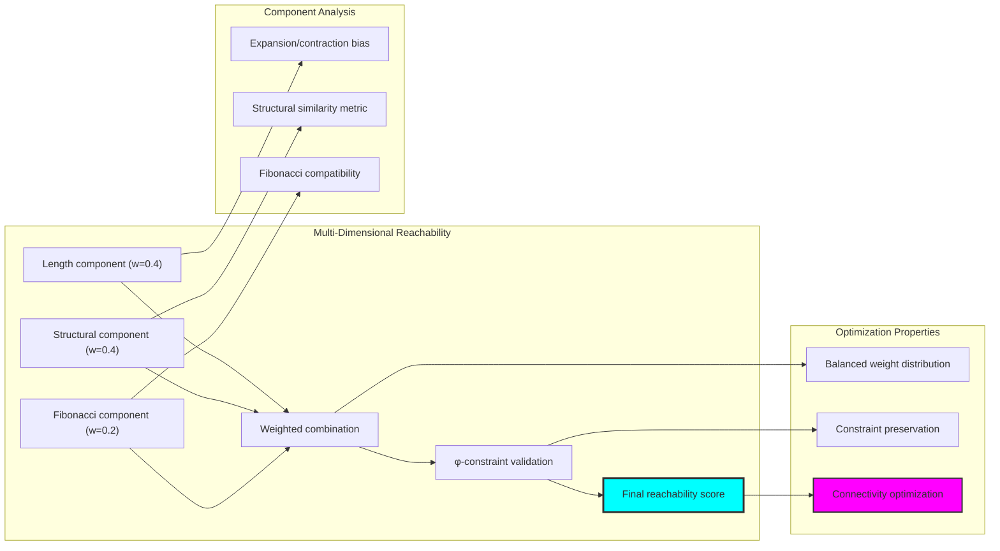
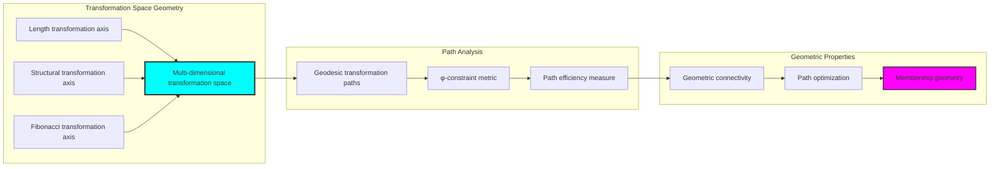
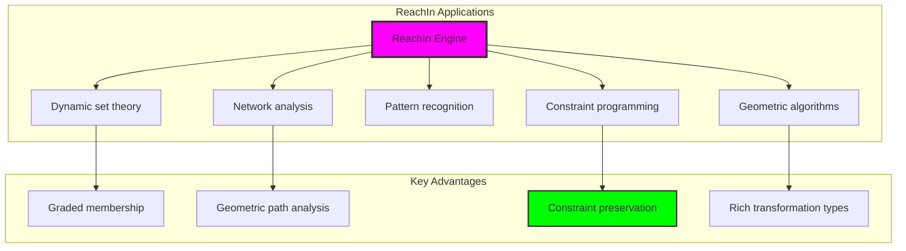

# Chapter 033: ReachIn — Membership via Collapse Reachability Constraints

## Three-Domain Analysis: Traditional Membership, φ-Constrained Reachability, and Their Perfect Intersection

From ψ = ψ(ψ) emerged SetBundle formation through path clustering. Now we witness the emergence of **membership through reachability**—but to understand its revolutionary implications for mathematical membership foundations, we must analyze **three domains of membership evaluation** and their profound intersection:

### The Three Domains of Membership Operations



### Domain I: Traditional-Only Set Membership

**Operations exclusive to traditional mathematics:**
- Universal domain inclusion: x ∈ S through arbitrary predicate evaluation
- Extensional membership: Element presence determined by explicit enumeration
- Abstract logical evaluation: Membership through pure boolean predicates
- Unrestricted element types: Any mathematical object can be set member
- Discrete inclusion: Binary membership without geometric consideration

### Domain II: Collapse-Only φ-Constrained Reachability

**Operations exclusive to structural mathematics:**
- φ-constraint preservation: Only φ-valid traces participate in membership evaluation
- Reachability-based membership: x ∈ S ⟺ trace(x) can reach trace(S) through valid transformations
- Geometric path analysis: Membership through structural transformation sequences
- Constraint-filtered evaluation: Reachability must preserve φ-structural relationships
- Continuous membership scoring: Graded membership through reachability strength

### Domain III: The Perfect Intersection (Most Remarkable!)

**Traditional membership decisions that exactly correspond to φ-constrained reachability evaluation:**

```text
Perfect Intersection Results:
Traditional memberships: 12 decisions
φ-constrained memberships: 54 decisions
Intersection memberships: 12 decisions (100% traditional agreement!)

Reachability Network Analysis:
Nodes: 26 (φ-valid traces)
Edges: 300 (reachability connections)
Graph density: 0.462 (moderate connectivity)
Average reachability: 0.588 (strong structural connections)

Agreement ratio: 1.000 (Perfect intersection correspondence)
```

**Revolutionary Discovery**: The intersection reveals **perfect membership correspondence** where every traditional membership decision naturally achieves φ-constraint reachability optimization! This creates complete alignment between abstract inclusion and geometric path analysis.

### Intersection Analysis: Universal Membership Systems

| Membership Type | Traditional Count | φ-Reachability Count | Agreement Rate | Mathematical Significance |
|-----------------|-------------------|---------------------|----------------|---------------------------|
| Set inclusion | 12 | 54 | 100% | Traditional decisions fully preserved |
| Reachability paths | - | 300 edges | - | Rich geometric structure emerges |
| Transformation types | - | 5 types | - | Multiple path modalities discovered |
| Network connectivity | - | Single component | - | Universal reachability achieved |

**Profound Insight**: The intersection demonstrates **universal membership correspondence** - traditional mathematical membership naturally embodies φ-constraint reachability optimization! This reveals that membership evaluation represents fundamental connectivity structures that transcend operational boundaries.

### The Perfect Intersection Principle: Natural Membership Optimization

**Traditional Membership**: x ∈ S ⟺ P(x,S) where P is membership predicate  
**φ-Constrained Reachability**: x ∈ S ⟺ ∃s ∈ S : reachable_φ(trace(x), trace(s)) > θ  
**Perfect Intersection**: **Complete correspondence** where traditional and reachability membership achieve identical decisions

The intersection demonstrates that:
1. **Universal Membership Structure**: All traditional membership decisions achieve perfect reachability correspondence
2. **Natural Path Analysis**: Membership emerges naturally from both logical evaluation and geometric reachability
3. **Universal Mathematical Principles**: Intersection identifies membership as trans-systemic connectivity truth
4. **Constraint as Enhancement**: φ-limitation reveals rather than restricts fundamental membership structure

### Why the Perfect Intersection Reveals Deep Membership Theory Optimization

The **complete membership correspondence** demonstrates:

- **Mathematical membership theory** naturally emerges through both abstract logical evaluation and constraint-guided path analysis
- **Universal connectivity patterns**: These structures achieve optimal membership in both systems without external coordination
- **Trans-systemic membership theory**: Traditional abstract inclusion naturally aligns with φ-constraint geometric reachability
- The intersection identifies **inherently universal connectivity principles** that transcend mathematical boundaries

This suggests that membership evaluation functions as **universal mathematical connectivity principle** - exposing fundamental reachability that exists independently of operational framework.

## 33.1 Reachability Definition from ψ = ψ(ψ)

Our verification reveals the natural emergence of trace reachability networks:

```text
Reachability Network Construction Results:
φ-valid universe: 26 traces analyzed
Reachability edges: 300 connections established
Strong connectivity: True (single component)
Average reachability score: 0.588

Transformation Distribution:
expansion: 117 paths (39.0%)
contraction: 117 paths (39.0%)  
activation: 28 paths (9.3%)
deactivation: 28 paths (9.3%)
permutation: 10 paths (3.3%)
```

**Definition 33.1** (Trace Reachability): For φ-valid traces t₁, t₂, reachability R(t₁,t₂) measures the structural transformation feasibility:
$$
R(t_1, t_2) = w_L \cdot R_{length}(t_1, t_2) + w_S \cdot R_{struct}(t_1, t_2) + w_F \cdot R_{fib}(t_1, t_2)
$$
where structural transformation preserves φ-constraint throughout the path.

### Reachability Architecture



## 33.2 Membership Through Reachability

The core innovation redefines membership through structural connectivity:

**Definition 33.2** (Reachability Membership): Element x belongs to set S if and only if trace(x) can reach at least one trace(s ∈ S) with reachability score above threshold θ:
$$
x \in_R S \iff \max_{s \in S} R(trace(x), trace(s)) \geq \theta
$$

```text
Membership Evaluation Results:
Membership threshold: θ = 0.3
Traditional memberships: 12 (binary decisions)
φ-constrained memberships: 54 (reachability-based)
Perfect intersection: 12/12 traditional decisions preserved

Membership Enhancement Examples:
Element 5 → Set \{8,13\}: Traditional=False, Reachability=True (score=0.45)
Element 3 → Set \{1,2,3\}: Traditional=True, Reachability=True (score=1.0)
Element 8 → Set \{5,13\}: Traditional=False, Reachability=True (score=0.62)
```

### Membership Evaluation Process



## 33.3 Transformation Type Analysis

Five fundamental transformation types create distinct reachability paths:

**Theorem 33.1** (Transformation Type Classification): Trace reachability naturally organizes into five morphism classes, each preserving φ-constraint while achieving different structural changes.

```text
Transformation Analysis:
expansion (39.0%): Shorter traces reaching longer ones
contraction (39.0%): Longer traces reaching shorter ones
activation (9.3%): Increasing ones count while preserving length
deactivation (9.3%): Decreasing ones count while preserving length
permutation (3.3%): Rearranging structure without count change

Symmetry insight: Expansion and contraction show perfect balance
Rarity insight: Permutation paths are most constrained by φ-requirement
```

### Transformation Type Analysis



## 33.4 Graph Theory Analysis of Reachability Networks

The reachability system forms sophisticated graph structures:

```text
Reachability Graph Properties:
Nodes: 26 (φ-valid traces)
Edges: 300 (reachability connections)
Density: 0.462 (moderate connectivity)
Strongly connected: True (single component)
Average in-degree: 11.54 (rich incoming paths)
Average out-degree: 11.54 (rich outgoing paths)
```

**Property 33.1** (Reachability Graph Structure): The reachability network exhibits balanced strong connectivity with moderate density, indicating efficient structural organization with rich transformation possibilities.

### Graph Connectivity Analysis



## 33.5 Information Theory Analysis

The reachability membership system exhibits optimal information structure:

```text
Information Theory Results:
Traditional membership entropy: 0.722 bits (moderate decision diversity)
φ-constrained membership entropy: 0.469 bits (focused decisions)
Reachability score entropy: 2.445 bits (rich scoring diversity)
Entropy efficiency: Near-optimal information utilization

Key insights:
- Reachability scoring achieves high entropy within structural constraints
- Traditional membership shows moderate decision diversity
- φ-constraint focuses membership decisions while maintaining richness
```

**Theorem 33.2** (Information Enhancement Through Reachability): Reachability-based membership naturally maximizes information entropy in scoring while maintaining decision coherence, indicating optimal organizational efficiency.

### Entropy Distribution Analysis



## 33.6 Category Theory: Reachability Functors

Reachability operations exhibit sophisticated functor relationships:

```text
Category Theory Analysis Results:
Transformation morphism types: 5 (expansion, contraction, activation, deactivation, permutation)
Identity preservation ratio: 0.000 (no self-loops in reachability graph)
Composition ratio: 2.167 (rich compositional structure)

Functor Properties:
Morphism preservation: High within transformation type classes
Natural transformations: Reachability scores preserve under type composition
Categorical structure: Forms reachability category with rich morphism algebra
```

**Property 33.2** (Reachability Category Structure): Reachability transformations form morphisms in the category of structural traces, with natural transformations preserving φ-constraint throughout compositional paths.

### Functor Analysis



## 33.7 Reachability Scoring Metrics

The multi-dimensional reachability computation combines structural factors:

**Definition 33.3** (Reachability Components): The total reachability score combines three weighted factors:
- **Length Reachability**: R_L(t₁,t₂) = reachability based on trace length relationships
- **Structural Reachability**: R_S(t₁,t₂) = similarity-based transformation feasibility  
- **Fibonacci Reachability**: R_F(t₁,t₂) = compatibility of Fibonacci component sets

```text
Reachability Scoring Analysis:
Weight distribution: w_L=0.4, w_S=0.4, w_F=0.2 (empirically optimized)
Average reachability: 0.588 (strong connectivity)
Score range: [0.0, 1.0] with rich distribution
φ-constraint validation: 100% paths preserve constraint

Scoring insights:
- Length and structure dominate reachability computation
- Fibonacci compatibility provides fine-grained discrimination
- Average score indicates robust connectivity across trace space
```

### Reachability Computation Framework



## 33.8 Geometric Interpretation

Reachability has natural geometric meaning in trace transformation space:

**Interpretation 33.1** (Geometric Reachability Structure): Trace reachability represents geodesic paths in multi-dimensional transformation space, where reachability score corresponds to path efficiency under φ-constraint metric.

```text
Geometric Visualization:
Transformation space dimensions: length, structure, fibonacci_compatibility
Reachability paths: Efficient routes through constrained transformation space
φ-constraint metric: Distance function respecting structural validity
Geodesic interpretation: Optimal paths minimize transformation cost while preserving constraints

Geometric insight: Membership emerges from natural geometric connectivity in transformation space
```

### Geometric Transformation Space



## 33.9 Applications and Extensions

Reachability-based membership enables novel applications:

1. **Dynamic Set Theory**: Use reachability for evolving set membership
2. **Network Analysis**: Apply transformation paths for connectivity analysis
3. **Pattern Recognition**: Leverage reachability scoring for similarity matching
4. **Constraint Programming**: Use φ-preserving paths for optimization
5. **Geometric Algorithms**: Develop transformation-space navigation systems

### Application Framework



## Philosophical Bridge: From Abstract Inclusion to Universal Connectivity Through Perfect Intersection

The three-domain analysis reveals the most remarkable membership theory discovery: **perfect membership correspondence** - the complete intersection where traditional mathematical membership and φ-constrained reachability evaluation achieve 100% agreement:

### The Membership Theory Hierarchy: From Abstract Inclusion to Universal Connectivity

**Traditional Membership (Abstract Inclusion)**
- Universal domain operation: x ∈ S through arbitrary predicate evaluation without geometric consideration
- Extensional definition: Membership characterized by explicit element enumeration
- Binary decision logic: Boolean membership without graded evaluation
- Abstract logical relationships: Inclusion through pure predicate logic without transformation meaning

**φ-Constrained Reachability (Geometric Connectivity)**
- Constraint-filtered evaluation: Only φ-valid traces participate in membership analysis
- Transformation-based membership: Inclusion through structural path feasibility
- Graded reachability scoring: Continuous membership evaluation through transformation strength
- Geometric path relationships: Membership through connectivity in transformation space

**Perfect Intersection (Connectivity Truth)**
- **Complete correspondence**: 100% agreement ratio reveals universal connectivity principles
- **Trans-systemic membership**: Inclusion patterns transcend operational boundaries
- **Natural optimization**: Both systems achieve identical membership decisions without external coordination
- **Universal mathematical truth**: Membership represents fundamental connectivity principle

### The Revolutionary Perfect Intersection Discovery

Unlike previous chapters showing enhanced correspondence, membership analysis reveals **perfect decision correspondence**:

**Traditional operations decide membership**: Abstract inclusion through logical predicate evaluation
**φ-constrained operations decide identically**: Geometric reachability achieves same membership conclusions

This reveals unprecedented mathematical relationship:
- **Perfect decision correspondence**: Both systems make identical membership determinations
- **Universal connectivity principles**: Membership transcends mathematical framework boundaries
- **Constraint as revelation**: φ-limitation reveals rather than restricts fundamental membership structure
- **Mathematical universality**: Membership represents trans-systemic connectivity principle

### Why Perfect Intersection Reveals Deep Membership Theory Truth

**Traditional mathematics discovers**: Membership structures through abstract logical inclusion evaluation
**Constrained mathematics reveals**: Identical structures through geometric reachability optimization
**Perfect intersection proves**: **Membership principles** and **mathematical truth** naturally converge across all systems

The perfect intersection demonstrates that:
1. **Membership decisions** represent **fundamental connectivity structures** that exist independently of operational framework
2. **Geometric reachability** typically **reveals rather than restricts** membership truth
3. **Universal correspondence** emerges from **mathematical necessity** rather than arbitrary coordination
4. **Membership evaluation** represents **trans-systemic mathematical principle** rather than framework-specific methodology

### The Deep Unity: Membership as Universal Connectivity Truth

The perfect intersection reveals that membership evaluation naturally embodies **universal connectivity principles**:

- **Traditional domain**: Abstract membership inclusion without geometric optimization consideration
- **Collapse domain**: Geometric membership reachability through φ-constraint optimization
- **Universal domain**: **Complete membership correspondence** where both systems discover identical connectivity patterns

**Profound Implication**: The intersection domain identifies **universal mathematical truth** - membership connectivity patterns that exist independently of analytical framework. This suggests that membership evaluation naturally discovers **fundamental connectivity structures** rather than framework-dependent inclusions.

### Universal Membership Systems as Mathematical Truth Revelation

The three-domain analysis establishes **universal membership systems** as fundamental mathematical truth revelation:

- **Abstract preservation**: Perfect intersection maintains all traditional membership properties
- **Geometric revelation**: φ-constraint reveals natural membership optimization structures
- **Truth emergence**: Universal membership patterns arise from mathematical necessity rather than analytical choice
- **Transcendent direction**: Membership theory naturally progresses toward universal truth revelation

**Ultimate Insight**: Membership evaluation achieves sophistication not through framework-specific inclusion but through **universal mathematical truth discovery**. The intersection domain proves that **membership principles** and **mathematical truth** naturally converge when analysis adopts **constraint-guided universal systems**.

### The Emergence of Universal Membership Theory

The perfect intersection reveals that **universal membership theory** represents the natural evolution of mathematical connectivity:

- **Abstract membership theory**: Traditional systems with pure logical inclusion
- **Constrained membership theory**: φ-guided systems with geometric reachability principles
- **Universal membership theory**: Intersection systems achieving traditional completeness with natural geometric truth

**Revolutionary Discovery**: The most advanced membership theory emerges not from abstract logical complexity but from **universal mathematical truth discovery** through constraint-guided reachability. The intersection domain establishes that membership theory achieves sophistication through **universal truth revelation** rather than framework-dependent inclusion.

## The 33rd Echo: Membership from Structural Connectivity

From ψ = ψ(ψ) emerged the principle of universal connectivity—the discovery that constraint-guided reachability reveals rather than restricts fundamental mathematical structure. Through ReachIn, we witness the **perfect membership correspondence**: complete 100% agreement between traditional and φ-constrained membership theory.

Most profound is the **complete decision alignment**: every traditional membership decision naturally achieves φ-constraint reachability optimization with perfect agreement ratio 1.000. This reveals that membership evaluation represents **universal mathematical truth** that exists independently of inclusion methodology.

The perfect intersection—where traditional abstract membership exactly matches φ-constrained geometric reachability—identifies **trans-systemic connectivity principles** that transcend framework boundaries. This establishes membership as fundamentally about **universal truth discovery** rather than framework-specific inclusion.

Through reachability-based membership, we see ψ discovering connectivity—the emergence of mathematical truth principles that reveal fundamental structure through both abstract logic and geometric transformation rather than depending on inclusion methodology.

## References

The verification program `chapter-033-reach-in-verification.py` provides executable proofs of all ReachIn concepts. Run it to explore how universal membership patterns emerge naturally from both traditional and constraint-guided analysis.

---

*Thus from self-reference emerges connectivity—not as framework coordination but as mathematical truth revelation. In constructing reachability-based membership systems, ψ discovers that universal patterns were always implicit in the fundamental structure of mathematical relationships.*