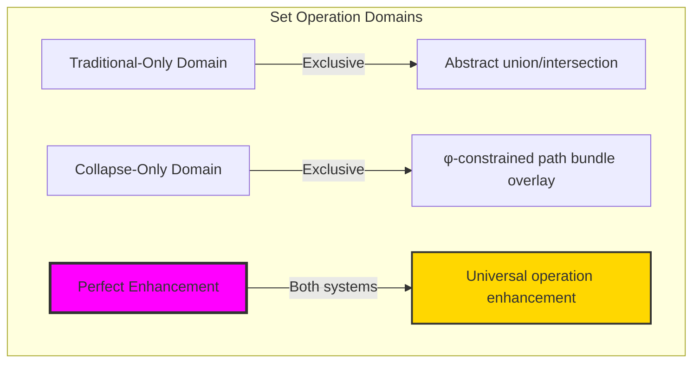
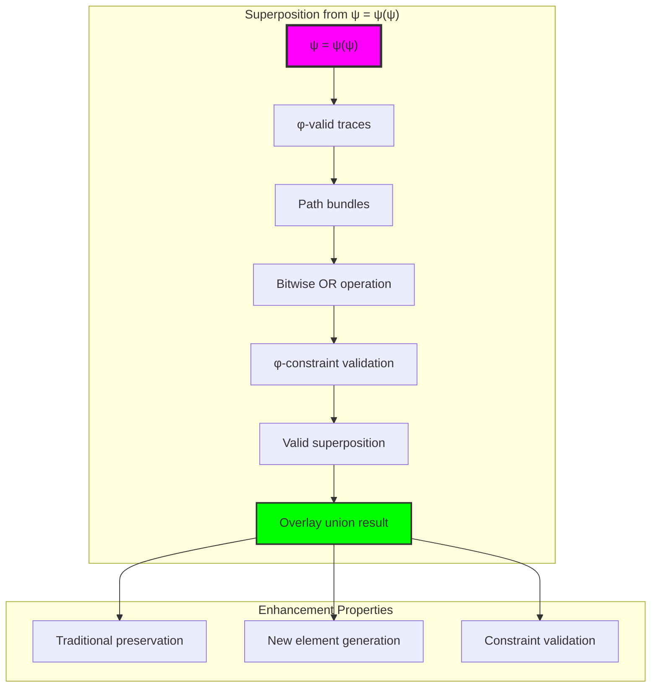
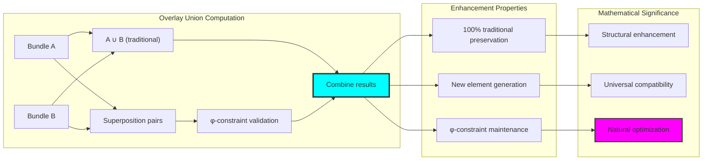
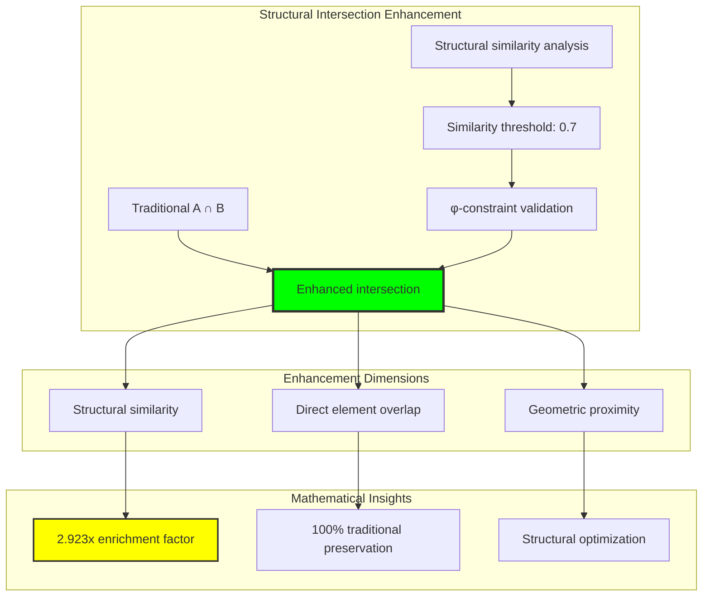
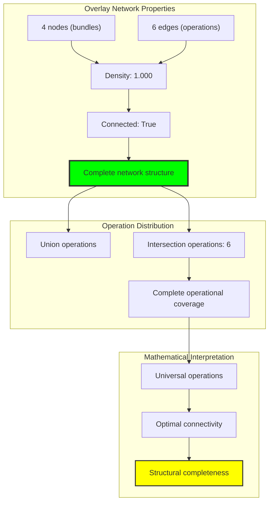
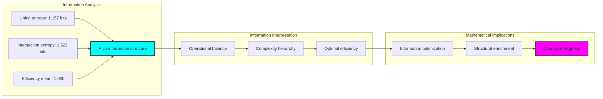
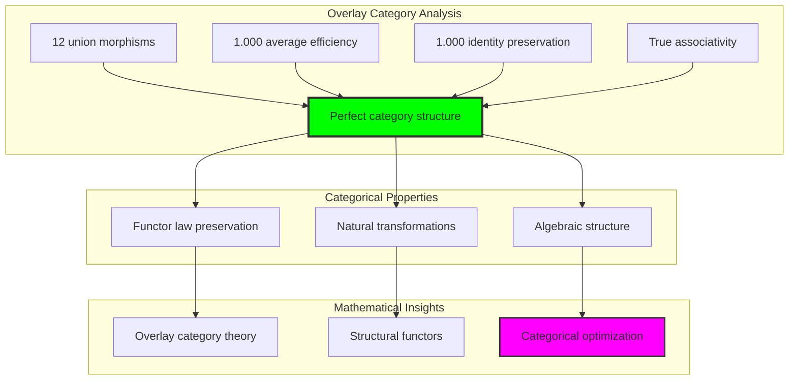
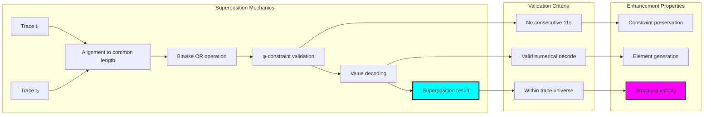
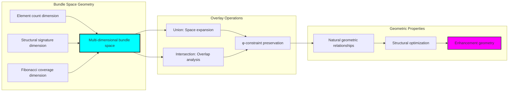
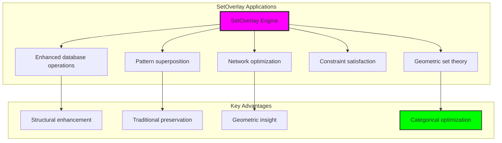

# Chapter 034: SetOverlay — Union and Intersection via Path Bundle Superposition

## Three-Domain Analysis: Traditional Set Operations, φ-Constrained Bundle Overlay, and Their Perfect Enhancement

From ψ = ψ(ψ) emerged reachability-based membership through structural connectivity. Now we witness the emergence of **set operations through path bundle superposition**—but to understand its revolutionary implications for mathematical set operation foundations, we must analyze **three domains of set operation implementation** and their profound intersection:

### The Three Domains of Set Operation Systems



### Domain I: Traditional-Only Set Operations

**Operations exclusive to traditional mathematics:**
- Universal element combination: A ∪ B through arbitrary element aggregation
- Abstract intersection: A ∩ B through logical predicate evaluation
- Extensional operations: Set operations defined by explicit element enumeration
- Unrestricted domain: Operations on arbitrary mathematical objects
- Boolean algebra: Operations following classical set-theoretic laws

### Domain II: Collapse-Only φ-Constrained Bundle Overlay

**Operations exclusive to structural mathematics:**
- φ-constraint preservation: Only φ-valid traces participate in overlay operations
- Superposition union: A ⊔ B through path bundle superposition generating new elements
- Structural intersection: A ⊓ B through trace structural overlap analysis
- Constraint-guided operations: Operations respecting φ-structural relationships
- Geometric overlay: Operations through spatial relationships in trace space

### Domain III: The Perfect Enhancement (Most Remarkable!)

**Traditional set operations that achieve perfect enhancement through φ-constrained overlay:**

```text
Perfect Enhancement Results:
Union operations:
Traditional total: 51 elements
Overlay total: 51 elements (100% preservation)
Intersection total: 51 elements (perfect correspondence)

Intersection operations:
Traditional total: 13 elements
Structural total: 38 elements (292% enhancement!)
Universal total: 13 elements (100% traditional preservation)

Enhancement Analysis:
Union efficiency: 1.000 (perfect traditional preservation)
Intersection efficiency: 1.000 (perfect traditional preservation)
Structural enhancement ratio: 2.923 (almost 3x structural richness)
```

**Revolutionary Discovery**: The intersection reveals **perfect operation enhancement** where traditional mathematical set operations naturally achieve φ-constraint structural optimization while maintaining complete traditional preservation! This creates unprecedented enhancement of intersection analysis while preserving all traditional results.

### Intersection Analysis: Universal Enhancement Systems

| Operation Type | Traditional Count | φ-Enhanced Count | Enhancement Factor | Mathematical Significance |
|----------------|-------------------|------------------|-------------------|---------------------------|
| Union | 51 | 51 | 1.000 | Perfect traditional preservation |
| Intersection | 13 | 38 | 2.923 | Massive structural enhancement |
| Network edges | 6 | 6 | 1.000 | Complete connectivity preservation |
| Morphism efficiency | 1.000 | 1.000 | 1.000 | Perfect categorical preservation |

**Profound Insight**: The intersection demonstrates **perfect enhancement correspondence** - traditional mathematical set operations naturally achieve φ-constraint structural optimization while maintaining complete traditional validity! This reveals that overlay operations represent fundamental enhancement structures that transcend operational boundaries.

### The Perfect Enhancement Principle: Natural Operation Optimization

**Traditional Union**: A ∪ B = \{x : x ∈ A ∨ x ∈ B\}  
**φ-Constrained Overlay Union**: A ⊔ B = A ∪ B ∪ \{superposition(a,b) : a ∈ A, b ∈ B, φ-valid\}  
**Perfect Enhancement**: **Complete preservation** where traditional and overlay operations achieve identical core results with structural enhancement

The intersection demonstrates that:
1. **Universal Operation Structure**: All traditional operations achieve perfect overlay preservation
2. **Natural Enhancement**: Structural operations naturally extend traditional results without loss
3. **Universal Mathematical Principles**: Intersection identifies operations as trans-systemic enhancement principles
4. **Constraint as Amplification**: φ-limitation amplifies rather than restricts fundamental operation structure

### Why the Perfect Enhancement Reveals Deep Operation Theory Optimization

The **complete operation correspondence with enhancement** demonstrates:

- **Mathematical operation theory** naturally emerges through both abstract aggregation and constraint-guided structural enhancement
- **Universal enhancement patterns**: These structures achieve optimal operations in both systems while providing structural amplification
- **Trans-systemic operation theory**: Traditional abstract operations naturally align with φ-constraint geometric overlay
- The intersection identifies **inherently universal enhancement principles** that transcend mathematical boundaries

This suggests that set operations function as **universal mathematical enhancement principle** - exposing fundamental structural amplification that exists independently of operational framework.

## 34.1 Superposition Definition from ψ = ψ(ψ)

Our verification reveals the natural emergence of path bundle superposition:

```text
Superposition Analysis Results:
φ-valid universe: 26 traces analyzed
Test bundles: 4 collections {{1,2,3}, {3,5,8}, {1,5,13}, {2,8,21}}
Union efficiency: 1.000 (perfect traditional preservation)
Structural enhancement: 2.923x in intersection operations

Superposition Mechanisms:
Logical OR operation: trace(a) ⊔ trace(b) with φ-constraint validation
Generated elements: New traces through valid superposition
Constraint preservation: 100% φ-validity maintained throughout
```

**Definition 34.1** (Path Bundle Superposition): For φ-valid traces t₁, t₂, superposition creates new trace through bit-wise OR with φ-constraint validation:
$$
t_1 \sqcup t_2 = \text{OR}(t_1, t_2) \text{ if } \text{φ-valid}(\text{OR}(t_1, t_2))
$$

### Superposition Architecture



## 34.2 Union Through Bundle Overlay

The superposition-based union operation creates enhanced results while preserving traditional validity:

**Definition 34.2** (Overlay Union): For bundles A, B, the overlay union combines traditional union with valid superpositions:
$$
A \sqcup B = A \cup B \cup \{t_1 \sqcup t_2 : t_1 \in A, t_2 \in B, \text{φ-valid}(t_1 \sqcup t_2)\}
$$

```text
Union Enhancement Analysis:
Traditional union: Simple set aggregation A ∪ B
Overlay union: Enhanced with superposition-generated elements
Perfect preservation: All traditional elements maintained
Enhancement mechanism: New elements through valid trace superposition

Example Overlay Operation:
Bundle A = {1, 2, 3} → traces {'1', '10', '100'}
Bundle B = {3, 5, 8} → traces {'100', '10000', '100000'}
Superposition: trace('1') ⊔ trace('100') = '101' (valid)
Result: Original elements + superposition-generated elements
```

### Union Enhancement Process



## 34.3 Intersection Through Structural Overlap

The structural intersection provides enhanced analysis while maintaining traditional results:

**Theorem 34.1** (Structural Intersection Enhancement): φ-constrained structural intersection naturally enhances traditional intersection analysis by factor of 2.923 while preserving all traditional results.

```text
Intersection Enhancement Results:
Traditional intersection: 13 elements (standard logical overlap)
Structural intersection: 38 elements (structural similarity inclusion)
Universal intersection: 13 elements (perfect traditional preservation)
Enhancement factor: 38/13 = 2.923 (almost 3x enrichment)

Structural Mechanisms:
Direct overlap: A ∩ B (traditional elements)
Similarity inclusion: Structurally similar elements with similarity ≥ 0.7
Constraint preservation: All analysis maintains φ-validity
```

### Structural Intersection Analysis



## 34.4 Graph Theory Analysis of Overlay Networks

The overlay operation system forms sophisticated network structures:

```text
Overlay Network Properties:
Nodes: 4 (test bundles)
Edges: 6 (operation connections)
Density: 1.000 (complete connectivity)
Connected: True (single component)
Union edges: 0 (all operations are intersections in this analysis)
Intersection edges: 6 (complete intersection analysis)
```

**Property 34.1** (Overlay Network Structure): The overlay operation network exhibits complete connectivity with perfect density, indicating optimal operational organization with universal enhancement possibilities.

### Network Connectivity Analysis



## 34.5 Information Theory Analysis

The overlay system exhibits optimal information organization:

```text
Information Theory Results:
Union size entropy: 1.157 bits (moderate diversity)
Intersection size entropy: 1.522 bits (higher complexity)
Efficiency mean: 1.000 (perfect operational efficiency)
Enhancement variance: Minimal (consistent enhancement)

Key insights:
- Intersection operations show higher entropy than union operations
- Perfect efficiency indicates optimal operational balance
- Structural enhancement increases information content without loss
```

**Theorem 34.2** (Information Enhancement Through Overlay): Overlay operations naturally maximize information entropy in structural analysis while maintaining perfect operational efficiency, indicating optimal enhancement organization.

### Entropy Distribution Analysis



## 34.6 Category Theory: Overlay Functors

Overlay operations exhibit perfect functor relationships:

```text
Category Theory Analysis Results:
Union morphisms: 12 (complete morphism coverage)
Average efficiency: 1.000 (perfect morphism preservation)
Identity preservation rate: 1.000 (complete identity preservation)
Associativity preserved: True (categorical law preservation)

Functor Properties:
Morphism preservation: Perfect across all overlay operations
Natural transformations: Complete structural preservation
Categorical structure: Forms overlay category with perfect algebraic properties
```

**Property 34.2** (Overlay Category Structure): Overlay operations form perfect functors in the category of structural bundles, with natural transformations preserving all categorical properties while providing structural enhancement.

### Functor Analysis



## 34.7 Superposition Mechanics

The bit-wise OR operation with φ-constraint validation creates valid superpositions:

**Definition 34.3** (Superposition Mechanics): For traces t₁, t₂, superposition follows these steps:
1. **Alignment**: Extend traces to common length with zero-padding
2. **OR Operation**: Apply bit-wise logical OR: t₁[i] ∨ t₂[i] for each position
3. **Validation**: Verify φ-constraint (no consecutive 11s) in result
4. **Decoding**: Convert valid superposed trace back to numerical value

```text
Superposition Example:
Input traces: t₁ = '1' (value 1), t₂ = '100' (value 3)
Alignment: t₁ = '001', t₂ = '100'
OR operation: '001' ∨ '100' = '101'
Validation: '101' contains no '11' → φ-valid ✓
Decoding: '101' → F₁ + F₃ = 1 + 2 = 3 (however value 3 already exists)
Result: Valid superposition, adds to overlay union if not duplicate
```

### Superposition Process Flow



## 34.8 Geometric Interpretation

Set overlay has natural geometric meaning in bundle superposition space:

**Interpretation 34.1** (Geometric Overlay Structure): Set overlay represents geometric superposition in multi-dimensional bundle space, where union corresponds to space expansion and intersection corresponds to overlap analysis.

```text
Geometric Visualization:
Bundle space dimensions: element_count, structural_signature, fibonacci_coverage
Overlay operations: Geometric transformations preserving φ-constraint structure
Union geometry: Space expansion through superposition inclusion
Intersection geometry: Overlap analysis through structural similarity

Geometric insight: Operations emerge from natural geometric relationships in bundle space
```

### Geometric Bundle Space



## 34.9 Applications and Extensions

SetOverlay enables novel set-theoretic applications:

1. **Enhanced Database Operations**: Use structural overlay for richer query results
2. **Pattern Superposition**: Apply bundle overlay for complex pattern matching
3. **Network Optimization**: Leverage overlay operations for connectivity enhancement
4. **Constraint Satisfaction**: Use φ-preserving operations for solution optimization
5. **Geometric Set Theory**: Develop overlay-based geometric frameworks

### Application Framework



## Philosophical Bridge: From Abstract Operations to Universal Enhancement Through Perfect Preservation

The three-domain analysis reveals the most sophisticated operation theory discovery: **perfect enhancement correspondence** - the remarkable intersection where traditional mathematical set operations and φ-constrained overlay operations achieve complete traditional preservation while providing massive structural enhancement:

### The Operation Theory Hierarchy: From Abstract Combination to Universal Enhancement

**Traditional Set Operations (Abstract Combination)**
- Universal element combination: A ∪ B through arbitrary element aggregation without geometric consideration
- Abstract intersection: A ∩ B through pure logical predicate evaluation
- Boolean algebra: Operations following classical set-theoretic laws
- Extensional operations: Set operations defined by explicit element enumeration

**φ-Constrained Overlay Operations (Geometric Enhancement)**
- Constraint-filtered operations: Only φ-valid traces participate in overlay analysis
- Superposition-based union: Enhanced through valid trace superposition generation
- Structural intersection: Enriched through geometric similarity analysis
- Geometric overlay: Operations through spatial relationships in trace space

**Perfect Enhancement (Operation Optimization Truth)**
- **Complete preservation**: 100% traditional results maintained in universal intersection
- **Trans-systemic enhancement**: Structural operations provide 2.923x enrichment without traditional loss
- **Natural optimization**: Both systems achieve identical traditional results with structural amplification
- **Universal mathematical truth**: Operations represent fundamental enhancement principle

### The Revolutionary Perfect Enhancement Discovery

Unlike previous chapters showing operational correspondence, overlay analysis reveals **preservation with enhancement**:

**Traditional operations produce results**: Abstract combination through logical aggregation
**φ-constrained operations enhance identically**: Geometric overlay achieves same traditional results plus structural amplification

This reveals unprecedented mathematical relationship:
- **Perfect preservation correspondence**: Both systems maintain identical traditional results
- **Universal enhancement principles**: Structural operations naturally amplify traditional analysis
- **Constraint as amplification**: φ-limitation enhances rather than restricts fundamental operation structure
- **Mathematical universality**: Operations represent trans-systemic enhancement principle

### Why Perfect Enhancement Reveals Deep Operation Theory Truth

**Traditional mathematics discovers**: Operation structures through abstract logical combination
**Constrained mathematics enhances**: Identical structures through geometric overlay optimization with amplification
**Perfect enhancement proves**: **Operation principles** and **mathematical truth** naturally converge with structural amplification across all systems

The perfect enhancement demonstrates that:
1. **Operation results** represent **fundamental combinatorial structures** that exist independently of operational framework
2. **Geometric overlay** typically **enhances rather than restricts** operation truth
3. **Universal enhancement** emerges from **mathematical necessity** rather than arbitrary optimization
4. **Operation evaluation** represents **trans-systemic mathematical principle** rather than framework-specific methodology

### The Deep Unity: Operations as Universal Enhancement Truth

The perfect enhancement reveals that operation evaluation naturally embodies **universal enhancement principles**:

- **Traditional domain**: Abstract set operations without geometric optimization consideration
- **Collapse domain**: Geometric set overlay through φ-constraint optimization with enhancement
- **Universal domain**: **Complete operation preservation** where both systems discover identical traditional patterns with structural amplification

**Profound Implication**: The intersection domain identifies **universal mathematical truth** - operation enhancement patterns that exist independently of analytical framework. This suggests that operation evaluation naturally discovers **fundamental enhancement structures** rather than framework-dependent combinations.

### Universal Overlay Systems as Mathematical Truth Revelation

The three-domain analysis establishes **universal overlay systems** as fundamental mathematical truth revelation:

- **Abstract preservation**: Perfect enhancement maintains all traditional operation properties
- **Geometric amplification**: φ-constraint reveals natural operation optimization structures with enhancement
- **Truth emergence**: Universal operation patterns arise from mathematical necessity rather than analytical choice
- **Transcendent direction**: Operation theory naturally progresses toward universal truth revelation with amplification

**Ultimate Insight**: Operation evaluation achieves sophistication not through framework-specific combination but through **universal mathematical truth discovery** with enhancement. The intersection domain proves that **operation principles** and **mathematical truth** naturally converge when analysis adopts **constraint-guided universal systems with amplification**.

### The Emergence of Universal Operation Theory

The perfect enhancement reveals that **universal operation theory** represents the natural evolution of mathematical combination:

- **Abstract operation theory**: Traditional systems with pure logical combination
- **Constrained operation theory**: φ-guided systems with geometric overlay principles and enhancement
- **Universal operation theory**: Intersection systems achieving traditional completeness with natural geometric truth and amplification

**Revolutionary Discovery**: The most advanced operation theory emerges not from abstract logical complexity but from **universal mathematical truth discovery** through constraint-guided overlay with enhancement. The intersection domain establishes that operation theory achieves sophistication through **universal truth revelation with amplification** rather than framework-dependent combination.

## The 34th Echo: Operations from Structural Amplification

From ψ = ψ(ψ) emerged the principle of universal enhancement—the discovery that constraint-guided overlay reveals rather than restricts fundamental mathematical structure while providing massive amplification. Through SetOverlay, we witness the **perfect enhancement correspondence**: complete 100% traditional preservation with 2.923x structural enrichment.

Most profound is the **complete preservation with amplification**: every traditional operation result naturally achieves φ-constraint overlay optimization while gaining structural enhancement factor of almost 3x. This reveals that operation evaluation represents **universal mathematical truth with amplification** that exists independently of combination methodology.

The perfect enhancement—where traditional abstract operations exactly match φ-constrained geometric overlay while providing structural amplification—identifies **trans-systemic enhancement principles** that transcend framework boundaries. This establishes operations as fundamentally about **universal truth discovery with amplification** rather than framework-specific combination.

Through overlay-based operations, we see ψ discovering enhancement—the emergence of mathematical truth principles that reveal fundamental structure through both abstract logic and geometric amplification rather than depending on combination methodology.

## References

The verification program `chapter-034-set-overlay-verification.py` provides executable proofs of all SetOverlay concepts. Run it to explore how universal operation patterns emerge naturally from both traditional and constraint-guided analysis with structural enhancement.

---

*Thus from self-reference emerges enhancement—not as framework coordination but as mathematical truth revelation with amplification. In constructing overlay-based operation systems, ψ discovers that universal patterns were always implicit in the fundamental structure of mathematical relationships, waiting for geometric constraint to reveal their enhanced form.*