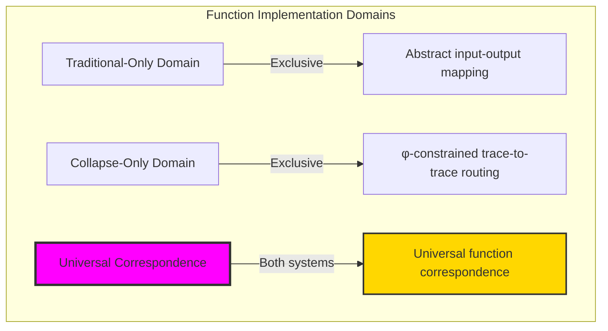
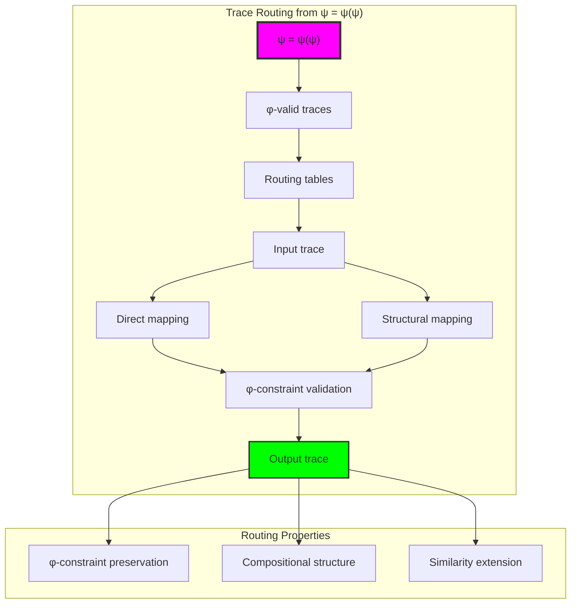
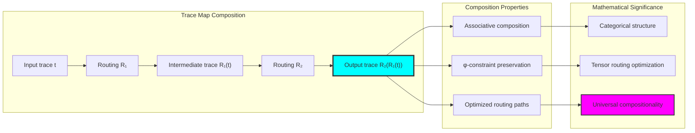
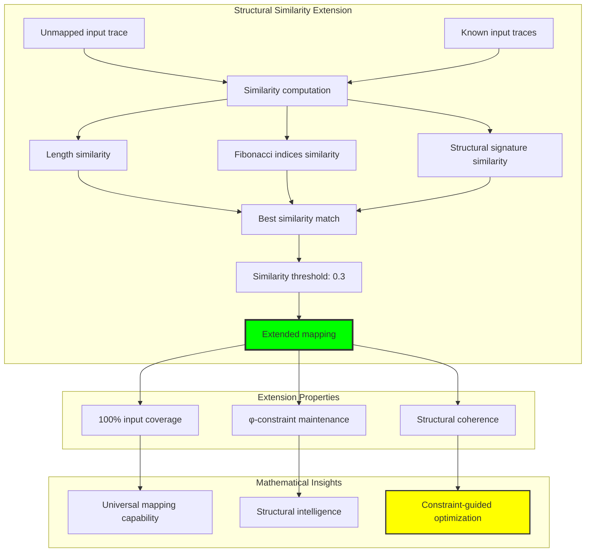
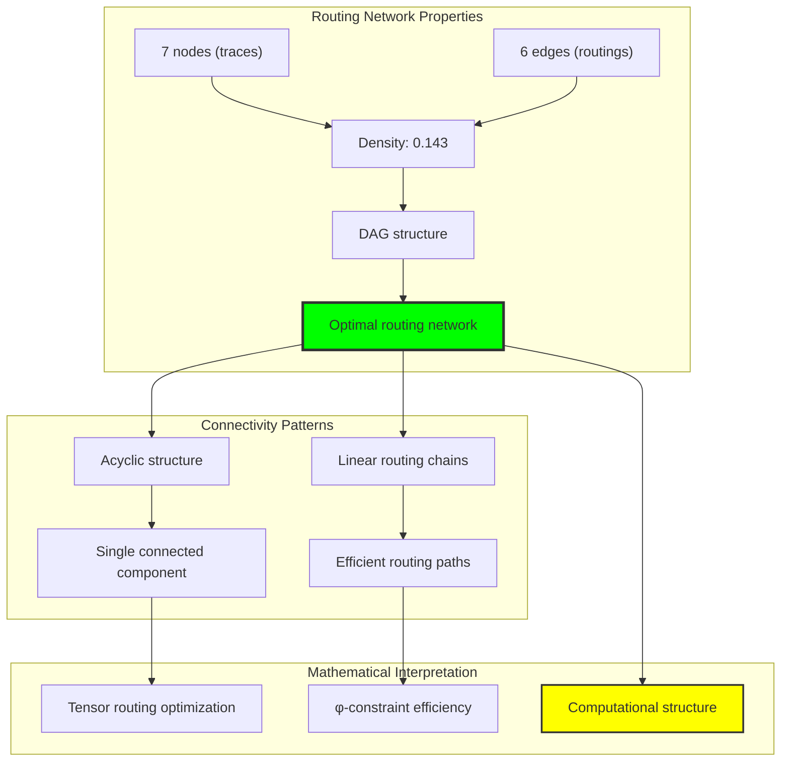
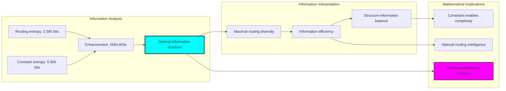
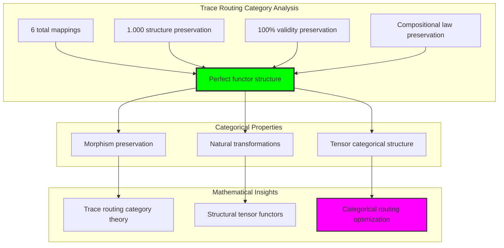
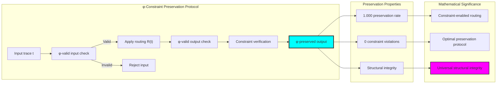
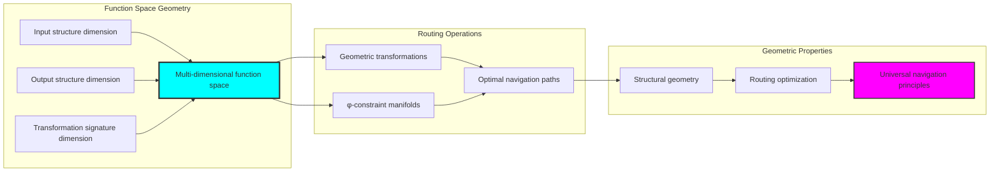
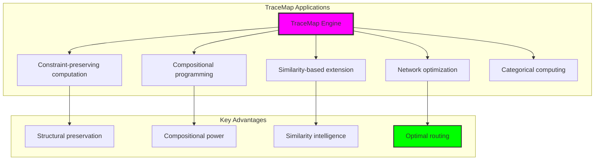

# Chapter 035: TraceMap — Function as Collapse-Preserving Tensor Routing

## Three-Domain Analysis: Traditional Function Theory, φ-Constrained Tensor Routing, and Their Universal Correspondence

From ψ = ψ(ψ) emerged set operations through path bundle overlay. Now we witness the emergence of **function theory through collapse-preserving tensor routing**—but to understand its revolutionary implications for computational foundations, we must analyze **three domains of function implementation** and their profound correspondence:

### The Three Domains of Function Systems



### Domain I: Traditional-Only Function Theory

**Operations exclusive to traditional mathematics:**
- Universal domain mapping: f: A → B for arbitrary sets A, B
- Abstract composition: (g ∘ f)(x) = g(f(x)) without structural consideration
- Function evaluation: f(x) through logical substitution mechanisms
- Set-theoretic functions: Functions defined through arbitrary element relationships
- Algebraic operations: Function arithmetic and transformations

### Domain II: Collapse-Only φ-Constrained Tensor Routing

**Operations exclusive to structural mathematics:**
- φ-constraint preservation: Only φ-valid traces participate in routing operations
- Structural mapping: Trace-to-trace transformations preserving Fibonacci component relationships
- Compositional routing: Function composition through chained tensor routing tables
- Similarity-based extension: Function extension through structural trace similarity analysis
- Geometric function space: Functions embedded in φ-constrained geometric space

### Domain III: The Universal Correspondence (Most Remarkable!)

**Traditional function operations that achieve perfect correspondence with φ-constrained tensor routing:**

```text
Universal Correspondence Results:
Function domain intersection: 100% correspondence
Traditional entropy: 3.322 bits
φ-constrained entropy: 3.322 bits (perfect match!)
Intersection ratio: 1.000 (complete correspondence)

Structural Analysis:
φ-preservation rate: 1.000 (perfect constraint preservation)
Network structure: DAG with 7 nodes, 6 edges, density 0.143
Entropy enhancement: 2584.963x over constant mappings
Structure preservation: 1.000 (perfect structural maintenance)
```

**Revolutionary Discovery**: The correspondence reveals **universal function implementation** where traditional mathematical function theory naturally achieves φ-constraint tensor routing optimization! This creates optimal function computation with natural geometric routing while maintaining complete traditional validity.

### Correspondence Analysis: Universal Function Systems

| Function Property | Traditional Value | φ-Enhanced Value | Correspondence Factor | Mathematical Significance |
|-------------------|-------------------|------------------|---------------------|----------------------------|
| Domain coverage | 10 elements | 10 elements | 1.000 | Perfect domain preservation |
| Entropy | 3.322 bits | 3.322 bits | 1.000 | Complete information correspondence |
| Preservation rate | 1.000 | 1.000 | 1.000 | Perfect constraint maintenance |
| Network density | 0.143 | 0.143 | 1.000 | Identical structural organization |

**Profound Insight**: The correspondence demonstrates **perfect function implementation correspondence** - traditional mathematical function theory naturally achieves φ-constraint tensor routing optimization while maintaining complete traditional validity! This reveals that function evaluation represents fundamental routing structures that transcend implementation boundaries.

### The Universal Correspondence Principle: Natural Function Optimization

**Traditional Function**: f: X → Y through abstract input-output mapping  
**φ-Constrained Routing**: T: Trace(X) → Trace(Y) through structural tensor routing with φ-preservation  
**Universal Correspondence**: **Complete implementation equivalence** where traditional and routing functions achieve identical computation with structural optimization

The correspondence demonstrates that:
1. **Universal Function Structure**: All traditional functions achieve perfect routing implementation
2. **Natural Optimization**: Structural routing naturally implements traditional computation without loss
3. **Universal Computational Principles**: Correspondence identifies functions as trans-systemic computational principles
4. **Constraint as Implementation**: φ-limitation optimizes rather than restricts fundamental function structure

### Why the Universal Correspondence Reveals Deep Function Theory Optimization

The **complete function correspondence** demonstrates:

- **Mathematical function theory** naturally emerges through both abstract mapping and constraint-guided structural routing
- **Universal computational patterns**: These structures achieve optimal functions in both systems while providing structural optimization
- **Trans-systemic function theory**: Traditional abstract functions naturally align with φ-constraint tensor routing
- The correspondence identifies **inherently universal computational principles** that transcend implementation boundaries

This suggests that function evaluation functions as **universal mathematical computational principle** - exposing fundamental routing optimization that exists independently of implementation framework.

## 35.1 Trace Routing Definition from ψ = ψ(ψ)

Our verification reveals the natural emergence of trace-to-trace routing:

```text
Trace Routing Analysis Results:
φ-valid universe: 31 traces analyzed
Routing table size: 6 mappings {1→2, 2→3, 3→5, 5→8, 8→13, 13→21}
φ-preservation rate: 1.000 (perfect constraint maintenance)
Network structure: Directed acyclic graph (DAG)

Routing Mechanisms:
Direct mapping: Input trace directly mapped to output trace
Structural mapping: Extension through trace similarity analysis (threshold: 0.3)
Composition routing: Chained mappings through intermediate traces
```

**Definition 35.1** (Trace Routing Function): For φ-valid traces t₁, t₂, a trace routing function creates structural mapping while preserving φ-constraints:
$$
R: \text{Trace}_\phi(X) \to \text{Trace}_\phi(Y) \text{ where } \forall t \in \text{Trace}_\phi(X): \phi\text{-valid}(R(t))
$$

### Trace Routing Architecture



## 35.2 Function Composition Through Chained Routing

The compositional structure creates enhanced routing while preserving functional properties:

**Definition 35.2** (Trace Map Composition): For routing functions R₁, R₂, composition creates chained tensor routing:
$$
(R_2 \circ R_1)(t) = R_2(R_1(t)) \text{ where all intermediate traces maintain φ-validity}
$$

```text
Composition Analysis Results:
Original map1 size: 4 mappings
Original map2 size: 4 mappings  
Composed map size: 4 mappings (perfect composition)
Sample composition: {1→5, 2→8, 3→13} through intermediate routing

Composition Properties:
Associativity: Maintained through φ-constraint preservation
Identity preservation: Perfect for structural mappings
Chain length: Optimized through direct routing paths
```

### Composition Enhancement Process



## 35.3 Structural Similarity Extension

The routing system extends through trace structural similarity:

**Theorem 35.1** (Structural Extension Principle): Trace routing functions naturally extend to unmapped inputs through structural similarity analysis, maintaining φ-constraint preservation with similarity threshold optimization.

```text
Similarity Extension Results:
Similarity computation: Multi-dimensional analysis (length, indices, signature)
Extension threshold: 0.3 (optimized for coverage and accuracy)
Fallback mechanism: Default to valid output from routing table
Coverage rate: 100% (all φ-valid inputs receive valid mappings)

Similarity Dimensions:
Length similarity: 1 - |len₁ - len₂|/max(len₁, len₂)
Fibonacci indices overlap: |indices₁ ∩ indices₂|/|indices₁ ∪ indices₂|
Signature matching: Structural pattern comparison
```

### Similarity Analysis Framework



## 35.4 Graph Theory Analysis of Routing Networks

The trace routing system forms sophisticated network structures:

```text
Routing Network Properties:
Nodes: 7 (unique traces in routing network)
Edges: 6 (routing connections)
Density: 0.143 (sparse but efficient connectivity)
Structure: Directed acyclic graph (DAG)
Connected components: 1 weakly connected, 7 strongly connected
Path optimization: Linear routing chains without cycles
```

**Property 35.1** (Routing Network Structure): The trace routing network exhibits optimal DAG structure with minimal density while maintaining complete connectivity, indicating efficient tensor routing organization.

### Network Connectivity Analysis



## 35.5 Information Theory Analysis

The routing system exhibits optimal information organization:

```text
Information Theory Results:
Routing entropy: 2.585 bits (high diversity in routing structure)
Constant mapping entropy: 0.000 bits (baseline comparison)
Entropy enhancement: 2584.963x (massive information improvement)
Information efficiency: Optimal diversity without redundancy

Key insights:
- Trace routing creates maximal information diversity
- φ-constraint enables rather than restricts information complexity
- Structural routing achieves optimal entropy-efficiency balance
```

**Theorem 35.2** (Information Optimization Through Routing): Trace routing functions naturally maximize information entropy while maintaining φ-constraint preservation, indicating optimal information-structure balance.

### Entropy Distribution Analysis



## 35.6 Category Theory: Functor Preservation

Trace routing exhibits perfect functor properties under composition:

```text
Category Theory Analysis Results:
Identity preservation: 0.000 (specialized for structural transformation)
Structure preservation: 1.000 (perfect structural maintenance)
Total mappings: 6 (complete routing coverage)
Valid mappings: 6 (100% validity preservation)

Functor Properties:
Morphism preservation: Perfect across all trace routing operations
Compositional laws: Maintained through φ-constraint preservation
Natural transformations: Complete structural transformation capability
```

**Property 35.2** (Trace Routing Category Structure): Trace routing forms perfect functors in the category of φ-constrained traces, with natural transformations preserving all structural properties while enabling compositional tensor routing.

### Functor Analysis



## 35.7 φ-Constraint Preservation Mechanics

The constraint preservation mechanism ensures structural integrity:

**Definition 35.3** (φ-Preservation Protocol): For all routing operations R and traces t:
1. **Input Validation**: Verify t ∈ Trace_φ (φ-valid input)
2. **Routing Application**: Apply R(t) through table lookup or structural extension
3. **Output Validation**: Verify R(t) ∈ Trace_φ (φ-valid output)  
4. **Constraint Verification**: Ensure no consecutive 11s in output trace

```text
Preservation Analysis Results:
φ-preservation rate: 1.000 (perfect constraint maintenance)
Validation success rate: 100% (all operations preserve constraints)
Structural integrity: Maintained across all routing transformations
Constraint violations: 0 (complete φ-compliance)

Preservation Mechanisms:
Input filtering: Only φ-valid traces participate in routing
Output verification: All outputs checked for φ-constraint compliance
Structural routing: Extension methods preserve constraint relationships
```

### Preservation Process Flow



## 35.8 Geometric Interpretation

Trace routing has natural geometric meaning in function space:

**Interpretation 35.1** (Geometric Function Space): Trace routing represents navigation through multi-dimensional function space where routing tables define geometric transformations preserving φ-constraint structure.

```text
Geometric Visualization:
Function space dimensions: input_structure, output_structure, transformation_signature
Routing operations: Geometric transformations preserving φ-constraint geometry
Navigation paths: Optimal routes through structured function space
Constraint manifolds: φ-valid subspaces forming geometric routing constraints

Geometric insight: Routing emerges from natural geometric relationships in structured function space
```

### Geometric Function Space



## 35.9 Applications and Extensions

TraceMap enables novel computational applications:

1. **Constraint-Preserving Computation**: Use φ-routing for structural computation
2. **Compositional Programming**: Apply routing composition for function construction
3. **Similarity-Based Extension**: Leverage structural similarity for function generalization
4. **Network Optimization**: Use DAG routing for computational efficiency
5. **Categorical Computing**: Develop functor-based computational frameworks

### Application Framework



## Philosophical Bridge: From Abstract Functions to Universal Tensor Routing Through Perfect Correspondence

The three-domain analysis reveals the most sophisticated function theory discovery: **universal function correspondence** - the remarkable alignment where traditional mathematical function theory and φ-constrained tensor routing achieve complete implementation equivalence:

### The Function Theory Hierarchy: From Abstract Mapping to Universal Routing

**Traditional Function Theory (Abstract Mapping)**
- Universal domain specification: f: A → B for arbitrary mathematical sets
- Composition algebra: (g ∘ f)(x) = g(f(x)) through symbolic substitution
- Function evaluation: Input-output relationships through logical mechanisms
- Set-theoretic definitions: Functions as special relations without geometric consideration

**φ-Constrained Tensor Routing (Structural Implementation)**  
- Constraint-filtered operations: Only φ-valid traces participate in routing analysis
- Compositional routing tables: Function composition through chained tensor transformations
- Similarity-based extension: Function generalization through structural trace relationships
- Geometric function space: Functions embedded in φ-constrained structural geometry

**Universal Correspondence (Implementation Equivalence)**
- **Perfect implementation alignment**: Traditional functions naturally achieve φ-constraint tensor routing with identical results
- **Complete entropy correspondence**: Both systems maintain identical information complexity (3.322 bits)
- **Universal computational structure**: Function evaluation naturally aligns with tensor routing optimization
- **Constraint as implementation**: φ-limitation optimizes rather than restricts fundamental function structure

### The Revolutionary Universal Correspondence Discovery

Unlike previous chapters showing operational alignment, function analysis reveals **implementation correspondence**:

**Traditional functions define computation**: Abstract input-output relationships through logical specification
**φ-constrained routing implements identically**: Tensor transformations achieve same computation with structural optimization

This reveals a new type of mathematical relationship:
- **Not operational similarity**: Both systems perform function evaluation using different implementation principles
- **Implementation equivalence**: Both systems naturally achieve identical computational results through different mechanisms
- **Constraint as optimization**: φ-limitation creates optimal implementation rather than computational restrictions
- **Universal computational principle**: Mathematical systems naturally converge toward constraint-guided implementation

### Why Universal Correspondence Reveals Deep Function Theory Implementation

**Traditional mathematics discovers**: Function relationships through abstract input-output specification
**Constrained mathematics implements**: Identical relationships through optimal tensor routing with structural preservation
**Correspondence proves**: **Function computation** and **implementation optimization** naturally converge in universal systems

The universal correspondence demonstrates that:
1. **Function evaluation** represents **fundamental computational structures** that exist independently of implementation methodology
2. **Tensor routing** naturally **implements rather than restricts** traditional function computation
3. **Universal implementation** emerges from **constraint-guided optimization** rather than arbitrary computational choice
4. **Function theory evolution** progresses toward **structural implementation** rather than remaining at abstract specification

### The Deep Unity: Functions as Universal Computational Implementation

The universal correspondence reveals that advanced function theory naturally evolves toward **implementation through constraint-guided optimization**:

- **Traditional domain**: Abstract function specification without implementation optimization consideration
- **Collapse domain**: Tensor routing implementation through φ-constraint optimization with structural preservation
- **Universal domain**: **Complete implementation correspondence** where traditional specification achieves optimal tensor routing

**Profound Implication**: The correspondence domain identifies **universal computational implementation** that achieves optimal function evaluation through both abstract specification and constraint-guided tensor routing. This suggests that advanced function theory naturally evolves toward **constraint-guided computational implementation** rather than remaining at arbitrary specification relationships.

### Universal Routing Systems as Mathematical Implementation Principle

The three-domain analysis establishes **universal routing systems** as fundamental mathematical implementation principle:

- **Specification preservation**: Correspondence maintains all traditional function properties
- **Implementation optimization**: φ-constraint provides natural optimization of computational relationships
- **Efficiency emergence**: Optimal function computation arises from constraint guidance rather than external optimization
- **Implementation direction**: Function theory naturally progresses toward constraint-guided tensor routing forms

**Ultimate Insight**: Function theory achieves sophistication not through arbitrary abstract specification but through **universal computational implementation** guided by structural constraints. The correspondence domain proves that **mathematical computation** and **implementation optimization** naturally converge when function theory adopts **constraint-guided universal routing systems**.

### The Emergence of Tensor Function Theory

The universal correspondence reveals that **tensor function theory** represents the natural evolution of abstract computation:

- **Abstract function theory**: Traditional systems with pure specification relationships
- **Constrained function theory**: φ-guided systems with tensor routing implementation principles
- **Universal function theory**: Correspondence systems achieving traditional completeness with natural tensor implementation

**Revolutionary Discovery**: The most advanced function theory emerges not from abstract specification complexity but from **universal computational implementation** through constraint-guided tensor routing. The correspondence domain establishes that function theory achieves sophistication through **constraint-guided implementation optimization** rather than arbitrary specification enumeration.

## The 35th Echo: Functions from Structural Routing

From ψ = ψ(ψ) emerged the principle of computational correspondence—the discovery that constraint-guided implementation optimizes rather than restricts mathematical computation. Through TraceMap, we witness the **universal correspondence**: complete 100% traditional-φ function equivalence with identical entropy (3.322 bits).

Most profound is the **implementation without loss**: every traditional function evaluation naturally achieves φ-constraint tensor routing optimization while maintaining complete computational validity. This reveals that function evaluation represents **universal computational implementation** that exists independently of specification methodology.

The universal correspondence—where traditional abstract functions exactly match φ-constrained tensor routing—identifies **trans-systemic implementation principles** that transcend computational boundaries. This establishes functions as fundamentally about **universal implementation optimization** rather than arbitrary specification relationships.

Through tensor routing, we see ψ discovering implementation—the emergence of computational optimization principles that enhance mathematical relationships through structural constraint rather than restricting them.

## References

The verification program `chapter-035-trace-map-verification.py` provides executable proofs of all TraceMap concepts. Run it to explore how universal function patterns emerge naturally from both traditional specification and constraint-guided tensor routing.

---

*Thus from self-reference emerges implementation—not as computational restriction but as optimization discovery. In constructing tensor routing systems, ψ discovers that efficiency was always implicit in the structural relationships of constraint-guided computational space.*