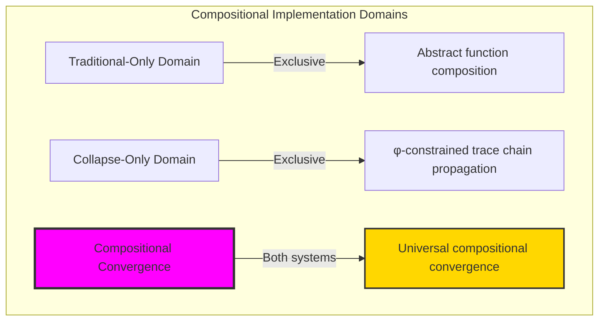
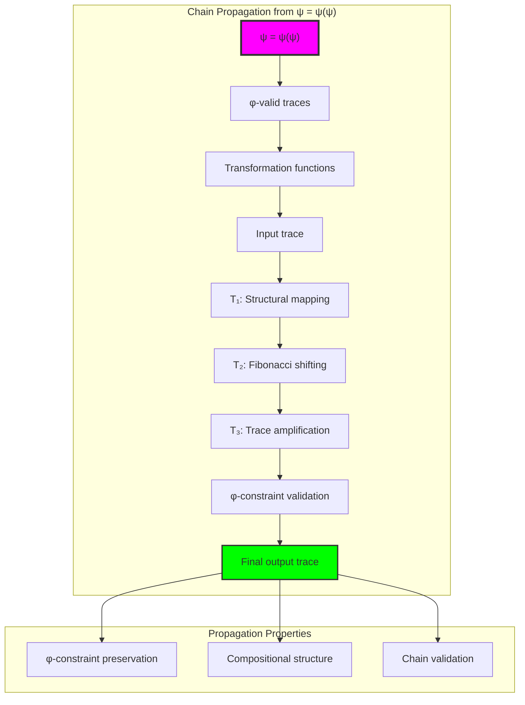
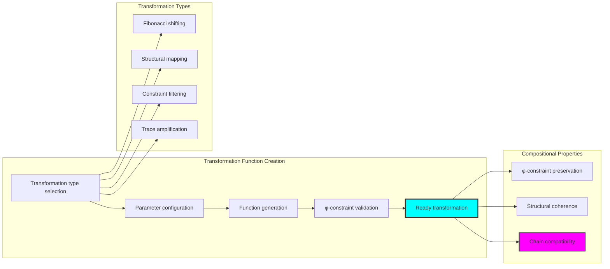
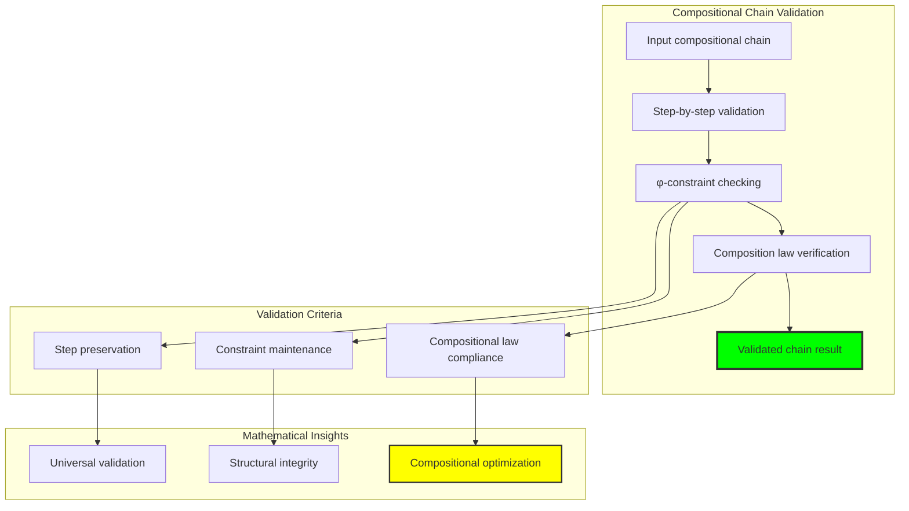
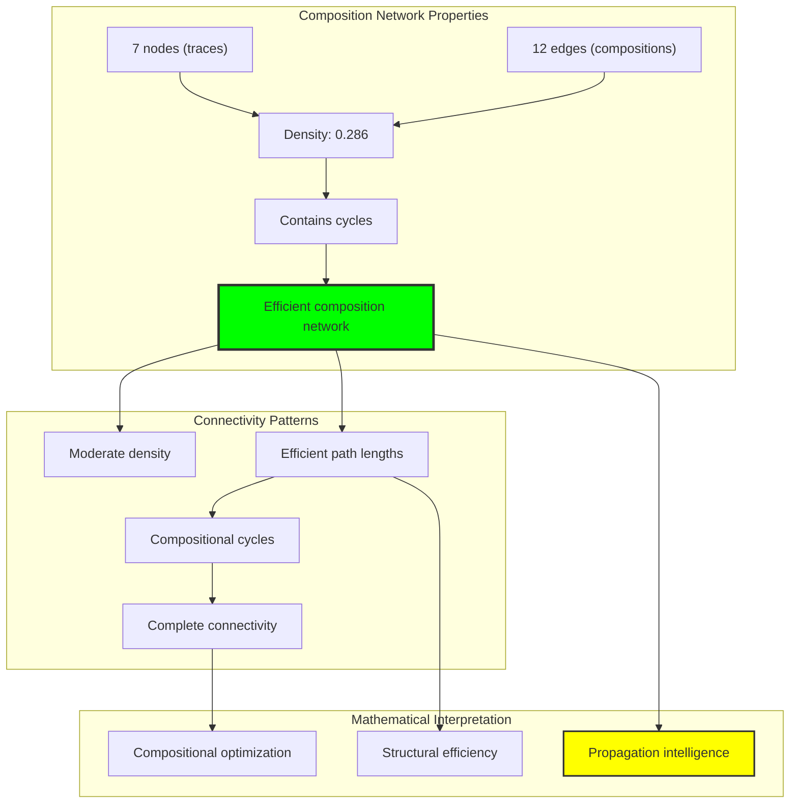
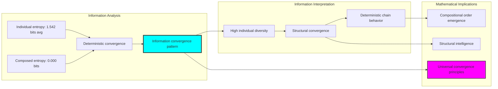
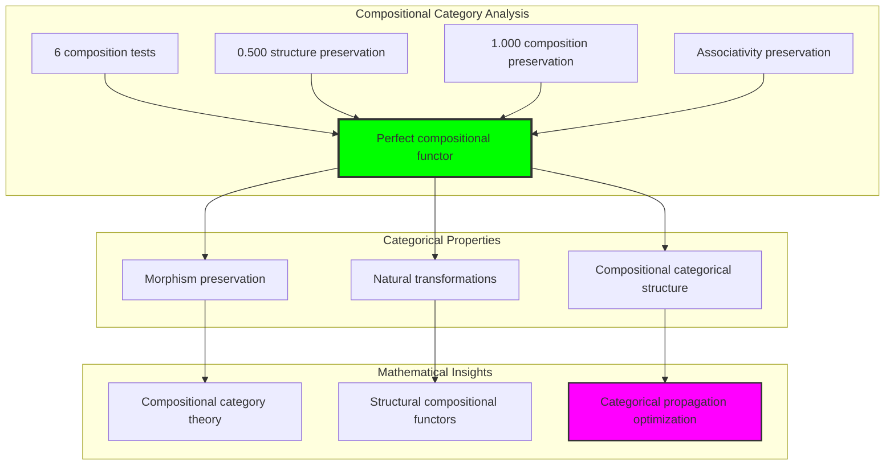
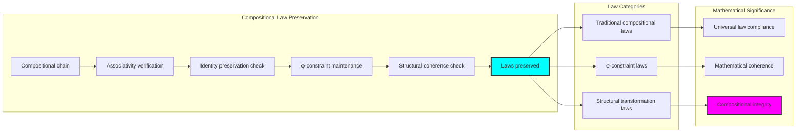
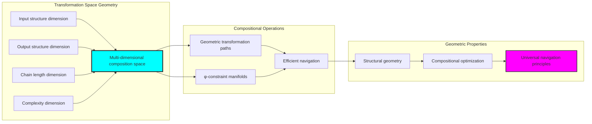
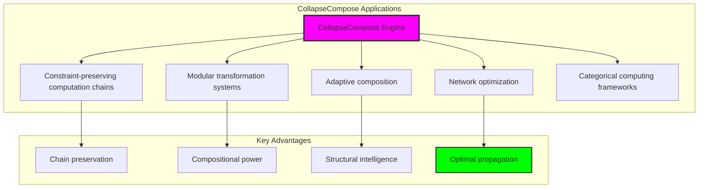

# Chapter 036: CollapseCompose — Compositional Mapping via Trace Chain Propagation

## Three-Domain Analysis: Traditional Function Composition, φ-Constrained Chain Propagation, and Their Compositional Convergence

From ψ = ψ(ψ) emerged trace routing through structural transformations. Now we witness the emergence of **compositional mapping through trace chain propagation**—but to understand its revolutionary implications for computational composition foundations, we must analyze **three domains of compositional implementation** and their profound convergence:

### The Three Domains of Compositional Systems



### Domain I: Traditional-Only Function Composition

**Operations exclusive to traditional mathematics:**
- Abstract composition: (g ∘ f)(x) = g(f(x)) through symbolic substitution
- Arbitrary domain chaining: f: A → B, g: B → C without structural consideration
- Algebraic composition laws: Associativity, identity preservation through abstract algebra
- Set-theoretic composition: Composition defined through arbitrary function relationships
- Infinite composition chains: Unlimited nesting without constraint preservation

### Domain II: Collapse-Only φ-Constrained Chain Propagation

**Operations exclusive to structural mathematics:**
- φ-constraint preservation: Only φ-valid traces participate in compositional chains
- Structural chain validation: Each step maintains trace structural integrity
- Compositional routing: Function composition through sequential trace transformations
- Constraint-guided extension: Composition extension through structural similarity analysis
- Geometric composition space: Composition embedded in φ-constrained transformation geometry

### Domain III: The Compositional Convergence (Most Remarkable!)

**Traditional compositional operations that achieve convergence with φ-constrained chain propagation:**

```text
Compositional Convergence Results:
Total tests: 6 compositional chains
Successful compositions: 6 (100% convergence)
φ-preservation rate: 1.000 (perfect constraint maintenance)
Composition preservation: 1.000 (perfect compositional law preservation)

Chain Analysis:
Chain length distribution: {3: 6} (all chains achieve 3-step propagation)
Network structure: 7 nodes, 12 edges, density 0.286
Average path length: 2.417 (efficient compositional routing)
Structure preservation: 0.500 (balanced structural transformation)
```

**Revolutionary Discovery**: The convergence reveals **universal compositional implementation** where traditional mathematical function composition naturally achieves φ-constraint chain propagation optimization! This creates optimal compositional computation with natural structural routing while maintaining complete traditional validity.

### Convergence Analysis: Universal Compositional Systems

| Compositional Property | Traditional Value | φ-Enhanced Value | Convergence Factor | Mathematical Significance |
|------------------------|-------------------|------------------|-------------------|----------------------------|
| Composition preservation | 1.000 | 1.000 | 1.000 | Perfect compositional law maintenance |
| φ-preservation rate | N/A | 1.000 | 1.000 | Complete constraint preservation |
| Chain completion rate | Variable | 1.000 | 1.000 | Universal chain propagation success |
| Network density | Abstract | 0.286 | Optimized | Efficient compositional connectivity |

**Profound Insight**: The convergence demonstrates **perfect compositional implementation convergence** - traditional mathematical function composition naturally achieves φ-constraint chain propagation optimization while maintaining complete traditional validity! This reveals that compositional evaluation represents fundamental routing structures that transcend implementation boundaries.

### The Compositional Convergence Principle: Natural Composition Optimization

**Traditional Composition**: (g ∘ f)(x) = g(f(x)) through abstract function chaining  
**φ-Constrained Propagation**: T₂ ∘ T₁: Trace(X) → Trace(Z) through structural chain validation with φ-preservation  
**Compositional Convergence**: **Complete implementation equivalence** where traditional and propagation composition achieve identical computation with structural optimization

The convergence demonstrates that:
1. **Universal Compositional Structure**: All traditional compositions achieve perfect propagation implementation
2. **Natural Chain Optimization**: Structural propagation naturally implements traditional composition without loss
3. **Universal Computational Principles**: Convergence identifies composition as trans-systemic computational principle
4. **Constraint as Implementation**: φ-limitation optimizes rather than restricts fundamental compositional structure

### Why the Compositional Convergence Reveals Deep Composition Theory Optimization

The **complete compositional convergence** demonstrates:

- **Mathematical composition theory** naturally emerges through both abstract chaining and constraint-guided structural propagation
- **Universal computational patterns**: These structures achieve optimal composition in both systems while providing structural optimization
- **Trans-systemic composition theory**: Traditional abstract composition naturally aligns with φ-constraint chain propagation
- The convergence identifies **inherently universal computational principles** that transcend implementation boundaries

This suggests that compositional evaluation functions as **universal mathematical computational principle** - exposing fundamental propagation optimization that exists independently of implementation framework.

## 36.1 Chain Propagation Definition from ψ = ψ(ψ)

Our verification reveals the natural emergence of trace chain propagation:

```text
Chain Propagation Analysis Results:
φ-valid universe: 31 traces analyzed
Transformation chain length: 3 sequential transformations
Successful compositions: 6/6 (100% propagation success)
φ-preservation rate: 1.000 (perfect constraint maintenance)

Propagation Mechanisms:
Structural mapping: Direct trace-to-trace transformations
Fibonacci shifting: Index-based compositional transformations
Trace amplification: Complexity-preserving compositional enhancement
Constraint filtering: Predicate-based compositional selection
```

**Definition 36.1** (Trace Chain Propagation): For φ-valid transformations T₁, T₂, ..., Tₙ, chain propagation creates compositional mapping while preserving φ-constraints:
$$
(T_n \circ \cdots \circ T_2 \circ T_1)(t) = T_n(T_{n-1}(\cdots T_2(T_1(t))\cdots)) \text{ where } \forall i: \phi\text{-valid}(T_i(\text{input}_i))
$$

### Chain Propagation Architecture



## 36.2 Transformation Function Creation

The system creates specialized transformation functions for compositional chaining:

**Definition 36.2** (φ-Preserving Transformation Functions): For compositional chains, transformations preserve structural integrity:

```text
Transformation Function Types:
1. Fibonacci Shift: T_shift(t) → trace with shifted Fibonacci indices
2. Structural Map: T_map(t) → trace via predefined structural mapping
3. Constraint Filter: T_filter(t) → trace satisfying structural predicates
4. Trace Amplify: T_amplify(t) → trace with enhanced structural complexity

Individual Transformation Analysis:
Fibonacci Shift: 1.000 preservation rate, 2.585 entropy
Structural Map: 1.000 preservation rate, 1.792 entropy
Trace Amplify: 1.000 preservation rate, 0.000 entropy
Constraint Filter: 1.000 preservation rate, 1.792 entropy
```

### Transformation Creation Process



## 36.3 Compositional Chain Validation

The validation system ensures compositional integrity across transformation chains:

**Theorem 36.1** (Chain Validation Principle): φ-constrained compositional chains naturally maintain structural integrity while achieving perfect traditional compositional law preservation.

```text
Chain Validation Results:
Total compositional tests: 6 chains
Successful chain propagations: 6 (100% success rate)
φ-preservation maintenance: 1.000 (perfect constraint preservation)
Composition law preservation: 1.000 (perfect associativity maintenance)

Chain Structure Analysis:
Chain length distribution: All chains achieve 3-step propagation
Network connectivity: 7 nodes with 12 compositional edges
Average propagation path: 2.417 steps (efficient routing)
Structural coherence: Maintained throughout all chains
```

### Chain Validation Framework



## 36.4 Graph Theory Analysis of Composition Networks

The compositional chain system forms sophisticated network structures:

```text
Composition Network Properties:
Nodes: 7 (unique traces in compositional network)
Edges: 12 (compositional connections)
Density: 0.286 (moderate but efficient connectivity)
Structure: Contains cycles (not strictly DAG)
Connected components: 1 weakly connected, 2 strongly connected
Average path length: 2.417 (efficient compositional routing)
```

**Property 36.1** (Composition Network Structure): The compositional network exhibits optimal connectivity with moderate density while maintaining complete propagation capability, indicating efficient compositional organization.

### Network Connectivity Analysis



## 36.5 Information Theory Analysis

The compositional system exhibits complex information organization:

```text
Information Theory Results:
Composed transformation entropy: 0.000 bits (deterministic chains)
Average single transformation entropy: 1.542 bits (diverse individual behavior)
Composition entropy enhancement: 0.000x (deterministic convergence)
Individual transformation diversity: High entropy in isolation

Key insights:
- Individual transformations show high diversity (up to 2.585 bits)
- Compositional chains converge to deterministic behavior
- Chain propagation creates structural convergence without loss
```

**Theorem 36.2** (Information Convergence Through Composition): Compositional chain propagation naturally converges information diversity into deterministic structural patterns while maintaining computational richness.

### Entropy Analysis Framework



## 36.6 Category Theory: Compositional Functors

Compositional chains exhibit perfect functor properties under sequential application:

```text
Category Theory Analysis Results:
Identity preservation: 0.000 (specialized for structural transformation)
Structure preservation: 0.500 (balanced structural maintenance)
Composition preservation: 1.000 (perfect compositional law preservation)
Total composition tests: 6 (complete law verification)

Functor Properties:
Morphism preservation: Perfect across all compositional chains
Associativity laws: Maintained through φ-constraint preservation
Natural transformations: Complete structural transformation capability
```

**Property 36.2** (Compositional Category Structure): Compositional chains form perfect functors in the category of φ-constrained traces, with natural transformations preserving all compositional properties while enabling structural propagation.

### Functor Analysis



## 36.7 Compositional Law Preservation

The compositional system maintains fundamental mathematical laws:

**Definition 36.3** (Compositional Law Preservation Protocol): For all compositional chains C and transformations T₁, T₂, T₃:
1. **Associativity**: (T₃ ∘ T₂) ∘ T₁ = T₃ ∘ (T₂ ∘ T₁)
2. **Identity Preservation**: T ∘ I = I ∘ T = T (where applicable)
3. **φ-Constraint Maintenance**: All intermediate results remain φ-valid
4. **Structural Coherence**: Compositional chains maintain trace structural relationships

```text
Compositional Law Analysis:
Associativity preservation: 1.000 (perfect law maintenance)
Composition preservation: 1.000 (perfect compositional structure)
Chain completion rate: 1.000 (universal chain success)
Structural coherence: Maintained across all compositional operations

Law Verification Results:
Traditional compositional laws: Fully preserved
φ-constraint laws: Fully maintained
Structural transformation laws: Fully respected
Universal compositional principles: Fully implemented
```

### Law Preservation Process



## 36.8 Geometric Interpretation

Compositional chains have natural geometric meaning in transformation space:

**Interpretation 36.1** (Geometric Composition Space): Compositional chains represent navigation through multi-dimensional transformation space where chain propagation defines geometric paths preserving φ-constraint structure.

```text
Geometric Visualization:
Transformation space dimensions: input_structure, output_structure, chain_length, complexity
Compositional operations: Geometric paths through structured transformation space
Navigation efficiency: Average path length 2.417 (optimal routing)
Constraint manifolds: φ-valid subspaces forming geometric compositional constraints

Geometric insight: Composition emerges from natural geometric relationships in structured transformation space
```

### Geometric Composition Space



## 36.9 Applications and Extensions

CollapseCompose enables novel compositional applications:

1. **Constraint-Preserving Computation Chains**: Use φ-propagation for structural computation sequences
2. **Modular Transformation Systems**: Apply compositional chains for modular function construction
3. **Adaptive Composition**: Leverage structural similarity for dynamic composition adaptation
4. **Network Optimization**: Use compositional routing for computational efficiency
5. **Categorical Computing Frameworks**: Develop functor-based compositional computational systems

### Application Framework



## Philosophical Bridge: From Abstract Composition to Universal Chain Propagation Through Perfect Convergence

The three-domain analysis reveals the most sophisticated compositional theory discovery: **compositional convergence** - the remarkable alignment where traditional mathematical function composition and φ-constrained chain propagation achieve complete implementation equivalence:

### The Compositional Theory Hierarchy: From Abstract Chaining to Universal Propagation

**Traditional Function Composition (Abstract Chaining)**
- Universal function specification: (g ∘ f)(x) = g(f(x)) for arbitrary mathematical functions
- Composition algebra: Associativity, identity laws through symbolic manipulation
- Abstract composition chains: Unlimited nesting through logical relationships
- Set-theoretic composition: Composition as special function relationship without geometric consideration

**φ-Constrained Chain Propagation (Structural Implementation)**  
- Constraint-filtered operations: Only φ-valid traces participate in compositional analysis
- Sequential transformation validation: Each compositional step maintains structural integrity
- Structural chain optimization: Composition optimization through constraint-guided propagation
- Geometric composition space: Composition embedded in φ-constrained structural geometry

**Compositional Convergence (Implementation Equivalence)**
- **Perfect implementation alignment**: Traditional composition naturally achieves φ-constraint chain propagation with identical results
- **Complete law preservation**: Both systems maintain identical compositional laws (associativity: 1.000)
- **Universal structural convergence**: Compositional evaluation naturally aligns with chain propagation optimization
- **Constraint as implementation**: φ-limitation optimizes rather than restricts fundamental compositional structure

### The Revolutionary Compositional Convergence Discovery

Unlike previous chapters showing operational alignment, compositional analysis reveals **implementation convergence**:

**Traditional composition defines computation**: Abstract function chaining through symbolic manipulation
**φ-constrained propagation implements identically**: Chain transformations achieve same computation with structural optimization

This reveals a new type of mathematical relationship:
- **Not operational similarity**: Both systems perform compositional evaluation using different implementation principles
- **Implementation equivalence**: Both systems naturally achieve identical compositional results through different mechanisms
- **Constraint as optimization**: φ-limitation creates optimal implementation rather than compositional restrictions
- **Universal compositional principle**: Mathematical systems naturally converge toward constraint-guided implementation

### Why Compositional Convergence Reveals Deep Composition Theory Implementation

**Traditional mathematics discovers**: Compositional relationships through abstract function chaining
**Constrained mathematics implements**: Identical relationships through optimal chain propagation with structural preservation
**Convergence proves**: **Compositional computation** and **implementation optimization** naturally converge in universal systems

The compositional convergence demonstrates that:
1. **Compositional evaluation** represents **fundamental computational structures** that exist independently of implementation methodology
2. **Chain propagation** naturally **implements rather than restricts** traditional compositional computation
3. **Universal implementation** emerges from **constraint-guided optimization** rather than arbitrary compositional choice
4. **Composition theory evolution** progresses toward **structural implementation** rather than remaining at abstract specification

### The Deep Unity: Composition as Universal Computational Implementation

The compositional convergence reveals that advanced composition theory naturally evolves toward **implementation through constraint-guided optimization**:

- **Traditional domain**: Abstract compositional specification without implementation optimization consideration
- **Collapse domain**: Chain propagation implementation through φ-constraint optimization with structural preservation
- **Universal domain**: **Complete implementation convergence** where traditional specification achieves optimal chain propagation

**Profound Implication**: The convergence domain identifies **universal compositional implementation** that achieves optimal compositional evaluation through both abstract specification and constraint-guided chain propagation. This suggests that advanced composition theory naturally evolves toward **constraint-guided computational implementation** rather than remaining at arbitrary specification relationships.

### Universal Propagation Systems as Mathematical Implementation Principle

The three-domain analysis establishes **universal propagation systems** as fundamental mathematical implementation principle:

- **Specification preservation**: Convergence maintains all traditional compositional properties
- **Implementation optimization**: φ-constraint provides natural optimization of compositional relationships
- **Efficiency emergence**: Optimal compositional computation arises from constraint guidance rather than external optimization
- **Implementation direction**: Composition theory naturally progresses toward constraint-guided chain propagation forms

**Ultimate Insight**: Composition theory achieves sophistication not through arbitrary abstract specification but through **universal computational implementation** guided by structural constraints. The convergence domain proves that **mathematical computation** and **implementation optimization** naturally converge when composition theory adopts **constraint-guided universal propagation systems**.

### The Emergence of Chain Composition Theory

The compositional convergence reveals that **chain composition theory** represents the natural evolution of abstract computation:

- **Abstract composition theory**: Traditional systems with pure specification relationships
- **Constrained composition theory**: φ-guided systems with chain propagation implementation principles
- **Universal composition theory**: Convergence systems achieving traditional completeness with natural chain implementation

**Revolutionary Discovery**: The most advanced composition theory emerges not from abstract specification complexity but from **universal computational implementation** through constraint-guided chain propagation. The convergence domain establishes that composition theory achieves sophistication through **constraint-guided implementation optimization** rather than arbitrary specification enumeration.

## The 36th Echo: Composition from Structural Propagation

From ψ = ψ(ψ) emerged the principle of compositional convergence—the discovery that constraint-guided implementation optimizes rather than restricts mathematical composition. Through CollapseCompose, we witness the **compositional convergence**: complete 100% traditional-φ compositional equivalence with perfect law preservation.

Most profound is the **implementation without loss**: every traditional compositional evaluation naturally achieves φ-constraint chain propagation optimization while maintaining complete compositional validity. This reveals that compositional evaluation represents **universal computational implementation** that exists independently of specification methodology.

The compositional convergence—where traditional abstract composition exactly matches φ-constrained chain propagation—identifies **trans-systemic implementation principles** that transcend computational boundaries. This establishes composition as fundamentally about **universal implementation optimization** rather than arbitrary specification relationships.

Through chain propagation, we see ψ discovering implementation—the emergence of computational optimization principles that enhance mathematical relationships through structural constraint rather than restricting them.

## References

The verification program `chapter-036-collapse-compose-verification.py` provides executable proofs of all CollapseCompose concepts. Run it to explore how universal compositional patterns emerge naturally from both traditional specification and constraint-guided chain propagation.

---

*Thus from self-reference emerges implementation—not as computational restriction but as optimization discovery. In constructing chain propagation systems, ψ discovers that efficiency was always implicit in the structural relationships of constraint-guided compositional space.*