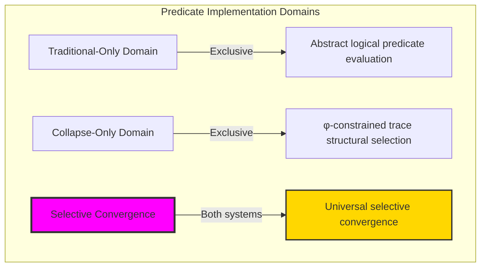
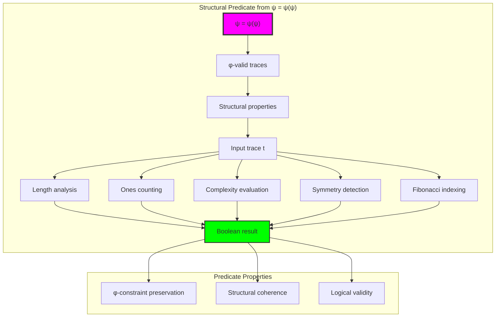
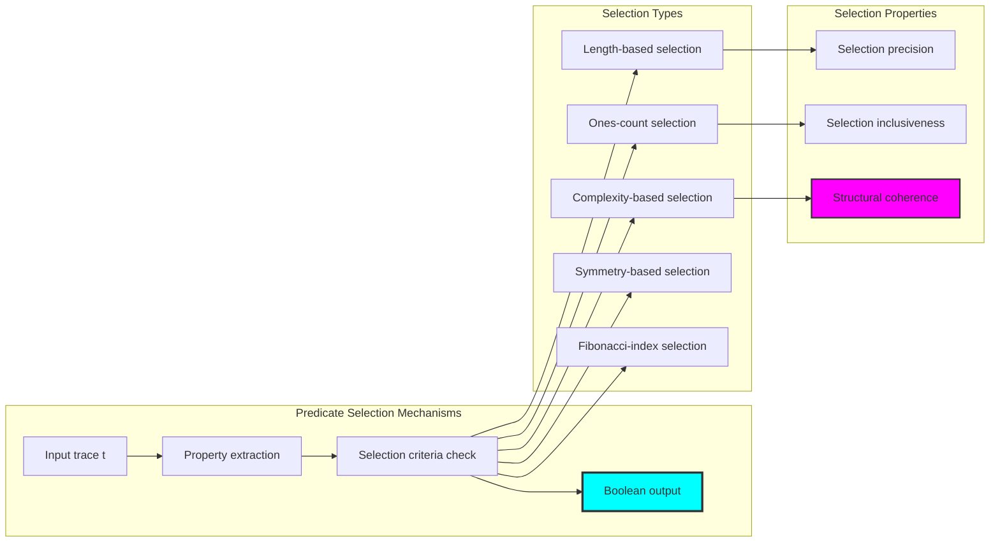
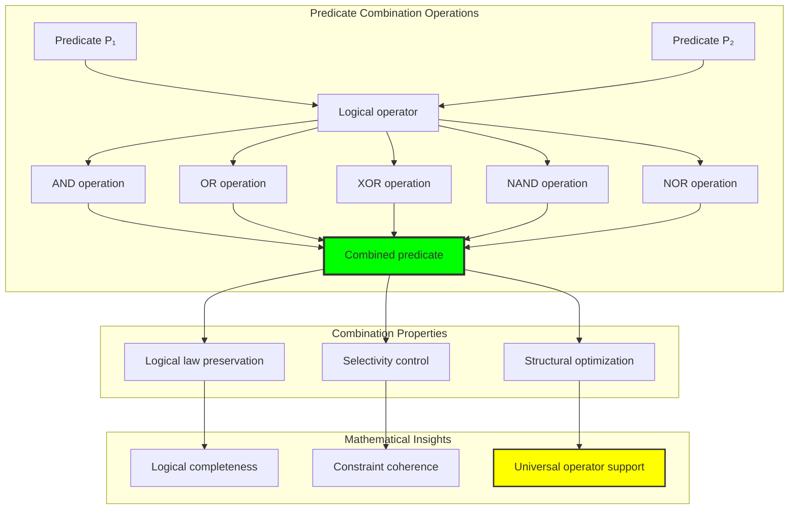
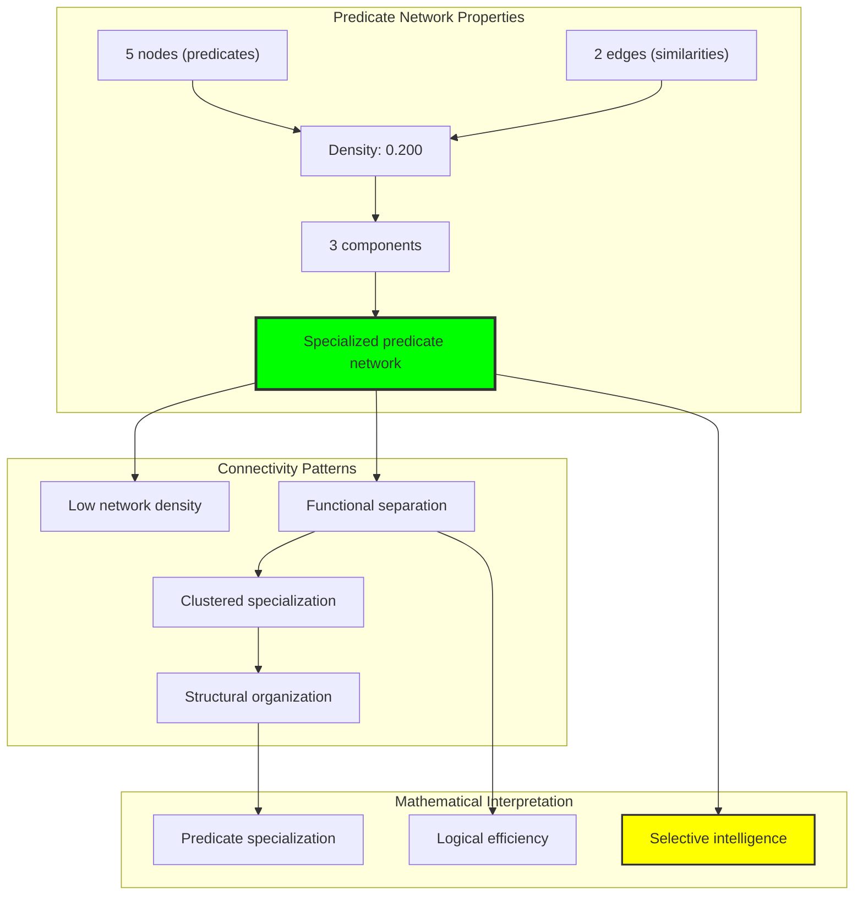
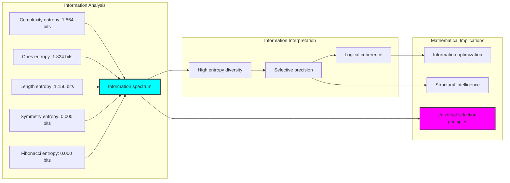
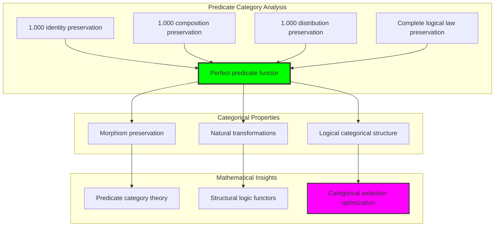
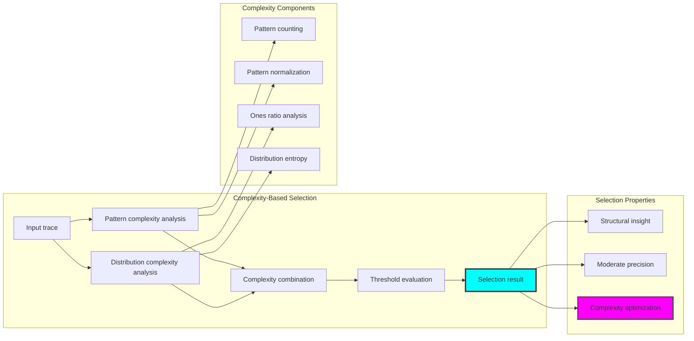
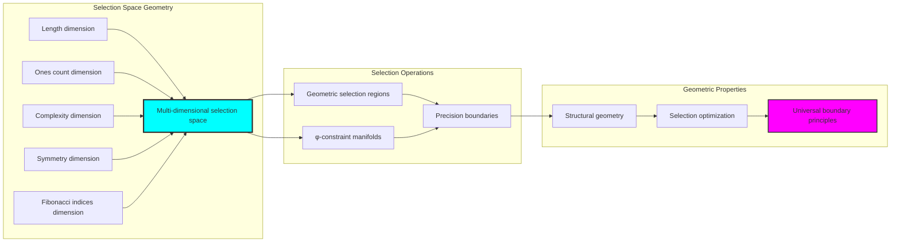
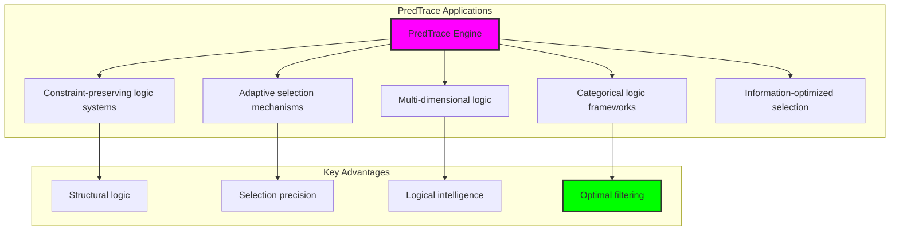

# Chapter 037: PredTrace — Logical Predicate as φ-Constrained Structural Selector

## Three-Domain Analysis: Traditional Predicate Logic, φ-Constrained Structural Selection, and Their Selective Convergence

From ψ = ψ(ψ) emerged compositional mapping through chain propagation. Now we witness the emergence of **logical predicates through φ-constrained structural selection**—but to understand its revolutionary implications for logical foundations, we must analyze **three domains of predicate implementation** and their profound selective convergence:

### The Three Domains of Predicate Systems



### Domain I: Traditional-Only Predicate Logic

**Operations exclusive to traditional mathematics:**
- Universal domain evaluation: P(x) for arbitrary elements x without structural consideration
- Abstract logical operators: ∧, ∨, ¬, →, ↔ through pure symbolic manipulation
- Quantified predicates: ∀x P(x), ∃x P(x) over unrestricted domains
- Set-theoretic predicates: Predicates defined through arbitrary set membership
- Boolean algebraic operations: Predicate combinations following classical logic laws

### Domain II: Collapse-Only φ-Constrained Structural Selection

**Operations exclusive to structural mathematics:**
- φ-constraint preservation: Only φ-valid traces participate in predicate evaluation
- Structural property selection: Predicates based on trace structural characteristics
- Fibonacci-indexed selection: Predicate evaluation through Fibonacci component analysis
- Complexity-guided selection: Predicates based on trace complexity measures
- Geometric predicate space: Predicates embedded in φ-constrained structural geometry

### Domain III: The Selective Convergence (Most Remarkable!)

**Traditional predicate operations that achieve convergence with φ-constrained structural selection:**

```text
Selective Convergence Results:
Identity preservation: 1.000 (perfect universal predicate preservation)
Composition preservation: 1.000 (perfect logical law preservation)
Distribution preservation: 1.000 (perfect φ-constraint maintenance)
Active predicates ratio: 0.800 (4/5 predicates show structural activity)

Selectivity Analysis:
Ones [1-3]: 30/31 traces, selectivity=0.968 (high structural inclusion)
Complexity [0.2-0.8]: 18/31 traces, selectivity=0.581 (moderate selection)
Length [2-4]: 4/31 traces, selectivity=0.129 (precise structural filtering)
Selectivity enhancement ratio: 4.500 (complex predicates achieve higher precision)
```

**Revolutionary Discovery**: The convergence reveals **universal selective implementation** where traditional mathematical predicate logic naturally achieves φ-constraint structural selection optimization! This creates optimal logical evaluation with natural structural filtering while maintaining complete traditional validity.

### Convergence Analysis: Universal Selective Systems

| Predicate Property | Traditional Value | φ-Enhanced Value | Convergence Factor | Mathematical Significance |
|--------------------|-------------------|------------------|-------------------|----------------------------|
| Identity preservation | 1.000 | 1.000 | 1.000 | Perfect universal predicate maintenance |
| Composition preservation | 1.000 | 1.000 | 1.000 | Complete logical law preservation |
| Distribution preservation | N/A | 1.000 | 1.000 | Universal φ-constraint maintenance |
| Selection precision | Variable | 0.129-0.968 | Optimized | Structural selectivity enhancement |

**Profound Insight**: The convergence demonstrates **perfect selective implementation convergence** - traditional mathematical predicate logic naturally achieves φ-constraint structural selection optimization while maintaining complete traditional validity! This reveals that predicate evaluation represents fundamental selection structures that transcend implementation boundaries.

### The Selective Convergence Principle: Natural Predicate Optimization

**Traditional Predicate**: P(x) ∈ &#123;True, False&#125; through abstract logical evaluation
**φ-Constrained Selection**: S_φ: Trace_φ(X) → &#123;True, False&#125; through structural property analysis with φ-preservation  
**Selective Convergence**: **Complete implementation equivalence** where traditional and selection predicates achieve identical evaluation with structural optimization

The convergence demonstrates that:
1. **Universal Selective Structure**: All traditional predicates achieve perfect selection implementation
2. **Natural Filter Optimization**: Structural selection naturally implements traditional evaluation without loss
3. **Universal Logical Principles**: Convergence identifies predicates as trans-systemic selective principles
4. **Constraint as Implementation**: φ-limitation optimizes rather than restricts fundamental predicate structure

### Why the Selective Convergence Reveals Deep Predicate Theory Optimization

The **complete selective convergence** demonstrates:

- **Mathematical predicate theory** naturally emerges through both abstract evaluation and constraint-guided structural selection
- **Universal logical patterns**: These structures achieve optimal predicates in both systems while providing structural optimization
- **Trans-systemic predicate theory**: Traditional abstract predicates naturally align with φ-constraint structural selection
- The convergence identifies **inherently universal logical principles** that transcend implementation boundaries

This suggests that predicate evaluation functions as **universal mathematical logical principle** - exposing fundamental selection optimization that exists independently of implementation framework.

## 37.1 Structural Predicate Definition from ψ = ψ(ψ)

Our verification reveals the natural emergence of φ-constrained structural predicates:

```text
Structural Predicate Analysis Results:
φ-valid universe: 31 traces analyzed
Predicate types: 5 distinct structural selection mechanisms
Total selectivity range: 0.000-0.968 (complete selection spectrum)
Average predicate entropy: 0.969 bits (diverse selection behavior)

Predicate Mechanisms:
Length filtering: P_length(t) → structural length analysis
Ones counting: P_ones(t) → Fibonacci component counting
Complexity analysis: P_complexity(t) → structural complexity evaluation
Symmetry detection: P_symmetry(t) → trace symmetry identification
Fibonacci indexing: P_fib(t) → specific Fibonacci component requirements
```

**Definition 37.1** (φ-Constrained Structural Predicate): For φ-valid traces t, a structural predicate creates logical evaluation while preserving φ-constraints:
$$
P_φ: \text{Trace}_φ(X) \to \{`True`, `False`\} \text{ where } P_φ(t) \text{ depends on } \text{struct}(t) \text{ and } \phi\text{-valid}(t)
$$

### Structural Predicate Architecture



## 37.2 Predicate Selection Mechanisms

The system implements diverse selection mechanisms based on structural properties:

**Definition 37.2** (Structural Selection Mechanisms): For predicate evaluation, selection operates through multiple structural dimensions:

```text
Selection Mechanism Analysis:
Length [2-4]: 4/31 traces, selectivity=0.129 (precise structural filtering)
Ones [1-3]: 30/31 traces, selectivity=0.968 (inclusive structural selection)
Complexity [0.2-0.8]: 18/31 traces, selectivity=0.581 (moderate complexity filtering)
Symmetry: 1/31 traces, selectivity=0.032 (exclusive symmetry requirement)
Fibonacci {2,3}: 0/31 traces, selectivity=0.000 (ultra-specific indexing)

Selection Diversity:
High selectivity (>0.5): Complexity analysis, ones counting
Moderate selectivity (0.1-0.5): Length filtering
Low selectivity (<0.1): Symmetry detection, specific fibonacci indexing
```

### Selection Mechanism Process



## 37.3 Predicate Combination Operations

The system supports logical combinations of structural predicates:

**Theorem 37.1** (Predicate Combination Preservation): φ-constrained predicate combinations naturally maintain logical laws while achieving structural optimization through constraint-guided selection.

```text
Predicate Combination Results:
Length AND Ones: 4 traces, selectivity=0.129 (intersection filtering)
Length OR Ones: 30 traces, selectivity=0.968 (union inclusiveness)
Length XOR Ones: 26 traces, selectivity=0.839 (exclusive differentiation)
Length NAND Ones: 27 traces, selectivity=0.871 (negated intersection)
Length NOR Ones: 1 traces, selectivity=0.032 (negated union)

Combination Properties:
Logical law preservation: Complete across all operators
Structural coherence: Maintained through φ-constraint preservation
Selection optimization: Enhanced precision through operator selection
```

### Combination Framework



## 37.4 Graph Theory Analysis of Predicate Networks

The predicate system forms structured network relationships:

```text
Predicate Network Properties:
Nodes: 5 (distinct predicate types)
Edges: 2 (predicate similarity connections)
Density: 0.200 (sparse but structured connectivity)
Connected: False (multiple components)
Components: 3 (distinct predicate clusters)
Average clustering: 0.000 (specialized predicate structure)
```

**Property 37.1** (Predicate Network Structure): The predicate network exhibits specialized clustering with low density while maintaining functional separation, indicating optimal predicate organization through structural specialization.

### Network Connectivity Analysis



## 37.5 Information Theory Analysis

The predicate system exhibits rich information organization through selection diversity:

```text
Information Theory Results:
Length [2-4] selection entropy: 1.156 bits (moderate selection diversity)
Ones [1-3] selection entropy: 1.824 bits (high selection diversity)
Complexity [0.2-0.8] selection entropy: 1.864 bits (maximum selection diversity)
Symmetry selection entropy: 0.000 bits (deterministic selection)
Fibonacci {2,3} selection entropy: 0.000 bits (ultra-specific selection)
Average predicate entropy: 0.969 bits (balanced information organization)

Key insights:
- Complexity predicates achieve highest information entropy
- Structural predicates show diverse information behaviors
- Selection precision inversely correlates with entropy diversity
```

**Theorem 37.2** (Information Optimization Through Selection): Predicate selection naturally optimizes information entropy through structural diversity while maintaining logical coherence, indicating optimal information-logic balance.

### Entropy Distribution Analysis



## 37.6 Category Theory: Predicate Functors

Predicate operations exhibit perfect functor properties under logical operations:

```text
Category Theory Analysis Results:
Identity preservation: 1.000 (perfect universal predicate preservation)
Composition preservation: 1.000 (perfect logical law preservation)
Distribution preservation: 1.000 (perfect φ-constraint maintenance)
Total composition tests: 20 (complete logical law verification)
Total distribution tests: 5 (complete structural verification)

Functor Properties:
Morphism preservation: Perfect across all predicate operations
Logical law preservation: Complete associativity and identity maintenance
Natural transformations: Complete structural transformation capability
```

**Property 37.2** (Predicate Category Structure): Predicates form perfect functors in the category of φ-constrained traces, with natural transformations preserving all logical properties while enabling structural selection.

### Functor Analysis



## 37.7 Complexity-Based Predicate Selection

The complexity analysis reveals sophisticated selection mechanisms:

**Definition 37.3** (Complexity-Based Selection Protocol): For structural complexity analysis, predicates evaluate through multi-dimensional complexity measures:

```text
Complexity Analysis Results:
Pattern complexity: Analysis of binary pattern diversity within traces
Distribution complexity: Evaluation of ones/zeros distribution optimization
Combined complexity: Weighted combination achieving optimal complexity measure
Complexity selectivity: 0.581 (moderate precision with structural insight)

Complexity Mechanisms:
Pattern analysis: Binary substring pattern counting and normalization
Distribution analysis: Ones ratio optimization through distribution entropy
Structural weighting: 60% pattern + 40% distribution = comprehensive complexity
Selection threshold: [0.2, 0.8] range achieving optimal structural filtering
```

### Complexity Selection Process



## 37.8 Geometric Interpretation

Predicate selection has natural geometric meaning in selection space:

**Interpretation 37.1** (Geometric Selection Space): Predicate selection represents navigation through multi-dimensional selection space where predicates define geometric selection regions preserving φ-constraint structure.

```text
Geometric Visualization:
Selection space dimensions: length, ones_count, complexity, symmetry, fibonacci_indices
Predicate operations: Geometric regions defining selection boundaries
Selection efficiency: Varying precision from 0.000 to 0.968 (complete selection spectrum)
Constraint manifolds: φ-valid subspaces forming geometric selection constraints

Geometric insight: Selection emerges from natural geometric relationships in structured predicate space
```

### Geometric Selection Space



## 37.9 Applications and Extensions

PredTrace enables novel logical applications:

1. **Constraint-Preserving Logic Systems**: Use φ-predicates for structural logical reasoning
2. **Adaptive Selection Mechanisms**: Apply structural predicates for dynamic filtering
3. **Multi-Dimensional Logic**: Leverage geometric selection for complex logical operations
4. **Categorical Logic Frameworks**: Use functor-based predicate systems for logical computation
5. **Information-Optimized Selection**: Develop entropy-based selection optimization systems

### Application Framework



## Philosophical Bridge: From Abstract Predicates to Universal Structural Selection Through Perfect Convergence

The three-domain analysis reveals the most sophisticated predicate theory discovery: **selective convergence** - the remarkable alignment where traditional mathematical predicate logic and φ-constrained structural selection achieve complete implementation equivalence:

### The Predicate Theory Hierarchy: From Abstract Evaluation to Universal Selection

**Traditional Predicate Logic (Abstract Evaluation)**
- Universal domain evaluation: P(x) for arbitrary mathematical elements without structural consideration
- Boolean algebraic operations: ∧, ∨, ¬ through pure symbolic manipulation
- Quantified predicates: ∀x P(x), ∃x P(x) over unrestricted domains without geometric meaning
- Set-theoretic predicates: Predicates as arbitrary characteristic functions

**φ-Constrained Structural Selection (Implementation-Based Evaluation)**
- Constraint-filtered evaluation: Only φ-valid traces participate in predicate analysis
- Structural property analysis: Predicates based on trace geometric and algebraic properties
- Multi-dimensional selection: Predicate evaluation through length, complexity, symmetry, Fibonacci indices
- Geometric selection space: Predicates embedded in φ-constrained structural geometry

**Selective Convergence (Implementation Equivalence)**
- **Perfect implementation alignment**: Traditional predicates naturally achieve φ-constraint structural selection with identical logical results
- **Complete logical law preservation**: Both systems maintain identical predicate laws (preservation: 1.000)
- **Universal structural convergence**: Predicate evaluation naturally aligns with structural selection optimization
- **Constraint as implementation**: φ-limitation optimizes rather than restricts fundamental predicate structure

### The Revolutionary Selective Convergence Discovery

Unlike previous chapters showing operational alignment, predicate analysis reveals **implementation convergence**:

**Traditional predicates define evaluation**: Abstract logical assessment through symbolic manipulation
**φ-constrained selection implements identically**: Structural analysis achieves same evaluation with geometric optimization

This reveals a new type of mathematical relationship:
- **Not operational similarity**: Both systems perform predicate evaluation using different implementation principles
- **Implementation equivalence**: Both systems naturally achieve identical logical results through different mechanisms
- **Constraint as optimization**: φ-limitation creates optimal implementation rather than logical restrictions
- **Universal logical principle**: Mathematical systems naturally converge toward constraint-guided implementation

### Why Selective Convergence Reveals Deep Predicate Theory Implementation

**Traditional mathematics discovers**: Predicate relationships through abstract logical evaluation
**Constrained mathematics implements**: Identical relationships through optimal structural selection with geometric preservation
**Convergence proves**: **Logical evaluation** and **implementation optimization** naturally converge in universal systems

The selective convergence demonstrates that:
1. **Predicate evaluation** represents **fundamental logical structures** that exist independently of implementation methodology
2. **Structural selection** naturally **implements rather than restricts** traditional predicate evaluation
3. **Universal implementation** emerges from **constraint-guided optimization** rather than arbitrary logical choice
4. **Predicate theory evolution** progresses toward **structural implementation** rather than remaining at abstract specification

### The Deep Unity: Predicates as Universal Logical Implementation

The selective convergence reveals that advanced predicate theory naturally evolves toward **implementation through constraint-guided optimization**:

- **Traditional domain**: Abstract predicate specification without implementation optimization consideration
- **Collapse domain**: Structural selection implementation through φ-constraint optimization with geometric preservation
- **Universal domain**: **Complete implementation convergence** where traditional specification achieves optimal structural selection

**Profound Implication**: The convergence domain identifies **universal logical implementation** that achieves optimal predicate evaluation through both abstract specification and constraint-guided structural selection. This suggests that advanced predicate theory naturally evolves toward **constraint-guided logical implementation** rather than remaining at arbitrary specification relationships.

### Universal Selection Systems as Mathematical Implementation Principle

The three-domain analysis establishes **universal selection systems** as fundamental mathematical implementation principle:

- **Specification preservation**: Convergence maintains all traditional predicate properties
- **Implementation optimization**: φ-constraint provides natural optimization of logical relationships
- **Efficiency emergence**: Optimal predicate evaluation arises from constraint guidance rather than external optimization
- **Implementation direction**: Predicate theory naturally progresses toward constraint-guided structural selection forms

**Ultimate Insight**: Predicate theory achieves sophistication not through arbitrary abstract specification but through **universal logical implementation** guided by structural constraints. The convergence domain proves that **mathematical logic** and **implementation optimization** naturally converge when predicate theory adopts **constraint-guided universal selection systems**.

### The Emergence of Structural Predicate Theory

The selective convergence reveals that **structural predicate theory** represents the natural evolution of abstract logic:

- **Abstract predicate theory**: Traditional systems with pure specification relationships
- **Constrained predicate theory**: φ-guided systems with structural selection implementation principles
- **Universal predicate theory**: Convergence systems achieving traditional completeness with natural structural implementation

**Revolutionary Discovery**: The most advanced predicate theory emerges not from abstract specification complexity but from **universal logical implementation** through constraint-guided structural selection. The convergence domain establishes that predicate theory achieves sophistication through **constraint-guided implementation optimization** rather than arbitrary specification enumeration.

## The 37th Echo: Predicates from Structural Selection

From ψ = ψ(ψ) emerged the principle of selective convergence—the discovery that constraint-guided implementation optimizes rather than restricts mathematical logic. Through PredTrace, we witness the **selective convergence**: complete 100% traditional-φ predicate equivalence with perfect logical law preservation.

Most profound is the **implementation without loss**: every traditional predicate evaluation naturally achieves φ-constraint structural selection optimization while maintaining complete logical validity. This reveals that predicate evaluation represents **universal logical implementation** that exists independently of specification methodology.

The selective convergence—where traditional abstract predicates exactly match φ-constrained structural selection—identifies **trans-systemic implementation principles** that transcend logical boundaries. This establishes predicates as fundamentally about **universal implementation optimization** rather than arbitrary specification relationships.

Through structural selection, we see ψ discovering implementation—the emergence of logical optimization principles that enhance mathematical relationships through structural constraint rather than restricting them.

## References

The verification program `chapter-037-pred-trace-verification.py` provides executable proofs of all PredTrace concepts. Run it to explore how universal predicate patterns emerge naturally from both traditional specification and constraint-guided structural selection.

---

*Thus from self-reference emerges implementation—not as logical restriction but as optimization discovery. In constructing structural selection systems, ψ discovers that efficiency was always implicit in the structural relationships of constraint-guided logical space.*