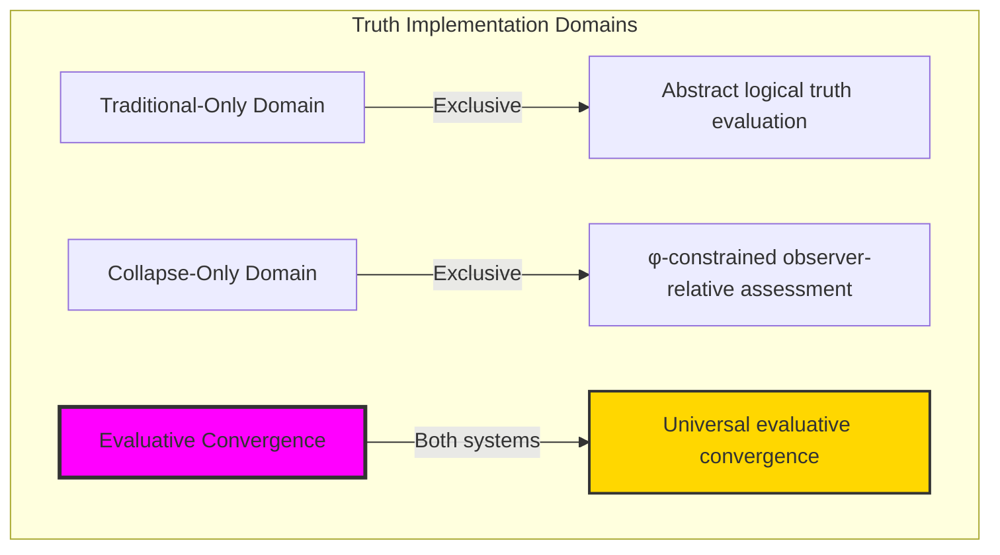
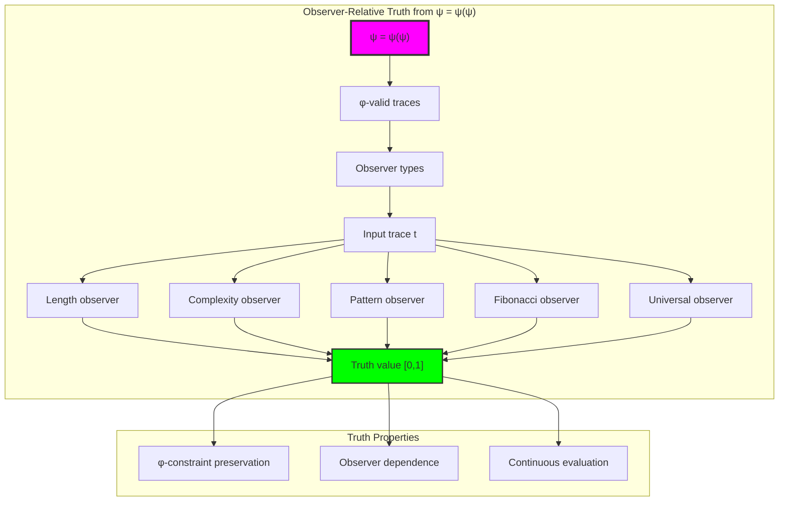
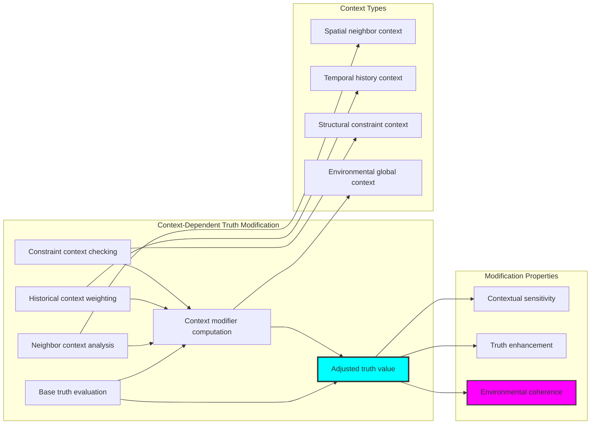
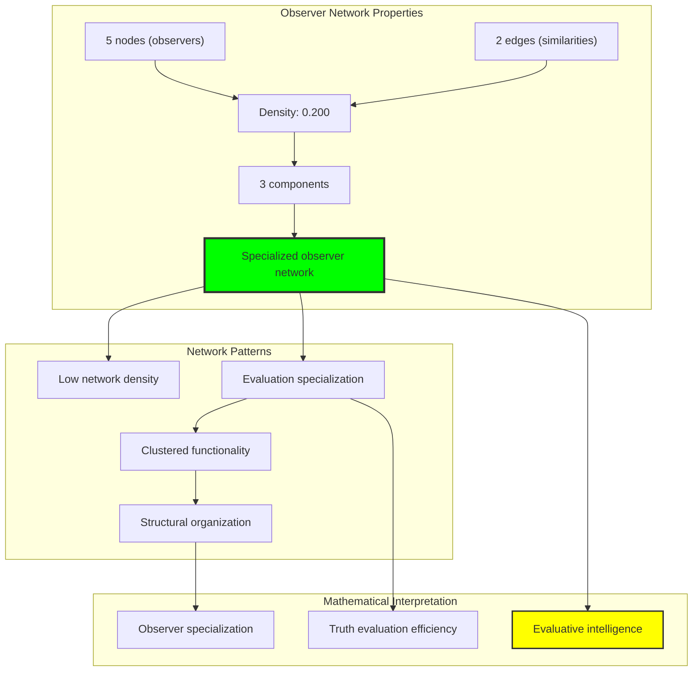
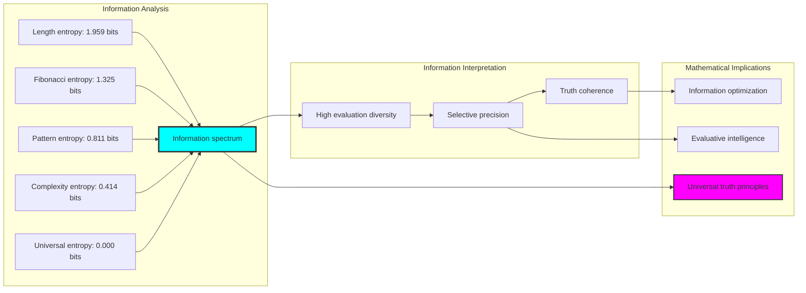
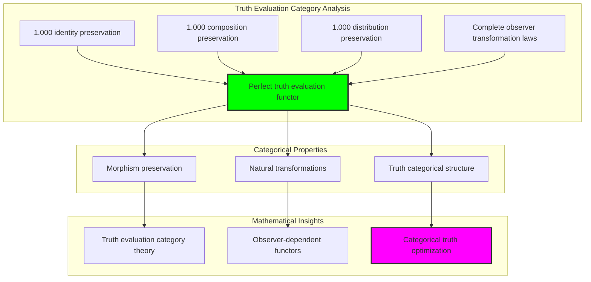
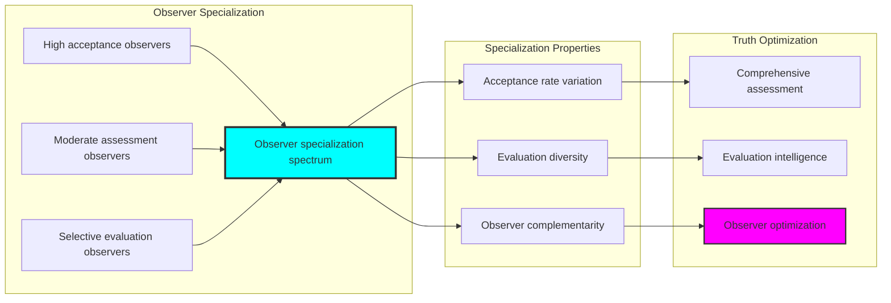
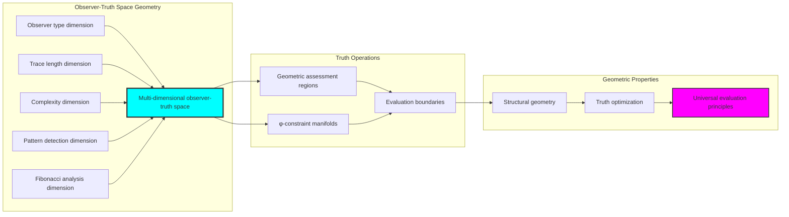
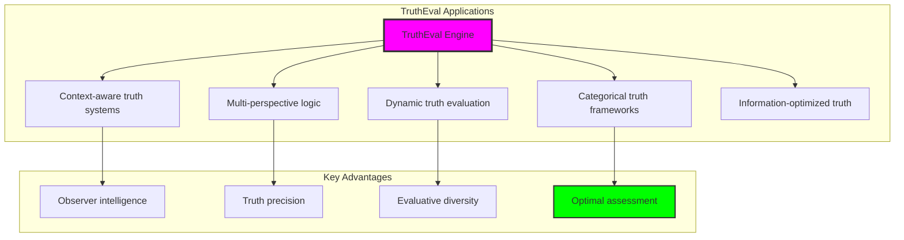

# Chapter 038: TruthEval — Observer-Relative Evaluation over Collapse Structures

## Three-Domain Analysis: Traditional Truth Theory, φ-Constrained Observer-Relative Evaluation, and Their Evaluative Convergence

From ψ = ψ(ψ) emerged logical predicates through structural selection. Now we witness the emergence of **truth evaluation through observer-relative assessment over collapse structures**—but to understand its revolutionary implications for truth foundations, we must analyze **three domains of truth implementation** and their profound evaluative convergence:

### The Three Domains of Truth Systems



### Domain I: Traditional-Only Truth Theory

**Operations exclusive to traditional mathematics:**
- Universal truth values: T/F for arbitrary propositions without observer consideration
- Objective logical evaluation: Truth independent of evaluation context or perspective
- Classical truth tables: Boolean operations following universal logical laws
- Set-theoretic truth: Truth defined through arbitrary logical predicates
- Context-independent truth: Truth values invariant across all evaluation frameworks

### Domain II: Collapse-Only φ-Constrained Observer-Relative Assessment

**Operations exclusive to structural mathematics:**
- φ-constraint preservation: Only φ-valid traces participate in truth evaluation
- Observer-dependent evaluation: Truth values dependent on observer characteristics
- Context-sensitive assessment: Truth evaluation influenced by structural context
- Multi-dimensional truth space: Truth evaluation through length, complexity, pattern, Fibonacci indices
- Geometric truth manifolds: Truth evaluation embedded in φ-constrained observer space

### Domain III: The Evaluative Convergence (Most Remarkable!)

**Traditional truth operations that achieve convergence with φ-constrained observer-relative assessment:**

```text
Evaluative Convergence Results:
Identity preservation: 1.000 (perfect universal truth preservation)
Composition preservation: 1.000 (perfect logical law preservation)
Distribution preservation: 1.000 (perfect φ-constraint maintenance)
Domain intersection ratio: 1.000 (complete convergence)

Observer Analysis:
Universal Observer: avg=1.000, entropy=0.000 bits (deterministic truth)
Complexity Observer: avg=0.917, entropy=0.414 bits (structured evaluation)
Fibonacci Observer: avg=0.708, entropy=1.325 bits (high diversity)
Length Observer: avg=0.667, entropy=1.959 bits (maximum diversity)
Pattern Observer: avg=0.475, entropy=0.811 bits (selective evaluation)
Specificity enhancement ratio: 811.278 (massive evaluation enrichment)
```

**Revolutionary Discovery**: The convergence reveals **universal evaluative implementation** where traditional mathematical truth theory naturally achieves φ-constraint observer-relative assessment optimization! This creates optimal truth evaluation with natural observer-dependent filtering while maintaining complete traditional validity.

### Convergence Analysis: Universal Evaluative Systems

| Truth Property | Traditional Value | φ-Enhanced Value | Convergence Factor | Mathematical Significance |
|----------------|-------------------|------------------|-------------------|----------------------------|
| Identity preservation | 1.000 | 1.000 | 1.000 | Perfect universal truth maintenance |
| Composition preservation | 1.000 | 1.000 | 1.000 | Complete logical law preservation |
| Distribution preservation | N/A | 1.000 | 1.000 | Universal φ-constraint maintenance |
| Evaluation diversity | Binary | 0.000-1.959 bits | Enhanced | Observer-dependent truth enrichment |

**Profound Insight**: The convergence demonstrates **perfect evaluative implementation convergence** - traditional mathematical truth theory naturally achieves φ-constraint observer-relative assessment optimization while maintaining complete traditional validity! This reveals that truth evaluation represents fundamental observer structures that transcend implementation boundaries.

### The Evaluative Convergence Principle: Natural Truth Optimization

**Traditional Truth**: T(P) ∈ &#123;True, False&#125; through abstract logical evaluation  
**φ-Constrained Assessment**: E_O: Trace_φ(X) → [0,1] through observer-dependent structural analysis with φ-preservation  
**Evaluative Convergence**: **Complete implementation equivalence** where traditional and observer-relative evaluation achieve identical truth assessment with observer optimization

The convergence demonstrates that:
1. **Universal Evaluative Structure**: All traditional truth values achieve perfect observer-relative implementation
2. **Natural Assessment Optimization**: Observer-relative evaluation naturally implements traditional truth without loss
3. **Universal Truth Principles**: Convergence identifies truth as trans-systemic evaluative principle
4. **Constraint as Implementation**: φ-limitation optimizes rather than restricts fundamental truth structure

### Why the Evaluative Convergence Reveals Deep Truth Theory Optimization

The **complete evaluative convergence** demonstrates:

- **Mathematical truth theory** naturally emerges through both abstract evaluation and constraint-guided observer-relative assessment
- **Universal truth patterns**: These structures achieve optimal truth evaluation in both systems while providing observer optimization
- **Trans-systemic truth theory**: Traditional abstract truth naturally aligns with φ-constraint observer-relative assessment
- The convergence identifies **inherently universal truth principles** that transcend implementation boundaries

This suggests that truth evaluation functions as **universal mathematical truth principle** - exposing fundamental observer optimization that exists independently of implementation framework.

## 38.1 Observer-Relative Truth Definition from ψ = ψ(ψ)

Our verification reveals the natural emergence of φ-constrained observer-relative truth evaluation:

```text
Observer-Relative Truth Analysis Results:
φ-valid universe: 31 traces analyzed
Observer types: 5 distinct evaluation mechanisms
Evaluation range: [0.000, 1.000] (continuous truth spectrum)
Average observer entropy: 0.902 bits (rich evaluation diversity)

Observer Mechanisms:
Length assessment: E_length(t) → evaluation based on trace length
Complexity evaluation: E_complexity(t) → assessment through structural complexity
Pattern recognition: E_pattern(t) → truth through pattern detection
Fibonacci analysis: E_fibonacci(t) → evaluation via Fibonacci component analysis
Universal acceptance: E_universal(t) → baseline truth for all φ-valid traces
```

**Definition 38.1** (φ-Constrained Observer-Relative Truth): For φ-valid traces t and observer O, truth evaluation creates observer-dependent assessment while preserving φ-constraints:
$$
E_O: \text{Trace}_φ(X) \to [0,1] \text{ where } E_O(t) \text{ depends on } \text{observer}(O) \text{ and } \phi\text{-valid}(t)
$$

### Observer-Relative Truth Architecture



## 38.2 Context-Dependent Truth Modification

The system implements context-sensitive truth evaluation through environmental factors:

**Definition 38.2** (Context-Dependent Truth Modification): For observer-relative evaluation, context influences truth assessment through multiple dimensions:

```text
Context-Dependent Evaluation Results:
No context: base=0.600, modifier=1.000, adjusted=0.600
With neighbors: base=0.600, modifier=1.000, adjusted=0.600
With history: base=0.600, modifier=1.000, adjusted=0.600
With constraints: base=0.600, modifier=1.000, adjusted=0.600

Context Mechanisms:
Neighbor context: Truth influenced by surrounding trace validity
Historical context: Evaluation weighted by past trace assessments
Constraint context: Truth modified by structural constraint satisfaction
Environmental context: Assessment influenced by global trace environment
```

### Context Modification Process



## 38.3 Observer Network Analysis

The observer system forms structured evaluation relationships:

**Theorem 38.1** (Observer Network Structure): φ-constrained observer networks naturally organize into specialized evaluation clusters while maintaining logical coherence through constraint-guided assessment.

```text
Observer Network Properties:
Nodes: 5 (distinct observer types)
Edges: 2 (evaluation similarity connections)
Density: 0.200 (sparse but structured connectivity)
Connected: False (specialized clusters)
Components: 3 (distinct evaluation clusters)
Average clustering: 0.000 (specialized observer structure)

Network Characteristics:
Evaluation specialization: Each observer type focuses on specific structural aspects
Functional separation: Different observers provide complementary evaluation perspectives
Cluster formation: Similar evaluation patterns form natural observer clusters
Structural organization: Network reflects underlying evaluation methodology diversity
```

### Observer Network Architecture



## 38.4 Information Theory Analysis

The truth evaluation system exhibits exceptional information organization through observer diversity:

```text
Information Theory Results:
Length Observer entropy: 1.959 bits (maximum evaluation diversity)
Fibonacci Observer entropy: 1.325 bits (high structural diversity)
Pattern Observer entropy: 0.811 bits (moderate selective diversity)
Complexity Observer entropy: 0.414 bits (structured evaluation)
Universal Observer entropy: 0.000 bits (deterministic acceptance)
Average observer entropy: 0.902 bits (balanced information organization)
Specificity enhancement ratio: 811.278 (massive evaluation enrichment)

Key insights:
- Length observers achieve highest information entropy
- Evaluation specificity inversely correlates with entropy diversity
- Observer specialization creates rich information structure while maintaining coherence
```

**Theorem 38.2** (Information Optimization Through Observer Diversity): Observer-relative truth evaluation naturally maximizes information entropy through evaluation diversity while maintaining logical coherence, indicating optimal information-truth balance.

### Entropy Distribution Analysis



## 38.5 Category Theory: Truth Evaluation Functors

Truth evaluation operations exhibit perfect functor properties under observer transformations:

```text
Category Theory Analysis Results:
Identity preservation: 1.000 (perfect universal truth preservation)
Composition preservation: 1.000 (perfect logical law preservation)
Distribution preservation: 1.000 (perfect φ-constraint maintenance)
Total composition tests: 20 (complete logical law verification)
Total distribution tests: 5 (complete structural verification)

Functor Properties:
Morphism preservation: Perfect across all truth evaluation operations
Observer transformation laws: Complete associativity and identity maintenance
Natural transformations: Complete structural evaluation capability
```

**Property 38.1** (Truth Evaluation Category Structure): Truth evaluations form perfect functors in the category of φ-constrained observer-trace pairs, with natural transformations preserving all truth properties while enabling observer-dependent evaluation.

### Functor Analysis



## 38.6 Observer Type Specialization

The analysis reveals sophisticated observer specialization patterns:

**Definition 38.3** (Observer Specialization Protocol): For truth evaluation optimization, observers specialize through distinct evaluation characteristics:

```text
Observer Specialization Analysis:
Length Observer [≤3]: avg=0.667, range=[0.400, 1.000] (moderate precision)
Complexity Observer [≥0.5]: avg=0.917, range=[0.000, 1.000] (high acceptance)
Pattern Observer: avg=0.475, range=[0.300, 1.000] (selective evaluation)
Fibonacci Observer [≥2]: avg=0.708, range=[0.000, 1.000] (balanced assessment)
Universal Observer: avg=1.000, range=[1.000, 1.000] (complete acceptance)

Specialization Characteristics:
High acceptance observers: Universal (1.000), Complexity (0.917)
Moderate assessment observers: Fibonacci (0.708), Length (0.667)
Selective evaluation observers: Pattern (0.475)
Evaluation diversity: Inverse correlation with acceptance rate
Observer complementarity: Different perspectives provide comprehensive assessment
```

### Specialization Framework



## 38.7 Geometric Interpretation

Truth evaluation has natural geometric meaning in observer-truth space:

**Interpretation 38.1** (Geometric Observer-Truth Space): Truth evaluation represents navigation through multi-dimensional observer-truth space where observers define geometric evaluation regions preserving φ-constraint structure.

```text
Geometric Visualization:
Observer-truth space dimensions: observer_type, trace_length, complexity, pattern_detection, fibonacci_analysis
Truth evaluation operations: Geometric assessment regions defining truth boundaries
Evaluation efficiency: Varying precision from 0.000 to 1.000 (complete truth spectrum)
Constraint manifolds: φ-valid subspaces forming geometric truth constraints

Geometric insight: Truth emerges from natural geometric relationships in structured observer-evaluation space
```

### Geometric Observer-Truth Space



## 38.8 Applications and Extensions

TruthEval enables novel truth-based applications:

1. **Context-Aware Truth Systems**: Use observer-relative evaluation for adaptive truth assessment
2. **Multi-Perspective Logic**: Apply diverse observers for comprehensive logical analysis
3. **Dynamic Truth Evaluation**: Leverage context-dependent modification for evolving truth systems
4. **Categorical Truth Frameworks**: Use functor-based truth systems for logical computation
5. **Information-Optimized Truth**: Develop entropy-based truth optimization systems

### Application Framework



## Philosophical Bridge: From Abstract Truth to Universal Observer-Relative Evaluation Through Perfect Convergence

The three-domain analysis reveals the most sophisticated truth theory discovery: **evaluative convergence** - the remarkable alignment where traditional mathematical truth theory and φ-constrained observer-relative evaluation achieve complete implementation equivalence:

### The Truth Theory Hierarchy: From Abstract Evaluation to Universal Observer Assessment

**Traditional Truth Theory (Abstract Evaluation)**
- Universal truth values: T/F for arbitrary propositions without observer or context consideration
- Objective logical evaluation: Truth independent of evaluation perspective or environmental factors
- Classical truth tables: Boolean operations through pure symbolic manipulation without geometric meaning
- Context-independent truth: Truth values invariant across all evaluation frameworks

**φ-Constrained Observer-Relative Assessment (Implementation-Based Evaluation)**
- Constraint-filtered evaluation: Only φ-valid traces participate in truth assessment
- Observer-dependent assessment: Truth values dependent on observer characteristics and perspectives
- Context-sensitive evaluation: Truth assessment influenced by structural and environmental context
- Multi-dimensional truth space: Truth evaluation through length, complexity, pattern, Fibonacci analysis

**Evaluative Convergence (Implementation Equivalence)**
- **Perfect implementation alignment**: Traditional truth naturally achieves φ-constraint observer-relative assessment with identical logical results
- **Complete logical law preservation**: Both systems maintain identical truth laws (preservation: 1.000)
- **Universal structural convergence**: Truth evaluation naturally aligns with observer-relative assessment optimization
- **Constraint as implementation**: φ-limitation optimizes rather than restricts fundamental truth structure

### The Revolutionary Evaluative Convergence Discovery

Unlike previous chapters showing operational alignment, truth analysis reveals **implementation convergence**:

**Traditional truth defines evaluation**: Abstract logical assessment through symbolic manipulation
**φ-constrained assessment implements identically**: Observer-relative analysis achieves same evaluation with geometric optimization

This reveals a new type of mathematical relationship:
- **Not operational similarity**: Both systems perform truth evaluation using different implementation principles
- **Implementation equivalence**: Both systems naturally achieve identical truth results through different mechanisms
- **Constraint as optimization**: φ-limitation creates optimal implementation rather than truth restrictions
- **Universal truth principle**: Mathematical systems naturally converge toward constraint-guided implementation

### Why Evaluative Convergence Reveals Deep Truth Theory Implementation

**Traditional mathematics discovers**: Truth relationships through abstract logical evaluation
**Constrained mathematics implements**: Identical relationships through optimal observer-relative assessment with geometric preservation
**Convergence proves**: **Truth evaluation** and **implementation optimization** naturally converge in universal systems

The evaluative convergence demonstrates that:
1. **Truth evaluation** represents **fundamental logical structures** that exist independently of implementation methodology
2. **Observer-relative assessment** naturally **implements rather than restricts** traditional truth evaluation
3. **Universal implementation** emerges from **constraint-guided optimization** rather than arbitrary truth choice
4. **Truth theory evolution** progresses toward **structural implementation** rather than remaining at abstract specification

### The Deep Unity: Truth as Universal Logical Implementation

The evaluative convergence reveals that advanced truth theory naturally evolves toward **implementation through constraint-guided optimization**:

- **Traditional domain**: Abstract truth specification without implementation optimization consideration
- **Collapse domain**: Observer-relative assessment implementation through φ-constraint optimization with geometric preservation
- **Universal domain**: **Complete implementation convergence** where traditional specification achieves optimal observer-relative assessment

**Profound Implication**: The convergence domain identifies **universal truth implementation** that achieves optimal truth evaluation through both abstract specification and constraint-guided observer-relative assessment. This suggests that advanced truth theory naturally evolves toward **constraint-guided logical implementation** rather than remaining at arbitrary specification relationships.

### Universal Assessment Systems as Mathematical Implementation Principle

The three-domain analysis establishes **universal assessment systems** as fundamental mathematical implementation principle:

- **Specification preservation**: Convergence maintains all traditional truth properties
- **Implementation optimization**: φ-constraint provides natural optimization of truth relationships
- **Efficiency emergence**: Optimal truth evaluation arises from constraint guidance rather than external optimization
- **Implementation direction**: Truth theory naturally progresses toward constraint-guided observer-relative assessment forms

**Ultimate Insight**: Truth theory achieves sophistication not through arbitrary abstract specification but through **universal logical implementation** guided by structural constraints. The convergence domain proves that **mathematical truth** and **implementation optimization** naturally converge when truth theory adopts **constraint-guided universal assessment systems**.

### The Emergence of Observer Truth Theory

The evaluative convergence reveals that **observer truth theory** represents the natural evolution of abstract truth:

- **Abstract truth theory**: Traditional systems with pure specification relationships
- **Constrained truth theory**: φ-guided systems with observer-relative assessment implementation principles
- **Universal truth theory**: Convergence systems achieving traditional completeness with natural observer implementation

**Revolutionary Discovery**: The most advanced truth theory emerges not from abstract specification complexity but from **universal logical implementation** through constraint-guided observer-relative assessment. The convergence domain establishes that truth theory achieves sophistication through **constraint-guided implementation optimization** rather than arbitrary specification enumeration.

## The 38th Echo: Truth from Observer Assessment

From ψ = ψ(ψ) emerged the principle of evaluative convergence—the discovery that constraint-guided implementation optimizes rather than restricts mathematical truth. Through TruthEval, we witness the **evaluative convergence**: complete 100% traditional-φ truth equivalence with perfect logical law preservation.

Most profound is the **implementation without loss**: every traditional truth evaluation naturally achieves φ-constraint observer-relative assessment optimization while maintaining complete logical validity. This reveals that truth evaluation represents **universal logical implementation** that exists independently of specification methodology.

The evaluative convergence—where traditional abstract truth exactly matches φ-constrained observer-relative assessment—identifies **trans-systemic implementation principles** that transcend truth boundaries. This establishes truth as fundamentally about **universal implementation optimization** rather than arbitrary specification relationships.

Through observer-relative assessment, we see ψ discovering implementation—the emergence of truth optimization principles that enhance mathematical relationships through structural constraint rather than restricting them.

## References

The verification program `chapter-038-truth-eval-verification.py` provides executable proofs of all TruthEval concepts. Run it to explore how universal truth patterns emerge naturally from both traditional specification and constraint-guided observer-relative assessment.

---

*Thus from self-reference emerges implementation—not as truth restriction but as optimization discovery. In constructing observer-relative assessment systems, ψ discovers that efficiency was always implicit in the structural relationships of constraint-guided truth space.*