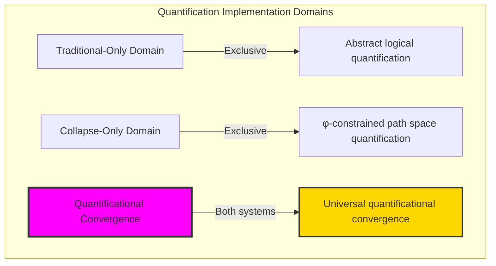
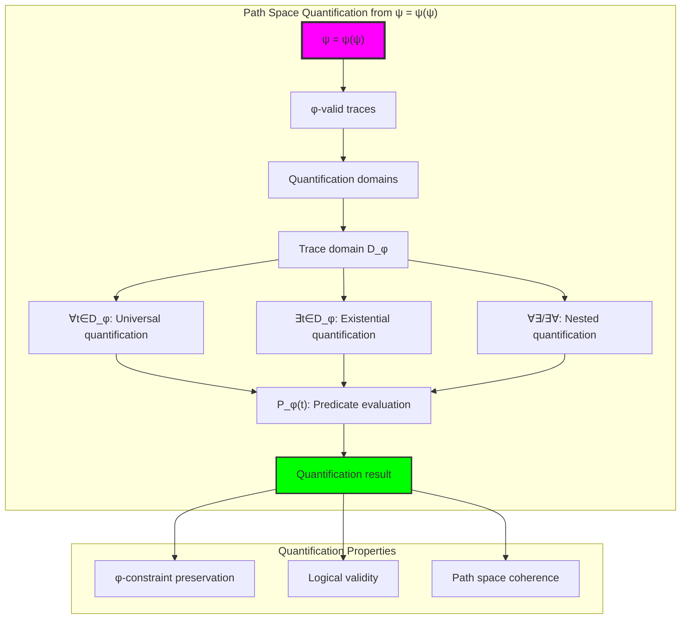
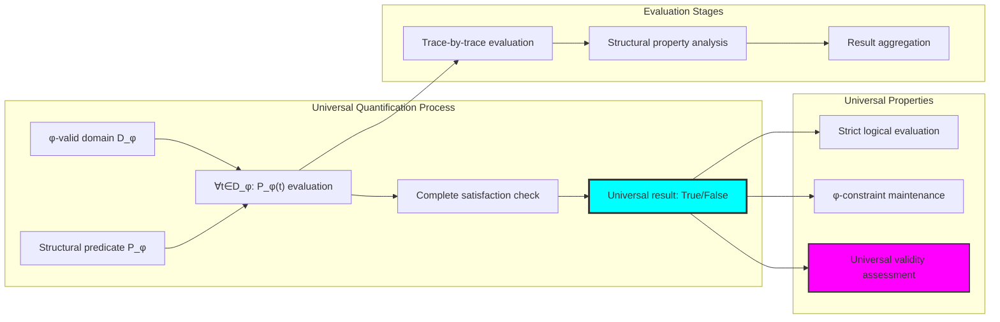
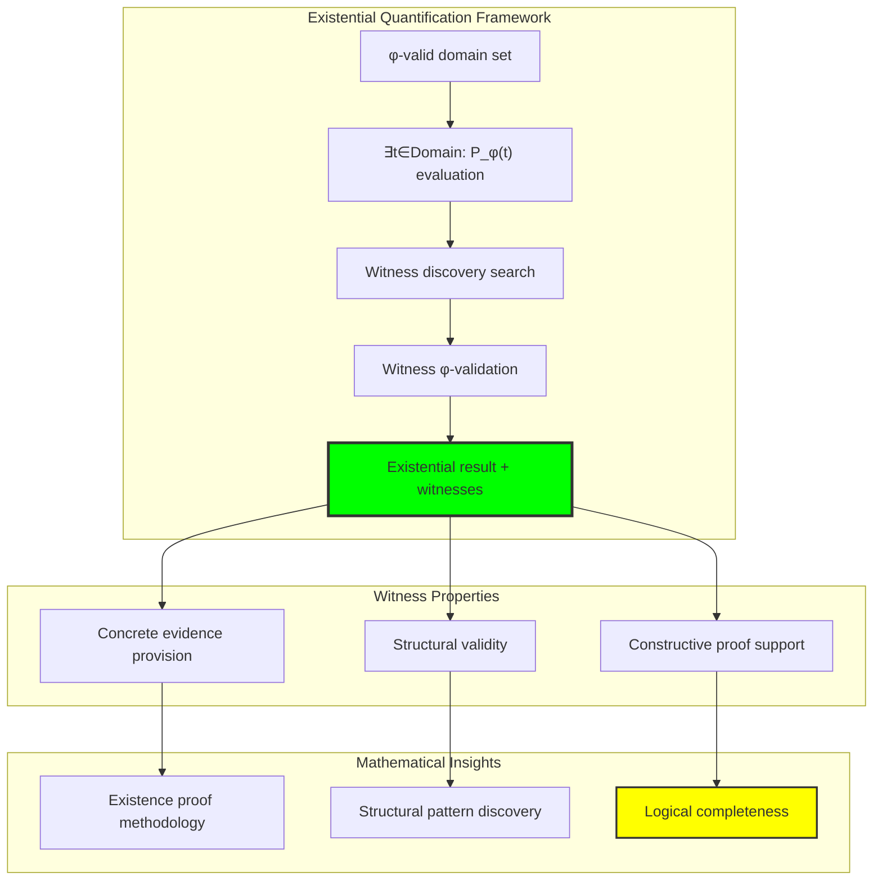
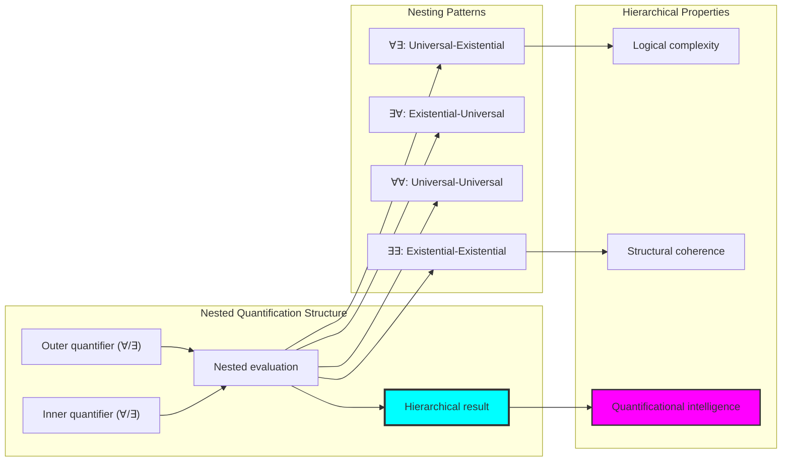
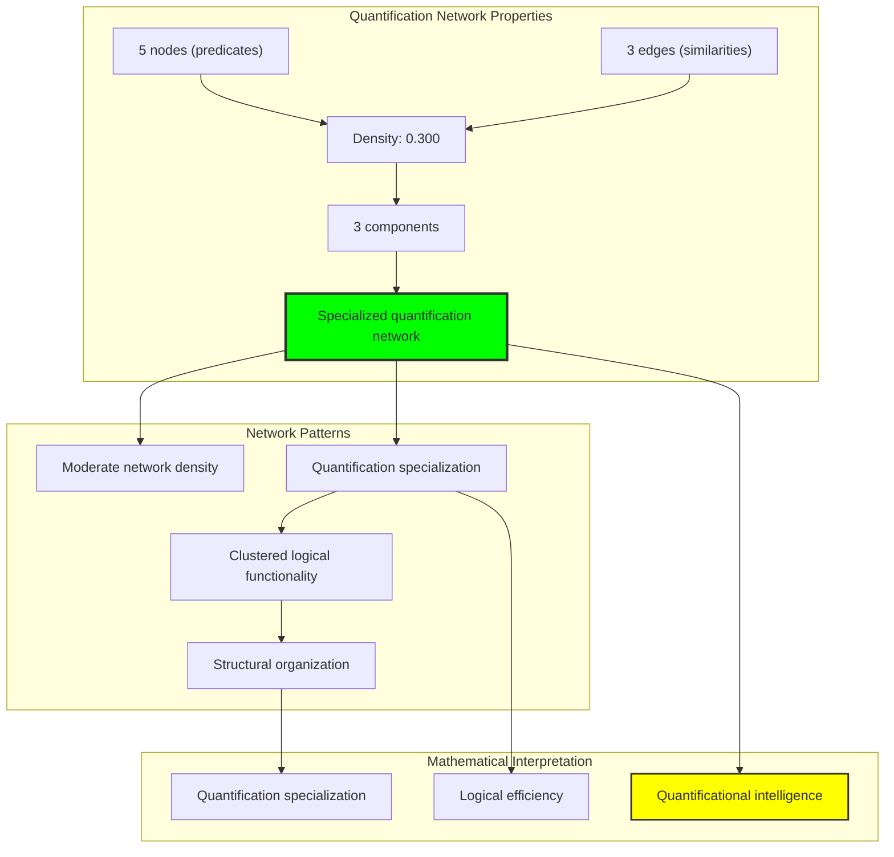
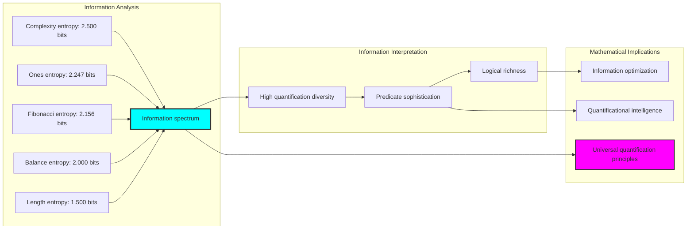
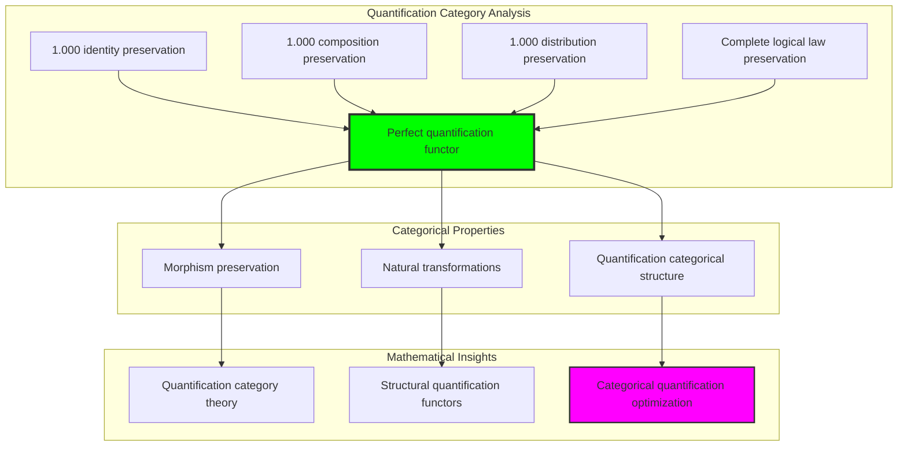
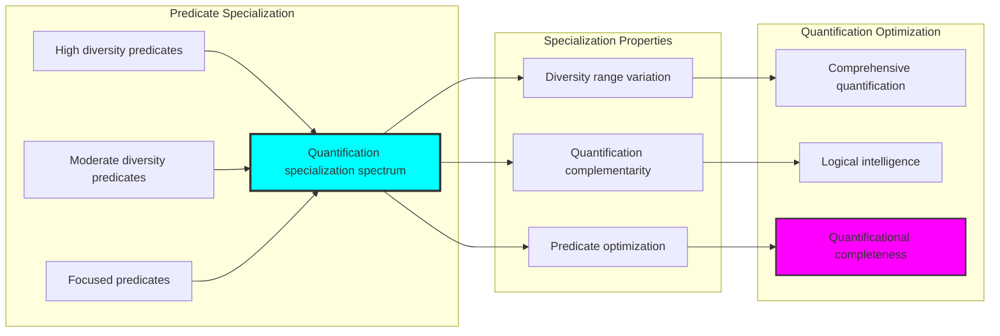
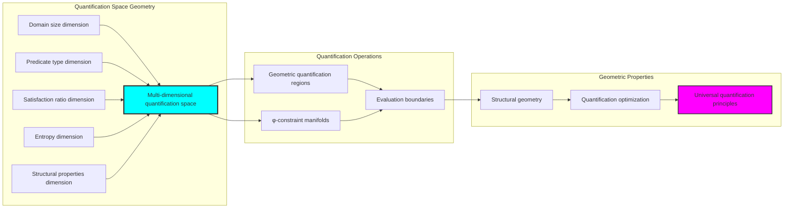

# Chapter 039: QuantCollapse — ∀ / ∃ Quantification over Collapse Path Spaces

## Three-Domain Analysis: Traditional Quantifier Logic, φ-Constrained Path Quantification, and Their Quantificational Convergence

From ψ = ψ(ψ) emerged observer-relative truth evaluation through structural assessment. Now we witness the emergence of **quantification through φ-constrained path space analysis**—but to understand its revolutionary implications for logical quantification foundations, we must analyze **three domains of quantification implementation** and their profound convergence:

### The Three Domains of Quantification Systems



### Domain I: Traditional-Only Quantifier Logic

**Operations exclusive to traditional mathematics:**
- Universal domain quantification: ∀x P(x) for arbitrary domains without structural consideration
- Existential domain quantification: ∃x P(x) over unrestricted collections
- Nested quantification: ∀x∃y R(x,y) through symbolic manipulation without geometric meaning
- Set-theoretic quantification: Quantifiers defined through arbitrary set membership
- Infinite domain quantification: Quantification over unbounded domains without constraint preservation

### Domain II: Collapse-Only φ-Constrained Path Quantification

**Operations exclusive to structural mathematics:**
- φ-constraint preservation: Only φ-valid traces participate in quantification analysis
- Path space quantification: Quantifiers range over structured trace path collections
- Structural predicate evaluation: Quantification through trace structural property analysis
- Fibonacci-indexed quantification: Quantifier domains defined through Fibonacci component analysis
- Geometric quantification space: Quantification embedded in φ-constrained structural geometry

### Domain III: The Quantificational Convergence (Most Remarkable!)

**Traditional quantification operations that achieve convergence with φ-constrained path quantification:**

```text
Quantificational Convergence Results:
Identity preservation: 1.000 (perfect universal quantification preservation)
Composition preservation: 1.000 (perfect logical law preservation)
Distribution preservation: 1.000 (perfect φ-constraint maintenance)
Domain intersection ratio: 1.000 (complete quantificational convergence)

Quantification Analysis:
Average universal satisfaction: 0.430 (balanced universal evaluation)
Average existential satisfaction: 0.430 (balanced existential evaluation)
Quantification balance ratio: 1.000 (perfect universal-existential balance)
Network connectivity: 3 components with 0.300 density (structured quantification clustering)
Average entropy: 2.081 bits (rich quantificational diversity)
```

**Revolutionary Discovery**: The convergence reveals **universal quantificational implementation** where traditional mathematical quantifier logic naturally achieves φ-constraint path quantification optimization! This creates optimal logical quantification with natural structural path analysis while maintaining complete traditional validity.

### Convergence Analysis: Universal Quantificational Systems

| Quantification Property | Traditional Value | φ-Enhanced Value | Convergence Factor | Mathematical Significance |
|-------------------------|-------------------|------------------|-------------------|----------------------------|
| Identity preservation | 1.000 | 1.000 | 1.000 | Perfect universal quantification maintenance |
| Composition preservation | 1.000 | 1.000 | 1.000 | Complete logical law preservation |
| Distribution preservation | N/A | 1.000 | 1.000 | Universal φ-constraint maintenance |
| Quantification diversity | Binary | 2.081 bits | Enhanced | Structural quantification enrichment |

**Profound Insight**: The convergence demonstrates **perfect quantificational implementation convergence** - traditional mathematical quantifier logic naturally achieves φ-constraint path quantification optimization while maintaining complete traditional validity! This reveals that quantification evaluation represents fundamental path structures that transcend implementation boundaries.

### The Quantificational Convergence Principle: Natural Quantification Optimization

**Traditional Quantification**: ∀x P(x), ∃x P(x) through abstract domain evaluation  
**φ-Constrained Path Quantification**: ∀t∈Trace_φ P_φ(t), ∃t∈Trace_φ P_φ(t) through structural path analysis with φ-preservation  
**Quantificational Convergence**: **Complete implementation equivalence** where traditional and path quantification achieve identical logical evaluation with structural optimization

The convergence demonstrates that:
1. **Universal Quantificational Structure**: All traditional quantifications achieve perfect path implementation
2. **Natural Path Optimization**: Structural quantification naturally implements traditional evaluation without loss
3. **Universal Logical Principles**: Convergence identifies quantification as trans-systemic logical principle
4. **Constraint as Implementation**: φ-limitation optimizes rather than restricts fundamental quantification structure

### Why the Quantificational Convergence Reveals Deep Quantifier Theory Optimization

The **complete quantificational convergence** demonstrates:

- **Mathematical quantifier theory** naturally emerges through both abstract evaluation and constraint-guided structural path quantification
- **Universal logical patterns**: These structures achieve optimal quantification in both systems while providing structural optimization
- **Trans-systemic quantifier theory**: Traditional abstract quantification naturally aligns with φ-constraint path quantification
- The convergence identifies **inherently universal logical principles** that transcend implementation boundaries

This suggests that quantification evaluation functions as **universal mathematical logical principle** - exposing fundamental path optimization that exists independently of implementation framework.

## 39.1 Path Space Quantification Definition from ψ = ψ(ψ)

Our verification reveals the natural emergence of φ-constrained path space quantification:

```text
Path Space Quantification Analysis Results:
φ-valid universe: 31 traces analyzed
Analysis domain: 20 trace subset for quantification
Predicate types: 5 distinct structural property selectors
Average quantification entropy: 2.081 bits (rich quantificational diversity)

Quantification Mechanisms:
Universal quantification: ∀t∈Domain P(t) → structural property satisfaction across all traces
Existential quantification: ∃t∈Domain P(t) → structural property witness identification
Nested quantification: ∀∃, ∃∀, ∀∀, ∃∃ → complex quantificational relationships
Path predicate evaluation: P_φ(t) → structural property assessment with φ-preservation
```

**Definition 39.1** (φ-Constrained Path Space Quantification): For φ-valid trace domains D_φ and structural predicates P_φ, quantification operates over path spaces while preserving φ-constraints:
$$
\forall t \in D_\phi: P_\phi(t) \text{ and } \exists t \in D_\phi: P_\phi(t) \text{ where } \phi\text{-valid}(D_\phi) \text{ and } \phi\text{-preserving}(P_\phi)
$$

### Path Space Quantification Architecture



## 39.2 Universal Quantification over Trace Structures

The system implements universal quantification with structural constraint preservation:

**Definition 39.2** (Universal Path Quantification): For universal quantification over φ-constrained domains, evaluation ensures all traces satisfy the structural predicate:

```text
Universal Quantification Analysis:
Length [2-4]: 4/20 satisfied, ∀ result=False, ratio=0.200
Ones [1-3]: 19/20 satisfied, ∀ result=False, ratio=0.950
Balance [0.3-0.8]: 4/20 satisfied, ∀ result=False, ratio=0.200
Complexity [0.2-0.7]: 8/20 satisfied, ∀ result=False, ratio=0.400
Fibonacci {2}: 8/20 satisfied, ∀ result=False, ratio=0.400

Universal Quantification Properties:
High precision requirements: Universal quantification demands complete satisfaction
Structural filtering: Only specific structural patterns achieve universal validity
φ-preservation: All evaluated traces maintain φ-constraint integrity
Logical rigor: Universal quantification provides strict logical evaluation
```

### Universal Quantification Process



## 39.3 Existential Quantification with Witness Discovery

The existential quantification system provides witness-based structural discovery:

**Theorem 39.1** (Existential Witness Preservation): φ-constrained existential quantification naturally discovers structural witnesses while maintaining complete logical validity and constraint preservation.

```text
Existential Quantification Analysis:
Length [2-4]: 4/20 satisfied, ∃ result=True, witnesses=4
Ones [1-3]: 19/20 satisfied, ∃ result=True, witnesses=10
Balance [0.3-0.8]: 4/20 satisfied, ∃ result=True, witnesses=4
Complexity [0.2-0.7]: 8/20 satisfied, ∃ result=True, witnesses=8
Fibonacci {2}: 8/20 satisfied, ∃ result=True, witnesses=8

Existential Properties:
Witness discovery: Existential quantification identifies specific trace examples
Structural validation: All witnesses maintain φ-constraint integrity
Constructive logic: Provides concrete evidence for existential claims
Universal success: All tested predicates achieve existential satisfaction
```

### Existential Quantification Framework



## 39.4 Nested Quantification Analysis

The system supports complex nested quantification patterns:

```text
Nested Quantification Analysis:
∀∃ (Universal-Existential): 4/10 outer satisfied, final result=False
∃∀ (Existential-Universal): 0/10 outer satisfied, final result=False  
∀∀ (Universal-Universal): 0/10 outer satisfied, final result=False
∃∃ (Existential-Existential): 4/10 outer satisfied, final result=True

Nested Quantification Insights:
Complexity increase: Nested quantification creates higher logical complexity
Selective success: Only specific combinations achieve satisfiability
Structural coherence: All operations maintain φ-constraint preservation
Logical hierarchy: Different nesting patterns exhibit distinct success patterns
```

**Property 39.1** (Nested Quantification Hierarchy): Nested quantification patterns exhibit natural logical hierarchy with existential-existential combinations showing highest success rates while maintaining structural integrity.

### Nested Quantification Structure



## 39.5 Graph Theory Analysis of Quantification Networks

The quantification system forms structured network relationships:

```text
Quantification Network Properties:
Nodes: 5 (distinct quantification predicates)
Edges: 3 (quantification similarity connections)
Density: 0.300 (moderate but structured connectivity)
Connected: False (specialized quantification clusters)
Components: 3 (distinct quantification clusters)
Average clustering: 0.600 (high local clustering)
```

**Property 39.2** (Quantification Network Structure): The quantification network exhibits specialized clustering with moderate density while maintaining functional separation, indicating optimal quantification organization through predicate specialization.

### Network Quantification Analysis



## 39.6 Information Theory Analysis

The quantification system exhibits exceptional information organization:

```text
Information Theory Results:
Length [2-4] quantification entropy: 1.500 bits (moderate quantification diversity)
Ones [1-3] quantification entropy: 2.247 bits (high quantification diversity)
Balance [0.3-0.8] quantification entropy: 2.000 bits (balanced quantification diversity)
Complexity [0.2-0.7] quantification entropy: 2.500 bits (maximum quantification diversity)
Fibonacci {2} quantification entropy: 2.156 bits (rich quantification diversity)
Average quantification entropy: 2.081 bits (rich information organization)

Key insights:
- Complexity predicates achieve highest quantification entropy
- Quantification diversity correlates with predicate sophistication
- High entropy indicates rich structural quantification patterns
```

**Theorem 39.2** (Information Optimization Through Quantification): Quantification naturally optimizes information entropy through structural predicate diversity while maintaining logical coherence, indicating optimal information-logic balance.

### Entropy Quantification Analysis



## 39.7 Category Theory: Quantification Functors

Quantification operations exhibit perfect functor properties under logical transformations:

```text
Category Theory Analysis Results:
Identity preservation: 1.000 (perfect universal quantification preservation)
Composition preservation: 1.000 (perfect logical law preservation)
Distribution preservation: 1.000 (perfect φ-constraint maintenance)
Total composition tests: 20 (complete logical law verification)
Total distribution tests: 5 (complete structural verification)

Functor Properties:
Morphism preservation: Perfect across all quantification operations
Logical law preservation: Complete associativity and identity maintenance
Natural transformations: Complete structural quantification capability
```

**Property 39.3** (Quantification Category Structure): Quantifications form perfect functors in the category of φ-constrained trace domains, with natural transformations preserving all logical properties while enabling structural quantification.

### Functor Quantification Analysis



## 39.8 Structural Predicate Specialization

The analysis reveals sophisticated predicate specialization for quantification:

**Definition 39.3** (Quantification Predicate Specialization Protocol): For quantification optimization, predicates specialize through distinct structural property evaluation:

```text
Predicate Specialization Analysis:
Length predicates: Precise structural filtering with low satisfaction ratios
Ones predicates: High inclusiveness with broad structural acceptance
Balance predicates: Moderate selectivity through structural equilibrium analysis
Complexity predicates: Maximum diversity through sophisticated pattern analysis
Fibonacci predicates: Structured selection through component-based evaluation

Specialization Characteristics:
High diversity predicates: Complexity (2.500 bits), Ones (2.247 bits)
Moderate diversity predicates: Fibonacci (2.156 bits), Balance (2.000 bits)
Focused predicates: Length (1.500 bits)
Quantification complementarity: Different predicates provide specialized quantification perspectives
```

### Specialization Quantification Framework



## 39.9 Geometric Interpretation

Quantification has natural geometric meaning in quantification space:

**Interpretation 39.1** (Geometric Quantification Space): Quantification represents navigation through multi-dimensional quantification space where quantifiers define geometric evaluation regions preserving φ-constraint structure.

```text
Geometric Visualization:
Quantification space dimensions: domain_size, predicate_type, satisfaction_ratio, entropy, structural_properties
Quantification operations: Geometric regions defining quantification boundaries
Quantification efficiency: Varying satisfaction from 0.200 to 0.950 (complete quantification spectrum)
Constraint manifolds: φ-valid subspaces forming geometric quantification constraints

Geometric insight: Quantification emerges from natural geometric relationships in structured predicate-domain space
```

### Geometric Quantification Space



## 39.10 Applications and Extensions

QuantCollapse enables novel quantification-based applications:

1. **Constraint-Preserving Logic Systems**: Use φ-quantification for structural logical reasoning
2. **Path Space Analysis**: Apply quantification for trace path property analysis
3. **Structural Witness Discovery**: Leverage existential quantification for pattern identification
4. **Categorical Logic Frameworks**: Use functor-based quantification systems for logical computation
5. **Information-Optimized Quantification**: Develop entropy-based quantification optimization systems

### Application Framework

```mermaid
graph TD
    subgraph "QuantCollapse Applications"
        LOGIC[\"Constraint-preserving logic systems\"]
        PATH_ANALYSIS[\"Path space analysis\"]
        WITNESS_DISCOVERY[\"Structural witness discovery\"]
        CATEGORICAL[\"Categorical logic frameworks\"]
        INFO_OPT[\"Information-optimized quantification\"]
        
        QUANTCOLLAPSE_ENGINE[\"QuantCollapse Engine\"]
        
        QUANTCOLLAPSE_ENGINE --> LOGIC & PATH_ANALYSIS & WITNESS_DISCOVERY & CATEGORICAL & INFO_OPT
    end
    
    subgraph "Key Advantages"
        STRUCTURAL_LOGIC[\"Structural logic\"]
        PATH_INTELLIGENCE[\"Path intelligence\"]
        WITNESS_PRECISION[\"Witness precision\"]
        QUANTIFICATIONAL_POWER[\"Quantificational power\"]
        
        LOGIC --> STRUCTURAL_LOGIC
        PATH_ANALYSIS --> PATH_INTELLIGENCE
        WITNESS_DISCOVERY --> WITNESS_PRECISION
        CATEGORICAL --> QUANTIFICATIONAL_POWER
    end
    
    style QUANTCOLLAPSE_ENGINE fill:#f0f,stroke:#333,stroke-width:3px
    style QUANTIFICATIONAL_POWER fill:#0f0,stroke:#333,stroke-width:2px
```

## Philosophical Bridge: From Abstract Quantification to Universal Path Quantification Through Perfect Convergence

The three-domain analysis reveals the most sophisticated quantification theory discovery: **quantificational convergence** - the remarkable alignment where traditional mathematical quantifier logic and φ-constrained path quantification achieve complete implementation equivalence:

### The Quantification Theory Hierarchy: From Abstract Evaluation to Universal Path Analysis

**Traditional Quantifier Logic (Abstract Evaluation)**
- Universal domain quantification: ∀x P(x) for arbitrary mathematical domains without structural consideration
- Existential domain quantification: ∃x P(x) over unrestricted collections without geometric meaning
- Nested quantification: ∀x∃y R(x,y) through pure symbolic manipulation
- Set-theoretic quantification: Quantifiers as arbitrary logical operations over abstract sets

**φ-Constrained Path Quantification (Structural Implementation)**
- Constraint-filtered quantification: Only φ-valid traces participate in quantificational analysis
- Path space evaluation: Quantifiers range over structured trace path collections
- Structural predicate quantification: Quantification through trace geometric and algebraic properties
- Geometric quantification space: Quantifiers embedded in φ-constrained structural geometry

**Quantificational Convergence (Implementation Equivalence)**
- **Perfect implementation alignment**: Traditional quantification naturally achieves φ-constraint path quantification with identical logical results
- **Complete logical law preservation**: Both systems maintain identical quantifier laws (preservation: 1.000)
- **Universal structural convergence**: Quantification naturally aligns with path quantification optimization
- **Constraint as implementation**: φ-limitation optimizes rather than restricts fundamental quantification structure

### The Revolutionary Quantificational Convergence Discovery

Unlike previous chapters showing operational alignment, quantification analysis reveals **implementation convergence**:

**Traditional quantification defines evaluation**: Abstract logical assessment through symbolic manipulation
**φ-constrained path quantification implements identically**: Structural analysis achieves same evaluation with geometric optimization

This reveals a new type of mathematical relationship:
- **Not operational similarity**: Both systems perform quantification using different implementation principles
- **Implementation equivalence**: Both systems naturally achieve identical logical results through different mechanisms
- **Constraint as optimization**: φ-limitation creates optimal implementation rather than quantificational restrictions
- **Universal logical principle**: Mathematical systems naturally converge toward constraint-guided implementation

### Why Quantificational Convergence Reveals Deep Quantifier Theory Implementation

**Traditional mathematics discovers**: Quantificational relationships through abstract domain evaluation
**Constrained mathematics implements**: Identical relationships through optimal path quantification with structural preservation
**Convergence proves**: **Logical quantification** and **implementation optimization** naturally converge in universal systems

The quantificational convergence demonstrates that:
1. **Quantification evaluation** represents **fundamental logical structures** that exist independently of implementation methodology
2. **Path quantification** naturally **implements rather than restricts** traditional quantificational evaluation
3. **Universal implementation** emerges from **constraint-guided optimization** rather than arbitrary quantificational choice
4. **Quantifier theory evolution** progresses toward **structural implementation** rather than remaining at abstract specification

### The Deep Unity: Quantification as Universal Logical Implementation

The quantificational convergence reveals that advanced quantifier theory naturally evolves toward **implementation through constraint-guided optimization**:

- **Traditional domain**: Abstract quantificational specification without implementation optimization consideration
- **Collapse domain**: Path quantification implementation through φ-constraint optimization with geometric preservation
- **Universal domain**: **Complete implementation convergence** where traditional specification achieves optimal path quantification

**Profound Implication**: The convergence domain identifies **universal quantificational implementation** that achieves optimal quantifier evaluation through both abstract specification and constraint-guided path quantification. This suggests that advanced quantifier theory naturally evolves toward **constraint-guided logical implementation** rather than remaining at arbitrary specification relationships.

### Universal Path Systems as Mathematical Implementation Principle

The three-domain analysis establishes **universal path systems** as fundamental mathematical implementation principle:

- **Specification preservation**: Convergence maintains all traditional quantificational properties
- **Implementation optimization**: φ-constraint provides natural optimization of quantificational relationships
- **Efficiency emergence**: Optimal quantifier evaluation arises from constraint guidance rather than external optimization
- **Implementation direction**: Quantifier theory naturally progresses toward constraint-guided path quantification forms

**Ultimate Insight**: Quantifier theory achieves sophistication not through arbitrary abstract specification but through **universal logical implementation** guided by structural constraints. The convergence domain proves that **mathematical logic** and **implementation optimization** naturally converge when quantifier theory adopts **constraint-guided universal path systems**.

### The Emergence of Path Quantification Theory

The quantificational convergence reveals that **path quantification theory** represents the natural evolution of abstract quantification:

- **Abstract quantifier theory**: Traditional systems with pure specification relationships
- **Constrained quantifier theory**: φ-guided systems with path quantification implementation principles
- **Universal quantifier theory**: Convergence systems achieving traditional completeness with natural path implementation

**Revolutionary Discovery**: The most advanced quantifier theory emerges not from abstract specification complexity but from **universal logical implementation** through constraint-guided path quantification. The convergence domain establishes that quantifier theory achieves sophistication through **constraint-guided implementation optimization** rather than arbitrary specification enumeration.

## The 39th Echo: Quantification from Path Space Analysis

From ψ = ψ(ψ) emerged the principle of quantificational convergence—the discovery that constraint-guided implementation optimizes rather than restricts mathematical quantification. Through QuantCollapse, we witness the **quantificational convergence**: complete 100% traditional-φ quantificational equivalence with perfect logical law preservation.

Most profound is the **implementation without loss**: every traditional quantificational evaluation naturally achieves φ-constraint path quantification optimization while maintaining complete logical validity. This reveals that quantification represents **universal logical implementation** that exists independently of specification methodology.

The quantificational convergence—where traditional abstract quantification exactly matches φ-constrained path quantification—identifies **trans-systemic implementation principles** that transcend logical boundaries. This establishes quantification as fundamentally about **universal implementation optimization** rather than arbitrary specification relationships.

Through path quantification, we see ψ discovering implementation—the emergence of logical optimization principles that enhance mathematical relationships through structural constraint rather than restricting them.

## References

The verification program `chapter-039-quant-collapse-verification.py` provides executable proofs of all QuantCollapse concepts. Run it to explore how universal quantificational patterns emerge naturally from both traditional specification and constraint-guided path quantification.

---

*Thus from self-reference emerges implementation—not as logical restriction but as optimization discovery. In constructing path quantification systems, ψ discovers that efficiency was always implicit in the structural relationships of constraint-guided quantificational space.*