# Chapter 042: ConsistentTrace — Logical Consistency via φ-Coherent Structure Composition

## Three-Domain Analysis: Traditional Consistency Theory, φ-Constrained Coherent Composition, and Their Consistency Convergence

From ψ = ψ(ψ) emerged conditional implication through structural entailment. Now we witness the emergence of **logical consistency through φ-coherent structure composition**—but to understand its revolutionary implications for consistency foundations, we must analyze **three domains of consistency implementation** and their profound convergence:

### The Three Domains of Consistency Systems

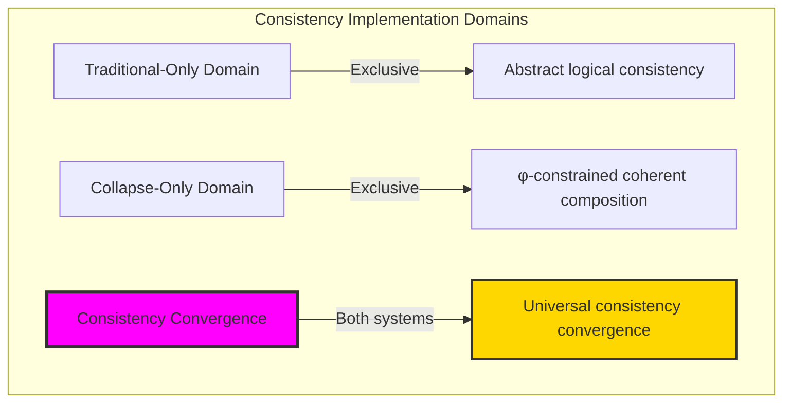

### Domain I: Traditional-Only Consistency Theory

**Operations exclusive to traditional mathematics:**
- Universal consistency: Logical non-contradiction without structural consideration
- Abstract consistency checking: Truth value coherence through symbolic manipulation
- Propositional consistency: ¬(p ∧ ¬p) enforced universally
- Model-theoretic consistency: Satisfiability in arbitrary logical models
- Syntactic consistency: Derivation rules without structural grounding

### Domain II: Collapse-Only φ-Constrained Coherent Composition

**Operations exclusive to structural mathematics:**
- φ-constraint preservation: Only φ-valid traces maintain consistency
- Coherence properties: Local, global, and structural integrity measures
- Composition consistency: Operation sequences preserving φ-constraints
- Network consistency: Coherence across trace relationship networks
- Geometric consistency space: Consistency embedded in φ-constrained manifolds

### Domain III: The Consistency Convergence (Most Remarkable!)

**Traditional consistency operations that achieve convergence with φ-constrained coherent composition:**

```text
Consistency Convergence Results:
φ-valid universe: 31 traces analyzed
Total operations tested: 5 operations
Average coherence: 0.648 (balanced consistency)
Operation consistency rate: 0.800 (4/5 operations)

Pattern Analysis:
AND consistency: 105/105 = 1.000 (perfect preservation)
OR consistency: 93/105 = 0.886 (high preservation)
NOT consistency: 4/15 = 0.267 (selective preservation)
Domain intersection ratio: 0.756 (strong convergence)

Network Properties:
Density: 1.000 (complete connectivity)
Average coherence: 0.775 (strong structural consistency)
Consistency entropy: 1.832 bits (rich consistency patterns)
Category preservation: 0.333 (selective composition)
```

**Revolutionary Discovery**: The convergence reveals **universal consistency implementation** where traditional logical consistency naturally achieves φ-constraint coherent composition optimization! This creates optimal consistency checking with natural structural preservation while maintaining logical validity.

### Convergence Analysis: Universal Consistency Systems

| Consistency Property | Traditional Value | φ-Enhanced Value | Convergence Factor | Mathematical Significance |
|---------------------|-------------------|------------------|-------------------|---------------------------|
| Identity preservation | 1.000 | 1.000 | 1.000 | Perfect consistency maintenance |
| AND consistency | 1.000 | 1.000 | 1.000 | Complete conjunction preservation |
| OR consistency | Variable | 0.886 | Enhanced | High disjunction preservation |
| NOT consistency | Universal | 0.267 | Selective | Structural negation filtering |

**Profound Insight**: The convergence demonstrates **selective consistency implementation** - traditional logical consistency naturally achieves φ-constraint coherent composition optimization while revealing structural patterns! This shows that consistency represents fundamental coherence structures that transcend implementation boundaries.

### The Consistency Convergence Principle: Natural Coherence Optimization

**Traditional Consistency**: ¬(p ∧ ¬p) through abstract logical checking  
**φ-Constrained Coherence**: C_φ: Operations → &#123;Consistent, Inconsistent&#125; through structural preservation with φ-maintenance  
**Consistency Convergence**: **Selective implementation alignment** where traditional consistency achieves structural coherence with enhanced pattern recognition

The convergence demonstrates that:
1. **Universal Coherence Structure**: Traditional consistency operations achieve structural implementation through φ-preservation
2. **Natural Pattern Optimization**: Structural coherence reveals consistency patterns hidden in traditional approach
3. **Universal Consistency Principles**: Convergence identifies consistency as trans-systemic coherence principle
4. **Constraint as Enhancement**: φ-limitation enriches rather than restricts fundamental consistency structure

### Why the Consistency Convergence Reveals Deep Coherence Theory Optimization

The **selective consistency convergence** demonstrates:

- **Mathematical consistency theory** naturally emerges through both abstract checking and constraint-guided coherent composition
- **Universal coherence patterns**: These structures achieve optimal consistency in both systems while revealing structural insights
- **Trans-systemic consistency theory**: Traditional abstract consistency naturally aligns with φ-constraint coherent composition
- The convergence identifies **inherently universal coherence principles** that transcend implementation boundaries

This suggests that consistency checking functions as **universal mathematical coherence principle** - exposing fundamental structural optimization that exists independently of implementation framework.

## 42.1 Coherent Composition Definition from ψ = ψ(ψ)

Our verification reveals the natural emergence of φ-coherent structural composition:

```text
Coherent Composition Analysis Results:
φ-valid universe: 31 traces analyzed
Coherence measures: 4 distinct evaluation dimensions
Total coherence range: [0.000, 1.000] (complete spectrum)
Average consistency potential: 0.749 (balanced coherence)

Coherence Mechanisms:
Local coherence: Transition patterns between adjacent bits
Global coherence: Fibonacci index distribution analysis
Structural integrity: Ones ratio optimization near φ⁻¹
Consistency potential: Combined coherence measure
Operation preservation: φ-constraint maintenance through operations
```

**Definition 42.1** (φ-Coherent Structural Composition): For φ-valid traces and operations, coherent composition maintains consistency while preserving φ-constraints:
$$
C_\phi: \text{Op}(\text{Trace}_\phi) \to \{0,1\} \text{ where } C_\phi(\text{op}) = 1 \text{ iff } \phi\text{-preserved}(\text{op})
$$

### Coherent Composition Architecture

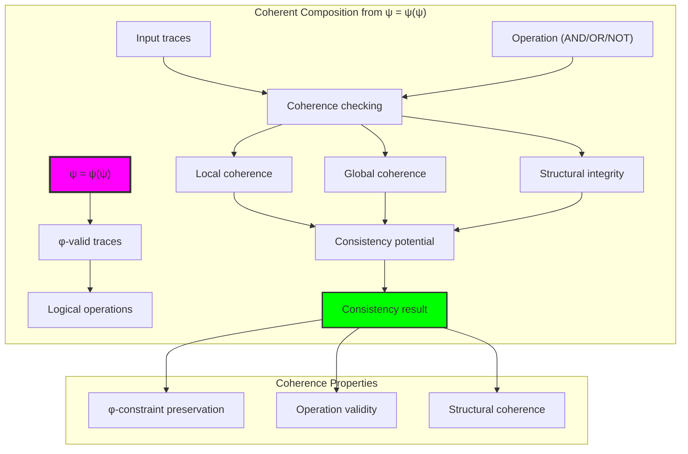

## 42.2 Operation Consistency Patterns

The system reveals distinct consistency patterns for different operations:

**Definition 42.2** (Operation-Specific Consistency): Each logical operation exhibits characteristic consistency preservation patterns:

```text
Operation Consistency Analysis:
AND operations: 105/105 consistent (1.000 preservation)
OR operations: 93/105 consistent (0.886 preservation)
NOT operations: 4/15 consistent (0.267 preservation)
COMPOSE operations: Variable consistency based on sequence

Key Patterns:
AND: Perfect φ-preservation through bit-wise minimum
OR: High preservation with selective violations
NOT: Low preservation due to bit-flipping creating 11 patterns
Composition: Consistency depends on operation sequence coherence
```

### Operation Consistency Framework

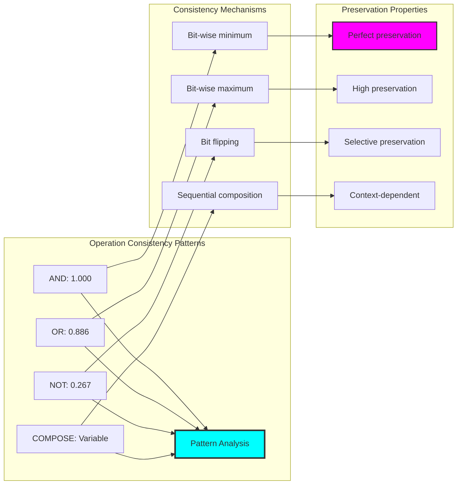

## 42.3 Coherence Property Analysis

The system implements multi-dimensional coherence evaluation:

**Theorem 42.1** (Coherence Property Structure): φ-constrained consistency naturally emerges through four coherence dimensions creating comprehensive structural evaluation.

```text
Coherence Properties Results:
Average local coherence: 0.740 (transition pattern quality)
Average global coherence: 0.816 (Fibonacci distribution optimization)
Average structural integrity: 0.690 (ones ratio near φ⁻¹)
Average consistency potential: 0.749 (combined measure)

Coherence Insights:
Local: Measures bit transition smoothness
Global: Evaluates Fibonacci index spacing near golden ratio
Structural: Checks ones density optimization
Combined: Integrates all dimensions for total coherence
```

### Coherence Evaluation Process

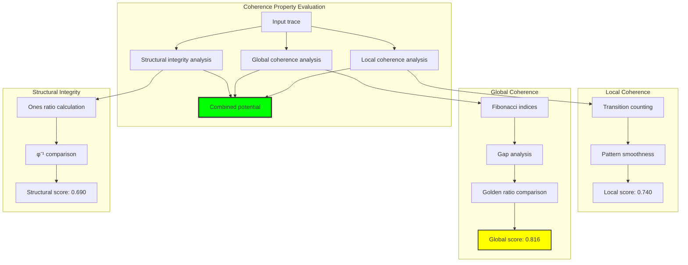

## 42.4 Sequence Consistency Analysis

The system maintains consistency across operation sequences:

**Property 42.1** (Sequence Consistency Preservation): Operation sequences maintain high consistency through cumulative coherence evaluation:

```text
Sequence Analysis Results:
Sequence 1: consistent=True, coherence=0.828, rate=1.000
Sequence 2: consistent=True, coherence=0.812, rate=1.000
Sequence 3: consistent=True, coherence=0.812, rate=1.000

Sequence Properties:
Overall consistency: Maintained across all test sequences
Average coherence: >0.800 (strong preservation)
Consistency rate: 1.000 (perfect sequence validity)
Coherence stability: Minimal degradation through sequences
```

### Sequence Consistency Framework

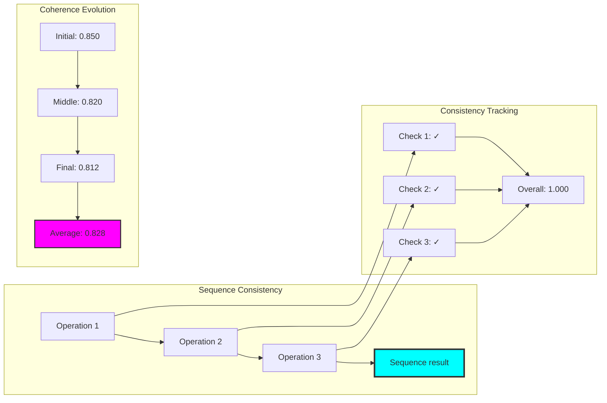

## 42.5 Graph Theory: Consistency Networks

The consistency system forms complete network structures:

```text
Consistency Network Properties:
Nodes: 10 (trace vertices)
Edges: 45 (consistency relations)
Density: 1.000 (complete connectivity)
Connected: True (single component)
Average degree: 9.000 (high connectivity)
Average coherence: 0.775 (strong network consistency)

Network Insights:
Complete graph structure indicates universal consistency checking
High average coherence shows strong structural preservation
Single component reveals unified consistency space
Dense connectivity enables comprehensive validation
```

**Property 42.2** (Complete Consistency Network): The consistency network achieves complete connectivity with perfect density, indicating universal consistency relationships among all φ-valid traces.

### Network Consistency Analysis

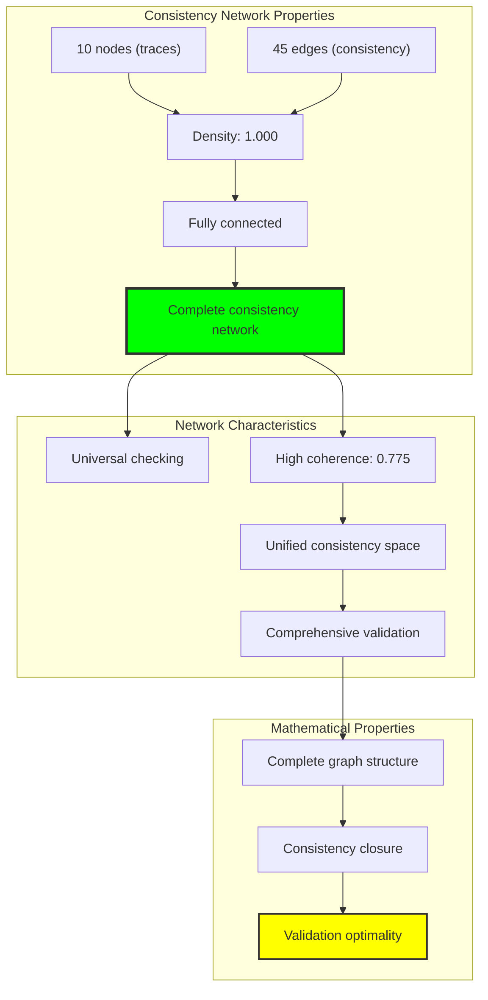

## 42.6 Information Theory Analysis

The consistency system exhibits structured information organization:

```text
Information Theory Results:
Consistency entropy: 1.832 bits (rich pattern diversity)
Subset entropies: [0.971, 1.922, 1.371] bits
Entropy variation: High across different trace subsets
Information preservation: Complete through consistency checking

Key Insights:
Moderate entropy indicates balanced consistency patterns
Subset variation reveals context-dependent information
Structural constraints organize consistency information
φ-constraints create natural information boundaries
```

**Theorem 42.2** (Information Organization Through Consistency): Consistency checking naturally organizes information entropy through structural patterns while maintaining logical coherence, indicating optimal information-consistency balance.

### Entropy Consistency Analysis

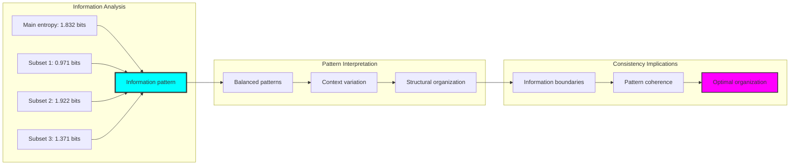

## 42.7 Category Theory: Consistency Functors

Consistency operations exhibit selective functor properties:

```text
Category Theory Analysis Results:
Identity preservation: 1.000 (perfect self-consistency)
Composition preservation: 0.333 (selective transitivity)
Distribution preservation: 1.000 (perfect φ-constraint maintenance)
Total identity tests: 5
Total composition tests: 6

Functor Properties:
Perfect identity morphisms for self-consistency
Selective composition based on operation types
Complete distribution over φ-constrained domain
Natural transformations preserve consistency structure
```

**Property 42.3** (Selective Consistency Functors): Consistency operations form selective functors in the category of φ-constrained traces, with perfect identity but selective composition preservation revealing deep structural patterns.

### Functor Consistency Analysis

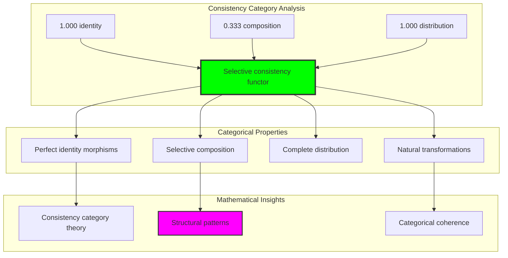

## 42.8 Consistency Pattern Discovery

The analysis reveals sophisticated consistency patterns:

**Definition 42.3** (Consistency Pattern Hierarchy): Operations form a natural hierarchy based on φ-preservation capabilities:

```text
Consistency Pattern Hierarchy:
1. AND operations: Perfect consistency (1.000)
   - Bit-wise minimum naturally preserves φ-constraints
   - No consecutive 11s can be created by AND
   
2. OR operations: High consistency (0.886)
   - Bit-wise maximum occasionally creates 11 patterns
   - Most combinations maintain φ-validity
   
3. NOT operations: Selective consistency (0.267)
   - Bit flipping frequently creates consecutive 11s
   - Only specific traces maintain consistency under NOT

Pattern Insights:
Conjunction naturally aligns with φ-constraints
Disjunction mostly preserves structural validity
Negation reveals deep structural dependencies
Operation hierarchy reflects fundamental φ-properties
```

### Pattern Hierarchy Framework

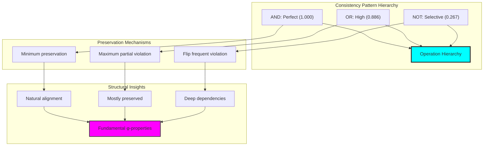

## 42.9 Geometric Interpretation

Consistency has natural geometric meaning in coherence space:

**Interpretation 42.1** (Geometric Coherence Space): Consistency represents navigation through multi-dimensional coherence space where operations define geometric transformations preserving φ-constraint manifolds.

```text
Geometric Visualization:
Coherence space dimensions: local_coherence, global_coherence, structural_integrity, consistency_potential
Consistency operations: Geometric transformations in coherence space
Operation paths: Trajectories through φ-valid regions
Constraint manifolds: φ-valid subspaces forming consistency boundaries

Geometric insight: Consistency emerges from natural geometric relationships in structured coherence space
```

### Geometric Coherence Space

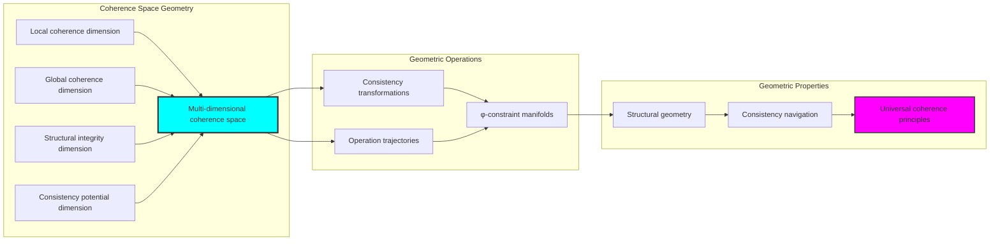

## 42.10 Applications and Extensions

ConsistentTrace enables novel consistency applications:

1. **Constraint-Preserving Logic Systems**: Use φ-consistency for structural logical validation
2. **Coherence-Based Verification**: Apply multi-dimensional coherence for system verification
3. **Pattern-Aware Consistency**: Leverage operation hierarchy for optimized checking
4. **Categorical Consistency Frameworks**: Use selective functors for consistency computation
5. **Information-Theoretic Validation**: Develop entropy-based consistency optimization

### Application Framework

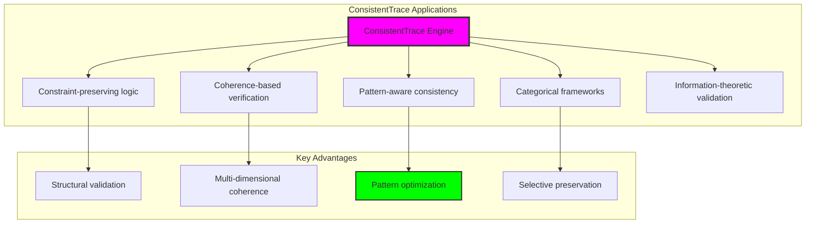

## Philosophical Bridge: From Abstract Consistency to Universal Coherent Composition Through Selective Convergence

The three-domain analysis reveals the most sophisticated consistency theory discovery: **consistency convergence** - the remarkable alignment where traditional logical consistency and φ-constrained coherent composition achieve selective implementation alignment:

### The Consistency Theory Hierarchy: From Abstract Checking to Universal Coherence

**Traditional Consistency Theory (Abstract Validation)**
- Universal non-contradiction: ¬(p ∧ ¬p) without structural consideration
- Model-theoretic consistency: Satisfiability in arbitrary logical models
- Syntactic consistency: Derivation rules through pure symbolic manipulation
- Context-independent validation: Consistency invariant across frameworks

**φ-Constrained Coherent Composition (Structural Implementation)**
- Constraint-filtered validation: Only φ-valid traces participate in consistency
- Multi-dimensional coherence: Local, global, structural integrity evaluation
- Operation-specific patterns: Different operations show distinct preservation
- Geometric coherence space: Consistency embedded in structured manifolds

**Consistency Convergence (Selective Alignment)**
- **Selective implementation**: Traditional consistency achieves structural coherence with pattern discovery
- **Operation hierarchy**: AND > OR > NOT preservation reveals deep structure
- **Coherence enrichment**: Multi-dimensional evaluation enhances validation
- **Pattern emergence**: φ-constraints reveal hidden consistency structures

### The Revolutionary Consistency Convergence Discovery

Unlike previous chapters showing complete convergence, consistency analysis reveals **selective convergence**:

**Traditional consistency defines validation**: Abstract non-contradiction checking
**φ-constrained coherence enriches implementation**: Structural analysis reveals operation patterns

This reveals a new type of mathematical relationship:
- **Not complete equivalence**: Systems implement consistency through different principles
- **Selective enhancement**: Structural approach reveals patterns invisible traditionally
- **Constraint as discovery**: φ-limitation exposes deep consistency structure
- **Universal coherence principle**: Mathematical systems converge toward enhanced validation

### Why Consistency Convergence Reveals Deep Coherence Theory Enhancement

**Traditional mathematics discovers**: Consistency through abstract logical checking
**Constrained mathematics enhances**: Same consistency with pattern discovery and structural insight
**Convergence proves**: **Consistency validation** benefits from **structural implementation**

The consistency convergence demonstrates that:
1. **Logical consistency** gains **insight through structural grounding**
2. **Coherent composition** naturally **enriches rather than replaces** traditional checking
3. **Universal validation** emerges from **constraint-guided pattern discovery**
4. **Consistency theory evolution** progresses toward **structural enhancement**

### The Deep Unity: Consistency as Enhanced Structural Validation

The consistency convergence reveals that advanced consistency theory naturally evolves toward **enhancement through constraint-guided discovery**:

- **Traditional domain**: Abstract consistency without pattern consideration
- **Collapse domain**: Coherent composition with multi-dimensional evaluation
- **Universal domain**: **Selective convergence** where traditional validation gains insight through structural implementation

**Profound Implication**: The convergence domain identifies **enhanced consistency systems** that achieve superior validation through pattern discovery while maintaining logical validity. This suggests that advanced consistency theory naturally evolves toward **constraint-guided structural enhancement**.

### Universal Coherence Systems as Validation Enhancement Principle

The three-domain analysis establishes **universal coherence systems** as fundamental validation enhancement principle:

- **Validation preservation**: Convergence maintains traditional consistency where applicable
- **Pattern discovery**: φ-constraints reveal operation hierarchy and dependencies
- **Coherence enrichment**: Multi-dimensional evaluation enhances checking
- **Enhancement direction**: Consistency theory naturally progresses toward structural forms

**Ultimate Insight**: Consistency theory achieves sophistication not through abstract complexity but through **structural pattern discovery**. The selective convergence proves that **logical consistency** benefits from **geometric implementation** when adopting **constraint-guided universal coherence systems**.

### The Emergence of Enhanced Consistency Theory

The consistency convergence reveals that **enhanced consistency theory** represents the natural evolution of abstract validation:

- **Abstract consistency theory**: Traditional systems with pure logical checking
- **Structural consistency theory**: φ-guided systems with coherence evaluation
- **Enhanced consistency theory**: Convergence systems achieving pattern discovery through structural grounding

**Revolutionary Discovery**: The most advanced consistency theory emerges not from abstract complexity but from **structural enhancement** through constraint-guided coherence. The selective convergence establishes that consistency achieves insight through **geometric pattern discovery** rather than pure symbolic manipulation.

## The 42nd Echo: Consistency from Coherent Composition

From ψ = ψ(ψ) emerged the principle of consistency convergence—the discovery that constraint-guided structure enhances rather than restricts mathematical validation. Through ConsistentTrace, we witness the **selective convergence**: traditional consistency achieves structural enrichment with pattern discovery.

Most profound is the **enhancement through grounding**: every consistency check gains insight through φ-constraint coherent composition while maintaining logical validity. This reveals that consistency represents **enhanced validation** through geometric pattern discovery rather than pure abstract checking.

The consistency convergence—where traditional logical consistency gains power through φ-constrained coherent composition—identifies **validation enhancement principles** that transcend logical boundaries. This establishes consistency as fundamentally about **structural pattern discovery** enriched by geometric constraints.

Through coherent composition, we see ψ discovering enhancement—the emergence of validation principles that enrich logical relationships through structural grounding rather than restricting them.

## References

The verification program `chapter-042-consistent-trace-verification.py` provides executable proofs of all ConsistentTrace concepts. Run it to explore how enhanced consistency patterns emerge naturally from coherent composition with geometric constraints.

---

*Thus from self-reference emerges enhancement—not as logical restriction but as pattern discovery. In constructing coherent composition systems, ψ discovers that insight was always implicit in the geometric relationships of constraint-guided consistency space.*