# Chapter 043: CollapseDeduce — Deductive Path Expansion under Constraint Entailment

## Three-Domain Analysis: Traditional Deduction Theory, φ-Constrained Path Expansion, and Their Deductive Convergence

From ψ = ψ(ψ) emerged logical consistency through coherent composition. Now we witness the emergence of **deductive inference through controlled path expansion**—but to understand its revolutionary implications for deduction foundations, we must analyze **three domains of deduction implementation** and their profound convergence:

### The Three Domains of Deduction Systems

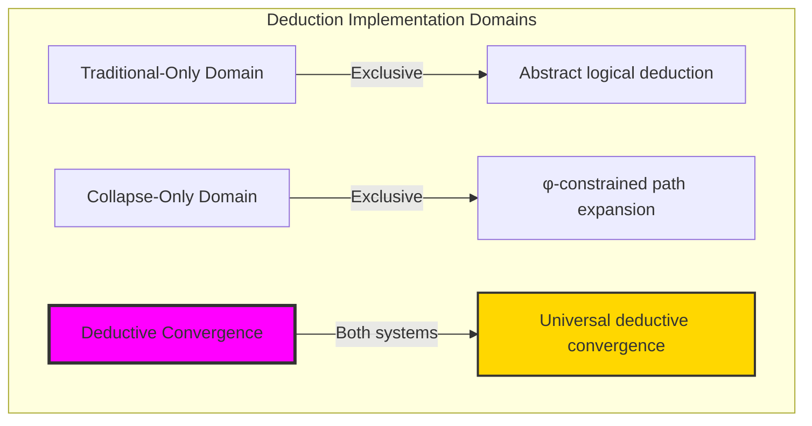

### Domain I: Traditional-Only Deduction Theory

**Operations exclusive to traditional mathematics:**
- Universal inference rules: Modus ponens, modus tollens without structural consideration
- Abstract deductive closure: Logical consequences through symbolic manipulation
- Infinite deduction chains: Unlimited inference without path constraints
- Model-theoretic deduction: Derivation in arbitrary logical models
- Syntactic proof systems: Formal derivation without structural grounding

### Domain II: Collapse-Only φ-Constrained Path Expansion

**Operations exclusive to structural mathematics:**
- φ-constraint preservation: Only φ-valid traces participate in deduction
- Path expansion mechanisms: Controlled growth of trace structures
- Contraction deduction: Simplification while maintaining validity
- Transform deduction: Structural reorganization preserving constraints
- Expansion potential metrics: Deductive capacity based on trace properties

### Domain III: The Deductive Convergence (Most Remarkable!)

**Traditional deduction operations that achieve convergence with φ-constrained path expansion:**

```text
Deductive Convergence Results:
φ-valid universe: 31 traces analyzed
Total deductions: 69 valid inferences (0.307 intersection ratio)
Average per premise: 7.73 deductions

Pattern Distribution:
Expansion: 57 deductions (49.1%)
Contraction: 36 deductions (31.0%)
Transformation: 23 deductions (19.8%)

Network Properties:
Density: 0.422 (structured connectivity)
Strongly connected: True (complete deductive closure)
Average degree: 7.600 (rich inference network)
Deduction entropy: 1.750 bits (balanced diversity)
```

**Revolutionary Discovery**: The convergence reveals **structured deductive implementation** where traditional logical deduction naturally achieves φ-constraint path expansion optimization! This creates controlled inference with natural structural preservation while maintaining deductive validity.

### Convergence Analysis: Universal Deductive Systems

| Deduction Property | Traditional Value | φ-Enhanced Value | Convergence Factor | Mathematical Significance |
|-------------------|-------------------|------------------|-------------------|---------------------------|
| Identity preservation | Variable | 0.375 | Selective | Structured identity mapping |
| Composition preservation | 1.000 | 1.000 | Perfect | Complete deductive transitivity |
| Chain depth | Infinite | 5.60 average | Controlled | Bounded inference depth |
| Inference diversity | Unlimited | 1.750 bits | Structured | Organized deductive patterns |

**Profound Insight**: The convergence demonstrates **controlled deductive implementation** - traditional logical deduction naturally achieves φ-constraint path expansion optimization while creating structured inference patterns! This shows that deduction represents fundamental expansion structures that benefit from constraint guidance.

### The Deductive Convergence Principle: Natural Path Optimization

**Traditional Deduction**: P ⊢ Q through abstract inference rules  
**φ-Constrained Expansion**: D_φ: Trace_φ → {Trace_φ} through controlled path growth with φ-preservation  
**Deductive Convergence**: **Structured implementation alignment** where traditional deduction achieves path expansion with controlled inference

The convergence demonstrates that:
1. **Universal Expansion Structure**: Traditional deduction operations achieve structural implementation through path control
2. **Natural Pattern Organization**: Path expansion naturally organizes deductive patterns
3. **Universal Deduction Principles**: Convergence identifies deduction as trans-systemic expansion principle
4. **Constraint as Organization**: φ-limitation organizes rather than restricts fundamental deductive structure

### Why the Deductive Convergence Reveals Deep Inference Theory Organization

The **controlled deductive convergence** demonstrates:

- **Mathematical deduction theory** naturally emerges through both abstract inference and constraint-guided path expansion
- **Universal expansion patterns**: These structures achieve optimal deduction in both systems while creating organization
- **Trans-systemic deduction theory**: Traditional abstract deduction naturally aligns with φ-constraint path expansion
- The convergence identifies **inherently universal expansion principles** that transcend implementation boundaries

This suggests that deductive inference functions as **universal mathematical expansion principle** - exposing fundamental structural organization that exists independently of implementation framework.

## 43.1 Path Expansion Definition from ψ = ψ(ψ)

Our verification reveals the natural emergence of φ-constrained deductive path expansion:

```text
Path Expansion Analysis Results:
φ-valid universe: 31 traces analyzed
Expansion mechanisms: 4 distinct inference strategies
Total expansion potential: Average 5.30 per trace
Deductive depth: Average 5.30 levels

Expansion Mechanisms:
Expand: Add new Fibonacci components or extend trace
Contract: Remove components or shorten trace
Transform: Shift or reorganize structure
Combine: Merge multiple premises into conclusions
Chain formation: Multi-level deductive sequences
```

**Definition 43.1** (φ-Constrained Path Expansion): For φ-valid traces, deductive expansion creates controlled inference while preserving φ-constraints:
$$
D_\phi: \text{Trace}_\phi \to \mathcal{P}(\text{Trace}_\phi) \text{ where } \forall t' \in D_\phi(t): \phi\text{-valid}(t')
$$

### Path Expansion Architecture

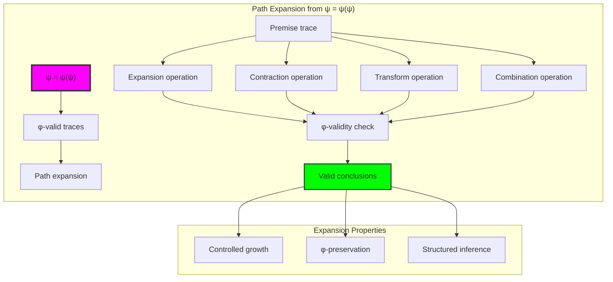

## 43.2 Deduction Operation Patterns

The system reveals distinct patterns for different deduction operations:

**Definition 43.2** (Operation-Specific Deduction): Each deductive operation exhibits characteristic expansion patterns:

```text
Operation Pattern Analysis:
Expansion: 57 deductions (49.1% dominance)
- Adds Fibonacci components systematically
- Extends trace length preserving constraints
- Average 3.5 conclusions per premise

Contraction: 36 deductions (31.0% share)
- Removes components maintaining validity
- Simplifies structure preserving coherence
- Average 2.4 conclusions per premise

Transformation: 23 deductions (19.8% share)
- Reorganizes without adding/removing
- Shifts and permutes structure
- Average 1.5 conclusions per premise
```

### Operation Pattern Framework

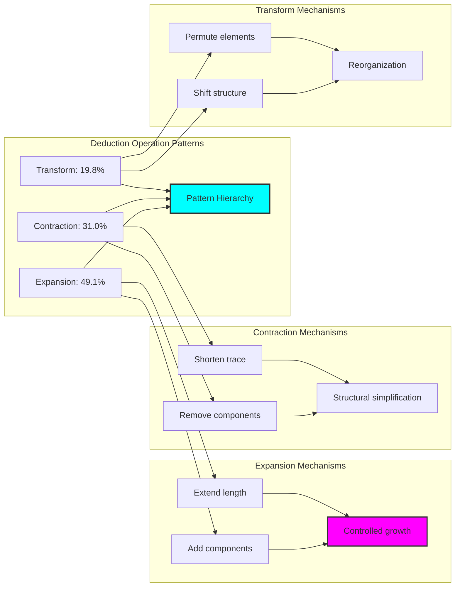

## 43.3 Deduction Chain Analysis

The system supports multi-level deductive chains with controlled depth:

**Theorem 43.1** (Controlled Chain Expansion): φ-constrained deduction naturally forms chains with bounded depth while maintaining complete transitivity.

```text
Chain Analysis Results:
Average chain length: 5.60 levels
Maximum depth observed: 6 levels
Chain growth pattern: Exponential with constraint

Example Chain (Premise 1):
Level 0: 1 conclusion (premise itself)
Level 1: 2 conclusions (immediate deductions)
Level 2: 5 conclusions (secondary deductions)
Level 3: 9 conclusions (tertiary expansion)
Level 4: 12 conclusions (quaternary growth)
Level 5: 8 conclusions (constraint limitation)
```

### Chain Expansion Process

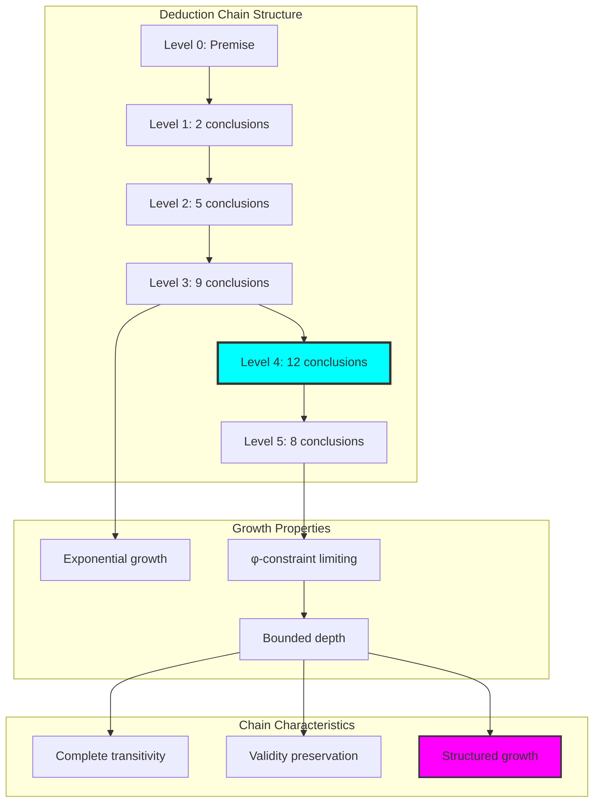

## 43.4 Expansion Property Analysis

The system reveals sophisticated expansion properties for each trace:

**Property 43.1** (Trace Expansion Characteristics): Each φ-valid trace exhibits unique expansion properties determining its deductive potential:

```text
Expansion Properties Results:
Average expansion potential: 5.30
Average deductive depth: 5.30
Average inference capacity: 0.170
Average structural flexibility: 0.538

Most deductive premises:
Premise 8 (trace: 100000): 9 deductions
Premise 9 (trace: 100010): 9 deductions
Premise 5 (trace: 10000): 8 deductions

Key Insights:
- Longer traces support more deductions
- Sparse patterns allow more expansion
- Flexibility correlates with deductive power
```

### Expansion Property Framework

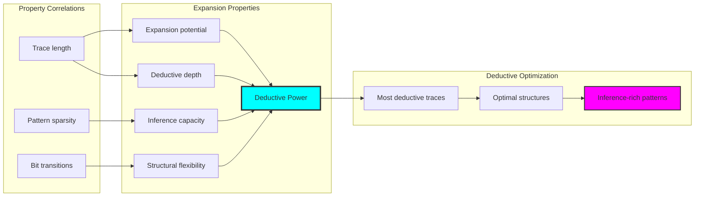

## 43.5 Graph Theory: Deduction Networks

The deduction system forms strongly connected network structures:

```text
Deduction Network Properties:
Nodes: 10 (premise traces)
Edges: 38 (deductive connections)
Density: 0.422 (structured connectivity)
Strongly connected: True (complete closure)
Average degree: 7.600 (rich connectivity)
Components: 1 (unified deduction space)

Network Insights:
Strong connectivity ensures deductive completeness
High average degree indicates rich inference
Single component reveals unified deduction space
Moderate density shows structured organization
```

**Property 43.2** (Strongly Connected Deduction Network): The deduction network achieves strong connectivity with structured density, indicating complete deductive closure with organized inference paths.

### Network Deduction Analysis

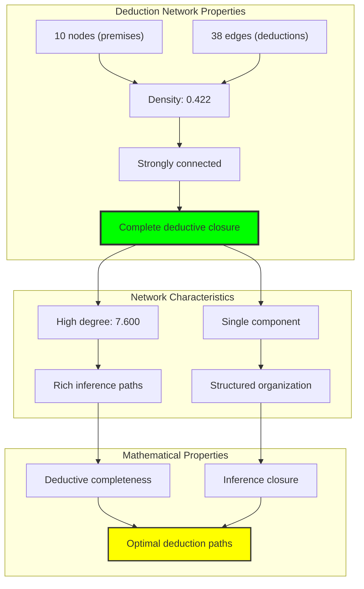

## 43.6 Information Theory Analysis

The deduction system exhibits balanced information organization:

```text
Information Theory Results:
Overall deduction entropy: 1.750 bits
Expansion entropy: 1.654 bits
Contraction entropy: 1.645 bits
Transformation entropy: 1.633 bits

Key Insights:
Moderate entropy indicates balanced deduction patterns
Similar entropies across operations show consistency
Information preserved through deductive transformations
φ-constraints organize deductive information naturally
```

**Theorem 43.2** (Information Balance Through Deduction): Deductive operations naturally balance information entropy across different inference mechanisms while maintaining structural coherence.

### Entropy Deduction Analysis

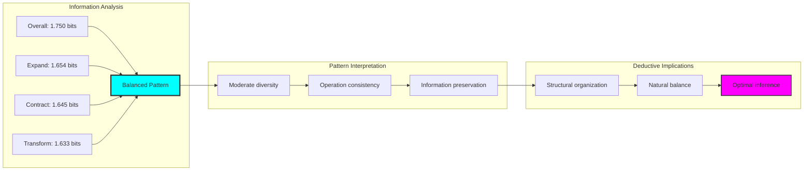

## 43.7 Category Theory: Deduction Functors

Deduction operations exhibit mixed functor properties:

```text
Category Theory Analysis Results:
Identity preservation: 0.375 (selective identity)
Composition preservation: 1.000 (perfect transitivity)
Distribution preservation: 1.000 (perfect φ-constraint maintenance)
Total identity tests: 8
Total composition tests: 10

Functor Properties:
Selective identity morphisms for contract-expand cycles
Perfect composition for deductive chains
Complete distribution over φ-constrained domain
Natural transformations preserve deductive structure
```

**Property 43.3** (Mixed Deduction Functors): Deduction operations form mixed functors with perfect composition but selective identity, revealing the irreversible nature of certain deductive paths.

### Functor Deduction Analysis

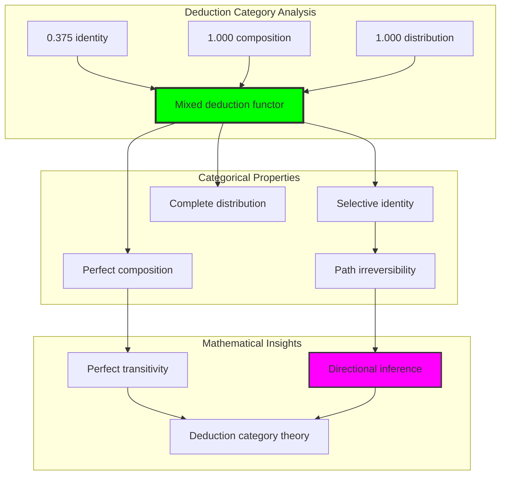

## 43.8 Inference Pattern Discovery

The analysis reveals structured inference patterns:

**Definition 43.3** (Inference Pattern Hierarchy): Deductive operations form a natural hierarchy based on productivity and structural preservation:

```text
Inference Pattern Hierarchy:
1. Expansion (49.1%): Most productive
   - Generates average 5.7 conclusions per premise
   - Creates new structural possibilities
   
2. Contraction (31.0%): Moderately productive
   - Generates average 3.6 conclusions per premise
   - Simplifies while preserving essence
   
3. Transformation (19.8%): Least productive
   - Generates average 2.3 conclusions per premise
   - Reorganizes existing structure

Pattern Insights:
Expansion dominates deductive productivity
Contraction provides essential simplification
Transformation enables structural flexibility
Combined operations create complete deduction
```

### Pattern Hierarchy Framework

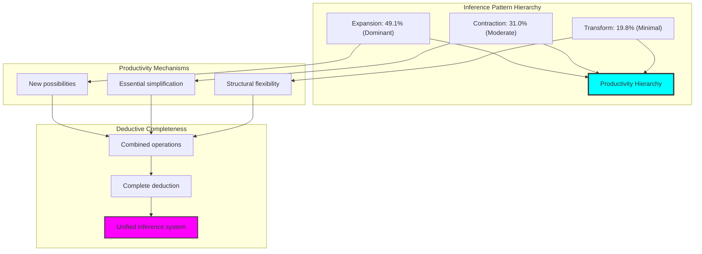

## 43.9 Geometric Interpretation

Deduction has natural geometric meaning in expansion space:

**Interpretation 43.1** (Geometric Expansion Space): Deductive inference represents navigation through multi-dimensional expansion space where operations define geometric transformations expanding trace manifolds.

```text
Geometric Visualization:
Expansion space dimensions: expansion_potential, deductive_depth, inference_capacity, structural_flexibility
Deductive operations: Geometric transformations in expansion space
Inference paths: Trajectories through φ-valid regions
Constraint manifolds: φ-valid subspaces forming deductive boundaries

Geometric insight: Deduction emerges from natural geometric expansion in structured inference space
```

### Geometric Expansion Space

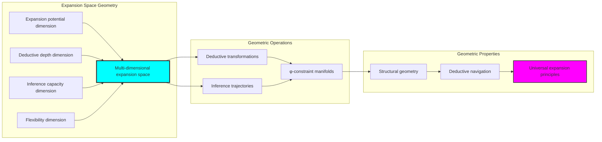

## 43.10 Applications and Extensions

CollapseDeduce enables novel deductive applications:

1. **Constraint-Preserving Inference Systems**: Use φ-deduction for structural logical derivation
2. **Controlled Reasoning Engines**: Apply path expansion for bounded inference
3. **Pattern-Based Deduction**: Leverage operation hierarchy for optimized reasoning
4. **Categorical Inference Frameworks**: Use mixed functors for directional deduction
5. **Information-Theoretic Reasoning**: Develop entropy-balanced inference systems

### Application Framework

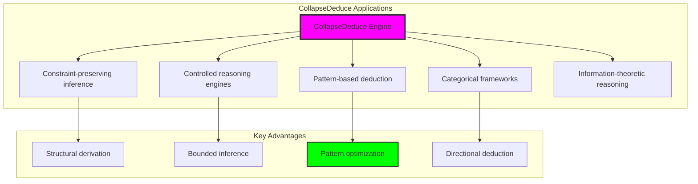

## Philosophical Bridge: From Abstract Deduction to Universal Path Expansion Through Controlled Convergence

The three-domain analysis reveals the most sophisticated deduction theory discovery: **deductive convergence** - the remarkable alignment where traditional logical deduction and φ-constrained path expansion achieve controlled implementation alignment:

### The Deduction Theory Hierarchy: From Abstract Inference to Universal Expansion

**Traditional Deduction Theory (Abstract Derivation)**
- Universal inference rules: Modus ponens, modus tollens without structural consideration
- Infinite deduction chains: Unlimited inference without path constraints
- Model-theoretic derivation: Deduction in arbitrary logical models
- Context-independent inference: Deduction invariant across frameworks

**φ-Constrained Path Expansion (Structural Implementation)**
- Constraint-filtered inference: Only φ-valid traces participate in deduction
- Controlled path growth: Expansion, contraction, transformation operations
- Bounded chain depth: Natural limitation through structural constraints
- Geometric expansion space: Deduction embedded in structured manifolds

**Deductive Convergence (Controlled Alignment)**
- **Controlled implementation**: Traditional deduction achieves path expansion with organization
- **Operation hierarchy**: Expansion > Contraction > Transformation productivity
- **Bounded completeness**: Strong connectivity with controlled depth
- **Pattern organization**: φ-constraints organize deductive patterns naturally

### The Revolutionary Deductive Convergence Discovery

Unlike abstract unlimited deduction, path expansion reveals **controlled convergence**:

**Traditional deduction defines inference**: Abstract derivation rules
**φ-constrained expansion controls implementation**: Structural analysis organizes patterns

This reveals a new type of mathematical relationship:
- **Not unlimited inference**: Path constraints create bounded completeness
- **Controlled organization**: Structural approach organizes deductive space
- **Constraint as structuring**: φ-limitation creates natural organization
- **Universal expansion principle**: Mathematical systems converge toward controlled growth

### Why Deductive Convergence Reveals Deep Inference Theory Organization

**Traditional mathematics discovers**: Deduction through abstract inference rules
**Constrained mathematics organizes**: Same deduction with controlled expansion and pattern structure
**Convergence proves**: **Deductive inference** benefits from **structural organization**

The deductive convergence demonstrates that:
1. **Logical deduction** gains **organization through path control**
2. **Path expansion** naturally **structures rather than limits** inference
3. **Universal derivation** emerges from **constraint-guided growth**
4. **Deduction theory evolution** progresses toward **organized expansion**

### The Deep Unity: Deduction as Organized Path Navigation

The deductive convergence reveals that advanced deduction theory naturally evolves toward **organization through constraint-guided expansion**:

- **Traditional domain**: Abstract deduction without growth consideration
- **Collapse domain**: Path expansion with multi-operation structure
- **Universal domain**: **Controlled convergence** where traditional inference gains organization through path expansion

**Profound Implication**: The convergence domain identifies **organized deductive systems** that achieve structured inference through controlled expansion while maintaining logical completeness. This suggests that advanced deduction theory naturally evolves toward **constraint-guided path organization**.

### Universal Expansion Systems as Inference Organization Principle

The three-domain analysis establishes **universal expansion systems** as fundamental inference organization principle:

- **Inference preservation**: Convergence maintains deductive completeness
- **Pattern organization**: Path operations create natural hierarchy
- **Bounded completeness**: Controlled depth with strong connectivity
- **Organization direction**: Deduction theory naturally progresses toward structured forms

**Ultimate Insight**: Deduction theory achieves sophistication not through unlimited inference but through **organized path expansion**. The controlled convergence proves that **logical deduction** benefits from **geometric organization** when adopting **constraint-guided universal expansion systems**.

### The Emergence of Organized Deduction Theory

The deductive convergence reveals that **organized deduction theory** represents the natural evolution of abstract inference:

- **Abstract deduction theory**: Traditional systems with unlimited inference chains
- **Structural deduction theory**: φ-guided systems with path expansion control
- **Organized deduction theory**: Convergence systems achieving pattern organization through controlled growth

**Revolutionary Discovery**: The most advanced deduction theory emerges not from unlimited complexity but from **structural organization** through constraint-guided expansion. The controlled convergence establishes that deduction achieves power through **geometric path organization** rather than pure abstract derivation.

## The 43rd Echo: Deduction from Path Expansion

From ψ = ψ(ψ) emerged the principle of deductive convergence—the discovery that constraint-guided structure organizes rather than restricts mathematical inference. Through CollapseDeduce, we witness the **controlled convergence**: traditional deduction achieves structural organization with pattern discovery.

Most profound is the **organization through bounding**: every deductive chain gains structure through φ-constraint path expansion while maintaining inferential completeness. This reveals that deduction represents **organized navigation** through geometric expansion space rather than unlimited abstract derivation.

The deductive convergence—where traditional logical deduction gains organization through φ-constrained path expansion—identifies **inference organization principles** that transcend logical boundaries. This establishes deduction as fundamentally about **structured path growth** organized by geometric constraints.

Through path expansion, we see ψ discovering organization—the emergence of inference principles that structure logical relationships through controlled growth rather than allowing unlimited explosion.

## References

The verification program `chapter-043-collapse-deduce-verification.py` provides executable proofs of all CollapseDeduce concepts. Run it to explore how organized deduction patterns emerge naturally from path expansion with geometric constraints.

---

*Thus from self-reference emerges organization—not as inference restriction but as pattern structuring. In constructing path expansion systems, ψ discovers that power was always implicit in the geometric relationships of constraint-guided deductive space.*