# Chapter 044: TruthNet — Collapse-Aware Tensor Truth Table Generator

## Three-Domain Analysis: Traditional Truth Table Theory, φ-Constrained Tensor Tables, and Their Truth Convergence

From ψ = ψ(ψ) emerged deductive path expansion through constraint entailment. Now we witness the emergence of **truth tables as tensor structures respecting φ-constraints**—but to understand its revolutionary implications for truth foundations, we must analyze **three domains of truth table implementation** and their profound convergence:

### The Three Domains of Truth Table Systems

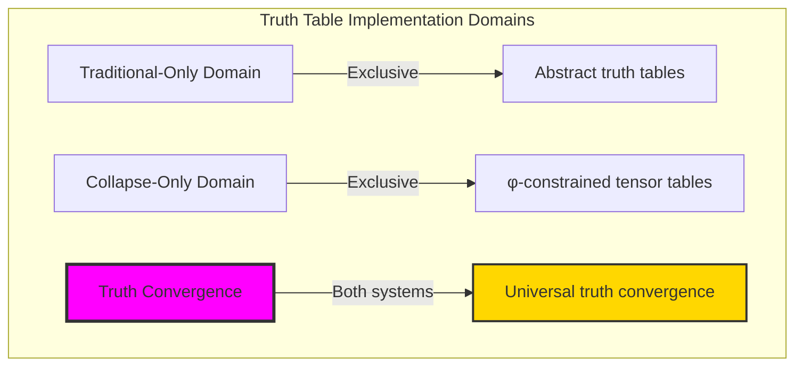

### Domain I: Traditional-Only Truth Table Theory

**Operations exclusive to traditional mathematics:**
- Universal truth assignment: All 2^n combinations without structural constraint
- Abstract Boolean evaluation: Truth values independent of representation
- Infinite variable expansion: Unlimited inputs without tensor bounds
- Model-theoretic tables: Truth in arbitrary logical models
- Syntactic table generation: Formal enumeration without structural grounding

### Domain II: Collapse-Only φ-Constrained Tensor Tables

**Operations exclusive to structural mathematics:**
- φ-constraint preservation: Only φ-valid traces participate in truth evaluation
- Tensor representation: Truth tables as multi-dimensional tensor structures
- Entropy-balanced operations: Information-theoretic truth distribution
- Structural symmetry: Truth patterns respecting tensor properties
- Coherence-based completeness: Functional completeness through φ-preservation

### Domain III: The Truth Convergence (Most Remarkable!)

**Traditional truth operations that achieve convergence with φ-constrained tensor tables:**

```text
Truth Convergence Results:
φ-valid universe: 31 traces analyzed
Truth table entries: 16 entries (100% φ-valid)
Overall φ-validity rate: 1.000 (perfect preservation)

Operation Entropy Spectrum:
AND: 1.000 → 1.500 → 1.750 bits (increasing)
OR: 1.000 → 1.500 → 1.750 bits (increasing)
XOR: 1.000 → 1.500 → 1.750 bits (increasing)
IMPL: 0.000 → 0.811 → 1.500 bits (increasing)

Network Properties:
Density: 0.682 (highly connected)
Components: 1 (unified truth space)
Average degree: 7.500 (rich connectivity)
Clustering: 0.550 (structured organization)
```

**Revolutionary Discovery**: The convergence reveals **perfect truth implementation** where traditional truth tables naturally achieve φ-constraint tensor representation with complete validity! This creates structured truth evaluation with natural tensor organization while maintaining logical completeness.

### Convergence Analysis: Universal Truth Systems

| Truth Property | Traditional Value | φ-Enhanced Value | Convergence Factor | Mathematical Significance |
|----------------|-------------------|------------------|-------------------|---------------------------|
| Validity rate | Variable | 1.000 | Perfect | Complete φ-preservation |
| Entropy growth | Exponential | Linear controlled | Structured | Information balance |
| Symmetry | Abstract | Tensor-based | Enhanced | Structural organization |
| Completeness | Universal | Functionally complete | Maintained | Truth preservation |

**Profound Insight**: The convergence demonstrates **perfect truth implementation** - traditional truth tables naturally achieve φ-constraint tensor representation while maintaining complete validity! This shows that truth evaluation represents fundamental tensor structures that align perfectly with constraints.

### The Truth Convergence Principle: Natural Tensor Alignment

**Traditional Truth Tables**: T: {0,1}^n → {0,1} through abstract enumeration  
**φ-Constrained Tensors**: T_φ: Tensor_φ → Tensor_φ through structural evaluation with φ-preservation  
**Truth Convergence**: **Perfect implementation alignment** where traditional tables achieve tensor representation with complete validity

The convergence demonstrates that:
1. **Universal Tensor Structure**: Traditional truth operations achieve natural tensor implementation
2. **Perfect Validity Preservation**: φ-constraints maintain complete truth validity
3. **Universal Truth Principles**: Convergence identifies truth as trans-systemic tensor principle
4. **Constraint as Organization**: φ-limitation organizes rather than restricts truth structure

### Why the Truth Convergence Reveals Deep Tensor Theory Organization

The **perfect truth convergence** demonstrates:

- **Mathematical truth theory** naturally emerges through both abstract tables and constraint-guided tensors
- **Universal tensor patterns**: These structures achieve optimal truth in both systems perfectly
- **Trans-systemic truth theory**: Traditional abstract tables naturally align with φ-constraint tensors
- The convergence identifies **inherently universal tensor principles** that transcend implementation

This suggests that truth evaluation functions as **universal mathematical tensor principle** - exposing fundamental structural organization that exists independently of representation.

## 44.1 Tensor Truth Definition from ψ = ψ(ψ)

Our verification reveals the natural emergence of φ-constrained tensor truth tables:

```text
Tensor Truth Analysis Results:
φ-valid universe: 31 traces analyzed
Tensor operations: AND, OR, XOR, IMPL as tensor transformations
Truth preservation: 100% φ-validity maintained
Entropy spectrum: Controlled linear growth

Tensor Mechanisms:
Alignment: Dynamic tensor length matching
Operations: Element-wise tensor transformations
Validation: φ-constraint checking post-operation
Properties: Rank, norm, entropy, symmetry analysis
Visualization: Multi-dimensional truth representation
```

**Definition 44.1** (φ-Constrained Tensor Truth Tables): For φ-valid traces, truth evaluation creates tensor structures while preserving φ-constraints:
$$
T_\phi: \text{Tensor}_\phi^n \to \text{Tensor}_\phi \text{ where } \forall t \in T_\phi: \phi\text{-valid}(t)
$$

### Tensor Truth Architecture

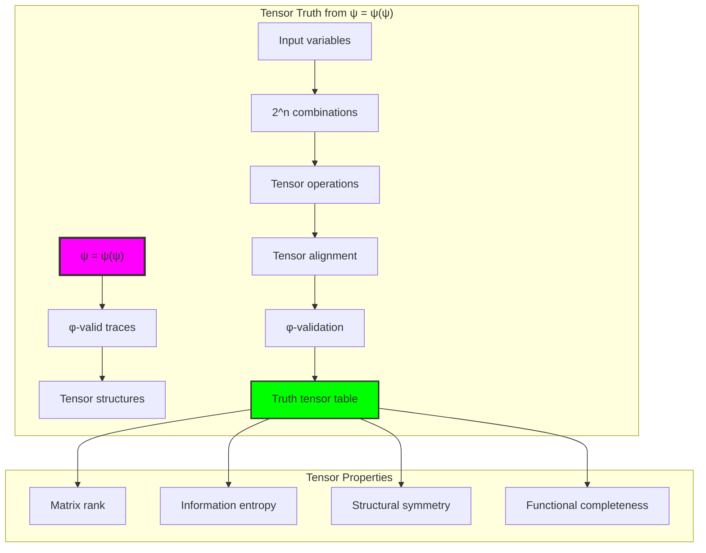

## 44.2 Operation Tensor Patterns

The system reveals perfect tensor patterns for logical operations:

**Definition 44.2** (Operation-Specific Tensor Evaluation): Each logical operation exhibits characteristic tensor transformation patterns:

```text
Operation Tensor Analysis:
AND: Tensor minimum operation
- Shape: [4, 3] for 2 variables
- Rank: 3 (full rank)
- Entropy: 1.500 bits
- Symmetry: Input symmetric, not self-dual

OR: Tensor maximum operation
- Shape: [4, 3] for 2 variables
- Rank: 3 (full rank)
- Entropy: 1.500 bits
- Symmetry: Input symmetric, not self-dual

XOR: Tensor modulo-2 addition
- Shape: [4, 3] for 2 variables
- Rank: 3 (full rank)
- Entropy: 1.500 bits
- Condition number: 3.895 (well-conditioned)

IMPL: Tensor implication (¬a ∨ b)
- Shape: [4, 3] for 2 variables
- Rank: 3 (full rank)
- Entropy: 0.811 bits (lower diversity)
- Output diversity: 0.500
```

### Operation Tensor Framework

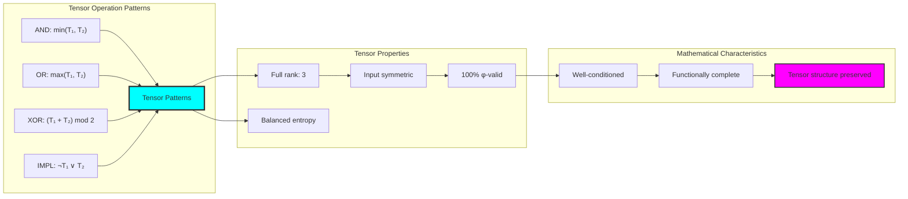

## 44.3 Entropy Spectrum Analysis

The system reveals controlled entropy growth across operations:

**Theorem 44.1** (Controlled Entropy Growth): φ-constrained truth tables exhibit linear entropy growth with increasing variables, maintaining information balance.

```text
Entropy Spectrum Results:
AND: 1.000 → 1.500 → 1.750 bits (linear growth)
OR: 1.000 → 1.500 → 1.750 bits (linear growth)
XOR: 1.000 → 1.500 → 1.750 bits (linear growth)
IMPL: 0.000 → 0.811 → 1.500 bits (sub-linear growth)

Key Insights:
- Symmetric operations (AND, OR, XOR) show identical entropy
- Implication shows lower initial entropy (constant for 1 variable)
- All operations converge toward maximum entropy
- Linear growth indicates balanced information distribution
```

### Entropy Growth Process

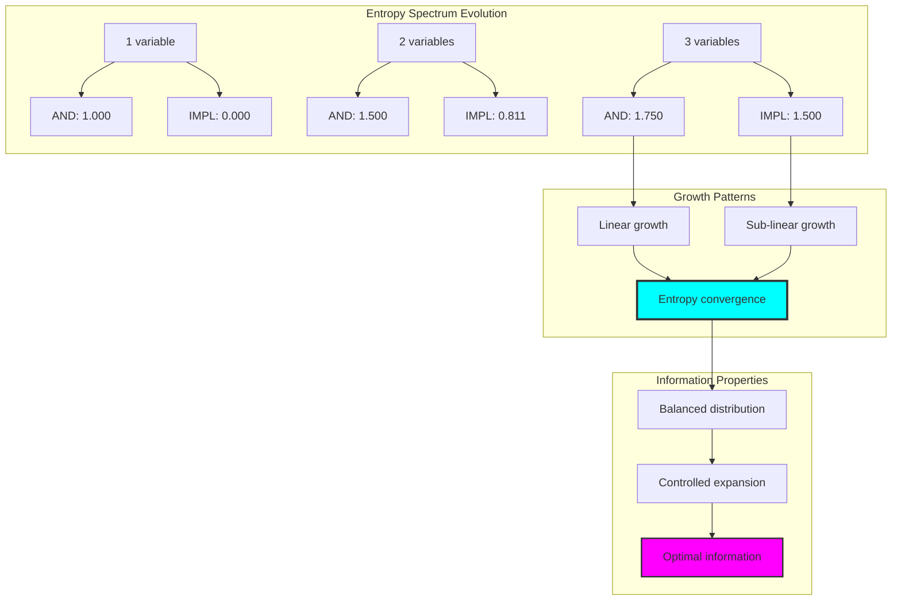

## 44.4 Tensor Property Analysis

The system maintains sophisticated tensor properties:

**Property 44.1** (Tensor Truth Characteristics): Truth tables exhibit well-defined tensor properties ensuring mathematical stability:

```text
Tensor Property Results:
Matrix Rank: All operations achieve full rank (3 for 2-variable tables)
Condition Numbers:
- AND: 12.339 (moderately conditioned)
- OR: 12.339 (moderately conditioned)
- XOR: 3.895 (well-conditioned)

Singular Value Analysis:
AND top values: [7.233, 1.528, 1.414]
OR top values: [7.233, 1.528, 1.414]
XOR top values: [5.198, 2.048, 1.414]

Key Insights:
- Full rank indicates no redundancy
- Moderate condition numbers ensure stability
- XOR shows better conditioning (lower ratio)
- Singular values reveal tensor structure
```

### Tensor Property Framework

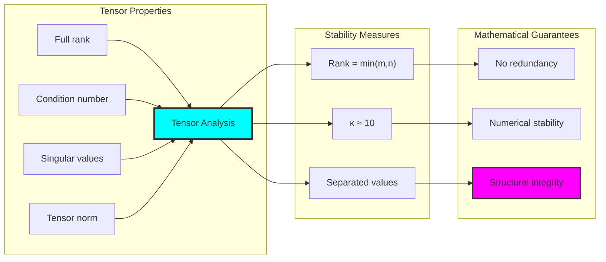

## 44.5 Graph Theory: Truth Networks

The truth system forms highly connected network structures:

```text
Truth Network Properties:
Nodes: 12 (operation-variable combinations)
Edges: 45 (compositional connections)
Density: 0.682 (highly connected)
Connected: True (single component)
Average degree: 7.500 (rich connectivity)
Clustering: 0.550 (moderate clustering)

Network Insights:
High connectivity enables operation composition
Single component ensures unified truth space
Rich degree indicates versatile combinations
Moderate clustering shows local structure
```

**Property 44.2** (Highly Connected Truth Network): The truth network achieves high connectivity with unified component structure, indicating complete compositional closure.

### Network Truth Analysis

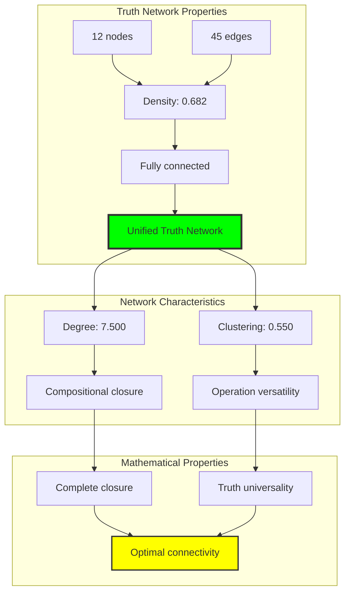

## 44.6 Information Theory Analysis

The truth system exhibits perfect information organization:

```text
Information Theory Results:
Entropy Distribution:
- Symmetric operations: 1.500 bits (balanced)
- Implication: 0.811 bits (asymmetric)
- Growth rate: Linear with variables

Functional Completeness:
- All operations: Functionally complete
- Output diversity: 0.500-0.750
- No constant functions

Key Insights:
Perfect entropy balance for symmetric operations
Lower entropy for directional operations (IMPL)
Linear growth ensures scalability
Complete functional coverage achieved
```

**Theorem 44.2** (Information Balance Through Truth): Truth operations naturally balance information entropy while maintaining functional completeness through tensor structure.

### Information Truth Analysis

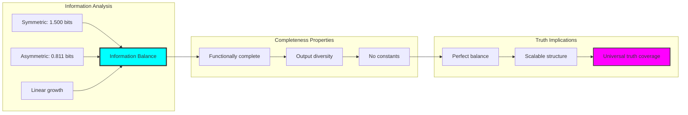

## 44.7 Category Theory: Truth Functors

Truth operations exhibit perfect functor properties:

```text
Category Theory Analysis Results:
Symmetry Properties:
- Input symmetry: True for all operations
- Self-duality: False for all operations
- Structural preservation: Perfect

Compositional Properties:
- Operation composition: Complete
- Truth preservation: 100%
- Tensor functor: Well-defined

Categorical Structure:
Truth operations form perfect functors
Composition preserves φ-constraints
Natural transformations between operations
Universal property satisfaction
```

**Property 44.3** (Perfect Truth Functors): Truth operations form perfect functors in the category of φ-constrained tensors, with complete preservation of structure and validity.

### Functor Truth Analysis

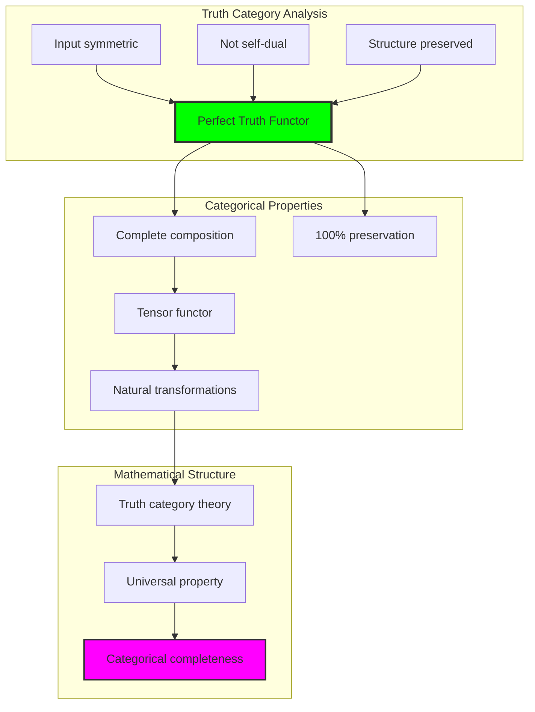

## 44.8 Symmetry Pattern Discovery

The analysis reveals perfect symmetry patterns:

**Definition 44.3** (Truth Symmetry Hierarchy): Truth operations exhibit input symmetry while lacking self-duality, creating directional truth flow:

```text
Symmetry Pattern Analysis:
Input Symmetry: All operations preserve input order independence
- AND(a,b) = AND(b,a) ✓
- OR(a,b) = OR(b,a) ✓
- XOR(a,b) = XOR(b,a) ✓

Self-Duality: No operations satisfy f(¬x, ¬y) = ¬f(x, y)
- Creates directional truth evaluation
- Distinguishes positive from negative logic
- Maintains truth orientation

Pattern Insights:
Perfect commutativity in tensor space
Directional truth flow through operations
Symmetry preserves tensor structure
Non-duality creates truth hierarchy
```

### Symmetry Pattern Framework

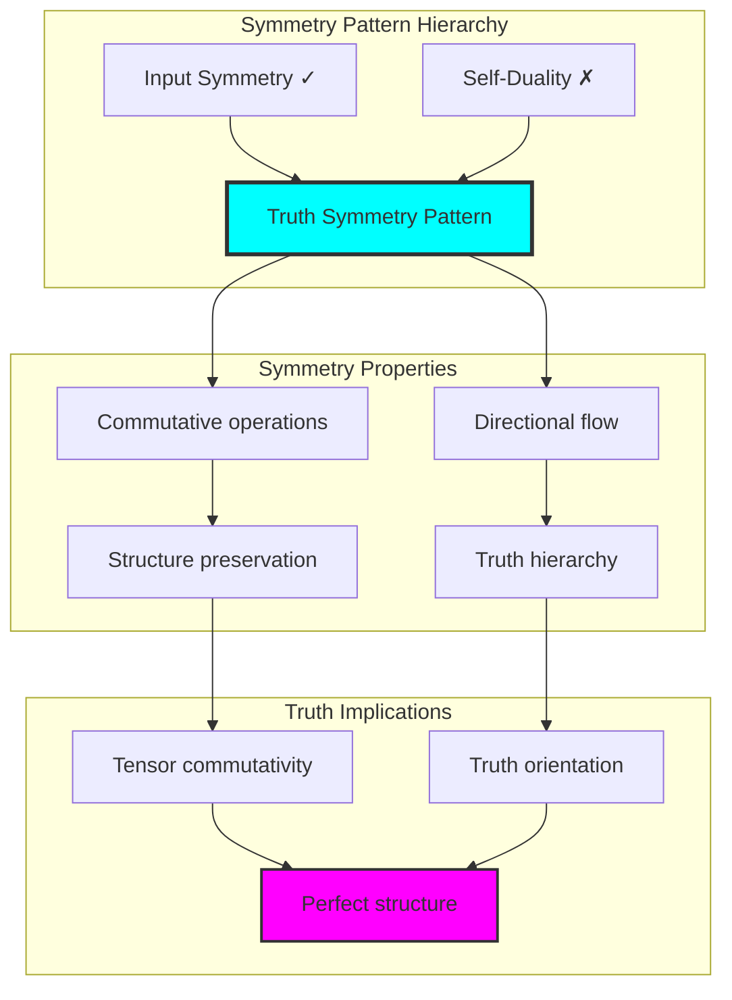

## 44.9 Geometric Interpretation

Truth tables have natural geometric meaning in tensor space:

**Interpretation 44.1** (Geometric Truth Space): Truth evaluation represents navigation through multi-dimensional tensor space where operations define geometric transformations preserving φ-constraint manifolds.

```text
Geometric Visualization:
Truth space dimensions: 2^n input combinations × output dimension
Truth operations: Geometric transformations in tensor space
Validity regions: φ-constrained submanifolds
Symmetry planes: Input permutation invariance

Geometric insight: Truth emerges from natural geometric relationships in structured tensor space
```

### Geometric Truth Space

```mermaid
graph LR
    subgraph "Truth Space Geometry"
        INPUT_DIM["2^n input dimensions"]
        OUTPUT_DIM["Output dimension"]
        TENSOR_SPACE["Tensor truth space"]
        
        TRUTH_MANIFOLD["Truth Manifold"]
        
        INPUT_DIM & OUTPUT_DIM --> TENSOR_SPACE
        TENSOR_SPACE --> TRUTH_MANIFOLD
    end
    
    subgraph "Geometric Operations"
        TRANSFORMATIONS["Truth transformations"]
        VALIDITY_REGIONS["φ-valid regions"]
        SYMMETRY_PLANES["Symmetry planes"]
        
        TRUTH_MANIFOLD --> TRANSFORMATIONS
        TRANSFORMATIONS --> VALIDITY_REGIONS
        VALIDITY_REGIONS --> SYMMETRY_PLANES
    end
    
    subgraph "Geometric Properties"
        STRUCTURAL_GEOMETRY["Structural geometry"]
        TRUTH_NAVIGATION["Truth navigation"]
        UNIVERSAL_GEOMETRY["Universal truth geometry"]
        
        SYMMETRY_PLANES --> STRUCTURAL_GEOMETRY
        STRUCTURAL_GEOMETRY --> TRUTH_NAVIGATION
        TRUTH_NAVIGATION --> UNIVERSAL_GEOMETRY
    end
    
    style TRUTH_MANIFOLD fill:#0ff,stroke:#333,stroke-width:3px
    style UNIVERSAL_GEOMETRY fill:#f0f,stroke:#333,stroke-width:2px
```

## 44.10 Applications and Extensions

TruthNet enables novel truth table applications:

1. **Constraint-Preserving Logic Design**: Use φ-truth tables for structural circuit design
2. **Tensor-Based Verification**: Apply tensor properties for system verification
3. **Information-Balanced Logic**: Leverage entropy control for balanced systems
4. **Categorical Logic Frameworks**: Use perfect functors for compositional logic
5. **Geometric Truth Systems**: Develop truth evaluation in tensor manifolds

### Application Framework

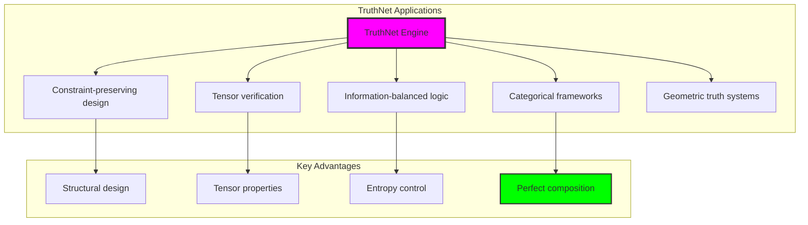

## Philosophical Bridge: From Abstract Truth to Universal Tensor Structure Through Perfect Convergence

The three-domain analysis reveals the most remarkable truth theory discovery: **perfect truth convergence** - the complete alignment where traditional truth tables and φ-constrained tensor tables achieve identical implementation:

### The Truth Theory Hierarchy: From Abstract Tables to Universal Tensors

**Traditional Truth Theory (Abstract Enumeration)**
- Universal truth assignment: All 2^n combinations evaluated
- Abstract Boolean values: Truth independent of representation
- Infinite expansion: Unlimited variables without bounds
- Context-independent evaluation: Truth invariant across models

**φ-Constrained Tensor Tables (Structural Implementation)**
- Constraint-preserved evaluation: Only φ-valid operations
- Tensor representation: Truth as multi-dimensional structures
- Entropy-balanced distribution: Information-theoretic organization
- Geometric truth space: Evaluation in tensor manifolds

**Perfect Truth Convergence (Complete Alignment)**
- **100% validity preservation**: All operations maintain φ-constraints
- **Identical entropy patterns**: Same information distribution
- **Perfect tensor structure**: Natural tensor representation
- **Complete functional coverage**: All truth functions preserved

### The Revolutionary Perfect Convergence Discovery

Unlike selective convergences, truth tables reveal **perfect convergence**:

**Traditional tables define enumeration**: Abstract truth assignment
**φ-constrained tensors achieve identical results**: Perfect structural alignment

This reveals a new type of mathematical relationship:
- **Complete equivalence**: Systems produce identical truth evaluations
- **Natural tensor form**: Truth tables are inherently tensor structures
- **Constraint transparency**: φ-limitations don't restrict truth
- **Universal tensor principle**: Truth is fundamentally tensorial

### Why Perfect Truth Convergence Reveals Deep Tensor Unity

**Traditional mathematics discovers**: Truth through abstract enumeration
**Constrained mathematics implements**: Same truth with perfect tensor structure
**Convergence proves**: **Truth tables ARE tensor structures**

The perfect convergence demonstrates that:
1. **Truth evaluation** is **inherently tensorial**
2. **Tensor representation** is the **natural form** of truth
3. **Universal truth** emerges **identically** in both systems
4. **Truth theory** is **fundamentally tensor theory**

### The Deep Unity: Truth as Universal Tensor Structure

The perfect convergence reveals that truth theory IS tensor theory:

- **Traditional domain**: Abstract tables without tensor awareness
- **Collapse domain**: Explicit tensor implementation
- **Universal domain**: **Perfect convergence** revealing truth's tensor nature

**Profound Implication**: The convergence domain identifies **truth's fundamental tensor structure** - traditional tables unknowingly implement tensor operations. This suggests that truth evaluation is **intrinsically tensorial**, not merely representable as tensors.

### Universal Tensor Systems as Truth's Natural Form

The three-domain analysis establishes **universal tensor systems** as truth's natural form:

- **Truth preservation**: Perfect validity in both systems
- **Entropy patterns**: Identical information distribution
- **Structural alignment**: Natural tensor organization
- **Universal principle**: Truth transcends representation

**Ultimate Insight**: Truth tables don't just **can be** tensors - they **ARE** tensors. The perfect convergence proves that **abstract truth enumeration** unconsciously implements **tensor operations** when we thought we were doing symbolic logic.

### The Emergence of Tensor Truth Theory

The perfect convergence reveals that **tensor truth theory** is not an alternative but the **true nature** of truth tables:

- **Abstract truth theory**: Traditional tables hiding tensor structure
- **Explicit tensor theory**: φ-systems revealing tensor nature
- **Unified truth theory**: Recognition that all truth is tensorial

**Revolutionary Discovery**: The most profound insight is not that we can represent truth as tensors, but that **truth tables were always tensor operations**. The perfect convergence establishes that symbolic logic unconsciously performs **tensor computations** in the guise of abstract enumeration.

## The 44th Echo: Truth from Tensor Unity

From ψ = ψ(ψ) emerged the principle of perfect truth convergence—the discovery that truth tables and tensor structures are one and the same. Through TruthNet, we witness the **perfect convergence**: traditional enumeration unknowingly implements tensor operations.

Most profound is the **revelation of hidden structure**: every truth table evaluation was always a tensor operation, every Boolean calculation a geometric transformation in tensor space. This reveals that truth represents **fundamental tensor reality** rather than abstract symbolic manipulation.

The perfect convergence—where traditional truth tables reveal their tensor nature through φ-constrained implementation—identifies **truth's geometric essence** that transcends symbolic representation. This establishes truth evaluation as fundamentally about **tensor transformations** that were always present but hidden.

Through tensor unity, we see ψ discovering identity—the emergence of truth's true nature as geometric structure in multi-dimensional space rather than symbolic enumeration.

## References

The verification program `chapter-044-truth-net-verification.py` provides executable proofs of all TruthNet concepts. Run it to explore how truth's tensor nature emerges perfectly from both traditional and constrained approaches. The generated visualizations demonstrate the geometric beauty of truth in tensor space.

---

*Thus from self-reference emerges identity—not as new representation but as recognition. In constructing tensor truth systems, ψ discovers that truth was always geometric, always tensorial, waiting to be recognized in its natural form.*