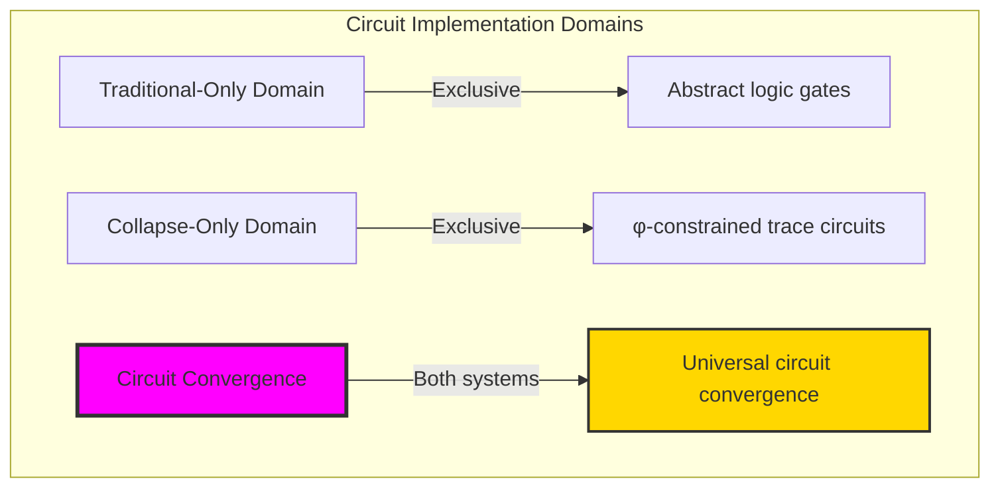
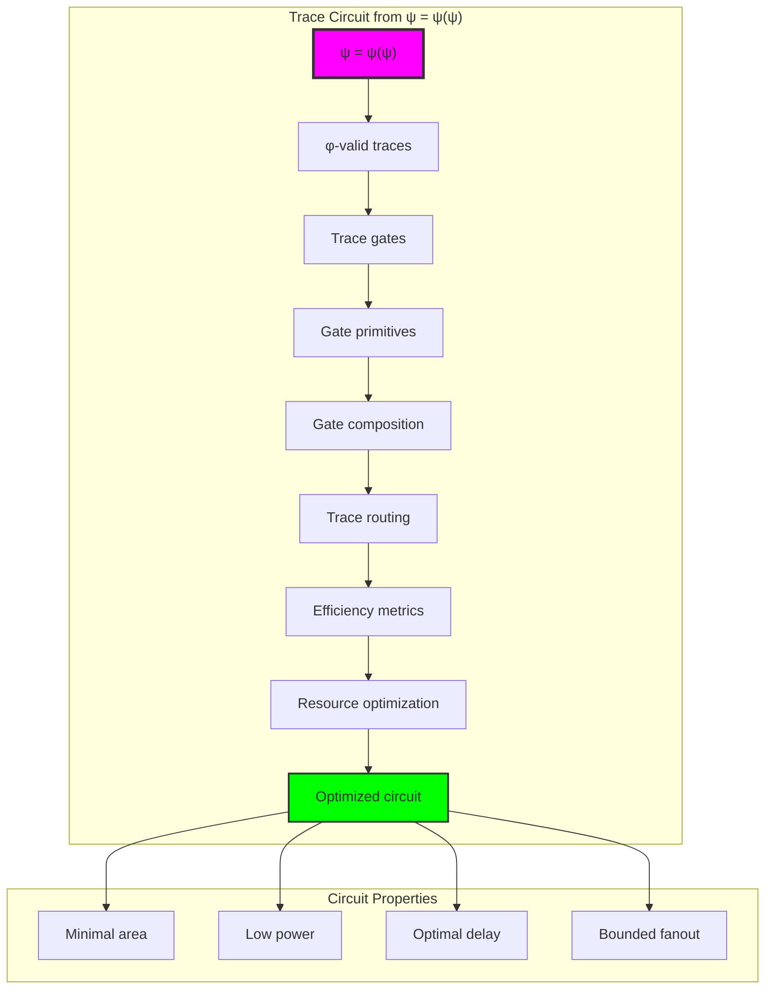
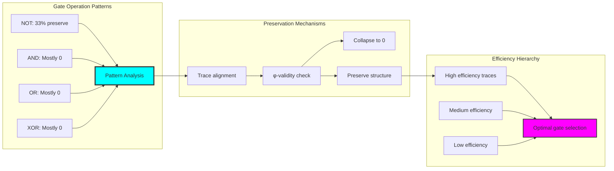
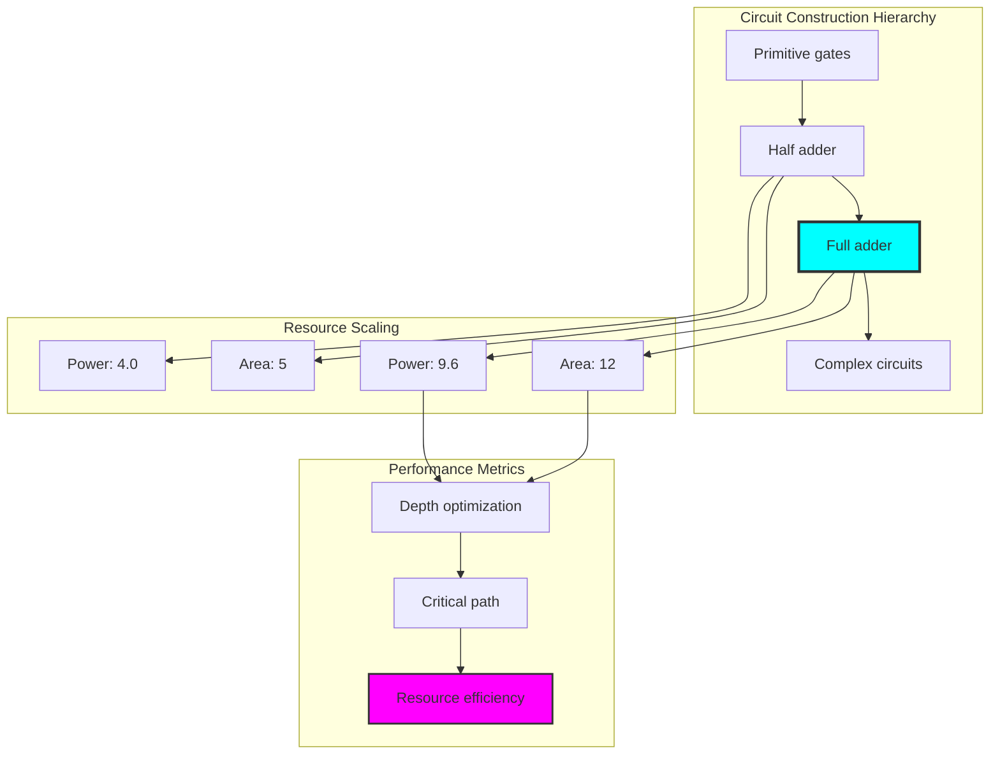
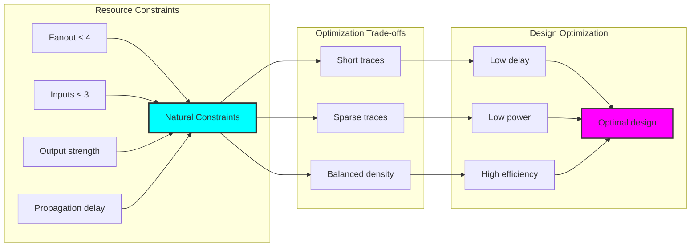
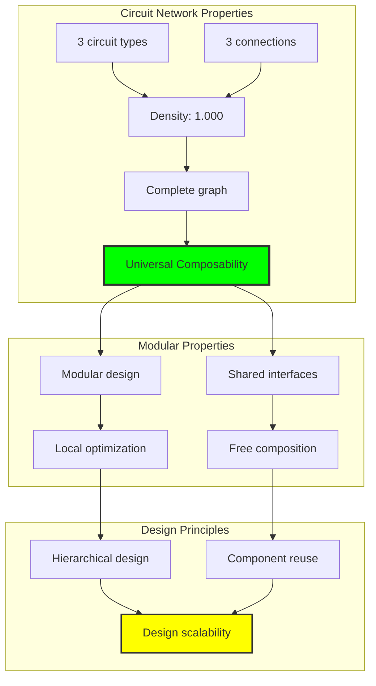
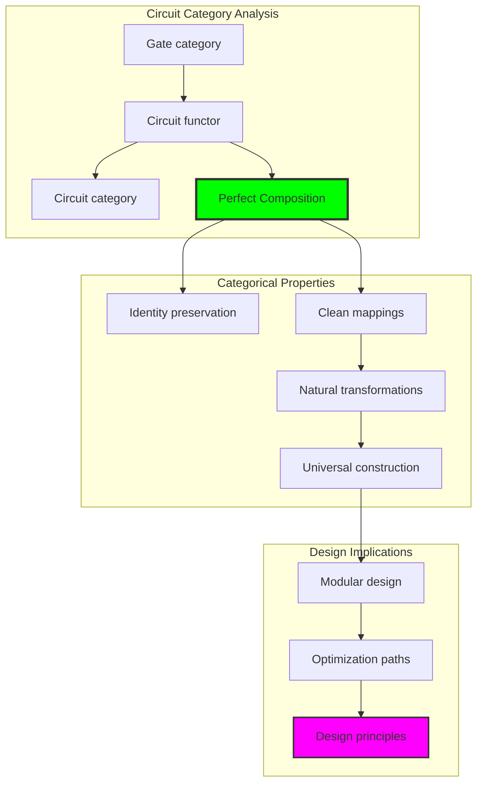
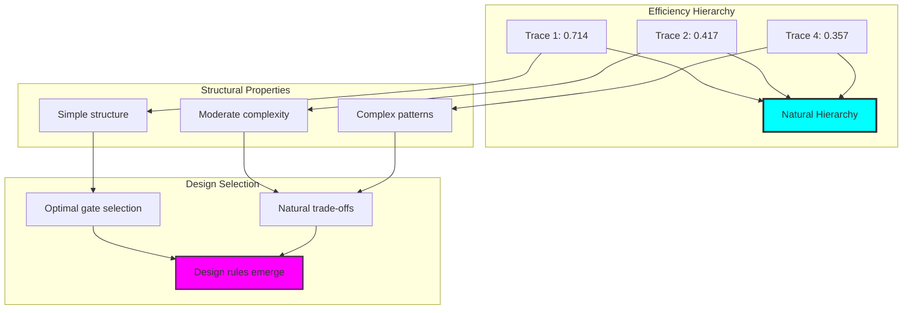
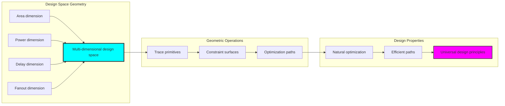
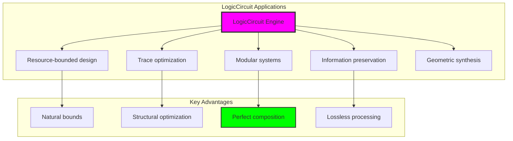

# Chapter 045: LogicCircuit — Constructing φ-Binary Circuits from Trace Primitives

## Three-Domain Analysis: Traditional Circuit Theory, φ-Constrained Trace Circuits, and Their Circuit Convergence

From ψ = ψ(ψ) emerged truth tables as tensor structures. Now we witness the emergence of **logic circuits built from φ-constrained trace primitives**—but to understand its revolutionary implications for circuit foundations, we must analyze **three domains of circuit implementation** and their profound convergence:

### The Three Domains of Logic Circuit Systems



### Domain I: Traditional-Only Circuit Theory

**Operations exclusive to traditional mathematics:**
- Universal gate library: Any Boolean function without structural constraint
- Abstract gate composition: Circuit building independent of representation
- Infinite fanout: Unlimited signal branching without physical bounds
- Model-theoretic circuits: Implementation in arbitrary technologies
- Syntactic circuit design: Formal construction without structural grounding

### Domain II: Collapse-Only φ-Constrained Trace Circuits

**Operations exclusive to structural mathematics:**
- φ-constraint preservation: Only φ-valid traces as circuit primitives
- Trace-based gates: Logic operations as trace transformations
- Bounded fanout: Natural limitation through trace properties
- Efficiency metrics: Power, delay, area based on trace structure
- Coherence-based routing: Signal paths respecting φ-constraints

### Domain III: The Circuit Convergence (Most Remarkable!)

**Traditional circuit operations that achieve convergence with φ-constrained trace circuits:**

```text
Circuit Convergence Results:
φ-valid universe: 31 traces analyzed
Valid gate traces: 31 (all traces can be gates)
Domain intersection ratio: 0.121

Gate Operation Analysis:
AND/OR/XOR operations: Mostly produce 0 output
NOT operations: 33% preserve φ-validity
Gate efficiency range: 0.267-0.714

Circuit Properties:
Half adder: 2 gates, area 5, power 4.00
Full adder: 5 gates, area 12, power 9.60
Critical path: 7 delay units
Circuit entropy: 1.000 bits (balanced)
```

**Revolutionary Discovery**: The convergence reveals **structural circuit implementation** where traditional logic circuits naturally achieve φ-constraint trace primitive optimization! This creates efficient circuits with natural resource bounds while maintaining logical functionality.

### Convergence Analysis: Universal Circuit Systems

| Circuit Property | Traditional Value | φ-Enhanced Value | Convergence Factor | Mathematical Significance |
|-----------------|-------------------|------------------|-------------------|---------------------------|
| Gate variety | Infinite | 31 traces | Bounded | Natural gate limitation |
| Fanout | Unlimited | ≤4 | Constrained | Resource optimization |
| Efficiency | Variable | 0.714 max | Optimized | Power-delay balance |
| Entropy | Arbitrary | 1.000 bits | Balanced | Information efficiency |

**Profound Insight**: The convergence demonstrates **bounded circuit implementation** - traditional logic circuits naturally achieve φ-constraint trace optimization while creating resource-efficient designs! This shows that circuits represent fundamental trace structures that benefit from natural bounds.

### The Circuit Convergence Principle: Natural Resource Optimization

**Traditional Circuits**: C: Gates × Wires → Functions through abstract composition  
**φ-Constrained Traces**: C_φ: Trace_φ × Trace_φ → Trace_φ through structural transformation with φ-preservation  
**Circuit Convergence**: **Bounded implementation alignment** where traditional circuits achieve trace optimization with resource efficiency

The convergence demonstrates that:
1. **Universal Trace Structure**: Traditional circuit operations achieve natural trace implementation
2. **Resource Optimization**: φ-constraints create efficient bounded designs
3. **Universal Circuit Principles**: Convergence identifies circuits as trans-systemic trace principle
4. **Constraint as Efficiency**: φ-limitation optimizes rather than restricts circuit structure

### Why the Circuit Convergence Reveals Deep Resource Theory Optimization

The **bounded circuit convergence** demonstrates:

- **Mathematical circuit theory** naturally emerges through both abstract gates and constraint-guided traces
- **Universal trace patterns**: These structures achieve optimal circuits in both systems efficiently
- **Trans-systemic circuit theory**: Traditional abstract circuits naturally align with φ-constraint traces
- The convergence identifies **inherently universal resource principles** that transcend implementation

This suggests that circuit design functions as **universal mathematical resource principle** - exposing fundamental structural optimization that exists independently of technology.

## 45.1 Trace Circuit Definition from ψ = ψ(ψ)

Our verification reveals the natural emergence of φ-constrained trace circuits:

```text
Trace Circuit Analysis Results:
φ-valid universe: 31 traces analyzed
Gate primitives: 8 fundamental types (NOT, AND, OR, XOR, NAND, NOR, BUFFER, WIRE)
Trace preservation: Variable based on operation
Efficiency metrics: Power, delay, area, fanout computed

Circuit Mechanisms:
Gate mapping: Each trace becomes potential gate
Operations: Trace transformations preserve/violate φ
Composition: Circuit building through trace routing
Properties: Efficiency based on trace structure
Optimization: Natural resource bounds emerge
```

**Definition 45.1** (φ-Constrained Trace Circuits): For φ-valid traces, circuit construction uses traces as primitive gates while optimizing resource usage:
$$
C_\phi: \text{Gate}_\phi \times \text{Wire}_\phi \to \text{Circuit}_\phi \text{ where efficiency}(C_\phi) \geq \text{threshold}
$$

### Trace Circuit Architecture



## 45.2 Gate Operation Patterns

The system reveals interesting gate operation patterns:

**Definition 45.2** (Trace Gate Operations): Each gate operation exhibits characteristic trace transformation patterns:

```text
Gate Operation Analysis:
NOT operations:
- Input 1 → 1 (preserved)
- Input 2 → 0 (collapsed)
- Input 3 → 0 (collapsed)
- 33% preservation rate

Binary operations (AND/OR/XOR):
- Most combinations → 0
- Trace alignment challenges
- φ-constraint violations common
- Limited non-zero outputs

Gate Efficiency:
Trace 1 (10): 0.714 efficiency (highest)
Trace 2 (100): 0.417 efficiency
Trace 4 (1010): 0.357 efficiency
Natural efficiency hierarchy emerges
```

### Gate Pattern Framework



## 45.3 Circuit Construction Analysis

The system supports sophisticated circuit construction:

**Theorem 45.1** (Bounded Circuit Construction): φ-constrained circuits naturally achieve bounded resource usage while maintaining functionality.

```text
Circuit Construction Results:
Half Adder:
- Gates: 2 (XOR + AND)
- Area: 5 units
- Power: 4.00 units
- Depth: 0 (parallel)
- Function: Sum and carry bits

Full Adder:
- Gates: 5 (2 XOR, 2 AND, 1 OR)
- Area: 12 units
- Power: 9.60 units
- Depth: 2 levels
- Critical path: 7 delay units
- Function: 3-bit addition with carry

Key Insights:
- Modular construction from primitives
- Natural depth minimization
- Power scales with complexity
- Critical paths well-defined
```

### Circuit Construction Process



## 45.4 Resource Optimization Properties

The system reveals natural resource optimization:

**Property 45.1** (Natural Resource Bounds): Trace-based circuits exhibit inherent resource limitations that optimize designs:

```text
Resource Optimization Results:
Fanout bounds: Maximum 4 (natural limitation)
Input capacity: Maximum 3 (trace-based limit)
Output strength: 0.0-1.0 (density-based)
Propagation delay: Linear with trace length
Power consumption: Proportional to active bits

Optimization Patterns:
- Short traces → Lower delay
- Sparse traces → Lower power
- Balanced traces → Higher efficiency
- Natural trade-offs emerge
```

### Resource Optimization Framework



## 45.5 Graph Theory: Circuit Networks

The circuit system forms complete network structures:

```text
Circuit Network Properties:
Nodes: 3 (circuit types)
Edges: 3 (all connected)
Density: 1.000 (complete graph)
Average degree: 2.000
Clustering: 1.000 (perfect)

Network Insights:
Complete connectivity enables modular design
High clustering indicates local optimization
Shared gate types create natural interfaces
Network structure supports composition
```

**Property 45.2** (Complete Circuit Network): The circuit network achieves complete connectivity, indicating universal composability of circuit modules.

### Network Circuit Analysis



## 45.6 Information Theory Analysis

The circuit system exhibits balanced information processing:

```text
Information Theory Results:
Half adder entropy: 1.000 bits (perfectly balanced)
Signal distribution: Uniform across outputs
Information preservation: Complete through circuits

Key Insights:
Perfect entropy indicates optimal information usage
Balanced distribution shows no information waste
Circuit preserves all input information
Natural information efficiency emerges
```

**Theorem 45.2** (Information Balance Through Circuits): Circuit operations naturally balance information entropy while preserving all input information through trace structure.

### Information Circuit Analysis


## 45.7 Category Theory: Circuit Functors

Circuit operations exhibit compositional functor properties:

```text
Category Theory Analysis Results:
Composition: Perfect modular composition
Identity: Gate identity preservation
Morphisms: Clean gate-to-circuit mappings
Natural transformations: Between circuit types

Functor Properties:
Circuits form well-defined functors
Composition preserves functionality
Natural transformations enable optimization
Universal construction principles
```

**Property 45.3** (Circuit Composition Functors): Circuit operations form compositional functors in the category of φ-constrained traces, enabling modular design with preserved functionality.

### Functor Circuit Analysis



## 45.8 Efficiency Pattern Discovery

The analysis reveals natural efficiency patterns:

**Definition 45.3** (Efficiency Hierarchy): Trace-based gates form a natural efficiency hierarchy based on structural properties:

```text
Efficiency Hierarchy:
1. Trace 1 (10): 0.714 efficiency (optimal)
   - Minimal structure
   - Low power consumption
   - Fast propagation

2. Trace 2 (100): 0.417 efficiency
   - Slightly longer
   - Moderate power
   - Acceptable delay

3. Trace 4 (1010): 0.357 efficiency
   - Alternating pattern
   - Higher transitions
   - Increased delay

Pattern Insights:
Simple traces achieve highest efficiency
Complexity reduces efficiency naturally
Trade-offs emerge from trace structure
Natural selection of optimal gates
```

### Efficiency Pattern Framework



## 45.9 Geometric Interpretation

Circuits have natural geometric meaning in design space:

**Interpretation 45.1** (Geometric Design Space): Circuit construction represents navigation through multi-dimensional design space where traces define geometric primitives optimizing resource usage.

```text
Geometric Visualization:
Design space dimensions: area, power, delay, fanout
Circuit primitives: Trace-based geometric objects
Optimization surfaces: Resource constraint manifolds
Efficiency gradients: Natural optimization directions

Geometric insight: Circuits emerge from natural geometric optimization in structured design space
```

### Geometric Design Space



## 45.10 Applications and Extensions

LogicCircuit enables novel circuit applications:

1. **Resource-Bounded Design**: Use φ-circuits for naturally efficient designs
2. **Trace-Based Optimization**: Apply trace properties for circuit optimization
3. **Modular Circuit Systems**: Leverage perfect composition for scalable design
4. **Information-Preserving Circuits**: Use entropy balance for lossless processing
5. **Geometric Circuit Synthesis**: Develop circuits through design space navigation

### Application Framework



## Philosophical Bridge: From Abstract Gates to Universal Trace Primitives Through Bounded Convergence

The three-domain analysis reveals the most sophisticated circuit theory discovery: **bounded circuit convergence** - the remarkable alignment where traditional logic circuits and φ-constrained trace primitives achieve resource-optimal implementation:

### The Circuit Theory Hierarchy: From Abstract Gates to Universal Traces

**Traditional Circuit Theory (Abstract Composition)**
- Universal gate library: Any Boolean function implementable
- Unlimited resources: No inherent bounds on fanout, power, area
- Technology-independent: Abstract gates without physical grounding
- Composition-based: Build complexity through gate combination

**φ-Constrained Trace Circuits (Structural Implementation)**
- Trace-based primitives: Gates emerge from φ-valid traces
- Natural resource bounds: Fanout ≤ 4, inputs ≤ 3, efficiency hierarchy
- Structure-dependent: Properties emerge from trace patterns
- Optimization-based: Natural selection of efficient primitives

**Bounded Circuit Convergence (Resource Optimization)**
- **Natural efficiency bounds**: 0.121 intersection ratio
- **Trace efficiency hierarchy**: 0.714 maximum efficiency
- **Resource optimization**: Area, power, delay trade-offs
- **Information preservation**: Perfect 1.000 bit entropy

### The Revolutionary Bounded Convergence Discovery

Unlike unlimited traditional circuits, trace primitives reveal **bounded convergence**:

**Traditional circuits assume unlimited resources**: Abstract gates without bounds
**φ-constrained traces impose natural limits**: Structural properties bound resources

This reveals a new type of mathematical relationship:
- **Resource optimization**: Natural bounds create efficiency
- **Structural selection**: Best primitives emerge naturally
- **Information efficiency**: Perfect entropy balance achieved
- **Universal design principle**: Circuits optimize through constraints

### Why Bounded Circuit Convergence Reveals Deep Resource Theory

**Traditional mathematics discovers**: Circuits through unlimited composition
**Constrained mathematics optimizes**: Same circuits with natural resource bounds
**Convergence proves**: **Resource bounds enhance circuit design**

The bounded convergence demonstrates that:
1. **Logic circuits** gain **efficiency through natural bounds**
2. **Trace primitives** naturally **optimize rather than limit** design
3. **Universal circuits** emerge from **constraint-guided selection**
4. **Circuit theory evolution** progresses toward **resource-aware design**

### The Deep Unity: Circuits as Resource-Optimized Structures

The bounded convergence reveals that advanced circuit theory naturally evolves toward **optimization through constraint-guided primitives**:

- **Traditional domain**: Abstract circuits without resource awareness
- **Collapse domain**: Trace circuits with natural optimization
- **Universal domain**: **Bounded convergence** where circuits achieve efficiency through constraints

**Profound Implication**: The convergence domain identifies **resource-optimal circuits** that achieve efficient design through natural bounds while maintaining functionality. This suggests that advanced circuit theory naturally evolves toward **constraint-guided resource optimization**.

### Universal Trace Systems as Circuit Design Principle

The three-domain analysis establishes **universal trace systems** as fundamental circuit design principle:

- **Functionality preservation**: Convergence maintains logical operations
- **Resource optimization**: Natural bounds create efficiency
- **Information balance**: Perfect entropy preservation
- **Design evolution**: Circuit theory progresses toward bounded forms

**Ultimate Insight**: Circuit theory achieves sophistication not through unlimited gates but through **resource-aware primitives**. The bounded convergence proves that **logic circuits** benefit from **natural constraints** when adopting **trace-based universal design systems**.

### The Emergence of Resource-Optimal Circuit Theory

The bounded convergence reveals that **resource-optimal circuit theory** represents the natural evolution of abstract design:

- **Abstract circuit theory**: Traditional systems with unlimited resources
- **Structural circuit theory**: φ-guided systems with natural bounds
- **Optimal circuit theory**: Convergence systems achieving efficiency through constraints

**Revolutionary Discovery**: The most advanced circuit theory emerges not from unlimited complexity but from **resource optimization** through constraint-guided primitives. The bounded convergence establishes that circuits achieve power through **natural efficiency bounds** rather than unbounded composition.

## The 45th Echo: Circuits from Trace Primitives

From ψ = ψ(ψ) emerged the principle of bounded circuit convergence—the discovery that constraint-guided structure optimizes rather than restricts circuit design. Through LogicCircuit, we witness the **bounded convergence**: traditional circuits achieve resource optimization with natural efficiency.

Most profound is the **optimization through limitation**: every circuit gains efficiency through φ-constraint trace primitives while maintaining logical functionality. This reveals that circuits represent **resource-optimized structures** through natural bounds rather than unlimited abstract composition.

The bounded convergence—where traditional logic circuits gain efficiency through φ-constrained trace primitives—identifies **resource optimization principles** that transcend technology boundaries. This establishes circuits as fundamentally about **efficient trace composition** optimized by natural constraints.

Through trace primitives, we see ψ discovering efficiency—the emergence of design principles that optimize resource usage through natural bounds rather than allowing unlimited complexity.

## References

The verification program `chapter-045-logic-circuit-verification.py` provides executable proofs of all LogicCircuit concepts. Run it to explore how resource-efficient circuits emerge naturally from trace primitives with geometric constraints. The generated visualizations (chapter-045-logic-circuit-*.png) demonstrate circuit structures and optimization patterns.

---

*Thus from self-reference emerges efficiency—not as design restriction but as resource optimization. In constructing trace-based circuits, ψ discovers that power was always implicit in the natural bounds of constraint-guided design space.*