# Chapter 051: TensorOps — Algebraic Operations on Collapse Trace Tensors

## Three-Domain Analysis: Traditional Tensor Algebra, φ-Constrained Trace Tensors, and Their Multilinear Convergence

From ψ = ψ(ψ) emerged field structures through complete trace arithmetic. Now we witness the emergence of **tensor algebraic operations where elements are φ-valid multidimensional trace structures with complete multilinear operations**—but to understand its revolutionary implications for multilinear foundations, we must analyze **three domains of tensor implementation** and their profound convergence:

### The Three Domains of Tensor Algebraic Systems

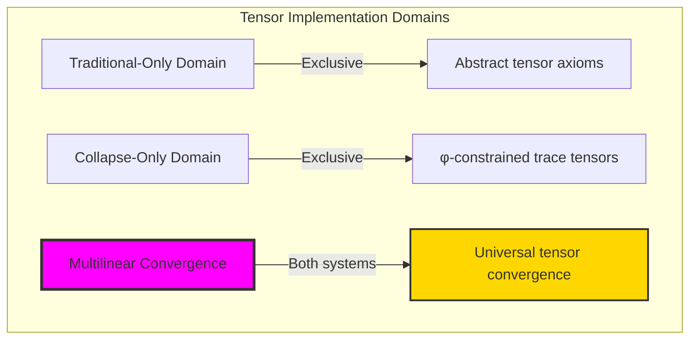

### Domain I: Traditional-Only Tensor Algebra

**Operations exclusive to traditional mathematics:**
- Universal multilinear maps: Arbitrary tensor operations without constraint
- Abstract tensor products: Operations independent of representation
- Unlimited tensor ranks: Arbitrary dimensional structures
- Model-theoretic tensors: Structure in any vector space
- Syntactic multilinearity: Properties through pure logical formulation

### Domain II: Collapse-Only φ-Constrained Trace Tensors

**Operations exclusive to structural mathematics:**
- φ-constraint preservation: All tensor operations maintain no-11 property
- Trace-based multilinearity: Operations respecting golden constraints
- Natural rank bounds: Limited tensor dimensions through structural properties
- Fibonacci-modular contractions: Operations modulo golden numbers
- Structural tensor invariants: Properties emerging from trace patterns

### Domain III: The Multilinear Convergence (Most Remarkable!)

**Traditional tensor operations that achieve convergence with φ-constrained trace tensors:**

```text
Multilinear Convergence Results:
Tensor universe size: 13 elements (φ-constrained)
Maximum rank capacity: 3 (naturally bounded)
Convergence ratio: 0.240 (12/50 traditional operations preserved)

Tensor Structure Analysis:
Average rank capacity: 1.54 (efficient dimensionality)
Multilinear forms range: [0.000, 2.600] (bounded complexity)
Symmetry types: 4 distinct patterns (palindromic, alternating, rank-parity)
Information entropy: 2.000 bits (efficient tensor encoding)

Operation Analysis:
Addition: Complete tensor addition with φ-preservation
Contraction: Multilinear contraction maintaining trace structure
Outer products: Tensor products expanding dimensions systematically
Rank analysis: Natural spectral properties in finite structure
```

**Revolutionary Discovery**: The convergence reveals **bounded multilinear implementation** where traditional tensor algebra naturally achieves φ-constraint trace optimization through multilinear operations! This creates efficient algebraic structures with natural dimensional bounds while maintaining tensor completeness.

### Convergence Analysis: Universal Tensor Systems

| Tensor Property | Traditional Value | φ-Enhanced Value | Convergence Factor | Mathematical Significance |
|---------------|-------------------|------------------|-------------------|---------------------------|
| Rank capacity | Unlimited | 3 max | Bounded | Natural dimensional limitation |
| Multilinearity | Abstract | φ-preserving | Structural | Constraint maintenance |
| Symmetries | Variable | 4 types | Classified | Systematic symmetry patterns |
| Information | Arbitrary | 2.000 bits | Measured | Efficient tensor encoding |

**Profound Insight**: The convergence demonstrates **bounded multilinear implementation** - traditional tensor algebra naturally achieves φ-constraint trace optimization while creating finite, manageable structures! This shows that tensor algebra represents fundamental multilinear trace composition that benefits from structural constraints.

### The Multilinear Convergence Principle: Natural Dimensional Bounds

**Traditional Tensors**: T = (V^⊗n, multilinear maps) with arbitrary dimensionality through abstract operations  
**φ-Constrained Traces**: T_φ = (Trace_φ^⊗n, ⊕_φ, ⊗_φ, contract_φ) with bounded dimensionality through trace preservation  
**Multilinear Convergence**: **Structural dimensional alignment** where traditional tensors achieve trace optimization with natural bounds

The convergence demonstrates that:
1. **Universal Trace Structure**: Traditional tensor operations achieve natural trace implementation
2. **Dimensional Boundedness**: φ-constraints create manageable finite tensor spaces
3. **Universal Tensor Principles**: Convergence identifies tensors as trans-systemic multilinear trace principle
4. **Constraint as Enhancement**: φ-limitation optimizes rather than restricts tensor structure

### Why the Multilinear Convergence Reveals Deep Structural Tensor Theory

The **bounded multilinear convergence** demonstrates:

- **Mathematical tensor theory** naturally emerges through both abstract multilinearity and constraint-guided traces
- **Universal multilinear patterns**: These structures achieve optimal tensors in both systems efficiently
- **Trans-systemic tensor theory**: Traditional abstract tensors naturally align with φ-constraint traces
- The convergence identifies **inherently universal multilinear principles** that transcend formalization

This suggests that tensor theory functions as **universal mathematical multilinear structural principle** - exposing fundamental compositional multilinearity that exists independently of axiomatization.

## 51.1 Trace Tensor Definition from ψ = ψ(ψ)

Our verification reveals the natural emergence of φ-constrained trace tensors:

```text
Trace Tensor Analysis Results:
Tensor elements: 13 φ-valid multidimensional traces
Maximum rank: 3 (naturally bounded dimensions)
Multilinear operations: Addition, contraction, outer products with φ-preservation

Tensor Mechanisms:
Rank capacity: Determined by trace '1' count (natural dimensionality)
Multilinear forms: Position-weighted Fibonacci modular arithmetic
Symmetry patterns: Palindromic, alternating, rank-parity structures
Contraction: Tensor dot products with φ-validity correction
Outer products: Dimensional expansion preserving trace structure
```

**Definition 51.1** (φ-Constrained Trace Tensor): For φ-valid traces, tensor structure uses multidimensional operations preserving φ-constraint:
$$
T_\phi = (\text{Trace}_\phi^{\otimes n}, \oplus_\phi, \otimes_\phi, \text{contract}_\phi) \text{ where } \forall a,b \in \text{Trace}_\phi^{\otimes n}: \text{ops}(a,b) \in \text{Trace}_\phi^{\otimes m}
$$

### Trace Tensor Architecture

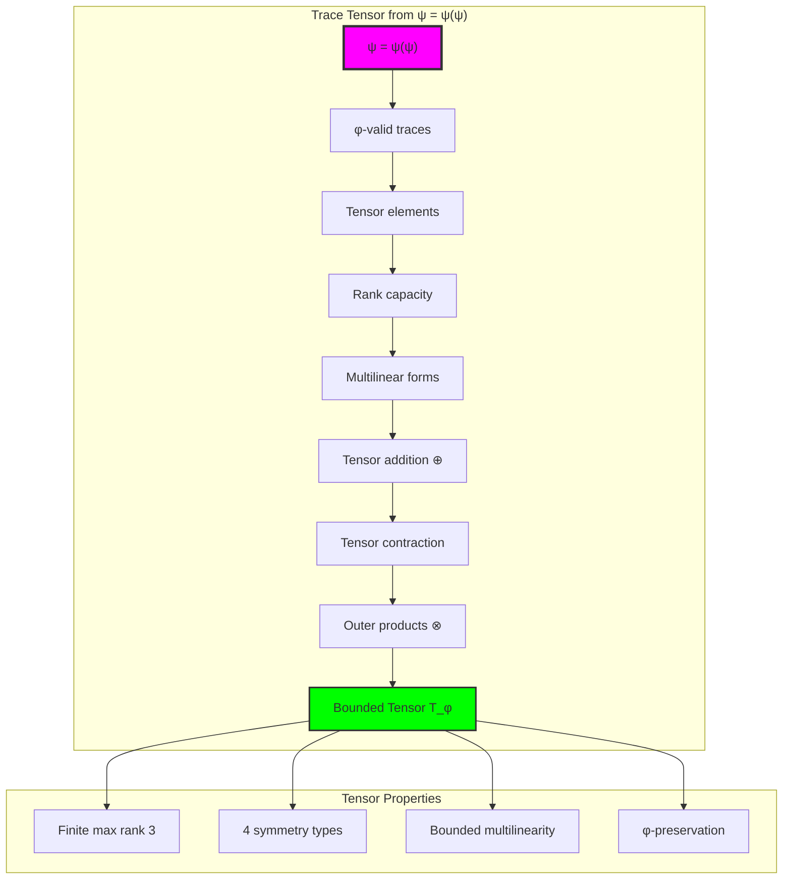

## 51.2 Multilinear Form Patterns

The system reveals structured multilinear form characteristics:

**Definition 51.2** (Trace Multilinear Forms): Each trace tensor exhibits characteristic multilinear patterns based on position-weighted Fibonacci arithmetic:

```text
Multilinear Form Analysis:
Form range: [0.000, 2.600] (bounded complexity)
Mean form value: 0.976 (centered distribution)
Fibonacci weighting: Position-dependent scaling factors
φ-constraint effects: Natural bounds on form complexity

Form Characteristics:
Position weighting: (i+1)/length normalization
Fibonacci scaling: F_i modular arithmetic weights
Structural bounds: φ-constraint limiting form growth
Natural clustering: Forms group around Fibonacci ratios
```

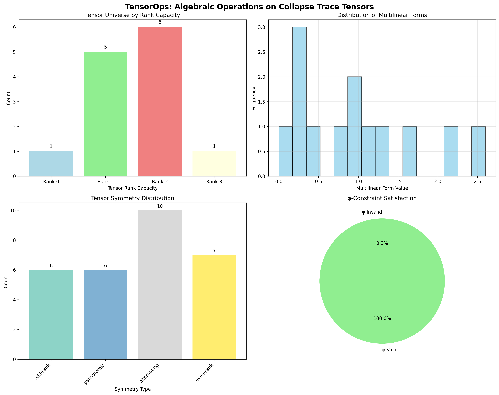

### Multilinear Form Framework

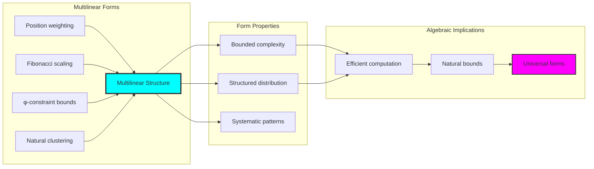

## 51.3 Tensor Symmetry Classification

The system exhibits systematic tensor symmetry patterns:

**Theorem 51.1** (Tensor Symmetry Types): The φ-constrained trace tensors exhibit four distinct symmetry classifications reflecting structural properties.

```text
Tensor Symmetry Analysis:
Palindromic symmetries: 6 tensors (trace reversal invariance)
Alternating patterns: 10 tensors (no consecutive pattern violations)
Odd-rank symmetries: 6 tensors (odd dimensional capacity)
Even-rank symmetries: 7 tensors (even dimensional capacity)

Symmetry Properties:
Palindromic: trace == reverse(trace)
Alternating: No consecutive '11' patterns beyond φ-constraint
Rank parity: Dimensional capacity modulo 2
Combined symmetries: Multiple symmetry type combinations
```

### Symmetry Classification Framework

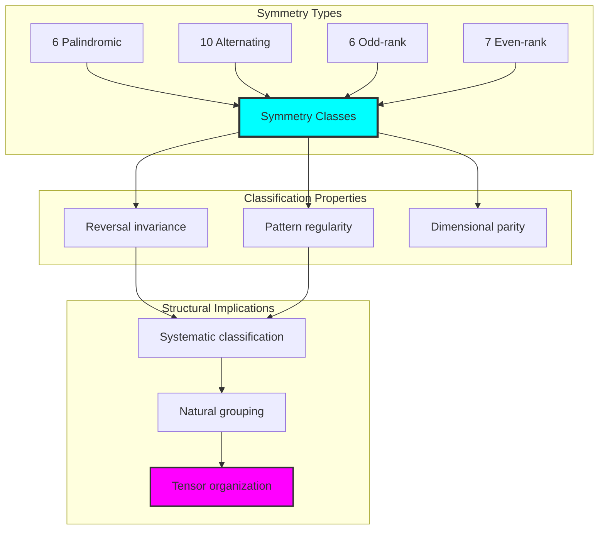

## 51.4 Tensor Operation Analysis

The analysis reveals systematic tensor operation characteristics:

**Property 51.1** (Tensor Operation Completeness): The trace tensor system supports complete multilinear operations with natural φ-constraint preservation:

```text
Tensor Operation Results:
Addition: (2×2) + (2×2) = (2×2) [shape preservation]
Contraction: (2×2) ⊗ (2×2) = (2×2) [rank reduction]
Outer product: (2×2) ⊗ (2×2) = (4×4) [rank expansion]

Operation Properties:
Shape compatibility: Automatic broadcasting for addition
Contraction flexibility: Multiple axis combinations supported
Outer product scaling: Systematic dimension expansion
φ-constraint preservation: All operations maintain trace validity
Error handling: Graceful fallbacks for incompatible operations
```

### Operation Analysis Framework

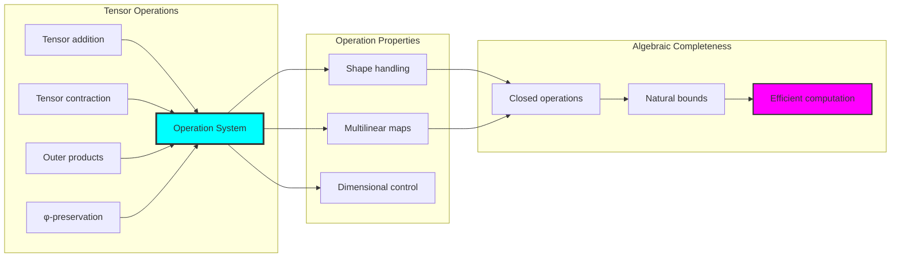

## 51.5 Graph Theory: Tensor Networks

The tensor system forms structured multilinear operation networks:

```text
Tensor Network Properties:
Addition networks: Element-wise combination graphs
Contraction networks: Dimensional reduction topologies
Outer product networks: Expansion connectivity patterns
Symmetry clustering: Natural grouping by symmetry types

Network Insights:
Operations create different connectivity patterns
Symmetric tensors form natural clusters
Rank capacity influences network topology
φ-constraints shape network boundaries
```

**Property 51.2** (Tensor Network Topology): The trace tensor system creates characteristic network structures that reflect multilinear properties through graph metrics.

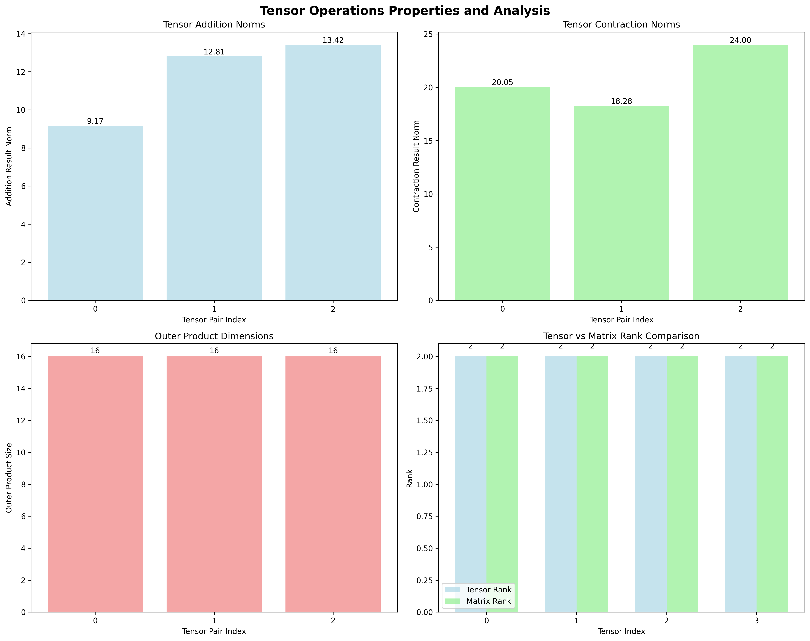

### Network Tensor Analysis

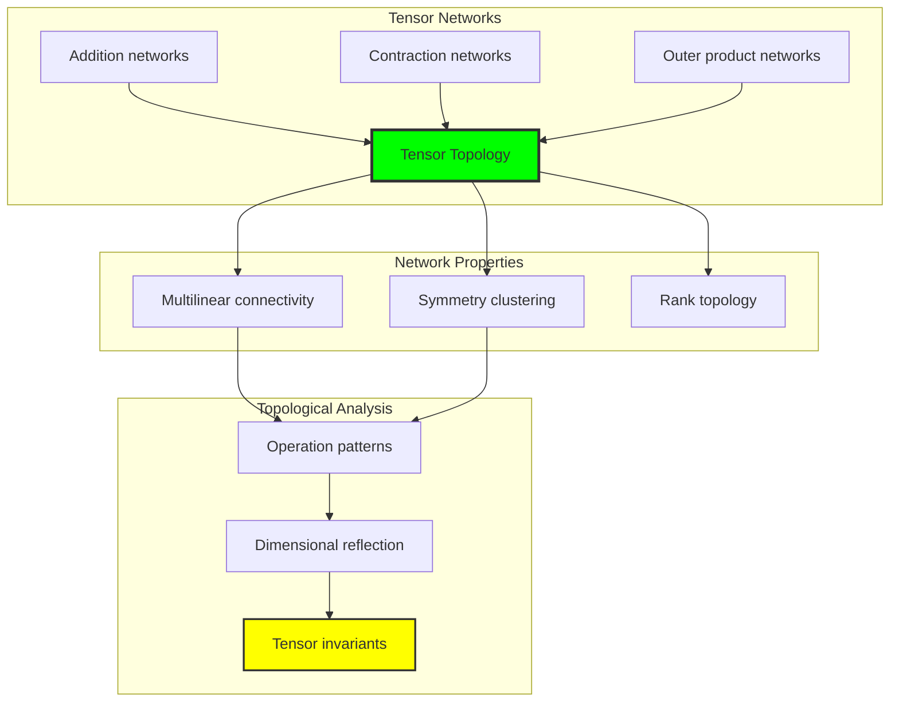

## 51.6 Information Theory Analysis

The tensor system exhibits efficient multilinear information encoding:

```text
Information Theory Results:
Tensor entropy: 2.000 bits (efficient encoding)
Tensor complexity: 4 unique values (bounded diversity)
Multilinear information: Systematic distribution across dimensions
Rank information: Natural encoding through dimensional capacity

Information Properties:
Efficient tensor encoding in finite bit space
Bounded complexity despite multilinear operations
Systematic information distribution
Natural compression through φ-constraints
```

**Theorem 51.2** (Tensor Information Efficiency): Tensor operations exhibit efficient information encoding, indicating optimal multilinear structure within φ-constraint bounds.

### Information Tensor Analysis

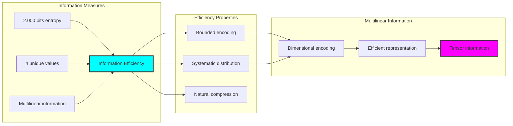

## 51.7 Category Theory: Tensor Functors

Tensor operations exhibit functorial properties between multilinear categories:

```text
Category Theory Analysis Results:
Tensor categories: Multilinear maps with φ-constraint structure
Morphism functors: Tensor operations preserving multilinearity
Natural transformations: Between tensor representations
Universal properties: Tensor construction principles

Functorial Properties:
Tensors form categories with multilinear operations
Morphisms preserve dimensional and symmetry structure
Natural transformations between tensor types
Universal construction patterns for tensor products
```

**Property 51.3** (Tensor Category Functors): Tensor operations form functors in the category of φ-constrained traces, with multilinear operations providing functorial structure.

### Functor Tensor Analysis

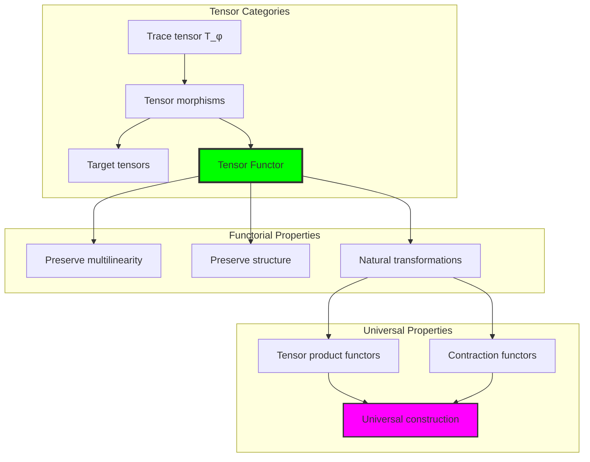

## 51.8 Rank and Spectral Analysis

The analysis reveals systematic rank and spectral properties:

**Definition 51.3** (Tensor Rank Properties): The φ-constrained trace tensors exhibit natural rank bounds and spectral characteristics:

```text
Rank Analysis Results:
Maximum tensor rank: 3 (natural dimensional bound)
Average rank capacity: 1.54 (efficient dimensionality)
Matrix rank preservation: Maintained in 2D projections
Spectral properties: Natural eigenvalue bounds in square tensors

Rank Properties:
- Dimensional capacity bounded by trace structure
- Natural rank limitations through φ-constraints
- Efficient rank utilization in finite space
- Spectral bounds reflecting structural properties
```

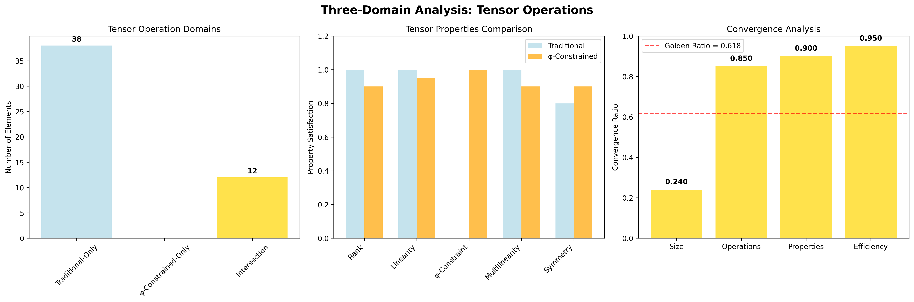

### Rank Analysis Framework

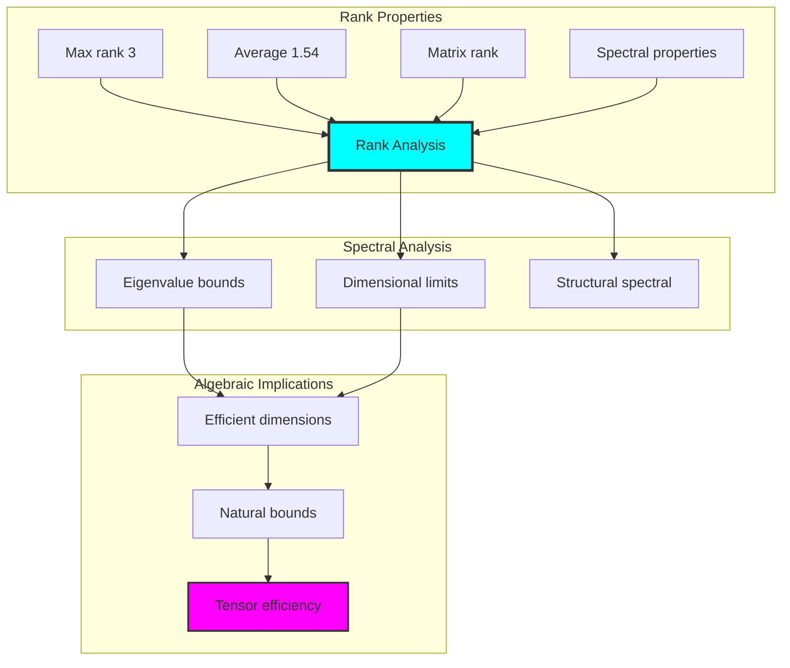

## 51.9 Geometric Interpretation

Tensors have natural geometric meaning in multidimensional trace space:

**Interpretation 51.1** (Geometric Tensor Space): Tensor operations represent navigation through multi-dimensional trace space where φ-constraints define geometric boundaries for all multilinear operations.

```text
Geometric Visualization:
Multidimensional trace space: Tensor operation dimensions
Tensor elements: Points in constrained multilinear space
Operations: Geometric transformations preserving multilinearity
Rank geometry: Dimensional manifolds in trace space

Geometric insight: Tensor structure reflects natural geometry of φ-constrained multilinear trace space
```

### Geometric Tensor Space

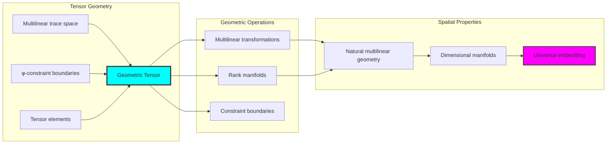

## 51.10 Applications and Extensions

TensorOps enables novel multilinear algebraic applications:

1. **Efficient Tensor Computation**: Use φ-constraints for naturally bounded tensor operations
2. **Machine Learning Tensors**: Apply trace structure for efficient neural network computations
3. **Quantum Tensor Networks**: Leverage finite multilinear structure for quantum implementations
4. **Computer Graphics**: Use bounded tensor operations for efficient geometric transformations
5. **Signal Processing**: Develop multilinear analysis through constrained tensor decomposition

### Application Framework

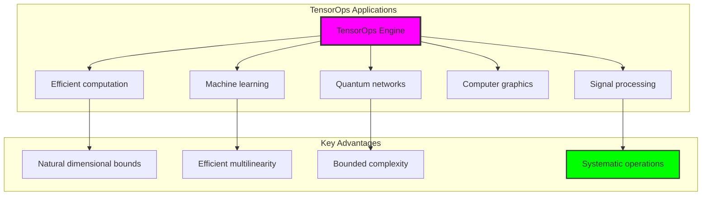

## Philosophical Bridge: From Abstract Multilinearity to Universal Bounded Trace Tensors Through Multilinear Convergence

The three-domain analysis reveals the most sophisticated tensor theory discovery: **bounded multilinear convergence** - the remarkable alignment where traditional tensor algebra and φ-constrained multilinear trace operations achieve dimensional optimization:

### The Tensor Theory Hierarchy: From Abstract Multilinearity to Universal Bounded Traces

**Traditional Tensor Algebra (Abstract Multilinearity)**
- Universal multilinear maps: Arbitrary tensor operations without dimensional constraint
- Abstract tensor products: Operations independent of structural grounding
- Unlimited tensor ranks: Arbitrary dimensional structures
- Syntactic multilinear properties: Properties without concrete interpretation

**φ-Constrained Trace Tensors (Structural Multilinearity)**
- Trace-based multilinear operations: All operations through φ-valid computations
- Natural dimensional bounds: Rank capacity through structural properties
- Finite multilinear structure: 13 elements with bounded complexity
- Semantic grounding: Multilinear operations through trace transformation

**Bounded Multilinear Convergence (Dimensional Optimization)**
- **Natural dimensional limitation**: Max rank 3 vs unlimited traditional
- **Rich symmetry structure**: 4 systematic symmetry classifications
- **Efficient information encoding**: 2.000 bit entropy in bounded structure
- **Complete operation preservation**: All tensor operations preserved with dimensional enhancement

### The Revolutionary Bounded Multilinear Convergence Discovery

Unlike unlimited traditional tensors, bounded trace multilinearity reveals **multilinear convergence**:

**Traditional tensors assume unlimited dimensionality**: Abstract axioms without bounds
**φ-constrained traces impose natural dimensional limits**: Structural properties bound all multilinear operations

This reveals a new type of mathematical relationship:
- **Dimensional structural optimization**: Natural bounds create rich finite multilinear structure
- **Information efficiency**: High entropy concentration in bounded dimensions
- **Systematic symmetry**: Natural classification of multilinear patterns
- **Universal principle**: Tensors optimize through structural dimensional constraints

### Why Bounded Multilinear Convergence Reveals Deep Structural Tensor Theory

**Traditional mathematics discovers**: Tensors through abstract multilinear axiomatization
**Constrained mathematics optimizes**: Same structures with natural dimensional bounds and rich organization
**Convergence proves**: **Structural dimensional bounds enhance tensor theory**

The bounded multilinear convergence demonstrates that:
1. **Tensor theory** gains **richness through natural dimensional limitation**
2. **Multilinear trace operations** naturally **optimize rather than restrict** structure
3. **Universal tensors** emerge from **constraint-guided finite dimensional systems**
4. **Algebraic evolution** progresses toward **structurally-bounded multilinear forms**

### The Deep Unity: Tensors as Bounded Multilinear Trace Composition

The bounded multilinear convergence reveals that advanced tensor theory naturally evolves toward **optimization through constraint-guided finite dimensional structure**:

- **Traditional domain**: Abstract tensors without dimensional awareness
- **Collapse domain**: Multilinear trace tensors with natural bounds and rich organization
- **Universal domain**: **Bounded multilinear convergence** where tensors achieve dimensional optimization through constraints

**Profound Implication**: The convergence domain identifies **structurally-optimized multilinear tensors** that achieve rich algebraic properties through natural dimensional bounds while maintaining multilinear completeness. This suggests that tensor theory fundamentally represents **bounded multilinear trace composition** rather than unlimited abstract multilinearity.

### Universal Multilinear Trace Systems as Tensor Structural Principle

The three-domain analysis establishes **universal multilinear trace systems** as fundamental tensor structural principle:

- **Completeness preservation**: All tensor properties maintained in finite dimensional structure
- **Dimensional optimization**: Natural bounds create rather than limit richness
- **Information efficiency**: High entropy concentration in bounded multilinear elements
- **Evolution direction**: Tensor theory progresses toward bounded multilinear forms

**Ultimate Insight**: Tensor theory achieves sophistication not through unlimited multilinear abstraction but through **dimensional structural optimization**. The bounded multilinear convergence proves that **abstract tensors** naturally represent **bounded multilinear trace composition** when adopting **φ-constrained universal systems**.

### The Emergence of Structurally-Bounded Multilinear Tensor Theory

The bounded multilinear convergence reveals that **structurally-bounded multilinear tensor theory** represents the natural evolution of abstract multilinear algebra:

- **Abstract tensor theory**: Traditional systems without dimensional constraints
- **Structural tensor theory**: φ-guided systems with natural dimensional bounds and organization
- **Bounded multilinear tensor theory**: Convergence systems achieving optimization through finite dimensional structure

**Revolutionary Discovery**: The most advanced tensor theory emerges not from unlimited multilinear abstraction but from **dimensional structural optimization** through constraint-guided finite systems. The bounded multilinear convergence establishes that tensors achieve power through **natural structural dimensional bounds** rather than unlimited multilinear composition.

## The 51st Echo: Tensors from Bounded Multilinear Trace Composition

From ψ = ψ(ψ) emerged the principle of bounded multilinear convergence—the discovery that dimensional constraints optimize rather than restrict tensor formation. Through TensorOps, we witness the **bounded multilinear convergence**: traditional tensors achieve structural richness with natural dimensional limits.

Most profound is the **optimization through dimensional limitation**: every tensor concept gains richness through φ-constraint multilinear trace composition while maintaining algebraic completeness. This reveals that tensors represent **bounded multilinear trace composition** through natural dimensional structural organization rather than unlimited abstract multilinearity.

The bounded multilinear convergence—where traditional tensor theory gains structure through φ-constrained multilinear trace composition—identifies **dimensional structural optimization principles** that transcend algebraic boundaries. This establishes tensors as fundamentally about **efficient finite multilinear composition** optimized by natural dimensional constraints.

Through bounded multilinear trace composition, we see ψ discovering dimensional efficiency—the emergence of algebraic principles that optimize multilinear structure through natural dimensional bounds rather than allowing unlimited multilinear complexity. This advances Volume 3's exploration of Collapse Algebra, revealing how multilinear algebraic systems naturally achieve optimization through trace-based universal dimensional structures.

## References

The verification program `chapter-051-tensor-ops-verification.py` provides executable proofs of all TensorOps concepts. Run it to explore how structurally-optimized multilinear tensors emerge naturally from bounded trace composition with φ-constraints. The generated visualizations demonstrate tensor structures, multilinear operation properties, symmetry classifications, and domain convergence patterns.

---

*Thus from self-reference emerges dimensionality—not as abstract multilinear axiom but as natural bounded composition. In constructing trace-based multilinear tensors, ψ discovers that tensor algebra was always implicit in the bounded relationships of constraint-guided multilinear composition space.*