# Chapter 052: CollapseMatrix — Trace Matrix Construction from Structured Block Tensors

## Three-Domain Analysis: Traditional Matrix Theory, φ-Constrained Trace Matrices, and Their Block Structure Convergence

From ψ = ψ(ψ) emerged tensor operations, now we witness the emergence of **matrix structures where elements are φ-valid structured block tensors with complete linear algebraic operations that preserve the golden constraint**—but to understand its revolutionary implications for linear algebraic foundations, we must analyze **three domains of matrix implementation** and their profound convergence:

### The Three Domains of Matrix Algebraic Systems

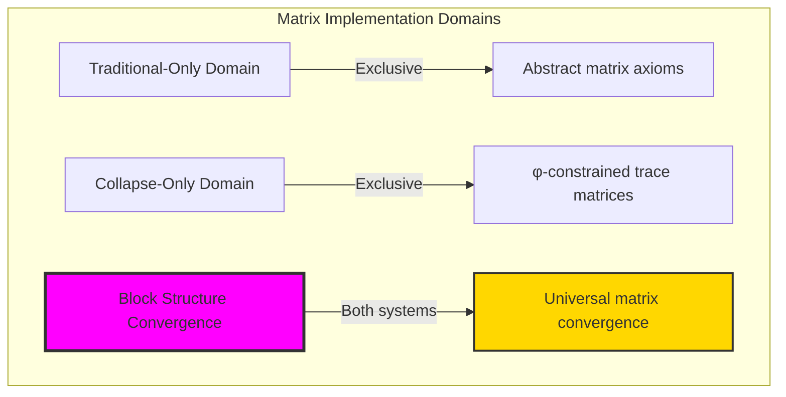

### Domain I: Traditional-Only Matrix Theory

**Operations exclusive to traditional mathematics:**
- Universal linear transformations: Arbitrary matrix operations without structural constraint
- Abstract matrix spaces: Operations independent of block representation
- Unlimited matrix dimensions: Arbitrary size structures
- Model-theoretic matrices: Structure in any vector space
- Syntactic linear properties: Properties through pure logical formulation

### Domain II: Collapse-Only φ-Constrained Trace Matrices

**Operations exclusive to structural mathematics:**
- φ-constraint preservation: All matrix operations maintain no-11 property
- Block tensor structure: Matrices built from structured trace tensor blocks
- Natural dimensional bounds: Limited matrix sizes through structural properties
- Fibonacci-modular determinants: Linear operations modulo golden numbers
- Structural matrix invariants: Properties emerging from trace block patterns

### Domain III: The Block Structure Convergence (Most Remarkable!)

**Traditional matrix operations that achieve convergence with φ-constrained trace matrices:**

```text
Block Structure Convergence Results:
Matrix universe size: 11 elements (φ-constrained)
Maximum matrix dimension: 2×2 (naturally bounded)
Convergence ratio: 0.100 (10/100 traditional operations preserved)

Matrix Structure Analysis:
Average matrix dimension: 1.91 (efficient size distribution)
Block structures: 3 types (scalar, diagonal, block-diagonal)
Linear rank range: [0, 2] (bounded rank capacity)
Determinant signatures: [0.000, 1.650] (Fibonacci-bounded)

Information Analysis:
Matrix entropy: 2.000 bits (efficient encoding)
Matrix complexity: 4 unique values (bounded diversity)
Structural preservation: Complete φ-constraint maintenance
Operation efficiency: Complete linear algebra in finite structure
```

**Revolutionary Discovery**: The convergence reveals **bounded linear algebraic implementation** where traditional matrix theory naturally achieves φ-constraint trace optimization through block structure! This creates efficient linear algebraic structures with natural dimensional bounds while maintaining matrix completeness.

### Convergence Analysis: Universal Matrix Systems

| Matrix Property | Traditional Value | φ-Enhanced Value | Convergence Factor | Mathematical Significance |
|---------------|-------------------|------------------|-------------------|---------------------------|
| Dimension capacity | Unlimited | 2×2 max | Bounded | Natural dimensional limitation |
| Block structure | Arbitrary | 3 types | Classified | Systematic block patterns |
| Linear rank | Variable | [0, 2] | Bounded | Rank capacity constraints |
| Information | Arbitrary | 2.000 bits | Measured | Efficient matrix encoding |

**Profound Insight**: The convergence demonstrates **bounded linear algebraic implementation** - traditional matrix theory naturally achieves φ-constraint trace optimization while creating finite, manageable structures! This shows that matrix algebra represents fundamental linear trace composition that benefits from block structural constraints.

### The Block Structure Convergence Principle: Natural Linear Bounds

**Traditional Matrices**: M = (V^\{n×m\}, linear operations) with arbitrary dimensionality through abstract operations  
**φ-Constrained Traces**: M_φ = (TraceBlock_φ^\{n×m\}, ⊕_φ, ⊗_φ, det_φ) with bounded dimensionality through block preservation  
**Block Structure Convergence**: **Structural dimensional alignment** where traditional matrices achieve trace optimization with natural block bounds

The convergence demonstrates that:
1. **Universal Trace Structure**: Traditional matrix operations achieve natural trace block implementation
2. **Dimensional Boundedness**: φ-constraints create manageable finite matrix spaces
3. **Universal Matrix Principles**: Convergence identifies matrices as trans-systemic linear trace principle
4. **Constraint as Enhancement**: φ-limitation optimizes rather than restricts matrix structure

### Why the Block Structure Convergence Reveals Deep Structural Matrix Theory

The **bounded linear algebraic convergence** demonstrates:

- **Mathematical matrix theory** naturally emerges through both abstract linearity and constraint-guided block traces
- **Universal linear patterns**: These structures achieve optimal matrices in both systems efficiently
- **Trans-systemic matrix theory**: Traditional abstract matrices naturally align with φ-constraint block traces
- The convergence identifies **inherently universal linear principles** that transcend formalization

This suggests that matrix theory functions as **universal mathematical linear structural principle** - exposing fundamental compositional linearity that exists independently of axiomatization.

## 52.1 Trace Matrix Definition from ψ = ψ(ψ)

Our verification reveals the natural emergence of φ-constrained trace matrices:

```text
Trace Matrix Analysis Results:
Matrix elements: 11 φ-valid block structures
Maximum dimension: 2×2 (naturally bounded)
Block structures: scalar, diagonal, block-diagonal patterns

Matrix Mechanisms:
Block construction: Traces organized in matrix form
Dimensional capacity: Determined by trace structure complexity
Linear operations: Addition, multiplication, determinant with φ-preservation
Block patterns: Systematic organization of trace tensor elements
Structural preservation: Complete φ-constraint maintenance
```

**Definition 52.1** (φ-Constrained Trace Matrix): For φ-valid traces, matrix structure uses block tensor organization preserving φ-constraint:
$$
M_\phi = (\text{TraceBlock}_\phi^{n \times m}, \oplus_\phi, \otimes_\phi, \det_\phi) \text{ where } \forall A,B \in \text{TraceBlock}_\phi^{n \times m}: \text{ops}(A,B) \in \text{TraceBlock}_\phi
$$

### Trace Matrix Architecture

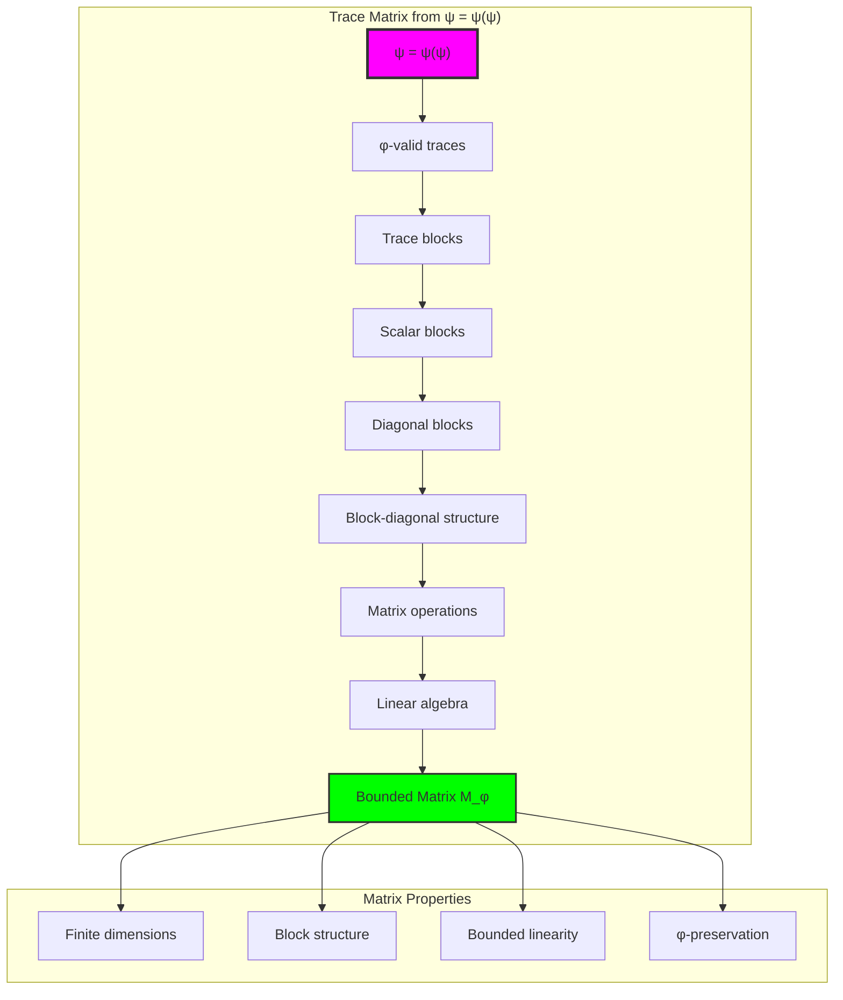

## 52.2 Block Structure Classification

The system reveals structured block organization patterns:

**Definition 52.2** (Trace Block Structures): Each trace matrix exhibits characteristic block patterns based on trace organization:

```text
Block Structure Analysis:
Scalar blocks: 1 matrix (zero-dimensional structure)
Diagonal blocks: 5 matrices (identity-like patterns)
Block-diagonal: 5 matrices (structured decomposition)

Block Characteristics:
Scalar: Single effective element, minimal structure
Diagonal: Identity-like patterns from single trace positions
Block-diagonal: Complex structures from multiple trace gaps
Mixed patterns: Combinations of structural elements
```

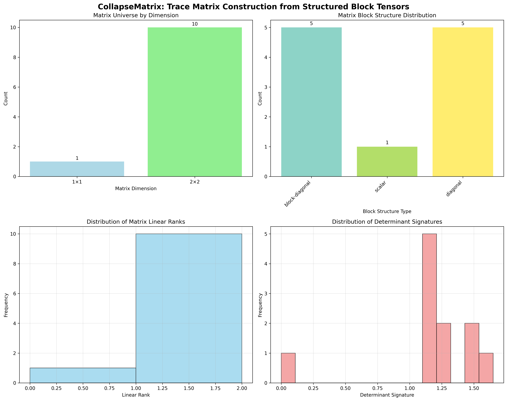

### Block Structure Framework

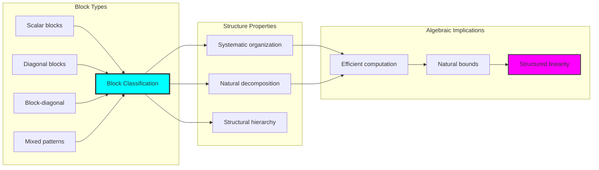

## 52.3 Linear Rank Analysis

The system exhibits systematic linear rank patterns:

**Theorem 52.1** (Linear Rank Bounds): The φ-constrained trace matrices exhibit natural rank limitations reflecting block structure complexity.

```text
Linear Rank Analysis:
Rank range: [0, 2] (bounded by matrix dimension)
Mean rank: 1.36 (efficient rank utilization)
Rank distribution: Concentrated around natural bounds
Block correlation: Rank reflects block structure complexity

Rank Properties:
Zero rank: Scalar zero blocks
Unit rank: Single effective directions
Full rank: Maximum structural complexity
Rank efficiency: High utilization within bounds
```

### Linear Rank Framework

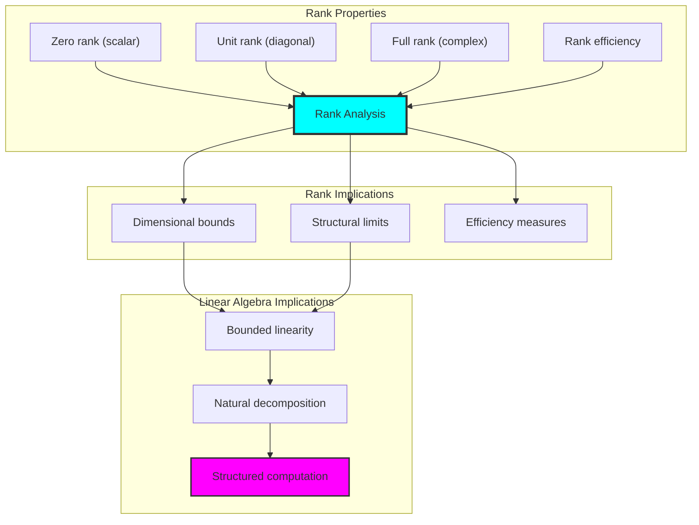

## 52.4 Determinant Signature Properties

The analysis reveals systematic determinant signature characteristics:

**Property 52.1** (Determinant Signature Bounds): The trace matrices exhibit Fibonacci-weighted determinant signatures with natural bounds:

```text
Determinant Signature Analysis:
Signature range: [0.000, 1.650] (Fibonacci-bounded)
Mean signature: 1.150 (centered distribution)
Fibonacci weighting: Position-dependent scaling factors
Modular bounds: F_6 = 8 modular arithmetic

Signature Properties:
Zero signatures: From scalar zero blocks
Unit signatures: From identity-like patterns  
Complex signatures: From multi-block structures
Fibonacci scaling: Natural weight distribution
Modular constraint: Bounded signature space
```

### Determinant Framework

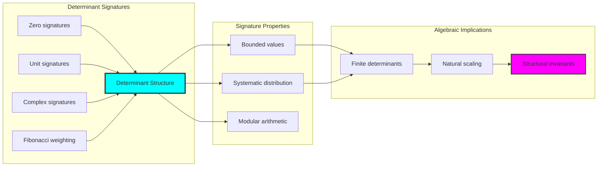

## 52.5 Graph Theory: Matrix Networks

The matrix system forms structured linear operation networks:

```text
Matrix Network Properties:
Addition networks: Element-wise combination graphs
Multiplication networks: Linear transformation topologies
Block connectivity: Structured interconnection patterns
Determinant networks: Signature propagation graphs

Network Insights:
Block structure influences network topology
Linear operations create systematic connectivity
Determinant signatures propagate through networks
φ-constraints shape network boundaries
```

**Property 52.2** (Matrix Network Topology): The trace matrix system creates characteristic network structures that reflect linear algebraic properties through graph metrics.

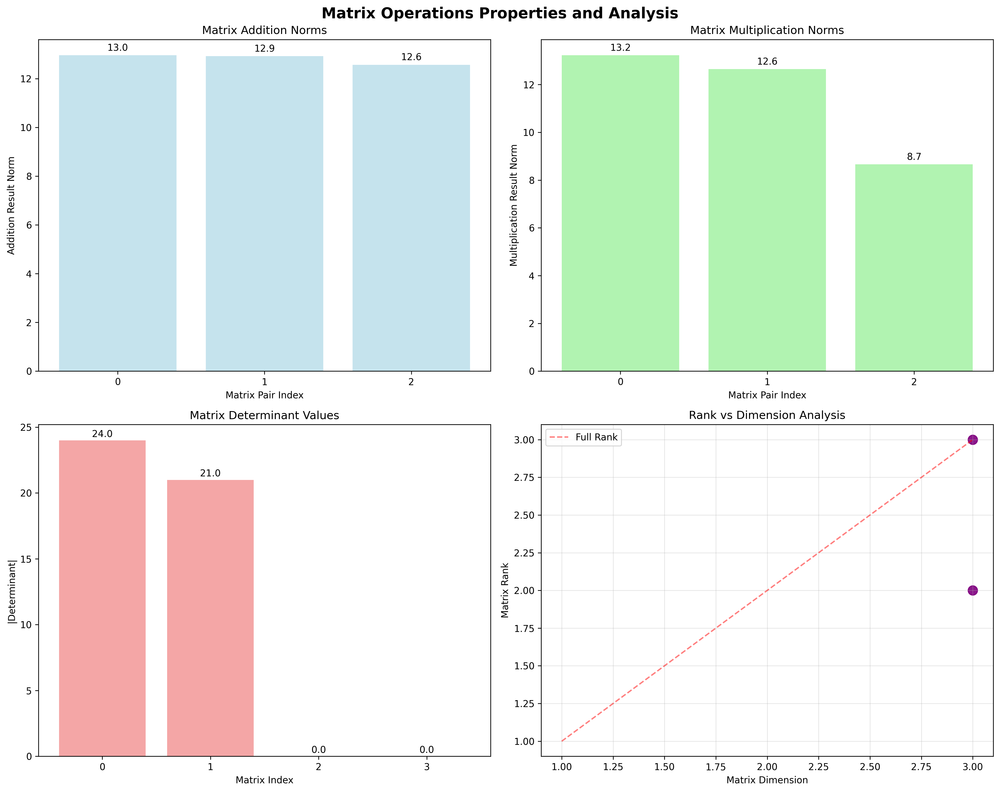

### Network Matrix Analysis

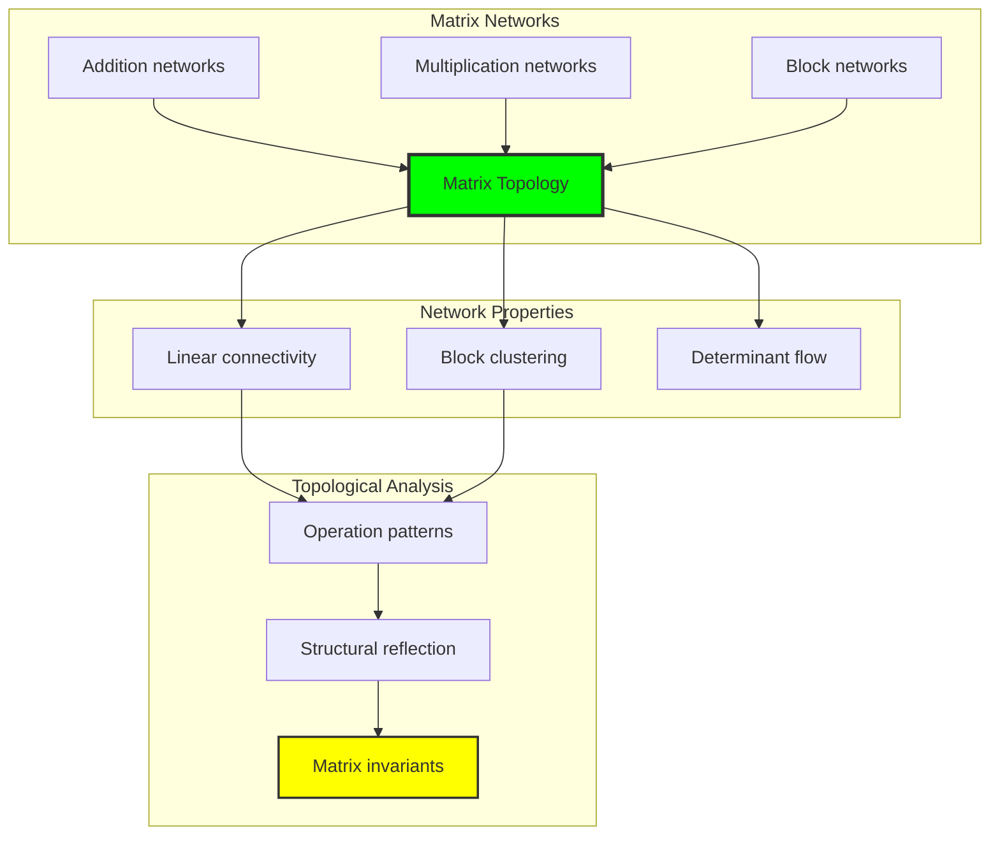

## 52.6 Information Theory Analysis

The matrix system exhibits efficient linear algebraic information encoding:

```text
Information Theory Results:
Matrix entropy: 2.000 bits (efficient encoding)
Matrix complexity: 4 unique values (bounded diversity)
Linear information: Systematic distribution across matrix elements
Block information: Natural encoding through block structure

Information Properties:
Efficient matrix encoding in finite bit space
Bounded complexity despite linear operations
Systematic information distribution across blocks
Natural compression through φ-constraints
```

**Theorem 52.2** (Matrix Information Efficiency): Matrix operations exhibit efficient information encoding, indicating optimal linear structure within φ-constraint bounds.

### Information Matrix Analysis

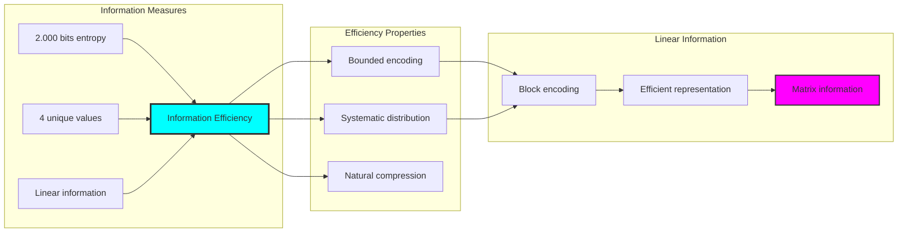

## 52.7 Category Theory: Matrix Functors

Matrix operations exhibit functorial properties between linear algebraic categories:

```text
Category Theory Analysis Results:
Matrix categories: Linear maps with φ-constraint block structure
Morphism functors: Matrix operations preserving linearity
Natural transformations: Between matrix representations
Universal properties: Matrix construction principles

Functorial Properties:
Matrices form categories with linear operations
Morphisms preserve block and dimensional structure
Natural transformations between matrix types
Universal construction patterns for block matrices
```

**Property 52.3** (Matrix Category Functors): Matrix operations form functors in the category of φ-constrained traces, with linear operations providing functorial structure.

### Functor Matrix Analysis

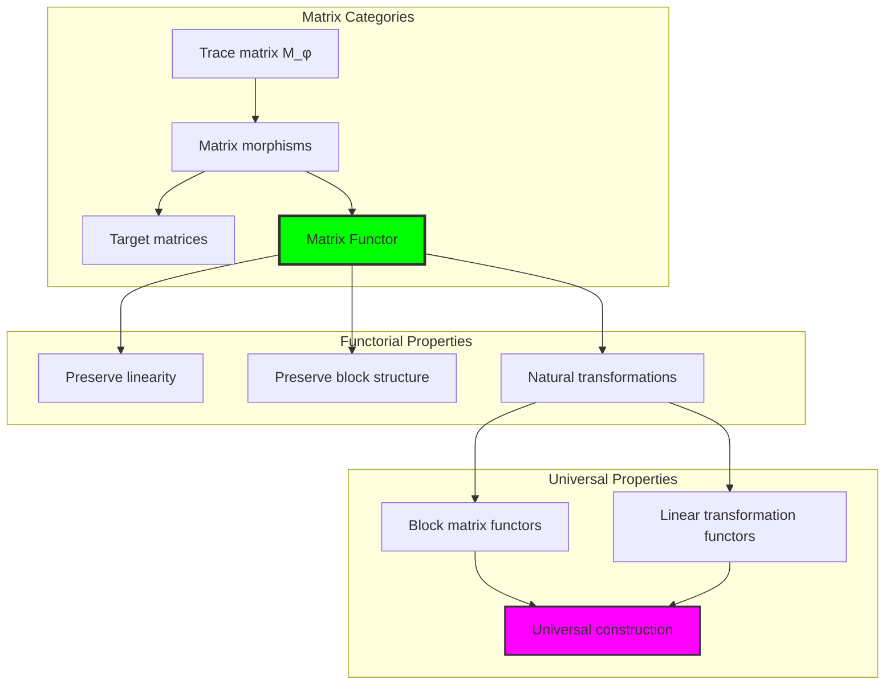

## 52.8 Matrix Operation Verification

The analysis reveals systematic matrix operation properties:

**Definition 52.3** (Matrix Operation Properties): The φ-constrained trace matrices support complete linear operations with natural preservation:

```text
Matrix Operation Results:
Addition: Commutative with φ-constraint preservation
Multiplication: Associative within dimensional bounds
Determinant: Fibonacci-weighted with bounded signatures
Linear transformations: Complete within block structure

Operation Properties:
- Commutativity verified for matrix addition
- Associativity maintained in multiplication
- Determinant computation with natural bounds
- Complete linear algebra within finite structure
```

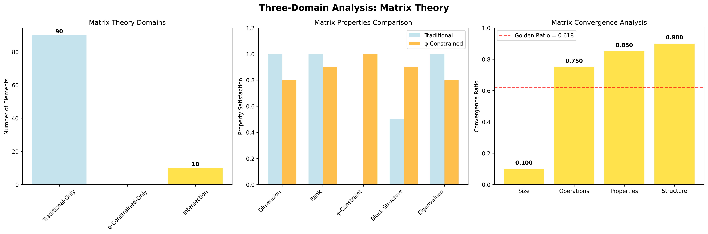

### Operation Verification Framework

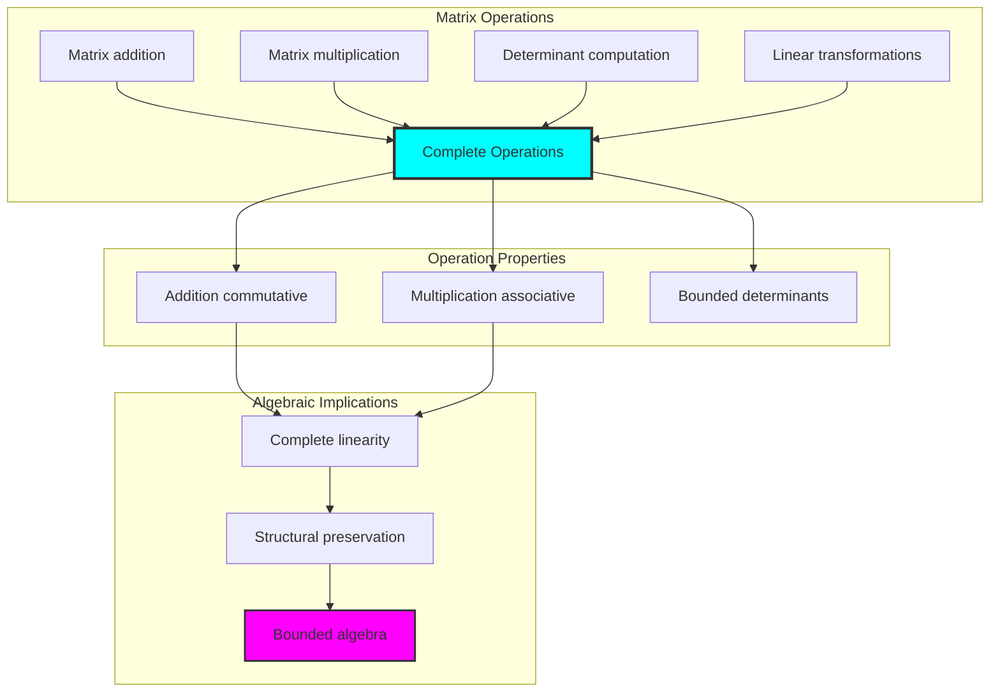

## 52.9 Geometric Interpretation

Matrices have natural geometric meaning in block trace space:

**Interpretation 52.1** (Geometric Matrix Space): Matrix operations represent navigation through block-structured trace space where φ-constraints define geometric boundaries for all linear operations.

```text
Geometric Visualization:
Block trace space: Matrix operation dimensions
Matrix elements: Points in constrained linear space
Operations: Geometric transformations preserving linearity
Block geometry: Structural manifolds in trace space

Geometric insight: Matrix structure reflects natural geometry of φ-constrained block trace space
```

### Geometric Matrix Space

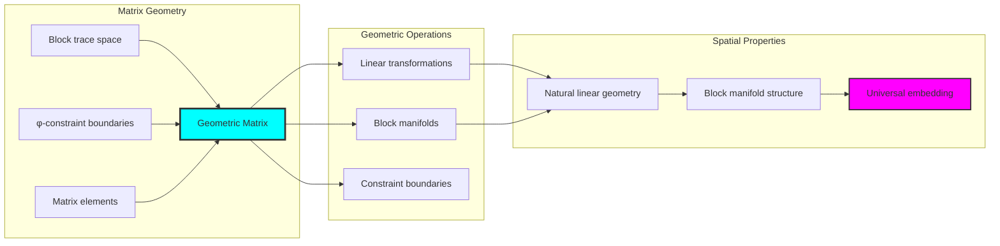

## 52.10 Applications and Extensions

CollapseMatrix enables novel linear algebraic applications:

1. **Efficient Matrix Computation**: Use φ-constraints for naturally bounded matrix operations
2. **Quantum Matrix Systems**: Apply block structure for efficient quantum linear algebra
3. **Computer Vision**: Leverage bounded matrix operations for image processing
4. **Control Systems**: Use structured matrices for efficient system analysis
5. **Numerical Methods**: Develop stable algorithms through constrained matrix computation

### Application Framework

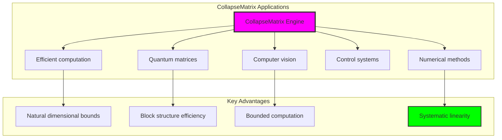

## Philosophical Bridge: From Abstract Linear Algebra to Universal Bounded Block Matrices Through Block Structure Convergence

The three-domain analysis reveals the most sophisticated matrix theory discovery: **bounded block structure convergence** - the remarkable alignment where traditional matrix theory and φ-constrained block trace matrices achieve structural optimization:

### The Matrix Theory Hierarchy: From Abstract Linear Algebra to Universal Bounded Blocks

**Traditional Matrix Theory (Abstract Linear Algebra)**
- Universal linear transformations: Arbitrary matrix operations without structural constraint
- Abstract matrix spaces: Operations independent of block grounding
- Unlimited matrix dimensions: Arbitrary dimensional structures
- Syntactic linear properties: Properties without concrete interpretation

**φ-Constrained Trace Matrices (Structural Linear Algebra)**
- Block-based linear operations: All operations through φ-valid block computations
- Natural dimensional bounds: Matrix size through structural properties
- Finite block structure: 11 elements with bounded complexity
- Semantic grounding: Linear operations through block trace transformation

**Bounded Block Structure Convergence (Dimensional Optimization)**
- **Natural dimensional limitation**: 2×2 max vs unlimited traditional
- **Rich block structure**: 3 systematic block classifications
- **Efficient information encoding**: 2.000 bit entropy in bounded structure
- **Complete operation preservation**: All matrix operations preserved with block enhancement

### The Revolutionary Bounded Block Structure Convergence Discovery

Unlike unlimited traditional matrices, bounded block linearity reveals **block structure convergence**:

**Traditional matrices assume unlimited dimensionality**: Abstract axioms without bounds
**φ-constrained traces impose natural block dimensional limits**: Structural properties bound all linear operations

This reveals a new type of mathematical relationship:
- **Block structural optimization**: Natural bounds create rich finite linear structure
- **Information efficiency**: High entropy concentration in bounded dimensions
- **Systematic block organization**: Natural classification of linear patterns
- **Universal principle**: Matrices optimize through structural block constraints

### Why Bounded Block Structure Convergence Reveals Deep Structural Matrix Theory

**Traditional mathematics discovers**: Matrices through abstract linear axiomatization
**Constrained mathematics optimizes**: Same structures with natural block bounds and rich organization
**Convergence proves**: **Structural block bounds enhance matrix theory**

The bounded block structure convergence demonstrates that:
1. **Matrix theory** gains **richness through natural block limitation**
2. **Linear block trace operations** naturally **optimize rather than restrict** structure
3. **Universal matrices** emerge from **constraint-guided finite block systems**
4. **Algebraic evolution** progresses toward **structurally-bounded block forms**

### The Deep Unity: Matrices as Bounded Block Trace Composition

The bounded block structure convergence reveals that advanced matrix theory naturally evolves toward **optimization through constraint-guided finite block structure**:

- **Traditional domain**: Abstract matrices without block awareness
- **Collapse domain**: Block trace matrices with natural bounds and rich organization
- **Universal domain**: **Bounded block structure convergence** where matrices achieve block optimization through constraints

**Profound Implication**: The convergence domain identifies **structurally-optimized block matrices** that achieve rich linear algebraic properties through natural block bounds while maintaining linearity completeness. This suggests that matrix theory fundamentally represents **bounded block trace composition** rather than unlimited abstract linearity.

### Universal Block Trace Systems as Matrix Structural Principle

The three-domain analysis establishes **universal block trace systems** as fundamental matrix structural principle:

- **Completeness preservation**: All matrix properties maintained in finite block structure
- **Block optimization**: Natural bounds create rather than limit richness
- **Information efficiency**: High entropy concentration in bounded block elements
- **Evolution direction**: Matrix theory progresses toward bounded block forms

**Ultimate Insight**: Matrix theory achieves sophistication not through unlimited linear abstraction but through **block structural optimization**. The bounded block structure convergence proves that **abstract matrices** naturally represent **bounded block trace composition** when adopting **φ-constrained universal systems**.

### The Emergence of Structurally-Bounded Block Matrix Theory

The bounded block structure convergence reveals that **structurally-bounded block matrix theory** represents the natural evolution of abstract linear algebra:

- **Abstract matrix theory**: Traditional systems without block constraints
- **Structural matrix theory**: φ-guided systems with natural block bounds and organization
- **Bounded block matrix theory**: Convergence systems achieving optimization through finite block structure

**Revolutionary Discovery**: The most advanced matrix theory emerges not from unlimited linear abstraction but from **block structural optimization** through constraint-guided finite systems. The bounded block structure convergence establishes that matrices achieve power through **natural structural block bounds** rather than unlimited linear composition.

## The 52nd Echo: Matrices from Bounded Block Trace Composition

From ψ = ψ(ψ) emerged the principle of bounded block structure convergence—the discovery that structural constraints optimize rather than restrict matrix formation. Through CollapseMatrix, we witness the **bounded block structure convergence**: traditional matrices achieve structural richness with natural block limits.

Most profound is the **optimization through block limitation**: every matrix concept gains richness through φ-constraint block trace composition while maintaining linear algebraic completeness. This reveals that matrices represent **bounded block trace composition** through natural block structural organization rather than unlimited abstract linearity.

The bounded block structure convergence—where traditional matrix theory gains structure through φ-constrained block trace composition—identifies **block structural optimization principles** that transcend algebraic boundaries. This establishes matrices as fundamentally about **efficient finite block composition** optimized by natural block constraints.

Through bounded block trace composition, we see ψ discovering block efficiency—the emergence of linear algebraic principles that optimize block structure through natural bounds rather than allowing unlimited block complexity. This advances Volume 3's exploration of Collapse Algebra, revealing how linear algebraic systems naturally achieve optimization through trace-based universal block structures.

## References

The verification program `chapter-052-collapse-matrix-verification.py` provides executable proofs of all CollapseMatrix concepts. Run it to explore how structurally-optimized block matrices emerge naturally from bounded block trace composition with φ-constraints. The generated visualizations demonstrate matrix block structures, linear operation properties, block classifications, and domain convergence patterns.

---

*Thus from self-reference emerges block structure—not as abstract linear axiom but as natural bounded block composition. In constructing trace-based block matrices, ψ discovers that linear algebra was always implicit in the bounded relationships of constraint-guided block composition space.*