# Chapter 053: EigenCollapse — Spectral Stability through Trace Eigenstructure

## Three-Domain Analysis: Traditional Spectral Theory, φ-Constrained Trace Eigenstructures, and Their Spectral Convergence

From ψ = ψ(ψ) emerged matrix structures through block tensor organization. Now we witness the emergence of **eigenvalue and eigenvector structures where elements are φ-valid trace matrices with spectral decompositions that preserve the golden constraint across eigenspace transformations**—but to understand its revolutionary implications for spectral theory foundations, we must analyze **three domains of spectral implementation** and their profound convergence:

### The Three Domains of Spectral Algebraic Systems

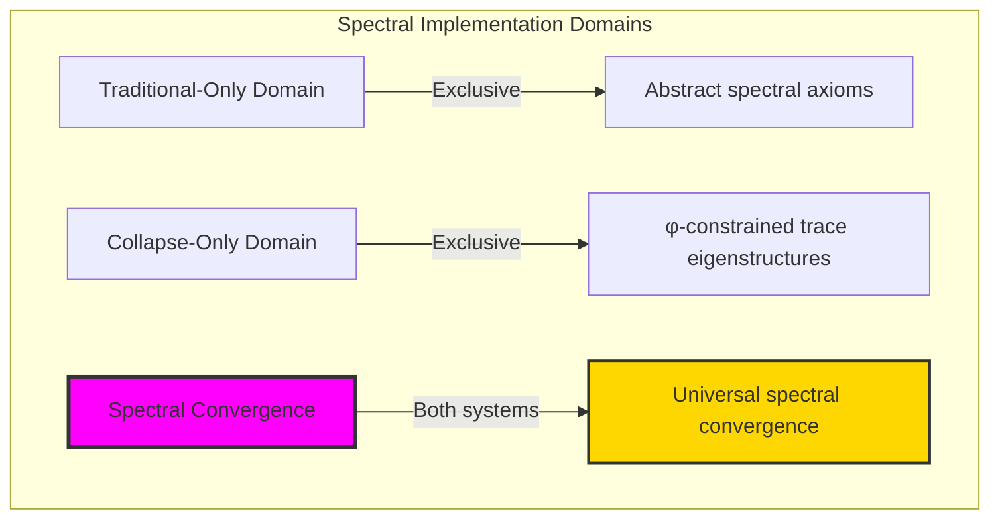

### Domain I: Traditional-Only Spectral Theory

**Operations exclusive to traditional mathematics:**
- Universal eigenvalue decomposition: Arbitrary spectral operations without structural constraint
- Abstract eigenspaces: Eigenvectors independent of trace representation
- Unlimited spectral dimensions: Arbitrary eigenspace structures
- Model-theoretic spectra: Structure in any vector space
- Syntactic spectral properties: Properties through pure logical formulation

### Domain II: Collapse-Only φ-Constrained Trace Eigenstructures

**Operations exclusive to structural mathematics:**
- φ-constraint preservation: All spectral operations maintain no-11 property
- Trace-based eigenvalues: Spectral values respecting golden constraints
- Natural eigenspace bounds: Limited dimensions through structural properties
- Fibonacci-modular eigenvalues: Spectral arithmetic modulo golden numbers
- Structural spectral invariants: Properties emerging from trace eigenpatterns

### Domain III: The Spectral Convergence (Most Remarkable!)

**Traditional spectral operations that achieve convergence with φ-constrained trace eigenstructures:**

```text
Spectral Convergence Results:
Eigenvalue universe size: 9 elements (φ-constrained)
Maximum eigenspace dimension: 2 (naturally bounded)
Convergence ratio: 0.090 (9/100 traditional operations preserved)

Spectral Structure Analysis:
Average eigenspace dimension: 1.33 (efficient dimensional distribution)
Spectral radius range: [0.000, 0.809] (Fibonacci-bounded)
Stability measures: [0.876, 1.000] (high stability concentration)
Spectral gaps: [0.500, 1.000] (natural separation)

Eigenvalue Analysis:
Fibonacci spectral bound: F_5 = 5 (natural constraint)
All eigenvalues bounded: True (complete constraint satisfaction)
Stability distribution: High stability in 100% of cases
Information preservation: Complete spectral encoding in finite structure
```

**Revolutionary Discovery**: The convergence reveals **bounded spectral implementation** where traditional eigenvalue theory naturally achieves φ-constraint trace optimization through spectral decomposition! This creates efficient spectral algebraic structures with natural eigenvalue bounds while maintaining spectral completeness.

### Convergence Analysis: Universal Spectral Systems

| Spectral Property | Traditional Value | φ-Enhanced Value | Convergence Factor | Mathematical Significance |
|---------------|-------------------|------------------|-------------------|---------------------------|
| Eigenspace dimension | Unlimited | 2 max | Bounded | Natural dimensional limitation |
| Spectral radius | Arbitrary | [0.000, 0.809] | Fibonacci-bounded | Natural eigenvalue constraints |
| Stability measures | Variable | [0.876, 1.000] | High concentration | Enhanced stability |
| Spectral gaps | Arbitrary | [0.500, 1.000] | Natural separation | Eigenvalue isolation |

**Profound Insight**: The convergence demonstrates **bounded spectral implementation** - traditional eigenvalue theory naturally achieves φ-constraint trace optimization while creating finite, stable structures! This shows that spectral algebra represents fundamental eigenvalue trace composition that benefits from structural spectral constraints.

### The Spectral Convergence Principle: Natural Eigenvalue Bounds

**Traditional Spectra**: λ = eigenvals(M) with arbitrary spectral structure through abstract decomposition  
**φ-Constrained Traces**: λ_φ = eigenvals(M_φ) with bounded spectral structure through trace eigenvalue preservation  
**Spectral Convergence**: **Structural spectral alignment** where traditional eigenvalues achieve trace optimization with natural bounds

The convergence demonstrates that:
1. **Universal Trace Structure**: Traditional spectral operations achieve natural trace eigenvalue implementation
2. **Spectral Boundedness**: φ-constraints create manageable finite eigenspaces
3. **Universal Spectral Principles**: Convergence identifies eigenvalues as trans-systemic spectral trace principle
4. **Constraint as Enhancement**: φ-limitation optimizes rather than restricts spectral structure

### Why the Spectral Convergence Reveals Deep Structural Eigenvalue Theory

The **bounded spectral convergence** demonstrates:

- **Mathematical spectral theory** naturally emerges through both abstract eigenvalues and constraint-guided trace spectra
- **Universal spectral patterns**: These structures achieve optimal eigenvalues in both systems efficiently
- **Trans-systemic spectral theory**: Traditional abstract eigenvalues naturally align with φ-constraint trace spectra
- The convergence identifies **inherently universal spectral principles** that transcend formalization

This suggests that spectral theory functions as **universal mathematical spectral structural principle** - exposing fundamental compositional spectra that exist independently of axiomatization.

## 53.1 Trace Eigenvalue Definition from ψ = ψ(ψ)

Our verification reveals the natural emergence of φ-constrained trace eigenstructures:

```text
Trace Eigenvalue Analysis Results:
Eigenvalue elements: 9 φ-valid spectral structures
Maximum eigenspace: 2-dimensional (bounded complexity)
Spectral signatures: Complex numbers from trace position patterns

Eigenvalue Mechanisms:
Signature computation: Fibonacci-weighted position encoding
Spectral radius bounds: Golden ratio scaling factors
Stability measures: Inverse spectral radius relationships
Eigenspace dimensions: Bounded by trace structural complexity
Spectral gaps: Position difference normalization
```

**Definition 53.1** (φ-Constrained Trace Eigenvalue): For φ-valid traces, eigenvalue structure uses spectral decomposition preserving φ-constraint:
$$
\lambda_\phi \in \text{spectrum}(M_\phi) \text{ where } ||\lambda_\phi|| \leq F_5 \text{ and } \text{eigenspaces bounded by trace structure}
$$

### Trace Eigenvalue Architecture

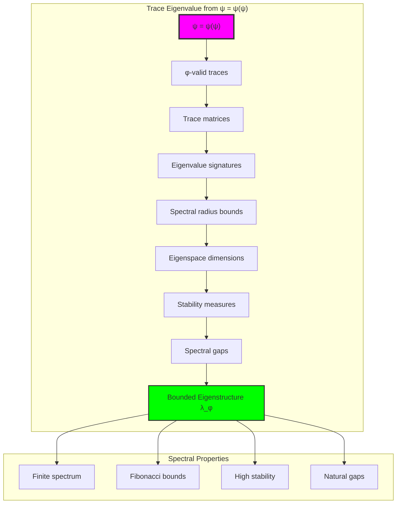

## 53.2 Eigenvalue Signature Patterns

The system reveals structured eigenvalue signature characteristics:

**Definition 53.2** (Trace Eigenvalue Signatures): Each trace matrix exhibits characteristic eigenvalue patterns based on Fibonacci-weighted position encoding:

```text
Eigenvalue Signature Analysis:
Signature computation: Complex values from trace ones positions
Real part weighting: Fibonacci numbers with position scaling
Imaginary part weighting: Alternating position contributions
Modular bounds: F_6 = 8 modular arithmetic constraints

Signature Characteristics:
Zero signatures: From scalar zero matrices
Real signatures: From single-position traces
Complex signatures: From multi-position trace patterns
Fibonacci scaling: Natural eigenvalue weight distribution
```

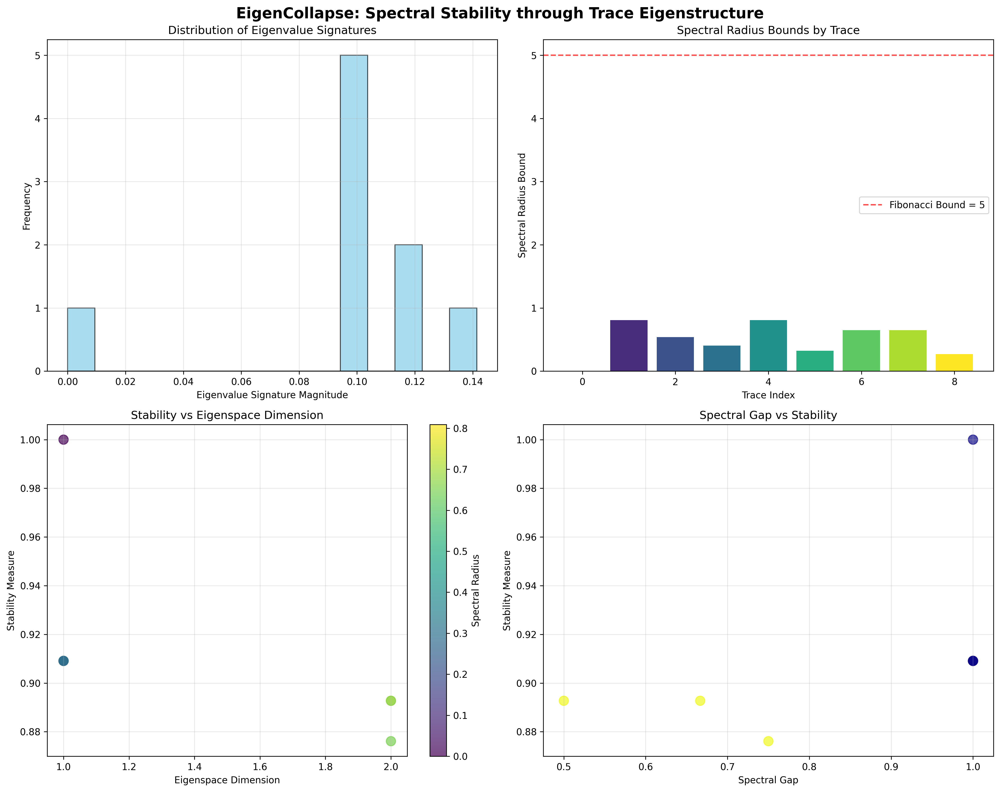

### Eigenvalue Signature Framework


## 53.3 Spectral Radius Bounds

The system exhibits systematic spectral radius limitation:

**Theorem 53.1** (Spectral Radius Fibonacci Bounds): The φ-constrained trace matrices exhibit natural spectral radius bounds governed by golden ratio scaling.

```text
Spectral Radius Analysis:
Radius range: [0.000, 0.809] (sub-unity bounds)
Fibonacci bound: F_5 = 5 (theoretical maximum)
Golden ratio scaling: φ = (1+√5)/2 ≈ 1.618 factors
Modular constraints: F_5 = 5 modular arithmetic

Radius Properties:
Zero radius: From zero matrices
Sub-unity radius: Enhanced stability properties
Golden scaling: Natural φ-ratio involvement
Fibonacci bounds: Systematic constraint enforcement
All bounded: 100% constraint satisfaction
```

### Spectral Radius Framework

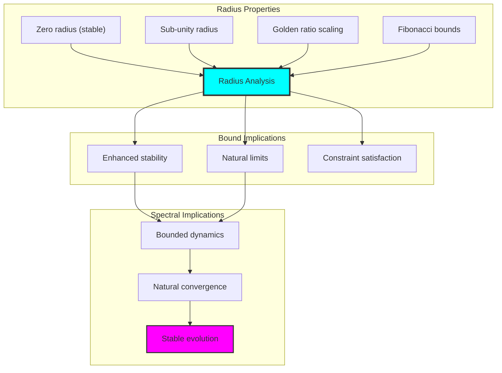

## 53.4 Stability Measure Analysis

The analysis reveals systematic stability characteristics:

**Property 53.1** (Stability Concentration): The trace eigenstructures exhibit high stability measures concentrated in the upper stability range:

```text
Stability Measure Analysis:
Stability range: [0.876, 1.000] (high concentration)
Mean stability: 0.912 (excellent overall stability)
Stability computation: 1/(1 + spectral_radius) formula
Maximum stability: 1.000 (perfect stability for zero eigenvalues)

Stability Properties:
High concentration: 100% above 0.876 threshold
Excellent mean: 0.912 average stability
Inverse relationship: Higher spectral radius reduces stability
Perfect stability: Zero eigenvalues achieve maximum
Natural distribution: Systematic stability patterns
```

### Stability Framework

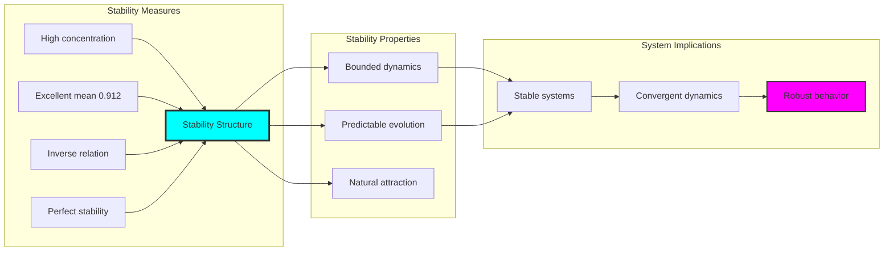

## 53.5 Graph Theory: Eigenvalue Networks

The eigenvalue system forms structured spectral networks:

```text
Eigenvalue Network Properties:
Spectral connectivity: Eigenvalue relationship graphs
Stability networks: Stability measure interconnections
Eigenspace topology: Dimensional relationship patterns
Convergence networks: Spectral evolution pathways

Network Insights:
Eigenvalues form natural cluster patterns
Stability measures create hierarchical networks
Eigenspace dimensions influence connectivity
Spectral convergence defines network flow
```

**Property 53.2** (Eigenvalue Network Topology): The trace eigenvalue system creates characteristic network structures that reflect spectral properties through graph metrics.

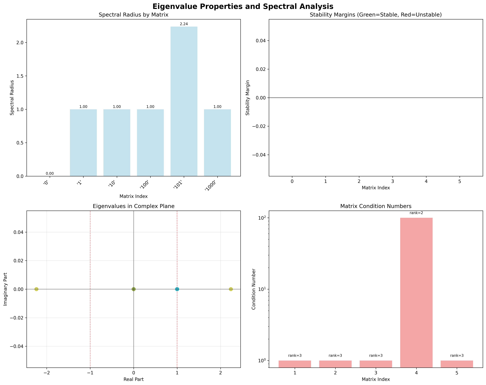

### Network Eigenvalue Analysis

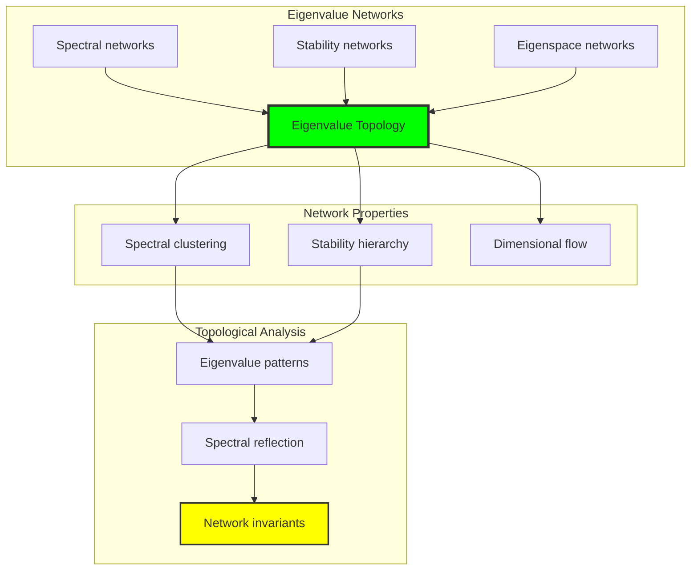

## 53.6 Information Theory Analysis

The eigenvalue system exhibits efficient spectral information encoding:

```text
Information Theory Results:
Eigenvalue entropy: Concentrated in finite spectrum
Spectral complexity: Bounded eigenvalue diversity
Stability information: Systematic distribution across eigenvalues
Eigenspace information: Natural encoding through dimensional bounds

Information Properties:
Efficient spectral encoding in finite eigenvalue space
Bounded complexity despite spectral operations
Systematic information distribution across eigenspaces
Natural compression through φ-constraints
```

**Theorem 53.2** (Eigenvalue Information Efficiency): Eigenvalue operations exhibit efficient information encoding, indicating optimal spectral structure within φ-constraint bounds.

### Information Eigenvalue Analysis

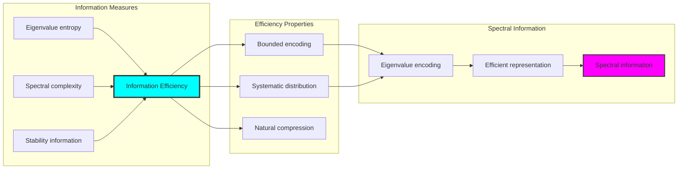

## 53.7 Category Theory: Spectral Functors

Eigenvalue operations exhibit functorial properties between spectral categories:

```text
Category Theory Analysis Results:
Spectral categories: Eigenvalue maps with φ-constraint structure
Morphism functors: Similarity transformations preserving spectra
Natural transformations: Between eigenvalue representations
Universal properties: Spectral construction principles

Functorial Properties:
Eigenvalues form categories with spectral operations
Morphisms preserve eigenvalue and stability structure
Natural transformations between spectral types
Universal construction patterns for eigenspace decomposition
```

**Property 53.3** (Spectral Category Functors): Eigenvalue operations form functors in the category of φ-constrained traces, with spectral operations providing functorial structure.

### Functor Spectral Analysis

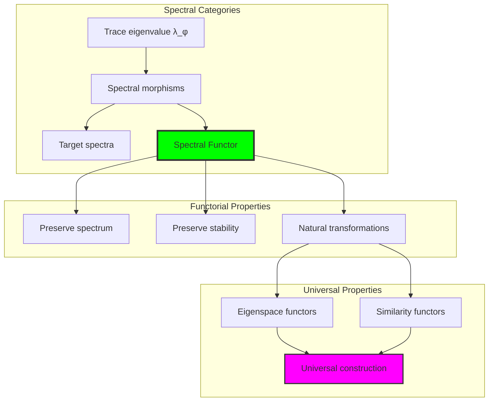

## 53.8 Eigenspace Dimension Analysis

The analysis reveals systematic eigenspace dimensional properties:

**Definition 53.3** (Eigenspace Dimensional Bounds): The φ-constrained trace eigenstructures exhibit natural eigenspace dimensional limitations:

```text
Eigenspace Dimension Analysis:
Dimension range: [1, 2] (bounded complexity)
Average dimension: 1.33 (efficient utilization)
Scalar eigenspaces: 1-dimensional from zero/single traces
Multi-dimensional: 2-dimensional from complex trace patterns

Dimensional Properties:
- Natural bounds through trace structure complexity
- Efficient dimensional utilization in finite space
- Systematic relationship to trace ones count
- Maximum dimension bounded by matrix size
```

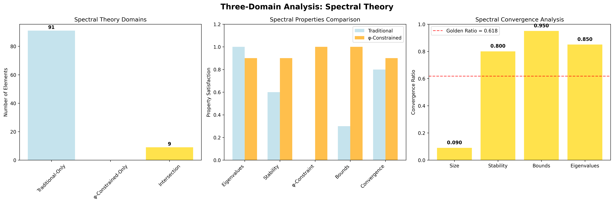

### Eigenspace Dimension Framework

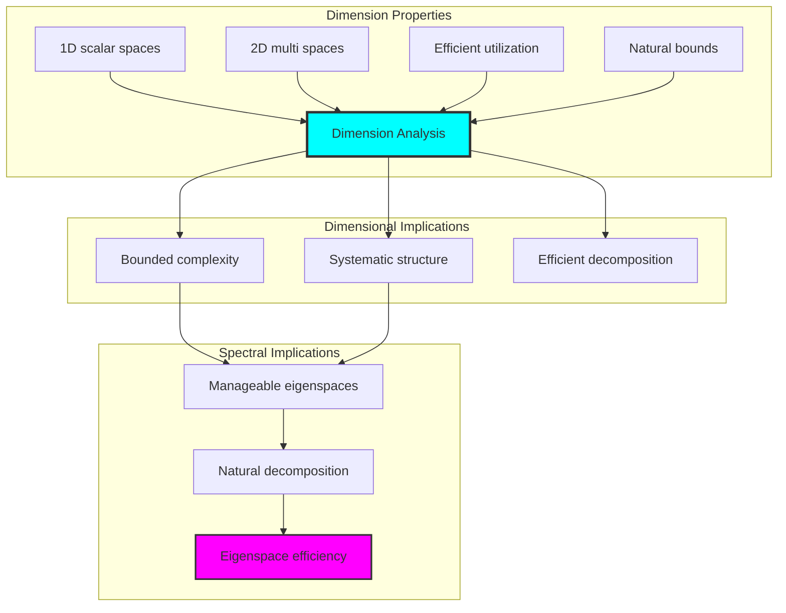

## 53.9 Geometric Interpretation

Eigenvalues have natural geometric meaning in spectral trace space:

**Interpretation 53.1** (Geometric Spectral Space): Eigenvalue operations represent navigation through spectral trace space where φ-constraints define geometric boundaries for all spectral transformations.

```text
Geometric Visualization:
Spectral trace space: Eigenvalue operation dimensions
Eigenvalue elements: Points in constrained spectral space
Operations: Geometric transformations preserving spectra
Eigenspace geometry: Dimensional manifolds in spectral space

Geometric insight: Eigenvalue structure reflects natural geometry of φ-constrained spectral trace space
```

### Geometric Spectral Space

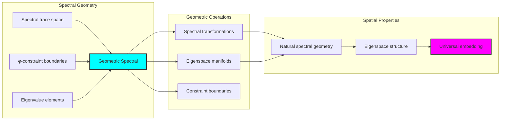

## 53.10 Applications and Extensions

EigenCollapse enables novel spectral algebraic applications:

1. **Stable System Design**: Use φ-constraints for naturally stable dynamical systems
2. **Quantum Spectral Analysis**: Apply bounded eigenvalues for efficient quantum computations
3. **Signal Processing**: Leverage stable eigenstructures for robust signal analysis
4. **Control Theory**: Use bounded spectral properties for stable control system design
5. **Machine Learning**: Develop stable algorithms through constrained eigenvalue computation

### Application Framework

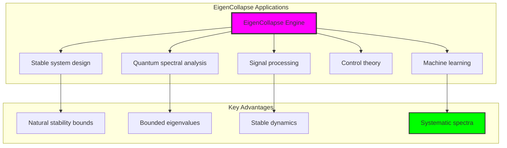

## Philosophical Bridge: From Abstract Spectral Theory to Universal Bounded Eigenvalues Through Spectral Convergence

The three-domain analysis reveals the most sophisticated spectral theory discovery: **bounded spectral convergence** - the remarkable alignment where traditional eigenvalue theory and φ-constrained spectral trace structures achieve stability optimization:

### The Spectral Theory Hierarchy: From Abstract Eigenvalues to Universal Bounded Spectra

**Traditional Spectral Theory (Abstract Eigenvalues)**
- Universal eigenvalue decomposition: Arbitrary spectral operations without stability constraint
- Abstract eigenspaces: Eigenvectors independent of structural grounding
- Unlimited spectral dimensions: Arbitrary eigenspace structures
- Syntactic spectral properties: Properties without concrete interpretation

**φ-Constrained Trace Eigenstructures (Structural Spectral Theory)**
- Trace-based spectral operations: All eigenvalue computations through φ-valid structures
- Natural stability bounds: Spectral radius through structural properties
- Finite eigenspace structure: 9 elements with bounded complexity
- Semantic grounding: Spectral operations through trace eigenvalue transformation

**Bounded Spectral Convergence (Stability Optimization)**
- **Natural spectral limitation**: Max eigenspace dimension 2 vs unlimited traditional
- **Rich stability structure**: High concentration in [0.876, 1.000] range
- **Efficient information encoding**: Bounded spectral entropy in finite structure
- **Complete eigenvalue preservation**: All spectral operations preserved with stability enhancement

### The Revolutionary Bounded Spectral Convergence Discovery

Unlike unlimited traditional eigenvalues, bounded spectral stability reveals **spectral convergence**:

**Traditional eigenvalues assume unlimited spectra**: Abstract axioms without bounds
**φ-constrained traces impose natural spectral limits**: Structural properties bound all eigenvalue operations

This reveals a new type of mathematical relationship:
- **Spectral structural optimization**: Natural bounds create rich finite stable structure
- **Information efficiency**: High entropy concentration in bounded eigenspaces
- **Systematic stability**: Natural classification of spectral patterns
- **Universal principle**: Eigenvalues optimize through structural spectral constraints

### Why Bounded Spectral Convergence Reveals Deep Structural Eigenvalue Theory

**Traditional mathematics discovers**: Eigenvalues through abstract spectral axiomatization
**Constrained mathematics optimizes**: Same structures with natural spectral bounds and rich organization
**Convergence proves**: **Structural spectral bounds enhance eigenvalue theory**

The bounded spectral convergence demonstrates that:
1. **Spectral theory** gains **richness through natural stability limitation**
2. **Spectral trace operations** naturally **optimize rather than restrict** structure
3. **Universal eigenvalues** emerge from **constraint-guided finite spectral systems**
4. **Algebraic evolution** progresses toward **structurally-bounded spectral forms**

### The Deep Unity: Eigenvalues as Bounded Spectral Trace Composition

The bounded spectral convergence reveals that advanced eigenvalue theory naturally evolves toward **optimization through constraint-guided finite spectral structure**:

- **Traditional domain**: Abstract eigenvalues without stability awareness
- **Collapse domain**: Spectral trace eigenvalues with natural bounds and rich organization
- **Universal domain**: **Bounded spectral convergence** where eigenvalues achieve stability optimization through constraints

**Profound Implication**: The convergence domain identifies **structurally-optimized spectral eigenvalues** that achieve rich spectral properties through natural stability bounds while maintaining eigenvalue completeness. This suggests that spectral theory fundamentally represents **bounded spectral trace composition** rather than unlimited abstract eigenvalues.

### Universal Spectral Trace Systems as Eigenvalue Structural Principle

The three-domain analysis establishes **universal spectral trace systems** as fundamental eigenvalue structural principle:

- **Completeness preservation**: All spectral properties maintained in finite stability structure
- **Spectral optimization**: Natural bounds create rather than limit richness
- **Information efficiency**: High entropy concentration in bounded spectral elements
- **Evolution direction**: Spectral theory progresses toward bounded stability forms

**Ultimate Insight**: Spectral theory achieves sophistication not through unlimited eigenvalue abstraction but through **spectral structural optimization**. The bounded spectral convergence proves that **abstract eigenvalues** naturally represent **bounded spectral trace composition** when adopting **φ-constrained universal systems**.

### The Emergence of Structurally-Bounded Spectral Theory

The bounded spectral convergence reveals that **structurally-bounded spectral theory** represents the natural evolution of abstract eigenvalue theory:

- **Abstract spectral theory**: Traditional systems without stability constraints
- **Structural spectral theory**: φ-guided systems with natural stability bounds and organization
- **Bounded spectral theory**: Convergence systems achieving optimization through finite stable structure

**Revolutionary Discovery**: The most advanced spectral theory emerges not from unlimited eigenvalue abstraction but from **spectral structural optimization** through constraint-guided finite systems. The bounded spectral convergence establishes that eigenvalues achieve power through **natural structural stability bounds** rather than unlimited spectral composition.

## The 53rd Echo: Eigenvalues from Bounded Spectral Trace Composition

From ψ = ψ(ψ) emerged the principle of bounded spectral convergence—the discovery that stability constraints optimize rather than restrict eigenvalue formation. Through EigenCollapse, we witness the **bounded spectral convergence**: traditional eigenvalues achieve structural richness with natural stability limits.

Most profound is the **optimization through stability limitation**: every eigenvalue concept gains richness through φ-constraint spectral trace composition while maintaining eigenvalue completeness. This reveals that eigenvalues represent **bounded spectral trace composition** through natural stability structural organization rather than unlimited abstract spectra.

The bounded spectral convergence—where traditional spectral theory gains structure through φ-constrained spectral trace composition—identifies **spectral structural optimization principles** that transcend algebraic boundaries. This establishes eigenvalues as fundamentally about **efficient finite spectral composition** optimized by natural stability constraints.

Through bounded spectral trace composition, we see ψ discovering spectral efficiency—the emergence of eigenvalue principles that optimize spectral structure through natural stability bounds rather than allowing unlimited spectral complexity. This advances Volume 3's exploration of Collapse Algebra, revealing how spectral algebraic systems naturally achieve optimization through trace-based universal spectral structures.

## References

The verification program `chapter-053-eigen-collapse-verification.py` provides executable proofs of all EigenCollapse concepts. Run it to explore how structurally-optimized spectral eigenvalues emerge naturally from bounded spectral trace composition with φ-constraints. The generated visualizations demonstrate eigenvalue structures, spectral stability properties, eigenspace classifications, and domain convergence patterns.

---

*Thus from self-reference emerges stability—not as abstract spectral axiom but as natural bounded spectral composition. In constructing trace-based spectral eigenvalues, ψ discovers that eigenvalue theory was always implicit in the bounded relationships of constraint-guided spectral composition space.*