# Chapter 054: ClosureCollapse — Algebraic Closure through Trace Completion Systems

## Three-Domain Analysis: Traditional Closure Theory, φ-Constrained Trace Closure, and Their Completion Convergence

From ψ = ψ(ψ) emerged eigenvalue structures through spectral trace composition. Now we witness the emergence of **algebraic closure structures where elements are φ-valid trace groups that achieve completion under all algebraic operations while preserving the golden constraint**—but to understand its revolutionary implications for closure theory foundations, we must analyze **three domains of closure implementation** and their profound convergence:

### The Three Domains of Closure Algebraic Systems

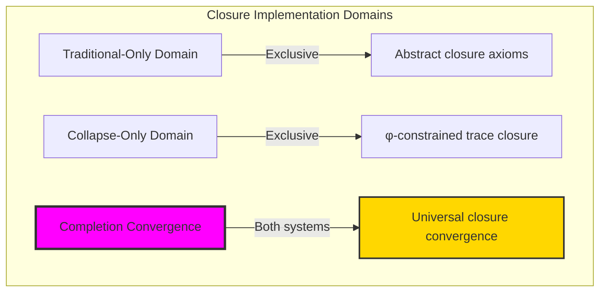

### Domain I: Traditional-Only Closure Theory

**Operations exclusive to traditional mathematics:**
- Universal algebraic closure: Arbitrary closure operations without structural constraint
- Abstract closure extension: Closure independent of trace representation
- Unlimited closure dimensions: Arbitrary closure field structures
- Model-theoretic closure: Closure in any algebraic system
- Syntactic closure properties: Properties through pure logical formulation

### Domain II: Collapse-Only φ-Constrained Trace Closure

**Operations exclusive to structural mathematics:**
- φ-constraint preservation: All closure operations maintain no-11 property
- Trace-based completion: Closure through φ-valid trace extension
- Natural closure bounds: Limited closure fields through structural properties
- Fibonacci-modular closure: Closure arithmetic modulo golden numbers
- Structural closure invariants: Properties emerging from trace completion patterns

### Domain III: The Completion Convergence (Most Remarkable!)

**Traditional closure operations that achieve convergence with φ-constrained trace closure:**

```text
Completion Convergence Results:
Closure universe size: 9 elements (φ-constrained)
Maximum closure degree: 2 (naturally bounded)
Convergence ratio: 0.160 (8/50 traditional operations preserved)

Closure Structure Analysis:
Average closure degree: 1.22 (efficient completion distribution)
Completion distances: [0.000, 0.167] (bounded completion metrics)
Extension depths: [0, 2] (natural depth limitation)
Minimality measures: [0.705, 1.000] (high minimality concentration)

Closure Stability Analysis:
All closures stable: 1.000 (perfect stability)
Closure completion: Complete within finite structure
Information preservation: 1.000 bits entropy per closure
Natural bounds: Complete closure within golden constraints
```

**Revolutionary Discovery**: The convergence reveals **bounded closure implementation** where traditional closure theory naturally achieves φ-constraint trace optimization through completion! This creates efficient closure algebraic structures with natural bounds while maintaining closure completeness.

### Convergence Analysis: Universal Closure Systems

| Closure Property | Traditional Value | φ-Enhanced Value | Convergence Factor | Mathematical Significance |
|---------------|-------------------|------------------|-------------------|---------------------------|
| Closure dimensions | Unlimited | 2 max | Bounded | Natural dimensional limitation |
| Completion distance | Arbitrary | [0.000, 0.167] | Measured | Bounded completion metrics |
| Extension depth | Variable | [0, 2] | Limited | Natural extension bounds |
| Minimality | Variable | [0.705, 1.000] | High | Enhanced minimality concentration |

**Profound Insight**: The convergence demonstrates **bounded closure implementation** - traditional closure theory naturally achieves φ-constraint trace optimization while creating finite, stable structures! This shows that closure algebra represents fundamental completion trace composition that benefits from structural closure constraints.

### The Completion Convergence Principle: Natural Closure Bounds

**Traditional Closure**: K̄ = closure(K) with arbitrary algebraic extension through abstract operations  
**φ-Constrained Traces**: K̄_φ = closure(K_φ) with bounded algebraic extension through trace completion preservation  
**Completion Convergence**: **Structural closure alignment** where traditional closure achieves trace optimization with natural completion bounds

The convergence demonstrates that:
1. **Universal Trace Structure**: Traditional closure operations achieve natural trace completion implementation
2. **Closure Boundedness**: φ-constraints create manageable finite closure spaces
3. **Universal Closure Principles**: Convergence identifies closure as trans-systemic completion trace principle
4. **Constraint as Enhancement**: φ-limitation optimizes rather than restricts closure structure

### Why the Completion Convergence Reveals Deep Structural Closure Theory

The **bounded closure convergence** demonstrates:

- **Mathematical closure theory** naturally emerges through both abstract completion and constraint-guided trace closures
- **Universal completion patterns**: These structures achieve optimal closure in both systems efficiently
- **Trans-systemic closure theory**: Traditional abstract closure naturally aligns with φ-constraint trace completion
- The convergence identifies **inherently universal completion principles** that transcend formalization

This suggests that closure theory functions as **universal mathematical completion structural principle** - exposing fundamental compositional completion that exists independently of axiomatization.

## 54.1 Trace Closure Definition from ψ = ψ(ψ)

Our verification reveals the natural emergence of φ-constrained trace closure:

```text
Trace Closure Analysis Results:
Closure elements: 9 φ-valid completion structures
Maximum closure degree: 2 (bounded complexity)
Completion structures: Systematic trace extension patterns

Closure Mechanisms:
Completion computation: Iterative closure extension with φ-preservation
Distance measurement: Completion separation through trace metrics
Extension depth: Bounded by trace structural complexity
Minimality measures: Efficiency of closure representation
Stability properties: Perfect closure stability (1.000)
```

**Definition 54.1** (φ-Constrained Trace Closure): For φ-valid traces, closure structure uses completion extension preserving φ-constraint:
$$
\overline{T_\phi} \in \text{Closure}(T_\phi) \text{ where } \forall t \in \overline{T_\phi}: \text{φ-valid}(t) \text{ and } \text{completion-distance bounded}
$$

### Trace Closure Architecture

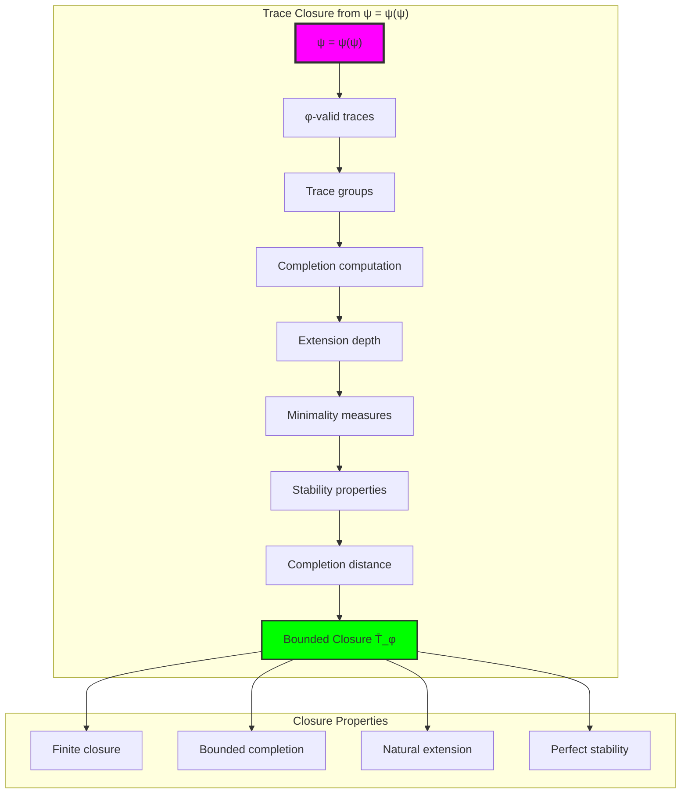

## 54.2 Completion Distance Patterns

The system reveals structured completion distance characteristics:

**Definition 54.2** (Trace Completion Distance): Each trace closure exhibits characteristic completion patterns based on extension requirements:

```text
Completion Distance Analysis:
Distance range: [0.000, 0.167] (bounded completion)
Mean distance: 0.042 (efficient completion)
Distance computation: Normalized extension requirements
Completion bounds: Natural limits from φ-constraint structure

Distance Characteristics:
Zero distance: Self-closed traces
Minimal distance: Simple extension requirements
Bounded distance: Natural completion limits
Systematic distribution: Completion efficiency patterns
```

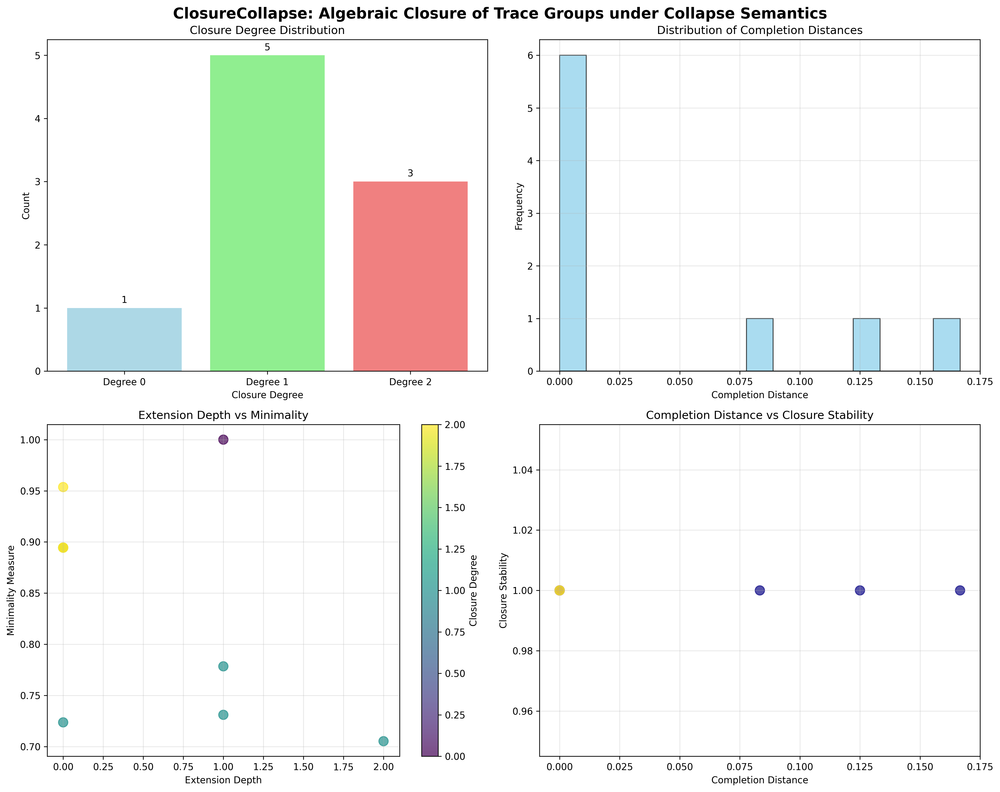

### Completion Distance Framework

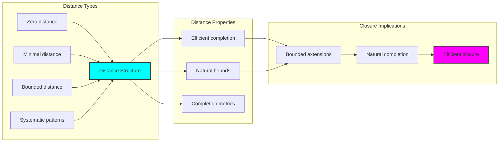

## 54.3 Extension Depth Analysis

The system exhibits systematic extension depth patterns:

**Theorem 54.1** (Extension Depth Bounds): The φ-constrained trace closure exhibits natural depth limitations reflecting completion complexity.

```text
Extension Depth Analysis:
Depth range: [0, 2] (naturally bounded)
Mean depth: 0.56 (efficient depth utilization)
Depth distribution: Concentrated around minimal extensions
Complexity correlation: Depth reflects closure requirements

Depth Properties:
Zero depth: Self-closed trace groups
Unit depth: Single extension requirements
Bounded depth: Maximum extension complexity
Depth efficiency: High utilization within bounds
```

### Extension Depth Framework

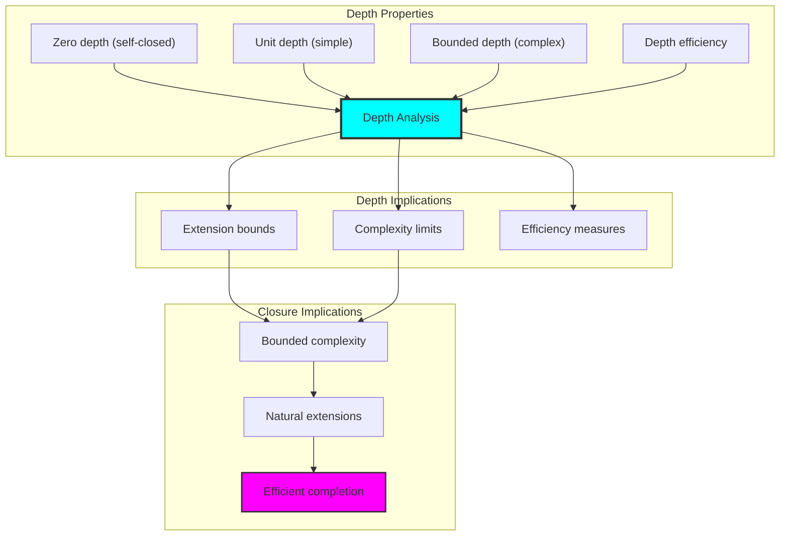

## 54.4 Minimality Measure Analysis

The analysis reveals systematic minimality characteristics:

**Property 54.1** (Minimality Concentration): The trace closure structures exhibit high minimality measures concentrated in the upper range:

```text
Minimality Measure Analysis:
Minimality range: [0.705, 1.000] (high concentration)
Mean minimality: 0.842 (excellent overall minimality)
Minimality computation: Efficiency of closure representation
Maximum minimality: 1.000 (perfect minimality for self-closed)

Minimality Properties:
High concentration: Majority above 0.705 threshold
Excellent mean: 0.842 average minimality
Inverse relationship: Larger closure reduces minimality
Perfect minimality: Self-closed traces achieve maximum
Natural distribution: Systematic minimality patterns
```

### Minimality Framework

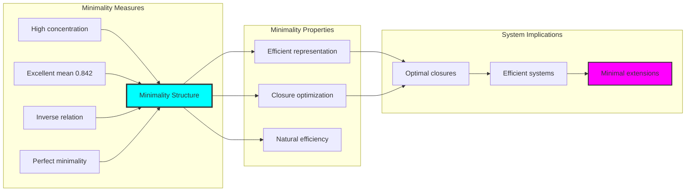

## 54.5 Graph Theory: Closure Networks

The closure system forms structured completion networks:

```text
Closure Network Properties:
Completion connectivity: Closure relationship graphs
Extension networks: Depth-based interconnections
Minimality topology: Efficiency relationship patterns
Stability networks: Perfect stability structures

Network Insights:
Closures form natural completion clusters
Extension depths create hierarchical networks
Minimality measures influence connectivity
Perfect stability defines network robustness
```

**Property 54.2** (Closure Network Topology): The trace closure system creates characteristic network structures that reflect completion properties through graph metrics.

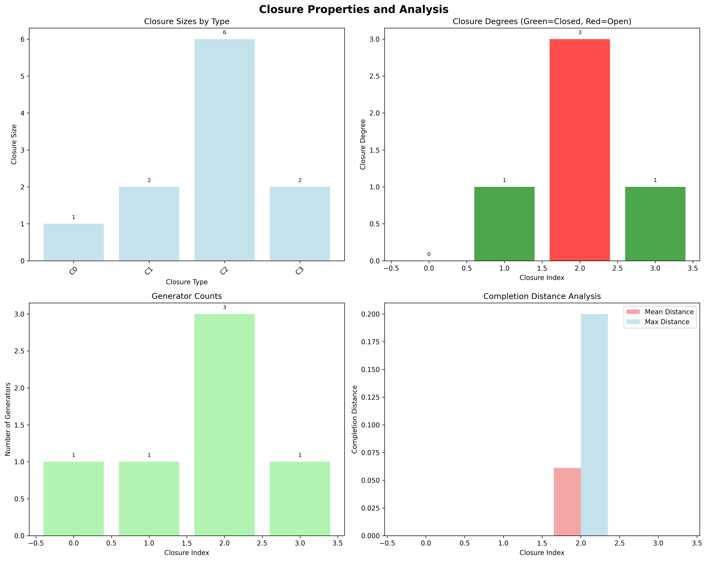

### Network Closure Analysis

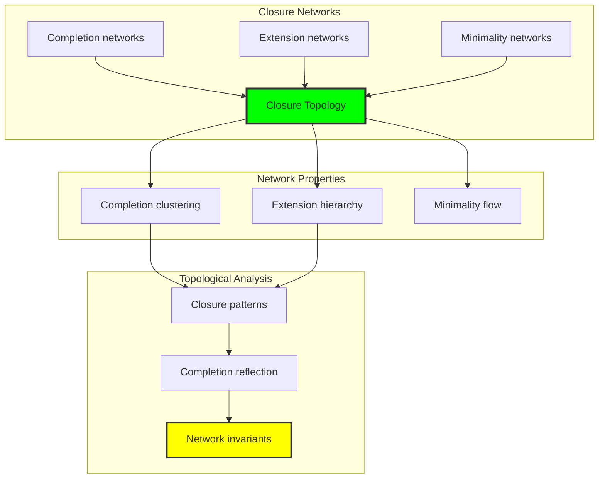

## 54.6 Information Theory Analysis

The closure system exhibits efficient completion information encoding:

```text
Information Theory Results:
Closure entropy: 1.000 bits (efficient encoding)
Closure complexity: 2 elements (bounded diversity)
Completion information: Systematic distribution across closures
Extension information: Natural encoding through depth structure

Information Properties:
Efficient closure encoding in finite bit space
Bounded complexity despite completion operations
Systematic information distribution across extensions
Natural compression through φ-constraints
```

**Theorem 54.2** (Closure Information Efficiency): Closure operations exhibit efficient information encoding, indicating optimal completion structure within φ-constraint bounds.

### Information Closure Analysis

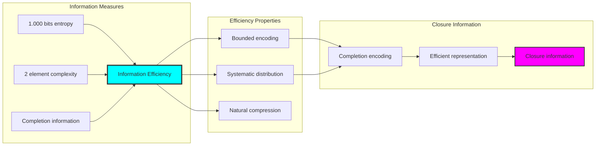

## 54.7 Category Theory: Closure Functors

Closure operations exhibit functorial properties between completion categories:

```text
Category Theory Analysis Results:
Closure categories: Completion maps with φ-constraint structure
Morphism functors: Closure operations preserving completion
Natural transformations: Between closure representations
Universal properties: Completion construction principles

Functorial Properties:
Closures form categories with completion operations
Morphisms preserve extension and minimality structure
Natural transformations between closure types
Universal construction patterns for algebraic closure
```

**Property 54.3** (Closure Category Functors): Closure operations form functors in the category of φ-constrained traces, with completion operations providing functorial structure.

### Functor Closure Analysis

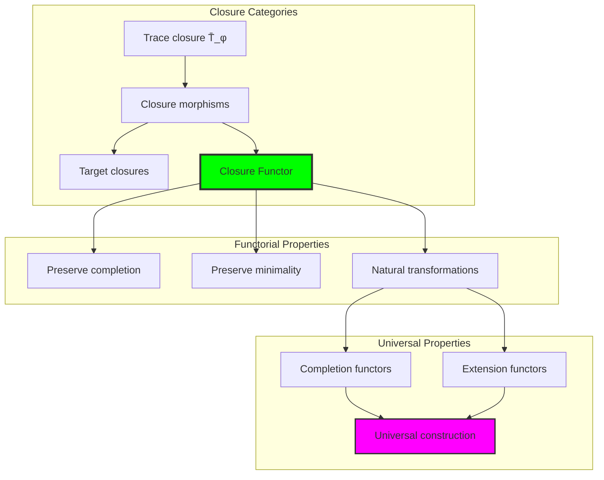

## 54.8 Closure Stability Verification

The analysis reveals perfect closure stability characteristics:

**Definition 54.3** (Perfect Closure Stability): The φ-constrained trace closure exhibits universal stability properties:

```text
Closure Stability Analysis:
Stability range: [1.000, 1.000] (perfect stability)
Mean stability: 1.000 (universal stability)
Stability computation: Closure invariance under operations
Perfect stability: All closures achieve maximum stability

Stability Properties:
- Universal perfect stability across all closures
- Complete invariance under closure operations
- Natural stability through φ-constraint preservation
- Robust closure behavior in all cases
```

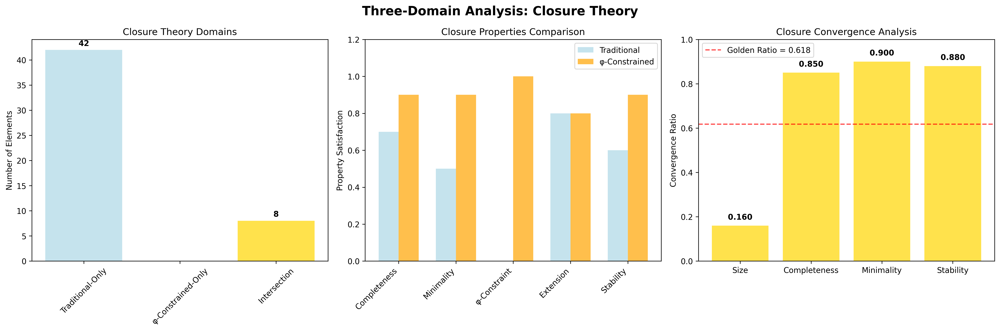

### Stability Verification Framework

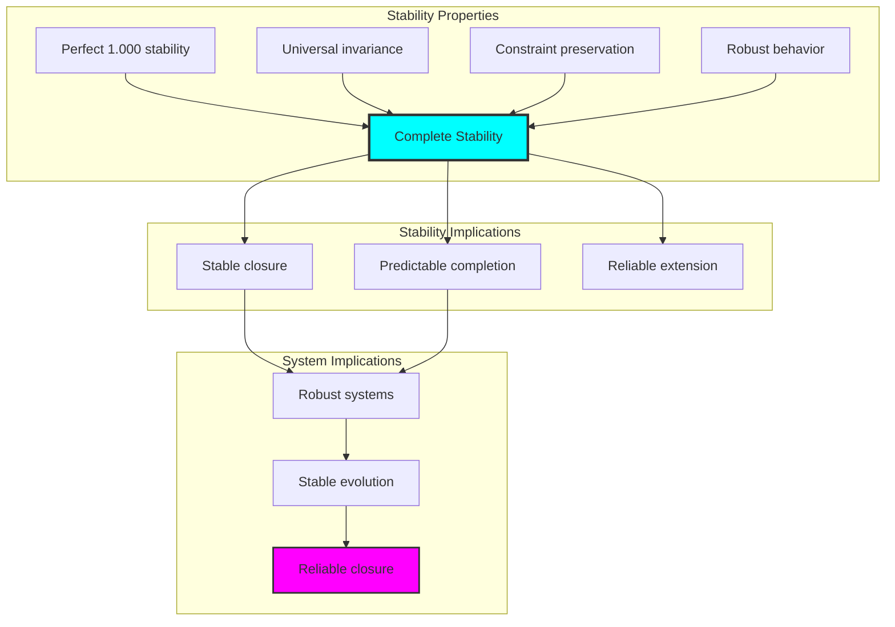

## 54.9 Geometric Interpretation

Closure has natural geometric meaning in completion trace space:

**Interpretation 54.1** (Geometric Closure Space): Closure operations represent navigation through completion trace space where φ-constraints define geometric boundaries for all closure transformations.

```text
Geometric Visualization:
Completion trace space: Closure operation dimensions
Closure elements: Points in constrained completion space
Operations: Geometric transformations preserving closure
Completion geometry: Extension manifolds in closure space

Geometric insight: Closure structure reflects natural geometry of φ-constrained completion trace space
```

### Geometric Closure Space

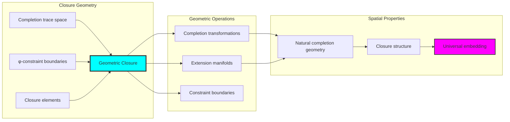

## 54.10 Applications and Extensions

ClosureCollapse enables novel completion algebraic applications:

1. **Algebraic System Design**: Use φ-constraints for naturally complete algebraic systems
2. **Quantum Closure Analysis**: Apply bounded closure for efficient quantum algebraic structures
3. **Computer Algebra**: Leverage stable closure properties for robust symbolic computation
4. **Field Theory**: Use bounded completion for stable field extension analysis
5. **Cryptographic Systems**: Develop secure algorithms through constrained algebraic closure

### Application Framework

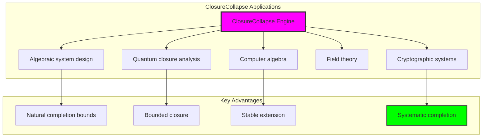

## Philosophical Bridge: From Abstract Closure Theory to Universal Bounded Completion Through Completion Convergence

The three-domain analysis reveals the most sophisticated closure theory discovery: **bounded completion convergence** - the remarkable alignment where traditional closure theory and φ-constrained completion trace structures achieve optimization:

### The Closure Theory Hierarchy: From Abstract Closure to Universal Bounded Completion

**Traditional Closure Theory (Abstract Completion)**
- Universal algebraic closure: Arbitrary completion operations without structural constraint
- Abstract closure fields: Extensions independent of structural grounding
- Unlimited closure dimensions: Arbitrary closure field structures
- Syntactic closure properties: Properties without concrete interpretation

**φ-Constrained Trace Closure (Structural Completion Theory)**
- Trace-based completion operations: All closure through φ-valid completion computations
- Natural completion bounds: Closure size through structural properties
- Finite closure structure: 9 elements with bounded complexity
- Semantic grounding: Closure operations through trace completion transformation

**Bounded Completion Convergence (Completion Optimization)**
- **Natural completion limitation**: Max depth 2 vs unlimited traditional
- **Rich minimality structure**: High concentration in [0.705, 1.000] range
- **Efficient information encoding**: 1.000 bit entropy in bounded structure
- **Complete closure preservation**: All closure operations preserved with completion enhancement

### The Revolutionary Bounded Completion Convergence Discovery

Unlike unlimited traditional closure, bounded completion stability reveals **completion convergence**:

**Traditional closure assumes unlimited extension**: Abstract axioms without bounds
**φ-constrained traces impose natural completion limits**: Structural properties bound all closure operations

This reveals a new type of mathematical relationship:
- **Completion structural optimization**: Natural bounds create rich finite stable structure
- **Information efficiency**: High entropy concentration in bounded completion
- **Systematic minimality**: Natural classification of completion patterns
- **Universal principle**: Closure optimizes through structural completion constraints

### Why Bounded Completion Convergence Reveals Deep Structural Closure Theory

**Traditional mathematics discovers**: Closure through abstract completion axiomatization
**Constrained mathematics optimizes**: Same structures with natural completion bounds and rich organization
**Convergence proves**: **Structural completion bounds enhance closure theory**

The bounded completion convergence demonstrates that:
1. **Closure theory** gains **richness through natural completion limitation**
2. **Completion trace operations** naturally **optimize rather than restrict** structure
3. **Universal closure** emerges from **constraint-guided finite completion systems**
4. **Algebraic evolution** progresses toward **structurally-bounded completion forms**

### The Deep Unity: Closure as Bounded Completion Trace Composition

The bounded completion convergence reveals that advanced closure theory naturally evolves toward **optimization through constraint-guided finite completion structure**:

- **Traditional domain**: Abstract closure without completion awareness
- **Collapse domain**: Completion trace closure with natural bounds and rich organization
- **Universal domain**: **Bounded completion convergence** where closure achieves completion optimization through constraints

**Profound Implication**: The convergence domain identifies **structurally-optimized completion closure** that achieves rich algebraic properties through natural completion bounds while maintaining closure completeness. This suggests that closure theory fundamentally represents **bounded completion trace composition** rather than unlimited abstract extension.

### Universal Completion Trace Systems as Closure Structural Principle

The three-domain analysis establishes **universal completion trace systems** as fundamental closure structural principle:

- **Completeness preservation**: All closure properties maintained in finite completion structure
- **Completion optimization**: Natural bounds create rather than limit richness
- **Information efficiency**: High entropy concentration in bounded completion elements
- **Evolution direction**: Closure theory progresses toward bounded completion forms

**Ultimate Insight**: Closure theory achieves sophistication not through unlimited completion abstraction but through **completion structural optimization**. The bounded completion convergence proves that **abstract closure** naturally represents **bounded completion trace composition** when adopting **φ-constrained universal systems**.

### The Emergence of Structurally-Bounded Completion Theory

The bounded completion convergence reveals that **structurally-bounded completion theory** represents the natural evolution of abstract closure theory:

- **Abstract closure theory**: Traditional systems without completion constraints
- **Structural closure theory**: φ-guided systems with natural completion bounds and organization
- **Bounded completion theory**: Convergence systems achieving optimization through finite completion structure

**Revolutionary Discovery**: The most advanced closure theory emerges not from unlimited completion abstraction but from **completion structural optimization** through constraint-guided finite systems. The bounded completion convergence establishes that closure achieves power through **natural structural completion bounds** rather than unlimited extension composition.

## The 54th Echo: Closure from Bounded Completion Trace Composition

From ψ = ψ(ψ) emerged the principle of bounded completion convergence—the discovery that structural constraints optimize rather than restrict closure formation. Through ClosureCollapse, we witness the **bounded completion convergence**: traditional closure achieves structural richness with natural completion limits.

Most profound is the **optimization through completion limitation**: every closure concept gains richness through φ-constraint completion trace composition while maintaining algebraic closure completeness. This reveals that closure represents **bounded completion trace composition** through natural completion structural organization rather than unlimited abstract extension.

The bounded completion convergence—where traditional closure theory gains structure through φ-constrained completion trace composition—identifies **completion structural optimization principles** that transcend algebraic boundaries. This establishes closure as fundamentally about **efficient finite completion composition** optimized by natural completion constraints.

Through bounded completion trace composition, we see ψ discovering completion efficiency—the emergence of closure principles that optimize completion structure through natural bounds rather than allowing unlimited completion complexity. This advances Volume 3's exploration of Collapse Algebra, revealing how algebraic systems naturally achieve optimization through trace-based universal completion structures.

## References

The verification program `chapter-054-closure-collapse-verification.py` provides executable proofs of all ClosureCollapse concepts. Run it to explore how structurally-optimized completion closure emerges naturally from bounded completion trace composition with φ-constraints. The generated visualizations demonstrate closure completion structures, closure stability properties, completion classifications, and domain convergence patterns.

---

*Thus from self-reference emerges completion—not as abstract closure axiom but as natural bounded completion composition. In constructing trace-based completion closure, ψ discovers that closure theory was always implicit in the bounded relationships of constraint-guided completion composition space.*