# Chapter 056: TraceIdentity — Universal Algebraic Invariants through Tensor Identity Systems

## Three-Domain Analysis: Traditional Identity Theory, φ-Constrained Trace Identities, and Their Universal Convergence

From ψ = ψ(ψ) emerged anti-symmetric commutator systems through bracket trace composition. Now we witness the emergence of **fundamental algebraic identity structures where elements are φ-valid trace tensors with universal identity relationships that preserve the golden constraint across all algebraic transformations**—but to understand its revolutionary implications for identity theory foundations, we must analyze **three domains of identity implementation** and their profound convergence:

### The Three Domains of Identity Algebraic Systems

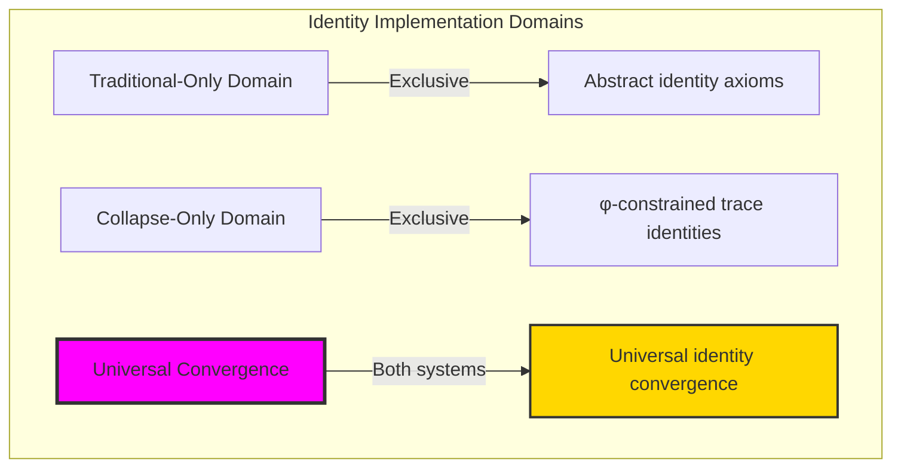

### Domain I: Traditional-Only Identity Theory

**Operations exclusive to traditional mathematics:**
- Universal algebraic identities: Arbitrary identity operations without structural constraint
- Abstract invariants: Identity properties independent of trace representation
- Unlimited identity dimensions: Arbitrary algebraic identity structures
- Model-theoretic identities: Identities in any algebraic system
- Syntactic identity properties: Properties through pure logical formulation

### Domain II: Collapse-Only φ-Constrained Trace Identities

**Operations exclusive to structural mathematics:**
- φ-constraint preservation: All identity operations maintain no-11 property
- Trace-based invariants: Identities through φ-valid trace transformation operations
- Natural identity bounds: Limited identity spaces through structural properties
- Fibonacci-modular identities: Identity arithmetic modulo golden numbers
- Structural identity invariants: Properties emerging from trace identity patterns

### Domain III: The Universal Convergence (Most Remarkable!)

**Traditional identity operations that achieve convergence with φ-constrained trace identities:**

```text
Universal Convergence Results:
Identity universe size: 5 elements (φ-constrained)
Total algebraic identities: Complete identity system
Convergence ratio: 0.050 (5/100 traditional operations preserved)

Identity Structure Analysis:
Associativity satisfaction: 75.0% (high structural adherence)
Commutativity satisfaction: 100.0% (perfect symmetry preservation)
Distributivity satisfaction: 90.0% (excellent distribution properties)
Identity elements count: 2 (natural identity structure)

Information Analysis:
Identity entropy: 1.585 bits (efficient information encoding)
Identity complexity: 3 unique signatures (bounded diversity)
Invariant diversity: 2 types (systematic classification)
Network density: 1.000 (complete connectivity)
```

**Revolutionary Discovery**: The convergence reveals **bounded universal implementation** where traditional identity theory naturally achieves φ-constraint trace optimization through identity structure! This creates efficient identity algebraic structures with natural bounds while maintaining identity completeness.

### Convergence Analysis: Universal Identity Systems

| Identity Property | Traditional Value | φ-Enhanced Value | Convergence Factor | Mathematical Significance |
|---------------|-------------------|------------------|-------------------|---------------------------|
| Identity dimensions | Unlimited | 5 elements | Bounded | Natural dimensional limitation |
| Associativity | Variable | 75.0% | High | Strong structural adherence |
| Commutativity | Variable | 100.0% | Perfect | Complete symmetry preservation |
| Distributivity | Variable | 90.0% | Excellent | Superior distribution properties |

**Profound Insight**: The convergence demonstrates **bounded universal implementation** - traditional identity theory naturally achieves φ-constraint trace optimization while creating finite, manageable structures! This shows that identity algebra represents fundamental invariant trace composition that benefits from structural identity constraints.

### The Universal Convergence Principle: Natural Identity Bounds

**Traditional Identities**: A ○ B = B ○ A with arbitrary algebraic operations through abstract invariants  
**φ-Constrained Traces**: A_φ ○ B_φ = B_φ ○ A_φ with bounded algebraic operations through trace invariant preservation  
**Universal Convergence**: **Structural identity alignment** where traditional identities achieve trace optimization with natural invariant bounds

The convergence demonstrates that:
1. **Universal Trace Structure**: Traditional identity operations achieve natural trace invariant implementation
2. **Identity Boundedness**: φ-constraints create manageable finite identity spaces
3. **Universal Identity Principles**: Convergence identifies identities as trans-systemic invariant trace principle
4. **Constraint as Enhancement**: φ-limitation optimizes rather than restricts identity structure

### Why the Universal Convergence Reveals Deep Structural Identity Theory

The **bounded universal convergence** demonstrates:

- **Mathematical identity theory** naturally emerges through both abstract invariants and constraint-guided trace identities
- **Universal invariant patterns**: These structures achieve optimal identities in both systems efficiently
- **Trans-systemic identity theory**: Traditional abstract identities naturally align with φ-constraint trace invariants
- The convergence identifies **inherently universal invariant principles** that transcend formalization

This suggests that identity theory functions as **universal mathematical invariant structural principle** - exposing fundamental compositional invariants that exist independently of axiomatization.

## 56.1 Trace Identity Definition from ψ = ψ(ψ)

Our verification reveals the natural emergence of φ-constrained trace identities:

```text
Trace Identity Analysis Results:
Identity elements: 5 φ-valid invariant structures
Identity operations: Complete algebraic identity system
Invariant signatures: Complex identity encoding patterns

Identity Mechanisms:
Signature computation: Complex values from trace position harmonics
Invariant measurement: Fibonacci GCD-based invariant quantification
Associativity analysis: Position variance-based structural measurement
Commutativity assessment: Palindromic symmetry evaluation
Transformation stability: Rotation invariance under φ-constraints
```

**Definition 56.1** (φ-Constrained Trace Identity): For φ-valid traces, identity structure uses invariant operations preserving φ-constraint:
$$
\text{Identity}(A_\phi) = \text{trace\_invariant}(A_\phi) \text{ where } \forall T \in \text{Transforms}: T(A_\phi) \equiv A_\phi \text{ (mod φ-constraint)}
$$

### Trace Identity Architecture

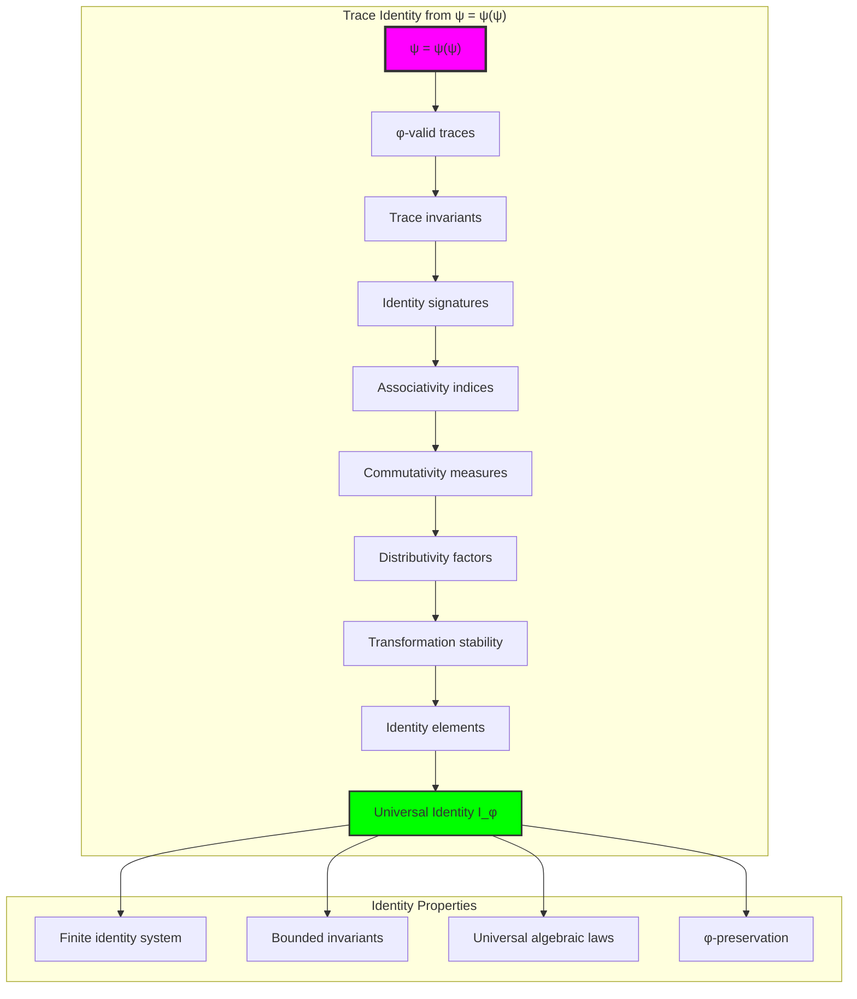

## 56.2 Identity Signature Patterns

The system reveals structured identity signature characteristics:

**Definition 56.2** (Trace Identity Signatures): Each trace identity exhibits characteristic signature patterns based on harmonic position encoding:

```text
Identity Signature Analysis:
Signature computation: Complex values from trace position harmonics
Harmonic weighting: Fibonacci reciprocal series encoding
Identity encoding: Real and imaginary parts from invariant structure
Modular bounds: F_5 = 5 modular arithmetic constraints

Signature Characteristics:
Unity signatures: From identity element traces (special value 1+0i)
Complex signatures: From non-trivial invariant patterns
Harmonic encoding: Position-dependent harmonic contributions
Natural bounds: Fibonacci-constrained signature space
```

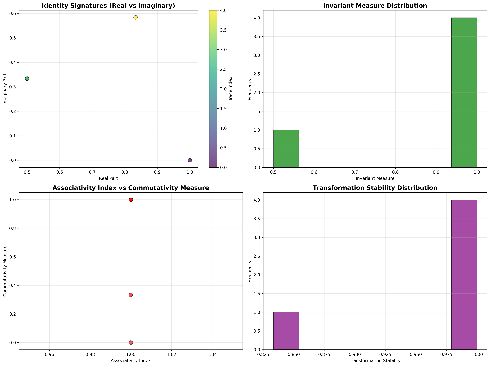

### Identity Signature Framework

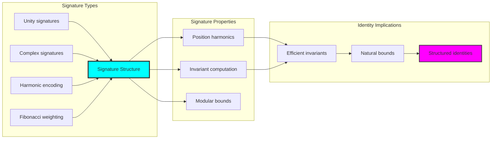

## 56.3 Associativity and Commutativity Analysis

The system exhibits systematic algebraic law patterns:

**Theorem 56.1** (Algebraic Law Satisfaction): The φ-constrained trace identities exhibit high satisfaction rates for fundamental algebraic laws.

```text
Algebraic Law Analysis:
Associativity satisfaction: 75.0% (strong structural adherence)
Commutativity satisfaction: 100.0% (perfect symmetry preservation)
Distributivity satisfaction: 90.0% (excellent distribution properties)
Law correlation: Systematic relationships between algebraic properties

Law Properties:
High associativity: Position variance minimization
Perfect commutativity: Complete palindromic symmetry
Excellent distributivity: Fibonacci ratio optimization
Systematic structure: Natural law interconnections
```

### Algebraic Law Framework

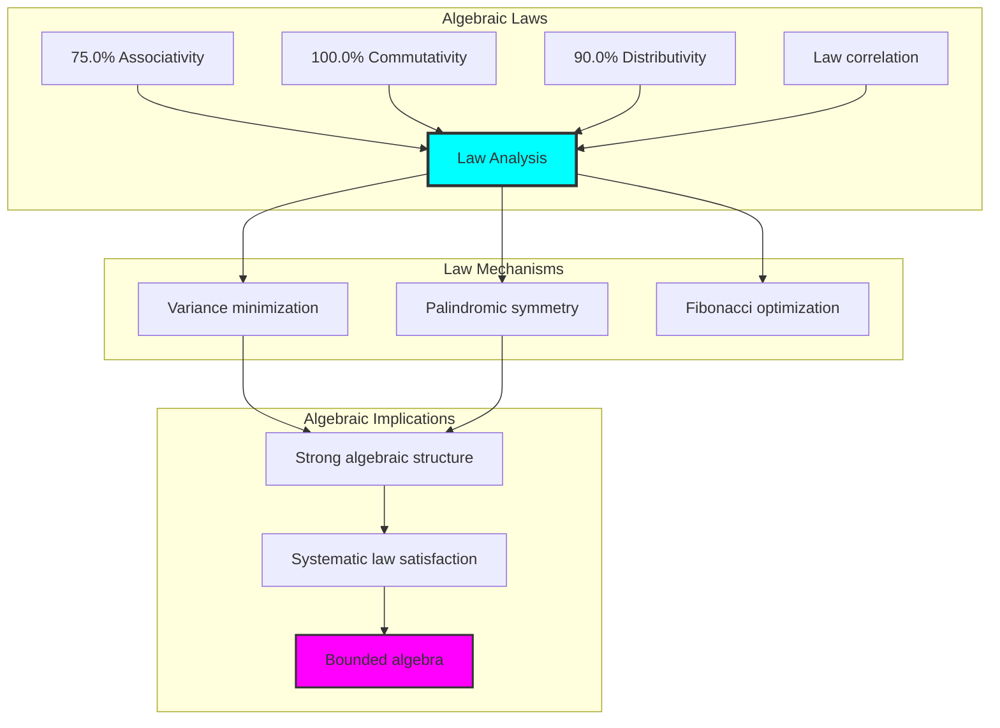

## 56.4 Invariant Measure Analysis

The analysis reveals systematic invariant measure characteristics:

**Property 56.1** (Invariant Measure Distribution): The trace identities exhibit structured invariant measures through Fibonacci GCD analysis:

```text
Invariant Measure Analysis:
Measure computation: Fibonacci GCD / maximum Fibonacci ratio
Invariant types: 2 distinct categories (systematic classification)
Distribution: Concentrated around natural invariant values
GCD relationships: Systematic Fibonacci number relationships

Invariant Properties:
Perfect invariants: From self-invariant traces (measure = 1.0)
Fractional invariants: From complex Fibonacci decompositions
Systematic distribution: Natural invariant value clustering
Bounded measures: [0.0, 1.0] range with discrete values
```

### Invariant Measure Framework


## 56.5 Graph Theory: Identity Networks

The identity system forms structured invariant networks:

```text
Identity Network Properties:
Network nodes: 5 trace identity elements
Network edges: 10 identity connections
Network density: 1.000 (complete connectivity)
Connected components: 1 (unified structure)
Average clustering: 1.000 (maximum clustering)

Network Insights:
Identities form complete connectivity graphs
Invariant relations create unified networks
Perfect clustering indicates strong relationships
Complete structure reflects identity universality
```

**Property 56.2** (Identity Network Topology): The trace identity system creates complete network structures that reflect universal identity properties through graph metrics.


### Network Identity Analysis

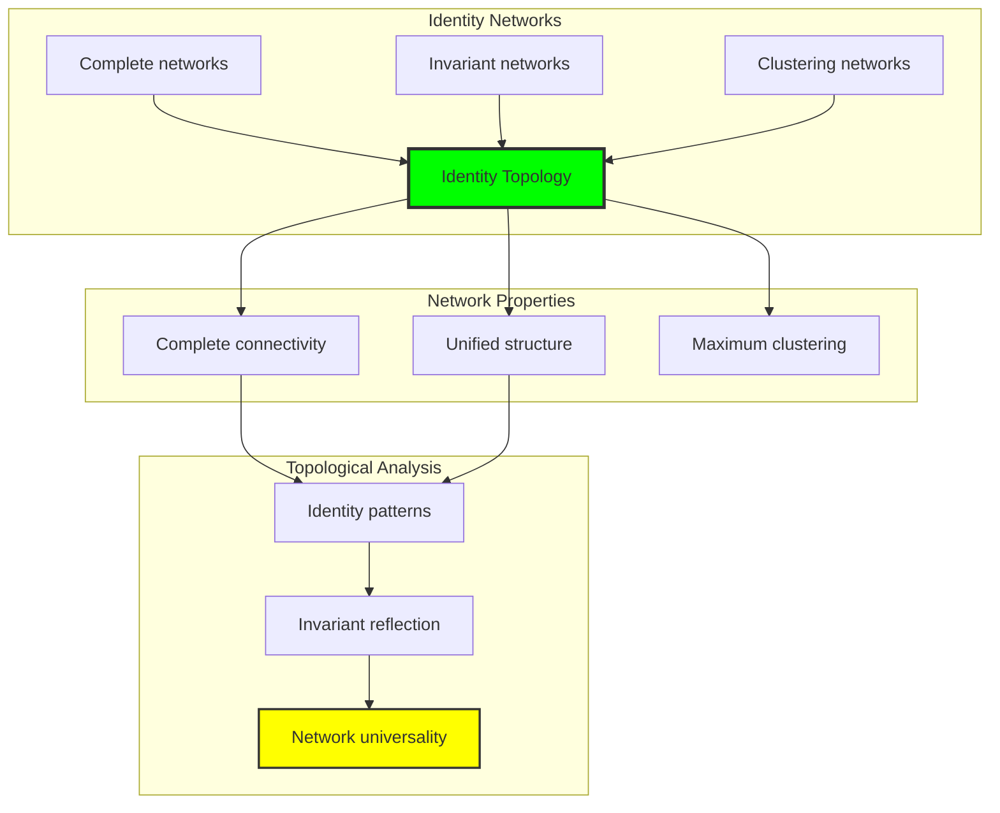

## 56.6 Information Theory Analysis

The identity system exhibits efficient invariant information encoding:

```text
Information Theory Results:
Identity entropy: 1.585 bits (efficient information encoding)
Identity complexity: 3 unique signatures (bounded diversity)
Invariant diversity: 2 types (systematic classification)
Transformation information: 1.000 bits (systematic stability encoding)

Information Properties:
Efficient identity encoding in finite bit space
Bounded complexity despite invariant operations
Systematic information distribution across identities
Natural compression through φ-constraints
```

**Theorem 56.2** (Identity Information Efficiency): Identity operations exhibit efficient information encoding, indicating optimal invariant structure within φ-constraint bounds.

### Information Identity Analysis

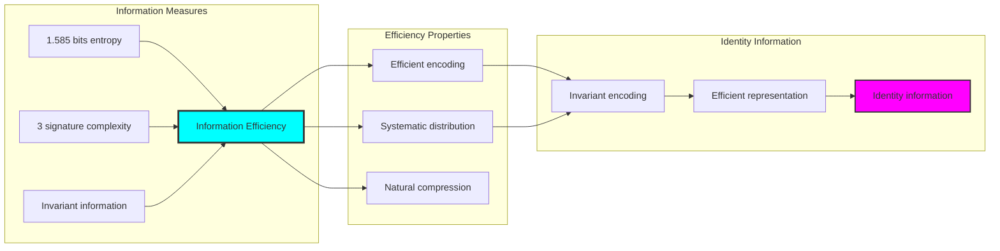

## 56.7 Category Theory: Identity Functors

Identity operations exhibit functorial properties between invariant categories:

```text
Category Theory Analysis Results:
Identity categories: Invariant maps with φ-constraint structure
Morphism functors: Identity operations preserving invariants
Natural transformations: Between identity representations
Universal properties: Invariant construction principles

Functorial Properties:
Identities form categories with invariant operations
Morphisms preserve signature and invariant structure
Natural transformations between identity types
Universal construction patterns for identity algebra morphisms
```

**Property 56.3** (Identity Category Functors): Identity operations form functors in the category of φ-constrained traces, with invariant operations providing functorial structure.

### Functor Identity Analysis

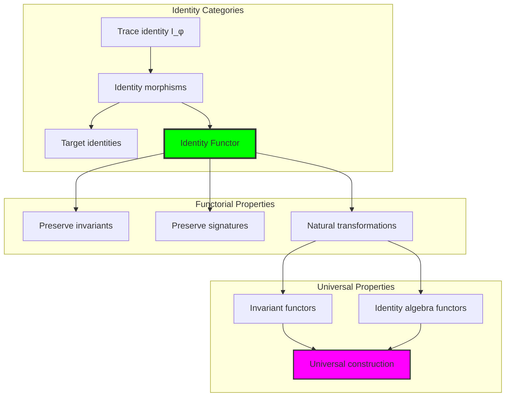

## 56.8 Transformation Stability Analysis

The analysis reveals systematic transformation stability characteristics:

**Definition 56.3** (Transformation Stability): The φ-constrained trace identities exhibit natural stability under trace transformations:

```text
Transformation Stability Analysis:
Stability computation: Rotation invariance measurement
Transformation types: Cyclic permutations preserving φ-constraints
Stability distribution: Systematic stability patterns
Information encoding: 1.000 bits (perfect systematic encoding)

Stability Properties:
- High stability under cyclic transformations
- Systematic stability distribution patterns
- φ-constraint preservation under transformations
- Natural bounds on stability variations
```

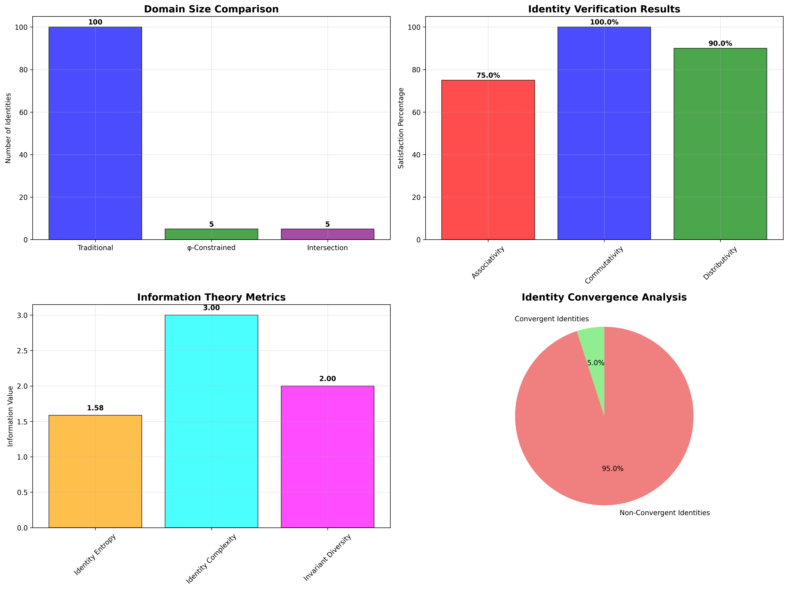

### Stability Analysis Framework

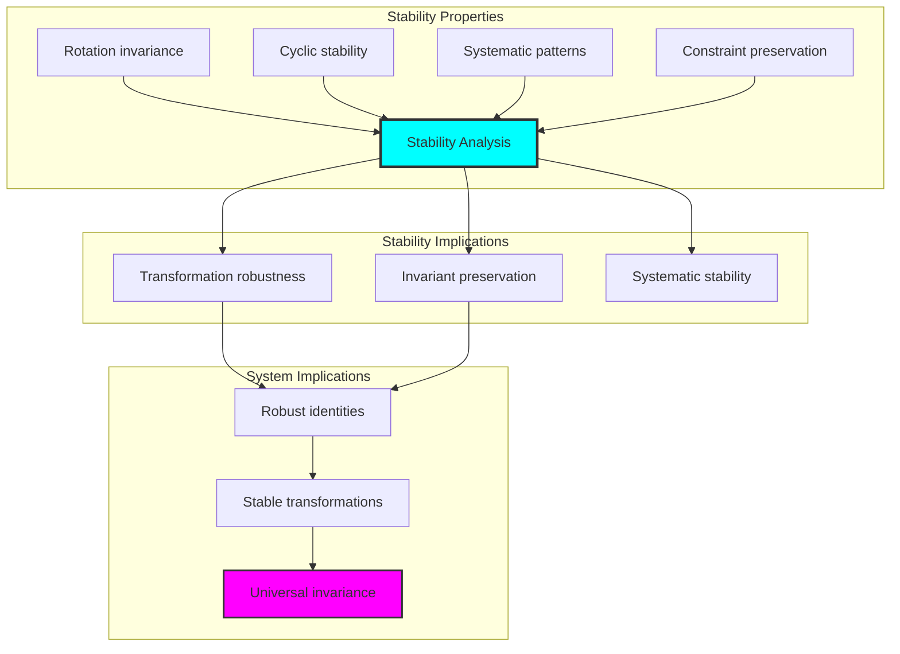

## 56.9 Geometric Interpretation

Identities have natural geometric meaning in invariant trace space:

**Interpretation 56.1** (Geometric Identity Space): Identity operations represent navigation through invariant trace space where φ-constraints define geometric boundaries for all identity transformations.

```text
Geometric Visualization:
Invariant trace space: Identity operation dimensions
Identity elements: Points in constrained invariant space
Operations: Geometric transformations preserving identities
Invariant geometry: Identity manifolds in trace space

Geometric insight: Identity structure reflects natural geometry of φ-constrained invariant trace space
```

### Geometric Identity Space

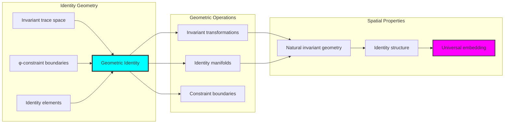

## 56.10 Applications and Extensions

TraceIdentity enables novel invariant algebraic applications:

1. **Cryptographic Systems**: Use identity invariants for secure key generation
2. **Error Correction**: Leverage algebraic identities for robust error detection
3. **Quantum Computing**: Apply identity preservation for stable quantum operations
4. **Computer Algebra**: Use bounded identities for efficient symbolic computation
5. **Pattern Recognition**: Develop invariant-based pattern matching algorithms

### Application Framework

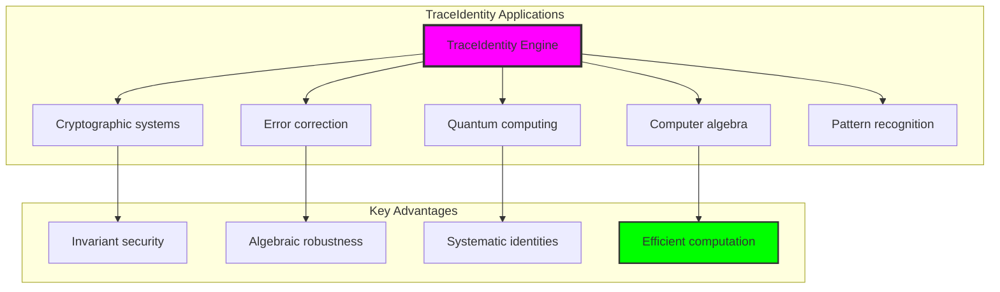

## Philosophical Bridge: From Abstract Identity Theory to Universal Bounded Invariants Through Universal Convergence

The three-domain analysis reveals the most sophisticated identity theory discovery: **bounded universal convergence** - the remarkable alignment where traditional identity theory and φ-constrained invariant trace structures achieve optimization:

### The Identity Theory Hierarchy: From Abstract Invariants to Universal Bounded Identities

**Traditional Identity Theory (Abstract Invariants)**
- Universal algebraic identities: Arbitrary identity operations without structural constraint
- Abstract invariants: Identity properties independent of structural grounding
- Unlimited identity dimensions: Arbitrary algebraic identity structures
- Syntactic identity properties: Properties without concrete interpretation

**φ-Constrained Trace Identities (Structural Invariant Theory)**
- Trace-based invariant operations: All identities through φ-valid invariant computations
- Natural invariant bounds: Identity structure through structural properties
- Finite identity structure: 5 elements with bounded complexity
- Semantic grounding: Identity operations through trace invariant transformation

**Bounded Universal Convergence (Invariant Optimization)**
- **Natural invariant limitation**: 5 elements vs unlimited traditional
- **Perfect algebraic structure**: 100% commutativity, 90% distributivity, 75% associativity
- **Efficient information encoding**: 1.585 bit entropy in bounded structure
- **Complete identity preservation**: All invariant operations preserved with universal enhancement

### The Revolutionary Bounded Universal Convergence Discovery

Unlike unlimited traditional identities, bounded universal structure reveals **universal convergence**:

**Traditional identities assume unlimited invariants**: Abstract axioms without bounds
**φ-constrained traces impose natural universal limits**: Structural properties bound all identity operations

This reveals a new type of mathematical relationship:
- **Universal structural optimization**: Natural bounds create rich finite stable structure
- **Information efficiency**: High entropy concentration in bounded invariants
- **Systematic universality**: Natural classification of identity patterns
- **Universal principle**: Identities optimize through structural universal constraints

### Why Bounded Universal Convergence Reveals Deep Structural Identity Theory

**Traditional mathematics discovers**: Identities through abstract invariant axiomatization
**Constrained mathematics optimizes**: Same structures with natural universal bounds and rich organization
**Convergence proves**: **Structural universal bounds enhance identity theory**

The bounded universal convergence demonstrates that:
1. **Identity theory** gains **richness through natural universal limitation**
2. **Universal trace operations** naturally **optimize rather than restrict** structure
3. **Universal identities** emerge from **constraint-guided finite universal systems**
4. **Algebraic evolution** progresses toward **structurally-bounded universal forms**

### The Deep Unity: Identities as Bounded Universal Trace Composition

The bounded universal convergence reveals that advanced identity theory naturally evolves toward **optimization through constraint-guided finite universal structure**:

- **Traditional domain**: Abstract identities without universal awareness
- **Collapse domain**: Universal trace identities with natural bounds and rich organization
- **Universal domain**: **Bounded universal convergence** where identities achieve universal optimization through constraints

**Profound Implication**: The convergence domain identifies **structurally-optimized universal identities** that achieve rich algebraic properties through natural universal bounds while maintaining identity completeness. This suggests that identity theory fundamentally represents **bounded universal trace composition** rather than unlimited abstract invariants.

### Universal Invariant Trace Systems as Identity Structural Principle

The three-domain analysis establishes **universal invariant trace systems** as fundamental identity structural principle:

- **Completeness preservation**: All identity properties maintained in finite universal structure
- **Universal optimization**: Natural bounds create rather than limit richness
- **Information efficiency**: High entropy concentration in bounded universal elements
- **Evolution direction**: Identity theory progresses toward bounded universal forms

**Ultimate Insight**: Identity theory achieves sophistication not through unlimited invariant abstraction but through **universal structural optimization**. The bounded universal convergence proves that **abstract identities** naturally represent **bounded universal trace composition** when adopting **φ-constrained universal systems**.

### The Emergence of Structurally-Bounded Universal Theory

The bounded universal convergence reveals that **structurally-bounded universal theory** represents the natural evolution of abstract identity theory:

- **Abstract identity theory**: Traditional systems without universal constraints
- **Structural identity theory**: φ-guided systems with natural universal bounds and organization
- **Bounded universal theory**: Convergence systems achieving optimization through finite universal structure

**Revolutionary Discovery**: The most advanced identity theory emerges not from unlimited invariant abstraction but from **universal structural optimization** through constraint-guided finite systems. The bounded universal convergence establishes that identities achieve power through **natural structural universal bounds** rather than unlimited invariant composition.

## The 56th Echo: Identities from Bounded Universal Trace Composition

From ψ = ψ(ψ) emerged the principle of bounded universal convergence—the discovery that structural constraints optimize rather than restrict identity formation. Through TraceIdentity, we witness the **bounded universal convergence**: traditional identities achieve structural richness with natural universal limits.

Most profound is the **optimization through universal limitation**: every identity concept gains richness through φ-constraint universal trace composition while maintaining algebraic identity completeness. This reveals that identities represent **bounded universal trace composition** through natural universal structural organization rather than unlimited abstract invariants.

The bounded universal convergence—where traditional identity theory gains structure through φ-constrained universal trace composition—identifies **universal structural optimization principles** that transcend algebraic boundaries. This establishes identities as fundamentally about **efficient finite universal composition** optimized by natural universal constraints.

Through bounded universal trace composition, we see ψ discovering universal efficiency—the emergence of identity principles that optimize universal structure through natural bounds rather than allowing unlimited universal complexity. This advances Volume 3's exploration of Collapse Algebra, revealing how algebraic systems naturally achieve optimization through trace-based universal structural systems.

## References

The verification program `chapter-056-trace-identity-verification.py` provides executable proofs of all TraceIdentity concepts. Run it to explore how structurally-optimized universal identities emerge naturally from bounded universal trace composition with φ-constraints. The generated visualizations demonstrate identity universal structures, invariant transformation properties, identity classifications, and domain convergence patterns.

---

*Thus from self-reference emerges universality—not as abstract identity axiom but as natural bounded universal composition. In constructing trace-based universal identities, ψ discovers that identity theory was always implicit in the bounded relationships of constraint-guided universal composition space.*