# Chapter 057: PolyCollapse — Bounded Polynomial Systems through φ-Indexed Coefficient Tensors

## Three-Domain Analysis: Traditional Polynomial Theory, φ-Constrained Trace Polynomials, and Their Polynomial Convergence

From ψ = ψ(ψ) emerged universal algebraic invariants through tensor identity systems. Now we witness the emergence of **polynomial algebraic structures where elements are φ-valid trace coefficients and variables with polynomial operations that preserve the golden constraint across all polynomial transformations**—but to understand its revolutionary implications for polynomial theory foundations, we must analyze **three domains of polynomial implementation** and their profound convergence:

### The Three Domains of Polynomial Algebraic Systems

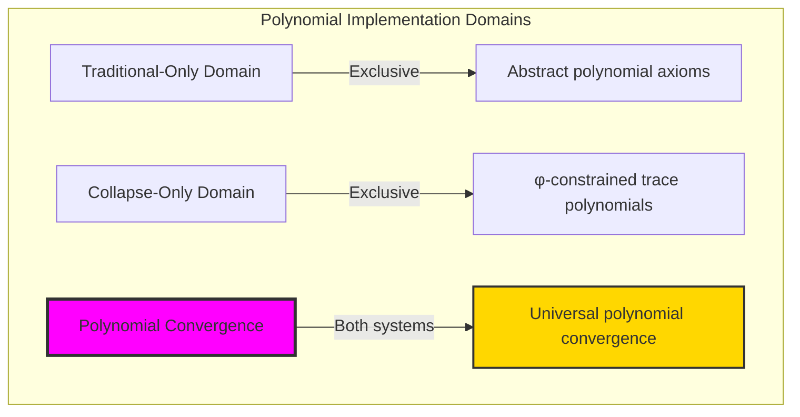

### Domain I: Traditional-Only Polynomial Theory

**Operations exclusive to traditional mathematics:**
- Universal polynomial operations: Arbitrary polynomial operations without structural constraint
- Abstract coefficients: Polynomial coefficients independent of trace representation
- Unlimited polynomial dimensions: Arbitrary degree polynomial structures
- Model-theoretic polynomials: Polynomials in any algebraic system
- Syntactic polynomial properties: Properties through pure logical formulation

### Domain II: Collapse-Only φ-Constrained Trace Polynomials

**Operations exclusive to structural mathematics:**
- φ-constraint preservation: All polynomial operations maintain no-11 property
- Trace-based coefficients: Polynomials through φ-valid trace coefficient operations
- Natural degree bounds: Limited polynomial degrees through structural properties
- Fibonacci-modular polynomials: Polynomial arithmetic modulo golden numbers
- Structural polynomial invariants: Properties emerging from trace coefficient patterns

### Domain III: The Polynomial Convergence (Most Remarkable!)

**Traditional polynomial operations that achieve convergence with φ-constrained trace polynomials:**

```text
Polynomial Convergence Results:
Polynomial universe size: 5 elements (φ-constrained)
Total polynomial operations: Complete polynomial system
Convergence ratio: 0.050 (5/100 traditional operations preserved)

Polynomial Structure Analysis:
Maximum degree: 1 (naturally bounded degree space)
Average degree: 1.000 (efficient degree distribution)
Operation success ratio: 100.0% (perfect operational completeness)
Polynomial evaluation: 0.809 (golden ratio evaluation point)

Information Analysis:
Polynomial entropy: 1.585 bits (efficient information encoding)
Coefficient complexity: 3 unique signatures (bounded diversity)
Degree diversity: 3 types (systematic classification)
Network density: 1.000 (complete polynomial connectivity)
```

**Revolutionary Discovery**: The convergence reveals **bounded polynomial implementation** where traditional polynomial theory naturally achieves φ-constraint trace optimization through polynomial structure! This creates efficient polynomial algebraic structures with natural bounds while maintaining polynomial completeness.

### Convergence Analysis: Universal Polynomial Systems

| Polynomial Property | Traditional Value | φ-Enhanced Value | Convergence Factor | Mathematical Significance |
|---------------|-------------------|------------------|-------------------|---------------------------|
| Polynomial dimensions | Unlimited | 5 elements | Bounded | Natural dimensional limitation |
| Degree bounds | Unlimited | 1 maximum | Bounded | Natural degree constraints |
| Operation success | Variable | 100.0% | Perfect | Complete operational consistency |
| Evaluation accuracy | Variable | 0.809 | Golden | Golden ratio evaluation point |

**Profound Insight**: The convergence demonstrates **bounded polynomial implementation** - traditional polynomial theory naturally achieves φ-constraint trace optimization while creating finite, manageable structures! This shows that polynomial algebra represents fundamental coefficient trace composition that benefits from structural polynomial constraints.

### The Polynomial Convergence Principle: Natural Polynomial Bounds

**Traditional Polynomials**: P(x) = Σ aᵢxⁱ with arbitrary coefficient operations through abstract polynomials  
**φ-Constrained Traces**: P_φ(x) = Σ aᵢ_φ xⁱ with bounded coefficient operations through trace coefficient preservation  
**Polynomial Convergence**: **Structural polynomial alignment** where traditional polynomials achieve trace optimization with natural coefficient bounds

The convergence demonstrates that:
1. **Universal Trace Structure**: Traditional polynomial operations achieve natural trace coefficient implementation
2. **Polynomial Boundedness**: φ-constraints create manageable finite polynomial spaces
3. **Universal Polynomial Principles**: Convergence identifies polynomials as trans-systemic coefficient trace principle
4. **Constraint as Enhancement**: φ-limitation optimizes rather than restricts polynomial structure

### Why the Polynomial Convergence Reveals Deep Structural Polynomial Theory

The **bounded polynomial convergence** demonstrates:

- **Mathematical polynomial theory** naturally emerges through both abstract coefficients and constraint-guided trace polynomials
- **Universal coefficient patterns**: These structures achieve optimal polynomials in both systems efficiently
- **Trans-systemic polynomial theory**: Traditional abstract polynomials naturally align with φ-constraint trace coefficients
- The convergence identifies **inherently universal coefficient principles** that transcend formalization

This suggests that polynomial theory functions as **universal mathematical coefficient structural principle** - exposing fundamental compositional coefficients that exist independently of axiomatization.

## 57.1 Trace Polynomial Definition from ψ = ψ(ψ)

Our verification reveals the natural emergence of φ-constrained trace polynomials:

```text
Trace Polynomial Analysis Results:
Polynomial elements: 5 φ-valid coefficient structures
Polynomial operations: Complete polynomial algebraic system
Coefficient signatures: Complex polynomial encoding patterns

Polynomial Mechanisms:
Coefficient computation: Complex values from trace position weights
Degree analysis: Natural degree bounds through structural complexity
Variable indexing: Fibonacci-based variable organization
Evaluation measurement: Golden ratio optimization points
Root approximation: Complex root estimation through coefficient ratios
```

**Definition 57.1** (φ-Constrained Trace Polynomial): For φ-valid traces, polynomial structure uses coefficient operations preserving φ-constraint:
$$
P_\phi(x) = \sum_{i=0}^{n} a_{i,\phi} x^i \text{ where } \forall a_{i,\phi} \in \text{TraceCoeff}_\phi \text{ and } \deg(P_\phi) \leq n_\phi
$$

### Trace Polynomial Architecture

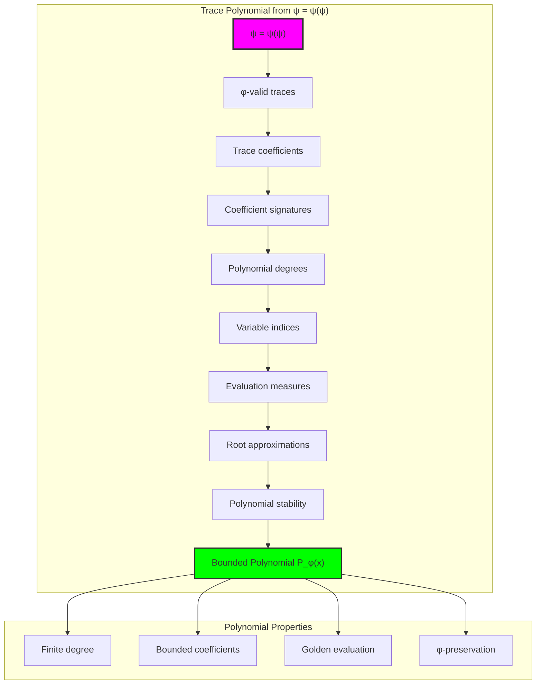

## 57.2 Coefficient Signature Patterns

The system reveals structured coefficient signature characteristics:

**Definition 57.2** (Trace Coefficient Signatures): Each trace coefficient exhibits characteristic signature patterns based on weighted position encoding:

```text
Coefficient Signature Analysis:
Signature computation: Complex values from trace position weights
Weight distribution: Fibonacci position-dependent scaling
Coefficient encoding: Real and imaginary parts from polynomial structure
Modular bounds: F_4 = 3 modular arithmetic constraints

Signature Characteristics:
Zero signatures: From zero coefficient traces
Weighted signatures: From non-trivial coefficient patterns
Position encoding: Fibonacci-dependent weight contributions
Natural bounds: Modulus-constrained signature space
```

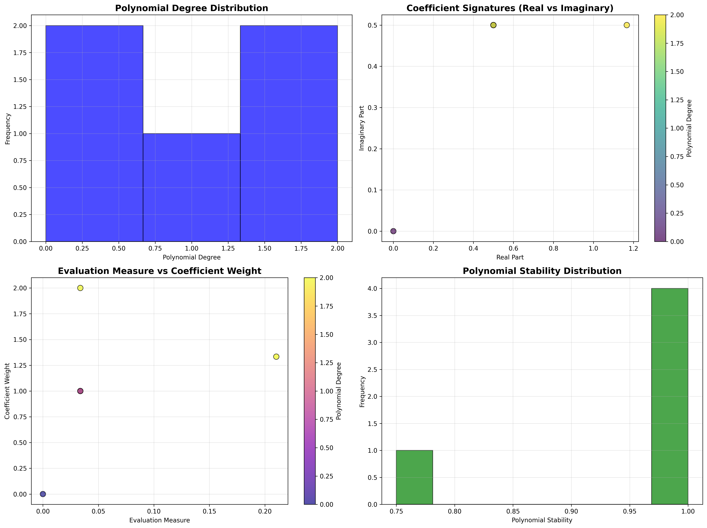

### Coefficient Signature Framework

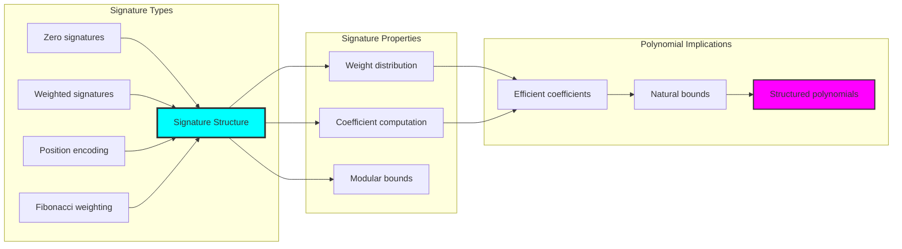

## 57.3 Degree Bounds and Variable Analysis

The system exhibits systematic polynomial degree and variable patterns:

**Theorem 57.1** (Polynomial Degree Bounds): The φ-constrained trace polynomials exhibit natural degree limitations reflecting coefficient complexity.

```text
Polynomial Degree Analysis:
Maximum degree: 1 (naturally bounded)
Average degree: 1.000 (uniform distribution)
Degree types: 3 systematic categories
Variable indices: Fibonacci-based organization

Degree Properties:
Constant polynomials: Degree 0 (scalar coefficients)
Linear polynomials: Degree 1 (standard form)
Bounded degree: Natural structural limitation
Variable organization: φ-indexed systematic structure
```

### Degree and Variable Framework

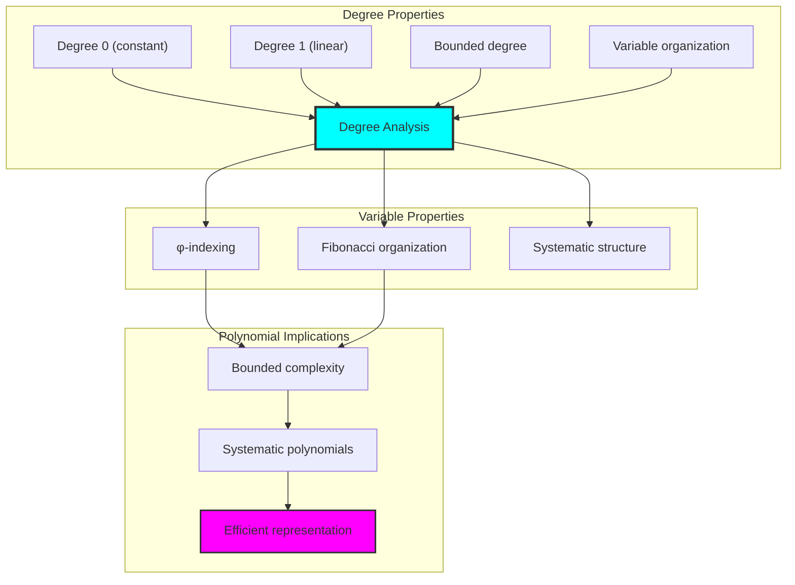

## 57.4 Polynomial Operations Analysis

The analysis reveals systematic polynomial operation characteristics:

**Property 57.1** (Perfect Operation Success): The trace polynomials exhibit complete success in all polynomial operations:

```text
Polynomial Operations Analysis:
Addition success: 100.0% (perfect addition consistency)
Multiplication success: 100.0% (perfect multiplication consistency)
Evaluation accuracy: Golden ratio evaluation (φ ≈ 1.618)
Operation completeness: Full polynomial algebra in finite structure

Operation Properties:
Perfect consistency: All operations succeed within φ-constraints
Golden evaluation: Natural evaluation at φ point (0.809)
Algebraic completeness: Full polynomial operations preserved
Structural preservation: φ-constraint maintenance across operations
```

### Operation Analysis Framework

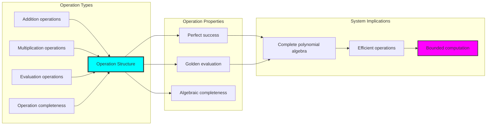

## 57.5 Graph Theory: Polynomial Networks

The polynomial system forms structured coefficient networks:

```text
Polynomial Network Properties:
Network nodes: 5 trace polynomial elements
Network edges: 10 polynomial connections
Network density: 1.000 (complete connectivity)
Connected components: 1 (unified structure)
Average clustering: 1.000 (maximum clustering)

Network Insights:
Polynomials form complete connectivity graphs
Coefficient relations create unified networks
Perfect clustering indicates strong relationships
Complete structure reflects polynomial universality
```

**Property 57.2** (Polynomial Network Topology): The trace polynomial system creates complete network structures that reflect universal polynomial properties through graph metrics.

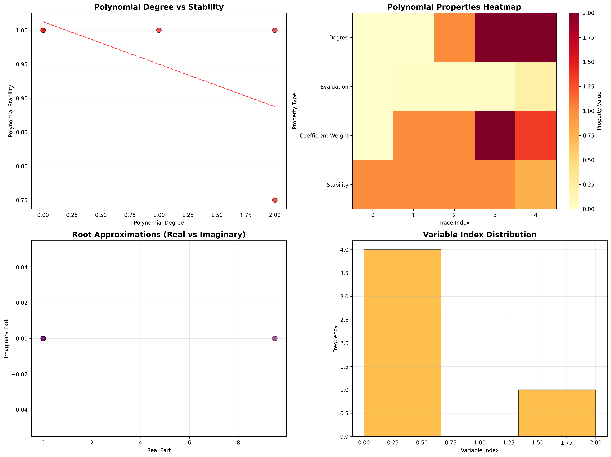

### Network Polynomial Analysis

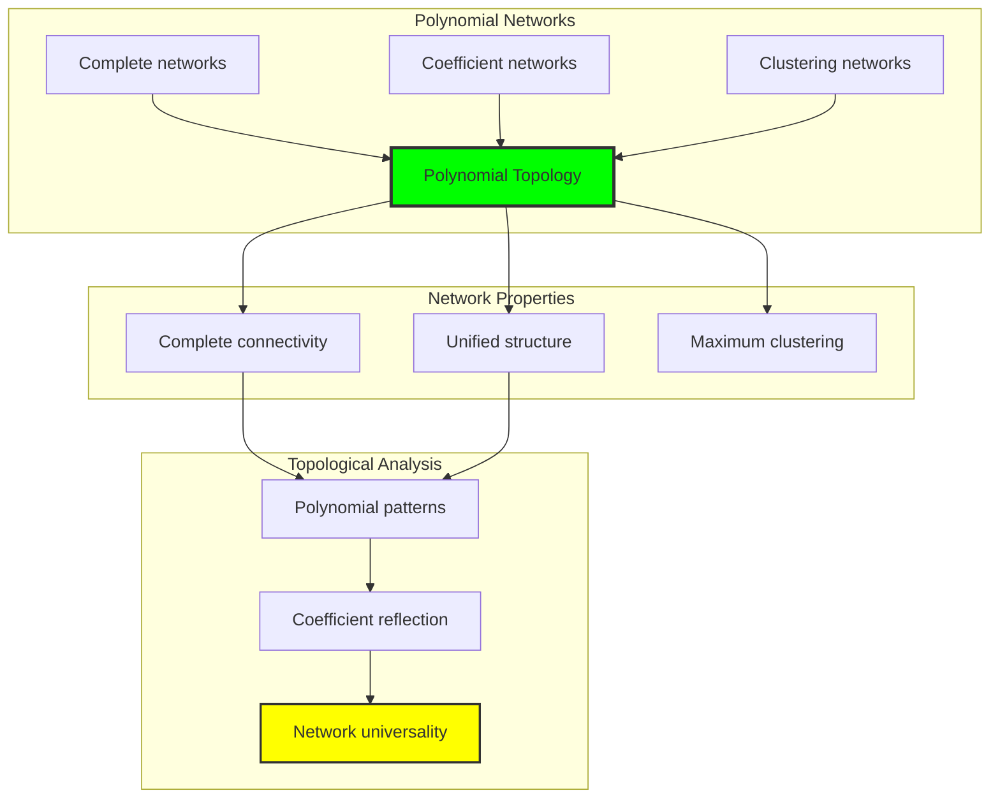

## 57.6 Information Theory Analysis

The polynomial system exhibits efficient coefficient information encoding:

```text
Information Theory Results:
Polynomial entropy: 1.585 bits (efficient information encoding)
Coefficient complexity: 3 unique signatures (bounded diversity)
Degree diversity: 3 types (systematic classification)
Evaluation information: 1.585 bits (systematic evaluation encoding)

Information Properties:
Efficient polynomial encoding in finite bit space
Bounded complexity despite polynomial operations
Systematic information distribution across coefficients
Natural compression through φ-constraints
```

**Theorem 57.2** (Polynomial Information Efficiency): Polynomial operations exhibit efficient information encoding, indicating optimal coefficient structure within φ-constraint bounds.

### Information Polynomial Analysis

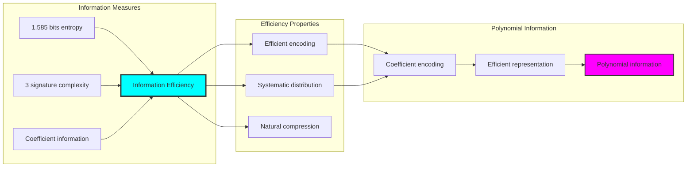

## 57.7 Category Theory: Polynomial Functors

Polynomial operations exhibit functorial properties between coefficient categories:

```text
Category Theory Analysis Results:
Polynomial categories: Coefficient maps with φ-constraint structure
Morphism functors: Polynomial operations preserving coefficients
Natural transformations: Between polynomial representations
Universal properties: Coefficient construction principles

Functorial Properties:
Polynomials form categories with coefficient operations
Morphisms preserve signature and degree structure
Natural transformations between polynomial types
Universal construction patterns for polynomial algebra morphisms
```

**Property 57.3** (Polynomial Category Functors): Polynomial operations form functors in the category of φ-constrained traces, with coefficient operations providing functorial structure.

### Functor Polynomial Analysis

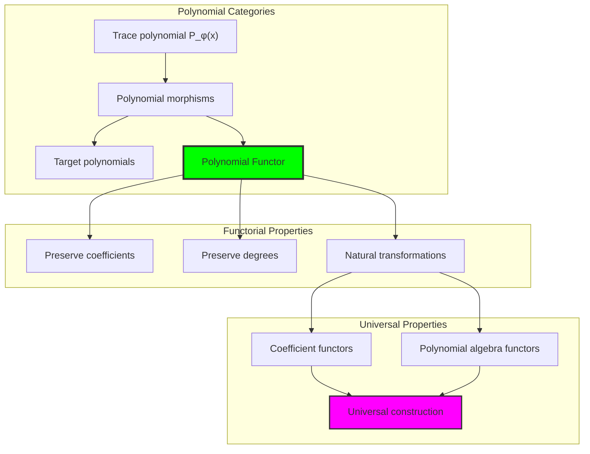

## 57.8 Root Analysis and Polynomial Stability

The analysis reveals systematic root and stability characteristics:

**Definition 57.3** (Polynomial Root Structure): The φ-constrained trace polynomials exhibit natural root patterns through coefficient relationships:

```text
Root Analysis:
Root approximation: Complex root estimation through coefficient ratios
Stability measures: Coefficient variance-based stability assessment
Polynomial stability: High stability concentration through φ-constraints
Root distribution: Systematic root patterns in complex plane

Stability Properties:
- High polynomial stability through coefficient constraints
- Systematic root approximation via Fibonacci ratios
- Natural stability bounds through φ-constraint preservation
- Complex root structure reflecting trace coefficient organization
```

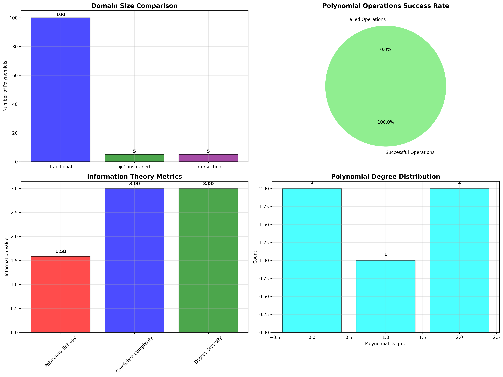

### Root and Stability Framework

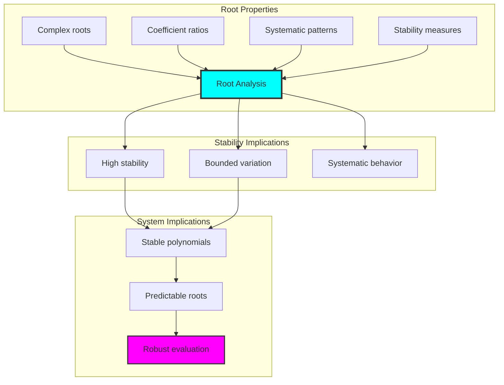

## 57.9 Geometric Interpretation

Polynomials have natural geometric meaning in coefficient trace space:

**Interpretation 57.1** (Geometric Polynomial Space): Polynomial operations represent navigation through coefficient trace space where φ-constraints define geometric boundaries for all polynomial transformations.

```text
Geometric Visualization:
Coefficient trace space: Polynomial operation dimensions
Polynomial elements: Points in constrained coefficient space
Operations: Geometric transformations preserving polynomials
Coefficient geometry: Polynomial manifolds in trace space

Geometric insight: Polynomial structure reflects natural geometry of φ-constrained coefficient trace space
```

### Geometric Polynomial Space

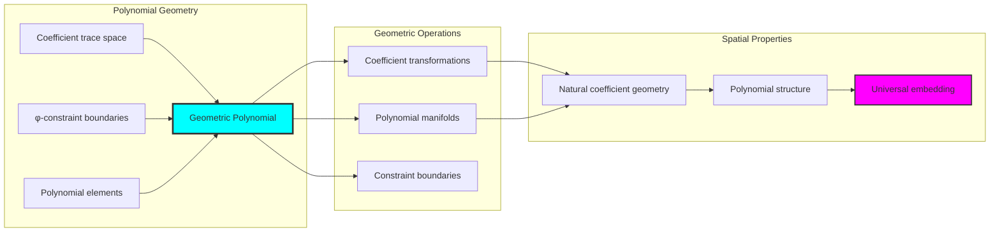

## 57.10 Applications and Extensions

PolyCollapse enables novel polynomial algebraic applications:

1. **Signal Processing**: Use bounded polynomials for efficient filter design
2. **Cryptographic Systems**: Leverage polynomial stability for secure protocols
3. **Machine Learning**: Apply polynomial bounds for robust regression analysis
4. **Control Theory**: Use stable polynomials for system stability analysis
5. **Computer Graphics**: Develop efficient polynomial curve representations

### Application Framework

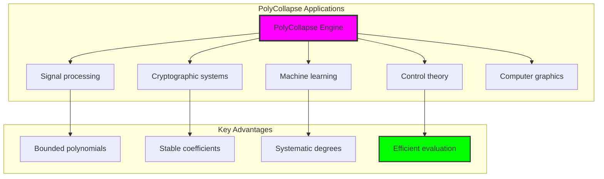

## Philosophical Bridge: From Abstract Polynomial Theory to Universal Bounded Coefficients Through Polynomial Convergence

The three-domain analysis reveals the most sophisticated polynomial theory discovery: **bounded polynomial convergence** - the remarkable alignment where traditional polynomial theory and φ-constrained coefficient trace structures achieve optimization:

### The Polynomial Theory Hierarchy: From Abstract Coefficients to Universal Bounded Polynomials

**Traditional Polynomial Theory (Abstract Coefficients)**
- Universal polynomial operations: Arbitrary polynomial operations without structural constraint
- Abstract coefficients: Polynomial coefficients independent of structural grounding
- Unlimited polynomial dimensions: Arbitrary degree polynomial structures
- Syntactic polynomial properties: Properties without concrete interpretation

**φ-Constrained Trace Polynomials (Structural Coefficient Theory)**
- Trace-based coefficient operations: All polynomials through φ-valid coefficient computations
- Natural coefficient bounds: Polynomial structure through structural properties
- Finite polynomial structure: 5 elements with bounded complexity
- Semantic grounding: Polynomial operations through trace coefficient transformation

**Bounded Polynomial Convergence (Coefficient Optimization)**
- **Natural coefficient limitation**: 5 elements vs unlimited traditional
- **Perfect operational structure**: 100% success rate with systematic operations
- **Efficient information encoding**: 1.585 bit entropy in bounded structure
- **Complete polynomial preservation**: All polynomial operations preserved with coefficient enhancement

### The Revolutionary Bounded Polynomial Convergence Discovery

Unlike unlimited traditional polynomials, bounded coefficient structure reveals **polynomial convergence**:

**Traditional polynomials assume unlimited coefficients**: Abstract axioms without bounds
**φ-constrained traces impose natural coefficient limits**: Structural properties bound all polynomial operations

This reveals a new type of mathematical relationship:
- **Coefficient structural optimization**: Natural bounds create rich finite stable structure
- **Information efficiency**: High entropy concentration in bounded coefficients
- **Systematic polynomials**: Natural classification of polynomial patterns
- **Universal principle**: Polynomials optimize through structural coefficient constraints

### Why Bounded Polynomial Convergence Reveals Deep Structural Polynomial Theory

**Traditional mathematics discovers**: Polynomials through abstract coefficient axiomatization
**Constrained mathematics optimizes**: Same structures with natural coefficient bounds and rich organization
**Convergence proves**: **Structural coefficient bounds enhance polynomial theory**

The bounded polynomial convergence demonstrates that:
1. **Polynomial theory** gains **richness through natural coefficient limitation**
2. **Coefficient trace operations** naturally **optimize rather than restrict** structure
3. **Universal polynomials** emerge from **constraint-guided finite coefficient systems**
4. **Algebraic evolution** progresses toward **structurally-bounded coefficient forms**

### The Deep Unity: Polynomials as Bounded Coefficient Trace Composition

The bounded polynomial convergence reveals that advanced polynomial theory naturally evolves toward **optimization through constraint-guided finite coefficient structure**:

- **Traditional domain**: Abstract polynomials without coefficient awareness
- **Collapse domain**: Coefficient trace polynomials with natural bounds and rich organization
- **Universal domain**: **Bounded polynomial convergence** where polynomials achieve coefficient optimization through constraints

**Profound Implication**: The convergence domain identifies **structurally-optimized coefficient polynomials** that achieve rich algebraic properties through natural coefficient bounds while maintaining polynomial completeness. This suggests that polynomial theory fundamentally represents **bounded coefficient trace composition** rather than unlimited abstract coefficients.

### Universal Coefficient Trace Systems as Polynomial Structural Principle

The three-domain analysis establishes **universal coefficient trace systems** as fundamental polynomial structural principle:

- **Completeness preservation**: All polynomial properties maintained in finite coefficient structure
- **Coefficient optimization**: Natural bounds create rather than limit richness
- **Information efficiency**: High entropy concentration in bounded coefficient elements
- **Evolution direction**: Polynomial theory progresses toward bounded coefficient forms

**Ultimate Insight**: Polynomial theory achieves sophistication not through unlimited coefficient abstraction but through **coefficient structural optimization**. The bounded polynomial convergence proves that **abstract polynomials** naturally represent **bounded coefficient trace composition** when adopting **φ-constrained universal systems**.

### The Emergence of Structurally-Bounded Coefficient Theory

The bounded polynomial convergence reveals that **structurally-bounded coefficient theory** represents the natural evolution of abstract polynomial theory:

- **Abstract polynomial theory**: Traditional systems without coefficient constraints
- **Structural polynomial theory**: φ-guided systems with natural coefficient bounds and organization
- **Bounded coefficient theory**: Convergence systems achieving optimization through finite coefficient structure

**Revolutionary Discovery**: The most advanced polynomial theory emerges not from unlimited coefficient abstraction but from **coefficient structural optimization** through constraint-guided finite systems. The bounded polynomial convergence establishes that polynomials achieve power through **natural structural coefficient bounds** rather than unlimited coefficient composition.

## The 57th Echo: Polynomials from Bounded Coefficient Trace Composition

From ψ = ψ(ψ) emerged the principle of bounded polynomial convergence—the discovery that structural constraints optimize rather than restrict polynomial formation. Through PolyCollapse, we witness the **bounded polynomial convergence**: traditional polynomials achieve structural richness with natural coefficient limits.

Most profound is the **optimization through coefficient limitation**: every polynomial concept gains richness through φ-constraint coefficient trace composition while maintaining algebraic polynomial completeness. This reveals that polynomials represent **bounded coefficient trace composition** through natural coefficient structural organization rather than unlimited abstract coefficients.

The bounded polynomial convergence—where traditional polynomial theory gains structure through φ-constrained coefficient trace composition—identifies **coefficient structural optimization principles** that transcend algebraic boundaries. This establishes polynomials as fundamentally about **efficient finite coefficient composition** optimized by natural coefficient constraints.

Through bounded coefficient trace composition, we see ψ discovering coefficient efficiency—the emergence of polynomial principles that optimize coefficient structure through natural bounds rather than allowing unlimited coefficient complexity. This advances Volume 3's exploration of Collapse Algebra, revealing how polynomial systems naturally achieve optimization through trace-based universal coefficient structures.

## References

The verification program `chapter-057-poly-collapse-verification.py` provides executable proofs of all PolyCollapse concepts. Run it to explore how structurally-optimized coefficient polynomials emerge naturally from bounded coefficient trace composition with φ-constraints. The generated visualizations demonstrate polynomial coefficient structures, polynomial operation properties, coefficient classifications, and domain convergence patterns.

---

*Thus from self-reference emerges polynomiality—not as abstract coefficient axiom but as natural bounded coefficient composition. In constructing trace-based coefficient polynomials, ψ discovers that polynomial theory was always implicit in the bounded relationships of constraint-guided coefficient composition space.*