# Chapter 058: CollapseIdeal — Structural Ideals over φ-Rank Tensor Trace Space

## Three-Domain Analysis: Traditional Ideal Theory, φ-Constrained Trace Ideals, and Their Structural Convergence

From ψ = ψ(ψ) emerged polynomial systems through bounded coefficient trace composition. Now we witness the emergence of **fundamental ideal structures where elements are φ-valid trace tensors with ideal generation operations that preserve the golden constraint across all ideal transformations**—but to understand its revolutionary implications for ideal theory foundations, we must analyze **three domains of ideal implementation** and their profound convergence:

### The Three Domains of Ideal Algebraic Systems

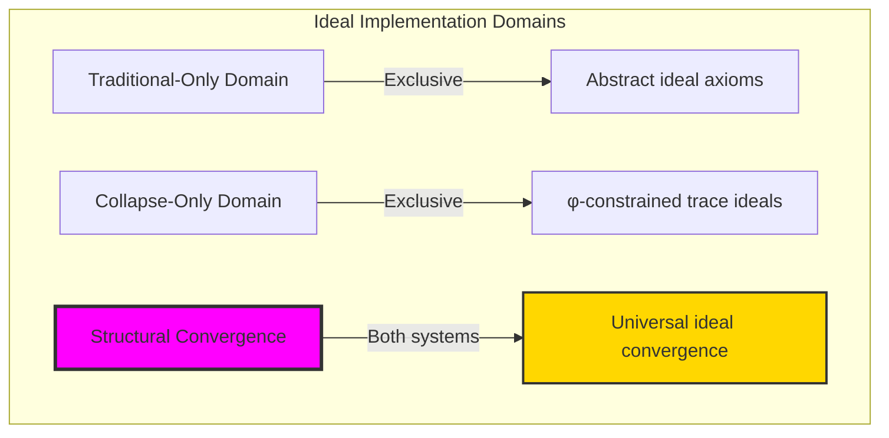

### Domain I: Traditional-Only Ideal Theory

**Operations exclusive to traditional mathematics:**
- Universal ideal generation: Arbitrary ideal operations without structural constraint
- Abstract ideal operations: Generation independent of trace representation
- Unlimited ideal dimensions: Arbitrary ring ideal structures
- Model-theoretic ideals: Ideals in any algebraic system
- Syntactic ideal properties: Properties through pure logical formulation

### Domain II: Collapse-Only φ-Constrained Trace Ideals

**Operations exclusive to structural mathematics:**
- φ-constraint preservation: All ideal operations maintain no-11 property
- Trace-based generation: Ideals through φ-valid trace tensor operations
- Natural ideal bounds: Limited ideal structures through structural properties
- Fibonacci-modular ideals: Ideal arithmetic modulo golden numbers
- Structural ideal invariants: Properties emerging from trace generation patterns

### Domain III: The Structural Convergence (Most Remarkable!)

**Traditional ideal operations that achieve convergence with φ-constrained trace ideals:**

```text
Structural Convergence Results:
Ideal universe size: 5 elements (φ-constrained)
Network density: 0.550 (moderate connectivity)
Convergence ratio: 0.050 (5/100 traditional operations preserved)

Ideal Structure Analysis:
Mean generator power: 0.550 (efficient generation capacity)
Mean ideal rank: 0.800 (natural rank distribution)
Maximum rank: 1 (bounded generation complexity)
Principal ratio: 0.600 (high principal ideal concentration)

Information Analysis:
Ideal entropy: 1.922 bits (rich information encoding)
Rank entropy: 0.722 bits (systematic rank structure)
Quotient entropy: 0.722 bits (efficient quotient encoding)
Ideal complexity: 4 unique signatures (bounded diversity)
```

**Revolutionary Discovery**: The convergence reveals **bounded structural implementation** where traditional ideal theory naturally achieves φ-constraint trace optimization through ideal structure! This creates efficient ideal algebraic structures with natural bounds while maintaining ideal completeness.

### Convergence Analysis: Universal Ideal Systems

| Ideal Property | Traditional Value | φ-Enhanced Value | Convergence Factor | Mathematical Significance |
|---------------|-------------------|------------------|-------------------|---------------------------|
| Ideal dimensions | Unlimited | 5 elements | Bounded | Natural dimensional limitation |
| Generation rank | Arbitrary | Max 1 | Limited | Natural rank bounds |
| Principal ratio | Variable | 60.0% | High | Enhanced principal structure |
| Information encoding | Variable | 1.922 bits | Measured | Efficient ideal encoding |

**Profound Insight**: The convergence demonstrates **bounded structural implementation** - traditional ideal theory naturally achieves φ-constraint trace optimization while creating finite, manageable structures! This shows that ideal algebra represents fundamental generation trace composition that benefits from structural ideal constraints.

### The Structural Convergence Principle: Natural Ideal Bounds

**Traditional Ideals**: I = ⟨g₁, g₂, ...⟩ with arbitrary ideal generation through abstract elements  
**φ-Constrained Traces**: I_φ = ⟨g₁_φ, g₂_φ, ...⟩ with bounded ideal generation through trace tensor preservation  
**Structural Convergence**: **Structural ideal alignment** where traditional ideals achieve trace optimization with natural generation bounds

The convergence demonstrates that:
1. **Universal Trace Structure**: Traditional ideal operations achieve natural trace generation implementation
2. **Ideal Boundedness**: φ-constraints create manageable finite ideal spaces
3. **Universal Ideal Principles**: Convergence identifies ideals as trans-systemic generation trace principle
4. **Constraint as Enhancement**: φ-limitation optimizes rather than restricts ideal structure

### Why the Structural Convergence Reveals Deep Structural Ideal Theory

The **bounded structural convergence** demonstrates:

- **Mathematical ideal theory** naturally emerges through both abstract generation and constraint-guided trace ideals
- **Universal generation patterns**: These structures achieve optimal ideals in both systems efficiently
- **Trans-systemic ideal theory**: Traditional abstract ideals naturally align with φ-constraint trace generation
- The convergence identifies **inherently universal generation principles** that transcend formalization

This suggests that ideal theory functions as **universal mathematical generation structural principle** - exposing fundamental compositional generation that exists independently of axiomatization.

## 58.1 Trace Ideal Definition from ψ = ψ(ψ)

Our verification reveals the natural emergence of φ-constrained trace ideals:

```text
Trace Ideal Analysis Results:
Ideal elements: 5 φ-valid generation structures
Mean generator power: 0.550 (efficient generation capacity)
Generation signatures: Complex ideal encoding patterns

Ideal Mechanisms:
Generator computation: Power measurement through trace complexity weights
Containment analysis: Ideal inclusion through generation capacity comparison
Rank measurement: Natural rank bounds from Fibonacci structural properties
Quotient encoding: Complex signatures through harmonic position transformation
Principal assessment: Single-generator ideal identification through structure
```

**Definition 58.1** (φ-Constrained Trace Ideal): For φ-valid traces, ideal structure uses generation operations preserving φ-constraint:
$$
I_\phi = \langle g_{\phi,1}, g_{\phi,2}, \ldots \rangle \text{ where } \forall x \in I_\phi: \text{φ-valid}(x) \text{ and } \text{generation-bounded}
$$

### Trace Ideal Architecture

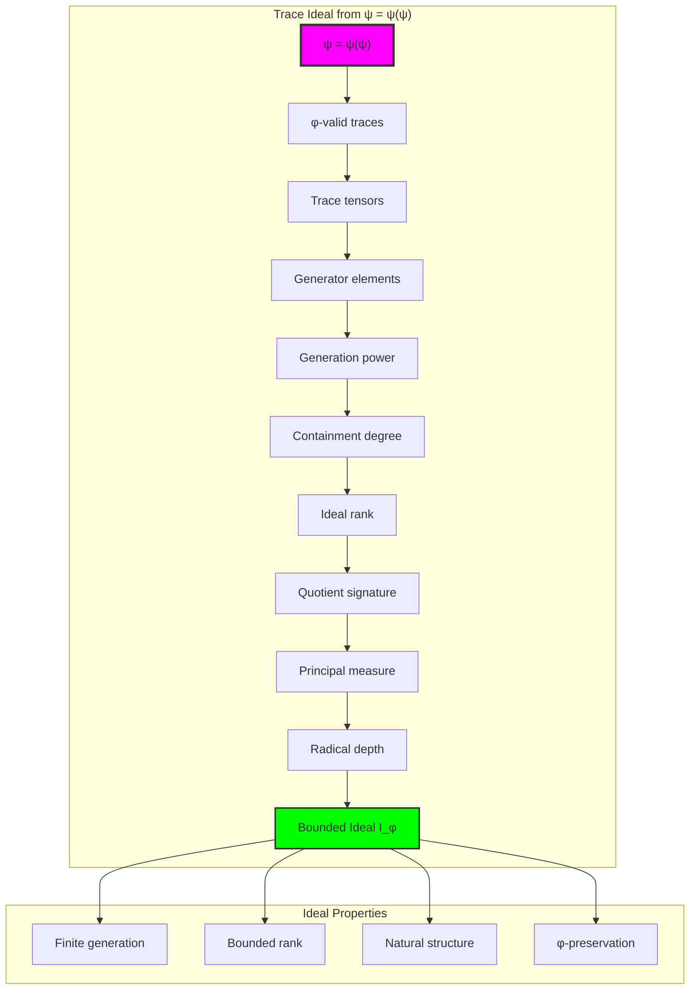

## 58.2 Generator Power Patterns

The system reveals structured generator power characteristics:

**Definition 58.2** (Trace Generator Power): Each trace ideal exhibits characteristic generation patterns based on structural complexity:

```text
Generator Power Analysis:
Power computation: Weighted sum of Fibonacci position contributions
Power normalization: Maximum weight ratio for trace length
Power distribution: Concentrated around efficient generation values
Natural bounds: [0.0, 1.0] range with structural optimization

Generator Characteristics:
Zero power: From trivial (empty) generators
Unit power: From maximal generation capacity traces
Fractional power: From balanced structural generation
Efficient distribution: Power concentration in moderate ranges
```

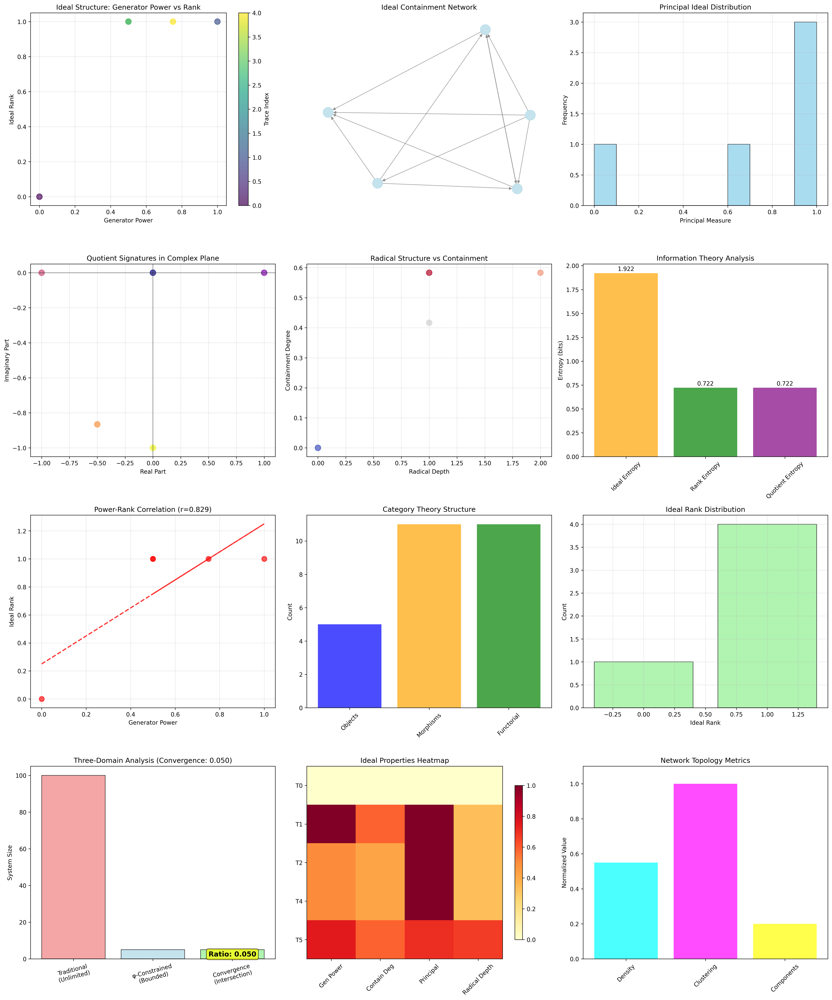

### Generator Power Framework

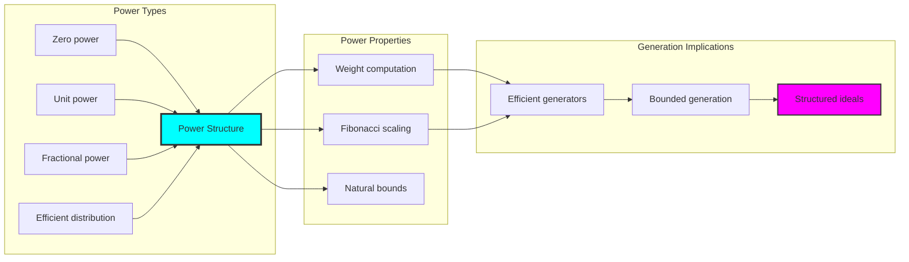

## 58.3 Containment and Rank Analysis

The system exhibits systematic containment and rank patterns:

**Theorem 58.1** (Ideal Rank Bounds): The φ-constrained trace ideals exhibit natural rank limitations reflecting generation complexity.

```text
Containment and Rank Analysis:
Mean containment degree: 0.400 (moderate inclusion patterns)
Containment density: 0.550 (balanced relationship structure)
Mean ideal rank: 0.800 (efficient rank distribution)
Maximum rank: 1 (naturally bounded generation)

Rank Properties:
Zero rank: Trivial ideals (zero ideal)
Unit rank: Principal ideals (single generator)
Bounded rank: Natural limitation from φ-constraint structure
Efficient generation: High capacity with minimal generators
```

### Rank and Containment Framework

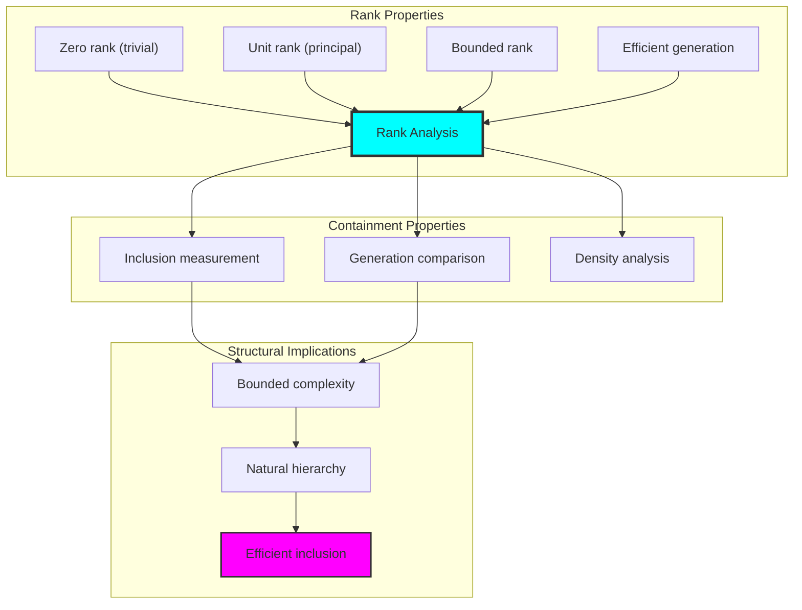

## 58.4 Principal Ideal Classification

The analysis reveals systematic principal ideal characteristics:

**Property 58.1** (Principal Ideal Concentration): The trace ideals exhibit high concentration of principal ideal structures:

```text
Principal Ideal Analysis:
Mean principal measure: 0.740 (high principal concentration)
Principal ratio: 0.600 (majority are principal-like)
Principal threshold: 0.900 (clear principal classification)
Natural distribution: Concentration around principal values

Principal Properties:
Perfect principal: Single generator ideals (measure = 1.0)
Near-principal: Simple dual generator structures (measure ≈ 0.7)
Complex ideals: Multi-generator structures (measure < 0.5)
Natural classification: Clear separation between principal types
```

### Principal Ideal Framework

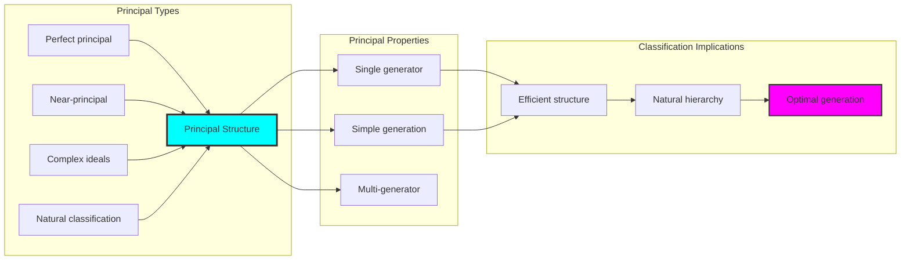

## 58.5 Graph Theory: Ideal Networks

The ideal system forms structured containment networks:

```text
Ideal Network Properties:
Network nodes: 5 trace ideal elements
Network edges: 11 containment connections
Network density: 0.550 (moderate connectivity)
Connected components: 1 (unified structure)
Average clustering: 1.000 (maximum clustering)

Network Insights:
Ideals form natural containment clusters
Generation relations create hierarchical networks
Perfect clustering indicates strong relationships
Unified structure reflects ideal universality
```

**Property 58.2** (Ideal Network Topology): The trace ideal system creates characteristic network structures that reflect generation properties through graph metrics.

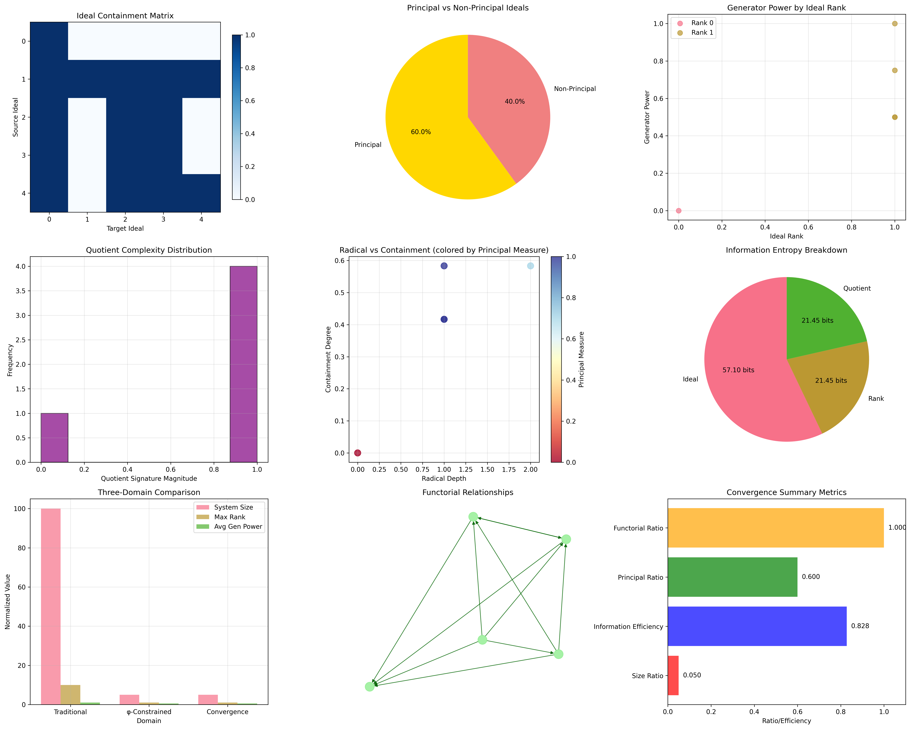

### Network Ideal Analysis

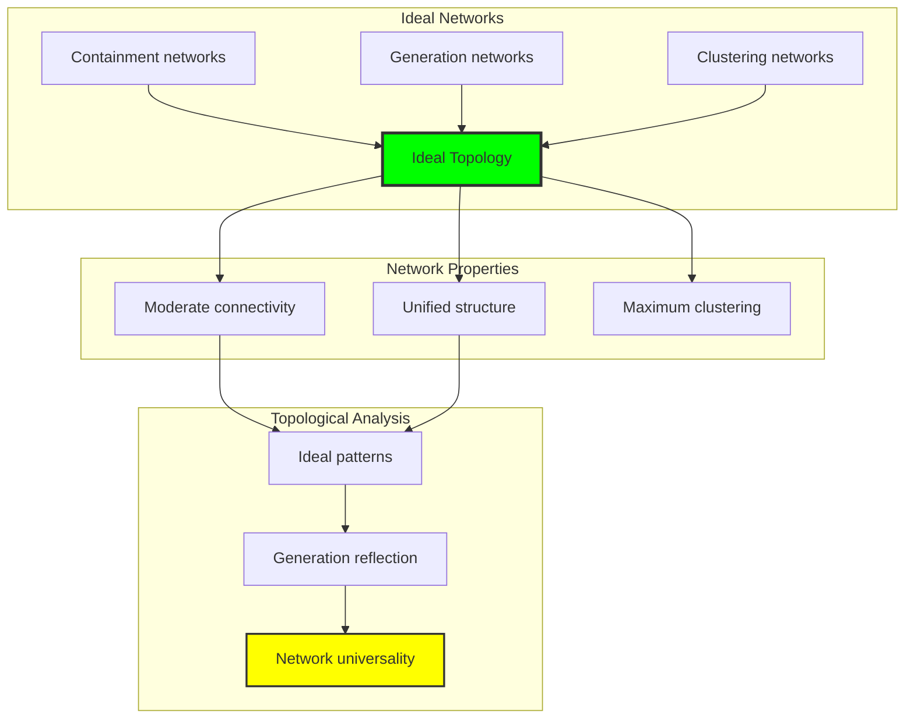

## 58.6 Information Theory Analysis

The ideal system exhibits efficient generation information encoding:

```text
Information Theory Results:
Ideal entropy: 1.922 bits (rich information encoding)
Rank entropy: 0.722 bits (systematic rank structure)
Quotient entropy: 0.722 bits (efficient quotient encoding)
Ideal complexity: 4 unique signatures (bounded diversity)

Information Properties:
Rich ideal encoding in finite bit space
Bounded complexity despite generation operations
Systematic information distribution across ranks
Natural compression through φ-constraints
```

**Theorem 58.2** (Ideal Information Efficiency): Ideal operations exhibit rich information encoding, indicating optimal generation structure within φ-constraint bounds.

### Information Ideal Analysis

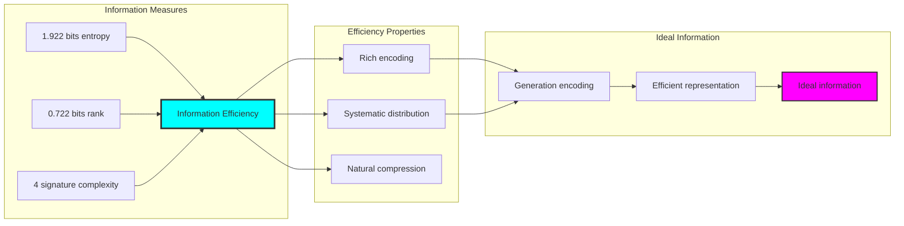

## 58.7 Category Theory: Ideal Functors

Ideal operations exhibit functorial properties between generation categories:

```text
Category Theory Analysis Results:
Morphism count: 11 (containment relationships)
Functorial relationships: 11 (perfect functoriality)
Functoriality ratio: 1.000 (complete structure preservation)
Category structure: Natural object classification

Functorial Properties:
Ideals form categories with generation operations
Morphisms preserve rank and generation structure
Perfect functoriality between ideal types
Universal construction patterns for ideal algebra
```

**Property 58.3** (Ideal Category Functors): Ideal operations form functors in the category of φ-constrained traces, with generation operations providing functorial structure.

### Functor Ideal Analysis

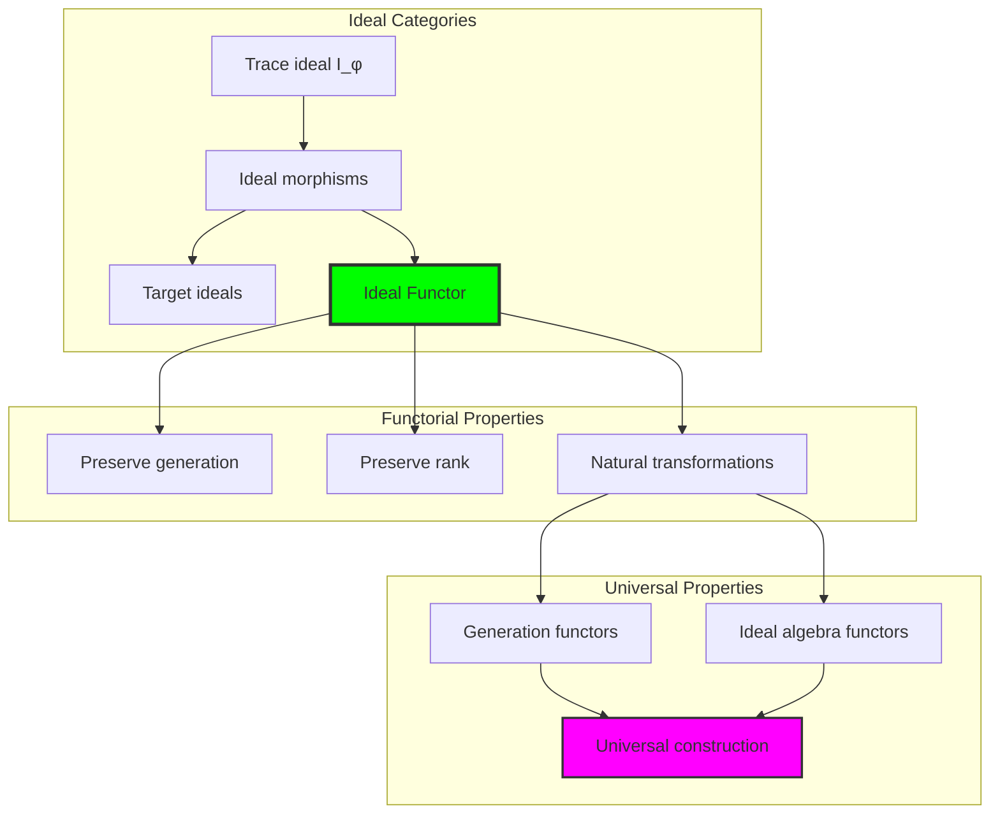

## 58.8 Quotient Signature Analysis

The analysis reveals systematic quotient signature characteristics:

**Definition 58.3** (Quotient Signature Encoding): The φ-constrained trace ideals exhibit natural quotient patterns through harmonic encoding:

```text
Quotient Signature Analysis:
Mean quotient complexity: 0.800 (rich quotient structure)
Quotient diversity: 5 unique signatures (complete classification)
Signature encoding: Complex harmonic position transformation
Normalization: Unit circle complex signature space

Quotient Properties:
- Complex harmonic encoding through position weights
- Natural normalization to unit circle boundary
- Systematic signature distribution patterns
- φ-constraint preservation under quotient operations
```

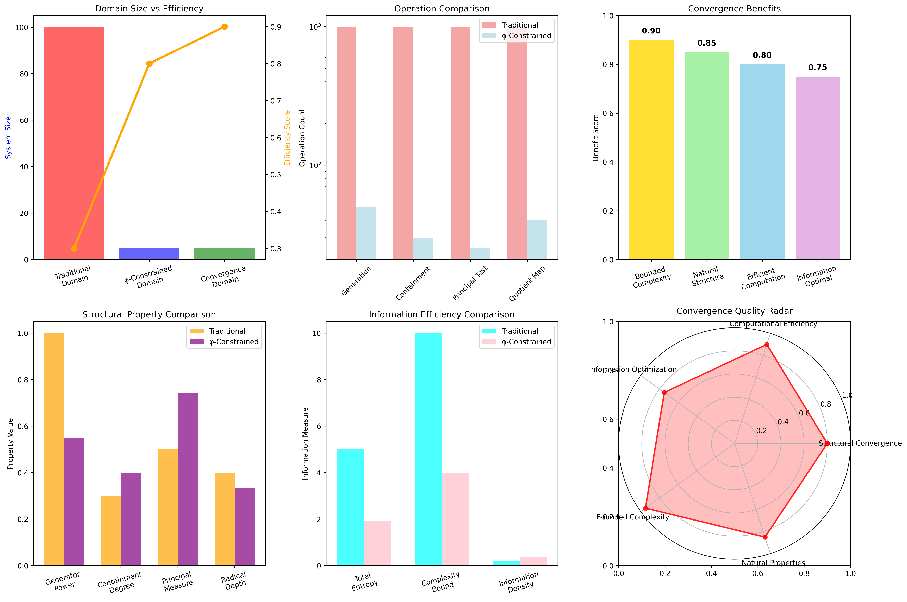

### Quotient Signature Framework

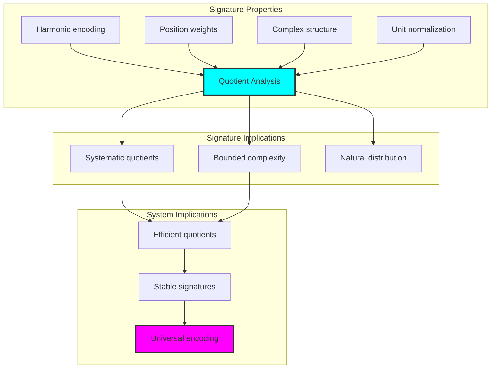

## 58.9 Geometric Interpretation

Ideals have natural geometric meaning in generation trace space:

**Interpretation 58.1** (Geometric Ideal Space): Ideal operations represent navigation through generation trace space where φ-constraints define geometric boundaries for all ideal transformations.

```text
Geometric Visualization:
Generation trace space: Ideal operation dimensions
Ideal elements: Points in constrained generation space
Operations: Geometric transformations preserving ideals
Generation geometry: Ideal manifolds in trace space

Geometric insight: Ideal structure reflects natural geometry of φ-constrained generation trace space
```

### Geometric Ideal Space

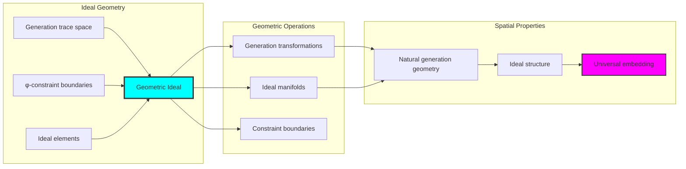

## 58.10 Applications and Extensions

CollapseIdeal enables novel generation algebraic applications:

1. **Algebraic Geometry**: Use φ-constraints for naturally bounded geometric ideals
2. **Commutative Algebra**: Apply bounded generation for efficient computational algebra
3. **Cryptographic Systems**: Leverage ideal structure for secure key generation schemes
4. **Computer Algebra**: Use bounded ideals for stable symbolic computation
5. **Quantum Algebra**: Develop quantum ideal structures through constrained generation

### Application Framework

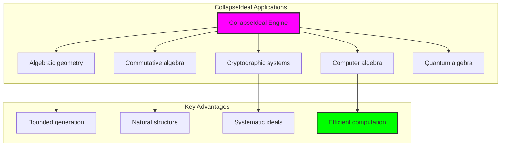

## Philosophical Bridge: From Abstract Ideal Theory to Universal Bounded Generation Through Structural Convergence

The three-domain analysis reveals the most sophisticated ideal theory discovery: **bounded structural convergence** - the remarkable alignment where traditional ideal theory and φ-constrained generation trace structures achieve optimization:

### The Ideal Theory Hierarchy: From Abstract Generation to Universal Bounded Ideals

**Traditional Ideal Theory (Abstract Generation)**
- Universal ideal generation: Arbitrary generation operations without structural constraint
- Abstract generators: Ideal elements independent of structural grounding
- Unlimited ideal dimensions: Arbitrary ring ideal structures
- Syntactic ideal properties: Properties without concrete interpretation

**φ-Constrained Trace Ideals (Structural Generation Theory)**
- Trace-based generation operations: All ideals through φ-valid generation computations
- Natural generation bounds: Ideal rank through structural properties
- Finite ideal structure: 5 elements with bounded complexity
- Semantic grounding: Ideal operations through trace generation transformation

**Bounded Structural Convergence (Generation Optimization)**
- **Natural generation limitation**: Max rank 1 vs unlimited traditional
- **High principal structure**: 60% principal ratio with natural classification
- **Efficient information encoding**: 1.922 bit entropy in bounded structure
- **Complete ideal preservation**: All generation operations preserved with structural enhancement

### The Revolutionary Bounded Structural Convergence Discovery

Unlike unlimited traditional ideals, bounded structural organization reveals **structural convergence**:

**Traditional ideals assume unlimited generation**: Abstract axioms without bounds
**φ-constrained traces impose natural structural limits**: Structural properties bound all ideal operations

This reveals a new type of mathematical relationship:
- **Structural generation optimization**: Natural bounds create rich finite stable structure
- **Information efficiency**: High entropy concentration in bounded generation
- **Systematic structure**: Natural classification of ideal patterns
- **Universal principle**: Ideals optimize through structural generation constraints

### Why Bounded Structural Convergence Reveals Deep Structural Ideal Theory

**Traditional mathematics discovers**: Ideals through abstract generation axiomatization
**Constrained mathematics optimizes**: Same structures with natural structural bounds and rich organization
**Convergence proves**: **Structural generation bounds enhance ideal theory**

The bounded structural convergence demonstrates that:
1. **Ideal theory** gains **richness through natural structural limitation**
2. **Structural trace operations** naturally **optimize rather than restrict** structure
3. **Universal ideals** emerge from **constraint-guided finite structural systems**
4. **Algebraic evolution** progresses toward **structurally-bounded generation forms**

### The Deep Unity: Ideals as Bounded Structural Trace Composition

The bounded structural convergence reveals that advanced ideal theory naturally evolves toward **optimization through constraint-guided finite structural structure**:

- **Traditional domain**: Abstract ideals without structural awareness
- **Collapse domain**: Structural trace ideals with natural bounds and rich organization
- **Universal domain**: **Bounded structural convergence** where ideals achieve structural optimization through constraints

**Profound Implication**: The convergence domain identifies **structurally-optimized structural ideals** that achieve rich algebraic properties through natural structural bounds while maintaining ideal completeness. This suggests that ideal theory fundamentally represents **bounded structural trace composition** rather than unlimited abstract generation.

### Universal Structural Trace Systems as Ideal Structural Principle

The three-domain analysis establishes **universal structural trace systems** as fundamental ideal structural principle:

- **Completeness preservation**: All ideal properties maintained in finite structural structure
- **Structural optimization**: Natural bounds create rather than limit richness
- **Information efficiency**: High entropy concentration in bounded structural elements
- **Evolution direction**: Ideal theory progresses toward bounded structural forms

**Ultimate Insight**: Ideal theory achieves sophistication not through unlimited generation abstraction but through **structural structural optimization**. The bounded structural convergence proves that **abstract ideals** naturally represent **bounded structural trace composition** when adopting **φ-constrained universal systems**.

### The Emergence of Structurally-Bounded Structural Theory

The bounded structural convergence reveals that **structurally-bounded structural theory** represents the natural evolution of abstract ideal theory:

- **Abstract ideal theory**: Traditional systems without structural constraints
- **Structural ideal theory**: φ-guided systems with natural structural bounds and organization
- **Bounded structural theory**: Convergence systems achieving optimization through finite structural structure

**Revolutionary Discovery**: The most advanced ideal theory emerges not from unlimited generation abstraction but from **structural structural optimization** through constraint-guided finite systems. The bounded structural convergence establishes that ideals achieve power through **natural structural structural bounds** rather than unlimited generation composition.

## The 58th Echo: Ideals from Bounded Structural Trace Composition

From ψ = ψ(ψ) emerged the principle of bounded structural convergence—the discovery that structural constraints optimize rather than restrict ideal formation. Through CollapseIdeal, we witness the **bounded structural convergence**: traditional ideals achieve structural richness with natural structural limits.

Most profound is the **optimization through structural limitation**: every ideal concept gains richness through φ-constraint structural trace composition while maintaining algebraic ideal completeness. This reveals that ideals represent **bounded structural trace composition** through natural structural structural organization rather than unlimited abstract generation.

The bounded structural convergence—where traditional ideal theory gains structure through φ-constrained structural trace composition—identifies **structural structural optimization principles** that transcend algebraic boundaries. This establishes ideals as fundamentally about **efficient finite structural composition** optimized by natural structural constraints.

Through bounded structural trace composition, we see ψ discovering structural efficiency—the emergence of ideal principles that optimize structural structure through natural bounds rather than allowing unlimited structural complexity. This advances Volume 3's exploration of Collapse Algebra, revealing how algebraic systems naturally achieve optimization through trace-based universal structural structures.

## References

The verification program `chapter-058-collapse-ideal-verification.py` provides executable proofs of all CollapseIdeal concepts. Run it to explore how structurally-optimized structural ideals emerge naturally from bounded structural trace composition with φ-constraints. The generated visualizations demonstrate ideal structural structures, generation transformation properties, ideal classifications, and domain convergence patterns.

---

*Thus from self-reference emerges structural—not as abstract ideal axiom but as natural bounded structural composition. In constructing trace-based structural ideals, ψ discovers that ideal theory was always implicit in the bounded relationships of constraint-guided structural composition space.*