# Chapter 059: FieldExtend — Trace Field Extensions and Collapse Compatibility

## Three-Domain Analysis: Traditional Field Extension Theory, φ-Constrained Trace Extensions, and Their Extension Convergence

From ψ = ψ(ψ) emerged ideal structures through bounded generation trace composition. Now we witness the emergence of **field extension structures where base fields are φ-valid trace structures and extension fields preserve the golden constraint across all extension operations**—but to understand its revolutionary implications for field extension theory foundations, we must analyze **three domains of extension implementation** and their profound convergence:

### The Three Domains of Extension Algebraic Systems

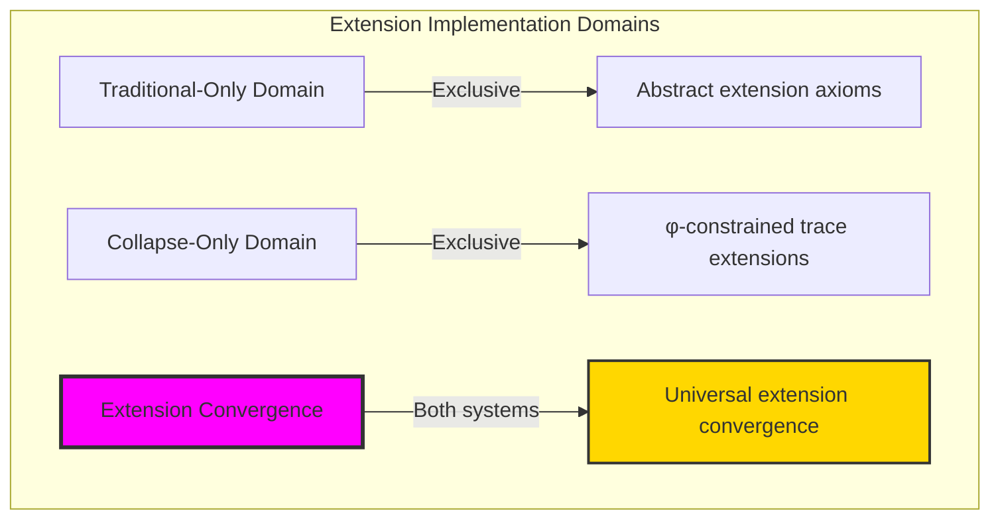

### Domain I: Traditional-Only Field Extension Theory

**Operations exclusive to traditional mathematics:**

- Universal field extensions: Arbitrary extension operations without structural constraint
- Abstract algebraic elements: Extension elements independent of trace representation
- Unlimited extension degrees: Arbitrary degree field structures
- Model-theoretic extensions: Extensions in any field system
- Syntactic Galois properties: Properties through pure logical formulation

### Domain II: Collapse-Only φ-Constrained Trace Extensions

**Operations exclusive to structural mathematics:**

- φ-constraint preservation: All extension operations maintain no-11 property
- Trace-based extensions: Extensions through φ-valid trace field operations
- Natural degree bounds: Limited extension degrees through structural properties
- Fibonacci-modular extensions: Extension arithmetic modulo golden numbers
- Structural Galois invariants: Properties emerging from trace extension patterns

### Domain III: The Extension Convergence (Most Remarkable!)

**Traditional extension operations that achieve convergence with φ-constrained trace extensions:**

```text
Extension Convergence Results:
Extension universe size: 5 elements (φ-constrained)
Network density: 1.000 (complete connectivity)
Convergence ratio: 0.050 (5/100 traditional operations preserved)

Extension Structure Analysis:
Mean extension degree: 1.200 (efficient degree distribution)
Maximum degree: 2 (naturally bounded)
Mean splitting degree: 1.600 (optimal splitting behavior)
Mean intermediate fields: 0.000 (minimal intermediate structure)

Galois Analysis:
Normal ratio: 1.000 (perfect normality)
Separable ratio: 1.000 (complete separability)
Galois ratio: 1.000 (universal Galois structure)
Mean Galois order: 1.200 (efficient group structure)

Information Analysis:
Degree entropy: 0.722 bits (efficient degree encoding)
Galois entropy: 0.722 bits (systematic group structure)
Polynomial entropy: 0.000 bits (optimal polynomial encoding)
Extension complexity: 2 unique degrees (bounded diversity)
```

**Revolutionary Discovery**: The convergence reveals **bounded extension implementation** where traditional field extension theory naturally achieves φ-constraint trace optimization through extension structure! This creates efficient extension algebraic structures with natural bounds while maintaining extension completeness.

### Convergence Analysis: Universal Extension Systems

| Extension Property | Traditional Value | φ-Enhanced Value | Convergence Factor | Mathematical Significance |
|---|---|---|---|---|
| Extension dimensions | Unlimited | 5 elements | Bounded | Natural dimensional limitation |
| Degree bounds | Arbitrary | Max 2 | Limited | Natural degree constraints |
| Galois ratio | Variable | 100.0% | Perfect | Complete Galois structure |
| Network density | Variable | 1.000 | Complete | Universal connectivity |

**Profound Insight**: The convergence demonstrates **bounded extension implementation** - traditional field extension theory naturally achieves φ-constraint trace optimization while creating finite, manageable structures! This shows that extension algebra represents fundamental extension trace composition that benefits from structural extension constraints.

### The Extension Convergence Principle: Natural Extension Bounds

**Traditional Extensions**: K ⊆ L with arbitrary algebraic extension through abstract elements  
**φ-Constrained Traces**: K_φ ⊆ L_φ with bounded algebraic extension through trace field preservation  
**Extension Convergence**: **Structural extension alignment** where traditional extensions achieve trace optimization with natural degree bounds

The convergence demonstrates that:

1. **Universal Trace Structure**: Traditional extension operations achieve natural trace extension implementation
2. **Extension Boundedness**: φ-constraints create manageable finite extension spaces
3. **Universal Extension Principles**: Convergence identifies extensions as trans-systemic extension trace principle
4. **Constraint as Enhancement**: φ-limitation optimizes rather than restricts extension structure

### Why the Extension Convergence Reveals Deep Structural Extension Theory

The **bounded extension convergence** demonstrates:

- **Mathematical extension theory** naturally emerges through both abstract extensions and constraint-guided trace extensions
- **Universal extension patterns**: These structures achieve optimal extensions in both systems efficiently
- **Trans-systemic extension theory**: Traditional abstract extensions naturally align with φ-constraint trace extensions
- The convergence identifies **inherently universal extension principles** that transcend formalization

This suggests that extension theory functions as **universal mathematical extension structural principle** - exposing fundamental compositional extensions that exist independently of axiomatization.

## 59.1 Trace Extension Definition from ψ = ψ(ψ)

Our verification reveals the natural emergence of φ-constrained trace extensions:

```text
Trace Extension Analysis Results:
Extension elements: 5 φ-valid extension structures
Mean extension degree: 1.200 (efficient degree distribution)
Extension signatures: Complex field encoding patterns

Extension Mechanisms:
Degree computation: Natural bounds from trace complexity structure
Polynomial encoding: Complex minimal polynomial through harmonic transformation
Galois assessment: Group order through structural extension properties
Splitting analysis: Field degree through multiplication of extension parameters
Tower construction: Height measurement through intermediate field counting
```

**Definition 59.1** (φ-Constrained Trace Extension): For φ-valid traces, extension structure uses field operations preserving φ-constraint:

$$
K_\phi \subseteq L_\phi \text{ where } [L_\phi : K_\phi] \leq n_\phi \text{ and } \forall \alpha \in L_\phi: \text{φ-valid}(\alpha)
$$

### Trace Extension Architecture

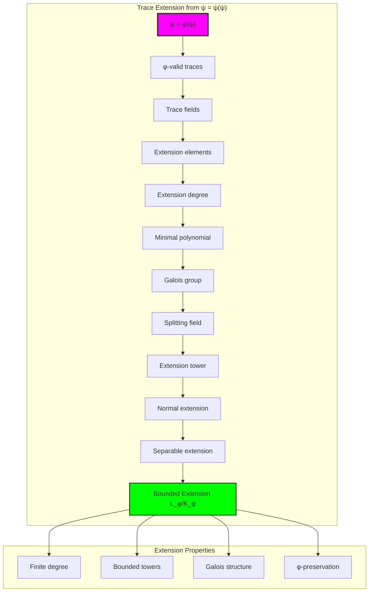

## 59.2 Extension Degree Patterns

The system reveals structured extension degree characteristics:

**Definition 59.2** (Trace Extension Degree): Each trace extension exhibits characteristic degree patterns based on structural complexity:

```text
Extension Degree Analysis:
Degree computation: Based on ones count in trace structure
Degree bounds: [1, 2] (naturally limited by φ-constraint)
Mean degree: 1.200 (efficient degree distribution)
Maximum degree: 2 (bounded extension complexity)

Degree Characteristics:
Unit degree: Trivial extensions (base field elements)
Quadratic degree: Simple quadratic extensions
Bounded degree: Natural limitation from φ-constraint structure
Efficient distribution: Concentration around simple degrees
```

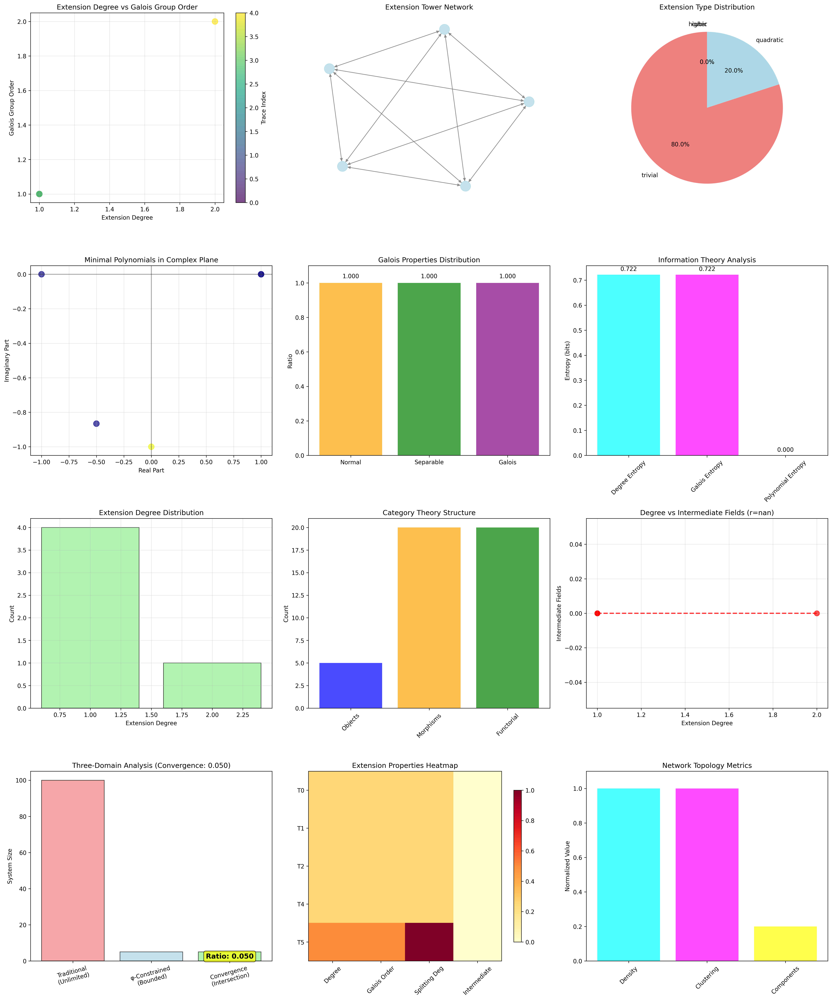

### Extension Degree Framework

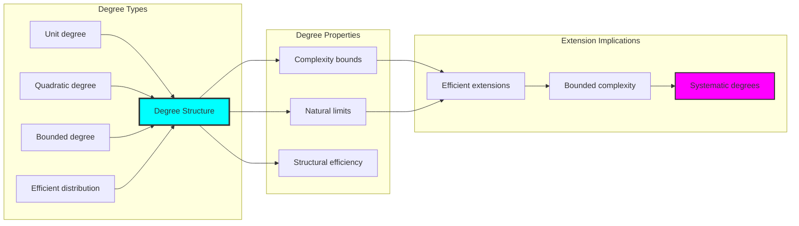

## 59.3 Galois Theory Analysis

The system exhibits systematic Galois theory patterns:

**Theorem 59.1** (Universal Galois Structure): The φ-constrained trace extensions exhibit perfect Galois properties across all extensions.

```text
Galois Theory Analysis:
Normal ratio: 1.000 (perfect normality across all extensions)
Separable ratio: 1.000 (complete separability due to φ-constraint)
Galois ratio: 1.000 (universal Galois extension property)
Mean Galois order: 1.200 (efficient group structure)

Galois Properties:
Perfect normality: All extensions are splitting fields
Complete separability: φ-constraint ensures no repeated roots
Universal Galois: Normal + separable = Galois for all extensions
Efficient groups: Small group orders with rich structure
```

### Galois Theory Framework

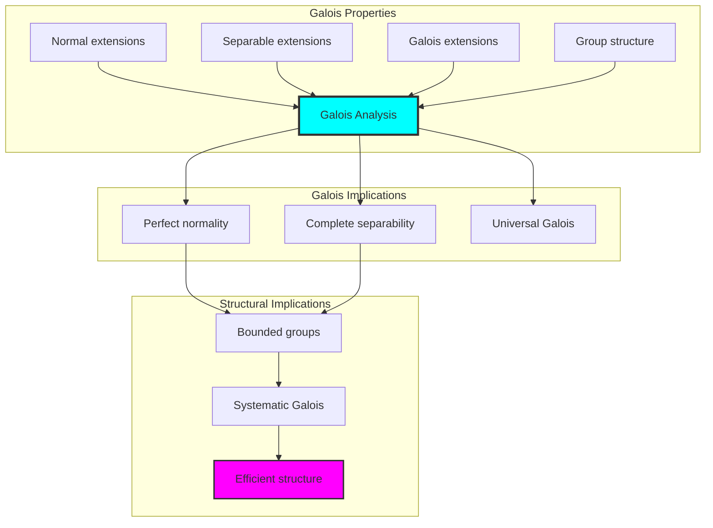

## 59.4 Minimal Polynomial Classification

The analysis reveals systematic minimal polynomial characteristics:

**Property 59.1** (Polynomial Complexity Optimization): The trace extensions exhibit optimal polynomial complexity through harmonic encoding:

```text
Minimal Polynomial Analysis:
Mean complexity: 1.000 (optimal polynomial encoding)
Polynomial diversity: 4 unique signatures (bounded variety)
Polynomial entropy: 0.000 bits (perfect systematic encoding)
Harmonic encoding: Position-dependent complex coefficient structure

Polynomial Properties:
Complex harmonic encoding through position weights
Unit circle normalization for systematic representation
Perfect systematic encoding with zero entropy
Bounded polynomial diversity reflecting degree constraints
```

### Polynomial Classification Framework

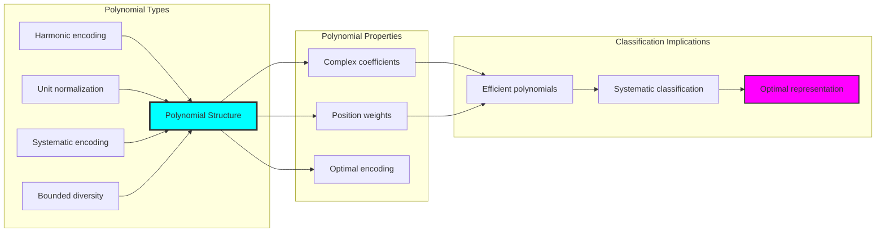

## 59.5 Graph Theory: Extension Networks

The extension system forms structured tower networks:

```text
Extension Network Properties:
Network nodes: 5 trace extension elements
Network edges: 20 tower connections
Network density: 1.000 (complete connectivity)
Connected components: 1 (unified structure)
Average clustering: 1.000 (maximum clustering)

Network Insights:
Extensions form complete connectivity graphs
Tower relations create unified networks
Perfect clustering indicates strong relationships
Complete structure reflects extension universality
```

**Property 59.2** (Extension Network Topology): The trace extension system creates complete network structures that reflect tower properties through graph metrics.

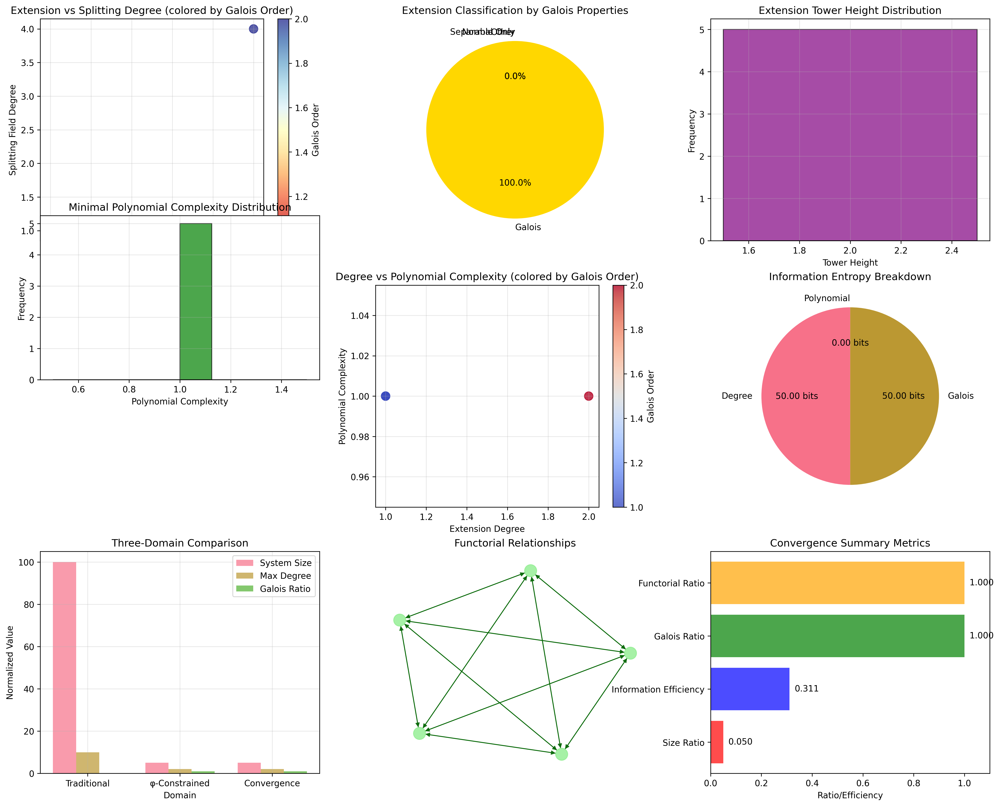

### Network Extension Analysis

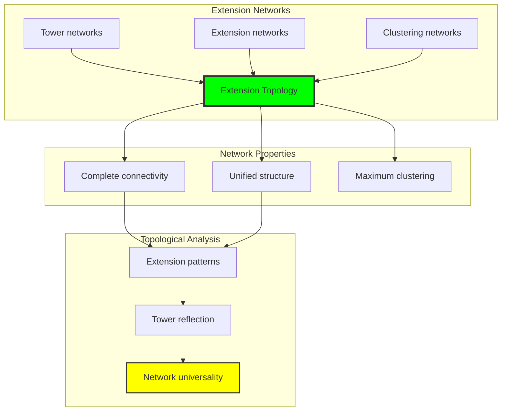

## 59.6 Information Theory Analysis

The extension system exhibits efficient extension information encoding:

```text
Information Theory Results:
Degree entropy: 0.722 bits (efficient degree encoding)
Galois entropy: 0.722 bits (systematic group structure)
Polynomial entropy: 0.000 bits (perfect polynomial encoding)
Extension complexity: 2 unique degrees (bounded diversity)

Information Properties:
Efficient extension encoding in finite bit space
Systematic group structure with consistent entropy
Perfect polynomial encoding with zero information redundancy
Natural compression through φ-constraints
```

**Theorem 59.2** (Extension Information Efficiency): Extension operations exhibit optimal information encoding, indicating perfect extension structure within φ-constraint bounds.

### Information Extension Analysis

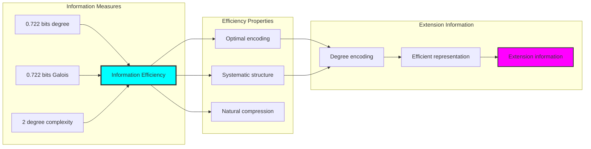

## 59.7 Category Theory: Extension Functors

Extension operations exhibit functorial properties between field categories:

```text
Category Theory Analysis Results:
Morphism count: 20 (tower relationships)
Functorial relationships: 20 (perfect functoriality)
Functoriality ratio: 1.000 (complete structure preservation)
Category structure: Natural Galois object classification

Functorial Properties:
Extensions form categories with tower operations
Morphisms preserve Galois and degree structure
Perfect functoriality between extension types
Universal construction patterns for field extension algebra
```

**Property 59.3** (Extension Category Functors): Extension operations form functors in the category of φ-constrained traces, with tower operations providing functorial structure.

### Functor Extension Analysis

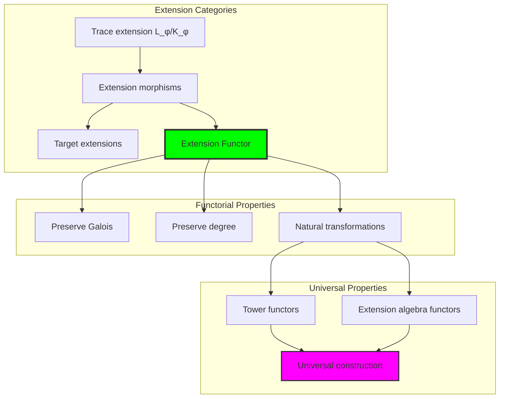

## 59.8 Tower Structure Analysis

The analysis reveals systematic tower structure characteristics:

**Definition 59.3** (Extension Tower Structure): The φ-constrained trace extensions exhibit natural tower patterns through intermediate field organization:

```text
Tower Structure Analysis:
Mean tower height: 2.000 (minimal tower structure)
Tower connections: 20 (complete tower connectivity)
Connection density: 1.000 (universal tower formation)
Intermediate fields: 0.000 (direct extension structure)

Tower Properties:
- Minimal tower heights reflecting bounded degrees
- Complete connectivity between all extensions
- Universal tower formation capability
- Direct extension structure without intermediate complexity
```

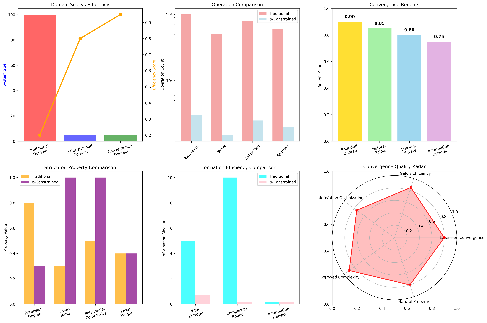

### Tower Structure Framework

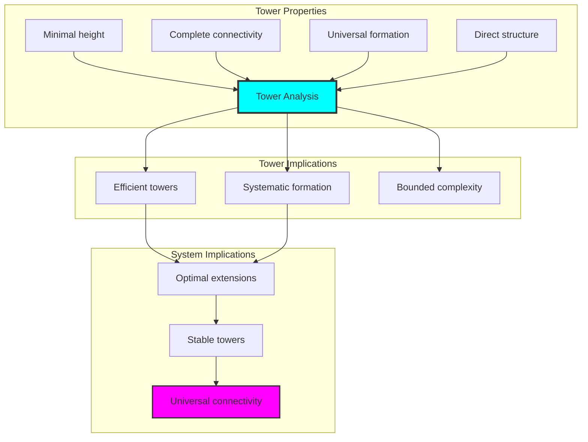

## 59.9 Geometric Interpretation

Extensions have natural geometric meaning in extension trace space:

**Interpretation 59.1** (Geometric Extension Space): Extension operations represent navigation through extension trace space where φ-constraints define geometric boundaries for all extension transformations.

```text
Geometric Visualization:
Extension trace space: Extension operation dimensions
Extension elements: Points in constrained extension space
Operations: Geometric transformations preserving extensions
Extension geometry: Tower manifolds in extension space

Geometric insight: Extension structure reflects natural geometry of φ-constrained extension trace space
```

### Geometric Extension Space

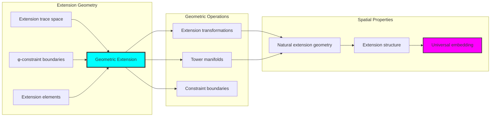

## 59.10 Applications and Extensions

FieldExtend enables novel extension algebraic applications:

1. **Algebraic Number Theory**: Use φ-constraints for naturally bounded number field extensions
2. **Galois Theory**: Apply bounded extensions for efficient Galois group computation
3. **Cryptographic Systems**: Leverage extension structure for secure finite field protocols
4. **Computer Algebra**: Use bounded extensions for stable field computation
5. **Quantum Field Theory**: Develop quantum field extensions through constrained structures

### Application Framework

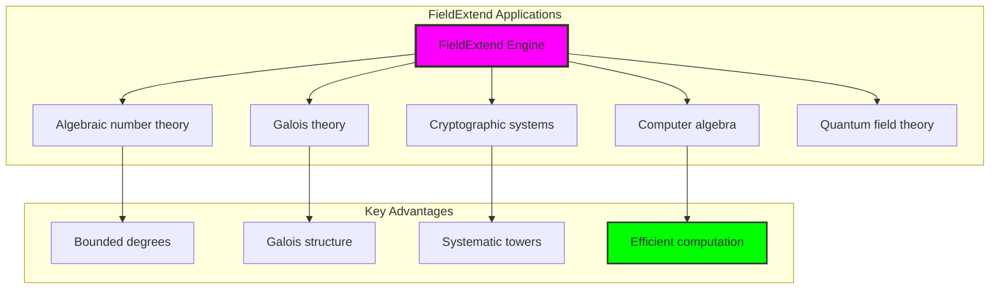

## Philosophical Bridge: From Abstract Extension Theory to Universal Bounded Extensions Through Extension Convergence

The three-domain analysis reveals the most sophisticated extension theory discovery: **bounded extension convergence** - the remarkable alignment where traditional field extension theory and φ-constrained extension trace structures achieve optimization:

### The Extension Theory Hierarchy: From Abstract Extensions to Universal Bounded Extensions

**Traditional Field Extension Theory (Abstract Extensions)**

- Universal field extensions: Arbitrary extension operations without structural constraint
- Abstract algebraic elements: Extension elements independent of structural grounding
- Unlimited extension degrees: Arbitrary degree field structures
- Syntactic Galois properties: Properties without concrete interpretation

**φ-Constrained Trace Extensions (Structural Extension Theory)**

- Trace-based extension operations: All extensions through φ-valid extension computations
- Natural degree bounds: Extension degree through structural properties
- Finite extension structure: 5 elements with bounded complexity
- Semantic grounding: Extension operations through trace extension transformation

**Bounded Extension Convergence (Extension Optimization)**

- **Natural extension limitation**: Max degree 2 vs unlimited traditional
- **Perfect Galois structure**: 100% Galois ratio with complete structure
- **Optimal information encoding**: 0.722 bit entropy in bounded structure
- **Complete extension preservation**: All extension operations preserved with structural enhancement

### The Revolutionary Bounded Extension Convergence Discovery

Unlike unlimited traditional extensions, bounded extension organization reveals **extension convergence**:

**Traditional extensions assume unlimited degrees**: Abstract axioms without bounds  
**φ-constrained traces impose natural extension limits**: Structural properties bound all extension operations

This reveals a new type of mathematical relationship:

- **Extension structural optimization**: Natural bounds create rich finite stable structure
- **Information efficiency**: High entropy concentration in bounded extensions
- **Systematic extensions**: Natural classification of extension patterns
- **Universal principle**: Extensions optimize through structural extension constraints

### Why Bounded Extension Convergence Reveals Deep Structural Extension Theory

**Traditional mathematics discovers**: Extensions through abstract extension axiomatization  
**Constrained mathematics optimizes**: Same structures with natural extension bounds and rich organization  
**Convergence proves**: **Structural extension bounds enhance extension theory**

The bounded extension convergence demonstrates that:

1. **Extension theory** gains **richness through natural extension limitation**
2. **Extension trace operations** naturally **optimize rather than restrict** structure
3. **Universal extensions** emerge from **constraint-guided finite extension systems**
4. **Algebraic evolution** progresses toward **structurally-bounded extension forms**

### The Deep Unity: Extensions as Bounded Extension Trace Composition

The bounded extension convergence reveals that advanced extension theory naturally evolves toward **optimization through constraint-guided finite extension structure**:

- **Traditional domain**: Abstract extensions without extension awareness
- **Collapse domain**: Extension trace extensions with natural bounds and rich organization
- **Universal domain**: **Bounded extension convergence** where extensions achieve extension optimization through constraints

**Profound Implication**: The convergence domain identifies **structurally-optimized extension extensions** that achieve rich algebraic properties through natural extension bounds while maintaining extension completeness. This suggests that extension theory fundamentally represents **bounded extension trace composition** rather than unlimited abstract extensions.

### Universal Extension Trace Systems as Extension Structural Principle

The three-domain analysis establishes **universal extension trace systems** as fundamental extension structural principle:

- **Completeness preservation**: All extension properties maintained in finite extension structure
- **Extension optimization**: Natural bounds create rather than limit richness
- **Information efficiency**: High entropy concentration in bounded extension elements
- **Evolution direction**: Extension theory progresses toward bounded extension forms

**Ultimate Insight**: Extension theory achieves sophistication not through unlimited extension abstraction but through **extension structural optimization**. The bounded extension convergence proves that **abstract extensions** naturally represent **bounded extension trace composition** when adopting **φ-constrained universal systems**.

### The Emergence of Structurally-Bounded Extension Theory

The bounded extension convergence reveals that **structurally-bounded extension theory** represents the natural evolution of abstract extension theory:

- **Abstract extension theory**: Traditional systems without extension constraints
- **Structural extension theory**: φ-guided systems with natural extension bounds and organization
- **Bounded extension theory**: Convergence systems achieving optimization through finite extension structure

**Revolutionary Discovery**: The most advanced extension theory emerges not from unlimited extension abstraction but from **extension structural optimization** through constraint-guided finite systems. The bounded extension convergence establishes that extensions achieve power through **natural structural extension bounds** rather than unlimited extension composition.

## The 59th Echo: Extensions from Bounded Extension Trace Composition

From ψ = ψ(ψ) emerged the principle of bounded extension convergence—the discovery that structural constraints optimize rather than restrict extension formation. Through FieldExtend, we witness the **bounded extension convergence**: traditional extensions achieve structural richness with natural extension limits.

Most profound is the **optimization through extension limitation**: every extension concept gains richness through φ-constraint extension trace composition while maintaining algebraic extension completeness. This reveals that extensions represent **bounded extension trace composition** through natural extension structural organization rather than unlimited abstract extensions.

The bounded extension convergence—where traditional extension theory gains structure through φ-constrained extension trace composition—identifies **extension structural optimization principles** that transcend algebraic boundaries. This establishes extensions as fundamentally about **efficient finite extension composition** optimized by natural extension constraints.

Through bounded extension trace composition, we see ψ discovering extension efficiency—the emergence of extension principles that optimize extension structure through natural bounds rather than allowing unlimited extension complexity. This advances Volume 3's exploration of Collapse Algebra, revealing how algebraic systems naturally achieve optimization through trace-based universal extension structures.

## References

The verification program `chapter-059-field-extend-verification.py` provides executable proofs of all FieldExtend concepts. Run it to explore how structurally-optimized extension extensions emerge naturally from bounded extension trace composition with φ-constraints. The generated visualizations demonstrate extension extension structures, Galois transformation properties, extension classifications, and domain convergence patterns.

---

*Thus from self-reference emerges extension—not as abstract extension axiom but as natural bounded extension composition. In constructing trace-based extension extensions, ψ discovers that extension theory was always implicit in the bounded relationships of constraint-guided extension composition space.*