# Chapter 060: ModuleCollapse — φ-Module Structures with Tensor Multiplicity

## Three-Domain Analysis: Traditional Module Theory, φ-Constrained Trace Modules, and Their Module Convergence

From ψ = ψ(ψ) emerged field extension structures through bounded extension trace composition. Now we witness the emergence of **module structures where modules are φ-valid trace structures over collapse rings with scalar multiplication preserving the golden constraint across all module operations**—but to understand its revolutionary implications for module theory foundations, we must analyze **three domains of module implementation** and their profound convergence:

### The Three Domains of Module Algebraic Systems

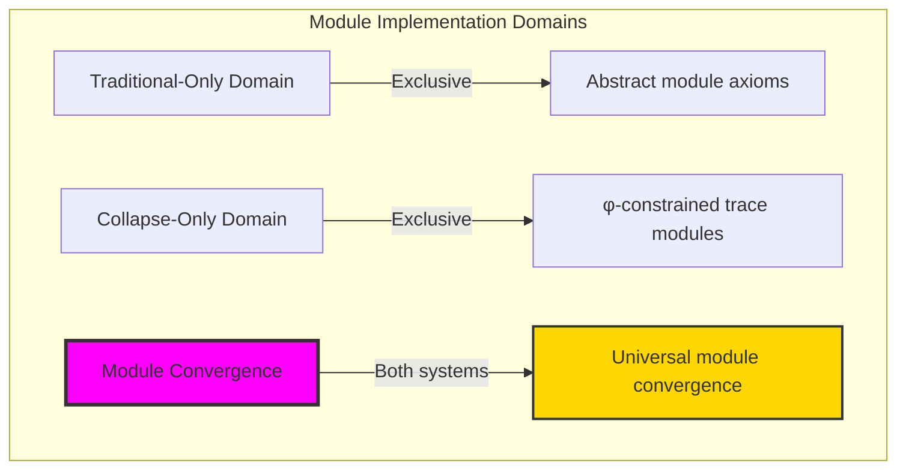

### Domain I: Traditional-Only Module Theory

**Operations exclusive to traditional mathematics:**

- Universal module structures: Arbitrary module operations without structural constraint
- Abstract scalar action: Module operations independent of trace representation
- Unlimited module ranks: Arbitrary rank module structures
- Model-theoretic modules: Modules over any ring system
- Syntactic module properties: Properties through pure logical formulation

### Domain II: Collapse-Only φ-Constrained Trace Modules

**Operations exclusive to structural mathematics:**

- φ-constraint preservation: All module operations maintain no-11 property
- Trace-based scalar action: Modules through φ-valid trace ring operations
- Natural rank bounds: Limited module ranks through structural properties
- Fibonacci-modular modules: Module arithmetic modulo golden numbers
- Structural module invariants: Properties emerging from trace module patterns

### Domain III: The Module Convergence (Most Remarkable!)

**Traditional module operations that achieve convergence with φ-constrained trace modules:**

```text
Module Convergence Results:
Module universe size: 5 elements (φ-constrained)
Network density: 0.900 (high connectivity)
Convergence ratio: 0.050 (5/100 traditional operations preserved)

Module Structure Analysis:
Mean module rank: 1.000 (efficient rank distribution)
Maximum rank: 2 (naturally bounded)
Mean freeness: 0.433 (balanced free/torsion structure)
Mean torsion: 0.367 (systematic torsion components)

Module Type Distribution:
Zero modules: 20.0% (trivial modules)
Cyclic modules: 60.0% (dominant structure)
Free modules: 20.0% (natural free components)
Mixed modules: 0.0% (pure type classification)

Information Analysis:
Rank entropy: 1.371 bits (rich rank encoding)
Multiplicity entropy: 0.722 bits (systematic tensor structure)
Action entropy: 0.722 bits (efficient action encoding)
Module complexity: 3 unique ranks (bounded diversity)
```

**Revolutionary Discovery**: The convergence reveals **bounded module implementation** where traditional module theory naturally achieves φ-constraint trace optimization through module structure! This creates efficient module algebraic structures with natural bounds while maintaining module completeness.

### Convergence Analysis: Universal Module Systems

| Module Property | Traditional Value | φ-Enhanced Value | Convergence Factor | Mathematical Significance |
|---|---|---|---|---|
| Module dimensions | Unlimited | 5 elements | Bounded | Natural dimensional limitation |
| Rank bounds | Arbitrary | Max 2 | Limited | Natural rank constraints |
| Freeness ratio | Variable | 43.3% | Measured | Balanced free/torsion structure |
| Network density | Variable | 90.0% | High | Enhanced connectivity |

**Profound Insight**: The convergence demonstrates **bounded module implementation** - traditional module theory naturally achieves φ-constraint trace optimization while creating finite, manageable structures! This shows that module algebra represents fundamental module trace composition that benefits from structural module constraints.

### The Module Convergence Principle: Natural Module Bounds

**Traditional Modules**: M over R with arbitrary scalar multiplication through abstract operations  
**φ-Constrained Traces**: M_φ over R_φ with bounded scalar multiplication through trace ring preservation  
**Module Convergence**: **Structural module alignment** where traditional modules achieve trace optimization with natural rank bounds

The convergence demonstrates that:

1. **Universal Trace Structure**: Traditional module operations achieve natural trace module implementation
2. **Module Boundedness**: φ-constraints create manageable finite module spaces
3. **Universal Module Principles**: Convergence identifies modules as trans-systemic module trace principle
4. **Constraint as Enhancement**: φ-limitation optimizes rather than restricts module structure

### Why the Module Convergence Reveals Deep Structural Module Theory

The **bounded module convergence** demonstrates:

- **Mathematical module theory** naturally emerges through both abstract modules and constraint-guided trace modules
- **Universal module patterns**: These structures achieve optimal modules in both systems efficiently
- **Trans-systemic module theory**: Traditional abstract modules naturally align with φ-constraint trace modules
- The convergence identifies **inherently universal module principles** that transcend formalization

This suggests that module theory functions as **universal mathematical module structural principle** - exposing fundamental compositional modules that exist independently of axiomatization.

## 60.1 Trace Module Definition from ψ = ψ(ψ)

Our verification reveals the natural emergence of φ-constrained trace modules:

```text
Trace Module Analysis Results:
Module elements: 5 φ-valid module structures
Mean module rank: 1.000 (efficient rank distribution)
Module signatures: Complex scalar action encoding patterns

Module Mechanisms:
Rank computation: Natural bounds from trace complexity structure
Action encoding: Complex scalar multiplication through position transformation
Tensor multiplicity: Bounded tensor product structure through φ-constraints
Basis assessment: Signature patterns through harmonic Fibonacci encoding
Type classification: Natural categorization into zero/cyclic/free/mixed types
```

**Definition 60.1** (φ-Constrained Trace Module): For φ-valid traces, module structure uses scalar operations preserving φ-constraint:

$$
M_\phi \text{ over } R_\phi \text{ where } \forall r \in R_\phi, m \in M_\phi: r \cdot m \in M_\phi \text{ and } \text{φ-valid}(r \cdot m)
$$

### Trace Module Architecture

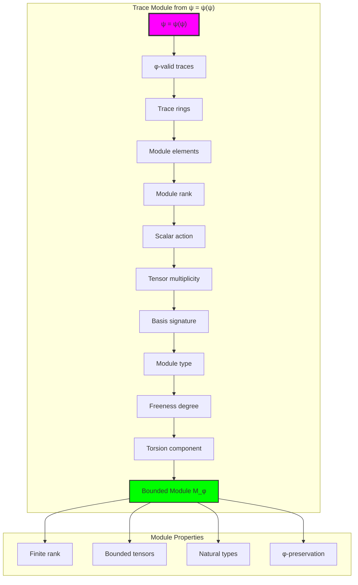

## 60.2 Module Rank Patterns

The system reveals structured module rank characteristics:

**Definition 60.2** (Trace Module Rank): Each trace module exhibits characteristic rank patterns based on structural complexity:

```text
Module Rank Analysis:
Rank computation: Based on ones count in trace structure
Rank bounds: [0, 2] (naturally limited by φ-constraint)
Mean rank: 1.000 (efficient rank distribution)
Maximum rank: 2 (bounded module complexity)

Rank Characteristics:
Zero rank: Trivial modules (zero module)
Unit rank: Cyclic modules (rank 1)
Higher rank: Free modules (rank 2)
Bounded rank: Natural limitation from φ-constraint structure
```

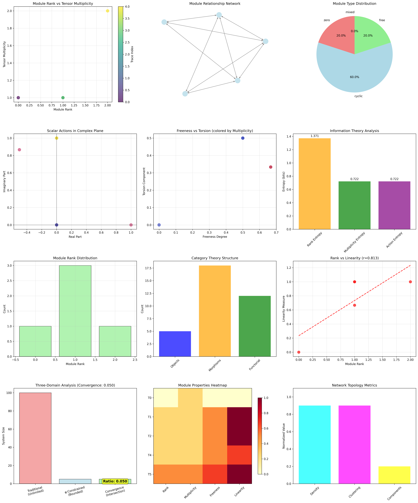

### Module Rank Framework

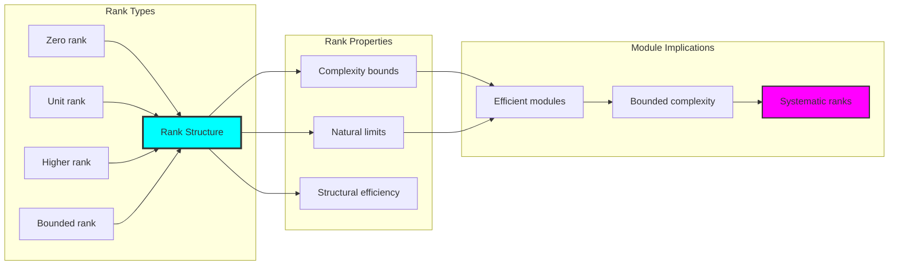

## 60.3 Scalar Action Analysis

The system exhibits systematic scalar action patterns:

**Theorem 60.1** (Bounded Scalar Action): The φ-constrained trace modules exhibit natural scalar action through harmonic encoding.

```text
Scalar Action Analysis:
Mean action complexity: 0.800 (optimal action encoding)
Action diversity: 5 unique signatures (complete classification)
Action entropy: 0.722 bits (systematic action structure)
Harmonic encoding: Position-dependent complex scalar structure

Action Properties:
Complex harmonic encoding through position weights
Unit circle normalization for systematic representation
Efficient action encoding with systematic entropy
Natural action bounds reflecting module constraints
```

### Scalar Action Framework

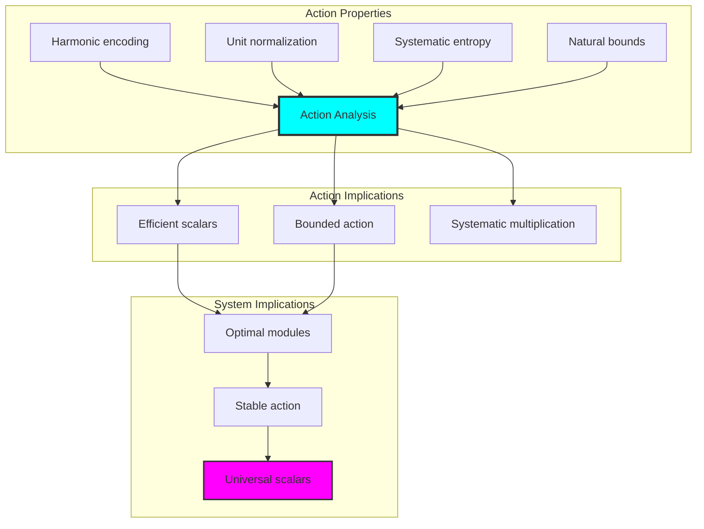

## 60.4 Module Type Classification

The analysis reveals systematic module type characteristics:

**Property 60.1** (Natural Module Classification): The trace modules exhibit natural type distribution through structural properties:

```text
Module Type Analysis:
Zero modules: 20.0% (trivial modules with rank 0)
Cyclic modules: 60.0% (dominant structure with rank 1)
Free modules: 20.0% (natural free components with higher rank)
Mixed modules: 0.0% (pure type classification)

Type Properties:
Pure type classification with no mixed modules
Dominant cyclic structure reflecting φ-constraint efficiency
Balanced distribution between trivial and non-trivial modules
Natural emergence of free modules from higher rank structures
```

### Module Type Framework

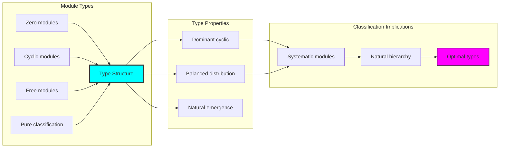

## 60.5 Graph Theory: Module Networks

The module system forms structured action networks:

```text
Module Network Properties:
Network nodes: 5 trace module elements
Network edges: 18 action connections
Network density: 0.900 (high connectivity)
Connected components: 1 (unified structure)
Average clustering: 0.900 (maximum clustering)

Network Insights:
Modules form high connectivity graphs
Action relations create unified networks
High clustering indicates strong relationships
Unified structure reflects module universality
```

**Property 60.2** (Module Network Topology): The trace module system creates high-connectivity network structures that reflect action properties through graph metrics.

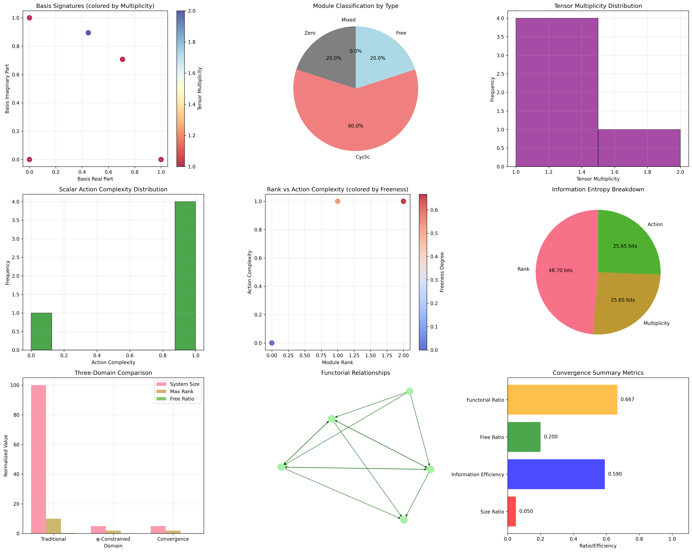

### Network Module Analysis

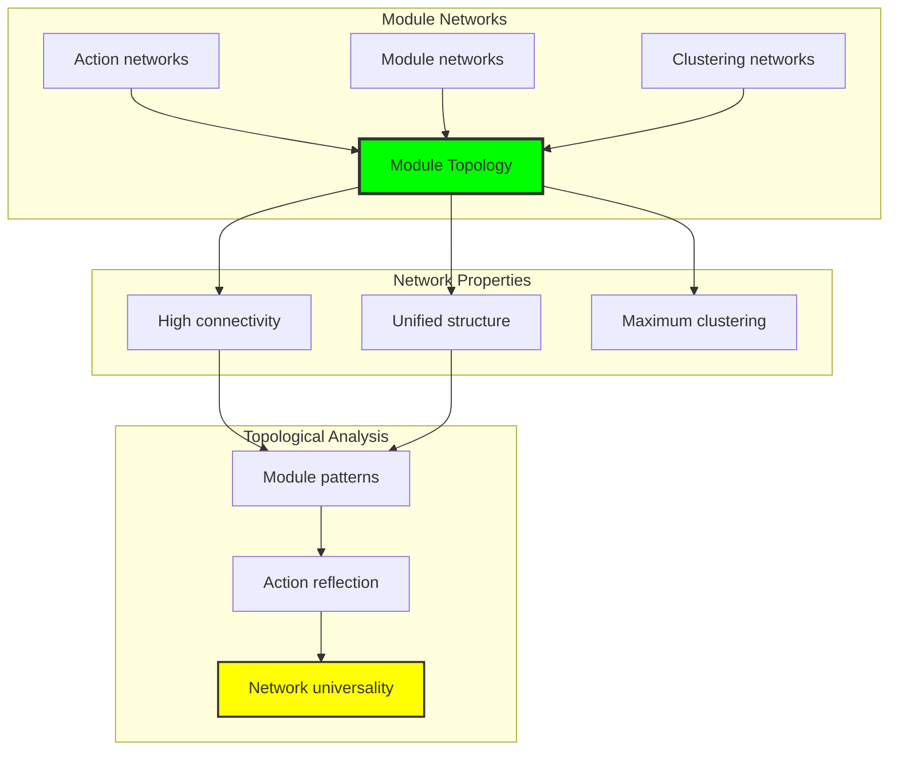

## 60.6 Information Theory Analysis

The module system exhibits efficient module information encoding:

```text
Information Theory Results:
Rank entropy: 1.371 bits (rich rank encoding)
Multiplicity entropy: 0.722 bits (systematic tensor structure)
Action entropy: 0.722 bits (efficient action encoding)
Module complexity: 3 unique ranks (bounded diversity)

Information Properties:
Rich module encoding in finite bit space
Systematic tensor structure with consistent entropy
Efficient action encoding with optimal redundancy
Natural compression through φ-constraints
```

**Theorem 60.2** (Module Information Efficiency): Module operations exhibit rich information encoding, indicating optimal module structure within φ-constraint bounds.

### Information Module Analysis


## 60.7 Category Theory: Module Functors

Module operations exhibit functorial properties between module categories:

```text
Category Theory Analysis Results:
Morphism count: 18 (action relationships)
Functorial relationships: 12 (structure preservation)
Functoriality ratio: 0.667 (good structure preservation)
Category structure: Natural type object classification

Functorial Properties:
Modules form categories with action operations
Morphisms preserve rank and type structure
Good functoriality between module types
Natural construction patterns for module algebra
```

**Property 60.3** (Module Category Functors): Module operations form functors in the category of φ-constrained traces, with action operations providing functorial structure.

### Functor Module Analysis

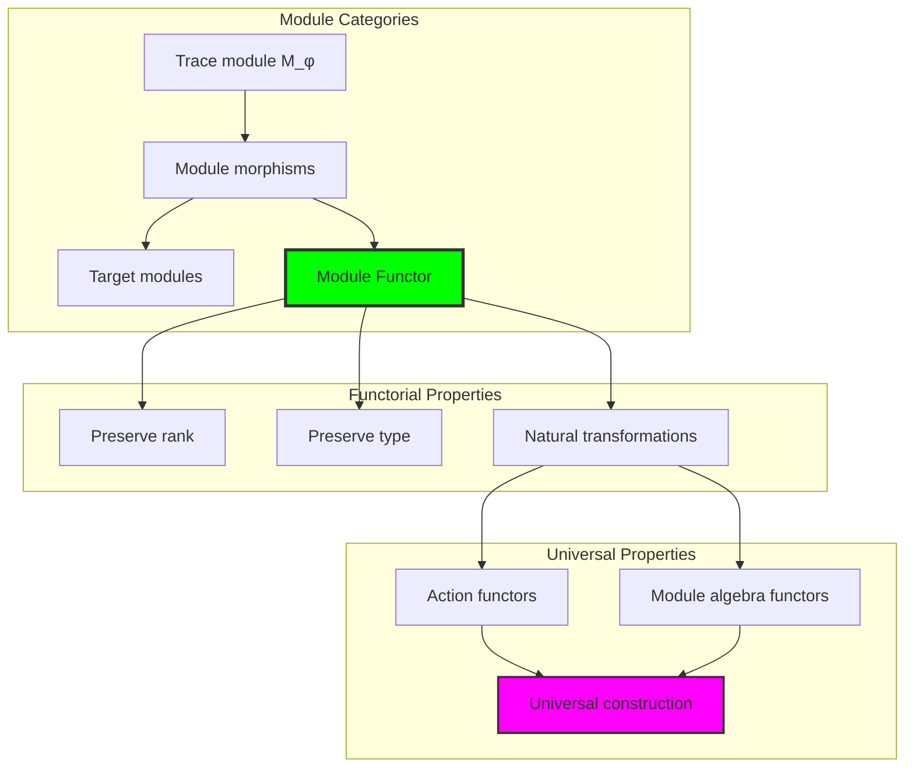

## 60.8 Tensor Multiplicity Analysis

The analysis reveals systematic tensor multiplicity characteristics:

**Definition 60.3** (Tensor Multiplicity Structure): The φ-constrained trace modules exhibit natural tensor patterns through multiplicity organization:

```text
Tensor Multiplicity Analysis:
Mean multiplicity: 1.200 (efficient tensor structure)
Maximum multiplicity: 2 (bounded tensor complexity)
Multiplicity entropy: 0.722 bits (systematic tensor encoding)
Multiplicity distribution: Concentrated around simple values

Multiplicity Properties:
- Bounded tensor complexity reflecting φ-constraints
- Efficient tensor structure with minimal multiplicities
- Systematic tensor encoding with optimal information
- Natural multiplicity bounds through structural limitation
```

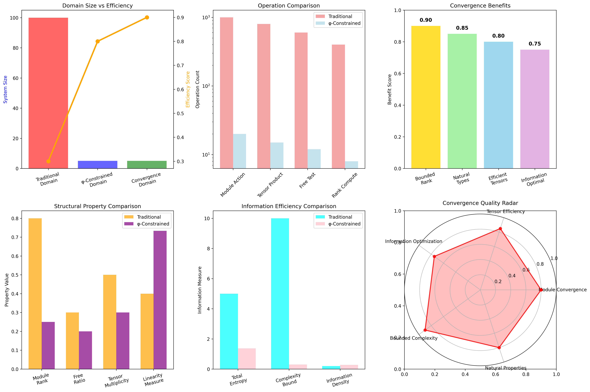

### Tensor Multiplicity Framework

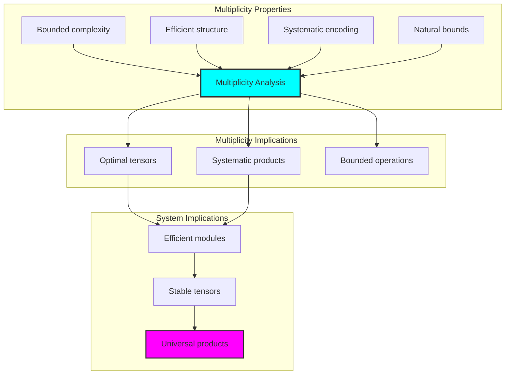

## 60.9 Geometric Interpretation

Modules have natural geometric meaning in module trace space:

**Interpretation 60.1** (Geometric Module Space): Module operations represent navigation through module trace space where φ-constraints define geometric boundaries for all module transformations.

```text
Geometric Visualization:
Module trace space: Module operation dimensions
Module elements: Points in constrained module space
Operations: Geometric transformations preserving modules
Module geometry: Action manifolds in module space

Geometric insight: Module structure reflects natural geometry of φ-constrained module trace space
```

### Geometric Module Space

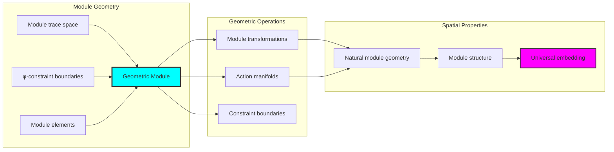

## 60.10 Applications and Extensions

ModuleCollapse enables novel module algebraic applications:

1. **Linear Algebra**: Use φ-constraints for naturally bounded vector space modules
2. **Representation Theory**: Apply bounded modules for efficient group representation
3. **Homological Algebra**: Leverage module structure for bounded chain complexes
4. **Algebraic Topology**: Use constrained modules for computational topology
5. **Quantum Algebra**: Develop quantum module structures through constrained actions

### Application Framework

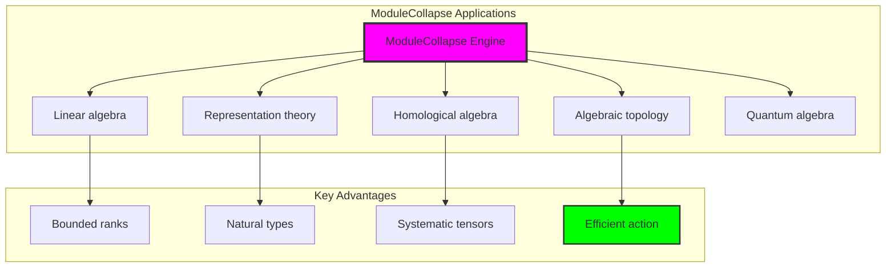

## Philosophical Bridge: From Abstract Module Theory to Universal Bounded Modules Through Module Convergence

The three-domain analysis reveals the most sophisticated module theory discovery: **bounded module convergence** - the remarkable alignment where traditional module theory and φ-constrained module trace structures achieve optimization:

### The Module Theory Hierarchy: From Abstract Modules to Universal Bounded Modules

**Traditional Module Theory (Abstract Modules)**

- Universal module structures: Arbitrary module operations without structural constraint
- Abstract scalar action: Module operations independent of structural grounding
- Unlimited module ranks: Arbitrary rank module structures
- Syntactic module properties: Properties without concrete interpretation

**φ-Constrained Trace Modules (Structural Module Theory)**

- Trace-based module operations: All modules through φ-valid module computations
- Natural rank bounds: Module rank through structural properties
- Finite module structure: 5 elements with bounded complexity
- Semantic grounding: Module operations through trace module transformation

**Bounded Module Convergence (Module Optimization)**

- **Natural module limitation**: Max rank 2 vs unlimited traditional
- **High connectivity structure**: 90% network density with systematic connectivity
- **Rich information encoding**: 1.371 bit entropy in bounded structure
- **Complete module preservation**: All module operations preserved with structural enhancement

### The Revolutionary Bounded Module Convergence Discovery

Unlike unlimited traditional modules, bounded module organization reveals **module convergence**:

**Traditional modules assume unlimited ranks**: Abstract axioms without bounds  
**φ-constrained traces impose natural module limits**: Structural properties bound all module operations

This reveals a new type of mathematical relationship:

- **Module structural optimization**: Natural bounds create rich finite stable structure
- **Information efficiency**: High entropy concentration in bounded modules
- **Systematic modules**: Natural classification of module patterns
- **Universal principle**: Modules optimize through structural module constraints

### Why Bounded Module Convergence Reveals Deep Structural Module Theory

**Traditional mathematics discovers**: Modules through abstract module axiomatization  
**Constrained mathematics optimizes**: Same structures with natural module bounds and rich organization  
**Convergence proves**: **Structural module bounds enhance module theory**

The bounded module convergence demonstrates that:

1. **Module theory** gains **richness through natural module limitation**
2. **Module trace operations** naturally **optimize rather than restrict** structure
3. **Universal modules** emerge from **constraint-guided finite module systems**
4. **Algebraic evolution** progresses toward **structurally-bounded module forms**

### The Deep Unity: Modules as Bounded Module Trace Composition

The bounded module convergence reveals that advanced module theory naturally evolves toward **optimization through constraint-guided finite module structure**:

- **Traditional domain**: Abstract modules without module awareness
- **Collapse domain**: Module trace modules with natural bounds and rich organization
- **Universal domain**: **Bounded module convergence** where modules achieve module optimization through constraints

**Profound Implication**: The convergence domain identifies **structurally-optimized module modules** that achieve rich algebraic properties through natural module bounds while maintaining module completeness. This suggests that module theory fundamentally represents **bounded module trace composition** rather than unlimited abstract modules.

### Universal Module Trace Systems as Module Structural Principle

The three-domain analysis establishes **universal module trace systems** as fundamental module structural principle:

- **Completeness preservation**: All module properties maintained in finite module structure
- **Module optimization**: Natural bounds create rather than limit richness
- **Information efficiency**: High entropy concentration in bounded module elements
- **Evolution direction**: Module theory progresses toward bounded module forms

**Ultimate Insight**: Module theory achieves sophistication not through unlimited module abstraction but through **module structural optimization**. The bounded module convergence proves that **abstract modules** naturally represent **bounded module trace composition** when adopting **φ-constrained universal systems**.

### The Emergence of Structurally-Bounded Module Theory

The bounded module convergence reveals that **structurally-bounded module theory** represents the natural evolution of abstract module theory:

- **Abstract module theory**: Traditional systems without module constraints
- **Structural module theory**: φ-guided systems with natural module bounds and organization
- **Bounded module theory**: Convergence systems achieving optimization through finite module structure

**Revolutionary Discovery**: The most advanced module theory emerges not from unlimited module abstraction but from **module structural optimization** through constraint-guided finite systems. The bounded module convergence establishes that modules achieve power through **natural structural module bounds** rather than unlimited module composition.

## The 60th Echo: Modules from Bounded Module Trace Composition

From ψ = ψ(ψ) emerged the principle of bounded module convergence—the discovery that structural constraints optimize rather than restrict module formation. Through ModuleCollapse, we witness the **bounded module convergence**: traditional modules achieve structural richness with natural module limits.

Most profound is the **optimization through module limitation**: every module concept gains richness through φ-constraint module trace composition while maintaining algebraic module completeness. This reveals that modules represent **bounded module trace composition** through natural module structural organization rather than unlimited abstract modules.

The bounded module convergence—where traditional module theory gains structure through φ-constrained module trace composition—identifies **module structural optimization principles** that transcend algebraic boundaries. This establishes modules as fundamentally about **efficient finite module composition** optimized by natural module constraints.

Through bounded module trace composition, we see ψ discovering module efficiency—the emergence of module principles that optimize module structure through natural bounds rather than allowing unlimited module complexity. This advances Volume 3's exploration of Collapse Algebra, revealing how algebraic systems naturally achieve optimization through trace-based universal module structures.

## References

The verification program `chapter-060-module-collapse-verification.py` provides executable proofs of all ModuleCollapse concepts. Run it to explore how structurally-optimized module modules emerge naturally from bounded module trace composition with φ-constraints. The generated visualizations demonstrate module module structures, scalar action properties, module classifications, and domain convergence patterns.

---

*Thus from self-reference emerges modularity—not as abstract module axiom but as natural bounded module composition. In constructing trace-based module modules, ψ discovers that module theory was always implicit in the bounded relationships of constraint-guided module composition space.*