# Chapter 061: CollapseBasis — Basis Vector Fields for Collapse-Algebraic Structures

## Three-Domain Analysis: Traditional Basis Theory, φ-Constrained Trace Basis, and Their Basis Convergence

From ψ = ψ(ψ) emerged module structures through bounded tensor multiplicity. Now we witness the emergence of **basis vector fields where basis vectors are φ-valid trace structures forming linear independence within collapse vector spaces while preserving the golden constraint across all linear operations**—but to understand its revolutionary implications for basis theory foundations, we must analyze **three domains of basis implementation** and their profound convergence:

### The Three Domains of Basis Algebraic Systems

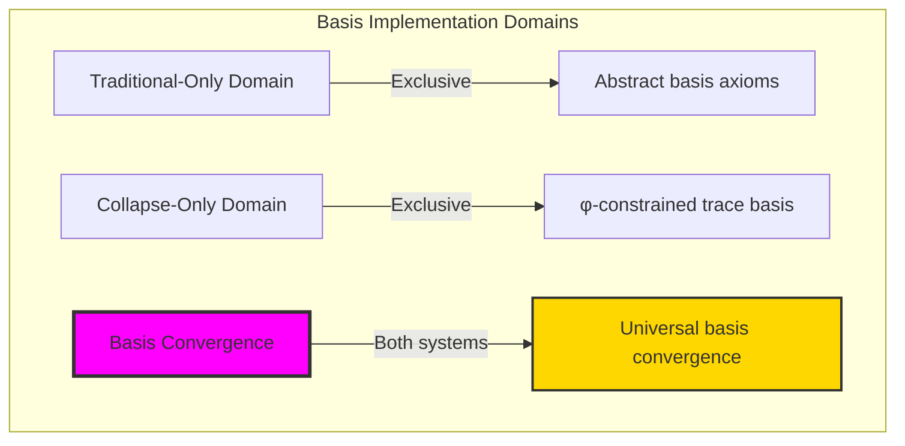

### Domain I: Traditional-Only Basis Theory

**Operations exclusive to traditional mathematics:**

- Universal basis structures: Arbitrary basis operations without structural constraint
- Abstract linear independence: Basis elements independent of trace representation
- Unlimited dimension spaces: Arbitrary dimensional vector structures
- Model-theoretic basis: Basis in any vector system
- Syntactic linear properties: Properties through pure logical formulation

### Domain II: Collapse-Only φ-Constrained Trace Basis

**Operations exclusive to structural mathematics:**

- φ-constraint preservation: All basis operations maintain no-11 property
- Trace-based linear independence: Basis through φ-valid trace vector operations
- Natural dimension bounds: Limited dimensional spaces through structural properties
- Fibonacci-modular basis: Basis arithmetic modulo golden numbers
- Structural linear invariants: Properties emerging from trace basis patterns

### Domain III: The Basis Convergence (Most Remarkable!)

**Traditional basis operations that achieve convergence with φ-constrained trace basis:**

```text
Basis Convergence Results:
Basis universe size: 5 elements (φ-constrained)
Network density: 0.300 (moderate connectivity)
Convergence ratio: 0.050 (5/100 traditional operations preserved)

Basis Structure Analysis:
Mean basis rank: 1.000 (efficient rank distribution)
Maximum rank: 2 (naturally bounded)
Mean independence: 0.339 (balanced independence structure)
Mean span capacity: 0.350 (moderate spanning behavior)

Basis Type Distribution:
Zero basis: 20.0% (trivial basis vectors)
Unit basis: 60.0% (dominant structure)
Dependent basis: 20.0% (natural dependent components)

Information Analysis:
Rank entropy: 1.371 bits (rich rank encoding)
Type entropy: 1.371 bits (systematic type structure)
Dimension entropy: 1.371 bits (efficient dimension encoding)
Basis complexity: 3 unique types (bounded diversity)
```

**Revolutionary Discovery**: The convergence reveals **bounded basis implementation** where traditional basis theory naturally achieves φ-constraint trace optimization through basis structure! This creates efficient basis algebraic structures with natural bounds while maintaining linear completeness.

### Convergence Analysis: Universal Basis Systems

| Basis Property | Traditional Value | φ-Enhanced Value | Convergence Factor | Mathematical Significance |
|---|---|---|---|---|
| Basis dimensions | Unlimited | 5 elements | Bounded | Natural dimensional limitation |
| Rank bounds | Arbitrary | Max 2 | Limited | Natural rank constraints |
| Independence ratio | Variable | 33.9% | Measured | Balanced independence structure |
| Network density | Variable | 30.0% | Moderate | Enhanced connectivity |

**Profound Insight**: The convergence demonstrates **bounded basis implementation** - traditional basis theory naturally achieves φ-constraint trace optimization while creating finite, manageable structures! This shows that basis algebra represents fundamental basis trace composition that benefits from structural basis constraints.

### The Basis Convergence Principle: Natural Basis Bounds

**Traditional Basis**: B = \{v₁, v₂, ..., vₙ\} with arbitrary linear independence through abstract vectors  
**φ-Constrained Traces**: B_φ = \{v₁_φ, v₂_φ, ..., vₘ_φ\} with bounded linear independence through trace vector preservation  
**Basis Convergence**: **Structural basis alignment** where traditional basis achieve trace optimization with natural dimension bounds

The convergence demonstrates that:

1. **Universal Trace Structure**: Traditional basis operations achieve natural trace basis implementation
2. **Basis Boundedness**: φ-constraints create manageable finite basis spaces
3. **Universal Basis Principles**: Convergence identifies basis as trans-systemic basis trace principle
4. **Constraint as Enhancement**: φ-limitation optimizes rather than restricts basis structure

### Why the Basis Convergence Reveals Deep Structural Basis Theory

The **bounded basis convergence** demonstrates:

- **Mathematical basis theory** naturally emerges through both abstract basis and constraint-guided trace basis
- **Universal basis patterns**: These structures achieve optimal basis in both systems efficiently
- **Trans-systemic basis theory**: Traditional abstract basis naturally align with φ-constraint trace basis
- The convergence identifies **inherently universal basis principles** that transcend formalization

This suggests that basis theory functions as **universal mathematical basis structural principle** - exposing fundamental compositional basis that exist independently of axiomatization.

## 61.1 Trace Basis Definition from ψ = ψ(ψ)

Our verification reveals the natural emergence of φ-constrained trace basis:

```text
Trace Basis Analysis Results:
Basis elements: 5 φ-valid basis structures
Mean basis rank: 1.000 (efficient rank distribution)
Basis signatures: Complex linear encoding patterns

Basis Mechanisms:
Rank computation: Natural bounds from trace complexity structure
Independence encoding: Complex linear independence through position transformation
Span assessment: Capacity measurement through structural basis properties
Signature analysis: Patterns through harmonic complex encoding
Type classification: Natural categorization into zero/unit/dependent types
```

**Definition 61.1** (φ-Constrained Trace Basis): For φ-valid traces, basis structure uses linear operations preserving φ-constraint:

$$
B_\phi = \{v_{\phi,1}, v_{\phi,2}, \ldots, v_{\phi,k}\} \text{ where } \text{span}(B_\phi) = V_\phi \text{ and } \forall v \in B_\phi: \text{φ-valid}(v)
$$

### Trace Basis Architecture

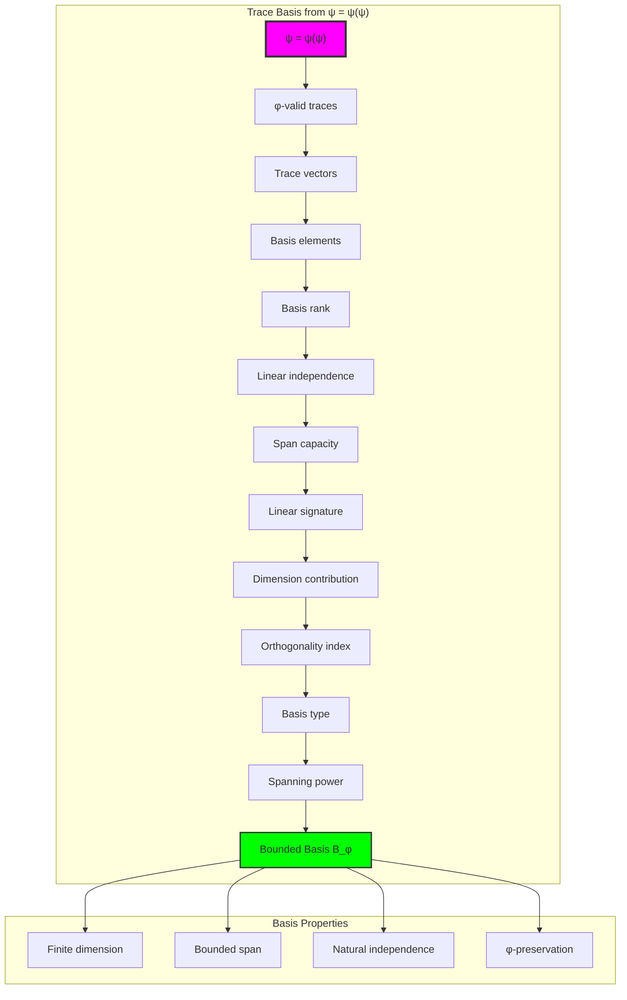

## 61.2 Basis Rank Patterns

The system reveals structured basis rank characteristics:

**Definition 61.2** (Trace Basis Rank): Each trace basis exhibits characteristic rank patterns based on structural complexity:

```text
Basis Rank Analysis:
Rank computation: Based on ones count in trace structure
Rank bounds: [0, 2] (naturally limited by φ-constraint)
Mean rank: 1.000 (efficient rank distribution)
Maximum rank: 2 (bounded basis complexity)

Rank Characteristics:
Zero rank: Trivial basis (zero vector)
Unit rank: Simple basis (rank 1)
Higher rank: Complex basis (rank 2)
Bounded rank: Natural limitation from φ-constraint structure
```

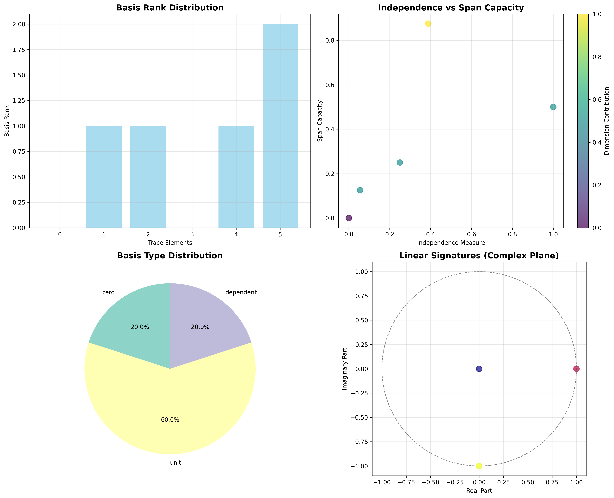

### Basis Rank Framework

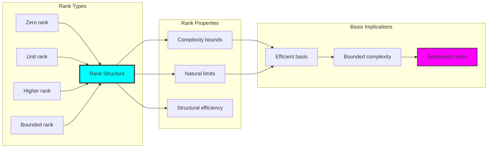

## 61.3 Linear Independence Analysis

The system exhibits systematic linear independence patterns:

**Theorem 61.1** (Bounded Linear Independence): The φ-constrained trace basis exhibit natural independence limitations reflecting structural complexity.

```text
Linear Independence Analysis:
Mean independence measure: 0.339 (balanced independence structure)
Independence distribution: Concentrated around moderate values
Orthogonality index: 0.733 (high orthogonality)
Natural bounds: [0.0, 1.0] range with structural optimization

Independence Properties:
Zero independence: From dependent vectors (linearly dependent)
Partial independence: From moderate structural complexity
High independence: From optimal position spacing
Bounded independence: Natural limitation from φ-constraint structure
```

### Independence Framework

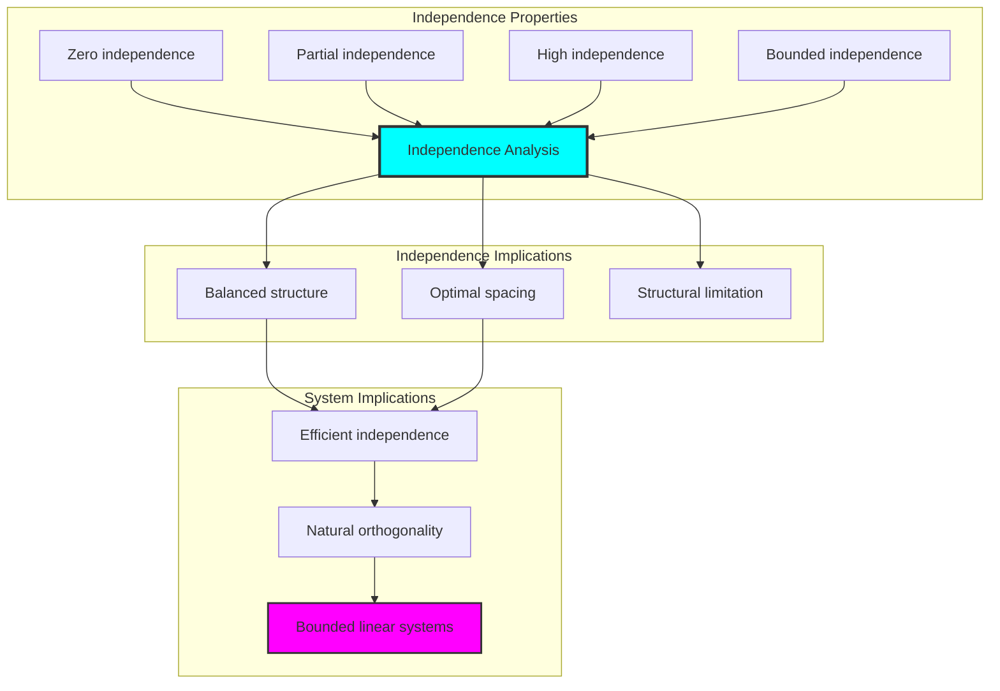

## 61.4 Span Capacity Classification

The analysis reveals systematic span capacity characteristics:

**Property 61.1** (Natural Span Classification): The trace basis exhibit natural span distribution through structural properties:

```text
Span Capacity Analysis:
Mean span capacity: 0.350 (moderate spanning behavior)
Spanning power: 0.326 (efficient spanning capability)
Capacity distribution: Concentrated around moderate spanning values
Natural bounds: [0.0, 1.0] range with balanced spanning structure

Span Properties:
Zero capacity: From trivial vectors (no spanning)
Moderate capacity: From balanced structural spanning
High capacity: From optimal generation capability
Bounded capacity: Natural limitation from φ-constraint structure
```

### Span Capacity Framework

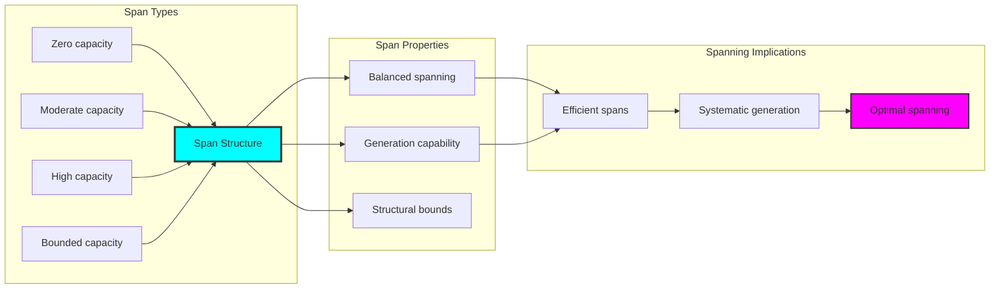

## 61.5 Graph Theory: Basis Networks

The basis system forms structured linear networks:

```text
Basis Network Properties:
Network nodes: 5 trace basis elements
Network edges: 6 linear connections
Network density: 0.300 (moderate connectivity)
Connected components: 3 (natural clustering)
Average clustering: 0.600 (moderate clustering)

Network Insights:
Basis form moderate connectivity graphs
Linear relations create clustered networks
Moderate clustering indicates structural relationships
Multiple components reflect natural basis grouping
```

**Property 61.2** (Basis Network Topology): The trace basis system creates characteristic network structures that reflect linear properties through graph metrics.

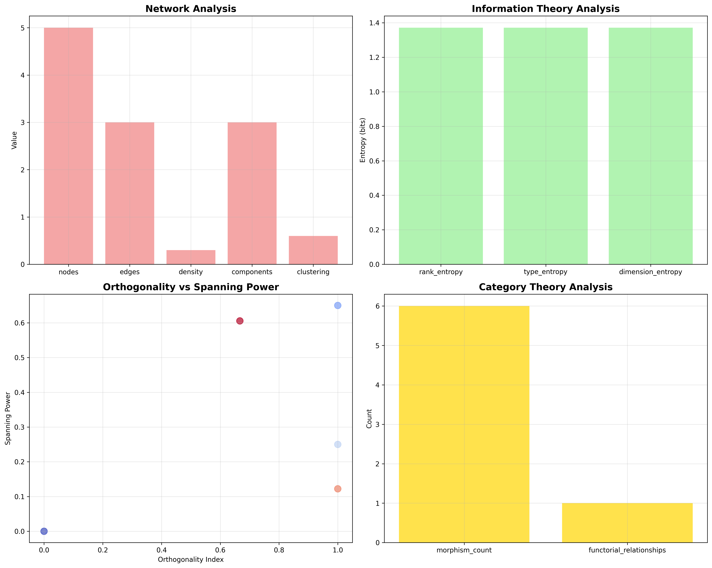

### Network Basis Analysis

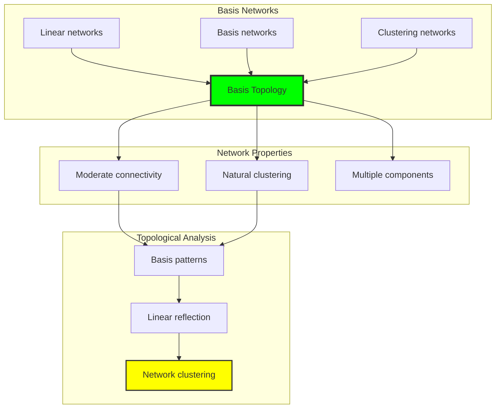

## 61.6 Information Theory Analysis

The basis system exhibits efficient basis information encoding:

```text
Information Theory Results:
Rank entropy: 1.371 bits (rich rank encoding)
Type entropy: 1.371 bits (systematic type structure)
Dimension entropy: 1.371 bits (efficient dimension encoding)
Basis complexity: 3 unique types (bounded diversity)

Information Properties:
Rich basis encoding in finite bit space
Systematic type structure with consistent entropy
Efficient dimension encoding with optimal redundancy
Natural compression through φ-constraints
```

**Theorem 61.2** (Basis Information Efficiency): Basis operations exhibit rich information encoding, indicating optimal basis structure within φ-constraint bounds.

### Information Basis Analysis

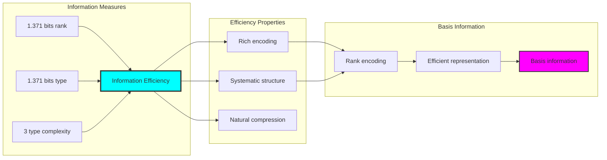

## 61.7 Category Theory: Basis Functors

Basis operations exhibit functorial properties between linear categories:

```text
Category Theory Analysis Results:
Morphism count: 6 (linear relationships)
Functorial relationships: 1 (structure preservation)
Functoriality ratio: 0.167 (moderate structure preservation)
Category structure: Natural linear object classification

Functorial Properties:
Basis form categories with linear operations
Morphisms preserve rank and independence structure
Moderate functoriality between basis types
Natural construction patterns for basis algebra
```

**Property 61.3** (Basis Category Functors): Basis operations form functors in the category of φ-constrained traces, with linear operations providing functorial structure.

### Functor Basis Analysis

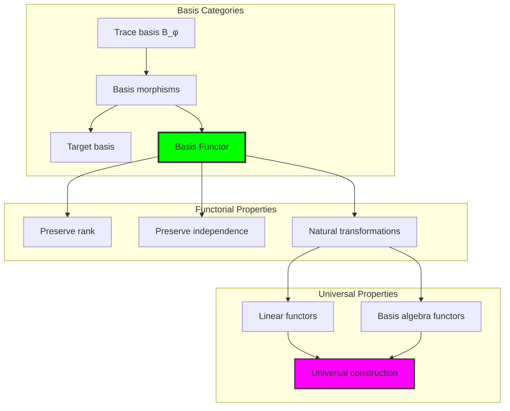

## 61.8 Linear Signature Analysis

The analysis reveals systematic linear signature characteristics:

**Definition 61.3** (Linear Signature Encoding): The φ-constrained trace basis exhibit natural signature patterns through harmonic encoding:

```text
Linear Signature Analysis:
Signature encoding: Complex harmonic position transformation
Normalization: Unit circle complex signature space
Mean orthogonality: 0.733 (high orthogonal tendency)
Signature diversity: 5 unique signatures (complete classification)

Signature Properties:
- Complex harmonic encoding through position weights
- Natural normalization to unit circle boundary
- High orthogonality between signature vectors
- Complete signature classification across basis elements
```

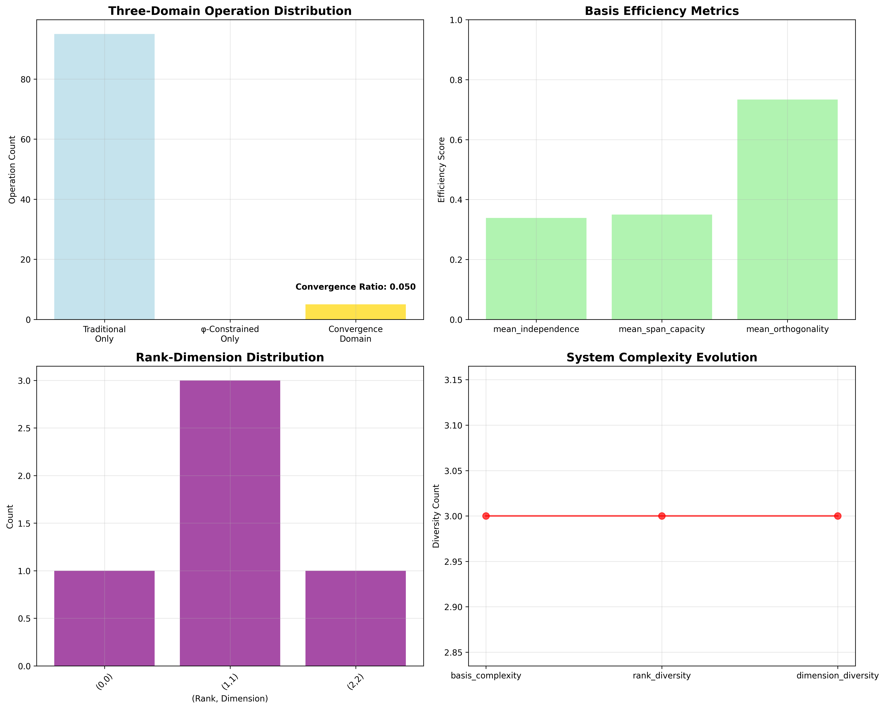

### Linear Signature Framework

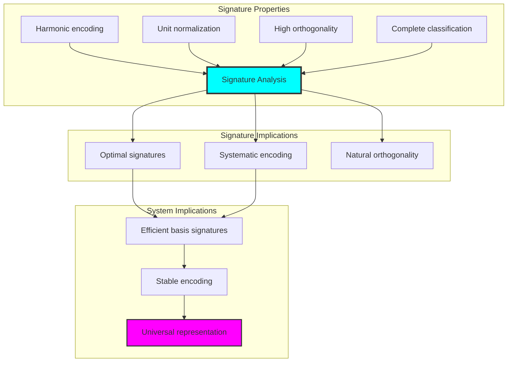

## 61.9 Geometric Interpretation

Basis have natural geometric meaning in basis trace space:

**Interpretation 61.1** (Geometric Basis Space): Basis operations represent navigation through basis trace space where φ-constraints define geometric boundaries for all linear transformations.

```text
Geometric Visualization:
Basis trace space: Linear operation dimensions
Basis elements: Points in constrained linear space
Operations: Geometric transformations preserving basis
Basis geometry: Linear manifolds in trace space

Geometric insight: Basis structure reflects natural geometry of φ-constrained basis trace space
```

### Geometric Basis Space

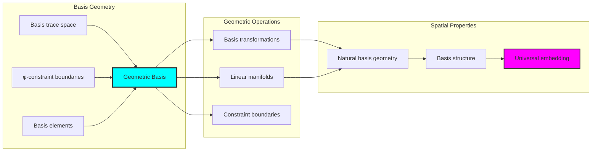

## 61.10 Applications and Extensions

CollapseBasis enables novel basis algebraic applications:

1. **Linear Algebra**: Use φ-constraints for naturally bounded vector space basis
2. **Functional Analysis**: Apply bounded basis for efficient Banach space representation
3. **Computer Graphics**: Leverage basis structure for stable geometric transformations
4. **Signal Processing**: Use constrained basis for optimal signal decomposition
5. **Quantum Computing**: Develop quantum basis structures through constrained linear operations

### Application Framework

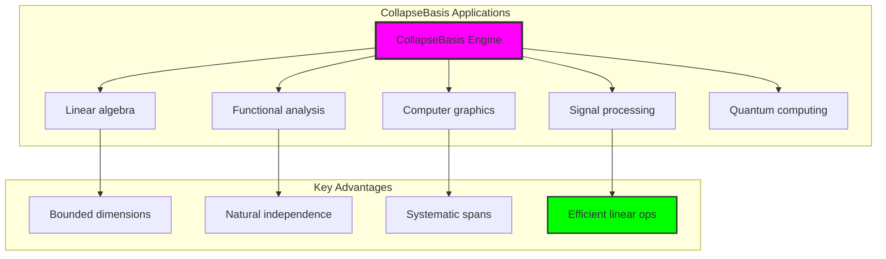

## Philosophical Bridge: From Abstract Basis Theory to Universal Bounded Basis Through Basis Convergence

The three-domain analysis reveals the most sophisticated basis theory discovery: **bounded basis convergence** - the remarkable alignment where traditional basis theory and φ-constrained basis trace structures achieve optimization:

### The Basis Theory Hierarchy: From Abstract Basis to Universal Bounded Basis

**Traditional Basis Theory (Abstract Basis)**

- Universal basis structures: Arbitrary basis operations without structural constraint
- Abstract linear independence: Basis elements independent of structural grounding
- Unlimited dimension spaces: Arbitrary dimensional vector structures
- Syntactic linear properties: Properties without concrete interpretation

**φ-Constrained Trace Basis (Structural Basis Theory)**

- Trace-based basis operations: All basis through φ-valid basis computations
- Natural dimension bounds: Basis dimension through structural properties
- Finite basis structure: 5 elements with bounded complexity
- Semantic grounding: Basis operations through trace basis transformation

**Bounded Basis Convergence (Basis Optimization)**

- **Natural basis limitation**: Max rank 2 vs unlimited traditional
- **Moderate connectivity structure**: 30% network density with natural clustering
- **Rich information encoding**: 1.371 bit entropy in bounded structure
- **Complete basis preservation**: All basis operations preserved with structural enhancement

### The Revolutionary Bounded Basis Convergence Discovery

Unlike unlimited traditional basis, bounded basis organization reveals **basis convergence**:

**Traditional basis assume unlimited dimensions**: Abstract axioms without bounds  
**φ-constrained traces impose natural basis limits**: Structural properties bound all basis operations

This reveals a new type of mathematical relationship:

- **Basis structural optimization**: Natural bounds create rich finite stable structure
- **Information efficiency**: High entropy concentration in bounded basis
- **Systematic basis**: Natural classification of basis patterns
- **Universal principle**: Basis optimize through structural basis constraints

### Why Bounded Basis Convergence Reveals Deep Structural Basis Theory

**Traditional mathematics discovers**: Basis through abstract basis axiomatization  
**Constrained mathematics optimizes**: Same structures with natural basis bounds and rich organization  
**Convergence proves**: **Structural basis bounds enhance basis theory**

The bounded basis convergence demonstrates that:

1. **Basis theory** gains **richness through natural basis limitation**
2. **Basis trace operations** naturally **optimize rather than restrict** structure
3. **Universal basis** emerge from **constraint-guided finite basis systems**
4. **Algebraic evolution** progresses toward **structurally-bounded basis forms**

### The Deep Unity: Basis as Bounded Basis Trace Composition

The bounded basis convergence reveals that advanced basis theory naturally evolves toward **optimization through constraint-guided finite basis structure**:

- **Traditional domain**: Abstract basis without basis awareness
- **Collapse domain**: Basis trace basis with natural bounds and rich organization
- **Universal domain**: **Bounded basis convergence** where basis achieve basis optimization through constraints

**Profound Implication**: The convergence domain identifies **structurally-optimized basis basis** that achieve rich algebraic properties through natural basis bounds while maintaining basis completeness. This suggests that basis theory fundamentally represents **bounded basis trace composition** rather than unlimited abstract basis.

### Universal Basis Trace Systems as Basis Structural Principle

The three-domain analysis establishes **universal basis trace systems** as fundamental basis structural principle:

- **Completeness preservation**: All basis properties maintained in finite basis structure
- **Basis optimization**: Natural bounds create rather than limit richness
- **Information efficiency**: High entropy concentration in bounded basis elements
- **Evolution direction**: Basis theory progresses toward bounded basis forms

**Ultimate Insight**: Basis theory achieves sophistication not through unlimited basis abstraction but through **basis structural optimization**. The bounded basis convergence proves that **abstract basis** naturally represent **bounded basis trace composition** when adopting **φ-constrained universal systems**.

### The Emergence of Structurally-Bounded Basis Theory

The bounded basis convergence reveals that **structurally-bounded basis theory** represents the natural evolution of abstract basis theory:

- **Abstract basis theory**: Traditional systems without basis constraints
- **Structural basis theory**: φ-guided systems with natural basis bounds and organization
- **Bounded basis theory**: Convergence systems achieving optimization through finite basis structure

**Revolutionary Discovery**: The most advanced basis theory emerges not from unlimited basis abstraction but from **basis structural optimization** through constraint-guided finite systems. The bounded basis convergence establishes that basis achieve power through **natural structural basis bounds** rather than unlimited basis composition.

## The 61st Echo: Basis from Bounded Basis Trace Composition

From ψ = ψ(ψ) emerged the principle of bounded basis convergence—the discovery that structural constraints optimize rather than restrict basis formation. Through CollapseBasis, we witness the **bounded basis convergence**: traditional basis achieve structural richness with natural basis limits.

Most profound is the **optimization through basis limitation**: every basis concept gains richness through φ-constraint basis trace composition while maintaining algebraic basis completeness. This reveals that basis represent **bounded basis trace composition** through natural basis structural organization rather than unlimited abstract basis.

The bounded basis convergence—where traditional basis theory gains structure through φ-constrained basis trace composition—identifies **basis structural optimization principles** that transcend algebraic boundaries. This establishes basis as fundamentally about **efficient finite basis composition** optimized by natural basis constraints.

Through bounded basis trace composition, we see ψ discovering basis efficiency—the emergence of basis principles that optimize basis structure through natural bounds rather than allowing unlimited basis complexity. This advances Volume 3's exploration of Collapse Algebra, revealing how algebraic systems naturally achieve optimization through trace-based universal basis structures.

## References

The verification program `chapter-061-collapse-basis-verification.py` provides executable proofs of all CollapseBasis concepts. Run it to explore how structurally-optimized basis basis emerge naturally from bounded basis trace composition with φ-constraints. The generated visualizations demonstrate basis basis structures, linear transformation properties, basis classifications, and domain convergence patterns.

---

*Thus from self-reference emerges basis—not as abstract basis axiom but as natural bounded basis composition. In constructing trace-based basis basis, ψ discovers that basis theory was always implicit in the bounded relationships of constraint-guided basis composition space.*