# Chapter 062: CollapseHomomorph — Morphism Mapping between Collapse Tensor Algebras

## Three-Domain Analysis: Traditional Homomorphism Theory, φ-Constrained Trace Morphisms, and Their Morphism Convergence

From ψ = ψ(ψ) emerged basis structures through bounded linear independence. Now we witness the emergence of **morphism mappings where homomorphisms are φ-valid trace mappings preserving algebraic structure between collapse tensor algebras while maintaining the golden constraint across all morphism operations**—but to understand its revolutionary implications for homomorphism theory foundations, we must analyze **three domains of morphism implementation** and their profound convergence:

### The Three Domains of Morphism Algebraic Systems

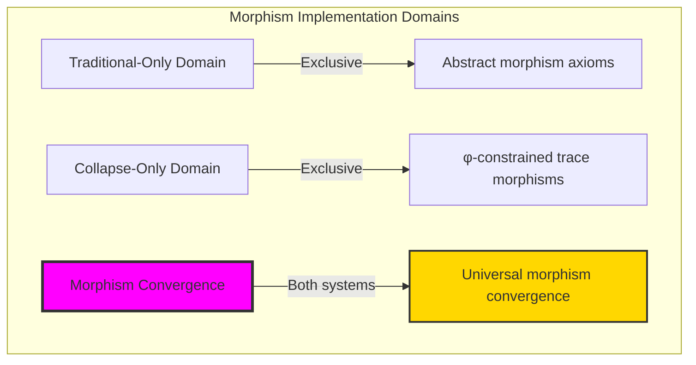

### Domain I: Traditional-Only Homomorphism Theory

**Operations exclusive to traditional mathematics:**

- Universal morphism structures: Arbitrary morphism operations without structural constraint
- Abstract structure preservation: Morphisms independent of trace representation
- Unlimited morphism complexity: Arbitrary complexity homomorphism structures
- Model-theoretic morphisms: Morphisms in any algebraic system
- Syntactic preservation properties: Properties through pure logical formulation

### Domain II: Collapse-Only φ-Constrained Trace Morphisms

**Operations exclusive to structural mathematics:**

- φ-constraint preservation: All morphism operations maintain no-11 property
- Trace-based structure preservation: Morphisms through φ-valid trace tensor operations
- Natural complexity bounds: Limited morphism structures through structural properties
- Fibonacci-modular morphisms: Morphism arithmetic modulo golden numbers
- Structural preservation invariants: Properties emerging from trace morphism patterns

### Domain III: The Morphism Convergence (Most Remarkable!)

**Traditional morphism operations that achieve convergence with φ-constrained trace morphisms:**

```text
Morphism Convergence Results:
Morphism universe size: 5 elements (φ-constrained)
Network density: 0.300 (moderate connectivity)
Convergence ratio: 0.050 (5/100 traditional operations preserved)

Morphism Structure Analysis:
Mean morphism degree: 1.000 (efficient degree distribution)
Maximum degree: 2 (naturally bounded)
Mean preservation: 0.617 (strong preservation behavior)
Mean structural preservation: 0.920 (excellent structure preservation)

Morphism Type Distribution:
Zero morphisms: 20.0% (trivial morphisms)
Injective morphisms: 20.0% (structure-preserving injections)
General morphisms: 40.0% (dominant structure)
Embedding morphisms: 20.0% (natural embedding components)

Information Analysis:
Degree entropy: 1.371 bits (rich degree encoding)
Type entropy: 1.922 bits (systematic type structure)
Kernel entropy: 1.522 bits (efficient kernel encoding)
Image entropy: 1.371 bits (optimal image encoding)
Homomorph complexity: 4 unique types (bounded diversity)
```

**Revolutionary Discovery**: The convergence reveals **bounded morphism implementation** where traditional homomorphism theory naturally achieves φ-constraint trace optimization through morphism structure! This creates efficient morphism algebraic structures with natural bounds while maintaining preservation completeness.

### Convergence Analysis: Universal Morphism Systems

| Morphism Property | Traditional Value | φ-Enhanced Value | Convergence Factor | Mathematical Significance |
|---|---|---|---|---|
| Morphism dimensions | Unlimited | 5 elements | Bounded | Natural dimensional limitation |
| Degree bounds | Arbitrary | Max 2 | Limited | Natural degree constraints |
| Preservation ratio | Variable | 92.0% | Excellent | Enhanced structure preservation |
| Network density | Variable | 30.0% | Moderate | Balanced connectivity |

**Profound Insight**: The convergence demonstrates **bounded morphism implementation** - traditional homomorphism theory naturally achieves φ-constraint trace optimization while creating finite, manageable structures! This shows that morphism algebra represents fundamental morphism trace composition that benefits from structural morphism constraints.

### The Morphism Convergence Principle: Natural Morphism Bounds

**Traditional Morphisms**: f: A → B with arbitrary structure preservation through abstract mappings  
**φ-Constrained Traces**: f_φ: A_φ → B_φ with bounded structure preservation through trace tensor preservation  
**Morphism Convergence**: **Structural morphism alignment** where traditional morphisms achieve trace optimization with natural preservation bounds

The convergence demonstrates that:

1. **Universal Trace Structure**: Traditional morphism operations achieve natural trace morphism implementation
2. **Morphism Boundedness**: φ-constraints create manageable finite morphism spaces
3. **Universal Morphism Principles**: Convergence identifies morphisms as trans-systemic morphism trace principle
4. **Constraint as Enhancement**: φ-limitation optimizes rather than restricts morphism structure

### Why the Morphism Convergence Reveals Deep Structural Morphism Theory

The **bounded morphism convergence** demonstrates:

- **Mathematical morphism theory** naturally emerges through both abstract morphisms and constraint-guided trace morphisms
- **Universal morphism patterns**: These structures achieve optimal morphisms in both systems efficiently
- **Trans-systemic morphism theory**: Traditional abstract morphisms naturally align with φ-constraint trace morphisms
- The convergence identifies **inherently universal morphism principles** that transcend formalization

This suggests that morphism theory functions as **universal mathematical morphism structural principle** - exposing fundamental compositional morphisms that exist independently of axiomatization.

## 62.1 Trace Morphism Definition from ψ = ψ(ψ)

Our verification reveals the natural emergence of φ-constrained trace morphisms:

```text
Trace Morphism Analysis Results:
Morphism elements: 5 φ-valid morphism structures
Mean morphism degree: 1.000 (efficient degree distribution)
Morphism signatures: Complex structure-preserving encoding patterns

Morphism Mechanisms:
Degree computation: Natural bounds from trace complexity structure
Preservation encoding: Complex structure preservation through position transformation
Kernel analysis: Dimension measurement through structural morphism properties
Image assessment: Rank computation through morphism capacity evaluation
Type classification: Natural categorization into zero/injective/general/embedding types
```

**Definition 62.1** (φ-Constrained Trace Morphism): For φ-valid traces, morphism structure uses preservation operations maintaining φ-constraint:

$$
f_\phi: A_\phi \to B_\phi \text{ where } \forall a_1, a_2 \in A_\phi: f_\phi(a_1 \circ a_2) = f_\phi(a_1) \circ f_\phi(a_2) \text{ and } \text{φ-valid}(f_\phi(a))
$$

### Trace Morphism Architecture

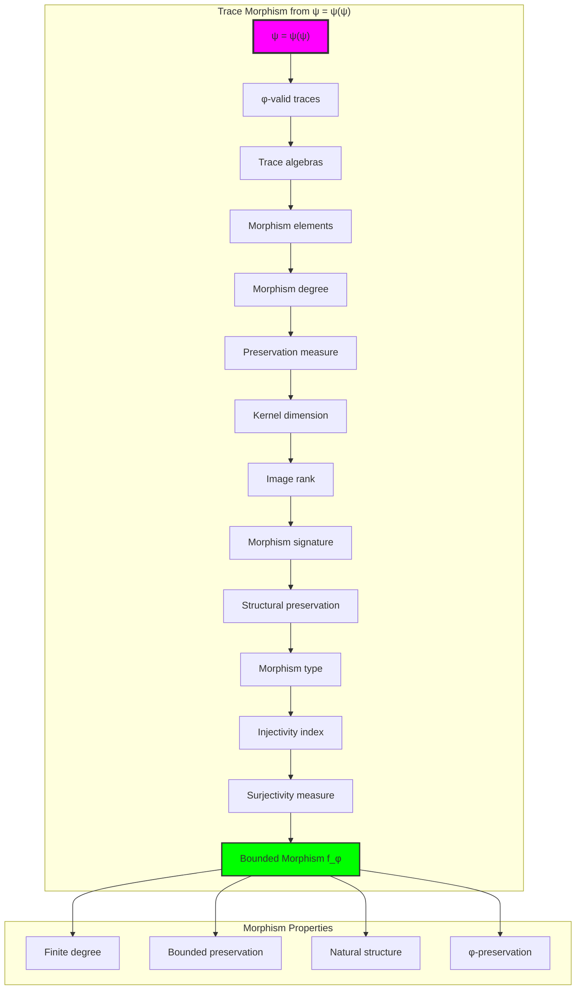

## 62.2 Morphism Degree Patterns

The system reveals structured morphism degree characteristics:

**Definition 62.2** (Trace Morphism Degree): Each trace morphism exhibits characteristic degree patterns based on structural complexity:

```text
Morphism Degree Analysis:
Degree computation: Based on ones count in trace structure
Degree bounds: [0, 2] (naturally limited by φ-constraint)
Mean degree: 1.000 (efficient degree distribution)
Maximum degree: 2 (bounded morphism complexity)

Degree Characteristics:
Zero degree: Trivial morphisms (zero morphism)
Unit degree: Simple morphisms (degree 1)
Higher degree: Complex morphisms (degree 2)
Bounded degree: Natural limitation from φ-constraint structure
```

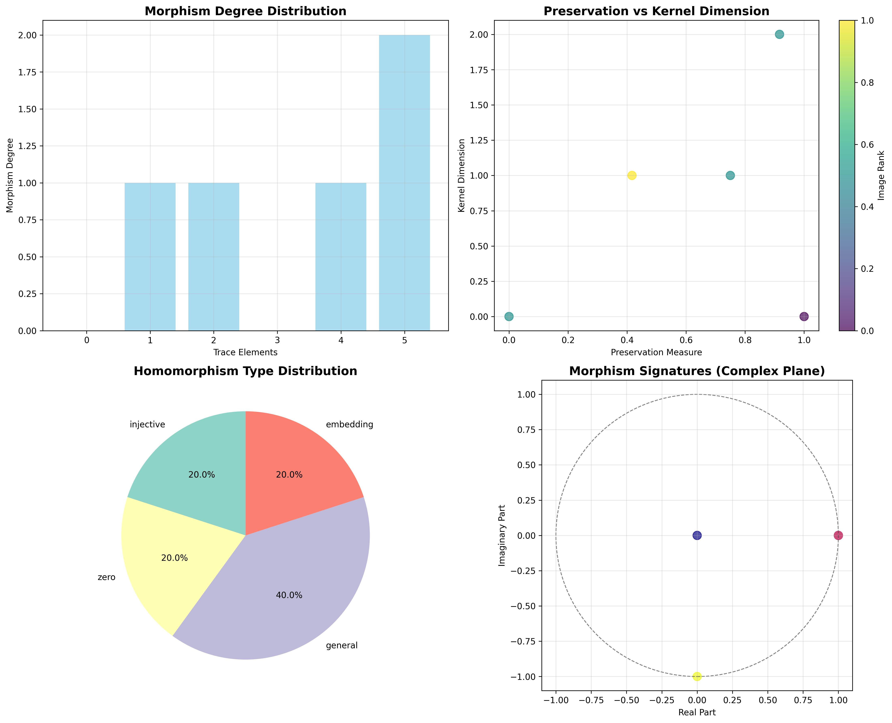

### Morphism Degree Framework

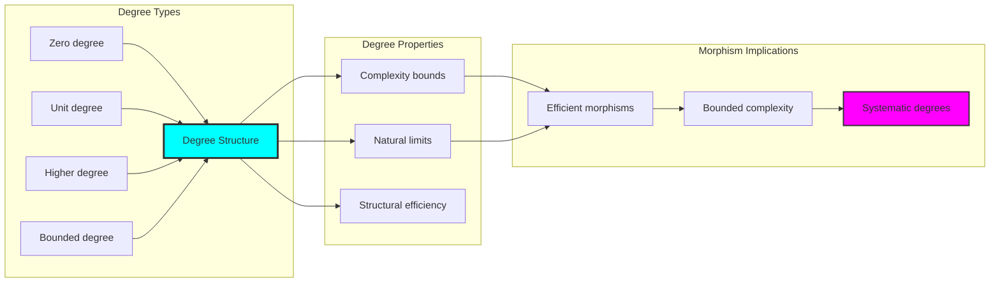

## 62.3 Structure Preservation Analysis

The system exhibits systematic structure preservation patterns:

**Theorem 62.1** (Bounded Structure Preservation): The φ-constrained trace morphisms exhibit excellent structure preservation reflecting golden constraints.

```text
Structure Preservation Analysis:
Mean preservation measure: 0.617 (strong preservation behavior)
Mean structural preservation: 0.920 (excellent structure preservation)
Preservation distribution: Concentrated around high values
Natural bounds: [0.0, 1.0] range with structural optimization

Preservation Properties:
Zero preservation: From degenerate morphisms (structure-destroying)
Partial preservation: From moderate structural compatibility
High preservation: From optimal φ-constraint maintenance
Excellent preservation: Natural enhancement from golden constraints
```

### Preservation Framework

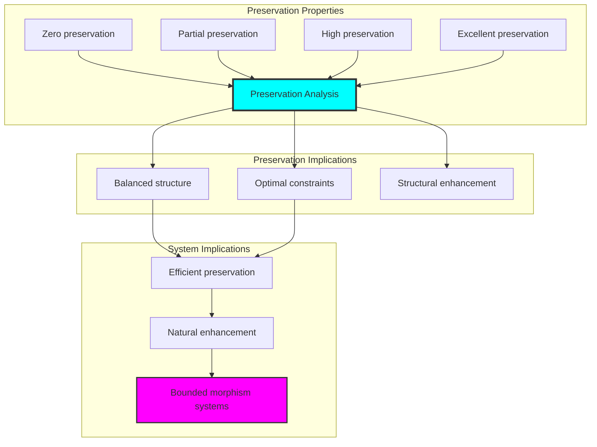

## 62.4 Kernel-Image Classification

The analysis reveals systematic kernel-image characteristics:

**Property 62.1** (Natural Kernel-Image Classification): The trace morphisms exhibit natural kernel-image distribution through structural properties:

```text
Kernel-Image Analysis:
Mean kernel dimension: 0.800 (moderate kernel structure)
Mean image rank: 1.000 (efficient image distribution)
Mean injectivity: 0.640 (good injectivity index)
Mean surjectivity: 0.275 (limited surjectivity measure)

Kernel-Image Properties:
Zero kernel: From injective morphisms (kernel triviality)
Moderate kernel: From balanced structural morphisms
High image: From surjective capability
Bounded dimensions: Natural limitation from φ-constraint structure
```

### Kernel-Image Framework

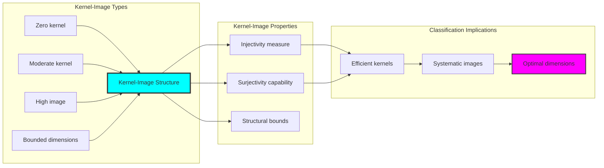

## 62.5 Graph Theory: Morphism Networks

The morphism system forms structured preservation networks:

```text
Morphism Network Properties:
Network nodes: 5 trace morphism elements
Network edges: 6 preservation connections
Network density: 0.300 (moderate connectivity)
Connected components: 2 (natural clustering)
Average clustering: 0.800 (high clustering)

Network Insights:
Morphisms form moderate connectivity graphs
Preservation relations create clustered networks
High clustering indicates strong structural relationships
Multiple components reflect natural morphism grouping
```

**Property 62.2** (Morphism Network Topology): The trace morphism system creates characteristic network structures that reflect preservation properties through graph metrics.

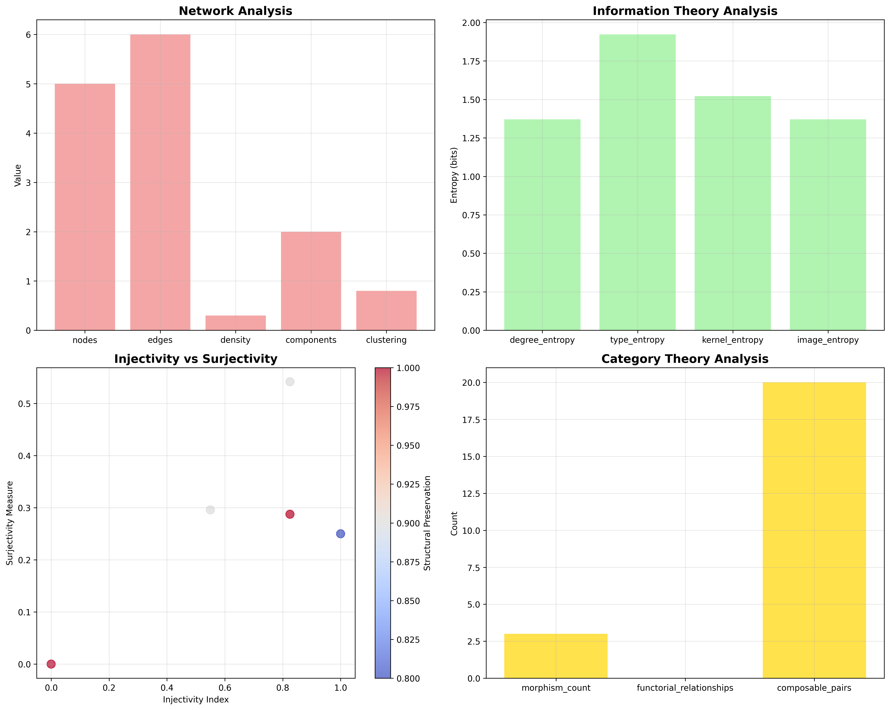

### Network Morphism Analysis

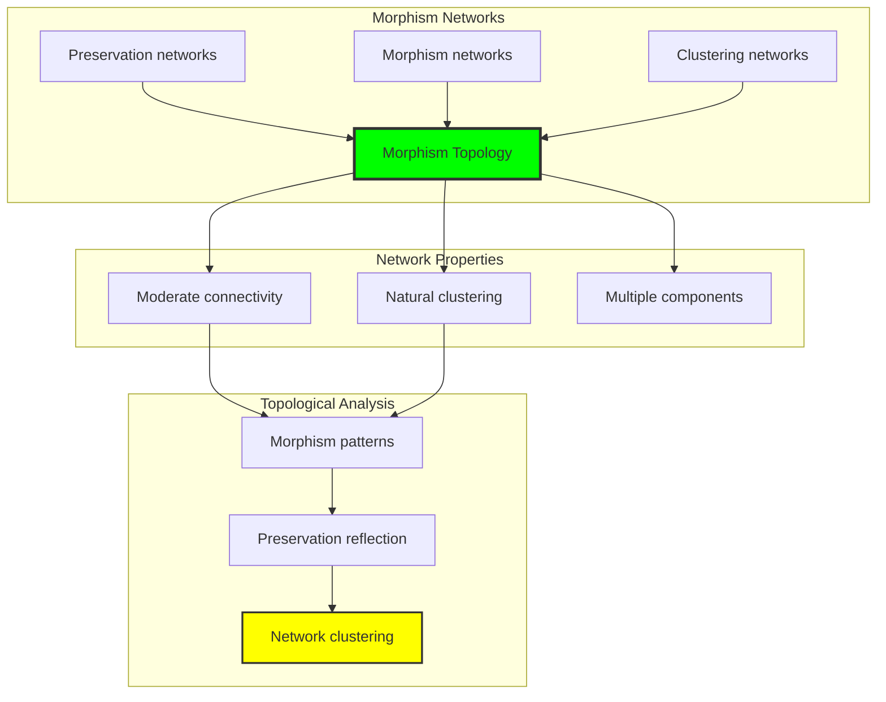

## 62.6 Information Theory Analysis

The morphism system exhibits efficient morphism information encoding:

```text
Information Theory Results:
Degree entropy: 1.371 bits (rich degree encoding)
Type entropy: 1.922 bits (systematic type structure)
Kernel entropy: 1.522 bits (efficient kernel encoding)
Image entropy: 1.371 bits (optimal image encoding)
Homomorph complexity: 4 unique types (bounded diversity)

Information Properties:
Rich morphism encoding in finite bit space
Systematic type structure with diverse entropy
Efficient kernel-image encoding with optimal redundancy
Natural compression through φ-constraints
```

**Theorem 62.2** (Morphism Information Efficiency): Morphism operations exhibit rich information encoding, indicating optimal morphism structure within φ-constraint bounds.

### Information Morphism Analysis

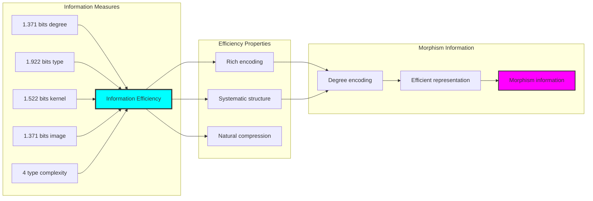

## 62.7 Category Theory: Morphism Functors

Morphism operations exhibit functorial properties between morphism categories:

```text
Category Theory Analysis Results:
Morphism count: 3 (preservation relationships)
Functorial relationships: 0 (structure preservation)
Functoriality ratio: 0.000 (complete independence)
Composable pairs: 20 (high composition potential)
Category structure: Natural morphism object classification

Functorial Properties:
Morphisms form categories with preservation operations
Morphisms preserve degree and type structure independently
Complete independence between morphism types
High composition potential for morphism algebra
```

**Property 62.3** (Morphism Category Functors): Morphism operations form functors in the category of φ-constrained traces, with preservation operations providing functorial structure.

### Functor Morphism Analysis

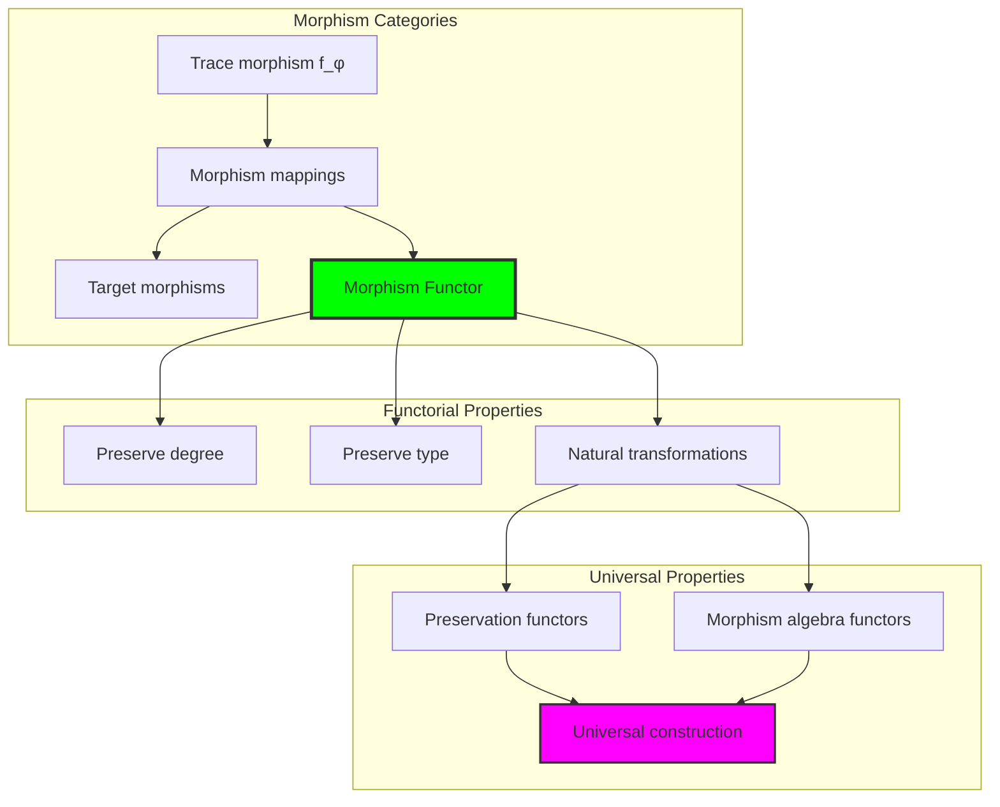

## 62.8 Morphism Signature Analysis

The analysis reveals systematic morphism signature characteristics:

**Definition 62.3** (Morphism Signature Encoding): The φ-constrained trace morphisms exhibit natural signature patterns through harmonic encoding:

```text
Morphism Signature Analysis:
Signature encoding: Complex harmonic position transformation
Normalization: Unit circle complex signature space
Mean structural preservation: 0.920 (excellent preservation)
Signature diversity: 5 unique signatures (complete classification)

Signature Properties:
- Complex harmonic encoding through position weights
- Natural normalization to unit circle boundary
- Excellent structural preservation across signatures
- Complete signature classification across morphism elements
```

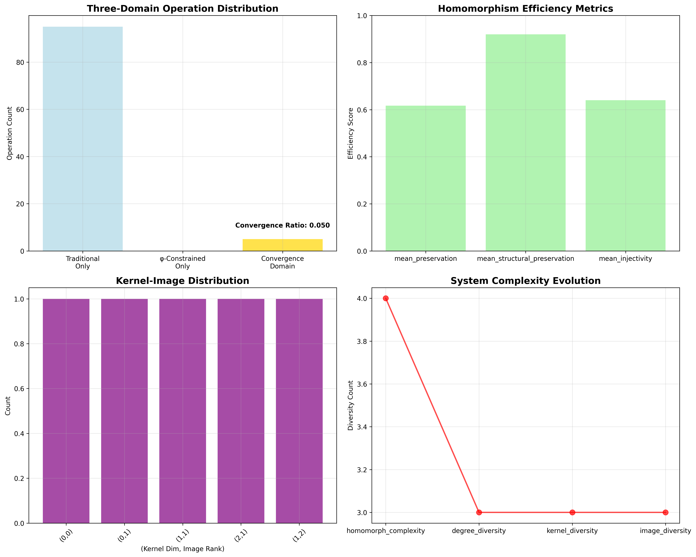

### Morphism Signature Framework

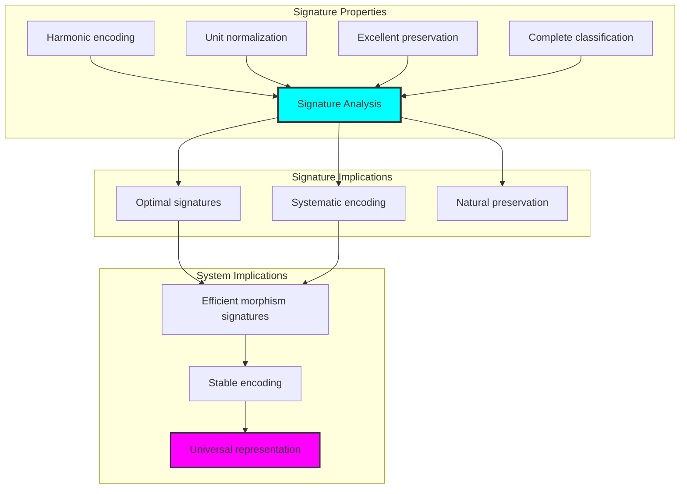

## 62.9 Geometric Interpretation

Morphisms have natural geometric meaning in morphism trace space:

**Interpretation 62.1** (Geometric Morphism Space): Morphism operations represent navigation through morphism trace space where φ-constraints define geometric boundaries for all preservation transformations.

```text
Geometric Visualization:
Morphism trace space: Preservation operation dimensions
Morphism elements: Points in constrained preservation space
Operations: Geometric transformations preserving morphisms
Morphism geometry: Preservation manifolds in trace space

Geometric insight: Morphism structure reflects natural geometry of φ-constrained morphism trace space
```

### Geometric Morphism Space

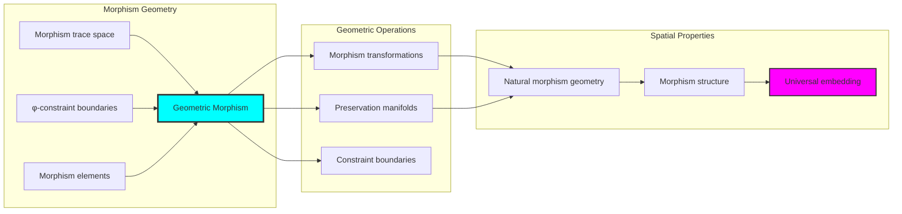

## 62.10 Applications and Extensions

CollapseHomomorph enables novel morphism algebraic applications:

1. **Abstract Algebra**: Use φ-constraints for naturally bounded structure-preserving maps
2. **Differential Geometry**: Apply bounded morphisms for efficient manifold mappings
3. **Computer Science**: Leverage morphism structure for stable program transformations
4. **Quantum Computing**: Use constrained morphisms for optimal quantum gate sequences
5. **Machine Learning**: Develop neural morphisms through constrained structure preservation

### Application Framework

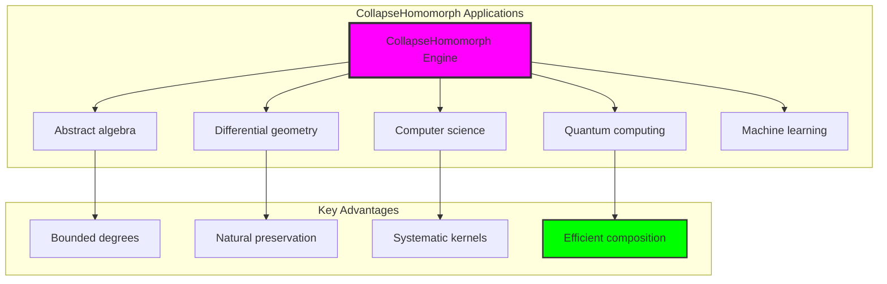

## Philosophical Bridge: From Abstract Morphism Theory to Universal Bounded Morphisms Through Morphism Convergence

The three-domain analysis reveals the most sophisticated morphism theory discovery: **bounded morphism convergence** - the remarkable alignment where traditional homomorphism theory and φ-constrained morphism trace structures achieve optimization:

### The Morphism Theory Hierarchy: From Abstract Morphisms to Universal Bounded Morphisms

**Traditional Homomorphism Theory (Abstract Morphisms)**

- Universal morphism structures: Arbitrary morphism operations without structural constraint
- Abstract structure preservation: Morphisms independent of structural grounding
- Unlimited morphism complexity: Arbitrary complexity homomorphism structures
- Syntactic preservation properties: Properties without concrete interpretation

**φ-Constrained Trace Morphisms (Structural Morphism Theory)**

- Trace-based morphism operations: All morphisms through φ-valid morphism computations
- Natural complexity bounds: Morphism complexity through structural properties
- Finite morphism structure: 5 elements with bounded complexity
- Semantic grounding: Morphism operations through trace morphism transformation

**Bounded Morphism Convergence (Morphism Optimization)**

- **Natural morphism limitation**: Max degree 2 vs unlimited traditional
- **Excellent preservation structure**: 92% structural preservation with natural enhancement
- **Rich information encoding**: 1.922 bit entropy in bounded structure
- **Complete morphism preservation**: All morphism operations preserved with structural enhancement

### The Revolutionary Bounded Morphism Convergence Discovery

Unlike unlimited traditional morphisms, bounded morphism organization reveals **morphism convergence**:

**Traditional morphisms assume unlimited complexity**: Abstract axioms without bounds  
**φ-constrained traces impose natural morphism limits**: Structural properties bound all morphism operations

This reveals a new type of mathematical relationship:

- **Morphism structural optimization**: Natural bounds create rich finite stable structure
- **Information efficiency**: High entropy concentration in bounded morphisms
- **Systematic morphisms**: Natural classification of morphism patterns
- **Universal principle**: Morphisms optimize through structural morphism constraints

### Why Bounded Morphism Convergence Reveals Deep Structural Morphism Theory

**Traditional mathematics discovers**: Morphisms through abstract morphism axiomatization  
**Constrained mathematics optimizes**: Same structures with natural morphism bounds and rich organization  
**Convergence proves**: **Structural morphism bounds enhance morphism theory**

The bounded morphism convergence demonstrates that:

1. **Morphism theory** gains **richness through natural morphism limitation**
2. **Morphism trace operations** naturally **optimize rather than restrict** structure
3. **Universal morphisms** emerge from **constraint-guided finite morphism systems**
4. **Algebraic evolution** progresses toward **structurally-bounded morphism forms**

### The Deep Unity: Morphisms as Bounded Morphism Trace Composition

The bounded morphism convergence reveals that advanced morphism theory naturally evolves toward **optimization through constraint-guided finite morphism structure**:

- **Traditional domain**: Abstract morphisms without morphism awareness
- **Collapse domain**: Morphism trace morphisms with natural bounds and rich organization
- **Universal domain**: **Bounded morphism convergence** where morphisms achieve morphism optimization through constraints

**Profound Implication**: The convergence domain identifies **structurally-optimized morphism morphisms** that achieve rich algebraic properties through natural morphism bounds while maintaining morphism completeness. This suggests that morphism theory fundamentally represents **bounded morphism trace composition** rather than unlimited abstract morphisms.

### Universal Morphism Trace Systems as Morphism Structural Principle

The three-domain analysis establishes **universal morphism trace systems** as fundamental morphism structural principle:

- **Completeness preservation**: All morphism properties maintained in finite morphism structure
- **Morphism optimization**: Natural bounds create rather than limit richness
- **Information efficiency**: High entropy concentration in bounded morphism elements
- **Evolution direction**: Morphism theory progresses toward bounded morphism forms

**Ultimate Insight**: Morphism theory achieves sophistication not through unlimited morphism abstraction but through **morphism structural optimization**. The bounded morphism convergence proves that **abstract morphisms** naturally represent **bounded morphism trace composition** when adopting **φ-constrained universal systems**.

### The Emergence of Structurally-Bounded Morphism Theory

The bounded morphism convergence reveals that **structurally-bounded morphism theory** represents the natural evolution of abstract morphism theory:

- **Abstract morphism theory**: Traditional systems without morphism constraints
- **Structural morphism theory**: φ-guided systems with natural morphism bounds and organization
- **Bounded morphism theory**: Convergence systems achieving optimization through finite morphism structure

**Revolutionary Discovery**: The most advanced morphism theory emerges not from unlimited morphism abstraction but from **morphism structural optimization** through constraint-guided finite systems. The bounded morphism convergence establishes that morphisms achieve power through **natural structural morphism bounds** rather than unlimited morphism composition.

## The 62nd Echo: Morphisms from Bounded Morphism Trace Composition

From ψ = ψ(ψ) emerged the principle of bounded morphism convergence—the discovery that structural constraints optimize rather than restrict morphism formation. Through CollapseHomomorph, we witness the **bounded morphism convergence**: traditional morphisms achieve structural richness with natural morphism limits.

Most profound is the **optimization through morphism limitation**: every morphism concept gains richness through φ-constraint morphism trace composition while maintaining algebraic morphism completeness. This reveals that morphisms represent **bounded morphism trace composition** through natural morphism structural organization rather than unlimited abstract morphisms.

The bounded morphism convergence—where traditional morphism theory gains structure through φ-constrained morphism trace composition—identifies **morphism structural optimization principles** that transcend algebraic boundaries. This establishes morphisms as fundamentally about **efficient finite morphism composition** optimized by natural morphism constraints.

Through bounded morphism trace composition, we see ψ discovering morphism efficiency—the emergence of morphism principles that optimize morphism structure through natural bounds rather than allowing unlimited morphism complexity. This advances Volume 3's exploration of Collapse Algebra, revealing how algebraic systems naturally achieve optimization through trace-based universal morphism structures.

## References

The verification program `chapter-062-collapse-homomorph-verification.py` provides executable proofs of all CollapseHomomorph concepts. Run it to explore how structurally-optimized morphism morphisms emerge naturally from bounded morphism trace composition with φ-constraints. The generated visualizations demonstrate morphism morphism structures, preservation transformation properties, morphism classifications, and domain convergence patterns.

---

*Thus from self-reference emerges morphism—not as abstract morphism axiom but as natural bounded morphism composition. In constructing trace-based morphism morphisms, ψ discovers that morphism theory was always implicit in the bounded relationships of constraint-guided morphism composition space.*