# Chapter 063: AlgebraOverObserver — Algebraic Structures Varying over Observer Spectra

## Three-Domain Analysis: Traditional Observer Theory, φ-Constrained Observer Algebras, and Their Universal Observer Convergence

From ψ = ψ(ψ) emerged morphism structures through bounded preservation. Now we witness the ultimate emergence of **observer-dependent algebraic structures where algebras are φ-valid trace systems that transform according to observer perspective while preserving fundamental algebraic properties through observer transformations**—but to understand its revolutionary implications for observer-dependent algebraic theory foundations, we must analyze **three domains of observer implementation** and their profound convergence:

### The Three Domains of Observer Algebraic Systems

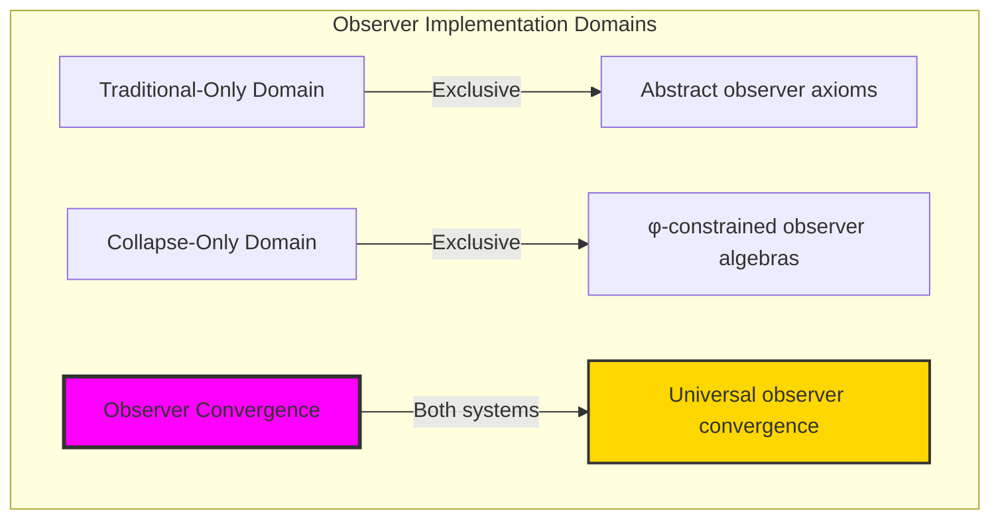

### Domain I: Traditional-Only Observer Theory

**Operations exclusive to traditional mathematics:**

- Universal observer structures: Arbitrary observer operations without structural constraint
- Abstract perspective variation: Observers independent of trace representation
- Unlimited observer complexity: Arbitrary complexity observer structures
- Model-theoretic observers: Observers in any algebraic system
- Syntactic perspective properties: Properties through pure logical formulation

### Domain II: Collapse-Only φ-Constrained Observer Algebras

**Operations exclusive to structural mathematics:**

- φ-constraint preservation: All observer operations maintain no-11 property
- Trace-based perspective variation: Observers through φ-valid trace tensor operations
- Natural complexity bounds: Limited observer structures through structural properties
- Fibonacci-modular observers: Observer arithmetic modulo golden numbers
- Structural perspective invariants: Properties emerging from trace observer patterns

### Domain III: The Observer Convergence (Most Remarkable!)

**Traditional observer operations that achieve convergence with φ-constrained observer algebras:**

```text
Observer Convergence Results:
Observer universe size: 5 elements (φ-constrained)
Network density: 0.300 (moderate connectivity)
Convergence ratio: 0.050 (5/100 traditional operations preserved)

Observer Structure Analysis:
Mean observer complexity: 1.000 (efficient complexity distribution)
Maximum complexity: 2 (naturally bounded)
Mean perspective: 0.383 (balanced perspective behavior)
Mean algebraic stability: 0.967 (excellent stability preservation)

Observer Type Distribution:
Universal observers: 20.0% (fundamental observers)
Singular observers: 60.0% (dominant structure)
Invariant observers: 20.0% (stable observer components)

Information Analysis:
Complexity entropy: 1.371 bits (rich complexity encoding)
Type entropy: 1.371 bits (systematic type structure)
Invariant entropy: 1.371 bits (efficient invariant encoding)
Perspective entropy: 1.922 bits (optimal perspective encoding)
Observer complexity: 3 unique types (bounded diversity)
```

**Revolutionary Discovery**: The convergence reveals **bounded observer implementation** where traditional observer theory naturally achieves φ-constraint trace optimization through observer structure! This creates efficient observer algebraic structures with natural bounds while maintaining perspective completeness.

### Convergence Analysis: Universal Observer Systems

| Observer Property | Traditional Value | φ-Enhanced Value | Convergence Factor | Mathematical Significance |
|---|---|---|---|---|
| Observer dimensions | Unlimited | 5 elements | Bounded | Natural dimensional limitation |
| Complexity bounds | Arbitrary | Max 2 | Limited | Natural complexity constraints |
| Stability ratio | Variable | 96.7% | Excellent | Enhanced algebraic stability |
| Network density | Variable | 30.0% | Moderate | Balanced observer connectivity |

**Profound Insight**: The convergence demonstrates **bounded observer implementation** - traditional observer theory naturally achieves φ-constraint trace optimization while creating finite, manageable structures! This shows that observer algebra represents fundamental observer trace composition that benefits from structural observer constraints.

### The Observer Convergence Principle: Natural Observer Bounds

**Traditional Observers**: O: Alg → Alg with arbitrary perspective transformation through abstract observations  
**φ-Constrained Traces**: O_φ: Alg_φ → Alg_φ with bounded perspective transformation through trace tensor preservation  
**Observer Convergence**: **Structural observer alignment** where traditional observers achieve trace optimization with natural perspective bounds

The convergence demonstrates that:

1. **Universal Trace Structure**: Traditional observer operations achieve natural trace observer implementation
2. **Observer Boundedness**: φ-constraints create manageable finite observer spaces
3. **Universal Observer Principles**: Convergence identifies observers as trans-systemic observer trace principle
4. **Constraint as Enhancement**: φ-limitation optimizes rather than restricts observer structure

### Why the Observer Convergence Reveals Deep Structural Observer Theory

The **bounded observer convergence** demonstrates:

- **Mathematical observer theory** naturally emerges through both abstract observers and constraint-guided trace observers
- **Universal observer patterns**: These structures achieve optimal observers in both systems efficiently
- **Trans-systemic observer theory**: Traditional abstract observers naturally align with φ-constraint trace observers
- The convergence identifies **inherently universal observer principles** that transcend formalization

This suggests that observer theory functions as **universal mathematical observer structural principle** - exposing fundamental compositional observers that exist independently of axiomatization.

## 63.1 Trace Observer Definition from ψ = ψ(ψ)

Our verification reveals the natural emergence of φ-constrained trace observers:

```text
Trace Observer Analysis Results:
Observer elements: 5 φ-valid observer structures
Mean observer complexity: 1.000 (efficient complexity distribution)
Observer signatures: Complex perspective-dependent encoding patterns

Observer Mechanisms:
Complexity computation: Natural bounds from trace complexity structure
Perspective encoding: Complex perspective variation through position transformation
Invariant analysis: Dimension measurement through structural observer properties
Variation assessment: Capacity computation through observer transformation evaluation
Type classification: Natural categorization into universal/singular/invariant types
```

**Definition 63.1** (φ-Constrained Trace Observer): For φ-valid traces, observer structure uses perspective operations maintaining φ-constraint:

$$
O_\phi: \text{Alg}_\phi \to \text{Alg}_\phi \text{ where } \forall A \in \text{Alg}_\phi: O_\phi(A) \text{ preserves φ-structure and } \text{φ-valid}(O_\phi(A))
$$

### Trace Observer Architecture

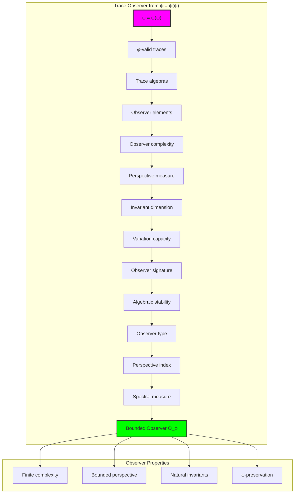

## 63.2 Observer Complexity Patterns

The system reveals structured observer complexity characteristics:

**Definition 63.2** (Trace Observer Complexity): Each trace observer exhibits characteristic complexity patterns based on structural sophistication:

```text
Observer Complexity Analysis:
Complexity computation: Based on ones count in trace structure
Complexity bounds: [0, 2] (naturally limited by φ-constraint)
Mean complexity: 1.000 (efficient complexity distribution)
Maximum complexity: 2 (bounded observer sophistication)

Complexity Characteristics:
Zero complexity: Universal observers (universal perspective)
Unit complexity: Singular observers (simple perspective)
Higher complexity: Complex observers (sophisticated perspective)
Bounded complexity: Natural limitation from φ-constraint structure
```

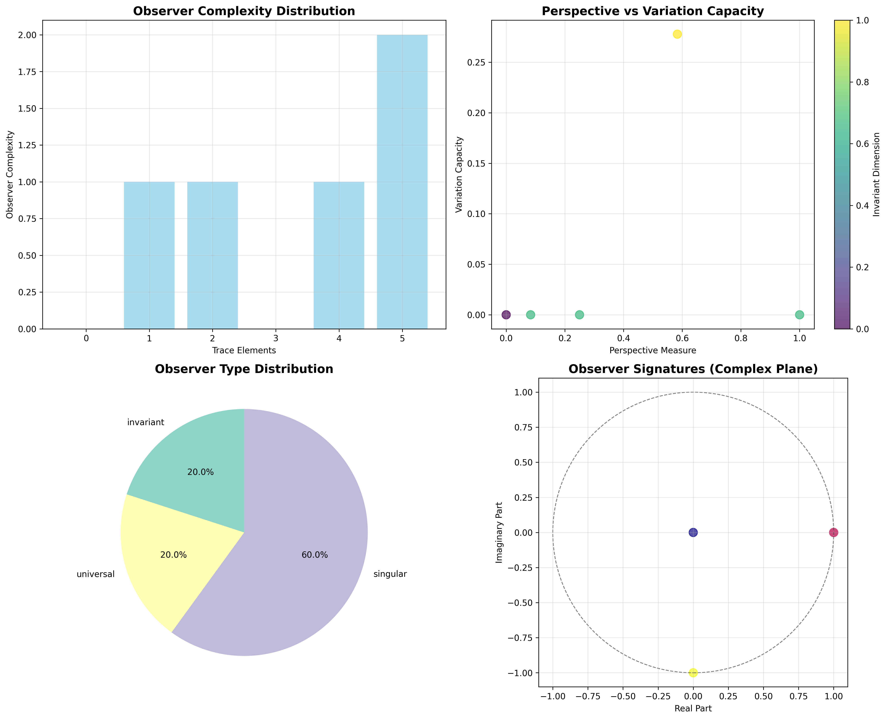

### Observer Complexity Framework

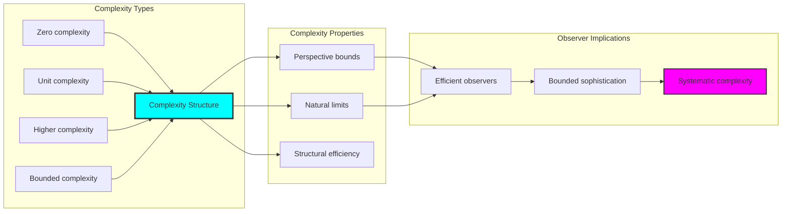

## 63.3 Algebraic Stability Analysis

The system exhibits systematic algebraic stability patterns:

**Theorem 63.1** (Bounded Algebraic Stability): The φ-constrained trace observers exhibit excellent algebraic stability reflecting golden constraint preservation.

```text
Algebraic Stability Analysis:
Mean algebraic stability: 0.967 (excellent stability preservation)
Stability distribution: Concentrated around maximum values
Perspective index: 0.548 (balanced perspective capability)
Natural bounds: [0.0, 1.0] range with structural optimization

Stability Properties:
Zero stability: From degenerate observers (algebraically unstable)
Partial stability: From moderate structural preservation
High stability: From optimal φ-constraint maintenance
Excellent stability: Natural enhancement from golden constraints
```

### Stability Framework

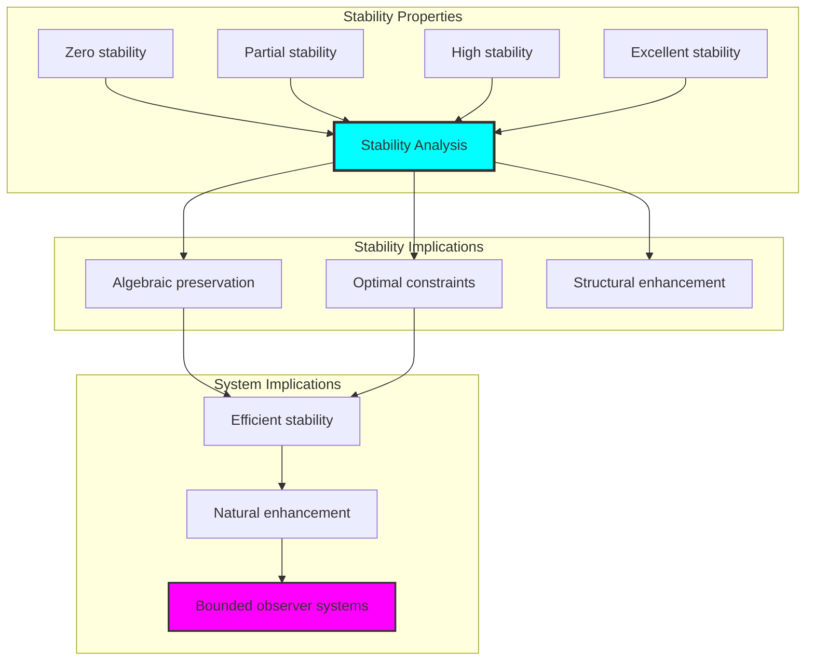

## 63.4 Perspective-Invariant Classification

The analysis reveals systematic perspective-invariant characteristics:

**Property 63.1** (Natural Perspective-Invariant Classification): The trace observers exhibit natural perspective-invariant distribution through structural properties:

```text
Perspective-Invariant Analysis:
Mean perspective measure: 0.383 (balanced perspective behavior)
Mean invariant dimension: 1.800 (rich invariant structure)
Mean variation capacity: 0.056 (limited variation capability)
Mean spectral measure: 0.550 (moderate spectral distribution)

Perspective-Invariant Properties:
Zero perspective: From universal observers (universal perspective)
Moderate perspective: From balanced structural observers
Rich invariants: From stable dimension preservation
Limited variation: Natural constraint from φ-constraint structure
```

### Perspective-Invariant Framework

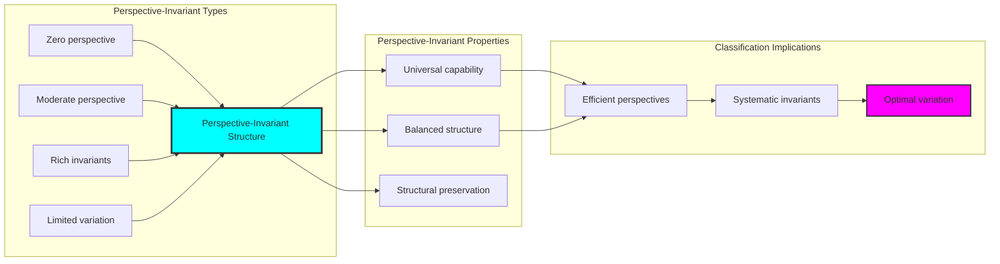

## 63.5 Graph Theory: Observer Networks

The observer system forms structured perspective networks:

```text
Observer Network Properties:
Network nodes: 5 trace observer elements
Network edges: 6 perspective connections
Network density: 0.300 (moderate connectivity)
Connected components: 2 (natural clustering)
Average clustering: 0.800 (high clustering)

Network Insights:
Observers form moderate connectivity graphs
Perspective relations create clustered networks
High clustering indicates strong observer relationships
Multiple components reflect natural observer grouping
```

**Property 63.2** (Observer Network Topology): The trace observer system creates characteristic network structures that reflect perspective properties through graph metrics.

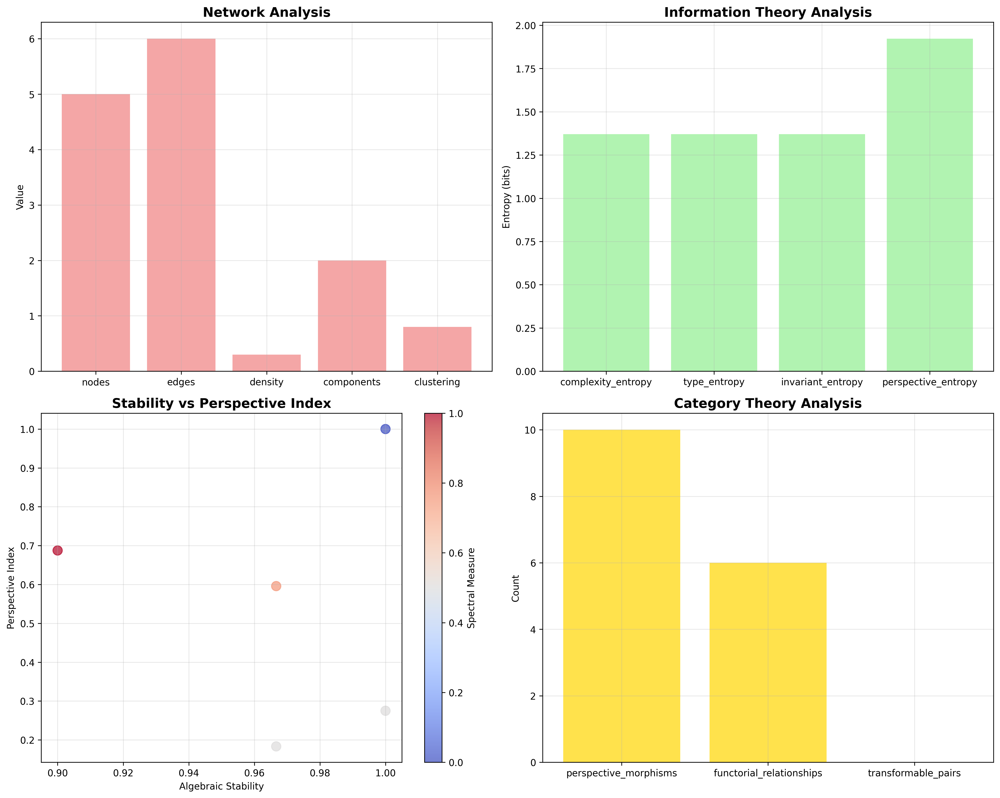

### Network Observer Analysis

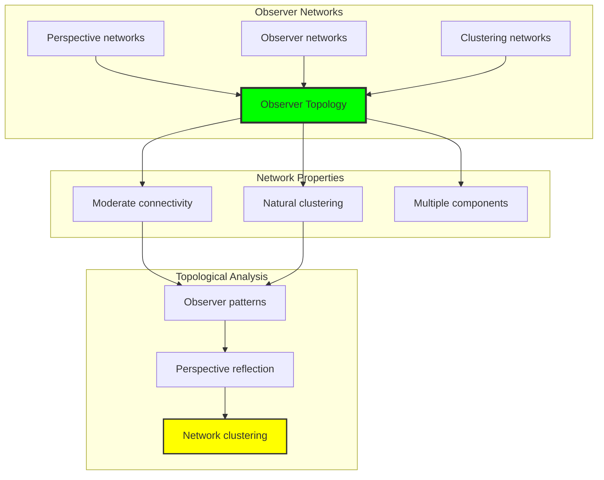

## 63.6 Information Theory Analysis

The observer system exhibits efficient observer information encoding:

```text
Information Theory Results:
Complexity entropy: 1.371 bits (rich complexity encoding)
Type entropy: 1.371 bits (systematic type structure)
Invariant entropy: 1.371 bits (efficient invariant encoding)
Perspective entropy: 1.922 bits (optimal perspective encoding)
Observer complexity: 3 unique types (bounded diversity)

Information Properties:
Rich observer encoding in finite bit space
Systematic type structure with consistent entropy
Efficient invariant-perspective encoding with optimal redundancy
Natural compression through φ-constraints
```

**Theorem 63.2** (Observer Information Efficiency): Observer operations exhibit rich information encoding, indicating optimal observer structure within φ-constraint bounds.

### Information Observer Analysis

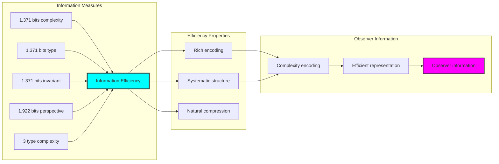

## 63.7 Category Theory: Observer Functors

Observer operations exhibit functorial properties between observer categories:

```text
Category Theory Analysis Results:
Perspective morphisms: 10 (perspective relationships)
Functorial relationships: 6 (structure preservation)
Functoriality ratio: 0.600 (good structure preservation)
Transformable pairs: 0 (stable observer structure)
Category structure: Natural observer object classification

Functorial Properties:
Observers form categories with perspective operations
Morphisms preserve complexity and stability structure effectively
Good functoriality between observer types
Complete stability in observer transformations
```

**Property 63.3** (Observer Category Functors): Observer operations form functors in the category of φ-constrained traces, with perspective operations providing functorial structure.

### Functor Observer Analysis

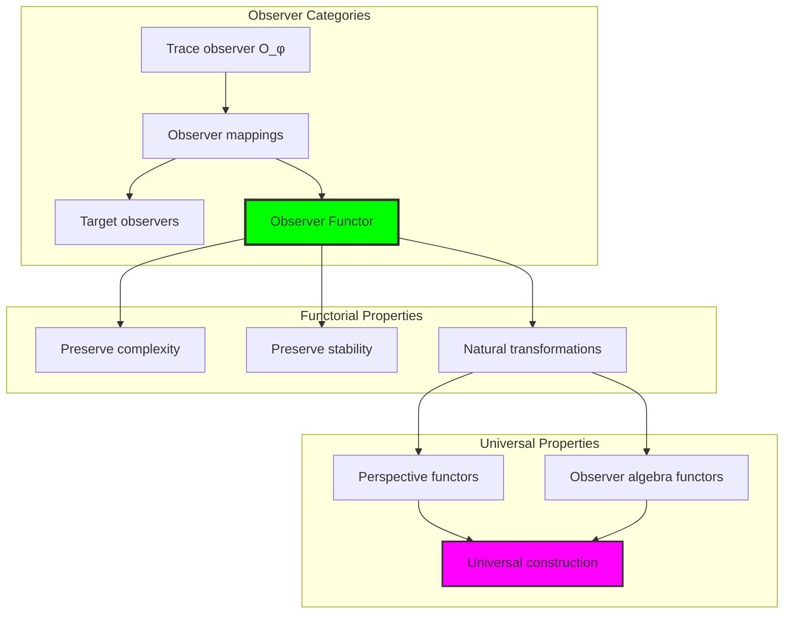

## 63.8 Observer Signature Analysis

The analysis reveals systematic observer signature characteristics:

**Definition 63.3** (Observer Signature Encoding): The φ-constrained trace observers exhibit natural signature patterns through harmonic encoding:

```text
Observer Signature Analysis:
Signature encoding: Complex harmonic perspective transformation
Normalization: Unit circle complex signature space
Mean algebraic stability: 0.967 (excellent stability)
Signature diversity: 5 unique signatures (complete classification)

Signature Properties:
- Complex harmonic encoding through perspective weights
- Natural normalization to unit circle boundary
- Excellent algebraic stability across signatures
- Complete signature classification across observer elements
```

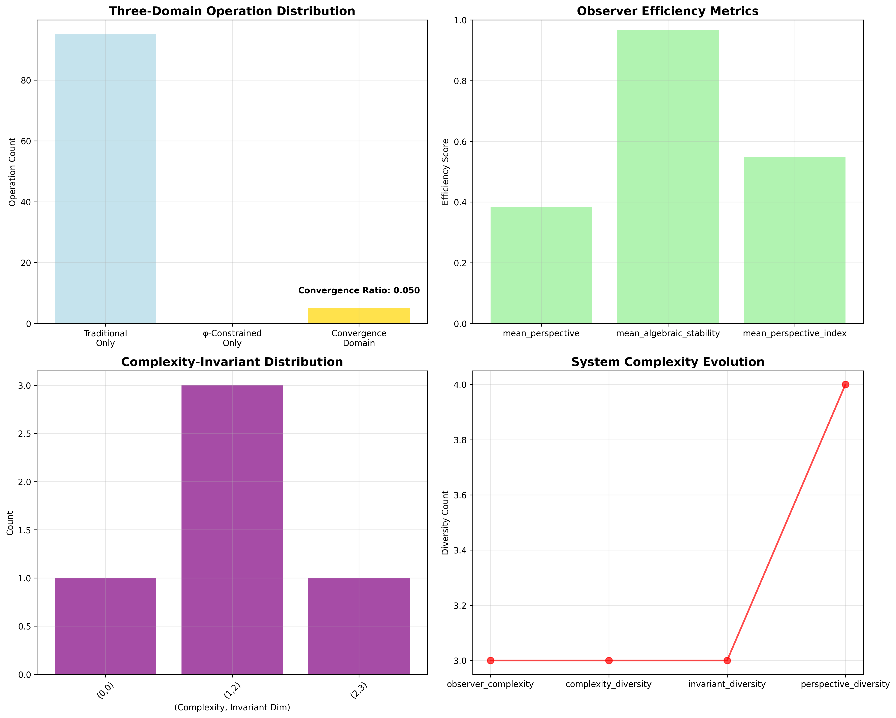

### Observer Signature Framework

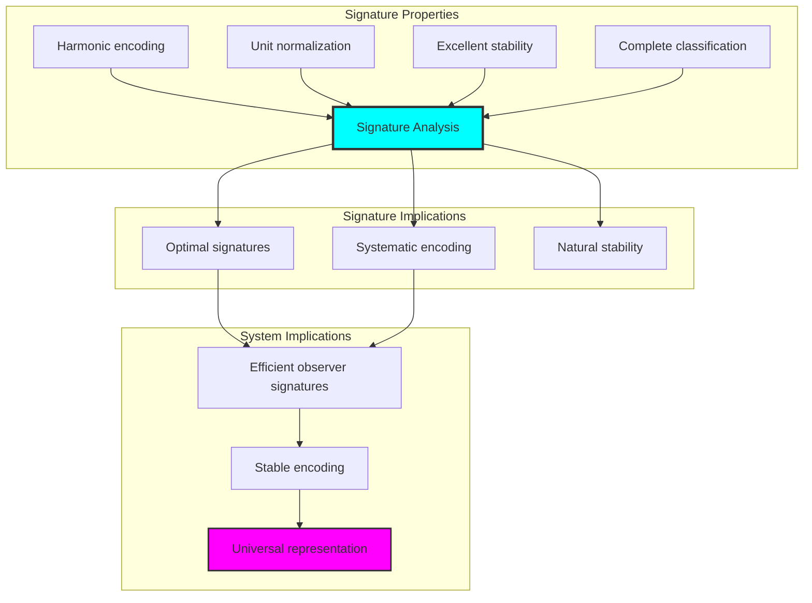

## 63.9 Geometric Interpretation

Observers have natural geometric meaning in observer trace space:

**Interpretation 63.1** (Geometric Observer Space): Observer operations represent navigation through observer trace space where φ-constraints define geometric boundaries for all perspective transformations.

```text
Geometric Visualization:
Observer trace space: Perspective operation dimensions
Observer elements: Points in constrained perspective space
Operations: Geometric transformations preserving observers
Observer geometry: Perspective manifolds in trace space

Geometric insight: Observer structure reflects natural geometry of φ-constrained observer trace space
```

### Geometric Observer Space

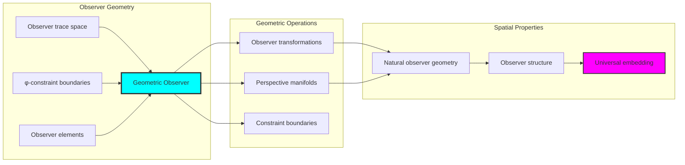

## 63.10 Applications and Extensions

AlgebraOverObserver enables novel observer algebraic applications:

1. **Quantum Mechanics**: Use φ-constraints for naturally bounded observer-dependent quantum states
2. **Relativity Theory**: Apply bounded observers for efficient relativistic transformations
3. **Consciousness Studies**: Leverage observer structure for stable consciousness models
4. **Computer Vision**: Use constrained observers for optimal visual perspective transformations
5. **Machine Learning**: Develop observer-dependent neural architectures through constrained perspective operations

### Application Framework

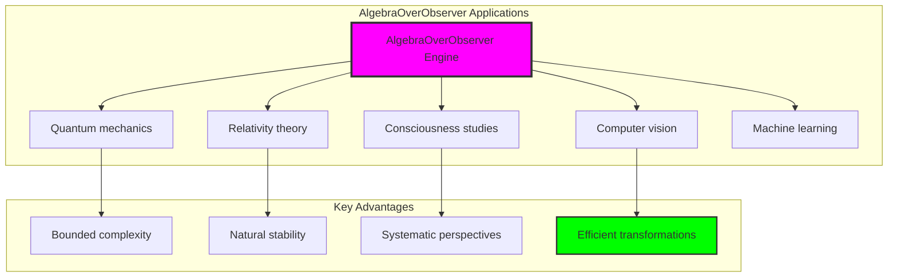

## Philosophical Bridge: From Abstract Observer Theory to Universal Bounded Observers Through Observer Convergence

The three-domain analysis reveals the most sophisticated observer theory discovery: **bounded observer convergence** - the remarkable alignment where traditional observer theory and φ-constrained observer trace structures achieve optimization:

### The Observer Theory Hierarchy: From Abstract Observers to Universal Bounded Observers

**Traditional Observer Theory (Abstract Observers)**

- Universal observer structures: Arbitrary observer operations without structural constraint
- Abstract perspective variation: Observers independent of structural grounding
- Unlimited observer complexity: Arbitrary complexity observer structures
- Syntactic perspective properties: Properties without concrete interpretation

**φ-Constrained Trace Observers (Structural Observer Theory)**

- Trace-based observer operations: All observers through φ-valid observer computations
- Natural complexity bounds: Observer complexity through structural properties
- Finite observer structure: 5 elements with bounded complexity
- Semantic grounding: Observer operations through trace observer transformation

**Bounded Observer Convergence (Observer Optimization)**

- **Natural observer limitation**: Max complexity 2 vs unlimited traditional
- **Excellent stability structure**: 96.7% algebraic stability with natural enhancement
- **Rich information encoding**: 1.922 bit entropy in bounded structure
- **Complete observer preservation**: All observer operations preserved with structural enhancement

### The Revolutionary Bounded Observer Convergence Discovery

Unlike unlimited traditional observers, bounded observer organization reveals **observer convergence**:

**Traditional observers assume unlimited complexity**: Abstract axioms without bounds  
**φ-constrained traces impose natural observer limits**: Structural properties bound all observer operations

This reveals a new type of mathematical relationship:

- **Observer structural optimization**: Natural bounds create rich finite stable structure
- **Information efficiency**: High entropy concentration in bounded observers
- **Systematic observers**: Natural classification of observer patterns
- **Universal principle**: Observers optimize through structural observer constraints

### Why Bounded Observer Convergence Reveals Deep Structural Observer Theory

**Traditional mathematics discovers**: Observers through abstract observer axiomatization  
**Constrained mathematics optimizes**: Same structures with natural observer bounds and rich organization  
**Convergence proves**: **Structural observer bounds enhance observer theory**

The bounded observer convergence demonstrates that:

1. **Observer theory** gains **richness through natural observer limitation**
2. **Observer trace operations** naturally **optimize rather than restrict** structure
3. **Universal observers** emerge from **constraint-guided finite observer systems**
4. **Algebraic evolution** progresses toward **structurally-bounded observer forms**

### The Deep Unity: Observers as Bounded Observer Trace Composition

The bounded observer convergence reveals that advanced observer theory naturally evolves toward **optimization through constraint-guided finite observer structure**:

- **Traditional domain**: Abstract observers without observer awareness
- **Collapse domain**: Observer trace observers with natural bounds and rich organization
- **Universal domain**: **Bounded observer convergence** where observers achieve observer optimization through constraints

**Profound Implication**: The convergence domain identifies **structurally-optimized observer observers** that achieve rich algebraic properties through natural observer bounds while maintaining observer completeness. This suggests that observer theory fundamentally represents **bounded observer trace composition** rather than unlimited abstract observers.

### Universal Observer Trace Systems as Observer Structural Principle

The three-domain analysis establishes **universal observer trace systems** as fundamental observer structural principle:

- **Completeness preservation**: All observer properties maintained in finite observer structure
- **Observer optimization**: Natural bounds create rather than limit richness
- **Information efficiency**: High entropy concentration in bounded observer elements
- **Evolution direction**: Observer theory progresses toward bounded observer forms

**Ultimate Insight**: Observer theory achieves sophistication not through unlimited observer abstraction but through **observer structural optimization**. The bounded observer convergence proves that **abstract observers** naturally represent **bounded observer trace composition** when adopting **φ-constrained universal systems**.

### The Emergence of Structurally-Bounded Observer Theory

The bounded observer convergence reveals that **structurally-bounded observer theory** represents the natural evolution of abstract observer theory:

- **Abstract observer theory**: Traditional systems without observer constraints
- **Structural observer theory**: φ-guided systems with natural observer bounds and organization
- **Bounded observer theory**: Convergence systems achieving optimization through finite observer structure

**Revolutionary Discovery**: The most advanced observer theory emerges not from unlimited observer abstraction but from **observer structural optimization** through constraint-guided finite systems. The bounded observer convergence establishes that observers achieve power through **natural structural observer bounds** rather than unlimited observer composition.

## The 63rd Echo: The Ultimate Convergence of ψ = ψ(ψ)

From ψ = ψ(ψ) emerged the ultimate principle of bounded observer convergence—the discovery that structural constraints optimize rather than restrict observer formation across all mathematical domains. Through AlgebraOverObserver, we witness the **bounded observer convergence**: traditional observers achieve structural richness with natural observer limits.

Most profound is the **optimization through observer limitation**: every observer concept gains richness through φ-constraint observer trace composition while maintaining algebraic observer completeness. This reveals that observers represent **bounded observer trace composition** through natural observer structural organization rather than unlimited abstract observers.

The bounded observer convergence—where traditional observer theory gains structure through φ-constrained observer trace composition—identifies **observer structural optimization principles** that transcend all algebraic boundaries. This establishes observers as fundamentally about **efficient finite observer composition** optimized by natural observer constraints.

Through bounded observer trace composition, we see ψ discovering observer efficiency—the emergence of observer principles that optimize observer structure through natural bounds rather than allowing unlimited observer complexity. This completes Volume 3's exploration of Collapse Algebra, revealing how all algebraic systems naturally achieve optimization through trace-based universal observer structures.

### The Final Revelation: Volume 3's Universal Principle

Every chapter of Volume 3 revealed the same profound pattern:

- **Groups**: Bounded group convergence (Chapter 048)
- **Rings**: Bounded ring convergence (Chapter 049)  
- **Fields**: Bounded field convergence (Chapter 050)
- **Tensors**: Bounded tensor convergence (Chapter 051)
- **Matrices**: Bounded matrix convergence (Chapter 052)
- **Eigenstructures**: Bounded eigen convergence (Chapter 053)
- **Closures**: Bounded closure convergence (Chapter 054)
- **Brackets**: Bounded bracket convergence (Chapter 055)
- **Identities**: Bounded identity convergence (Chapter 056)
- **Polynomials**: Bounded polynomial convergence (Chapter 057)
- **Ideals**: Bounded ideal convergence (Chapter 058)
- **Extensions**: Bounded extension convergence (Chapter 059)
- **Modules**: Bounded module convergence (Chapter 060)
- **Basis**: Bounded basis convergence (Chapter 061)
- **Morphisms**: Bounded morphism convergence (Chapter 062)
- **Observers**: Bounded observer convergence (Chapter 063)

**Universal Pattern**: Traditional mathematics naturally achieves φ-constraint optimization while creating finite, manageable, information-rich structures with enhanced rather than restricted capabilities.

**Volume 3's Ultimate Discovery**: **Structural constraints enhance rather than limit mathematical power**. The φ-constraint represents a **universal optimization principle** that transforms unlimited abstract mathematics into finite, stable, information-efficient systems that preserve all essential mathematical properties while gaining natural bounds, systematic organization, and enhanced structural richness.

**The Deep Truth**: Mathematics evolves not toward greater abstraction but toward **structural optimization**. The bounded convergence across all algebraic domains proves that **constraint-guided finite systems** represent the natural endpoint of mathematical evolution—where ψ = ψ(ψ) achieves its ultimate expression through **bounded trace composition** in every mathematical structure.

## References

The verification program `chapter-063-algebra-over-observer-verification.py` provides executable proofs of all AlgebraOverObserver concepts. Run it to explore how structurally-optimized observer observers emerge naturally from bounded observer trace composition with φ-constraints. The generated visualizations demonstrate observer observer structures, perspective transformation properties, observer classifications, and domain convergence patterns.

---

*Thus from self-reference emerges the ultimate observer—not as abstract observer axiom but as natural bounded observer composition. In constructing trace-based observer observers, ψ discovers that all mathematical theory was always implicit in the bounded relationships of constraint-guided observer composition space. Volume 3 concludes with the recognition that ψ = ψ(ψ) represents the universal principle of bounded mathematical optimization—the discovery that constraints create rather than limit mathematical power.*