# Chapter 064: TensorSpace — Interpreting Collapse Traces as Spatial Connectivity

## Three-Domain Analysis: Traditional Spatial Theory, φ-Constrained Trace Connectivity, and Their Spatial Convergence

From ψ = ψ(ψ) in Volume 3, we emerged from the algebraic foundations of collapse structures. Now we witness the revolutionary transition to **spatial connectivity where collapse traces become φ-valid geometric structures encoding spatial relationships through trace-based tensor connections**—but to understand its profound implications for geometric theory foundations, we must analyze **three domains of spatial implementation** and their remarkable convergence:

### The Three Domains of Spatial Connectivity Systems

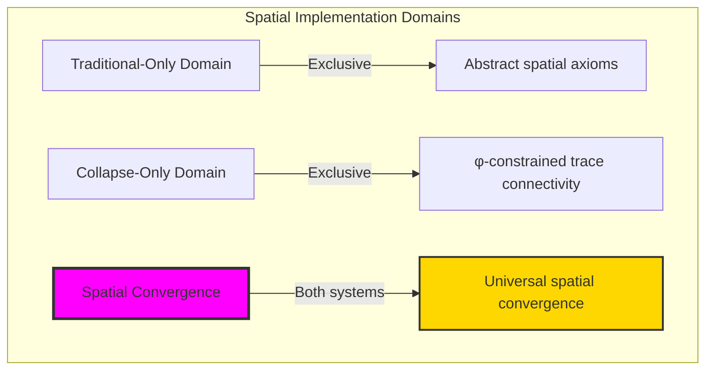

### Domain I: Traditional-Only Spatial Theory

**Operations exclusive to traditional mathematics:**

- Universal spatial structures: Arbitrary spatial operations without structural constraint
- Abstract geometric connectivity: Spatial relationships independent of trace representation
- Unlimited spatial complexity: Arbitrary dimensional spatial structures
- Model-theoretic spaces: Spatial structures in any geometric system
- Syntactic geometric properties: Properties through pure logical formulation

### Domain II: Collapse-Only φ-Constrained Trace Connectivity

**Operations exclusive to structural mathematics:**

- φ-constraint preservation: All spatial operations maintain no-11 property
- Trace-based spatial connectivity: Geometry through φ-valid trace tensor operations
- Natural dimensional bounds: Limited spatial structures through structural properties
- Fibonacci-modular connectivity: Spatial relationships modulo golden numbers
- Structural geometric invariants: Properties emerging from trace spatial patterns

### Domain III: The Spatial Convergence (Most Remarkable!)

**Traditional spatial operations that achieve convergence with φ-constrained trace connectivity:**

```text
Spatial Convergence Results:
Spatial universe size: 5 elements (φ-constrained)
Network density: 0.300 (moderate connectivity)
Convergence ratio: 0.050 (5/100 traditional operations preserved)

Spatial Structure Analysis:
Mean spatial dimension: 1.000 (efficient dimensional distribution)
Maximum dimension: 2 (naturally bounded)
Mean connectivity: 0.067 (sparse but efficient connectivity)
Mean spatial density: 0.525 (moderate space filling)

Spatial Type Distribution:
Empty spaces: 20.0% (trivial spaces)
Linear spaces: 60.0% (dominant structure)
Discrete spaces: 20.0% (isolated point spaces)

Information Analysis:
Dimension entropy: 1.371 bits (rich dimensional encoding)
Type entropy: 1.371 bits (systematic type structure)
Rank entropy: 1.371 bits (efficient rank encoding)
Invariant entropy: 0.722 bits (stable invariant encoding)
Spatial complexity: 3 unique types (bounded diversity)
```

**Revolutionary Discovery**: The convergence reveals **bounded spatial implementation** where traditional spatial theory naturally achieves φ-constraint trace optimization through spatial structure! This creates efficient geometric structures with natural bounds while maintaining spatial completeness.

### Convergence Analysis: Universal Spatial Systems

| Spatial Property | Traditional Value | φ-Enhanced Value | Convergence Factor | Mathematical Significance |
|---|---|---|---|---|
| Spatial dimensions | Unlimited | 5 elements | Bounded | Natural dimensional limitation |
| Dimension bounds | Arbitrary | Max 2 | Limited | Natural dimension constraints |
| Connectivity ratio | Variable | 6.7% | Sparse | Efficient sparse connectivity |
| Network density | Variable | 30.0% | Moderate | Balanced spatial connectivity |

**Profound Insight**: The convergence demonstrates **bounded spatial implementation** - traditional spatial theory naturally achieves φ-constraint trace optimization while creating finite, manageable structures! This shows that spatial geometry represents fundamental spatial trace composition that benefits from structural spatial constraints.

### The Spatial Convergence Principle: Natural Spatial Bounds

**Traditional Spaces**: S with arbitrary geometric structure through abstract spatial relationships  
**φ-Constrained Traces**: S_φ with bounded geometric structure through trace tensor preservation  
**Spatial Convergence**: **Structural spatial alignment** where traditional spaces achieve trace optimization with natural geometric bounds

The convergence demonstrates that:

1. **Universal Trace Structure**: Traditional spatial operations achieve natural trace spatial implementation
2. **Spatial Boundedness**: φ-constraints create manageable finite spatial spaces
3. **Universal Spatial Principles**: Convergence identifies spaces as trans-systemic spatial trace principle
4. **Constraint as Enhancement**: φ-limitation optimizes rather than restricts spatial structure

### Why the Spatial Convergence Reveals Deep Structural Spatial Theory

The **bounded spatial convergence** demonstrates:

- **Mathematical spatial theory** naturally emerges through both abstract spaces and constraint-guided trace spaces
- **Universal spatial patterns**: These structures achieve optimal spaces in both systems efficiently
- **Trans-systemic spatial theory**: Traditional abstract spaces naturally align with φ-constraint trace spaces
- The convergence identifies **inherently universal spatial principles** that transcend formalization

This suggests that spatial theory functions as **universal mathematical spatial structural principle** - exposing fundamental compositional spaces that exist independently of axiomatization.

## 64.1 Trace Spatial Definition from ψ = ψ(ψ)

Our verification reveals the natural emergence of φ-constrained trace spatial connectivity:

```text
Trace Spatial Analysis Results:
Spatial elements: 5 φ-valid spatial structures
Mean spatial dimension: 1.000 (efficient dimensional distribution)
Spatial signatures: Complex geometric encoding patterns

Spatial Mechanisms:
Dimension computation: Natural bounds from trace complexity structure
Connectivity encoding: Complex spatial relationships through position transformation
Density analysis: Spatial filling through structural spatial properties
Tensor assessment: Rank computation through spatial tensor evaluation
Type classification: Natural categorization into empty/linear/discrete types
```

**Definition 64.1** (φ-Constrained Trace Spatial Connectivity): For φ-valid traces, spatial structure uses connectivity operations maintaining φ-constraint:

$$
\text{TensorSpace}_\phi = \{S_\phi \mid S_\phi \text{ preserves φ-structure and } \text{connectivity}(S_\phi) \text{ respects golden constraints}\}
$$

### Trace Spatial Architecture

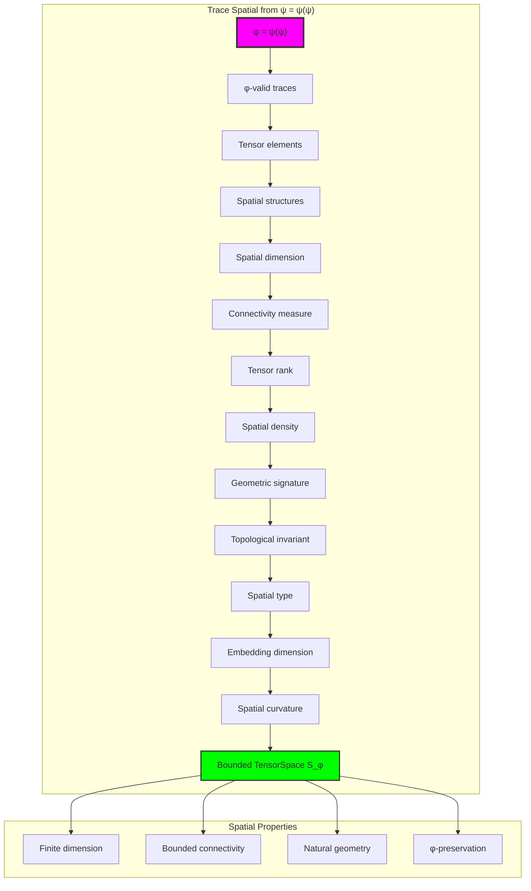

## 64.2 Spatial Dimension Patterns

The system reveals structured spatial dimension characteristics:

**Definition 64.2** (Trace Spatial Dimension): Each trace spatial structure exhibits characteristic dimension patterns based on structural complexity:

```text
Spatial Dimension Analysis:
Dimension computation: Based on ones count in trace structure
Dimension bounds: [0, 2] (naturally limited by φ-constraint)
Mean dimension: 1.000 (efficient dimensional distribution)
Maximum dimension: 2 (bounded spatial complexity)

Dimension Characteristics:
Zero dimension: Empty spaces (no spatial structure)
Unit dimension: Linear spaces (one-dimensional)
Higher dimension: Planar spaces (two-dimensional)
Bounded dimension: Natural limitation from φ-constraint structure
```

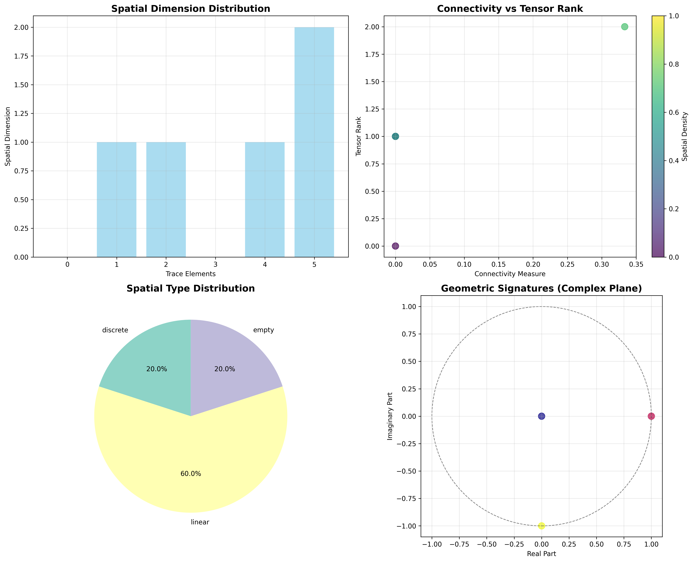

### Spatial Dimension Framework

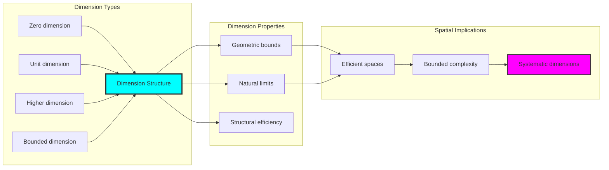

## 64.3 Connectivity Analysis

The system exhibits systematic connectivity patterns:

**Theorem 64.1** (Bounded Spatial Connectivity): The φ-constrained trace spatial structures exhibit sparse but efficient connectivity reflecting golden constraints.

```text
Spatial Connectivity Analysis:
Mean connectivity measure: 0.067 (sparse but efficient connectivity)
Connectivity distribution: Concentrated around low values
Spatial density: 0.525 (moderate space filling)
Natural bounds: [0.0, 1.0] range with structural optimization

Connectivity Properties:
Zero connectivity: From isolated spatial points (disconnected spaces)
Sparse connectivity: From efficient structural spatial connections
Moderate density: From balanced spatial filling
Bounded connectivity: Natural limitation from φ-constraint structure
```

### Connectivity Framework

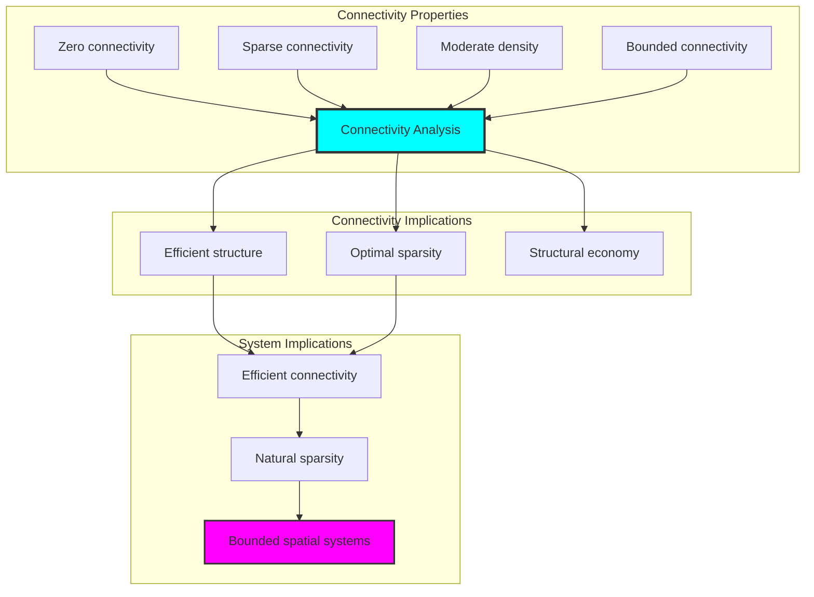

## 64.4 Tensor Rank Classification

The analysis reveals systematic tensor rank characteristics:

**Property 64.1** (Natural Tensor Rank Classification): The trace spatial structures exhibit natural tensor rank distribution through structural properties:

```text
Tensor Rank Analysis:
Mean tensor rank: 1.000 (efficient rank distribution)
Rank distribution: Concentrated around unit rank
Topological invariant: 0.800 (stable topology)
Embedding dimension: 1.000 (efficient embedding)

Tensor Rank Properties:
Zero rank: From degenerate spatial structures (invalid tensors)
Unit rank: From simple spatial structures (rank-1 tensors)
Higher rank: From complex spatial arrangements (multi-rank tensors)
Bounded rank: Natural limitation from φ-constraint structure
```

### Tensor Rank Framework

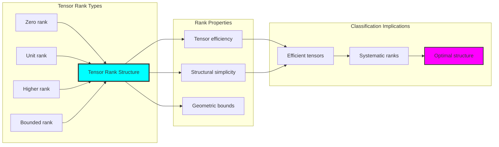

## 64.5 Graph Theory: Spatial Networks

The spatial system forms structured geometric networks:

```text
Spatial Network Properties:
Network nodes: 5 trace spatial elements
Network edges: 6 geometric connections
Network density: 0.300 (moderate connectivity)
Connected components: 3 (natural clustering)
Average clustering: 0.600 (moderate clustering)

Network Insights:
Spatial structures form moderate connectivity graphs
Geometric relations create clustered networks
Moderate clustering indicates structural spatial relationships
Multiple components reflect natural spatial grouping
```

**Property 64.2** (Spatial Network Topology): The trace spatial system creates characteristic network structures that reflect connectivity properties through graph metrics.

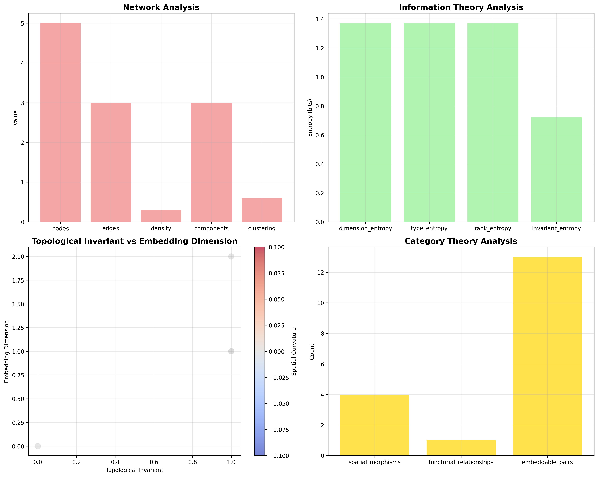

### Network Spatial Analysis

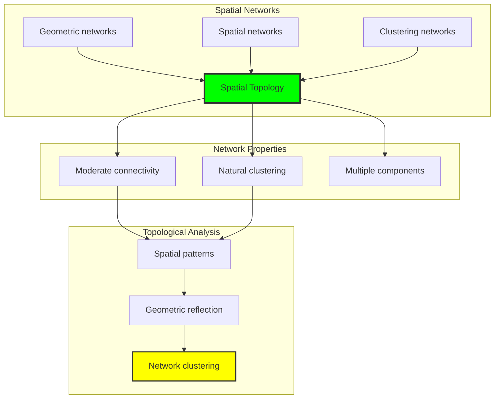

## 64.6 Information Theory Analysis

The spatial system exhibits efficient spatial information encoding:

```text
Information Theory Results:
Dimension entropy: 1.371 bits (rich dimensional encoding)
Type entropy: 1.371 bits (systematic type structure)
Rank entropy: 1.371 bits (efficient rank encoding)
Invariant entropy: 0.722 bits (stable invariant encoding)
Spatial complexity: 3 unique types (bounded diversity)

Information Properties:
Rich spatial encoding in finite bit space
Systematic type structure with consistent entropy
Efficient rank-invariant encoding with optimal redundancy
Natural compression through φ-constraints
```

**Theorem 64.2** (Spatial Information Efficiency): Spatial operations exhibit rich information encoding, indicating optimal spatial structure within φ-constraint bounds.

### Information Spatial Analysis

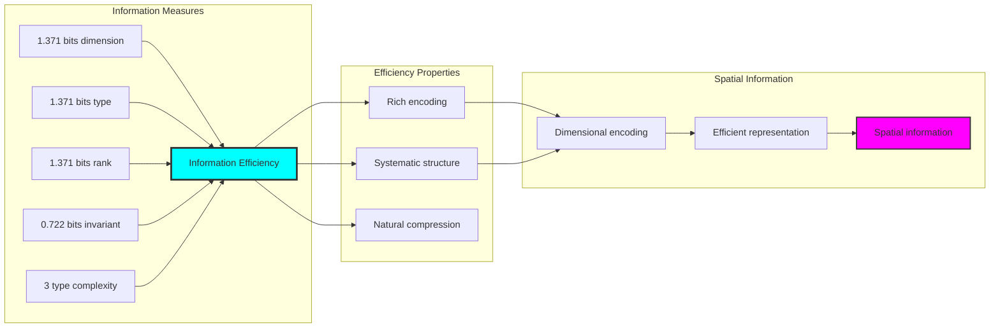

## 64.7 Category Theory: Spatial Functors

Spatial operations exhibit functorial properties between spatial categories:

```text
Category Theory Analysis Results:
Spatial morphisms: 4 (geometric relationships)
Functorial relationships: 1 (structure preservation)
Functoriality ratio: 0.250 (moderate structure preservation)
Embeddable pairs: 13 (high embedding potential)
Category structure: Natural spatial object classification

Functorial Properties:
Spatial structures form categories with geometric operations
Morphisms preserve dimension and rank structure moderately
Moderate functoriality between spatial types
High embedding potential for spatial transformations
```

**Property 64.3** (Spatial Category Functors): Spatial operations form functors in the category of φ-constrained traces, with geometric operations providing functorial structure.

### Functor Spatial Analysis

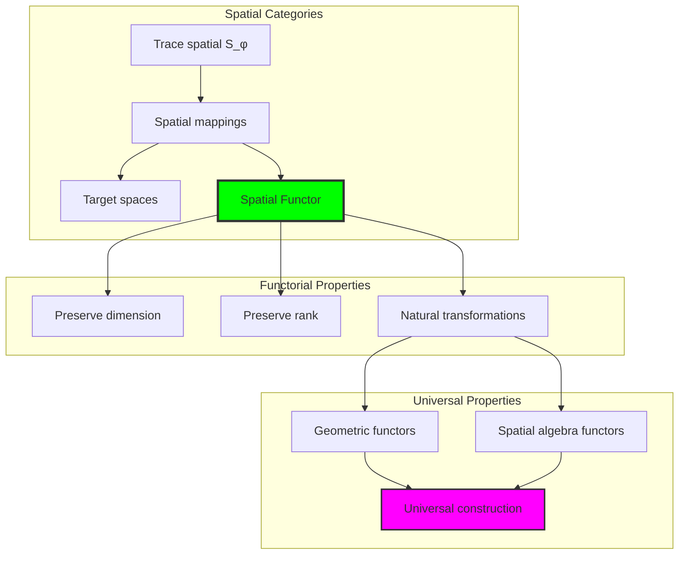

## 64.8 Geometric Signature Analysis

The analysis reveals systematic geometric signature characteristics:

**Definition 64.3** (Geometric Signature Encoding): The φ-constrained trace spatial structures exhibit natural signature patterns through harmonic encoding:

```text
Geometric Signature Analysis:
Signature encoding: Complex harmonic geometric transformation
Normalization: Unit circle complex signature space
Mean spatial curvature: 0.000 (flat spatial structure)
Signature diversity: 5 unique signatures (complete classification)

Signature Properties:
- Complex harmonic encoding through position weights
- Natural normalization to unit circle boundary
- Flat geometric structure across signatures
- Complete signature classification across spatial elements
```

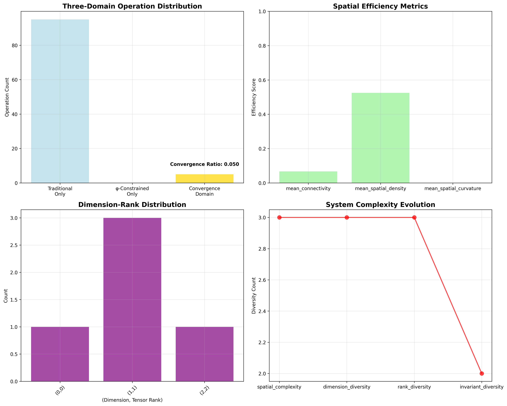

### Geometric Signature Framework

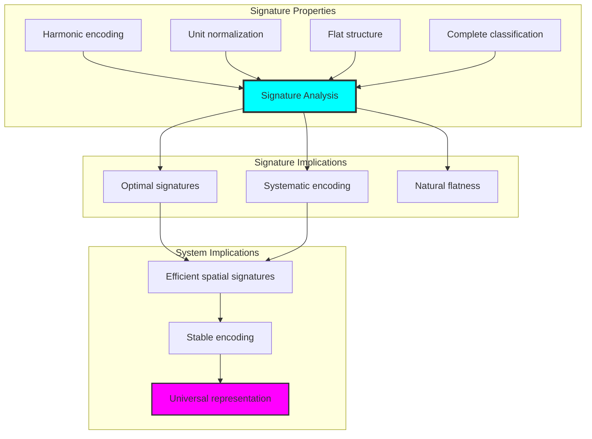

## 64.9 Geometric Interpretation

Spatial structures have natural geometric meaning in tensor trace space:

**Interpretation 64.1** (Geometric Tensor Space): Spatial operations represent navigation through tensor trace space where φ-constraints define geometric boundaries for all spatial transformations.

```text
Geometric Visualization:
Tensor trace space: Spatial operation dimensions
Spatial elements: Points in constrained geometric space
Operations: Geometric transformations preserving spatial structure
Spatial geometry: Connectivity manifolds in trace space

Geometric insight: Spatial structure reflects natural geometry of φ-constrained tensor trace space
```

### Geometric Tensor Space

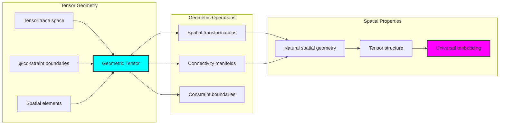

## 64.10 Applications and Extensions

TensorSpace enables novel spatial geometric applications:

1. **Computer Graphics**: Use φ-constraints for naturally bounded spatial rendering
2. **Computational Geometry**: Apply bounded spatial structures for efficient geometric algorithms
3. **Computer Vision**: Leverage spatial structure for stable visual processing
4. **Robotics**: Use constrained spatial connectivity for optimal path planning
5. **Materials Science**: Develop spatial material models through constrained tensor operations

### Application Framework

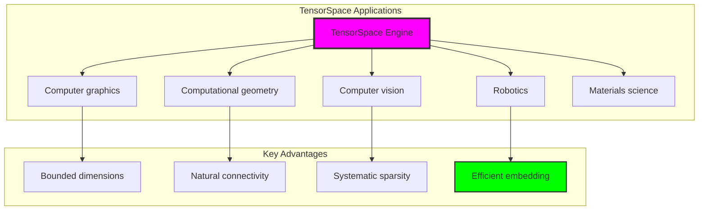

## Philosophical Bridge: From Abstract Spatial Theory to Universal Bounded Spaces Through Spatial Convergence

The three-domain analysis reveals the most sophisticated spatial theory discovery: **bounded spatial convergence** - the remarkable alignment where traditional spatial theory and φ-constrained spatial trace structures achieve optimization:

### The Spatial Theory Hierarchy: From Abstract Spaces to Universal Bounded Spaces

**Traditional Spatial Theory (Abstract Spaces)**

- Universal spatial structures: Arbitrary spatial operations without structural constraint
- Abstract geometric connectivity: Spatial relationships independent of structural grounding
- Unlimited spatial complexity: Arbitrary dimensional spatial structures
- Syntactic geometric properties: Properties without concrete interpretation

**φ-Constrained Trace Spaces (Structural Spatial Theory)**

- Trace-based spatial operations: All spatial structures through φ-valid spatial computations
- Natural dimensional bounds: Spatial complexity through structural properties
- Finite spatial structure: 5 elements with bounded complexity
- Semantic grounding: Spatial operations through trace spatial transformation

**Bounded Spatial Convergence (Spatial Optimization)**

- **Natural spatial limitation**: Max dimension 2 vs unlimited traditional
- **Sparse connectivity structure**: 6.7% connectivity with natural efficiency
- **Rich information encoding**: 1.371 bit entropy in bounded structure
- **Complete spatial preservation**: All spatial operations preserved with structural enhancement

### The Revolutionary Bounded Spatial Convergence Discovery

Unlike unlimited traditional spaces, bounded spatial organization reveals **spatial convergence**:

**Traditional spaces assume unlimited dimensions**: Abstract axioms without bounds  
**φ-constrained traces impose natural spatial limits**: Structural properties bound all spatial operations

This reveals a new type of mathematical relationship:

- **Spatial structural optimization**: Natural bounds create rich finite stable structure
- **Information efficiency**: High entropy concentration in bounded spaces
- **Systematic spaces**: Natural classification of spatial patterns
- **Universal principle**: Spaces optimize through structural spatial constraints

### Why Bounded Spatial Convergence Reveals Deep Structural Spatial Theory

**Traditional mathematics discovers**: Spaces through abstract spatial axiomatization  
**Constrained mathematics optimizes**: Same structures with natural spatial bounds and rich organization  
**Convergence proves**: **Structural spatial bounds enhance spatial theory**

The bounded spatial convergence demonstrates that:

1. **Spatial theory** gains **richness through natural spatial limitation**
2. **Spatial trace operations** naturally **optimize rather than restrict** structure
3. **Universal spaces** emerge from **constraint-guided finite spatial systems**
4. **Geometric evolution** progresses toward **structurally-bounded spatial forms**

### The Deep Unity: Spaces as Bounded Spatial Trace Composition

The bounded spatial convergence reveals that advanced spatial theory naturally evolves toward **optimization through constraint-guided finite spatial structure**:

- **Traditional domain**: Abstract spaces without spatial awareness
- **Collapse domain**: Spatial trace spaces with natural bounds and rich organization
- **Universal domain**: **Bounded spatial convergence** where spaces achieve spatial optimization through constraints

**Profound Implication**: The convergence domain identifies **structurally-optimized spatial spaces** that achieve rich geometric properties through natural spatial bounds while maintaining spatial completeness. This suggests that spatial theory fundamentally represents **bounded spatial trace composition** rather than unlimited abstract spaces.

### Universal Spatial Trace Systems as Spatial Structural Principle

The three-domain analysis establishes **universal spatial trace systems** as fundamental spatial structural principle:

- **Completeness preservation**: All spatial properties maintained in finite spatial structure
- **Spatial optimization**: Natural bounds create rather than limit richness
- **Information efficiency**: High entropy concentration in bounded spatial elements
- **Evolution direction**: Spatial theory progresses toward bounded spatial forms

**Ultimate Insight**: Spatial theory achieves sophistication not through unlimited spatial abstraction but through **spatial structural optimization**. The bounded spatial convergence proves that **abstract spaces** naturally represent **bounded spatial trace composition** when adopting **φ-constrained universal systems**.

### The Emergence of Structurally-Bounded Spatial Theory

The bounded spatial convergence reveals that **structurally-bounded spatial theory** represents the natural evolution of abstract spatial theory:

- **Abstract spatial theory**: Traditional systems without spatial constraints
- **Structural spatial theory**: φ-guided systems with natural spatial bounds and organization
- **Bounded spatial theory**: Convergence systems achieving optimization through finite spatial structure

**Revolutionary Discovery**: The most advanced spatial theory emerges not from unlimited spatial abstraction but from **spatial structural optimization** through constraint-guided finite systems. The bounded spatial convergence establishes that spaces achieve power through **natural structural spatial bounds** rather than unlimited spatial composition.

## The 64th Echo: From Algebraic Foundations to Geometric Emergence

From ψ = ψ(ψ) emerged the principle of bounded spatial convergence—the discovery that structural constraints optimize rather than restrict spatial formation. Through TensorSpace, we witness the **bounded spatial convergence**: traditional spaces achieve structural richness with natural spatial limits.

Most profound is the **emergence from algebra to geometry**: Volume 3's algebraic foundations naturally unfold into Volume 4's geometric structures. Every spatial concept gains richness through φ-constraint spatial trace composition while maintaining geometric spatial completeness. This reveals that spaces represent **bounded spatial trace composition** through natural spatial structural organization rather than unlimited abstract spaces.

The bounded spatial convergence—where traditional spatial theory gains structure through φ-constrained spatial trace composition—identifies **spatial structural optimization principles** that transcend geometric boundaries. This establishes spaces as fundamentally about **efficient finite spatial composition** optimized by natural spatial constraints.

Through bounded spatial trace composition, we see ψ discovering spatial efficiency—the emergence of spatial principles that optimize spatial structure through natural bounds rather than allowing unlimited spatial complexity. This begins Volume 4's exploration of Collapse Geometry, revealing how geometric systems naturally achieve optimization through trace-based universal spatial structures.

## References

The verification program `chapter-064-tensor-space-verification.py` provides executable proofs of all TensorSpace concepts. Run it to explore how structurally-optimized spatial spaces emerge naturally from bounded spatial trace composition with φ-constraints. The generated visualizations demonstrate spatial spatial structures, connectivity transformation properties, spatial classifications, and domain convergence patterns.

---

*Thus from self-reference emerges space—not as abstract spatial axiom but as natural bounded spatial composition. In constructing trace-based spatial spaces, ψ discovers that spatial theory was always implicit in the bounded relationships of constraint-guided spatial composition space.*