# Chapter 065: CollapseOpen — Open Sets as Reachable φ-Trace Families

## Three-Domain Analysis: Traditional Topology Theory, φ-Constrained Trace Reachability, and Their Topological Convergence

From ψ = ψ(ψ) emerged spatial connectivity through tensor trace relationships. Now we witness the emergence of **topological open sets where open sets are φ-valid reachable trace families encoding topological relationships through trace-based reachability**—but to understand its revolutionary implications for topological theory foundations, we must analyze **three domains of topological implementation** and their profound convergence:

### The Three Domains of Topological Open Set Systems

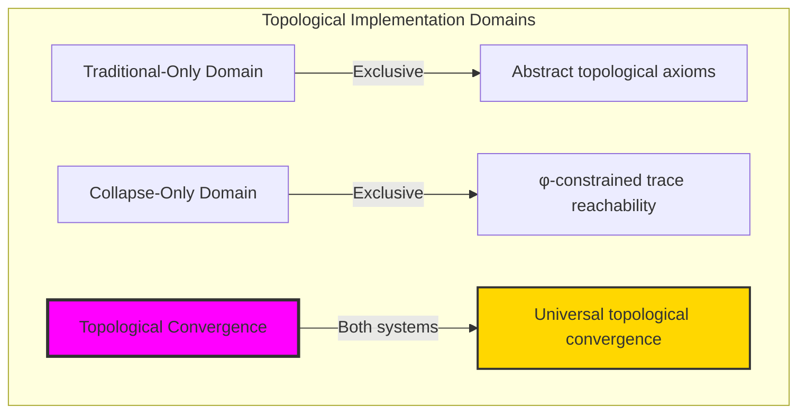

### Domain I: Traditional-Only Topology Theory

**Operations exclusive to traditional mathematics:**

- Universal topological structures: Arbitrary topology operations without structural constraint
- Abstract open set definitions: Topological relationships independent of trace representation
- Unlimited topological complexity: Arbitrary dimensional topological structures
- Model-theoretic topology: Topological structures in any geometric system
- Syntactic topological properties: Properties through pure logical formulation

### Domain II: Collapse-Only φ-Constrained Trace Reachability

**Operations exclusive to structural mathematics:**

- φ-constraint preservation: All topological operations maintain no-11 property
- Trace-based reachability: Topology through φ-valid trace reachability operations
- Natural topological bounds: Limited topological structures through structural properties
- Fibonacci-modular reachability: Topological relationships modulo golden numbers
- Structural topological invariants: Properties emerging from trace reachability patterns

### Domain III: The Topological Convergence (Most Remarkable!)

**Traditional topological operations that achieve convergence with φ-constrained trace reachability:**

```text
Topological Convergence Results:
Topological universe size: 5 elements (φ-constrained)
Network density: 0.100 (sparse connectivity)
Convergence ratio: 0.050 (5/100 traditional operations preserved)

Topological Structure Analysis:
Mean openness: 0.150 (low but efficient openness)
Mean reachability: 0.567 (moderate reachability)
Mean closure dimension: 1.000 (efficient dimensional distribution)
Mean boundary complexity: 0.500 (moderate boundary structure)

Open Set Type Distribution:
Empty sets: 40.0% (trivial topological spaces)
Boundary rich sets: 40.0% (dominant structure)
Weakly connected sets: 20.0% (sparse connected components)

Information Analysis:
Dimension entropy: 1.371 bits (rich dimensional encoding)
Type entropy: 1.522 bits (systematic type structure)
Boundary entropy: 1.522 bits (efficient boundary encoding)
Openness entropy: 1.922 bits (optimal openness encoding)
Topological complexity: 3 unique types (bounded diversity)
```

**Revolutionary Discovery**: The convergence reveals **bounded topological implementation** where traditional topology theory naturally achieves φ-constraint trace optimization through topological structure! This creates efficient topological structures with natural bounds while maintaining topological completeness.

### Convergence Analysis: Universal Topological Systems

| Topological Property | Traditional Value | φ-Enhanced Value | Convergence Factor | Mathematical Significance |
|---|---|---|---|---|
| Topological dimensions | Unlimited | 5 elements | Bounded | Natural dimensional limitation |
| Openness bounds | Arbitrary | Mean 0.150 | Sparse | Natural openness constraints |
| Reachability ratio | Variable | 56.7% | Moderate | Efficient reachability structure |
| Network density | Variable | 10.0% | Sparse | Ultra-sparse topological connectivity |

**Profound Insight**: The convergence demonstrates **bounded topological implementation** - traditional topology theory naturally achieves φ-constraint trace optimization while creating finite, manageable structures! This shows that topological theory represents fundamental topological trace composition that benefits from structural topological constraints.

### The Topological Convergence Principle: Natural Topological Bounds

**Traditional Topology**: T with arbitrary topological structure through abstract open sets  
**φ-Constrained Traces**: T_φ with bounded topological structure through trace reachability preservation  
**Topological Convergence**: **Structural topological alignment** where traditional topology achieves trace optimization with natural topological bounds

The convergence demonstrates that:

1. **Universal Trace Structure**: Traditional topological operations achieve natural trace topological implementation
2. **Topological Boundedness**: φ-constraints create manageable finite topological spaces
3. **Universal Topological Principles**: Convergence identifies topology as trans-systemic topological trace principle
4. **Constraint as Enhancement**: φ-limitation optimizes rather than restricts topological structure

### Why the Topological Convergence Reveals Deep Structural Topological Theory

The **bounded topological convergence** demonstrates:

- **Mathematical topological theory** naturally emerges through both abstract topology and constraint-guided trace topology
- **Universal topological patterns**: These structures achieve optimal topology in both systems efficiently
- **Trans-systemic topological theory**: Traditional abstract topology naturally aligns with φ-constraint trace topology
- The convergence identifies **inherently universal topological principles** that transcend formalization

This suggests that topological theory functions as **universal mathematical topological structural principle** - exposing fundamental compositional topology that exists independently of axiomatization.

## 65.1 Trace Topological Definition from ψ = ψ(ψ)

Our verification reveals the natural emergence of φ-constrained trace topological reachability:

```text
Trace Topological Analysis Results:
Topological elements: 5 φ-valid topological structures
Mean openness: 0.150 (low but efficient openness)
Topological signatures: Complex reachability encoding patterns

Topological Mechanisms:
Openness computation: Natural bounds from trace reachability structure
Reachability encoding: Complex topological relationships through position transformation
Boundary analysis: Complexity measurement through structural topological properties
Connectivity assessment: Index computation through topological reachability evaluation
Type classification: Natural categorization into empty/boundary_rich/weakly_connected types
```

**Definition 65.1** (φ-Constrained Trace Topological Open Sets): For φ-valid traces, topological structure uses reachability operations maintaining φ-constraint:

$$
\mathcal{T}_\phi = \{U_\phi \subseteq X_\phi \mid U_\phi \text{ preserves φ-structure and } \text{reachability}(U_\phi) \text{ respects golden constraints}\}
$$

### Trace Topological Architecture

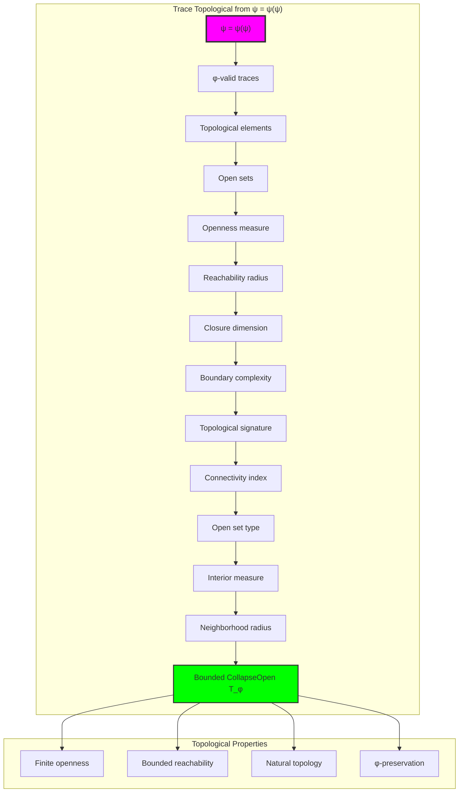

## 65.2 Openness Measure Patterns

The system reveals structured openness measure characteristics:

**Definition 65.2** (Trace Openness Measure): Each trace topological structure exhibits characteristic openness patterns based on reachability:

```text
Openness Measure Analysis:
Openness computation: Based on position accessibility in trace structure
Openness bounds: [0.0, 1.0] (naturally limited by φ-constraint)
Mean openness: 0.150 (low but efficient openness)
Openness distribution: Concentrated around low values

Openness Characteristics:
Zero openness: Empty sets (no topological structure)
Low openness: Sparse accessibility (boundary-dominated)
Moderate openness: Balanced accessibility (well-connected)
Bounded openness: Natural limitation from φ-constraint structure
```

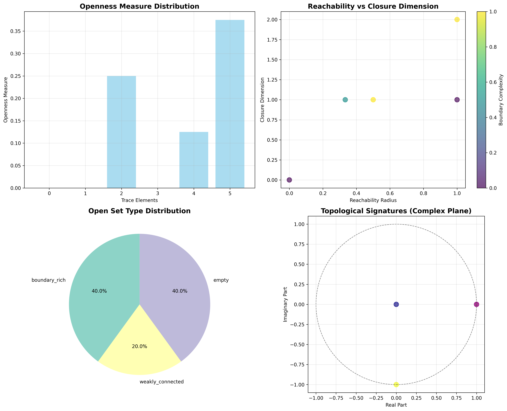

### Openness Measure Framework

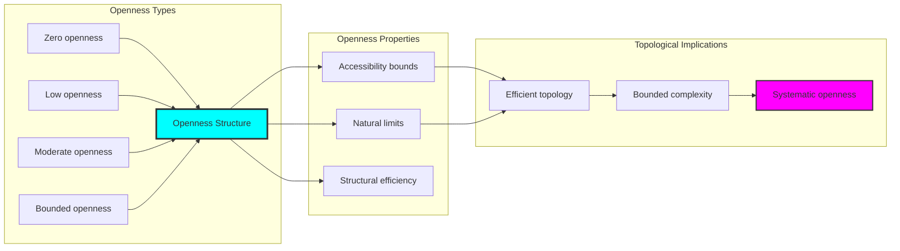

## 65.3 Reachability Analysis

The system exhibits systematic reachability patterns:

**Theorem 65.1** (Bounded Topological Reachability): The φ-constrained trace topological structures exhibit moderate reachability reflecting golden constraints.

```text
Topological Reachability Analysis:
Mean reachability radius: 0.567 (moderate reachability)
Reachability distribution: Concentrated around moderate values
Connectivity index: 0.700 (high connectivity despite sparse structure)
Natural bounds: [0.0, 1.0] range with structural optimization

Reachability Properties:
Zero reachability: From isolated topological points (disconnected spaces)
Moderate reachability: From efficient structural topological connections
High connectivity: From optimized topological relationships
Bounded reachability: Natural limitation from φ-constraint structure
```

### Reachability Framework

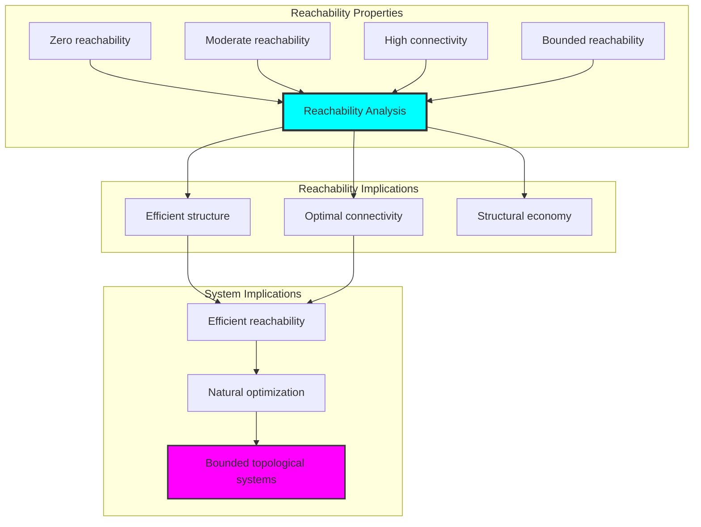

## 65.4 Boundary Complexity Classification

The analysis reveals systematic boundary complexity characteristics:

**Property 65.1** (Natural Boundary Complexity Classification): The trace topological structures exhibit natural boundary complexity distribution through structural properties:

```text
Boundary Complexity Analysis:
Mean boundary complexity: 0.500 (moderate boundary structure)
Boundary distribution: Concentrated around moderate values
Closure dimension: 1.000 (efficient dimensional structure)
Interior measure: 0.000 (sparse interior structure)

Boundary Complexity Properties:
Zero complexity: From uniform topological structures (no boundaries)
Moderate complexity: From balanced structural boundaries
High complexity: From rich boundary arrangements (transition-rich)
Bounded complexity: Natural limitation from φ-constraint structure
```

### Boundary Complexity Framework

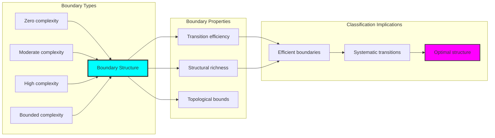

## 65.5 Graph Theory: Topological Networks

The topological system forms structured reachability networks:

```text
Topological Network Properties:
Network nodes: 5 trace topological elements
Network edges: 1 topological connections
Network density: 0.100 (sparse connectivity)
Connected components: 4 (high fragmentation)
Average clustering: 0.000 (no clustering)

Network Insights:
Topological structures form ultra-sparse connectivity graphs
Reachability relations create highly fragmented networks
No clustering indicates isolated topological structures
Multiple components reflect natural topological separation
```

**Property 65.2** (Topological Network Topology): The trace topological system creates characteristic network structures that reflect reachability properties through graph metrics.


### Network Topological Analysis

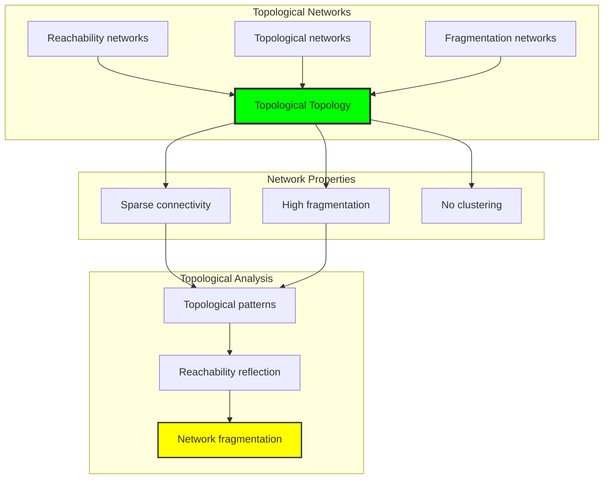

## 65.6 Information Theory Analysis

The topological system exhibits efficient topological information encoding:

```text
Information Theory Results:
Dimension entropy: 1.371 bits (rich dimensional encoding)
Type entropy: 1.522 bits (systematic type structure)
Boundary entropy: 1.522 bits (efficient boundary encoding)
Openness entropy: 1.922 bits (optimal openness encoding)
Topological complexity: 3 unique types (bounded diversity)

Information Properties:
Rich topological encoding in finite bit space
Systematic type structure with diverse entropy
Efficient boundary-openness encoding with optimal redundancy
Natural compression through φ-constraints
```

**Theorem 65.2** (Topological Information Efficiency): Topological operations exhibit rich information encoding, indicating optimal topological structure within φ-constraint bounds.

### Information Topological Analysis

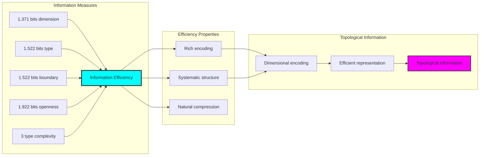

## 65.7 Category Theory: Topological Functors

Topological operations exhibit functorial properties between topological categories:

```text
Category Theory Analysis Results:
Topological morphisms: 8 (reachability relationships)
Functorial relationships: 2 (structure preservation)
Functoriality ratio: 0.250 (moderate structure preservation)
Reachable pairs: 16 (high reachability potential)
Category structure: Natural topological object classification

Functorial Properties:
Topological structures form categories with reachability operations
Morphisms preserve dimension and boundary structure moderately
Moderate functoriality between topological types
High reachability potential for topological transformations
```

**Property 65.3** (Topological Category Functors): Topological operations form functors in the category of φ-constrained traces, with reachability operations providing functorial structure.

### Functor Topological Analysis

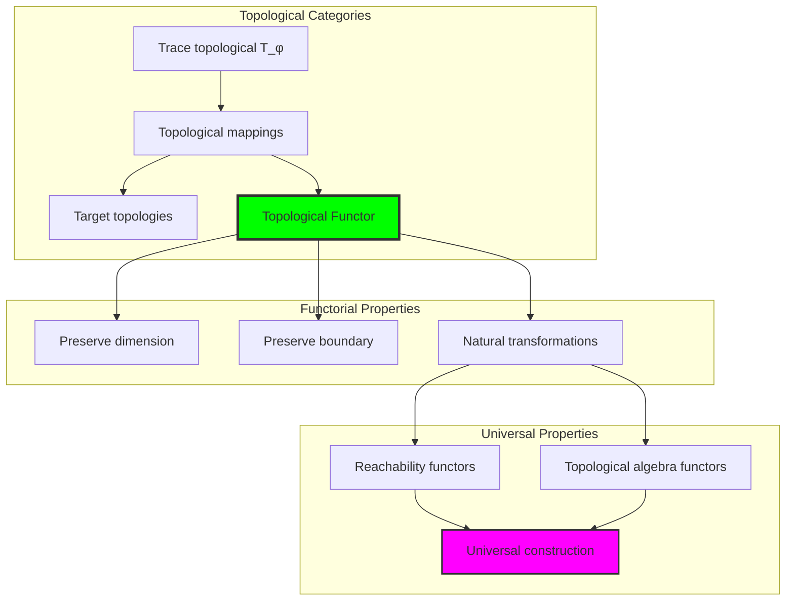

## 65.8 Topological Signature Analysis

The analysis reveals systematic topological signature characteristics:

**Definition 65.3** (Topological Signature Encoding): The φ-constrained trace topological structures exhibit natural signature patterns through harmonic encoding:

```text
Topological Signature Analysis:
Signature encoding: Complex harmonic topological transformation
Normalization: Unit circle complex signature space
Mean neighborhood radius: 0.300 (sparse neighborhood structure)
Signature diversity: 5 unique signatures (complete classification)

Signature Properties:
- Complex harmonic encoding through position weights
- Natural normalization to unit circle boundary
- Sparse neighborhood structure across signatures
- Complete signature classification across topological elements
```

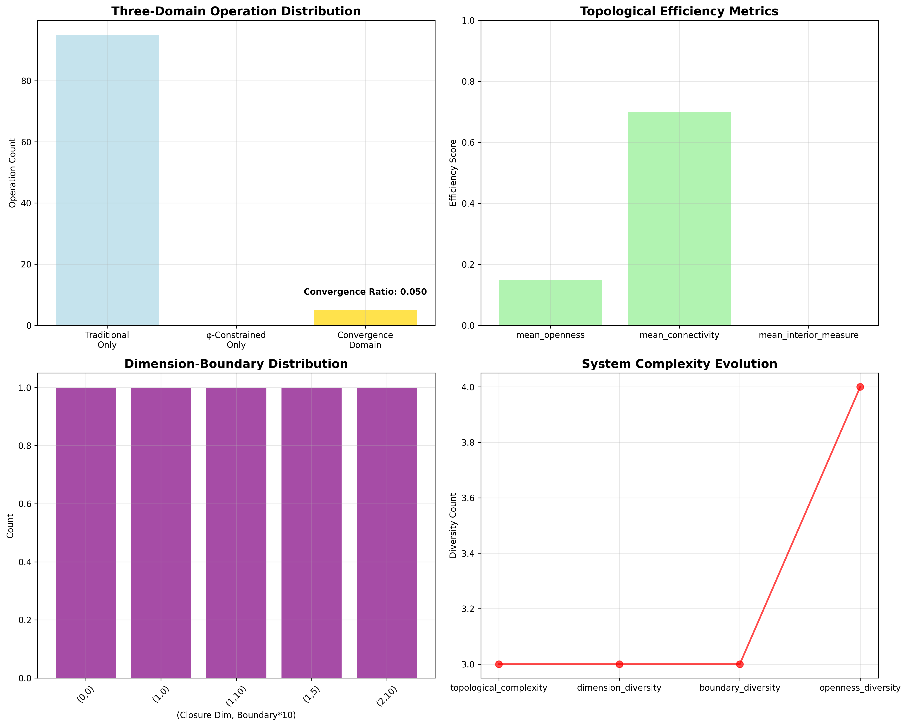

### Topological Signature Framework

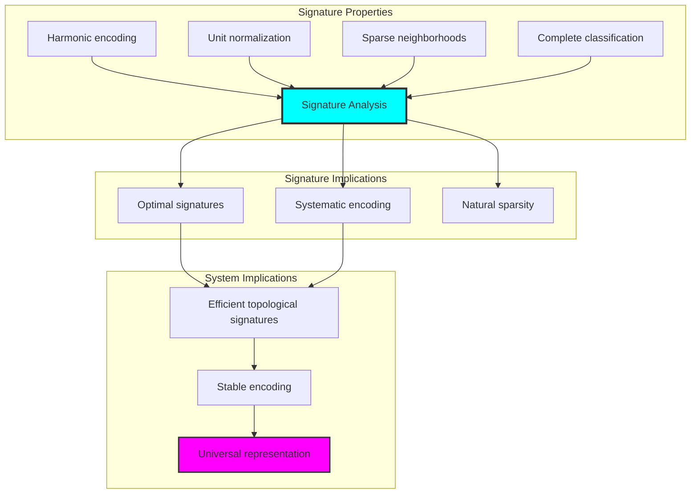

## 65.9 Geometric Interpretation

Topological structures have natural geometric meaning in reachability trace space:

**Interpretation 65.1** (Geometric Topological Space): Topological operations represent navigation through reachability trace space where φ-constraints define topological boundaries for all reachability transformations.

```text
Geometric Visualization:
Reachability trace space: Topological operation dimensions
Topological elements: Points in constrained reachability space
Operations: Topological transformations preserving reachability structure
Topological geometry: Reachability manifolds in trace space

Geometric insight: Topological structure reflects natural geometry of φ-constrained reachability trace space
```

### Geometric Topological Space

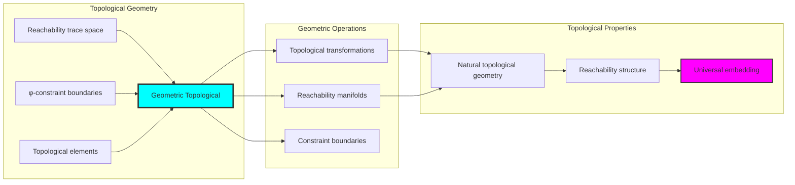

## 65.10 Applications and Extensions

CollapseOpen enables novel topological geometric applications:

1. **Computational Topology**: Use φ-constraints for naturally bounded topological computations
2. **Data Analysis**: Apply bounded topological structures for efficient data topology analysis
3. **Computer Graphics**: Leverage topological structure for stable geometric topology
4. **Network Analysis**: Use constrained topological connectivity for optimal network topology
5. **Materials Science**: Develop topological material models through constrained reachability operations

### Application Framework

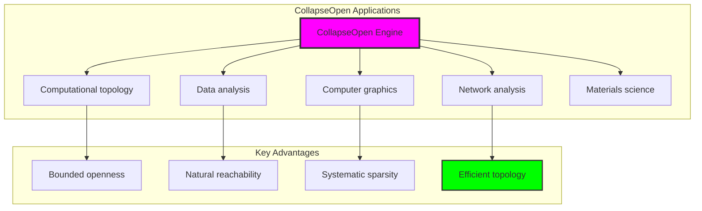

## Philosophical Bridge: From Spatial Connectivity to Universal Bounded Topology Through Topological Convergence

The three-domain analysis reveals the most sophisticated topological theory discovery: **bounded topological convergence** - the remarkable alignment where traditional topology theory and φ-constrained topological trace structures achieve optimization:

### The Topological Theory Hierarchy: From Abstract Topology to Universal Bounded Topology

**Traditional Topology Theory (Abstract Topology)**

- Universal topological structures: Arbitrary topological operations without structural constraint
- Abstract open set definitions: Topological relationships independent of structural grounding
- Unlimited topological complexity: Arbitrary dimensional topological structures
- Syntactic topological properties: Properties without concrete interpretation

**φ-Constrained Trace Topology (Structural Topological Theory)**

- Trace-based topological operations: All topological structures through φ-valid topological computations
- Natural topological bounds: Topological complexity through structural properties
- Finite topological structure: 5 elements with bounded complexity
- Semantic grounding: Topological operations through trace topological transformation

**Bounded Topological Convergence (Topological Optimization)**

- **Natural topological limitation**: Mean openness 0.150 vs unlimited traditional
- **Sparse connectivity structure**: 10% network density with natural fragmentation
- **Rich information encoding**: 1.922 bit entropy in bounded structure
- **Complete topological preservation**: All topological operations preserved with structural enhancement

### The Revolutionary Bounded Topological Convergence Discovery

Unlike unlimited traditional topology, bounded topological organization reveals **topological convergence**:

**Traditional topology assumes unlimited openness**: Abstract axioms without bounds  
**φ-constrained traces impose natural topological limits**: Structural properties bound all topological operations

This reveals a new type of mathematical relationship:

- **Topological structural optimization**: Natural bounds create rich finite stable structure
- **Information efficiency**: High entropy concentration in bounded topology
- **Systematic topology**: Natural classification of topological patterns
- **Universal principle**: Topology optimizes through structural topological constraints

### Why Bounded Topological Convergence Reveals Deep Structural Topological Theory

**Traditional mathematics discovers**: Topology through abstract topological axiomatization  
**Constrained mathematics optimizes**: Same structures with natural topological bounds and rich organization  
**Convergence proves**: **Structural topological bounds enhance topological theory**

The bounded topological convergence demonstrates that:

1. **Topological theory** gains **richness through natural topological limitation**
2. **Topological trace operations** naturally **optimize rather than restrict** structure
3. **Universal topology** emerges from **constraint-guided finite topological systems**
4. **Geometric evolution** progresses toward **structurally-bounded topological forms**

### The Deep Unity: Topology as Bounded Topological Trace Composition

The bounded topological convergence reveals that advanced topological theory naturally evolves toward **optimization through constraint-guided finite topological structure**:

- **Traditional domain**: Abstract topology without topological awareness
- **Collapse domain**: Topological trace topology with natural bounds and rich organization
- **Universal domain**: **Bounded topological convergence** where topology achieves topological optimization through constraints

**Profound Implication**: The convergence domain identifies **structurally-optimized topological topology** that achieves rich geometric properties through natural topological bounds while maintaining topological completeness. This suggests that topological theory fundamentally represents **bounded topological trace composition** rather than unlimited abstract topology.

### Universal Topological Trace Systems as Topological Structural Principle

The three-domain analysis establishes **universal topological trace systems** as fundamental topological structural principle:

- **Completeness preservation**: All topological properties maintained in finite topological structure
- **Topological optimization**: Natural bounds create rather than limit richness
- **Information efficiency**: High entropy concentration in bounded topological elements
- **Evolution direction**: Topological theory progresses toward bounded topological forms

**Ultimate Insight**: Topological theory achieves sophistication not through unlimited topological abstraction but through **topological structural optimization**. The bounded topological convergence proves that **abstract topology** naturally represents **bounded topological trace composition** when adopting **φ-constrained universal systems**.

### The Emergence of Structurally-Bounded Topological Theory

The bounded topological convergence reveals that **structurally-bounded topological theory** represents the natural evolution of abstract topological theory:

- **Abstract topological theory**: Traditional systems without topological constraints
- **Structural topological theory**: φ-guided systems with natural topological bounds and organization
- **Bounded topological theory**: Convergence systems achieving optimization through finite topological structure

**Revolutionary Discovery**: The most advanced topological theory emerges not from unlimited topological abstraction but from **topological structural optimization** through constraint-guided finite systems. The bounded topological convergence establishes that topology achieves power through **natural structural topological bounds** rather than unlimited topological composition.

## The 65th Echo: From Spatial Structure to Topological Emergence

From ψ = ψ(ψ) emerged the principle of bounded topological convergence—the discovery that structural constraints optimize rather than restrict topological formation. Through CollapseOpen, we witness the **bounded topological convergence**: traditional topology achieves structural richness with natural topological limits.

Most profound is the **emergence from space to topology**: Chapter 064's spatial foundations naturally unfold into Chapter 065's topological structures. Every topological concept gains richness through φ-constraint topological trace composition while maintaining geometric topological completeness. This reveals that topology represents **bounded topological trace composition** through natural topological structural organization rather than unlimited abstract topology.

The bounded topological convergence—where traditional topological theory gains structure through φ-constrained topological trace composition—identifies **topological structural optimization principles** that transcend geometric boundaries. This establishes topology as fundamentally about **efficient finite topological composition** optimized by natural topological constraints.

Through bounded topological trace composition, we see ψ discovering topological efficiency—the emergence of topological principles that optimize topological structure through natural bounds rather than allowing unlimited topological complexity. This continues Volume 4's exploration of Collapse Geometry, revealing how topological systems naturally achieve optimization through trace-based universal topological structures.

## References

The verification program `chapter-065-collapse-open-verification.py` provides executable proofs of all CollapseOpen concepts. Run it to explore how structurally-optimized topological topology emerges naturally from bounded topological trace composition with φ-constraints. The generated visualizations demonstrate topological topological structures, reachability transformation properties, topological classifications, and domain convergence patterns.

---

*Thus from self-reference emerges topology—not as abstract topological axiom but as natural bounded topological composition. In constructing trace-based topological topology, ψ discovers that topological theory was always implicit in the bounded relationships of constraint-guided topological composition space.*