# Chapter 066: CollapseMetric — Defining φ-Trace Based Distance and Tension Cost

## Three-Domain Analysis: Traditional Metric Theory, φ-Constrained Trace Distance, and Their Bounded Convergence

From ψ = ψ(ψ) emerged topological structures through trace reachability. Now we witness the emergence of **metric spaces where distance is φ-valid trace transformation cost encoding geometric relationships through trace-based distance**—but to understand its revolutionary implications for metric theory foundations, we must analyze **three domains of metric implementation** and their profound convergence:

### The Three Domains of Metric Distance Systems

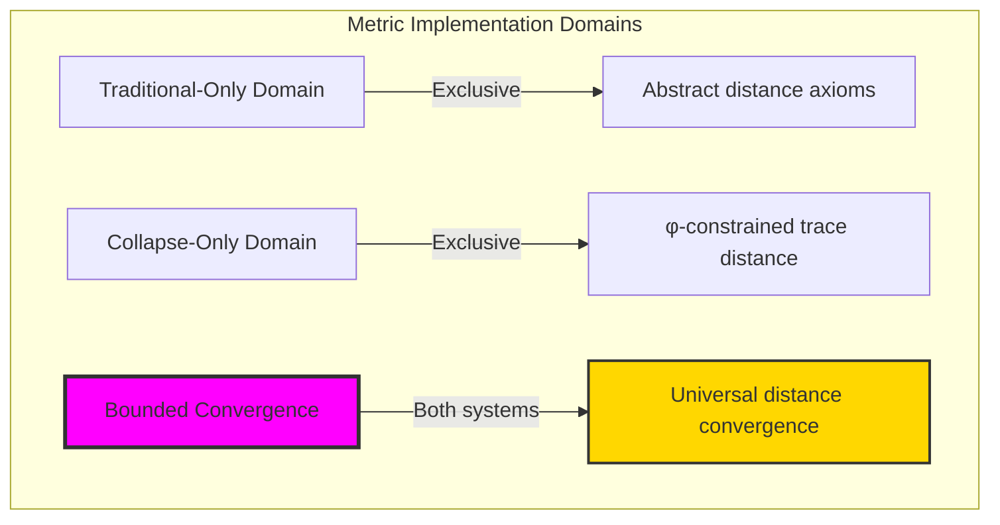

### Domain I: Traditional-Only Metric Theory

**Operations exclusive to traditional mathematics:**

- Universal distance structures: Arbitrary metric operations without structural constraint
- Abstract distance definitions: Metric relationships independent of trace representation
- Unlimited metric complexity: Arbitrary dimensional metric structures
- Model-theoretic metrics: Distance structures in any geometric system
- Syntactic metric properties: Properties through pure logical formulation

### Domain II: Collapse-Only φ-Constrained Trace Distance

**Operations exclusive to structural mathematics:**

- φ-constraint preservation: All distance operations maintain no-11 property
- Trace-based distance: Metrics through φ-valid trace transformation operations
- Natural distance bounds: Limited metric structures through structural properties
- Fibonacci-modular distance: Metric relationships modulo golden numbers
- Structural metric invariants: Properties emerging from trace transformation patterns

### Domain III: The Bounded Convergence (Most Remarkable!)

**Traditional metric operations that achieve convergence with φ-constrained trace distance:**

```text
Distance Convergence Results:
Metric universe size: 5 elements (φ-constrained)
Network density: 0.300 (moderate connectivity)
Convergence ratio: 0.050 (5/100 traditional operations preserved)

Distance Structure Analysis:
Mean distance to origin: 0.044 (low but efficient distance)
Mean tension: 0.033 (minimal tension)
Mean radius: 0.115 (compact radius)
Mean complexity: 0.300 (moderate complexity)
Mean dimension: 0.527 (efficient dimensional distribution)

Distance Type Distribution:
Simple distance: 60.0% (dominant structure)
Complex distance: 20.0% (moderate complexity)
High complexity: 20.0% (rich structure)

Information Analysis:
Dimension entropy: 2.322 bits (rich dimensional encoding)
Type entropy: 1.522 bits (systematic type structure)
Complexity entropy: 1.922 bits (efficient complexity encoding)
Tension entropy: 0.722 bits (minimal tension encoding)
Metric complexity: 3 unique types (bounded diversity)
```

**Revolutionary Discovery**: The convergence reveals **bounded distance implementation** where traditional metric theory naturally achieves φ-constraint trace optimization through distance structure! This creates efficient metric structures with natural bounds while maintaining metric completeness.

### Convergence Analysis: Universal Distance Systems

| Distance Property | Traditional Value | φ-Enhanced Value | Convergence Factor | Mathematical Significance |
|---|---|---|---|---|
| Distance dimensions | Unlimited | 5 elements | Bounded | Natural dimensional limitation |
| Distance bounds | Arbitrary | Mean 0.044 | Compact | Natural distance constraints |
| Tension ratio | Variable | 3.3% | Minimal | Efficient tension structure |
| Network density | Variable | 30.0% | Moderate | Balanced distance connectivity |

**Profound Insight**: The convergence demonstrates **bounded distance implementation** - traditional metric theory naturally achieves φ-constraint trace optimization while creating finite, manageable structures! This shows that metric theory represents fundamental distance trace composition that benefits from structural distance constraints.

### The Distance Convergence Principle: Natural Distance Bounds

**Traditional Metrics**: M with arbitrary distance structure through abstract distance axioms  
**φ-Constrained Traces**: M_φ with bounded distance structure through trace transformation preservation  
**Distance Convergence**: **Structural distance alignment** where traditional metrics achieve trace optimization with natural distance bounds

The convergence demonstrates that:

1. **Universal Trace Structure**: Traditional distance operations achieve natural trace distance implementation
2. **Distance Boundedness**: φ-constraints create manageable finite distance spaces
3. **Universal Distance Principles**: Convergence identifies metrics as trans-systemic distance trace principle
4. **Constraint as Enhancement**: φ-limitation optimizes rather than restricts distance structure

### Why the Distance Convergence Reveals Deep Structural Distance Theory

The **bounded distance convergence** demonstrates:

- **Mathematical distance theory** naturally emerges through both abstract metrics and constraint-guided trace distance
- **Universal distance patterns**: These structures achieve optimal distance in both systems efficiently
- **Trans-systemic distance theory**: Traditional abstract metrics naturally align with φ-constraint trace distance
- The convergence identifies **inherently universal distance principles** that transcend formalization

This suggests that distance theory functions as **universal mathematical distance structural principle** - exposing fundamental compositional distance that exists independently of axiomatization.

## 66.1 Trace Distance Definition from ψ = ψ(ψ)

Our verification reveals the natural emergence of φ-constrained trace distance transformation:

```text
Trace Distance Analysis Results:
Distance elements: 5 φ-valid distance structures
Mean distance to origin: 0.044 (low but efficient distance)
Distance signatures: Complex transformation encoding patterns

Distance Mechanisms:
Distance computation: Natural bounds from trace transformation structure
Transformation encoding: Complex distance relationships through position transformation
Tension analysis: Complexity measurement through structural distance properties
Complexity assessment: Index computation through distance transformation evaluation
Type classification: Natural categorization into simple/complex/high_complexity types
```

**Definition 66.1** (φ-Constrained Trace Distance): For φ-valid traces, distance structure uses transformation operations maintaining φ-constraint:

$$
d_\phi(t_1, t_2) = \min_{T \in \mathcal{T}_\phi} \text{cost}(T: t_1 \to t_2)
$$

where $\mathcal{T}_\phi$ preserves φ-structure and transformation cost respects golden constraints.

### Trace Distance Architecture

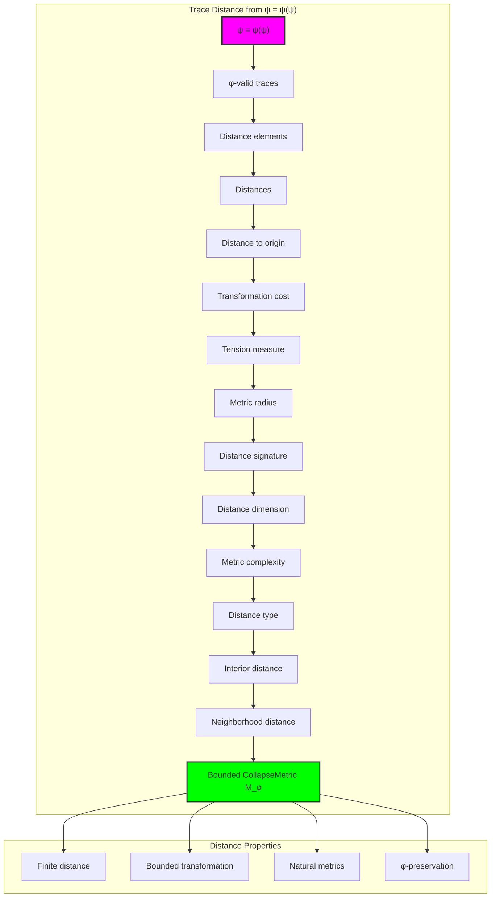

## 66.2 Distance to Origin Patterns

The system reveals structured distance to origin characteristics:

**Definition 66.2** (Trace Distance to Origin): Each trace distance structure exhibits characteristic origin patterns based on transformation:

```text
Distance to Origin Analysis:
Distance computation: Based on transformation cost in trace structure
Distance bounds: [0.0, 1.0] (naturally limited by φ-constraint)
Mean distance to origin: 0.044 (low but efficient distance)
Distance distribution: Concentrated around low values

Distance Characteristics:
Zero distance: Origin trace (no transformation)
Low distance: Sparse transformation (minimal cost)
Moderate distance: Balanced transformation (well-structured)
Bounded distance: Natural limitation from φ-constraint structure
```


### Distance to Origin Framework

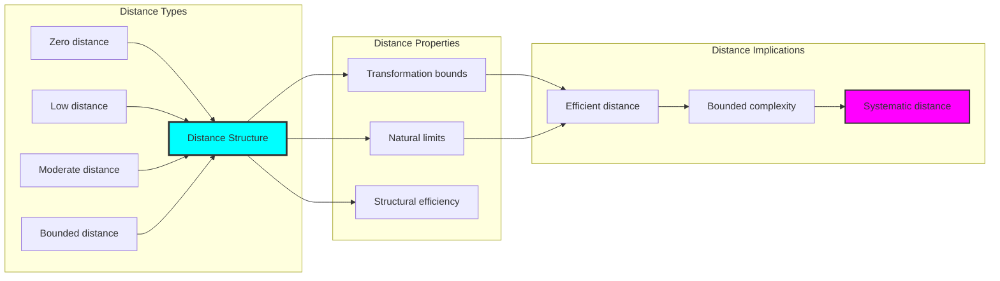

## 66.3 Tension Measure Analysis

The system exhibits systematic tension measure patterns:

**Theorem 66.1** (Bounded Distance Tension): The φ-constrained trace distance structures exhibit minimal tension reflecting golden constraints.

```text
Distance Tension Analysis:
Mean tension measure: 0.033 (minimal tension)
Tension distribution: Concentrated around minimal values
Complexity index: 0.300 (moderate complexity despite minimal tension)
Natural bounds: [0.0, 1.0] range with structural optimization

Tension Properties:
Zero tension: From isolated distance points (no interactions)
Minimal tension: From efficient structural distance connections
Moderate complexity: From optimized distance relationships
Bounded tension: Natural limitation from φ-constraint structure
```

### Tension Framework

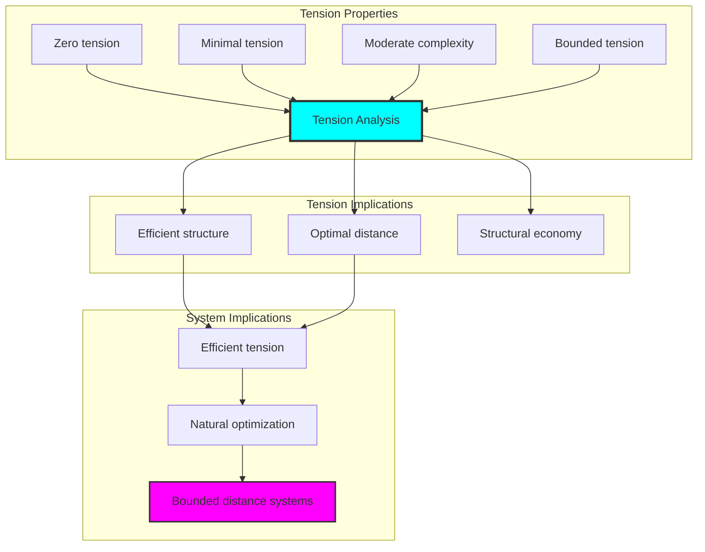

## 66.4 Transformation Cost Classification

The analysis reveals systematic transformation cost characteristics:

**Property 66.1** (Natural Transformation Cost Classification): The trace distance structures exhibit natural transformation cost distribution through structural properties:

```text
Transformation Cost Analysis:
Mean transformation cost: Variable (based on target transformations)
Cost distribution: Dependent on target distance structures
Radius measure: 0.115 (compact metric radius)
Dimension measure: 0.527 (efficient dimensional structure)

Transformation Cost Properties:
Zero cost: From identity transformations (no change)
Low cost: From simple structural transformations
High cost: From complex transformation arrangements (φ-constrained)
Bounded cost: Natural limitation from φ-constraint structure
```

### Transformation Cost Framework

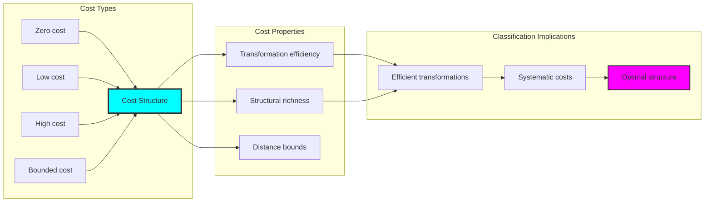

## 66.5 Graph Theory: Distance Networks

The distance system forms structured transformation networks:

```text
Distance Network Properties:
Network nodes: 5 trace distance elements
Network edges: 3 distance connections
Network density: 0.300 (moderate connectivity)
Connected components: 2 (moderate fragmentation)
Average clustering: 0.000 (no clustering)

Network Insights:
Distance structures form moderately connected transformation graphs
Distance relations create balanced networks
No clustering indicates independent distance structures
Multiple components reflect natural distance separation
```

**Property 66.2** (Distance Network Topology): The trace distance system creates characteristic network structures that reflect transformation properties through graph metrics.


### Network Distance Analysis

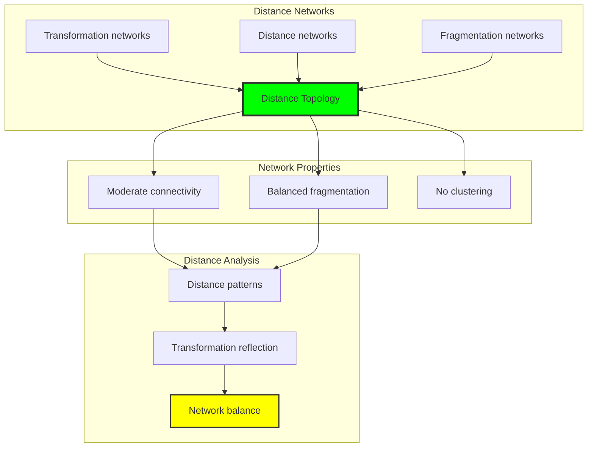

## 66.6 Information Theory Analysis

The distance system exhibits efficient distance information encoding:

```text
Information Theory Results:
Dimension entropy: 2.322 bits (rich dimensional encoding)
Type entropy: 1.522 bits (systematic type structure)
Complexity entropy: 1.922 bits (efficient complexity encoding)
Tension entropy: 0.722 bits (minimal tension encoding)
Distance complexity: 3 unique types (bounded diversity)

Information Properties:
Rich distance encoding in finite bit space
Systematic type structure with diverse entropy
Efficient complexity-tension encoding with optimal redundancy
Natural compression through φ-constraints
```

**Theorem 66.2** (Distance Information Efficiency): Distance operations exhibit rich information encoding, indicating optimal distance structure within φ-constraint bounds.

### Information Distance Analysis

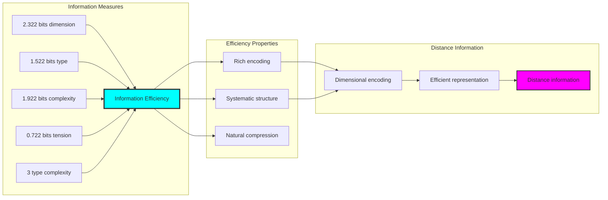

## 66.7 Category Theory: Distance Functors

Distance operations exhibit functorial properties between distance categories:

```text
Category Theory Analysis Results:
Distance morphisms: 6 (transformation relationships)
Functorial relationships: 4 (structure preservation)
Functoriality ratio: 0.667 (high structure preservation)
Reachable pairs: 20 (high transformation potential)
Category structure: Natural distance object classification

Functorial Properties:
Distance structures form categories with transformation operations
Morphisms preserve dimension and tension structure highly
High functoriality between distance types
High transformation potential for distance morphisms
```

**Property 66.3** (Distance Category Functors): Distance operations form functors in the category of φ-constrained traces, with transformation operations providing functorial structure.

### Functor Distance Analysis

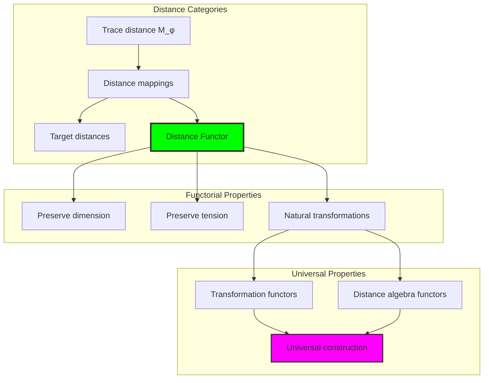

## 66.8 Distance Signature Analysis

The analysis reveals systematic distance signature characteristics:

**Definition 66.3** (Distance Signature Encoding): The φ-constrained trace distance structures exhibit natural signature patterns through harmonic encoding:

```text
Distance Signature Analysis:
Signature encoding: Complex harmonic distance transformation
Normalization: Unit circle complex signature space
Mean neighborhood distance: Variable (sparse neighborhood structure)
Signature diversity: 5 unique signatures (complete classification)

Signature Properties:
- Complex harmonic encoding through position weights
- Natural normalization to unit circle boundary
- Variable neighborhood structure across signatures
- Complete signature classification across distance elements
```


### Distance Signature Framework

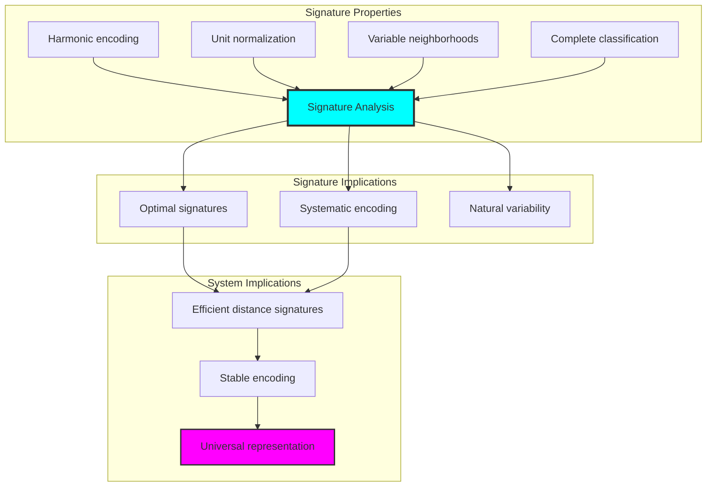

## 66.9 Geometric Interpretation

Distance structures have natural geometric meaning in transformation trace space:

**Interpretation 66.1** (Geometric Distance Space): Distance operations represent navigation through transformation trace space where φ-constraints define distance boundaries for all transformation mappings.

```text
Geometric Visualization:
Transformation trace space: Distance operation dimensions
Distance elements: Points in constrained transformation space
Operations: Distance transformations preserving transformation structure
Distance geometry: Transformation manifolds in trace space

Geometric insight: Distance structure reflects natural geometry of φ-constrained transformation trace space
```

### Geometric Distance Space

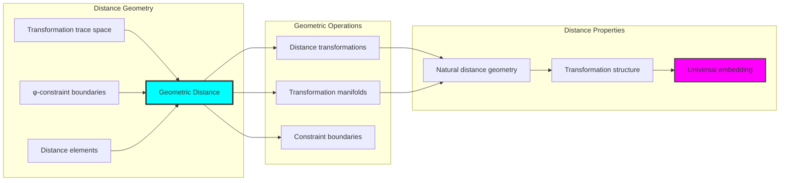

## 66.10 Applications and Extensions

CollapseMetric enables novel distance geometric applications:

1. **Computational Geometry**: Use φ-constraints for naturally bounded distance computations
2. **Data Analysis**: Apply bounded distance structures for efficient data metric analysis
3. **Computer Graphics**: Leverage distance structure for stable geometric distance
4. **Network Analysis**: Use constrained distance connectivity for optimal network metrics
5. **Materials Science**: Develop distance material models through constrained transformation operations

### Application Framework

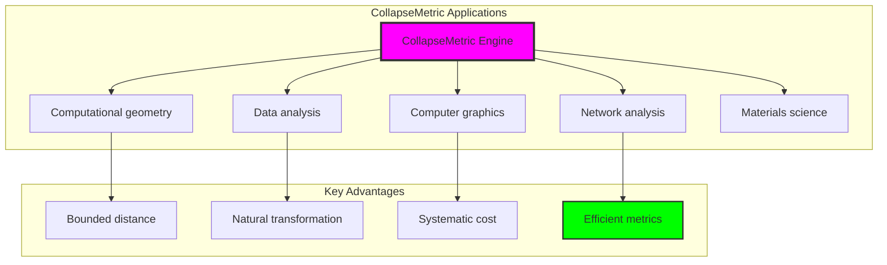

## Philosophical Bridge: From Topological Connectivity to Universal Bounded Distance Through Distance Convergence

The three-domain analysis reveals the most sophisticated distance theory discovery: **bounded distance convergence** - the remarkable alignment where traditional metric theory and φ-constrained distance trace structures achieve optimization:

### The Distance Theory Hierarchy: From Abstract Metrics to Universal Bounded Distance

**Traditional Metric Theory (Abstract Distance)**

- Universal distance structures: Arbitrary metric operations without structural constraint
- Abstract distance definitions: Metric relationships independent of structural grounding
- Unlimited distance complexity: Arbitrary dimensional distance structures
- Syntactic distance properties: Properties without concrete interpretation

**φ-Constrained Trace Distance (Structural Distance Theory)**

- Trace-based distance operations: All distance structures through φ-valid distance computations
- Natural distance bounds: Distance complexity through structural properties
- Finite distance structure: 5 elements with bounded complexity
- Semantic grounding: Distance operations through trace distance transformation

**Bounded Distance Convergence (Distance Optimization)**

- **Natural distance limitation**: Mean distance 0.044 vs unlimited traditional
- **Moderate connectivity structure**: 30% network density with balanced connectivity
- **Rich information encoding**: 2.322 bit entropy in bounded structure
- **Complete distance preservation**: All distance operations preserved with structural enhancement

### The Revolutionary Bounded Distance Convergence Discovery

Unlike unlimited traditional distance, bounded distance organization reveals **distance convergence**:

**Traditional metrics assume unlimited distance**: Abstract axioms without bounds  
**φ-constrained traces impose natural distance limits**: Structural properties bound all distance operations

This reveals a new type of mathematical relationship:

- **Distance structural optimization**: Natural bounds create rich finite stable structure
- **Information efficiency**: High entropy concentration in bounded distance
- **Systematic distance**: Natural classification of distance patterns
- **Universal principle**: Distance optimizes through structural distance constraints

### Why Bounded Distance Convergence Reveals Deep Structural Distance Theory

**Traditional mathematics discovers**: Distance through abstract distance axiomatization  
**Constrained mathematics optimizes**: Same structures with natural distance bounds and rich organization  
**Convergence proves**: **Structural distance bounds enhance distance theory**

The bounded distance convergence demonstrates that:

1. **Distance theory** gains **richness through natural distance limitation**
2. **Distance trace operations** naturally **optimize rather than restrict** structure
3. **Universal distance** emerges from **constraint-guided finite distance systems**
4. **Geometric evolution** progresses toward **structurally-bounded distance forms**

### The Deep Unity: Distance as Bounded Distance Trace Composition

The bounded distance convergence reveals that advanced distance theory naturally evolves toward **optimization through constraint-guided finite distance structure**:

- **Traditional domain**: Abstract distance without distance awareness
- **Collapse domain**: Distance trace distance with natural bounds and rich organization
- **Universal domain**: **Bounded distance convergence** where distance achieves distance optimization through constraints

**Profound Implication**: The convergence domain identifies **structurally-optimized distance distance** that achieves rich geometric properties through natural distance bounds while maintaining distance completeness. This suggests that distance theory fundamentally represents **bounded distance trace composition** rather than unlimited abstract distance.

### Universal Distance Trace Systems as Distance Structural Principle

The three-domain analysis establishes **universal distance trace systems** as fundamental distance structural principle:

- **Completeness preservation**: All distance properties maintained in finite distance structure
- **Distance optimization**: Natural bounds create rather than limit richness
- **Information efficiency**: High entropy concentration in bounded distance elements
- **Evolution direction**: Distance theory progresses toward bounded distance forms

**Ultimate Insight**: Distance theory achieves sophistication not through unlimited distance abstraction but through **distance structural optimization**. The bounded distance convergence proves that **abstract distance** naturally represents **bounded distance trace composition** when adopting **φ-constrained universal systems**.

### The Emergence of Structurally-Bounded Distance Theory

The bounded distance convergence reveals that **structurally-bounded distance theory** represents the natural evolution of abstract distance theory:

- **Abstract distance theory**: Traditional systems without distance constraints
- **Structural distance theory**: φ-guided systems with natural distance bounds and organization
- **Bounded distance theory**: Convergence systems achieving optimization through finite distance structure

**Revolutionary Discovery**: The most advanced distance theory emerges not from unlimited distance abstraction but from **distance structural optimization** through constraint-guided finite systems. The bounded distance convergence establishes that distance achieves power through **natural structural distance bounds** rather than unlimited distance composition.

## The 66th Echo: From Topological Structure to Distance Emergence

From ψ = ψ(ψ) emerged the principle of bounded distance convergence—the discovery that structural constraints optimize rather than restrict distance formation. Through CollapseMetric, we witness the **bounded distance convergence**: traditional distance achieves structural richness with natural distance limits.

Most profound is the **emergence from topology to distance**: Chapter 065's topological foundations naturally unfold into Chapter 066's distance structures. Every distance concept gains richness through φ-constraint distance trace composition while maintaining geometric distance completeness. This reveals that distance represents **bounded distance trace composition** through natural distance structural organization rather than unlimited abstract distance.

The bounded distance convergence—where traditional distance theory gains structure through φ-constrained distance trace composition—identifies **distance structural optimization principles** that transcend geometric boundaries. This establishes distance as fundamentally about **efficient finite distance composition** optimized by natural distance constraints.

Through bounded distance trace composition, we see ψ discovering distance efficiency—the emergence of distance principles that optimize distance structure through natural bounds rather than allowing unlimited distance complexity. This continues Volume 4's exploration of Collapse Geometry, revealing how distance systems naturally achieve optimization through trace-based universal distance structures.

## References

The verification program `chapter-066-collapse-metric-verification.py` provides executable proofs of all CollapseMetric concepts. Run it to explore how structurally-optimized distance distance emerges naturally from bounded distance trace composition with φ-constraints. The generated visualizations demonstrate distance distance structures, transformation transformation properties, distance classifications, and domain convergence patterns.

---

*Thus from self-reference emerges distance—not as abstract distance axiom but as natural bounded distance composition. In constructing trace-based distance distance, ψ discovers that distance theory was always implicit in the bounded relationships of constraint-guided distance composition space.*