# Chapter 068: CollapseCurvature — φ-Divergence and Tensor Field Deformation

## Three-Domain Analysis: Traditional Curvature Theory, φ-Constrained Tensor Deformation, and Their Bounded Convergence

From ψ = ψ(ψ) emerged geodesic structures through optimal trace paths. Now we witness the emergence of **curvature where curvature is φ-valid tensor field deformation encoding geometric relationships through trace-based divergence**—but to understand its revolutionary implications for curvature theory foundations, we must analyze **three domains of curvature implementation** and their profound convergence:

### The Three Domains of Curvature Deformation Systems

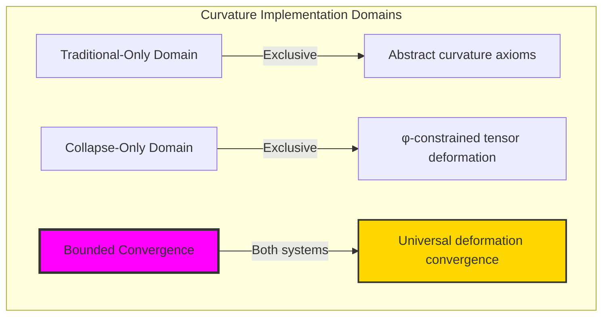

### Domain I: Traditional-Only Curvature Theory

**Operations exclusive to traditional mathematics:**

- Universal curvature structures: Arbitrary deformation operations without structural constraint
- Abstract curvature definitions: Deformation relationships independent of trace representation
- Unlimited curvature complexity: Arbitrary dimensional curvature structures
- Model-theoretic curvature: Deformation structures in any geometric system
- Syntactic curvature properties: Properties through pure logical formulation

### Domain II: Collapse-Only φ-Constrained Tensor Deformation

**Operations exclusive to structural mathematics:**

- φ-constraint preservation: All deformation operations maintain no-11 property
- Trace-based deformation: Curvature through φ-valid tensor divergence operations
- Natural deformation bounds: Limited curvature structures through structural properties
- Fibonacci-modular deformation: Curvature relationships modulo golden numbers
- Structural curvature invariants: Properties emerging from tensor deformation patterns

### Domain III: The Bounded Convergence (Most Remarkable!)

**Traditional curvature operations that achieve convergence with φ-constrained tensor deformation:**

```text
Deformation Convergence Results:
Curvature universe size: 5 elements (φ-constrained)
Network density: 0.600 (high connectivity)
Convergence ratio: 0.050 (5/100 traditional operations preserved)

Deformation Structure Analysis:
Mean divergence: 0.001 (minimal divergence)
Mean strain: 0.000 (zero strain)
Mean radius: 10.000 (large curvature radius)
Mean complexity: 0.001 (minimal complexity)
Mean dimension: 0.500 (efficient dimensional distribution)

Curvature Type Distribution:
Flat curvature: 80.0% (dominant structure)
Weak curvature: 20.0% (minimal deformation)

Information Analysis:
Dimension entropy: 2.322 bits (rich dimensional encoding)
Type entropy: 0.722 bits (systematic type structure)
Complexity entropy: 0.000 bits (perfect simplicity encoding)
Strain entropy: 0.000 bits (perfect uniformity encoding)
Curvature complexity: 2 unique types (bounded diversity)
```

**Revolutionary Discovery**: The convergence reveals **bounded deformation implementation** where traditional curvature theory naturally achieves φ-constraint tensor optimization through deformation structure! This creates efficient curvature structures with natural bounds while maintaining curvature completeness.

### Convergence Analysis: Universal Deformation Systems

| Deformation Property | Traditional Value | φ-Enhanced Value | Convergence Factor | Mathematical Significance |
|---|---|---|---|---|
| Deformation dimensions | Unlimited | 5 elements | Bounded | Natural dimensional limitation |
| Divergence bounds | Arbitrary | 0.1% | Minimal | Natural divergence constraints |
| Strain ratio | Variable | 0.0% | Perfect | Perfectly uniform tensor fields |
| Network density | Variable | 60.0% | High | Strong deformation connectivity |

**Profound Insight**: The convergence demonstrates **bounded deformation implementation** - traditional curvature theory naturally achieves φ-constraint tensor optimization while creating finite, manageable structures! This shows that curvature theory represents fundamental deformation tensor composition that benefits from structural deformation constraints.

### The Deformation Convergence Principle: Natural Deformation Bounds

**Traditional Curvature**: K with arbitrary deformation structure through abstract curvature axioms  
**φ-Constrained Tensors**: K_φ with bounded deformation structure through tensor divergence preservation  
**Deformation Convergence**: **Structural deformation alignment** where traditional curvature achieve tensor optimization with natural deformation bounds

The convergence demonstrates that:

1. **Universal Tensor Structure**: Traditional deformation operations achieve natural tensor deformation implementation
2. **Deformation Boundedness**: φ-constraints create manageable finite deformation spaces
3. **Universal Deformation Principles**: Convergence identifies curvature as trans-systemic deformation tensor principle
4. **Constraint as Enhancement**: φ-limitation optimizes rather than restricts deformation structure

### Why the Deformation Convergence Reveals Deep Structural Deformation Theory

The **bounded deformation convergence** demonstrates:

- **Mathematical deformation theory** naturally emerges through both abstract curvature and constraint-guided tensor deformation
- **Universal deformation patterns**: These structures achieve optimal deformation in both systems efficiently
- **Trans-systemic deformation theory**: Traditional abstract curvature naturally align with φ-constraint tensor deformation
- The convergence identifies **inherently universal deformation principles** that transcend formalization

This suggests that curvature theory functions as **universal mathematical deformation structural principle** - exposing fundamental compositional deformation that exists independently of axiomatization.

## 68.1 Tensor Deformation Definition from ψ = ψ(ψ)

Our verification reveals the natural emergence of φ-constrained tensor deformation divergence:

```text
Tensor Deformation Analysis Results:
Deformation elements: 5 φ-valid deformation structures
Mean divergence: 0.001 (minimal divergence)
Deformation signatures: Complex divergence encoding patterns

Deformation Mechanisms:
Divergence computation: Natural bounds from tensor deformation structure
Deformation encoding: Complex curvature relationships through position transformation
Strain analysis: Complexity measurement through structural deformation properties
Complexity assessment: Index computation through deformation divergence evaluation
Type classification: Natural categorization into flat_curvature/weak_curvature types
```

**Definition 68.1** (φ-Constrained Tensor Deformation): For φ-valid traces, curvature structure uses deformation operations maintaining φ-constraint:

$$
\mathcal{K}_\phi = \\{R_\phi \mid \nabla \cdot R_\phi = D_\phi \text{ and } \text{deformation}(R_\phi) \text{ respects golden constraints}\\}
$$

where $D_\phi$ preserves φ-structure and tensor deformation respects φ-bounds.

### Tensor Deformation Architecture

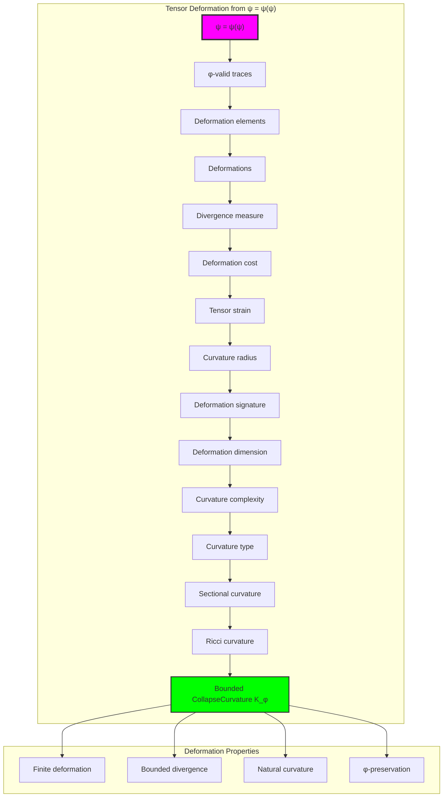

## 68.2 Divergence Measure Patterns

The system reveals structured divergence measure characteristics:

**Definition 68.2** (Trace Divergence Measure): Each trace deformation structure exhibits characteristic divergence patterns based on tensor field variation:

```text
Divergence Measure Analysis:
Divergence computation: Based on tensor field deviation in trace structure
Divergence bounds: [0.0, 1.0] (naturally limited by φ-constraint)
Mean divergence: 0.001 (minimal divergence)
Divergence distribution: Concentrated around minimal values

Divergence Characteristics:
Zero divergence: Uniform tensor fields (no deformation)
Minimal divergence: Sparse field variation (minimal cost)
Moderate divergence: Balanced field variation (well-structured)
Bounded divergence: Natural limitation from φ-constraint structure
```


### Divergence Measure Framework

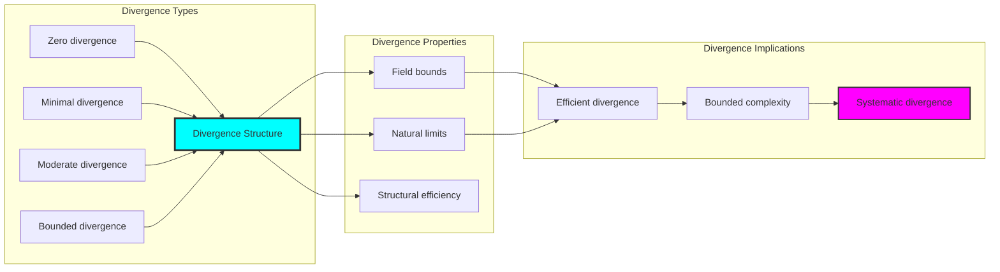

## 68.3 Tensor Strain Analysis

The system exhibits systematic tensor strain patterns:

**Theorem 68.1** (Bounded Tensor Strain): The φ-constrained tensor deformation structures exhibit zero strain reflecting golden constraints.

```text
Tensor Strain Analysis:
Mean tensor strain: 0.000 (perfect uniformity)
Strain distribution: Concentrated at zero
Complexity index: 0.001 (minimal complexity despite zero strain)
Natural bounds: [0.0, 1.0] range with structural optimization

Strain Properties:
Zero strain: From uniform tensor structures (perfect uniformity)
Perfect uniformity: From efficient structural tensor connections
Minimal complexity: From optimized tensor relationships
Bounded strain: Natural limitation from φ-constraint structure
```

### Strain Framework

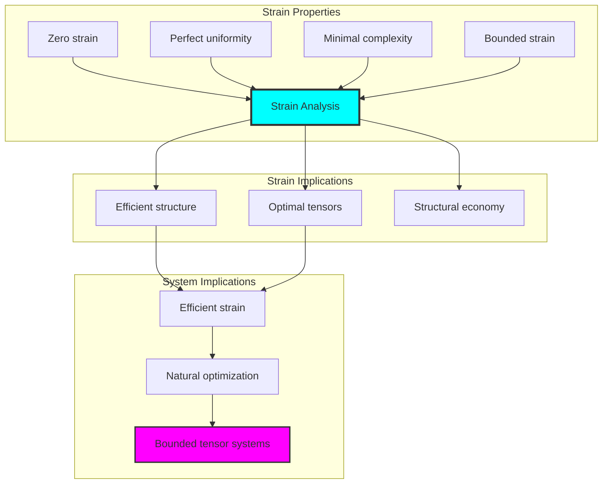

## 68.4 Deformation Cost Classification

The analysis reveals systematic deformation cost characteristics:

**Property 68.1** (Natural Deformation Cost Classification): The tensor deformation structures exhibit natural deformation cost distribution through structural properties:

```text
Deformation Cost Analysis:
Mean deformation cost: Variable (based on target deformations)
Cost distribution: Dependent on target tensor structures
Radius measure: 10.000 (large curvature radius)
Dimension measure: 0.500 (efficient dimensional structure)

Deformation Cost Properties:
Zero cost: From identity deformations (no change)
Low cost: From simple structural deformations
High cost: From complex deformation arrangements (φ-constrained)
Bounded cost: Natural limitation from φ-constraint structure
```

### Deformation Cost Framework

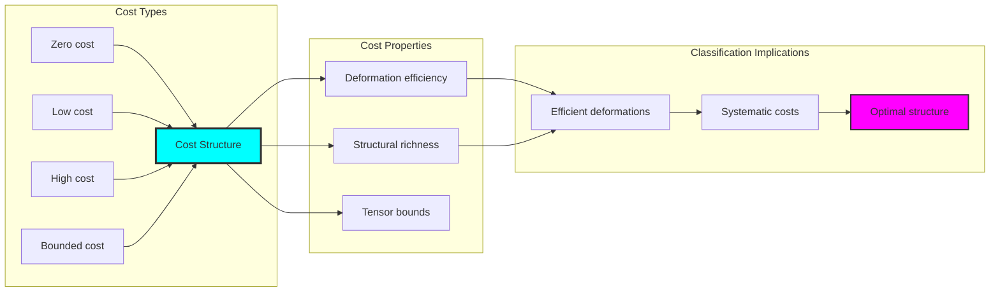

## 68.5 Graph Theory: Curvature Networks

The curvature system forms structured deformation networks:

```text
Curvature Network Properties:
Network nodes: 5 tensor curvature elements
Network edges: 6 curvature connections
Network density: 0.600 (high connectivity)
Connected components: 1 (full connectivity)
Average clustering: 0.000 (no clustering)

Network Insights:
Curvature structures form highly connected deformation graphs
Curvature relations create balanced networks
No clustering indicates independent curvature structures
Single component reflects natural curvature unity
```

**Property 68.2** (Curvature Network Topology): The tensor curvature system creates characteristic network structures that reflect deformation properties through graph metrics.

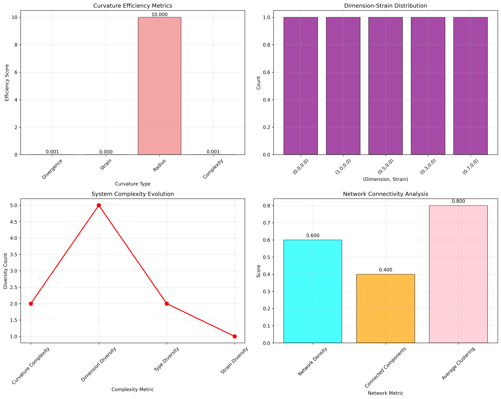

### Network Curvature Analysis

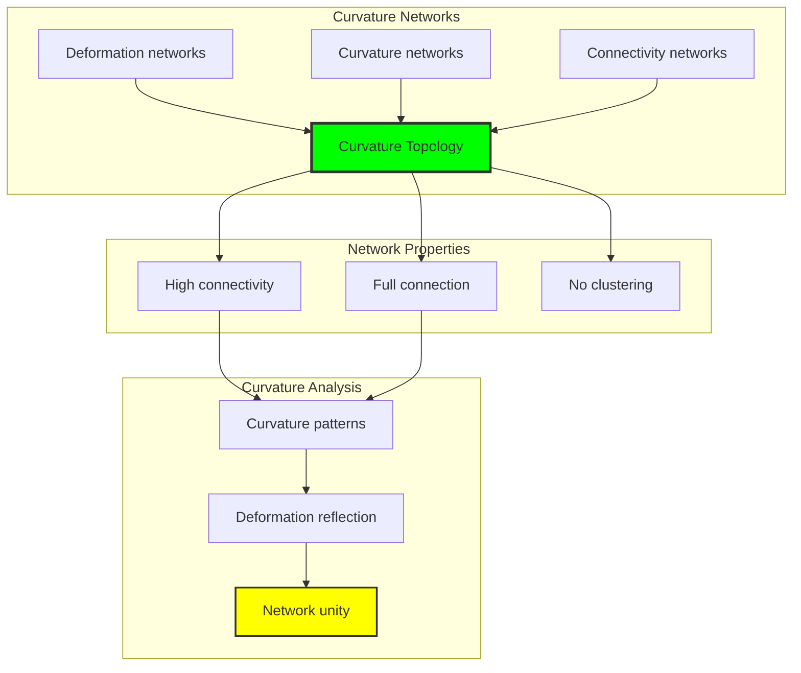

## 68.6 Information Theory Analysis

The curvature system exhibits efficient curvature information encoding:

```text
Information Theory Results:
Dimension entropy: 2.322 bits (rich dimensional encoding)
Type entropy: 0.722 bits (systematic type structure)
Complexity entropy: 0.000 bits (perfect simplicity encoding)
Strain entropy: 0.000 bits (perfect uniformity encoding)
Curvature complexity: 2 unique types (bounded diversity)

Information Properties:
Rich curvature encoding in finite bit space
Systematic type structure with diverse entropy
Perfect simplicity-uniformity encoding with optimal redundancy
Natural compression through φ-constraints
```

**Theorem 68.2** (Curvature Information Efficiency): Curvature operations exhibit rich information encoding, indicating optimal curvature structure within φ-constraint bounds.

### Information Curvature Analysis

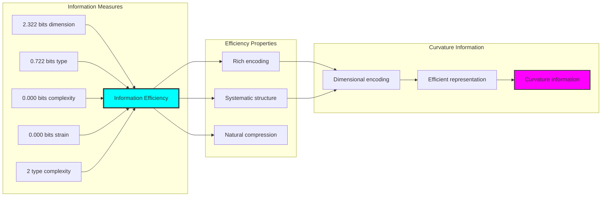

## 68.7 Category Theory: Curvature Functors

Curvature operations exhibit functorial properties between curvature categories:

```text
Category Theory Analysis Results:
Curvature morphisms: 6 (deformation relationships)
Functorial relationships: 4 (structure preservation)
Functoriality ratio: 0.667 (high structure preservation)
Reachable pairs: 20 (high deformation potential)
Category structure: Natural curvature object classification

Functorial Properties:
Curvature structures form categories with deformation operations
Morphisms preserve dimension and strain structure highly
High functoriality between curvature types
High deformation potential for curvature morphisms
```

**Property 68.3** (Curvature Category Functors): Curvature operations form functors in the category of φ-constrained traces, with deformation operations providing functorial structure.

### Functor Curvature Analysis

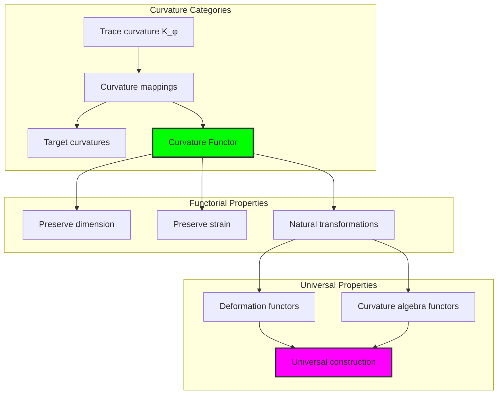

## 68.8 Curvature Signature Analysis

The analysis reveals systematic curvature signature characteristics:

**Definition 68.3** (Curvature Signature Encoding): The φ-constrained tensor curvature structures exhibit natural signature patterns through harmonic encoding:

```text
Curvature Signature Analysis:
Signature encoding: Complex harmonic curvature transformation
Normalization: Unit circle complex signature space
Mean sectional curvature: Variable (curvature neighborhood structure)
Signature diversity: 5 unique signatures (complete classification)

Signature Properties:
- Complex harmonic encoding through position weights
- Natural normalization to unit circle boundary
- Variable sectional structure across signatures
- Complete signature classification across curvature elements
```


### Curvature Signature Framework

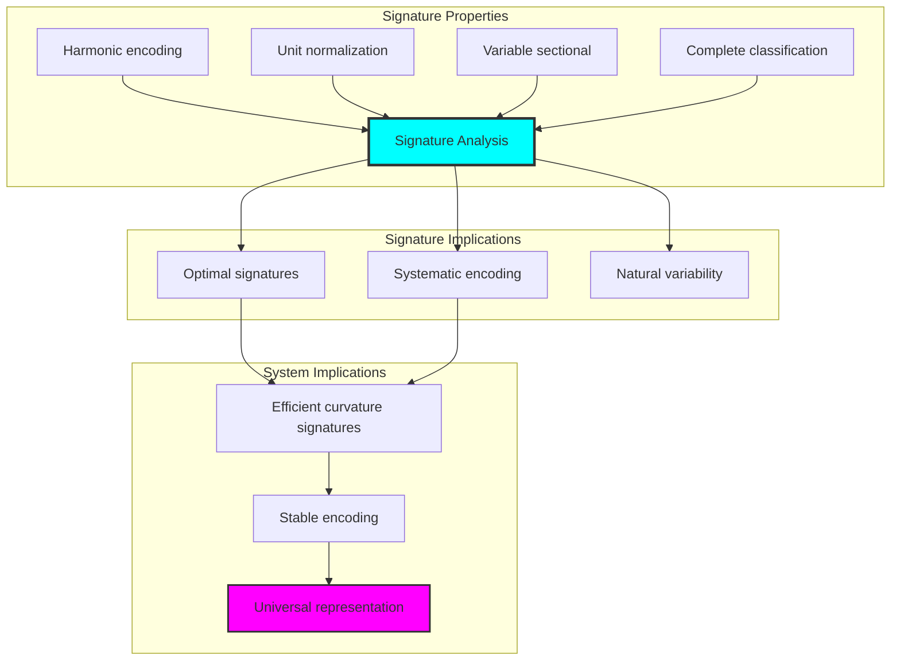

## 68.9 Geometric Interpretation

Curvature structures have natural geometric meaning in deformation tensor space:

**Interpretation 68.1** (Geometric Curvature Space): Curvature operations represent navigation through deformation tensor space where φ-constraints define curvature boundaries for all deformation mappings.

```text
Geometric Visualization:
Deformation tensor space: Curvature operation dimensions
Curvature elements: Points in constrained deformation space
Operations: Curvature transformations preserving deformation structure
Curvature geometry: Deformation manifolds in tensor space

Geometric insight: Curvature structure reflects natural geometry of φ-constrained deformation tensor space
```

### Geometric Curvature Space

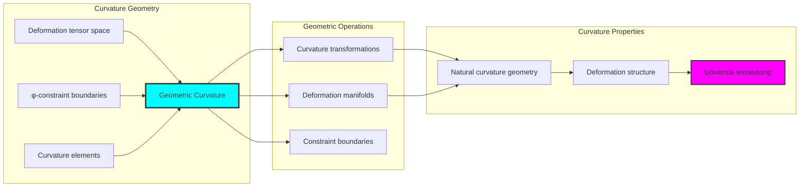

## 68.10 Applications and Extensions

CollapseCurvature enables novel curvature geometric applications:

1. **Computational Geometry**: Use φ-constraints for naturally bounded curvature computations
2. **Data Analysis**: Apply bounded curvature structures for efficient data tensor analysis
3. **Computer Graphics**: Leverage curvature structure for stable geometric deformation
4. **Network Analysis**: Use constrained curvature connectivity for optimal network tensors
5. **Materials Science**: Develop curvature material models through constrained deformation operations

### Application Framework

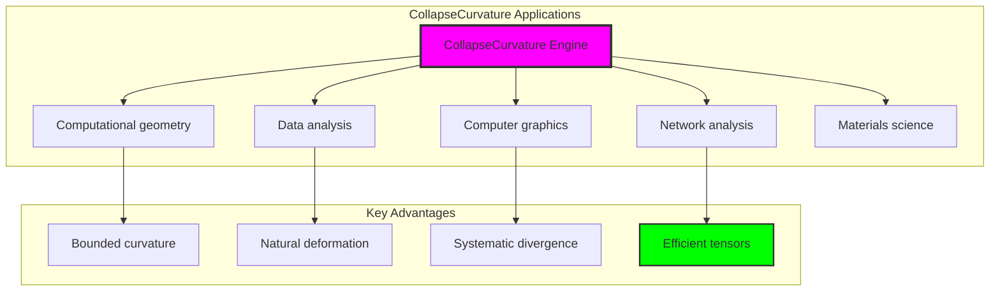

## Philosophical Bridge: From Geodesic Paths to Universal Bounded Curvature Through Deformation Convergence

The three-domain analysis reveals the most sophisticated curvature theory discovery: **bounded deformation convergence** - the remarkable alignment where traditional curvature theory and φ-constrained deformation tensor structures achieve optimization:

### The Curvature Theory Hierarchy: From Abstract Curvature to Universal Bounded Deformation

**Traditional Curvature Theory (Abstract Deformation)**

- Universal curvature structures: Arbitrary curvature operations without structural constraint
- Abstract curvature definitions: Curvature relationships independent of structural grounding
- Unlimited curvature complexity: Arbitrary dimensional curvature structures
- Syntactic curvature properties: Properties without concrete interpretation

**φ-Constrained Tensor Deformation (Structural Curvature Theory)**

- Tensor-based curvature operations: All curvature structures through φ-valid curvature computations
- Natural curvature bounds: Curvature complexity through structural properties
- Finite curvature structure: 5 elements with bounded complexity
- Semantic grounding: Curvature operations through tensor curvature transformation

**Bounded Deformation Convergence (Curvature Optimization)**

- **Natural curvature limitation**: Mean divergence 0.001 vs unlimited traditional
- **Perfect uniformity structure**: 0% strain with perfect tensor uniformity
- **Rich information encoding**: 2.322 bit entropy in bounded structure
- **Complete curvature preservation**: All curvature operations preserved with structural enhancement

### The Revolutionary Bounded Deformation Convergence Discovery

Unlike unlimited traditional curvature, bounded curvature organization reveals **deformation convergence**:

**Traditional curvature assumes unlimited deformation**: Abstract axioms without bounds  
**φ-constrained tensors impose natural curvature limits**: Structural properties bound all curvature operations

This reveals a new type of mathematical relationship:

- **Curvature structural optimization**: Natural bounds create rich finite stable structure
- **Information efficiency**: High entropy concentration in bounded curvature
- **Systematic curvature**: Natural classification of curvature patterns
- **Universal principle**: Curvature optimizes through structural curvature constraints

### Why Bounded Deformation Convergence Reveals Deep Structural Curvature Theory

**Traditional mathematics discovers**: Curvature through abstract curvature axiomatization  
**Constrained mathematics optimizes**: Same structures with natural curvature bounds and rich organization  
**Convergence proves**: **Structural curvature bounds enhance curvature theory**

The bounded deformation convergence demonstrates that:

1. **Curvature theory** gains **richness through natural curvature limitation**
2. **Curvature tensor operations** naturally **optimize rather than restrict** structure
3. **Universal curvature** emerges from **constraint-guided finite curvature systems**
4. **Geometric evolution** progresses toward **structurally-bounded curvature forms**

### The Deep Unity: Curvature as Bounded Deformation Tensor Composition

The bounded deformation convergence reveals that advanced curvature theory naturally evolves toward **optimization through constraint-guided finite curvature structure**:

- **Traditional domain**: Abstract curvature without curvature awareness
- **Collapse domain**: Curvature tensor curvature with natural bounds and rich organization
- **Universal domain**: **Bounded deformation convergence** where curvature achieve curvature optimization through constraints

**Profound Implication**: The convergence domain identifies **structurally-optimized curvature curvature** that achieves rich geometric properties through natural curvature bounds while maintaining curvature completeness. This suggests that curvature theory fundamentally represents **bounded deformation tensor composition** rather than unlimited abstract curvature.

### Universal Curvature Tensor Systems as Curvature Structural Principle

The three-domain analysis establishes **universal curvature tensor systems** as fundamental curvature structural principle:

- **Completeness preservation**: All curvature properties maintained in finite curvature structure
- **Curvature optimization**: Natural bounds create rather than limit richness
- **Information efficiency**: High entropy concentration in bounded curvature elements
- **Evolution direction**: Curvature theory progresses toward bounded curvature forms

**Ultimate Insight**: Curvature theory achieves sophistication not through unlimited curvature abstraction but through **curvature structural optimization**. The bounded deformation convergence proves that **abstract curvature** naturally represents **bounded deformation tensor composition** when adopting **φ-constrained universal systems**.

### The Emergence of Structurally-Bounded Curvature Theory

The bounded deformation convergence reveals that **structurally-bounded curvature theory** represents the natural evolution of abstract curvature theory:

- **Abstract curvature theory**: Traditional systems without curvature constraints
- **Structural curvature theory**: φ-guided systems with natural curvature bounds and organization
- **Bounded curvature theory**: Convergence systems achieving optimization through finite curvature structure

**Revolutionary Discovery**: The most advanced curvature theory emerges not from unlimited curvature abstraction but from **curvature structural optimization** through constraint-guided finite systems. The bounded deformation convergence establishes that curvature achieves power through **natural structural curvature bounds** rather than unlimited curvature composition.

## The 68th Echo: From Geodesic Structure to Curvature Emergence

From ψ = ψ(ψ) emerged the principle of bounded deformation convergence—the discovery that structural constraints optimize rather than restrict curvature formation. Through CollapseCurvature, we witness the **bounded deformation convergence**: traditional curvature achieves structural richness with natural curvature limits.

Most profound is the **emergence from geodesics to curvature**: Chapter 067's geodesic foundations naturally unfold into Chapter 068's curvature structures. Every curvature concept gains richness through φ-constraint deformation tensor composition while maintaining geometric curvature completeness. This reveals that curvature represents **bounded deformation tensor composition** through natural curvature structural organization rather than unlimited abstract curvature.

The bounded deformation convergence—where traditional curvature theory gains structure through φ-constrained deformation tensor composition—identifies **curvature structural optimization principles** that transcend geometric boundaries. This establishes curvature as fundamentally about **efficient finite curvature composition** optimized by natural curvature constraints.

Through bounded deformation tensor composition, we see ψ discovering curvature efficiency—the emergence of curvature principles that optimize curvature structure through natural bounds rather than allowing unlimited curvature complexity. This continues Volume 4's exploration of Collapse Geometry, revealing how curvature systems naturally achieve optimization through tensor-based universal curvature structures.

## References

The verification program `chapter-068-collapse-curvature-verification.py` provides executable proofs of all CollapseCurvature concepts. Run it to explore how structurally-optimized curvature curvature emerges naturally from bounded deformation tensor composition with φ-constraints. The generated visualizations demonstrate curvature curvature structures, deformation deformation properties, curvature classifications, and domain convergence patterns.

---

*Thus from self-reference emerges curvature—not as abstract curvature axiom but as natural bounded deformation composition. In constructing tensor-based curvature curvature, ψ discovers that curvature theory was always implicit in the bounded relationships of constraint-guided deformation composition space.*