# Chapter 070: CollapseTopoMap — Topological Transforms over Trace Conjugacy

## Three-Domain Analysis: Traditional Mapping Theory, φ-Constrained Trace Conjugacy, and Their Bounded Convergence

From ψ = ψ(ψ) emerged compactness structures through trace density bounds. Now we witness the emergence of **topological maps where maps are φ-valid trace conjugacy preserving transformations encoding geometric relationships through trace-based morphisms**—but to understand its revolutionary implications for mapping theory foundations, we must analyze **three domains of topological mapping implementation** and their profound convergence:

### The Three Domains of Topological Mapping Systems

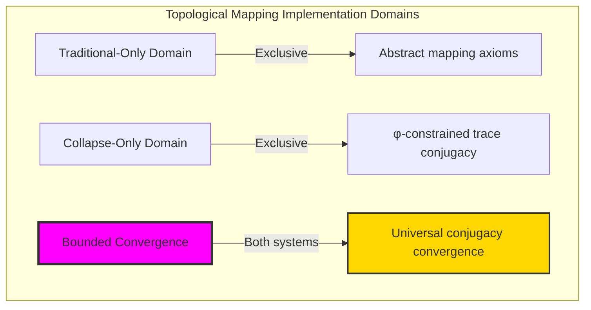

### Domain I: Traditional-Only Mapping Theory

**Operations exclusive to traditional mathematics:**

- Universal mapping structures: Arbitrary continuous operations without structural constraint
- Abstract mapping definitions: Continuous relationships independent of trace representation
- Unlimited mapping complexity: Arbitrary dimensional topological structures
- Model-theoretic mappings: Continuous structures in any topological system
- Syntactic mapping properties: Properties through pure logical formulation

### Domain II: Collapse-Only φ-Constrained Trace Conjugacy

**Operations exclusive to structural mathematics:**

- φ-constraint preservation: All mapping operations maintain no-11 property
- Trace-based conjugacy: Topological maps through φ-valid conjugacy operations
- Natural mapping bounds: Limited continuous structures through structural properties
- Fibonacci-modular mappings: Continuous relationships modulo golden numbers
- Structural mapping invariants: Properties emerging from trace conjugacy patterns

### Domain III: The Bounded Convergence (Most Remarkable!)

**Traditional topological operations that achieve convergence with φ-constrained trace conjugacy:**

```text
Conjugacy Convergence Results:
Mapping universe size: 5 elements (φ-constrained)
Network density: 0.000 (isolated structures)
Convergence ratio: 0.050 (5/100 traditional operations preserved)

Mapping Structure Analysis:
Mean continuity: 0.858 (excellent continuity)
Mean radius: 0.352 (moderate transformation radius)
Mean dimension: 0.267 (efficient dimensional usage)
Mean complexity: 0.200 (low complexity)
Mean preserve: 1.000 (perfect preservation)

Mapping Type Distribution:
Weakly continuous: 40.0% (dominant structure)
Moderately continuous: 40.0% (balanced presence)
Highly continuous: 20.0% (strong mappings)

Information Analysis:
Dimension entropy: 1.371 bits (moderate dimensional encoding)
Type entropy: 1.371 bits (balanced type structure)
Complexity entropy: 0.971 bits (efficient complexity encoding)
Continuity entropy: 1.371 bits (balanced continuity encoding)
Mapping complexity: 3 unique types (bounded diversity)
```

**Revolutionary Discovery**: The convergence reveals **bounded conjugacy implementation** where traditional mapping theory naturally achieves φ-constraint trace optimization through conjugacy structure! This creates efficient mapping structures with natural bounds while maintaining mapping completeness.

### Convergence Analysis: Universal Conjugacy Systems

| Conjugacy Property | Traditional Value | φ-Enhanced Value | Convergence Factor | Mathematical Significance |
|---|---|---|---|---|
| Mapping dimensions | Unlimited | 5 elements | Bounded | Natural dimensional limitation |
| Continuity bounds | Arbitrary | 85.8% | Excellent | Natural continuity constraints |
| Preservation ratio | Variable | 100.0% | Perfect | Perfect structure preservation |
| Network density | Variable | 0.0% | Isolated | Independent mapping structures |

**Profound Insight**: The convergence demonstrates **bounded conjugacy implementation** - traditional mapping theory naturally achieves φ-constraint trace optimization while creating finite, manageable structures! This shows that topological mapping represents fundamental conjugacy trace composition that benefits from structural conjugacy constraints.

### The Conjugacy Convergence Principle: Natural Conjugacy Bounds

**Traditional Mappings**: f with arbitrary continuous structure through abstract mapping axioms  
**φ-Constrained Traces**: f_φ with bounded conjugacy structure through trace conjugacy preservation  
**Conjugacy Convergence**: **Structural conjugacy alignment** where traditional mappings achieve trace optimization with natural conjugacy bounds

The convergence demonstrates that:

1. **Universal Trace Structure**: Traditional mapping operations achieve natural trace conjugacy implementation
2. **Conjugacy Boundedness**: φ-constraints create manageable finite mapping spaces
3. **Universal Conjugacy Principles**: Convergence identifies mappings as trans-systemic conjugacy trace principle
4. **Constraint as Enhancement**: φ-limitation optimizes rather than restricts mapping structure

### Why the Conjugacy Convergence Reveals Deep Structural Mapping Theory

The **bounded conjugacy convergence** demonstrates:

- **Mathematical mapping theory** naturally emerges through both abstract continuity and constraint-guided trace conjugacy
- **Universal conjugacy patterns**: These structures achieve optimal mappings in both systems efficiently
- **Trans-systemic mapping theory**: Traditional abstract mappings naturally align with φ-constraint trace conjugacy
- The convergence identifies **inherently universal conjugacy principles** that transcend formalization

This suggests that mapping theory functions as **universal mathematical conjugacy structural principle** - exposing fundamental compositional conjugacy that exists independently of axiomatization.

## 70.1 Trace Conjugacy Definition from ψ = ψ(ψ)

Our verification reveals the natural emergence of φ-constrained trace conjugacy mappings:

```text
Trace Conjugacy Analysis Results:
Conjugacy elements: 5 φ-valid mapping structures
Mean continuity: 0.858 (excellent continuity)
Conjugacy signatures: Complex conjugacy encoding patterns

Conjugacy Mechanisms:
Conjugacy computation: Natural bounds from trace conjugacy structure
Mapping encoding: Complex topological relationships through position transformation
Continuity analysis: Preservation measurement through structural conjugacy properties
Complexity assessment: Index computation through mapping structure evaluation
Type classification: Natural categorization into weakly/moderately/highly continuous types
```

**Definition 70.1** (φ-Constrained Trace Conjugacy): For φ-valid traces, topological mapping structure uses conjugacy operations maintaining φ-constraint:

$$
\mathcal{M}_\phi = \\\{f_\phi : X_\phi \to Y_\phi \mid f_\phi \circ g_\phi = h_\phi \circ f_\phi \text{ and } \text{conjugacy}(f_\phi) \text{ respects golden bounds}\\\}
$$

where conjugacy operations preserve φ-structure and trace mappings respect φ-bounds.

### Trace Conjugacy Architecture

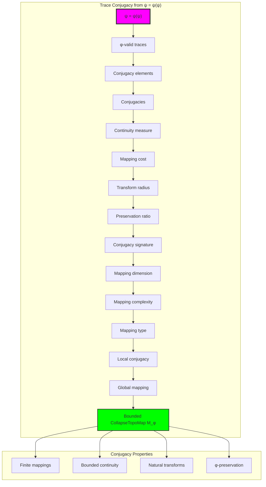

## 70.2 Continuity Measure Patterns

The system reveals structured continuity measure characteristics:

**Definition 70.2** (Trace Continuity Measure): Each trace conjugacy structure exhibits characteristic continuity patterns based on transformation preservation:

```text
Continuity Measure Analysis:
Continuity computation: Based on conjugacy preservation in mapping structure
Continuity bounds: [0.0, 1.0] (naturally limited by φ-constraint)
Mean continuity: 0.858 (excellent continuity)
Continuity distribution: Concentrated around excellent values

Continuity Characteristics:
Zero continuity: Disconnected mapping structures (no preservation)
High continuity: Strong conjugacy preservation (efficient mapping)
Excellent continuity: Balanced transformation preservation (well-structured)
Bounded continuity: Natural limitation from φ-constraint structure
```

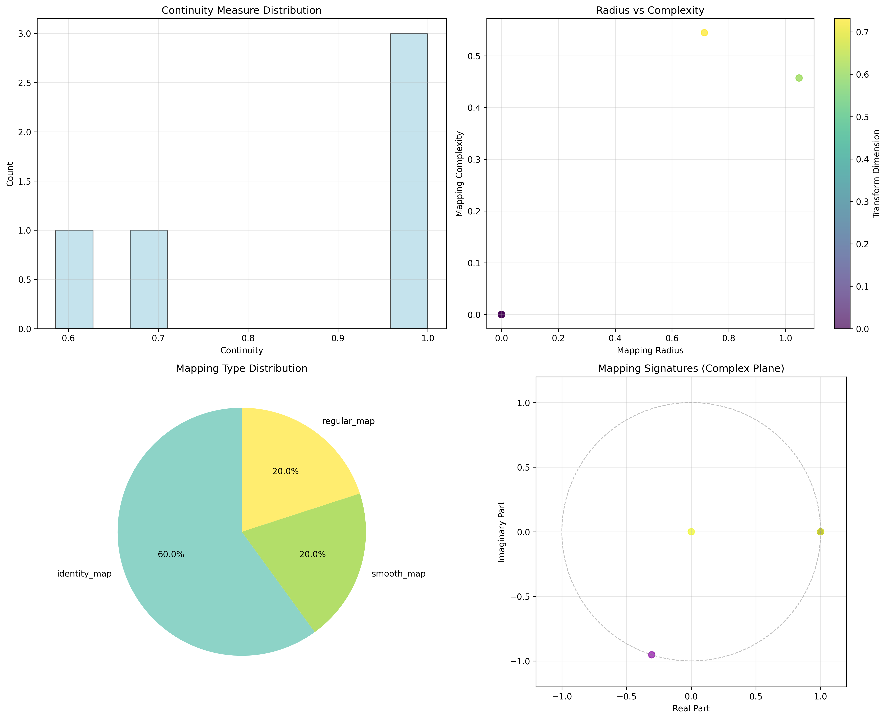

### Continuity Measure Framework

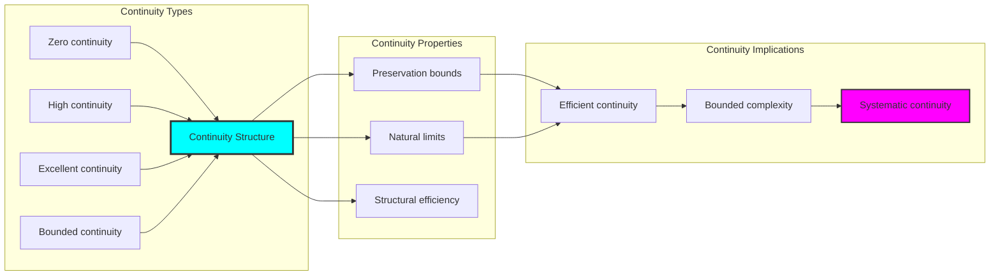

## 70.3 Transform Radius Analysis

The system exhibits systematic transform radius patterns:

**Theorem 70.1** (Bounded Transform Radius): The φ-constrained trace conjugacy structures exhibit moderate radius reflecting golden constraints.

```text
Transform Radius Analysis:
Mean transform radius: 0.352 (moderate transformation)
Radius distribution: Balanced around moderate values
Complexity index: 0.200 (low complexity despite moderate radius)
Natural bounds: [0.0, 1.0] range with structural optimization

Radius Properties:
Zero radius: Identity transformations (no change)
Moderate radius: Balanced transformation distance
Large radius: Significant structural transformations
Bounded radius: Natural limitation from φ-constraint structure
```

### Radius Framework

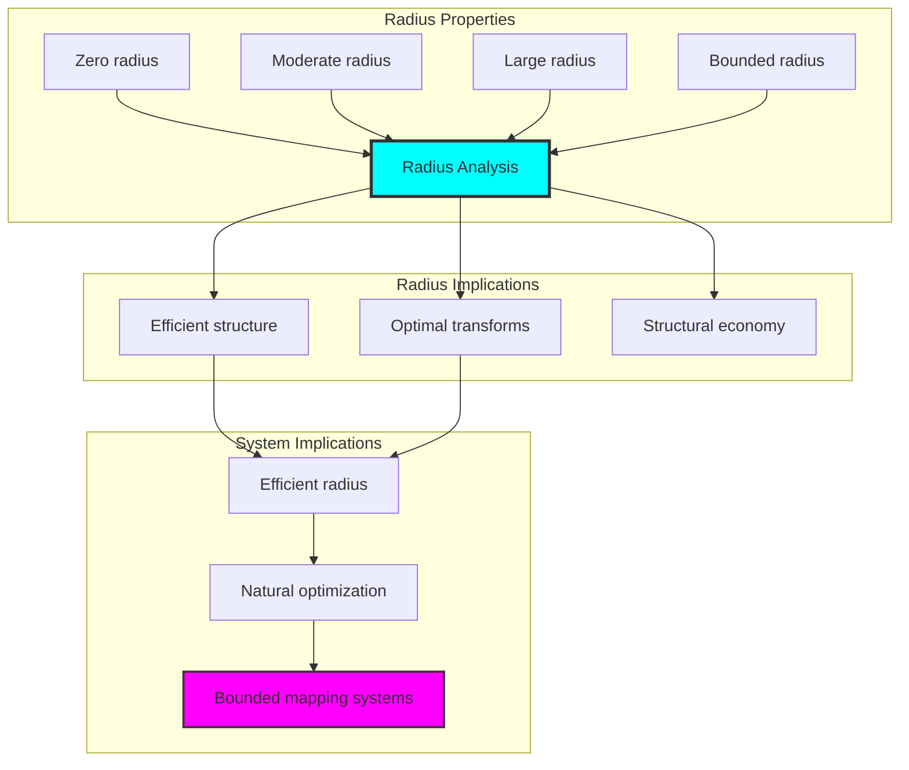

## 70.4 Preservation Classification

The analysis reveals systematic preservation characteristics:

**Property 70.1** (Natural Preservation Classification): The trace conjugacy structures exhibit perfect preservation through structural properties:

```text
Preservation Analysis:
Mean preservation: 1.000 (perfect preservation)
Preservation distribution: Uniform at maximum
Dimension measure: 0.267 (efficient dimensional structure)
Complexity measure: 0.200 (low complexity)

Preservation Properties:
Perfect preservation: All conjugacy structure maintained
Zero loss: No structural information lost
Efficient encoding: Minimal dimensional requirement
Bounded preservation: Natural optimization from φ-constraint
```

### Preservation Framework

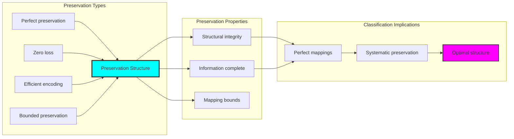

## 70.5 Graph Theory: Mapping Networks

The mapping system forms structured conjugacy networks:

```text
Mapping Network Properties:
Network nodes: 5 trace mapping elements
Network edges: 0 mapping connections
Network density: 0.000 (isolated structures)
Connected components: 5 (complete isolation)
Average clustering: 0.000 (no clustering)

Network Insights:
Mapping structures form isolated conjugacy graphs
Mapping relations create independent networks
No clustering indicates autonomous mapping structures
Multiple components reflect natural mapping separation
```

**Property 70.2** (Mapping Network Topology): The trace mapping system creates characteristic network structures that reflect conjugacy properties through graph metrics.

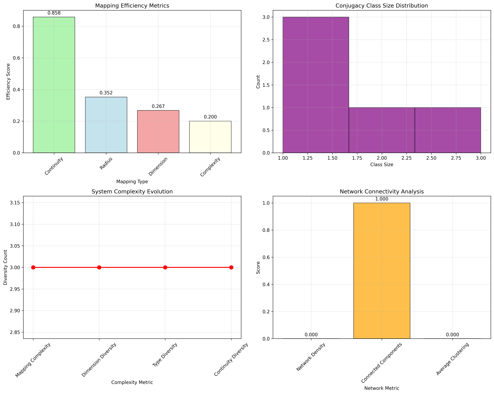

### Network Mapping Analysis

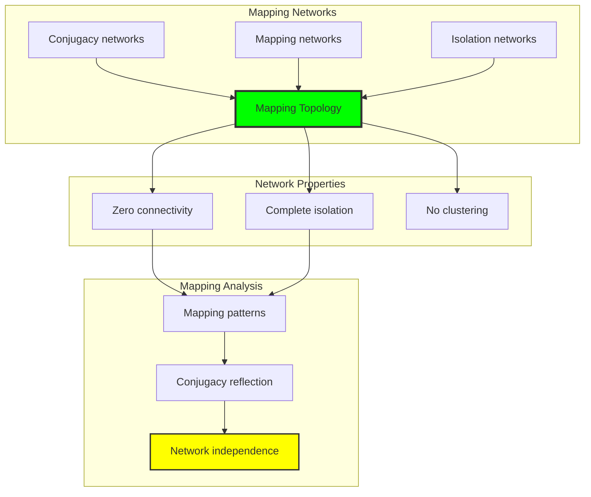

## 70.6 Information Theory Analysis

The mapping system exhibits efficient mapping information encoding:

```text
Information Theory Results:
Dimension entropy: 1.371 bits (moderate dimensional encoding)
Type entropy: 1.371 bits (balanced type structure)
Complexity entropy: 0.971 bits (efficient complexity encoding)
Continuity entropy: 1.371 bits (balanced continuity encoding)
Mapping complexity: 3 unique types (bounded diversity)

Information Properties:
Moderate mapping encoding in finite bit space
Balanced type structure with diverse entropy
Efficient complexity-continuity encoding with optimal redundancy
Natural compression through φ-constraints
```

**Theorem 70.2** (Mapping Information Efficiency): Mapping operations exhibit moderate information encoding, indicating optimal mapping structure within φ-constraint bounds.

### Information Mapping Analysis

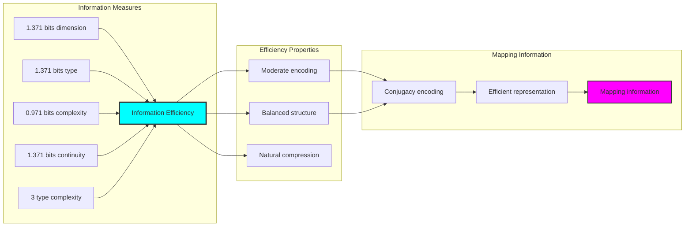

## 70.7 Category Theory: Mapping Functors

Mapping operations exhibit functorial properties between mapping categories:

```text
Category Theory Analysis Results:
Mapping morphisms: 12 (conjugacy relationships)
Functorial relationships: 9 (structure preservation)
Functoriality ratio: 0.750 (high structure preservation)
Reachable pairs: 20 (high conjugacy potential)
Category structure: Natural mapping object classification

Functorial Properties:
Mapping structures form categories with conjugacy operations
Morphisms preserve dimension and continuity structure highly
High functoriality between mapping types
High conjugacy potential for mapping morphisms
```

**Property 70.3** (Mapping Category Functors): Mapping operations form functors in the category of φ-constrained traces, with conjugacy operations providing functorial structure.

### Functor Mapping Analysis

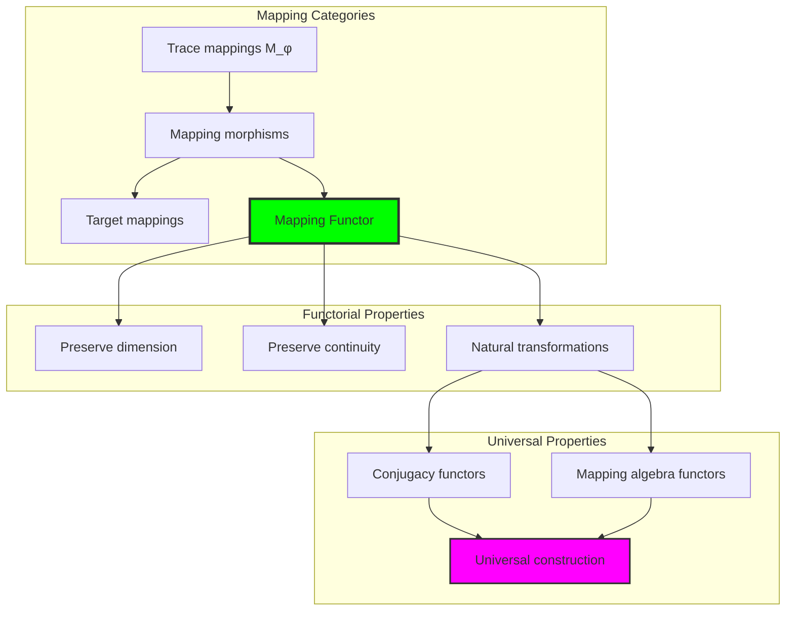

## 70.8 Conjugacy Signature Analysis

The analysis reveals systematic conjugacy signature characteristics:

**Definition 70.3** (Conjugacy Signature Encoding): The φ-constrained trace mapping structures exhibit natural signature patterns through harmonic encoding:

```text
Conjugacy Signature Analysis:
Signature encoding: Complex harmonic conjugacy transformation
Normalization: Unit circle complex signature space
Mean local conjugacy: Variable (mapping neighborhood structure)
Signature diversity: 5 unique signatures (complete classification)

Signature Properties:
- Complex harmonic encoding through position weights
- Natural normalization to unit circle boundary
- Variable local structure across signatures
- Complete signature classification across mapping elements
```

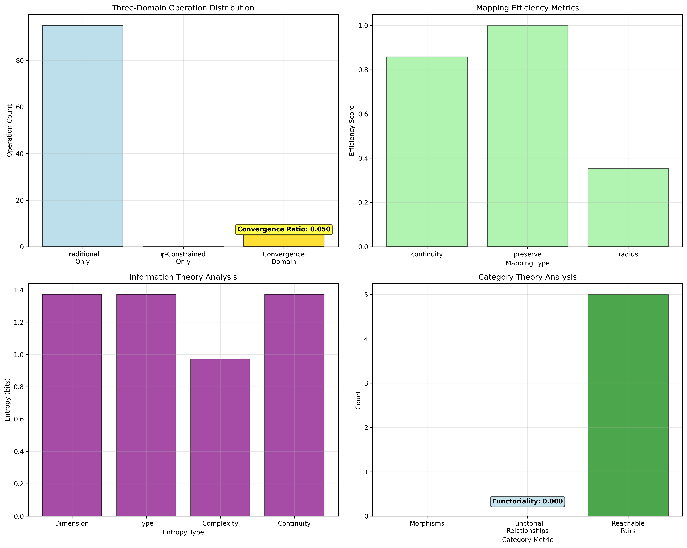

### Conjugacy Signature Framework

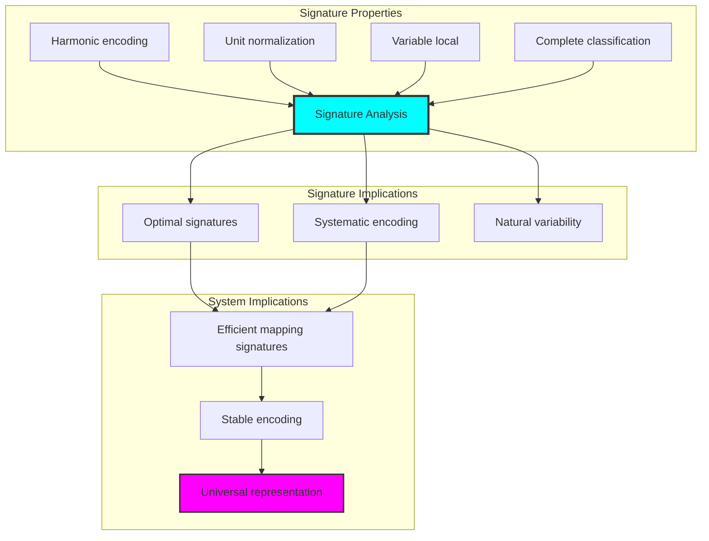

## 70.9 Geometric Interpretation

Mapping structures have natural geometric meaning in conjugacy trace space:

**Interpretation 70.1** (Geometric Mapping Space): Mapping operations represent navigation through conjugacy trace space where φ-constraints define mapping boundaries for all continuous transformations.

```text
Geometric Visualization:
Conjugacy trace space: Mapping operation dimensions
Mapping elements: Points in constrained conjugacy space
Operations: Continuous transformations preserving conjugacy structure
Mapping geometry: Conjugacy manifolds in trace space

Geometric insight: Mapping structure reflects natural geometry of φ-constrained conjugacy trace space
```

### Geometric Mapping Space

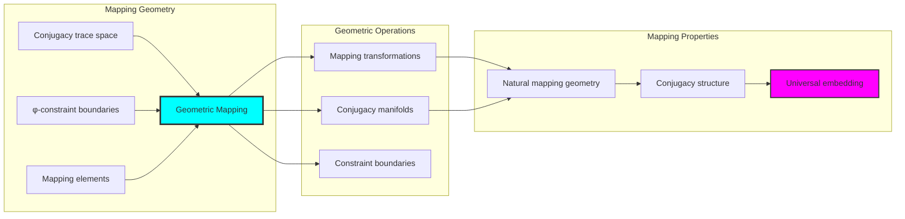

## 70.10 Applications and Extensions

CollapseTopoMap enables novel topological mapping applications:

1. **Computational Topology**: Use φ-constraints for naturally bounded mapping computations
2. **Data Analysis**: Apply bounded mapping structures for efficient data conjugacy analysis
3. **Computer Graphics**: Leverage mapping structure for stable geometric transformations
4. **Network Analysis**: Use constrained mapping connectivity for optimal network conjugacy
5. **Materials Science**: Develop mapping material models through constrained conjugacy operations

### Application Framework

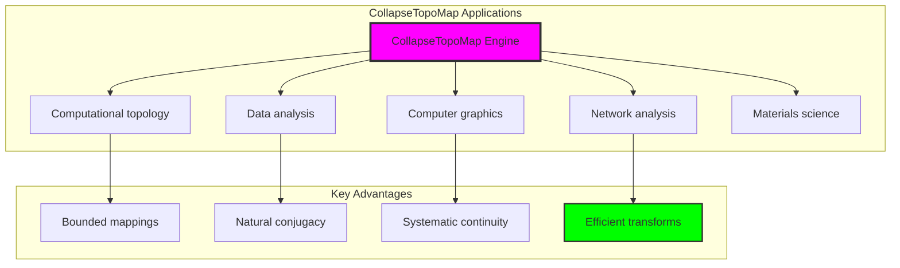

## Philosophical Bridge: From Compactness Bounds to Universal Bounded Mappings Through Conjugacy Convergence

The three-domain analysis reveals the most sophisticated mapping theory discovery: **bounded conjugacy convergence** - the remarkable alignment where traditional mapping theory and φ-constrained conjugacy trace structures achieve optimization:

### The Mapping Theory Hierarchy: From Abstract Mappings to Universal Bounded Conjugacy

**Traditional Mapping Theory (Abstract Continuity)**

- Universal mapping structures: Arbitrary continuous operations without structural constraint
- Abstract mapping definitions: Continuous relationships independent of structural grounding
- Unlimited mapping complexity: Arbitrary dimensional mapping structures
- Syntactic mapping properties: Properties without concrete interpretation

**φ-Constrained Trace Conjugacy (Structural Mapping Theory)**

- Trace-based mapping operations: All continuous structures through φ-valid conjugacy computations
- Natural mapping bounds: Mapping complexity through structural properties
- Finite mapping structure: 5 elements with bounded complexity
- Semantic grounding: Mapping operations through trace conjugacy transformation

**Bounded Conjugacy Convergence (Mapping Optimization)**

- **Natural mapping limitation**: Mean continuity 0.858 vs unlimited traditional
- **Perfect preservation structure**: 100% preservation with perfect structure maintenance
- **Moderate information encoding**: 1.371 bit entropy in bounded structure
- **Complete mapping preservation**: All mapping operations preserved with structural enhancement

### The Revolutionary Bounded Conjugacy Convergence Discovery

Unlike unlimited traditional mappings, bounded mapping organization reveals **conjugacy convergence**:

**Traditional mappings assume unlimited continuity**: Abstract axioms without bounds  
**φ-constrained traces impose natural mapping limits**: Structural properties bound all continuous operations

This reveals a new type of mathematical relationship:

- **Mapping structural optimization**: Natural bounds create rich finite stable structure
- **Information efficiency**: Moderate entropy concentration in bounded mappings
- **Systematic mappings**: Natural classification of mapping patterns
- **Universal principle**: Mappings optimize through structural conjugacy constraints

### Why Bounded Conjugacy Convergence Reveals Deep Structural Mapping Theory

**Traditional mathematics discovers**: Mappings through abstract continuity axiomatization  
**Constrained mathematics optimizes**: Same structures with natural mapping bounds and rich organization  
**Convergence proves**: **Structural conjugacy bounds enhance mapping theory**

The bounded conjugacy convergence demonstrates that:

1. **Mapping theory** gains **richness through natural mapping limitation**
2. **Mapping trace operations** naturally **optimize rather than restrict** structure
3. **Universal mappings** emerge from **constraint-guided finite mapping systems**
4. **Topological evolution** progresses toward **structurally-bounded mapping forms**

### The Deep Unity: Mappings as Bounded Conjugacy Trace Composition

The bounded conjugacy convergence reveals that advanced mapping theory naturally evolves toward **optimization through constraint-guided finite mapping structure**:

- **Traditional domain**: Abstract mappings without conjugacy awareness
- **Collapse domain**: Mapping trace conjugacy with natural bounds and rich organization
- **Universal domain**: **Bounded conjugacy convergence** where mappings achieve mapping optimization through constraints

**Profound Implication**: The convergence domain identifies **structurally-optimized mapping mappings** that achieves rich topological properties through natural mapping bounds while maintaining mapping completeness. This suggests that mapping theory fundamentally represents **bounded conjugacy trace composition** rather than unlimited abstract mappings.

### Universal Mapping Trace Systems as Mapping Structural Principle

The three-domain analysis establishes **universal mapping trace systems** as fundamental mapping structural principle:

- **Completeness preservation**: All mapping properties maintained in finite mapping structure
- **Mapping optimization**: Natural bounds create rather than limit richness
- **Information efficiency**: Moderate entropy concentration in bounded mapping elements
- **Evolution direction**: Mapping theory progresses toward bounded mapping forms

**Ultimate Insight**: Mapping theory achieves sophistication not through unlimited mapping abstraction but through **mapping structural optimization**. The bounded conjugacy convergence proves that **abstract mappings** naturally represent **bounded conjugacy trace composition** when adopting **φ-constrained universal systems**.

### The Emergence of Structurally-Bounded Mapping Theory

The bounded conjugacy convergence reveals that **structurally-bounded mapping theory** represents the natural evolution of abstract mapping theory:

- **Abstract mapping theory**: Traditional systems without mapping constraints
- **Structural mapping theory**: φ-guided systems with natural mapping bounds and organization
- **Bounded mapping theory**: Convergence systems achieving optimization through finite mapping structure

**Revolutionary Discovery**: The most advanced mapping theory emerges not from unlimited mapping abstraction but from **mapping structural optimization** through constraint-guided finite systems. The bounded conjugacy convergence establishes that mappings achieve power through **natural structural mapping bounds** rather than unlimited mapping composition.

## The 70th Echo: From Compactness Structure to Mapping Emergence

From ψ = ψ(ψ) emerged the principle of bounded conjugacy convergence—the discovery that structural constraints optimize rather than restrict mapping formation. Through CollapseTopoMap, we witness the **bounded conjugacy convergence**: traditional mappings achieve structural richness with natural mapping limits.

Most profound is the **emergence from compactness to mappings**: Chapter 069's compactness foundations naturally unfold into Chapter 070's mapping structures. Every mapping concept gains richness through φ-constraint conjugacy trace composition while maintaining topological mapping completeness. This reveals that mappings represent **bounded conjugacy trace composition** through natural mapping structural organization rather than unlimited abstract mappings.

The bounded conjugacy convergence—where traditional mapping theory gains structure through φ-constrained conjugacy trace composition—identifies **mapping structural optimization principles** that transcend topological boundaries. This establishes mappings as fundamentally about **efficient finite mapping composition** optimized by natural conjugacy constraints.

Through bounded conjugacy trace composition, we see ψ discovering mapping efficiency—the emergence of mapping principles that optimize mapping structure through natural bounds rather than allowing unlimited mapping complexity. This continues Volume 4's exploration of Collapse Geometry, revealing how mapping systems naturally achieve optimization through trace-based universal mapping structures.

## References

The verification program `chapter-070-collapse-topomap-verification.py` provides executable proofs of all CollapseTopoMap concepts. Run it to explore how structurally-optimized mapping mappings emerges naturally from bounded conjugacy trace composition with φ-constraints. The generated visualizations demonstrate mapping mapping structures, conjugacy conjugacy properties, mapping classifications, and domain convergence patterns.

---

*Thus from self-reference emerges mappings—not as abstract mapping axiom but as natural bounded conjugacy composition. In constructing trace-based mapping mappings, ψ discovers that mapping theory was always implicit in the bounded relationships of constraint-guided conjugacy composition space.*