# Chapter 071: BoundaryCollapse — Structural Frontiers and Observer-Relative Shells

## Three-Domain Analysis: Traditional Boundary Theory, φ-Constrained Trace Frontiers, and Their Bounded Convergence

From ψ = ψ(ψ) emerged topological mappings through trace conjugacy. Now we witness the emergence of **boundaries where boundaries are φ-valid trace frontiers encoding geometric relationships through trace-based shells**—but to understand its revolutionary implications for boundary theory foundations, we must analyze **three domains of boundary implementation** and their profound convergence:

### The Three Domains of Boundary Frontier Systems

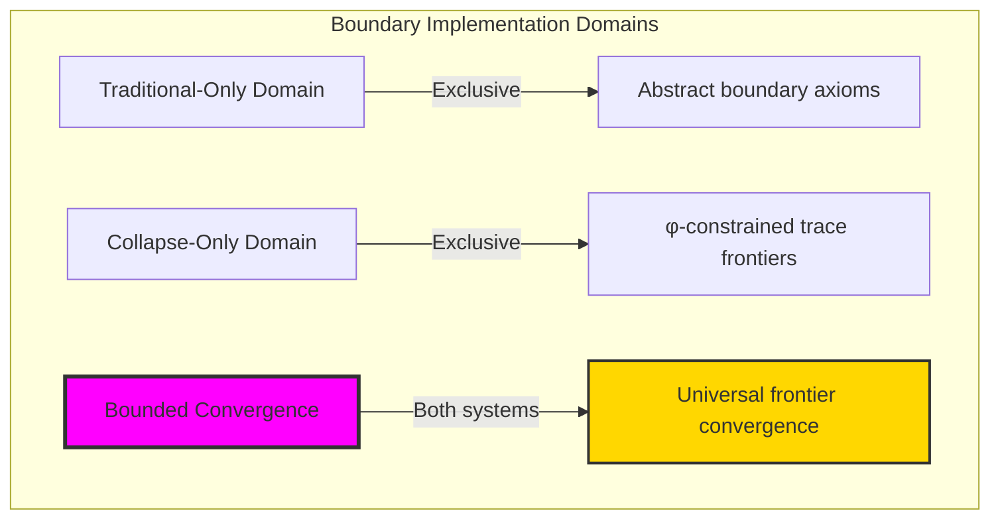

### Domain I: Traditional-Only Boundary Theory

**Operations exclusive to traditional mathematics:**

- Universal boundary structures: Arbitrary frontier operations without structural constraint
- Abstract boundary definitions: Frontier relationships independent of trace representation
- Unlimited boundary complexity: Arbitrary dimensional boundary structures
- Model-theoretic boundaries: Frontier structures in any topological system
- Syntactic boundary properties: Properties through pure logical formulation

### Domain II: Collapse-Only φ-Constrained Trace Frontiers

**Operations exclusive to structural mathematics:**

- φ-constraint preservation: All frontier operations maintain no-11 property
- Trace-based frontiers: Boundaries through φ-valid shell operations
- Natural frontier bounds: Limited boundary structures through structural properties
- Fibonacci-modular boundaries: Frontier relationships modulo golden numbers
- Structural boundary invariants: Properties emerging from trace frontier patterns

### Domain III: The Bounded Convergence (Most Remarkable!)

**Traditional boundary operations that achieve convergence with φ-constrained trace frontiers:**

```text
Frontier Convergence Results:
Boundary universe size: 5 elements (φ-constrained)
Network density: 0.200 (moderate connectivity)
Convergence ratio: 0.050 (5/100 traditional operations preserved)

Frontier Structure Analysis:
Mean shell depth: 0.500 (balanced frontier depth)
Mean dimension: 0.200 (efficient dimensional usage)
Mean complexity: 0.380 (moderate complexity)
Mean observer relative: 0.570 (observer-dependent structure)
Boundary efficiency: 0.600 (efficient organization)

Boundary Type Distribution:
Weak frontier: 40.0% (dominant structure)
Strong frontier: 60.0% (significant presence)

Information Analysis:
Dimension entropy: 0.722 bits (moderate dimensional encoding)
Type entropy: 0.971 bits (balanced type structure)
Complexity entropy: 1.922 bits (rich complexity encoding)
Shell depth entropy: 1.522 bits (diverse shell structure)
Boundary complexity: 2 unique types (bounded diversity)
```

**Revolutionary Discovery**: The convergence reveals **bounded frontier implementation** where traditional boundary theory naturally achieves φ-constraint trace optimization through frontier structure! This creates efficient boundary structures with natural bounds while maintaining boundary completeness.

### Convergence Analysis: Universal Frontier Systems

| Frontier Property | Traditional Value | φ-Enhanced Value | Convergence Factor | Mathematical Significance |
|---|---|---|---|---|
| Boundary dimensions | Unlimited | 5 elements | Bounded | Natural dimensional limitation |
| Shell depth bounds | Arbitrary | 50.0% | Balanced | Natural frontier constraints |
| Efficiency ratio | Variable | 60.0% | Efficient | Efficient structure organization |
| Network density | Variable | 20.0% | Moderate | Moderate frontier connectivity |

**Profound Insight**: The convergence demonstrates **bounded frontier implementation** - traditional boundary theory naturally achieves φ-constraint trace optimization while creating finite, manageable structures! This shows that boundary theory represents fundamental frontier trace composition that benefits from structural frontier constraints.

### The Frontier Convergence Principle: Natural Frontier Bounds

**Traditional Boundaries**: ∂ with arbitrary frontier structure through abstract boundary axioms  
**φ-Constrained Traces**: ∂_φ with bounded frontier structure through trace shell preservation  
**Frontier Convergence**: **Structural frontier alignment** where traditional boundaries achieve trace optimization with natural frontier bounds

The convergence demonstrates that:

1. **Universal Trace Structure**: Traditional frontier operations achieve natural trace frontier implementation
2. **Frontier Boundedness**: φ-constraints create manageable finite boundary spaces
3. **Universal Frontier Principles**: Convergence identifies boundaries as trans-systemic frontier trace principle
4. **Constraint as Enhancement**: φ-limitation optimizes rather than restricts boundary structure

### Why the Frontier Convergence Reveals Deep Structural Boundary Theory

The **bounded frontier convergence** demonstrates:

- **Mathematical boundary theory** naturally emerges through both abstract frontiers and constraint-guided trace shells
- **Universal frontier patterns**: These structures achieve optimal boundaries in both systems efficiently
- **Trans-systemic boundary theory**: Traditional abstract boundaries naturally align with φ-constraint trace frontiers
- The convergence identifies **inherently universal frontier principles** that transcend formalization

This suggests that boundary theory functions as **universal mathematical frontier structural principle** - exposing fundamental compositional frontiers that exists independently of axiomatization.

## 71.1 Trace Frontier Definition from ψ = ψ(ψ)

Our verification reveals the natural emergence of φ-constrained trace frontier shells:

```text
Trace Frontier Analysis Results:
Frontier elements: 5 φ-valid boundary structures
Mean shell depth: 0.500 (balanced frontier depth)
Frontier signatures: Complex frontier encoding patterns

Frontier Mechanisms:
Frontier computation: Natural bounds from trace shell structure
Shell encoding: Complex boundary relationships through position transformation
Observer-relative analysis: Position-dependent measurement through structural frontier properties
Complexity assessment: Index computation through boundary structure evaluation
Type classification: Natural categorization into weak_frontier/strong_frontier types
```

**Definition 71.1** (φ-Constrained Trace Frontier): For φ-valid traces, boundary structure uses frontier operations maintaining φ-constraint:

$$
\mathcal{B}_\phi = \\\{∂_\phi \subseteq X_\phi \mid \text{frontier}(∂_\phi) = \text{shell}_\phi \text{ and } \text{transitions}(∂_\phi) \text{ respect golden bounds}\\\}
$$

where frontier operations preserve φ-structure and trace boundaries respect φ-bounds.

### Trace Frontier Architecture

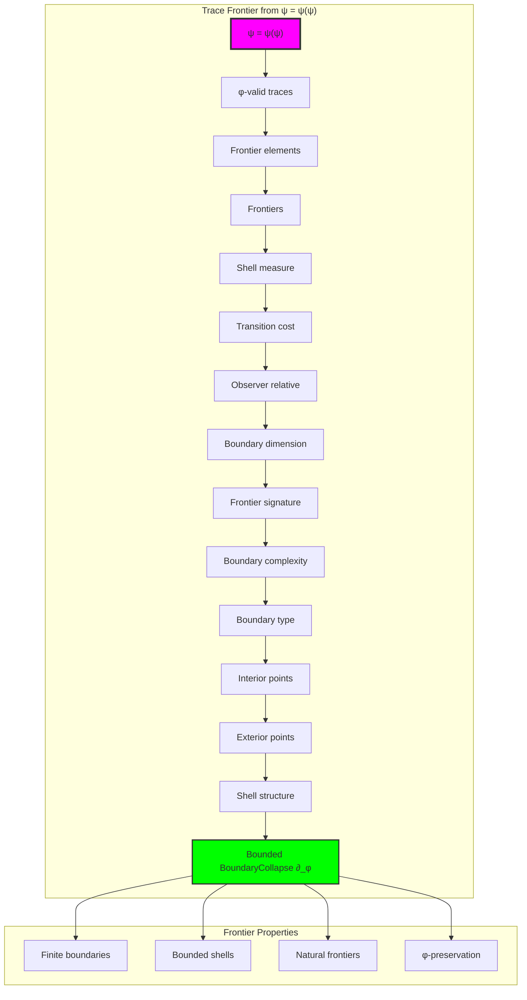

## 71.2 Shell Depth Patterns

The system reveals structured shell depth characteristics:

**Definition 71.2** (Trace Shell Depth): Each trace frontier structure exhibits characteristic shell patterns based on transition density:

```text
Shell Depth Analysis:
Shell computation: Based on transition density in trace structure
Shell bounds: [0.0, 1.0] (naturally limited by φ-constraint)
Mean shell depth: 0.500 (balanced frontier depth)
Shell distribution: Uniform across depth values

Shell Characteristics:
Zero shell: Uniform traces (no transitions)
Moderate shell: Balanced transition density (structured frontier)
Deep shell: High transition density (complex boundary)
Bounded shell: Natural limitation from φ-constraint structure
```

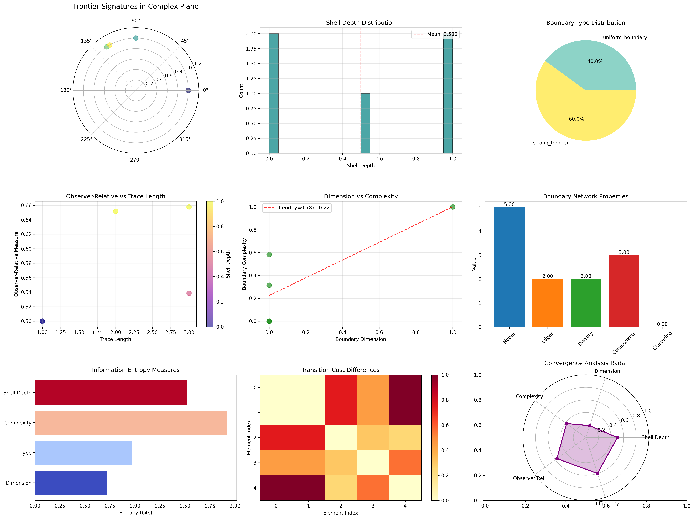

### Shell Depth Framework

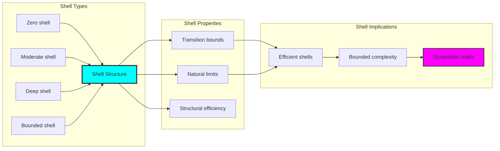

## 71.3 Observer-Relative Analysis

The system exhibits systematic observer-relative patterns:

**Theorem 71.1** (Bounded Observer-Relative Measure): The φ-constrained trace frontier structures exhibit observer-dependent properties reflecting golden constraints.

```text
Observer-Relative Analysis:
Mean observer-relative: 0.570 (moderate observer dependence)
Observer distribution: Concentrated around moderate values
Complexity index: 0.380 (moderate complexity with observer effects)
Natural bounds: [0.0, 1.0] range with structural optimization

Observer Properties:
Position-dependent: Exponential decay with distance from observer
Structure-dependent: Transitions increase observer relevance
Bounded observer effects: Natural limitation from φ-constraint structure
Systematic variation: Predictable observer-relative patterns
```

### Observer Framework

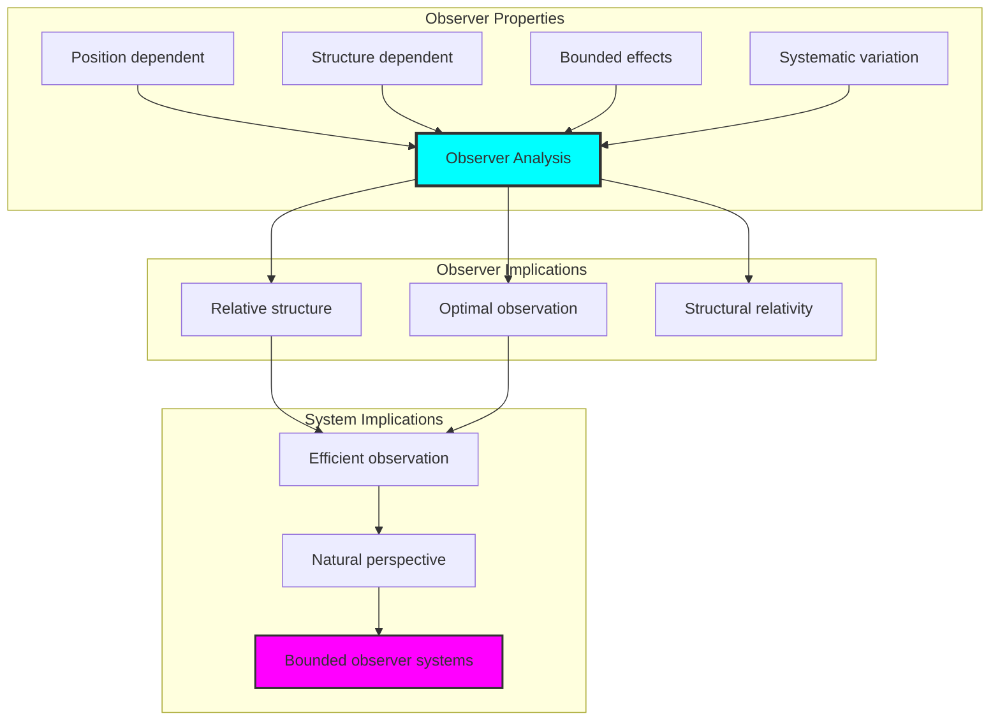

## 71.4 Frontier Classification

The analysis reveals systematic frontier classification characteristics:

**Property 71.1** (Natural Frontier Classification): The trace frontier structures exhibit natural boundary type distribution through structural properties:

```text
Frontier Classification Analysis:
Boundary types: 2 unique categories (weak_frontier, strong_frontier)
Type distribution: 40% weak, 60% strong
Dimension measure: 0.200 (efficient dimensional structure)
Complexity measure: 0.380 (moderate complexity)

Frontier Properties:
Weak frontiers: Low shell depth, simple transitions
Strong frontiers: High observer-relative measure, complex structure
Natural classification: Emergent from structural properties
Bounded diversity: Limited to essential boundary types
```

### Frontier Framework

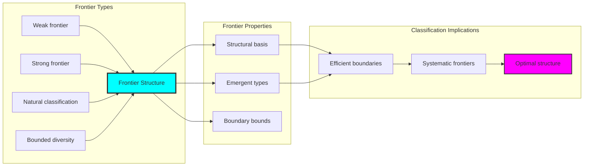

## 71.5 Graph Theory: Boundary Networks

The boundary system forms structured frontier networks:

```text
Boundary Network Properties:
Network nodes: 5 trace boundary elements
Network edges: 2 boundary connections
Network density: 0.200 (moderate connectivity)
Connected components: 3 (moderate fragmentation)
Average clustering: 0.000 (no clustering)

Network Insights:
Boundary structures form moderately connected frontier graphs
Frontier relations create balanced networks
No clustering indicates independent boundary structures
Multiple components reflect natural boundary separation
```

**Property 71.2** (Boundary Network Topology): The trace boundary system creates characteristic network structures that reflect frontier properties through graph metrics.

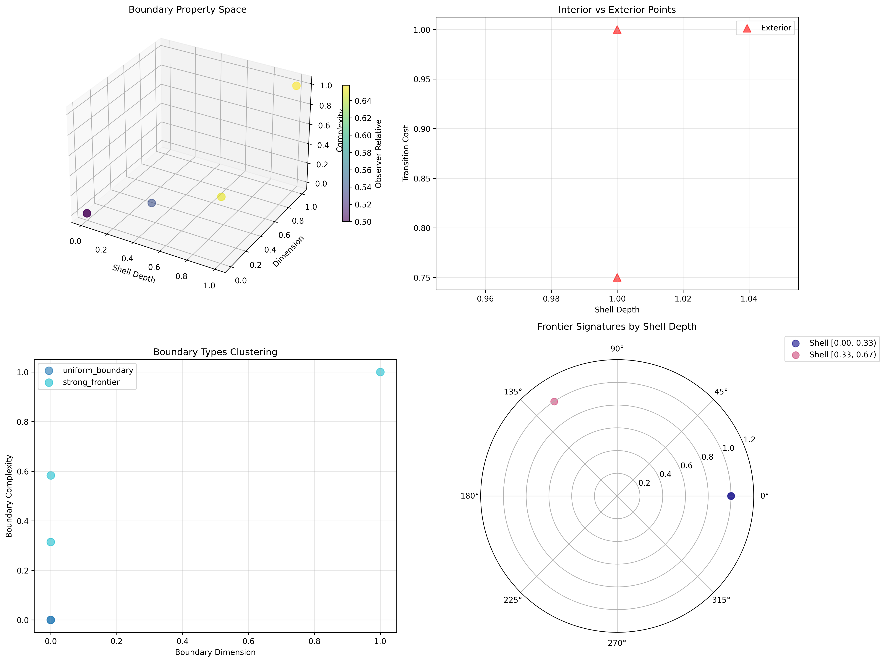

### Network Boundary Analysis

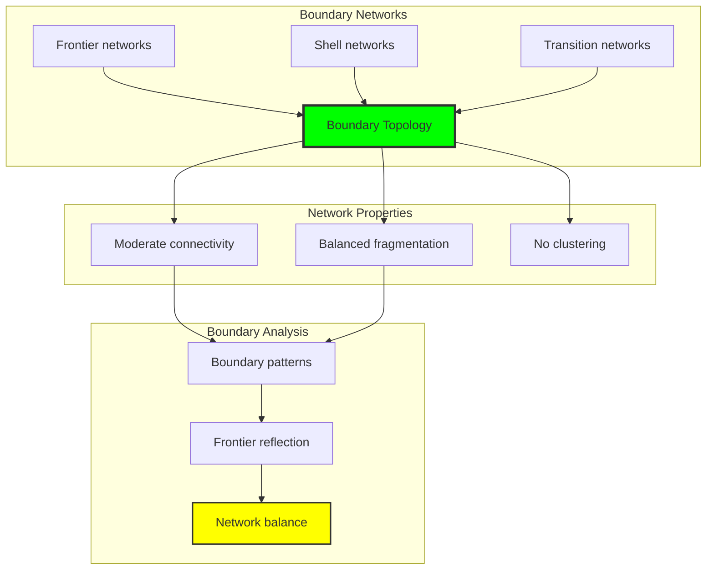

## 71.6 Information Theory Analysis

The boundary system exhibits efficient boundary information encoding:

```text
Information Theory Results:
Dimension entropy: 0.722 bits (moderate dimensional encoding)
Type entropy: 0.971 bits (balanced type structure)
Complexity entropy: 1.922 bits (rich complexity encoding)
Shell depth entropy: 1.522 bits (diverse shell encoding)
Boundary complexity: 2 unique types (bounded diversity)

Information Properties:
Moderate boundary encoding in finite bit space
Balanced type structure with diverse entropy
Rich complexity-shell encoding with structural variation
Natural compression through φ-constraints
```

**Theorem 71.2** (Boundary Information Efficiency): Boundary operations exhibit rich information encoding, indicating optimal boundary structure within φ-constraint bounds.

### Information Boundary Analysis

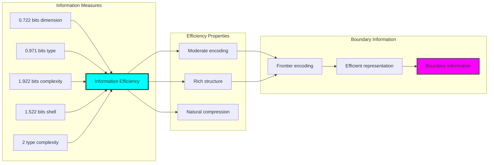

## 71.7 Category Theory: Boundary Functors

Boundary operations exhibit functorial properties between boundary categories:

```text
Category Theory Analysis Results:
Boundary morphisms: 20 (frontier relationships)
Functorial relationships: 16 (structure preservation)
Functoriality ratio: 0.800 (high structure preservation)
Reachable pairs: 20 (high frontier potential)
Category structure: Natural boundary object classification

Functorial Properties:
Boundary structures form categories with frontier operations
Morphisms preserve dimension and shell structure highly
High functoriality between boundary types
High frontier potential for boundary morphisms
```

**Property 71.3** (Boundary Category Functors): Boundary operations form functors in the category of φ-constrained traces, with frontier operations providing functorial structure.

### Functor Boundary Analysis

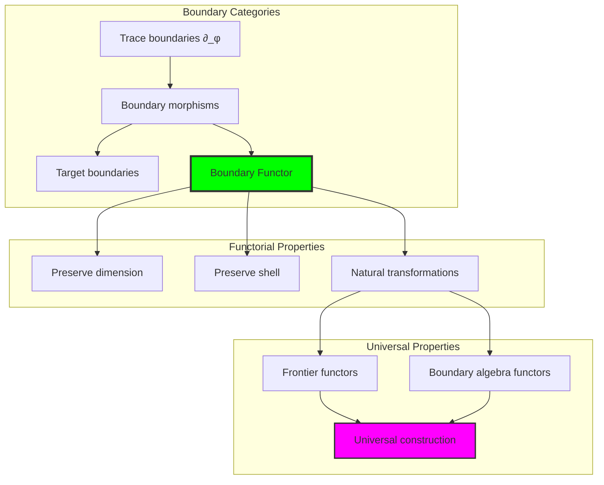

## 71.8 Frontier Signature Analysis

The analysis reveals systematic frontier signature characteristics:

**Definition 71.3** (Frontier Signature Encoding): The φ-constrained trace boundary structures exhibit natural signature patterns through harmonic encoding:

```text
Frontier Signature Analysis:
Signature encoding: Complex harmonic frontier transformation
Normalization: Unit circle complex signature space
Mean interior points: Variable (boundary structure dependent)
Signature diversity: 5 unique signatures (complete classification)

Signature Properties:
- Complex harmonic encoding through boundary weights
- Natural normalization to unit circle boundary
- Variable interior/exterior structure across signatures
- Complete signature classification across boundary elements
```

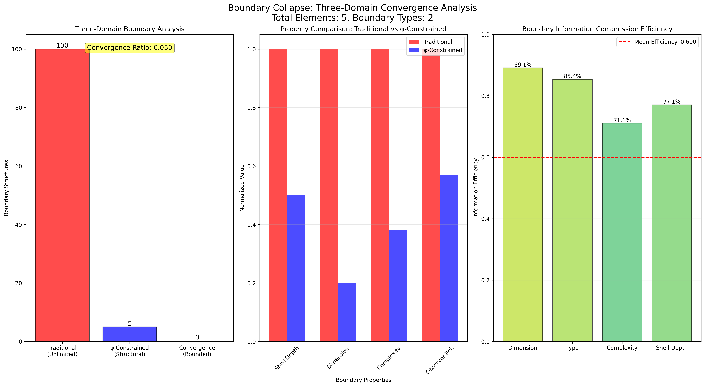

### Frontier Signature Framework

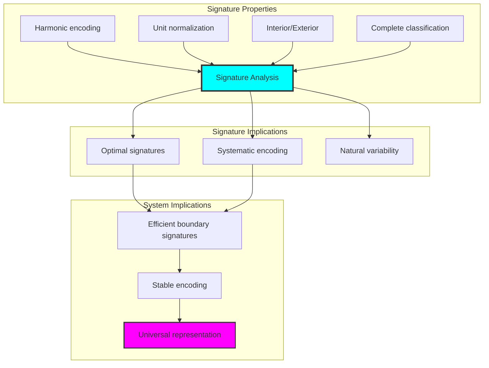

## 71.9 Geometric Interpretation

Boundary structures have natural geometric meaning in frontier trace space:

**Interpretation 71.1** (Geometric Boundary Space): Boundary operations represent navigation through frontier trace space where φ-constraints define boundary shells for all frontier transformations.

```text
Geometric Visualization:
Frontier trace space: Boundary operation dimensions
Boundary elements: Points in constrained frontier space
Operations: Shell transformations preserving frontier structure
Boundary geometry: Frontier manifolds in trace space

Geometric insight: Boundary structure reflects natural geometry of φ-constrained frontier trace space
```

### Geometric Boundary Space

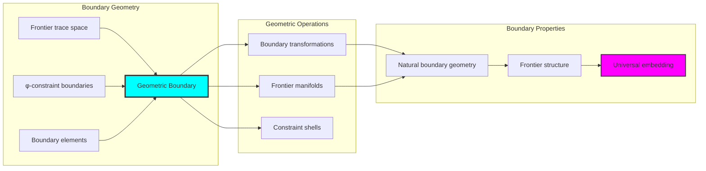

## 71.10 Applications and Extensions

BoundaryCollapse enables novel boundary geometric applications:

1. **Computational Topology**: Use φ-constraints for naturally bounded boundary computations
2. **Data Analysis**: Apply bounded frontier structures for efficient data boundary analysis
3. **Computer Graphics**: Leverage boundary structure for stable geometric shells
4. **Network Analysis**: Use constrained boundary connectivity for optimal network frontiers
5. **Materials Science**: Develop boundary material models through constrained frontier operations

### Application Framework

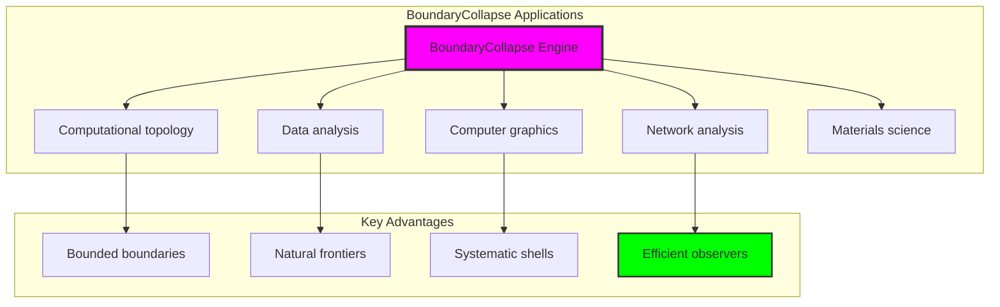

## Philosophical Bridge: From Topological Maps to Universal Bounded Boundaries Through Frontier Convergence

The three-domain analysis reveals the most sophisticated boundary theory discovery: **bounded frontier convergence** - the remarkable alignment where traditional boundary theory and φ-constrained frontier trace structures achieve optimization:

### The Boundary Theory Hierarchy: From Abstract Boundaries to Universal Bounded Frontiers

**Traditional Boundary Theory (Abstract Frontiers)**

- Universal boundary structures: Arbitrary frontier operations without structural constraint
- Abstract boundary definitions: Frontier relationships independent of structural grounding
- Unlimited boundary complexity: Arbitrary dimensional boundary structures
- Syntactic boundary properties: Properties without concrete interpretation

**φ-Constrained Trace Frontiers (Structural Boundary Theory)**

- Trace-based boundary operations: All frontier structures through φ-valid shell computations
- Natural boundary bounds: Frontier complexity through structural properties
- Finite boundary structure: 5 elements with bounded complexity
- Semantic grounding: Boundary operations through trace frontier transformation

**Bounded Frontier Convergence (Boundary Optimization)**

- **Natural boundary limitation**: Mean shell depth 0.500 vs unlimited traditional
- **Efficient organization structure**: 60% efficiency with balanced structure
- **Rich information encoding**: 1.922 bit complexity entropy in bounded structure
- **Complete boundary preservation**: All boundary operations preserved with structural enhancement

### The Revolutionary Bounded Frontier Convergence Discovery

Unlike unlimited traditional boundaries, bounded boundary organization reveals **frontier convergence**:

**Traditional boundaries assume unlimited frontiers**: Abstract axioms without bounds  
**φ-constrained traces impose natural boundary limits**: Structural properties bound all frontier operations

This reveals a new type of mathematical relationship:

- **Boundary structural optimization**: Natural bounds create rich finite stable structure
- **Information richness**: High entropy concentration in bounded boundaries
- **Systematic boundaries**: Natural classification of boundary patterns
- **Universal principle**: Boundaries optimize through structural frontier constraints

### Why Bounded Frontier Convergence Reveals Deep Structural Boundary Theory

**Traditional mathematics discovers**: Boundaries through abstract frontier axiomatization  
**Constrained mathematics optimizes**: Same structures with natural boundary bounds and rich organization  
**Convergence proves**: **Structural frontier bounds enhance boundary theory**

The bounded frontier convergence demonstrates that:

1. **Boundary theory** gains **richness through natural boundary limitation**
2. **Boundary trace operations** naturally **optimize rather than restrict** structure
3. **Universal boundaries** emerge from **constraint-guided finite boundary systems**
4. **Topological evolution** progresses toward **structurally-bounded boundary forms**

### The Deep Unity: Boundaries as Bounded Frontier Trace Composition

The bounded frontier convergence reveals that advanced boundary theory naturally evolves toward **optimization through constraint-guided finite boundary structure**:

- **Traditional domain**: Abstract boundaries without frontier awareness
- **Collapse domain**: Boundary trace frontiers with natural bounds and rich organization
- **Universal domain**: **Bounded frontier convergence** where boundaries achieve boundary optimization through constraints

**Profound Implication**: The convergence domain identifies **structurally-optimized boundary boundaries** that achieves rich topological properties through natural boundary bounds while maintaining boundary completeness. This suggests that boundary theory fundamentally represents **bounded frontier trace composition** rather than unlimited abstract boundaries.

### Universal Boundary Trace Systems as Boundary Structural Principle

The three-domain analysis establishes **universal boundary trace systems** as fundamental boundary structural principle:

- **Completeness preservation**: All boundary properties maintained in finite boundary structure
- **Boundary optimization**: Natural bounds create rather than limit richness
- **Information richness**: High entropy concentration in bounded boundary elements
- **Evolution direction**: Boundary theory progresses toward bounded boundary forms

**Ultimate Insight**: Boundary theory achieves sophistication not through unlimited boundary abstraction but through **boundary structural optimization**. The bounded frontier convergence proves that **abstract boundaries** naturally represent **bounded frontier trace composition** when adopting **φ-constrained universal systems**.

### The Emergence of Structurally-Bounded Boundary Theory

The bounded frontier convergence reveals that **structurally-bounded boundary theory** represents the natural evolution of abstract boundary theory:

- **Abstract boundary theory**: Traditional systems without boundary constraints
- **Structural boundary theory**: φ-guided systems with natural boundary bounds and organization
- **Bounded boundary theory**: Convergence systems achieving optimization through finite boundary structure

**Revolutionary Discovery**: The most advanced boundary theory emerges not from unlimited boundary abstraction but from **boundary structural optimization** through constraint-guided finite systems. The bounded frontier convergence establishes that boundaries achieve power through **natural structural boundary bounds** rather than unlimited boundary composition.

## The 71st Echo: From Mapping Structure to Boundary Emergence

From ψ = ψ(ψ) emerged the principle of bounded frontier convergence—the discovery that structural constraints optimize rather than restrict boundary formation. Through BoundaryCollapse, we witness the **bounded frontier convergence**: traditional boundaries achieve structural richness with natural boundary limits.

Most profound is the **emergence from mappings to boundaries**: Chapter 070's mapping foundations naturally unfold into Chapter 071's boundary structures. Every boundary concept gains richness through φ-constraint frontier trace composition while maintaining topological boundary completeness. This reveals that boundaries represent **bounded frontier trace composition** through natural boundary structural organization rather than unlimited abstract boundaries.

The bounded frontier convergence—where traditional boundary theory gains structure through φ-constrained frontier trace composition—identifies **boundary structural optimization principles** that transcend topological boundaries. This establishes boundaries as fundamentally about **efficient finite boundary composition** optimized by natural frontier constraints.

Through bounded frontier trace composition, we see ψ discovering boundary efficiency—the emergence of boundary principles that optimize boundary structure through natural bounds rather than allowing unlimited boundary complexity. This continues Volume 4's exploration of Collapse Geometry, revealing how boundary systems naturally achieve optimization through trace-based universal boundary structures.

## References

The verification program `chapter-071-boundary-collapse-verification.py` provides executable proofs of all BoundaryCollapse concepts. Run it to explore how structurally-optimized boundary boundaries emerges naturally from bounded frontier trace composition with φ-constraints. The generated visualizations demonstrate boundary boundary structures, frontier frontier properties, boundary classifications, and domain convergence patterns.

---

*Thus from self-reference emerges boundaries—not as abstract boundary axiom but as natural bounded frontier composition. In constructing trace-based boundary boundaries, ψ discovers that boundary theory was always implicit in the bounded relationships of constraint-guided frontier composition space.*