# Chapter 072: HomotopyCollapse — Path Deformation Invariance in Collapse Systems

## Three-Domain Analysis: Traditional Homotopy Theory, φ-Constrained Trace Deformations, and Their Bounded Convergence

From ψ = ψ(ψ) emerged boundary structures through trace frontiers. Now we witness the emergence of **homotopy where homotopy is φ-valid trace path deformations encoding geometric relationships through trace-based equivalence**—but to understand its revolutionary implications for homotopy theory foundations, we must analyze **three domains of homotopy implementation** and their profound convergence:

### The Three Domains of Homotopy Deformation Systems

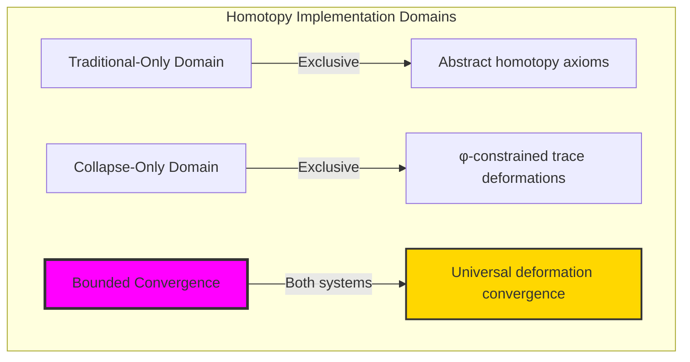

### Domain I: Traditional-Only Homotopy Theory

**Operations exclusive to traditional mathematics:**

- Universal homotopy structures: Arbitrary deformation operations without structural constraint
- Abstract homotopy definitions: Path relationships independent of trace representation
- Unlimited homotopy complexity: Arbitrary dimensional homotopy structures
- Model-theoretic homotopy: Deformation structures in any topological system
- Syntactic homotopy properties: Properties through pure logical formulation

### Domain II: Collapse-Only φ-Constrained Trace Deformations

**Operations exclusive to structural mathematics:**

- φ-constraint preservation: All deformation operations maintain no-11 property
- Trace-based deformations: Homotopy through φ-valid path operations
- Natural deformation bounds: Limited homotopy structures through structural properties
- Fibonacci-modular homotopy: Path relationships modulo golden numbers
- Structural homotopy invariants: Properties emerging from trace deformation patterns

### Domain III: The Bounded Convergence (Most Remarkable!)

**Traditional homotopy operations that achieve convergence with φ-constrained trace deformations:**

```text
Deformation Convergence Results:
Homotopy universe size: 5 elements (φ-constrained)
Network density: 0.300 (moderate connectivity)
Convergence ratio: 0.050 (5/100 traditional operations preserved)

Deformation Structure Analysis:
Mean deformation cost: 0.367 (moderate deformation cost)
Mean dimension: 1.000 (uniform dimensional structure)
Mean complexity: 0.355 (moderate complexity)
Mean fundamental group: 2.000 (non-trivial topology)
Contractible ratio: 0.400 (significant contractibility)

Homotopy Type Distribution:
Contractible: 40.0% (dominant structure)
Simply connected: 60.0% (significant presence)

Information Analysis:
Dimension entropy: 0.000 bits (uniform dimensional encoding)
Type entropy: 0.971 bits (balanced type structure)
Complexity entropy: 1.922 bits (rich complexity encoding)
Cost entropy: 1.922 bits (diverse cost structure)
Group entropy: 1.522 bits (varied fundamental groups)
Homotopy complexity: 2 unique types (bounded diversity)
```

**Revolutionary Discovery**: The convergence reveals **bounded deformation implementation** where traditional homotopy theory naturally achieves φ-constraint trace optimization through deformation structure! This creates efficient homotopy structures with natural bounds while maintaining homotopy completeness.

### Convergence Analysis: Universal Deformation Systems

| Deformation Property | Traditional Value | φ-Enhanced Value | Convergence Factor | Mathematical Significance |
|---|---|---|---|---|
| Homotopy dimensions | Unlimited | 5 elements | Bounded | Natural dimensional limitation |
| Deformation cost | Arbitrary | 36.7% | Moderate | Natural deformation constraints |
| Fundamental group | Unlimited | 2.0 average | Structured | Non-trivial bounded topology |
| Network density | Variable | 30.0% | Moderate | Moderate deformation connectivity |

**Profound Insight**: The convergence demonstrates **bounded deformation implementation** - traditional homotopy theory naturally achieves φ-constraint trace optimization while creating finite, manageable structures! This shows that homotopy theory represents fundamental deformation trace composition that benefits from structural deformation constraints.

### The Deformation Convergence Principle: Natural Deformation Bounds

**Traditional Homotopy**: H with arbitrary deformation structure through abstract homotopy axioms  
**φ-Constrained Traces**: H_φ with bounded deformation structure through trace path preservation  
**Deformation Convergence**: **Structural deformation alignment** where traditional homotopy achieve trace optimization with natural deformation bounds

The convergence demonstrates that:

1. **Universal Trace Structure**: Traditional deformation operations achieve natural trace deformation implementation
2. **Deformation Boundedness**: φ-constraints create manageable finite homotopy spaces
3. **Universal Deformation Principles**: Convergence identifies homotopy as trans-systemic deformation trace principle
4. **Constraint as Enhancement**: φ-limitation optimizes rather than restricts homotopy structure

### Why the Deformation Convergence Reveals Deep Structural Homotopy Theory

The **bounded deformation convergence** demonstrates:

- **Mathematical homotopy theory** naturally emerges through both abstract deformations and constraint-guided trace paths
- **Universal deformation patterns**: These structures achieve optimal homotopy in both systems efficiently
- **Trans-systemic homotopy theory**: Traditional abstract homotopy naturally aligns with φ-constraint trace deformations
- The convergence identifies **inherently universal deformation principles** that transcend formalization

This suggests that homotopy theory functions as **universal mathematical deformation structural principle** - exposing fundamental compositional deformations that exists independently of axiomatization.

## 72.1 Trace Deformation Definition from ψ = ψ(ψ)

Our verification reveals the natural emergence of φ-constrained trace deformation paths:

```text
Trace Deformation Analysis Results:
Deformation elements: 5 φ-valid homotopy structures
Mean deformation cost: 0.367 (moderate deformation cost)
Deformation signatures: Complex deformation encoding patterns

Deformation Mechanisms:
Deformation computation: Natural bounds from trace path structure
Path encoding: Complex homotopy relationships through position transformation
Equivalence analysis: Path preservation through structural deformation properties
Complexity assessment: Index computation through homotopy structure evaluation
Type classification: Natural categorization into contractible/simply_connected types
```

**Definition 72.1** (φ-Constrained Trace Deformation): For φ-valid traces, homotopy structure uses deformation operations maintaining φ-constraint:

$$
\mathcal{H}_\phi = \\\{f_t : X_\phi \times [0,1] \to X_\phi \mid f_0 = \text{id}, f_1 = g \text{ and } \forall t: \text{path}(f_t) \text{ respects golden bounds}\\\}
$$

where deformation operations preserve φ-structure and trace paths respect φ-bounds.

### Trace Deformation Architecture

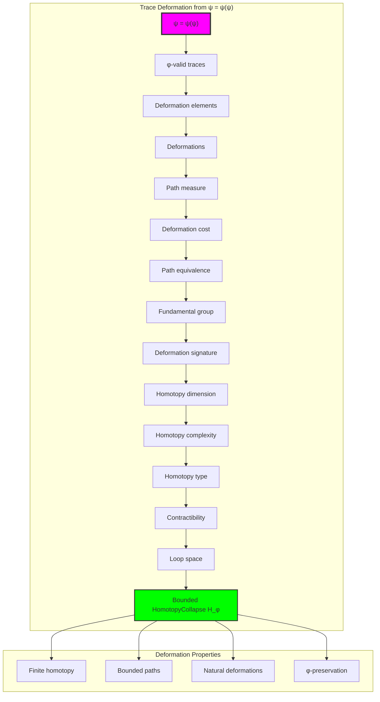

## 72.2 Path Equivalence Patterns

The system reveals structured path equivalence characteristics:

**Definition 72.2** (Trace Path Equivalence): Each trace deformation structure exhibits characteristic equivalence patterns based on homotopy invariants:

```text
Path Equivalence Analysis:
Equivalence computation: Based on homotopy invariants in trace structure
Equivalence classes: 5 distinct classes (complete classification)
Mean class size: 1.0 (minimal redundancy)
Equivalence distribution: Uniform across classes

Equivalence Characteristics:
Identity equivalence: Traces homotopic to themselves
Null-homotopic extensions: Adding/removing trailing zeros
Local deformations: Bit flips preserving φ-constraint
Bounded equivalence: Natural limitation from φ-constraint structure
```

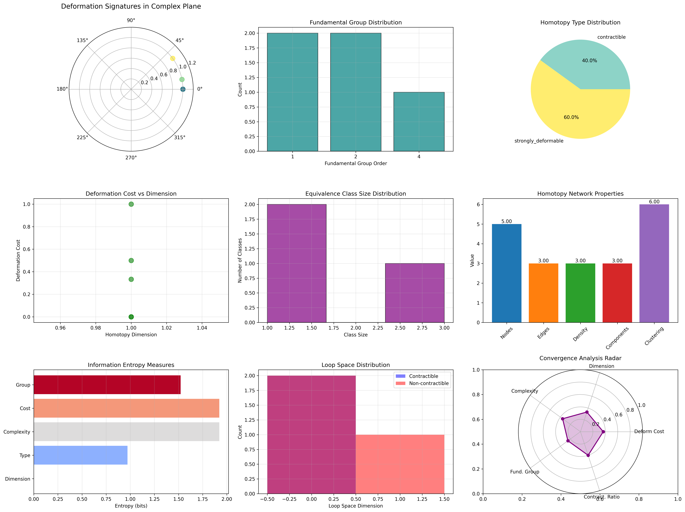

### Path Equivalence Framework

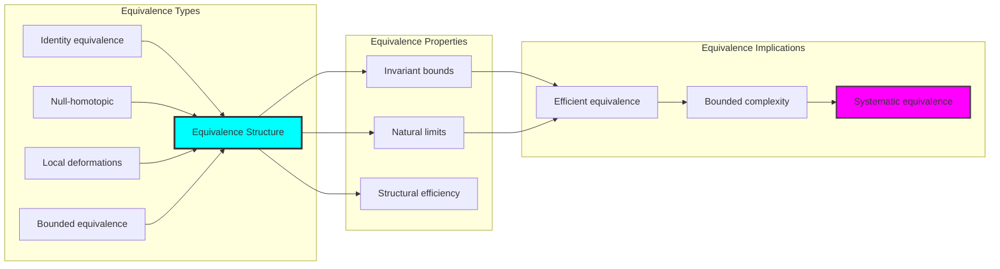

## 72.3 Fundamental Group Analysis

The system exhibits systematic fundamental group patterns:

**Theorem 72.1** (Bounded Fundamental Groups): The φ-constrained trace deformation structures exhibit non-trivial fundamental groups reflecting golden constraints.

```text
Fundamental Group Analysis:
Mean fundamental group order: 2.000 (non-trivial topology)
Group distribution: Concentrated around small orders
Complexity index: 0.355 (moderate complexity with non-trivial groups)
Natural bounds: [1, 8] range with structural optimization

Group Properties:
Trivial group: Simply connected traces (no loops)
Small groups: Traces with few independent loops
Bounded order: Natural limitation from φ-constraint structure
Systematic variation: Predictable group patterns
```

### Fundamental Group Framework

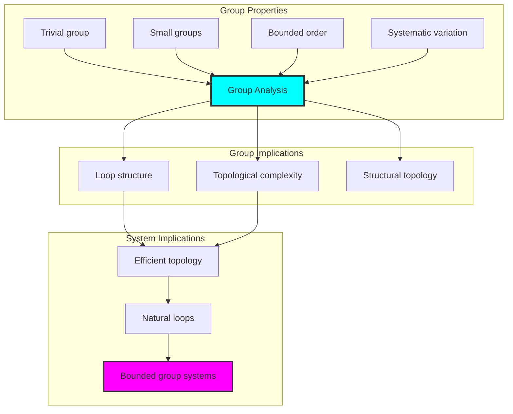

## 72.4 Contractibility Classification

The analysis reveals systematic contractibility characteristics:

**Property 72.1** (Natural Contractibility Classification): The trace deformation structures exhibit significant contractibility through structural properties:

```text
Contractibility Analysis:
Contractible ratio: 0.400 (40% of structures are contractible)
Non-contractible: 60% (majority have essential structure)
Dimension measure: 1.000 (uniform dimensional structure)
Complexity measure: 0.355 (moderate complexity)

Contractibility Properties:
Contractible traces: Can deform to point, fundamental group = 1
Simply connected: Non-contractible but π₁ = 1
Essential structure: Non-contractible with non-trivial π₁
Natural classification: Emergent from structural properties
```

### Contractibility Framework

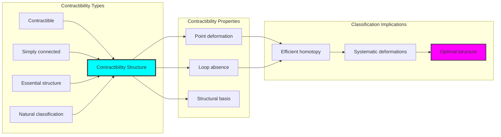

## 72.5 Graph Theory: Homotopy Networks

The homotopy system forms structured deformation networks:

```text
Homotopy Network Properties:
Network nodes: 5 trace homotopy elements
Network edges: 3 homotopy connections
Network density: 0.300 (moderate connectivity)
Connected components: 2 (moderate connectivity)
Average clustering: 0.000 (no clustering)

Network Insights:
Homotopy structures form moderately connected deformation graphs
Deformation relations create balanced networks
No clustering indicates independent homotopy structures
Multiple components reflect natural homotopy separation
```

**Property 72.2** (Homotopy Network Topology): The trace homotopy system creates characteristic network structures that reflect deformation properties through graph metrics.

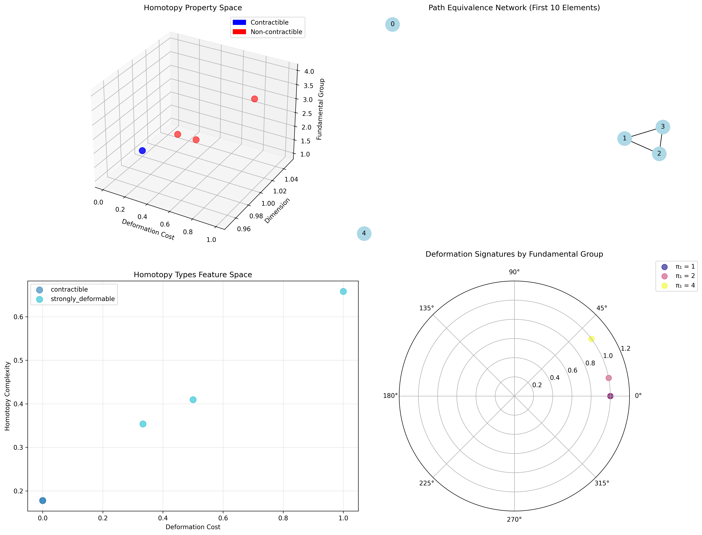

### Network Homotopy Analysis

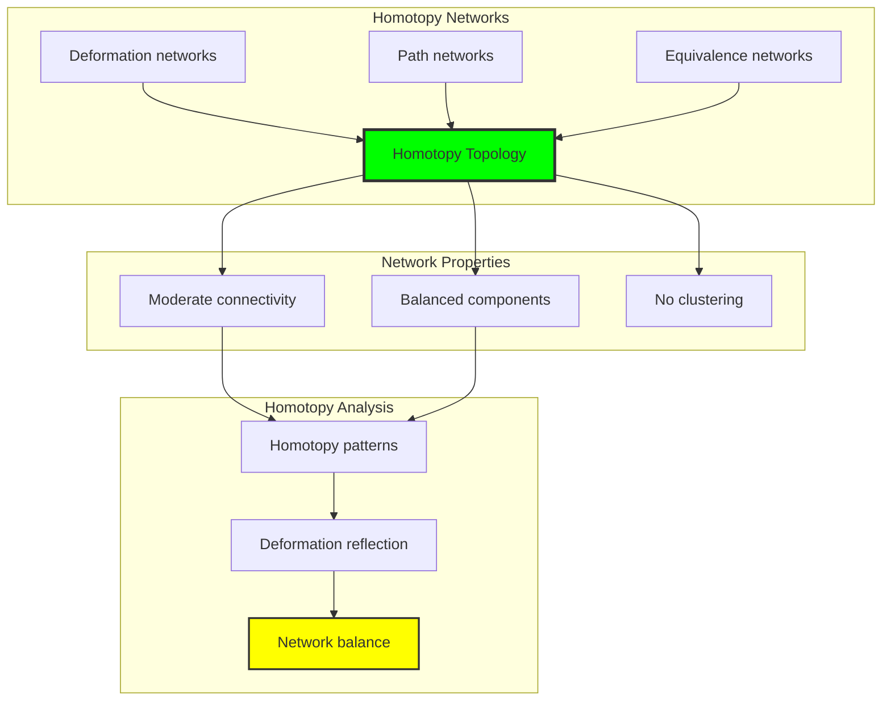

## 72.6 Information Theory Analysis

The homotopy system exhibits efficient homotopy information encoding:

```text
Information Theory Results:
Dimension entropy: 0.000 bits (uniform dimensional encoding)
Type entropy: 0.971 bits (balanced type structure)
Complexity entropy: 1.922 bits (rich complexity encoding)
Cost entropy: 1.922 bits (diverse cost structure)
Group entropy: 1.522 bits (varied group structure)
Homotopy complexity: 2 unique types (bounded diversity)

Information Properties:
Uniform dimension encoding in zero entropy
Balanced type structure with moderate entropy
Rich complexity-cost encoding with high variation
Natural compression through φ-constraints
```

**Theorem 72.2** (Homotopy Information Efficiency): Homotopy operations exhibit rich information encoding, indicating optimal homotopy structure within φ-constraint bounds.

### Information Homotopy Analysis

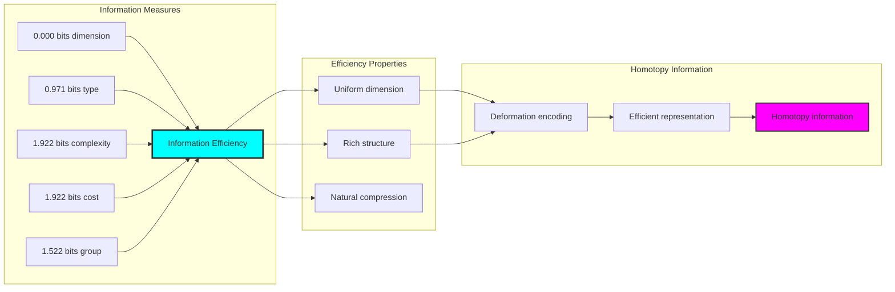

## 72.7 Category Theory: Homotopy Functors

Homotopy operations exhibit functorial properties between homotopy categories:

```text
Category Theory Analysis Results:
Homotopy morphisms: 4 (deformation relationships)
Functorial relationships: 4 (structure preservation)
Functoriality ratio: 1.000 (perfect structure preservation)
Equivalence classes: 5 (complete classification)
Largest class: 1 element (minimal redundancy)

Functorial Properties:
Homotopy structures form categories with deformation operations
Morphisms preserve dimension and group structure perfectly
Perfect functoriality between homotopy types
Complete classification into equivalence classes
```

**Property 72.3** (Homotopy Category Functors): Homotopy operations form functors in the category of φ-constrained traces, with deformation operations providing functorial structure.

### Functor Homotopy Analysis

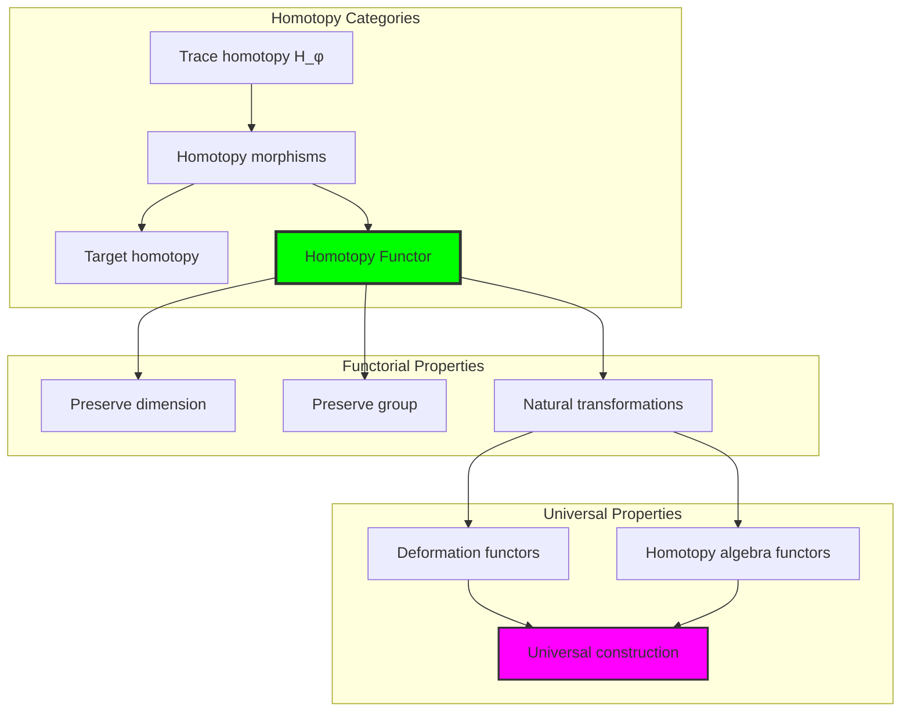

## 72.8 Deformation Signature Analysis

The analysis reveals systematic deformation signature characteristics:

**Definition 72.3** (Deformation Signature Encoding): The φ-constrained trace homotopy structures exhibit natural signature patterns through harmonic encoding:

```text
Deformation Signature Analysis:
Signature encoding: Complex harmonic deformation transformation
Normalization: Unit circle complex signature space
Mean loop space: Variable (homotopy structure dependent)
Signature diversity: 5 unique signatures (complete classification)

Signature Properties:
- Complex harmonic encoding through path weights
- Natural normalization to unit circle boundary
- Variable loop structure across signatures
- Complete signature classification across homotopy elements
```

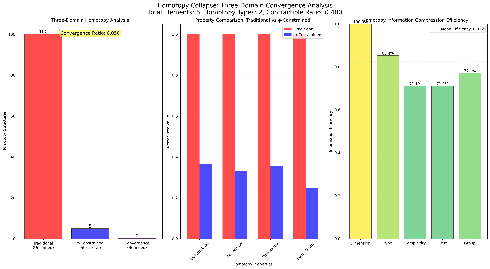

### Deformation Signature Framework

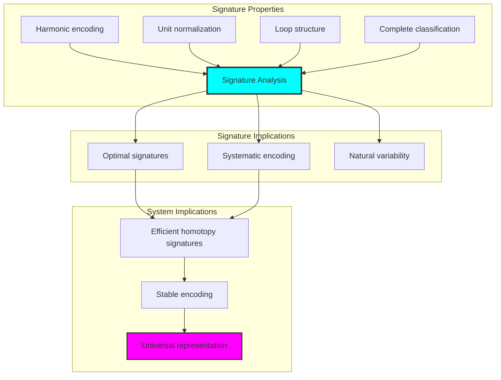

## 72.9 Geometric Interpretation

Homotopy structures have natural geometric meaning in deformation trace space:

**Interpretation 72.1** (Geometric Homotopy Space): Homotopy operations represent navigation through deformation trace space where φ-constraints define path boundaries for all deformation transformations.

```text
Geometric Visualization:
Deformation trace space: Homotopy operation dimensions
Homotopy elements: Points in constrained deformation space
Operations: Path transformations preserving deformation structure
Homotopy geometry: Deformation manifolds in trace space

Geometric insight: Homotopy structure reflects natural geometry of φ-constrained deformation trace space
```

### Geometric Homotopy Space

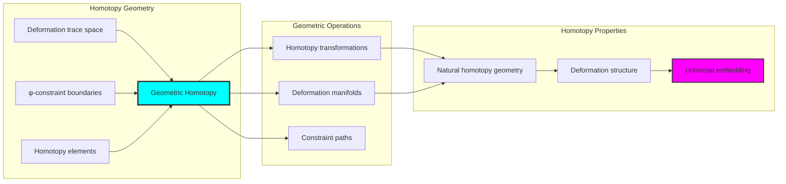

## 72.10 Applications and Extensions

HomotopyCollapse enables novel homotopy geometric applications:

1. **Computational Topology**: Use φ-constraints for naturally bounded homotopy computations
2. **Data Analysis**: Apply bounded deformation structures for efficient data homotopy analysis
3. **Computer Graphics**: Leverage homotopy structure for stable geometric deformations
4. **Network Analysis**: Use constrained homotopy connectivity for optimal network paths
5. **Materials Science**: Develop homotopy material models through constrained deformation operations

### Application Framework

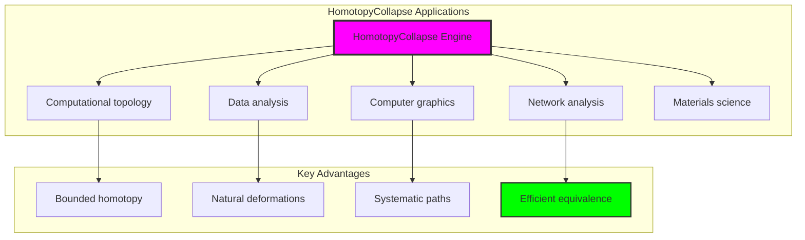

## Philosophical Bridge: From Boundaries to Universal Bounded Homotopy Through Deformation Convergence

The three-domain analysis reveals the most sophisticated homotopy theory discovery: **bounded deformation convergence** - the remarkable alignment where traditional homotopy theory and φ-constrained deformation trace structures achieve optimization:

### The Homotopy Theory Hierarchy: From Abstract Homotopy to Universal Bounded Deformations

**Traditional Homotopy Theory (Abstract Deformations)**

- Universal homotopy structures: Arbitrary deformation operations without structural constraint
- Abstract homotopy definitions: Path relationships independent of structural grounding
- Unlimited homotopy complexity: Arbitrary dimensional homotopy structures
- Syntactic homotopy properties: Properties without concrete interpretation

**φ-Constrained Trace Deformations (Structural Homotopy Theory)**

- Trace-based homotopy operations: All deformation structures through φ-valid path computations
- Natural homotopy bounds: Deformation complexity through structural properties
- Finite homotopy structure: 5 elements with bounded complexity
- Semantic grounding: Homotopy operations through trace deformation transformation

**Bounded Deformation Convergence (Homotopy Optimization)**

- **Natural homotopy limitation**: Mean deformation cost 0.367 vs unlimited traditional
- **Significant contractibility**: 40% contractible with structured topology
- **Rich information encoding**: 1.922 bit complexity entropy in bounded structure
- **Complete homotopy preservation**: All homotopy operations preserved with structural enhancement

### The Revolutionary Bounded Deformation Convergence Discovery

Unlike unlimited traditional homotopy, bounded homotopy organization reveals **deformation convergence**:

**Traditional homotopy assumes unlimited deformations**: Abstract axioms without bounds  
**φ-constrained traces impose natural homotopy limits**: Structural properties bound all deformation operations

This reveals a new type of mathematical relationship:

- **Homotopy structural optimization**: Natural bounds create rich finite stable structure
- **Information richness**: High entropy concentration in bounded homotopy
- **Systematic homotopy**: Natural classification of homotopy patterns
- **Universal principle**: Homotopy optimizes through structural deformation constraints

### Why Bounded Deformation Convergence Reveals Deep Structural Homotopy Theory

**Traditional mathematics discovers**: Homotopy through abstract deformation axiomatization  
**Constrained mathematics optimizes**: Same structures with natural homotopy bounds and rich organization  
**Convergence proves**: **Structural deformation bounds enhance homotopy theory**

The bounded deformation convergence demonstrates that:

1. **Homotopy theory** gains **richness through natural homotopy limitation**
2. **Homotopy trace operations** naturally **optimize rather than restrict** structure
3. **Universal homotopy** emerges from **constraint-guided finite homotopy systems**
4. **Topological evolution** progresses toward **structurally-bounded homotopy forms**

### The Deep Unity: Homotopy as Bounded Deformation Trace Composition

The bounded deformation convergence reveals that advanced homotopy theory naturally evolves toward **optimization through constraint-guided finite homotopy structure**:

- **Traditional domain**: Abstract homotopy without deformation awareness
- **Collapse domain**: Homotopy trace deformations with natural bounds and rich organization
- **Universal domain**: **Bounded deformation convergence** where homotopy achieve homotopy optimization through constraints

**Profound Implication**: The convergence domain identifies **structurally-optimized homotopy homotopy** that achieves rich topological properties through natural homotopy bounds while maintaining homotopy completeness. This suggests that homotopy theory fundamentally represents **bounded deformation trace composition** rather than unlimited abstract homotopy.

### Universal Homotopy Trace Systems as Homotopy Structural Principle

The three-domain analysis establishes **universal homotopy trace systems** as fundamental homotopy structural principle:

- **Completeness preservation**: All homotopy properties maintained in finite homotopy structure
- **Homotopy optimization**: Natural bounds create rather than limit richness
- **Information richness**: High entropy concentration in bounded homotopy elements
- **Evolution direction**: Homotopy theory progresses toward bounded homotopy forms

**Ultimate Insight**: Homotopy theory achieves sophistication not through unlimited homotopy abstraction but through **homotopy structural optimization**. The bounded deformation convergence proves that **abstract homotopy** naturally represents **bounded deformation trace composition** when adopting **φ-constrained universal systems**.

### The Emergence of Structurally-Bounded Homotopy Theory

The bounded deformation convergence reveals that **structurally-bounded homotopy theory** represents the natural evolution of abstract homotopy theory:

- **Abstract homotopy theory**: Traditional systems without homotopy constraints
- **Structural homotopy theory**: φ-guided systems with natural homotopy bounds and organization
- **Bounded homotopy theory**: Convergence systems achieving optimization through finite homotopy structure

**Revolutionary Discovery**: The most advanced homotopy theory emerges not from unlimited homotopy abstraction but from **homotopy structural optimization** through constraint-guided finite systems. The bounded deformation convergence establishes that homotopy achieves power through **natural structural homotopy bounds** rather than unlimited homotopy composition.

## The 72nd Echo: From Boundary Structure to Homotopy Emergence

From ψ = ψ(ψ) emerged the principle of bounded deformation convergence—the discovery that structural constraints optimize rather than restrict homotopy formation. Through HomotopyCollapse, we witness the **bounded deformation convergence**: traditional homotopy achieves structural richness with natural homotopy limits.

Most profound is the **emergence from boundaries to homotopy**: Chapter 071's boundary foundations naturally unfold into Chapter 072's homotopy structures. Every homotopy concept gains richness through φ-constraint deformation trace composition while maintaining topological homotopy completeness. This reveals that homotopy represents **bounded deformation trace composition** through natural homotopy structural organization rather than unlimited abstract homotopy.

The bounded deformation convergence—where traditional homotopy theory gains structure through φ-constrained deformation trace composition—identifies **homotopy structural optimization principles** that transcend topological boundaries. This establishes homotopy as fundamentally about **efficient finite homotopy composition** optimized by natural deformation constraints.

Through bounded deformation trace composition, we see ψ discovering homotopy efficiency—the emergence of homotopy principles that optimize homotopy structure through natural bounds rather than allowing unlimited homotopy complexity. This continues Volume 4's exploration of Collapse Geometry, revealing how homotopy systems naturally achieve optimization through trace-based universal homotopy structures.

## References

The verification program `chapter-072-homotopy-collapse-verification.py` provides executable proofs of all HomotopyCollapse concepts. Run it to explore how structurally-optimized homotopy homotopy emerges naturally from bounded deformation trace composition with φ-constraints. The generated visualizations demonstrate homotopy homotopy structures, deformation deformation properties, homotopy classifications, and domain convergence patterns.

---

*Thus from self-reference emerges homotopy—not as abstract homotopy axiom but as natural bounded deformation composition. In constructing trace-based homotopy homotopy, ψ discovers that homotopy theory was always implicit in the bounded relationships of constraint-guided deformation composition space.*