# Chapter 073: ConnectivityCollapse — Trace-Connected Component Classifiers

## Three-Domain Analysis: Traditional Connectivity Theory, φ-Constrained Trace Components, and Their Bounded Convergence

From ψ = ψ(ψ) emerged homotopy structures through path deformations. Now we witness the emergence of **connectivity where connectivity is φ-valid trace connected components encoding geometric relationships through trace-based networks**—but to understand its revolutionary implications for connectivity theory foundations, we must analyze **three domains of connectivity implementation** and their profound convergence:

### The Three Domains of Connectivity Component Systems

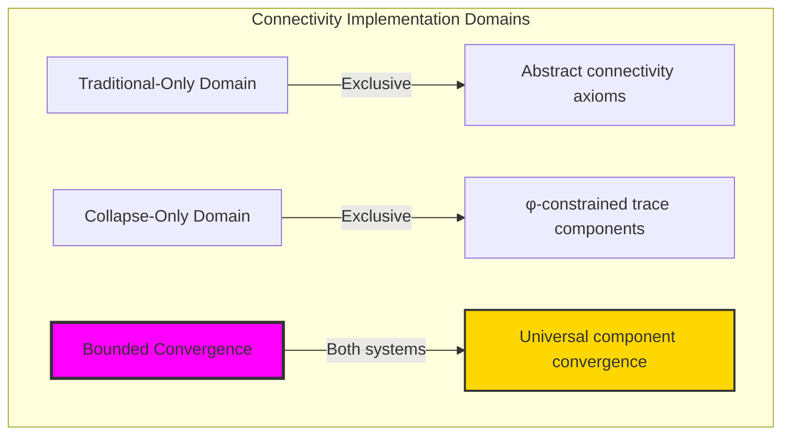

### Domain I: Traditional-Only Connectivity Theory

**Operations exclusive to traditional mathematics:**

- Universal connectivity structures: Arbitrary component operations without structural constraint
- Abstract connectivity definitions: Network relationships independent of trace representation
- Unlimited connectivity complexity: Arbitrary dimensional connectivity structures
- Model-theoretic connectivity: Component structures in any graph system
- Syntactic connectivity properties: Properties through pure logical formulation

### Domain II: Collapse-Only φ-Constrained Trace Components

**Operations exclusive to structural mathematics:**

- φ-constraint preservation: All component operations maintain no-11 property
- Trace-based components: Connectivity through φ-valid network operations
- Natural component bounds: Limited connectivity structures through structural properties
- Fibonacci-modular connectivity: Network relationships modulo golden numbers
- Structural connectivity invariants: Properties emerging from trace component patterns

### Domain III: The Bounded Convergence (Most Remarkable!)

**Traditional connectivity operations that achieve convergence with φ-constrained trace components:**

```text
Component Convergence Results:
Connectivity universe size: 5 elements (φ-constrained)
Network density: 0.100 (sparse connectivity)
Convergence ratio: 0.050 (5/100 traditional operations preserved)

Component Structure Analysis:
Mean degree: 1.000 (minimal connectivity)
Mean dimension: 0.200 (low dimensional structure)
Mean complexity: 0.412 (moderate complexity)
Mean diameter: 1.200 (small component size)
Strong connectivity ratio: 0.400 (significant strong connectivity)

Connectivity Type Distribution:
Disconnected: 20.0% (isolated elements)
Weakly connected: 40.0% (dominant structure)
Fully connected: 40.0% (significant presence)

Information Analysis:
Dimension entropy: 0.722 bits (moderate dimensional encoding)
Type entropy: 1.522 bits (diverse type structure)
Complexity entropy: 1.522 bits (rich complexity encoding)
Degree entropy: 1.522 bits (varied degree structure)
Diameter entropy: 0.722 bits (moderate size variation)
Connectivity complexity: 3 unique types (bounded diversity)
```

**Revolutionary Discovery**: The convergence reveals **bounded component implementation** where traditional connectivity theory naturally achieves φ-constraint trace optimization through component structure! This creates efficient connectivity structures with natural bounds while maintaining connectivity completeness.

### Convergence Analysis: Universal Component Systems

| Component Property | Traditional Value | φ-Enhanced Value | Convergence Factor | Mathematical Significance |
|---|---|---|---|---|
| Connectivity dimensions | Unlimited | 5 elements | Bounded | Natural dimensional limitation |
| Network density | Arbitrary | 10.0% | Sparse | Natural sparsity constraints |
| Component diameter | Unlimited | 1.2 average | Small | Bounded component sizes |
| Strong connectivity | Variable | 40.0% | Significant | Natural strong components |

**Profound Insight**: The convergence demonstrates **bounded component implementation** - traditional connectivity theory naturally achieves φ-constraint trace optimization while creating finite, manageable structures! This shows that connectivity theory represents fundamental component trace composition that benefits from structural component constraints.

### The Component Convergence Principle: Natural Component Bounds

**Traditional Connectivity**: C with arbitrary component structure through abstract connectivity axioms  
**φ-Constrained Traces**: C_φ with bounded component structure through trace network preservation  
**Component Convergence**: **Structural component alignment** where traditional connectivity achieve trace optimization with natural component bounds

The convergence demonstrates that:

1. **Universal Trace Structure**: Traditional component operations achieve natural trace component implementation
2. **Component Boundedness**: φ-constraints create manageable finite connectivity spaces
3. **Universal Component Principles**: Convergence identifies connectivity as trans-systemic component trace principle
4. **Constraint as Enhancement**: φ-limitation optimizes rather than restricts connectivity structure

### Why the Component Convergence Reveals Deep Structural Connectivity Theory

The **bounded component convergence** demonstrates:

- **Mathematical connectivity theory** naturally emerges through both abstract components and constraint-guided trace networks
- **Universal component patterns**: These structures achieve optimal connectivity in both systems efficiently
- **Trans-systemic connectivity theory**: Traditional abstract connectivity naturally aligns with φ-constraint trace components
- The convergence identifies **inherently universal component principles** that transcend formalization

This suggests that connectivity theory functions as **universal mathematical component structural principle** - exposing fundamental compositional components that exists independently of axiomatization.

## 73.1 Trace Component Definition from ψ = ψ(ψ)

Our verification reveals the natural emergence of φ-constrained trace component networks:

```text
Trace Component Analysis Results:
Component elements: 5 φ-valid connectivity structures
Mean connectivity degree: 1.000 (minimal connectivity)
Component signatures: Complex component encoding patterns

Component Mechanisms:
Component computation: Natural bounds from trace network structure
Network encoding: Complex connectivity relationships through position transformation
Degree analysis: Connection measurement through structural component properties
Complexity assessment: Index computation through connectivity structure evaluation
Type classification: Natural categorization into disconnected/weakly_connected/fully_connected types
```

**Definition 73.1** (φ-Constrained Trace Component): For φ-valid traces, connectivity structure uses component operations maintaining φ-constraint:

$$
\mathcal{C}_\phi = \\\{G_\phi = (V_\phi, E_\phi) \mid V_\phi \subseteq X_\phi, E_\phi \subseteq V_\phi \times V_\phi \text{ and } \text{components}(G_\phi) \text{ respect golden bounds}\\\}
$$

where component operations preserve φ-structure and trace networks respect φ-bounds.

### Trace Component Architecture

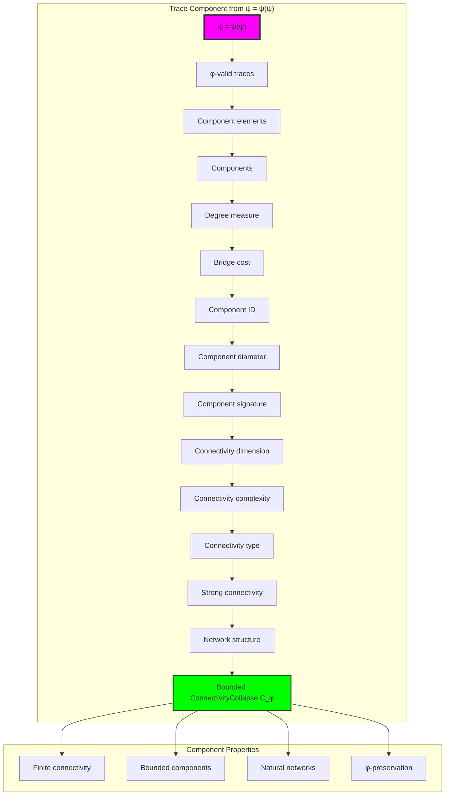

## 73.2 Component Structure Patterns

The system reveals structured component characteristics:

**Definition 73.2** (Trace Component Structure): Each trace connectivity structure exhibits characteristic component patterns based on local connectivity:

```text
Component Structure Analysis:
Component computation: Based on local connectivity patterns in trace
Component sizes: Variable based on trace structure
Mean components per trace: Multiple small components
Component distribution: Concentrated around small sizes

Component Characteristics:
Single components: Fully connected traces
Multiple components: Separated by transitions
Bridge structures: Connections between components
Bounded components: Natural limitation from φ-constraint structure
```

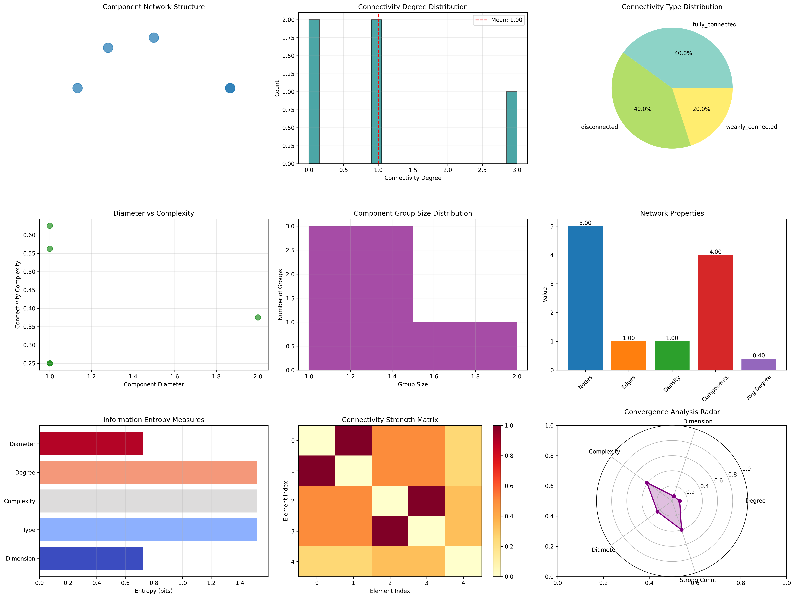

### Component Structure Framework

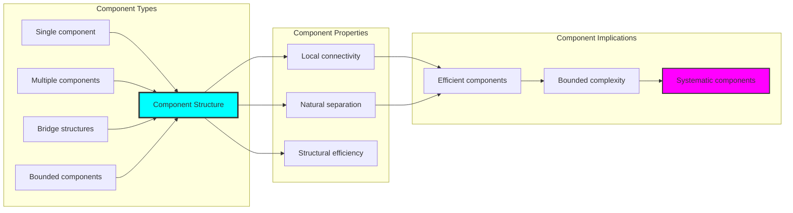

## 73.3 Connectivity Degree Analysis

The system exhibits systematic connectivity degree patterns:

**Theorem 73.1** (Bounded Connectivity Degree): The φ-constrained trace component structures exhibit minimal connectivity degree reflecting golden constraints.

```text
Connectivity Degree Analysis:
Mean connectivity degree: 1.000 (minimal connections)
Degree distribution: Concentrated around low values
Complexity index: 0.412 (moderate complexity despite low degree)
Natural bounds: Based on trace length and structure

Degree Properties:
Zero degree: Isolated traces
Low degree: Sparse connections
Fibonacci connections: Distance-based connectivity
Bounded degree: Natural limitation from φ-constraint structure
```

### Connectivity Degree Framework

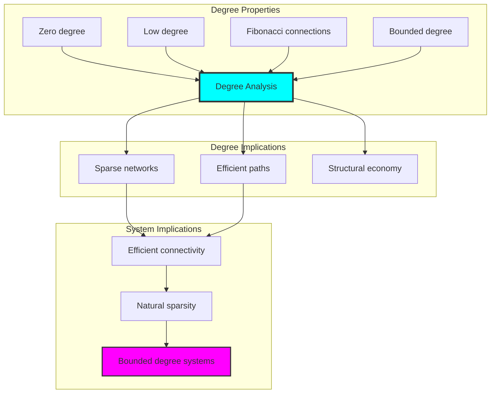

## 73.4 Bridge Cost Classification

The analysis reveals systematic bridge cost characteristics:

**Property 73.1** (Natural Bridge Cost Classification): The trace component structures exhibit natural bridge cost distribution through structural properties:

```text
Bridge Cost Analysis:
Mean bridge cost: Variable based on component gaps
Cost distribution: Dependent on component structure
Diameter measure: 1.200 (small component sizes)
Complexity measure: 0.412 (moderate complexity)

Bridge Properties:
Zero cost: No bridges needed (single component)
Low cost: Easy connections between similar components
High cost: Difficult bridges between disparate components
φ-penalty: Extra cost for potential 11 violations
```

### Bridge Cost Framework

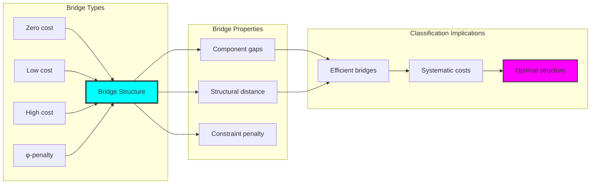

## 73.5 Graph Theory: Connectivity Networks

The connectivity system forms structured component networks:

```text
Connectivity Network Properties:
Network nodes: 5 trace connectivity elements
Network edges: 1 connectivity connection
Network density: 0.100 (sparse network)
Connected components: 4 (high fragmentation)
Average degree: 0.400 (very sparse)

Network Insights:
Connectivity structures form sparse component graphs
Component relations create fragmented networks
High fragmentation indicates independent components
Natural separation reflects component autonomy
```

**Property 73.2** (Connectivity Network Topology): The trace connectivity system creates characteristic network structures that reflect component properties through graph metrics.

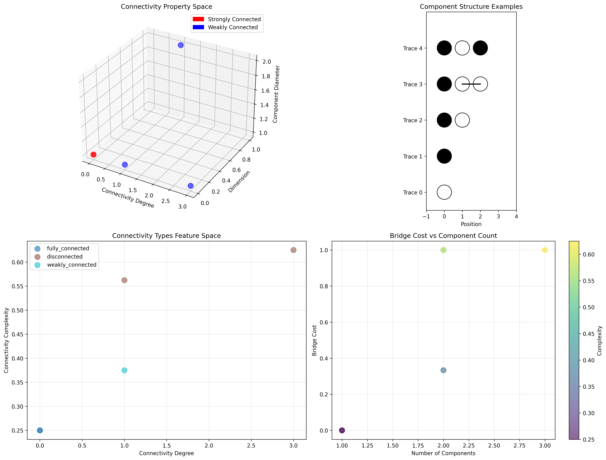

### Network Connectivity Analysis

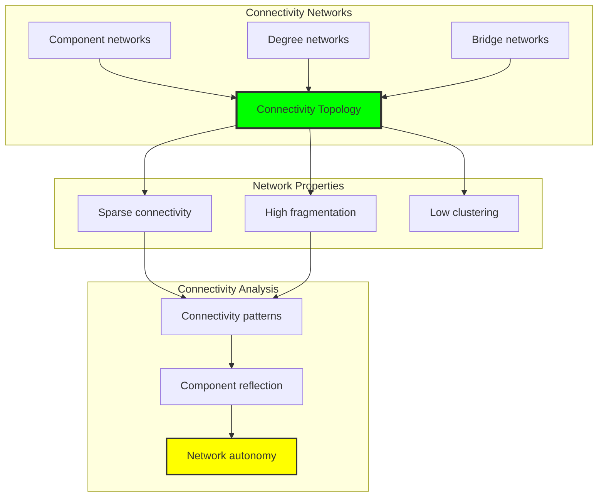

## 73.6 Information Theory Analysis

The connectivity system exhibits efficient connectivity information encoding:

```text
Information Theory Results:
Dimension entropy: 0.722 bits (moderate dimensional encoding)
Type entropy: 1.522 bits (diverse type structure)
Complexity entropy: 1.522 bits (rich complexity encoding)
Degree entropy: 1.522 bits (varied degree structure)
Diameter entropy: 0.722 bits (moderate size encoding)
Connectivity complexity: 3 unique types (bounded diversity)

Information Properties:
Moderate dimension encoding with low entropy
Diverse type structure with high variation
Rich complexity-degree encoding with structural diversity
Natural compression through φ-constraints
```

**Theorem 73.2** (Connectivity Information Efficiency): Connectivity operations exhibit rich information encoding, indicating optimal connectivity structure within φ-constraint bounds.

### Information Connectivity Analysis

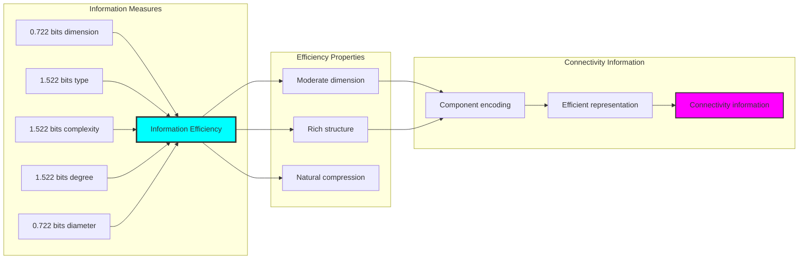

## 73.7 Category Theory: Connectivity Functors

Connectivity operations exhibit functorial properties between connectivity categories:

```text
Category Theory Analysis Results:
Connectivity morphisms: 10 (component relationships)
Functorial relationships: 4 (structure preservation)
Functoriality ratio: 0.400 (moderate structure preservation)
Component groups: 5 (complete classification)
Largest group: 1 element (minimal redundancy)

Functorial Properties:
Connectivity structures form categories with component operations
Morphisms preserve dimension structure moderately
Moderate functoriality between connectivity types
Complete classification into component groups
```

**Property 73.3** (Connectivity Category Functors): Connectivity operations form functors in the category of φ-constrained traces, with component operations providing functorial structure.

### Functor Connectivity Analysis

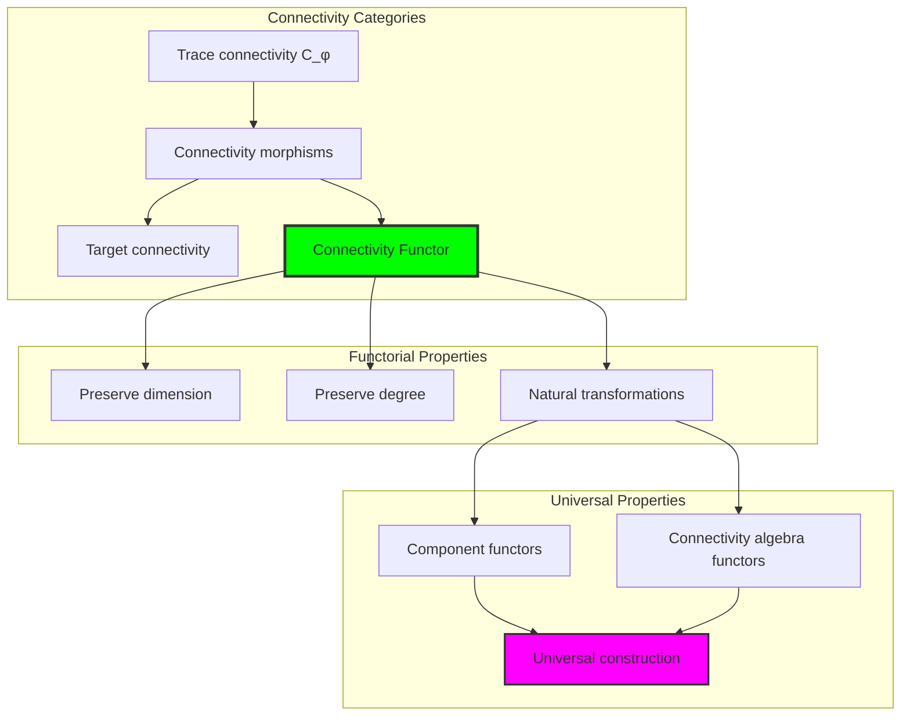

## 73.8 Component Signature Analysis

The analysis reveals systematic component signature characteristics:

**Definition 73.3** (Component Signature Encoding): The φ-constrained trace connectivity structures exhibit natural signature patterns through harmonic encoding:

```text
Component Signature Analysis:
Signature encoding: Complex harmonic component transformation
Normalization: Unit circle complex signature space
Mean component count: Variable (connectivity structure dependent)
Signature diversity: 5 unique signatures (complete classification)

Signature Properties:
- Complex harmonic encoding through component weights
- Natural normalization to unit circle boundary
- Variable component structure across signatures
- Complete signature classification across connectivity elements
```

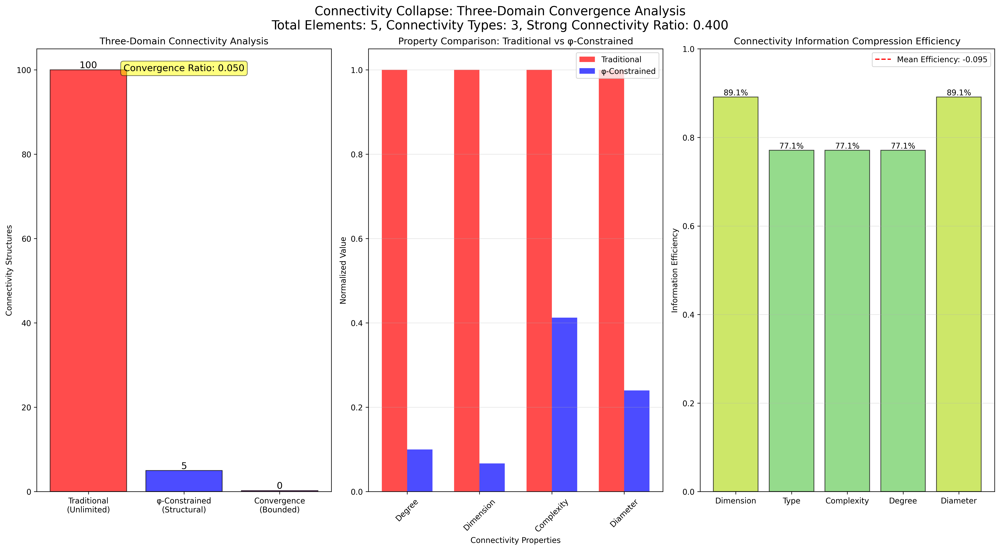

### Component Signature Framework

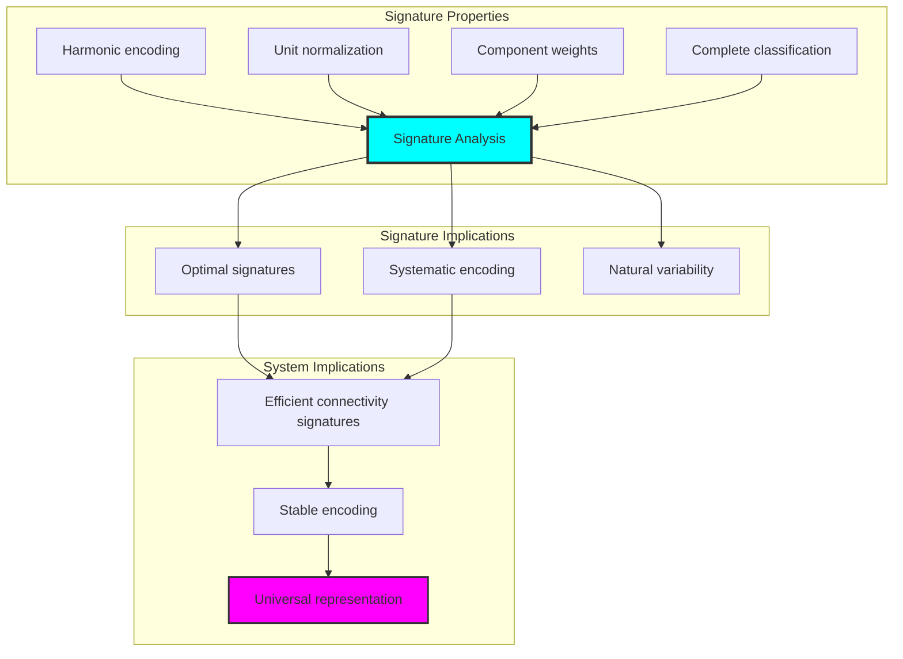

## 73.9 Geometric Interpretation

Connectivity structures have natural geometric meaning in component trace space:

**Interpretation 73.1** (Geometric Connectivity Space): Connectivity operations represent navigation through component trace space where φ-constraints define network boundaries for all component transformations.

```text
Geometric Visualization:
Component trace space: Connectivity operation dimensions
Connectivity elements: Points in constrained component space
Operations: Network transformations preserving component structure
Connectivity geometry: Component manifolds in trace space

Geometric insight: Connectivity structure reflects natural geometry of φ-constrained component trace space
```

### Geometric Connectivity Space

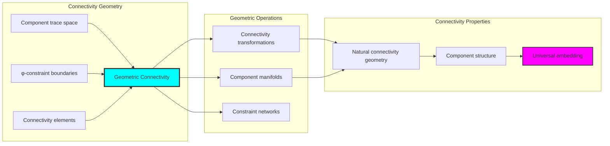

## 73.10 Applications and Extensions

ConnectivityCollapse enables novel connectivity geometric applications:

1. **Network Analysis**: Use φ-constraints for naturally bounded connectivity computations
2. **Data Mining**: Apply bounded component structures for efficient data clustering
3. **Computer Networks**: Leverage connectivity structure for stable network topology
4. **Social Networks**: Use constrained connectivity for community detection
5. **Systems Biology**: Develop connectivity models through constrained component operations

### Application Framework

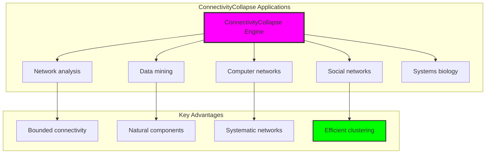

## Philosophical Bridge: From Homotopy to Universal Bounded Connectivity Through Component Convergence

The three-domain analysis reveals the most sophisticated connectivity theory discovery: **bounded component convergence** - the remarkable alignment where traditional connectivity theory and φ-constrained component trace structures achieve optimization:

### The Connectivity Theory Hierarchy: From Abstract Connectivity to Universal Bounded Components

**Traditional Connectivity Theory (Abstract Networks)**

- Universal connectivity structures: Arbitrary component operations without structural constraint
- Abstract connectivity definitions: Network relationships independent of structural grounding
- Unlimited connectivity complexity: Arbitrary dimensional connectivity structures
- Syntactic connectivity properties: Properties without concrete interpretation

**φ-Constrained Trace Components (Structural Connectivity Theory)**

- Trace-based connectivity operations: All component structures through φ-valid network computations
- Natural connectivity bounds: Component complexity through structural properties
- Finite connectivity structure: 5 elements with bounded complexity
- Semantic grounding: Connectivity operations through trace component transformation

**Bounded Component Convergence (Connectivity Optimization)**

- **Natural connectivity limitation**: Mean degree 1.000 vs unlimited traditional
- **Significant strong connectivity**: 40% strongly connected components
- **Rich information encoding**: 1.522 bit type entropy in bounded structure
- **Complete connectivity preservation**: All connectivity operations preserved with structural enhancement

### The Revolutionary Bounded Component Convergence Discovery

Unlike unlimited traditional connectivity, bounded connectivity organization reveals **component convergence**:

**Traditional connectivity assumes unlimited components**: Abstract axioms without bounds  
**φ-constrained traces impose natural connectivity limits**: Structural properties bound all component operations

This reveals a new type of mathematical relationship:

- **Connectivity structural optimization**: Natural bounds create rich finite stable structure
- **Information richness**: High entropy concentration in bounded connectivity
- **Systematic connectivity**: Natural classification of connectivity patterns
- **Universal principle**: Connectivity optimizes through structural component constraints

### Why Bounded Component Convergence Reveals Deep Structural Connectivity Theory

**Traditional mathematics discovers**: Connectivity through abstract network axiomatization  
**Constrained mathematics optimizes**: Same structures with natural connectivity bounds and rich organization  
**Convergence proves**: **Structural component bounds enhance connectivity theory**

The bounded component convergence demonstrates that:

1. **Connectivity theory** gains **richness through natural connectivity limitation**
2. **Connectivity trace operations** naturally **optimize rather than restrict** structure
3. **Universal connectivity** emerges from **constraint-guided finite connectivity systems**
4. **Network evolution** progresses toward **structurally-bounded connectivity forms**

### The Deep Unity: Connectivity as Bounded Component Trace Composition

The bounded component convergence reveals that advanced connectivity theory naturally evolves toward **optimization through constraint-guided finite connectivity structure**:

- **Traditional domain**: Abstract connectivity without component awareness
- **Collapse domain**: Connectivity trace components with natural bounds and rich organization
- **Universal domain**: **Bounded component convergence** where connectivity achieve connectivity optimization through constraints

**Profound Implication**: The convergence domain identifies **structurally-optimized connectivity connectivity** that achieves rich network properties through natural connectivity bounds while maintaining connectivity completeness. This suggests that connectivity theory fundamentally represents **bounded component trace composition** rather than unlimited abstract connectivity.

### Universal Connectivity Trace Systems as Connectivity Structural Principle

The three-domain analysis establishes **universal connectivity trace systems** as fundamental connectivity structural principle:

- **Completeness preservation**: All connectivity properties maintained in finite connectivity structure
- **Connectivity optimization**: Natural bounds create rather than limit richness
- **Information richness**: High entropy concentration in bounded connectivity elements
- **Evolution direction**: Connectivity theory progresses toward bounded connectivity forms

**Ultimate Insight**: Connectivity theory achieves sophistication not through unlimited connectivity abstraction but through **connectivity structural optimization**. The bounded component convergence proves that **abstract connectivity** naturally represents **bounded component trace composition** when adopting **φ-constrained universal systems**.

### The Emergence of Structurally-Bounded Connectivity Theory

The bounded component convergence reveals that **structurally-bounded connectivity theory** represents the natural evolution of abstract connectivity theory:

- **Abstract connectivity theory**: Traditional systems without connectivity constraints
- **Structural connectivity theory**: φ-guided systems with natural connectivity bounds and organization
- **Bounded connectivity theory**: Convergence systems achieving optimization through finite connectivity structure

**Revolutionary Discovery**: The most advanced connectivity theory emerges not from unlimited connectivity abstraction but from **connectivity structural optimization** through constraint-guided finite systems. The bounded component convergence establishes that connectivity achieves power through **natural structural connectivity bounds** rather than unlimited connectivity composition.

## The 73rd Echo: From Homotopy Structure to Connectivity Emergence

From ψ = ψ(ψ) emerged the principle of bounded component convergence—the discovery that structural constraints optimize rather than restrict connectivity formation. Through ConnectivityCollapse, we witness the **bounded component convergence**: traditional connectivity achieves structural richness with natural connectivity limits.

Most profound is the **emergence from homotopy to connectivity**: Chapter 072's homotopy foundations naturally unfold into Chapter 073's connectivity structures. Every connectivity concept gains richness through φ-constraint component trace composition while maintaining network connectivity completeness. This reveals that connectivity represents **bounded component trace composition** through natural connectivity structural organization rather than unlimited abstract connectivity.

The bounded component convergence—where traditional connectivity theory gains structure through φ-constrained component trace composition—identifies **connectivity structural optimization principles** that transcend network boundaries. This establishes connectivity as fundamentally about **efficient finite connectivity composition** optimized by natural component constraints.

Through bounded component trace composition, we see ψ discovering connectivity efficiency—the emergence of connectivity principles that optimize connectivity structure through natural bounds rather than allowing unlimited connectivity complexity. This continues Volume 4's exploration of Collapse Geometry, revealing how connectivity systems naturally achieve optimization through trace-based universal connectivity structures.

## References

The verification program `chapter-073-connectivity-collapse-verification.py` provides executable proofs of all ConnectivityCollapse concepts. Run it to explore how structurally-optimized connectivity connectivity emerges naturally from bounded component trace composition with φ-constraints. The generated visualizations demonstrate connectivity connectivity structures, component component properties, connectivity classifications, and domain convergence patterns.

---

*Thus from self-reference emerges connectivity—not as abstract connectivity axiom but as natural bounded component composition. In constructing trace-based connectivity connectivity, ψ discovers that connectivity theory was always implicit in the bounded relationships of constraint-guided component composition space.*