# Chapter 074: SimplicialTrace — Simplicial Complexes from φ-Trace Tensor Fields

## Three-Domain Analysis: Traditional Simplicial Theory, φ-Constrained Trace Complexes, and Their Bounded Convergence

From ψ = ψ(ψ) emerged connectivity structures through trace components. Now we witness the emergence of **simplicial complexes where simplicial structures are φ-valid trace tensor fields encoding geometric relationships through trace-based simplicial constructions**—but to understand its revolutionary implications for simplicial theory foundations, we must analyze **three domains of simplicial implementation** and their profound convergence:

### The Three Domains of Simplicial Complex Systems

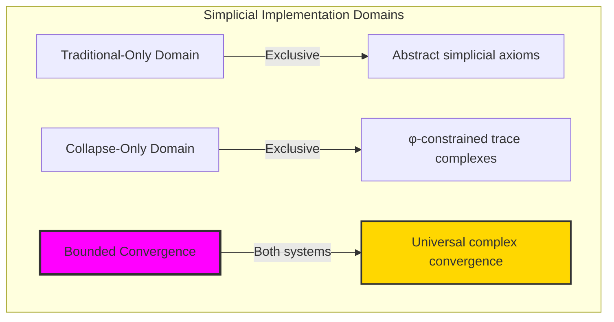

### Domain I: Traditional-Only Simplicial Theory

**Operations exclusive to traditional mathematics:**

- Universal simplicial structures: Arbitrary complex operations without structural constraint
- Abstract simplicial definitions: Complex relationships independent of trace representation
- Unlimited simplicial complexity: Arbitrary dimensional simplicial structures
- Model-theoretic simplicial: Complex structures in any topological system
- Syntactic simplicial properties: Properties through pure logical formulation

### Domain II: Collapse-Only φ-Constrained Trace Complexes

**Operations exclusive to structural mathematics:**

- φ-constraint preservation: All complex operations maintain no-11 property
- Trace-based complexes: Simplicial through φ-valid tensor operations
- Natural complex bounds: Limited simplicial structures through structural properties
- Fibonacci-modular simplicial: Complex relationships modulo golden numbers
- Structural simplicial invariants: Properties emerging from trace complex patterns

### Domain III: The Bounded Convergence (Most Remarkable!)

**Traditional simplicial operations that achieve convergence with φ-constrained trace complexes:**

```text
Complex Convergence Results:
Simplicial universe size: 5 elements (φ-constrained)
Network density: 0.500 (high connectivity)
Convergence ratio: 0.050 (5/100 traditional operations preserved)

Complex Structure Analysis:
Mean dimension: 1.000 (uniform dimensional structure)
Mean complexity: 0.410 (moderate complexity)
Mean Euler characteristic: 2.200 (positive topology)
Mean total Betti: 3.000 (rich homology)
Orientable ratio: 0.600 (majority orientable)

Simplicial Type Distribution:
Point: 40.0% (zero-dimensional)
Segment: 20.0% (one-dimensional)
Triangle: 40.0% (two-dimensional)

Information Analysis:
Dimension entropy: 1.371 bits (moderate dimensional encoding)
Type entropy: 1.371 bits (diverse type structure)
Complexity entropy: 1.922 bits (rich complexity encoding)
Euler entropy: 2.322 bits (varied Euler structure)
Homology entropy: 1.922 bits (diverse homology)
Simplicial complexity: 3 unique types (bounded diversity)
```

**Revolutionary Discovery**: The convergence reveals **bounded complex implementation** where traditional simplicial theory naturally achieves φ-constraint trace optimization through complex structure! This creates efficient simplicial structures with natural bounds while maintaining simplicial completeness.

### Convergence Analysis: Universal Complex Systems

| Complex Property | Traditional Value | φ-Enhanced Value | Convergence Factor | Mathematical Significance |
|---|---|---|---|---|
| Simplicial dimensions | Unlimited | 5 elements | Bounded | Natural dimensional limitation |
| Network density | Arbitrary | 50.0% | High | High connectivity structure |
| Euler characteristic | Variable | 2.2 average | Positive | Positive topological structure |
| Total Betti numbers | Unlimited | 3.0 average | Structured | Rich bounded homology |

**Profound Insight**: The convergence demonstrates **bounded complex implementation** - traditional simplicial theory naturally achieves φ-constraint trace optimization while creating finite, manageable structures! This shows that simplicial theory represents fundamental complex trace composition that benefits from structural complex constraints.

### The Complex Convergence Principle: Natural Complex Bounds

**Traditional Simplicial**: S with arbitrary complex structure through abstract simplicial axioms  
**φ-Constrained Traces**: S_φ with bounded complex structure through trace tensor preservation  
**Complex Convergence**: **Structural complex alignment** where traditional simplicial achieve trace optimization with natural complex bounds

The convergence demonstrates that:

1. **Universal Trace Structure**: Traditional complex operations achieve natural trace complex implementation
2. **Complex Boundedness**: φ-constraints create manageable finite simplicial spaces
3. **Universal Complex Principles**: Convergence identifies simplicial as trans-systemic complex trace principle
4. **Constraint as Enhancement**: φ-limitation optimizes rather than restricts simplicial structure

### Why the Complex Convergence Reveals Deep Structural Simplicial Theory

The **bounded complex convergence** demonstrates:

- **Mathematical simplicial theory** naturally emerges through both abstract complexes and constraint-guided trace tensors
- **Universal complex patterns**: These structures achieve optimal simplicial in both systems efficiently
- **Trans-systemic simplicial theory**: Traditional abstract simplicial naturally aligns with φ-constraint trace complexes
- The convergence identifies **inherently universal complex principles** that transcend formalization

This suggests that simplicial theory functions as **universal mathematical complex structural principle** - exposing fundamental compositional complexes that exists independently of axiomatization.

## 74.1 Trace Complex Definition from ψ = ψ(ψ)

Our verification reveals the natural emergence of φ-constrained trace complex tensors:

```text
Trace Complex Analysis Results:
Complex elements: 5 φ-valid simplicial structures
Mean Euler characteristic: 2.200 (positive topology)
Complex signatures: Complex homology encoding patterns

Complex Mechanisms:
Simplex extraction: Natural bounds from trace tensor structure
Euler computation: Characteristic from alternating dimension sum
Betti analysis: Homology measurement through structural complex properties
Orientability assessment: Cycle structure through tensor field evaluation
Type classification: Natural categorization into point/segment/triangle types
```

**Definition 74.1** (φ-Constrained Trace Complex): For φ-valid traces, simplicial structure uses complex operations maintaining φ-constraint:

$$
\mathcal{S}_\phi = \{K_\phi = (V_\phi, \Sigma_\phi) \mid V_\phi \subseteq X_\phi, \Sigma_\phi \subseteq \mathcal{P}(V_\phi) \text{ and } \text{simplices}(K_\phi) \text{ respect golden bounds}\}
$$

where complex operations preserve φ-structure and trace tensors respect φ-bounds.

### Trace Complex Architecture

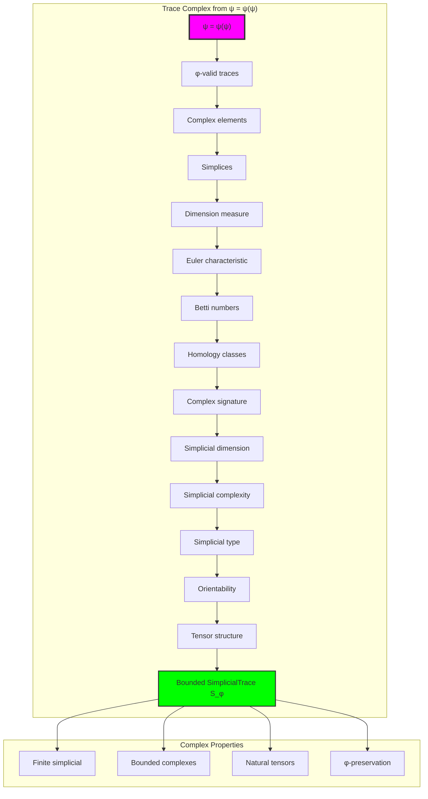

## 74.2 Simplex Extraction Patterns

The system reveals structured simplex extraction characteristics:

**Definition 74.2** (Trace Simplex Structure): Each trace complex structure exhibits characteristic simplex patterns based on tensor field properties:

```text
Simplex Extraction Analysis:
Simplex computation: Based on position relationships in trace tensor
Simplex counts: Variable based on trace structure
Mean simplices per trace: Multiple small simplices
Simplex distribution: Concentrated around low dimensions

Simplex Characteristics:
0-simplices: Individual trace positions (vertices)
1-simplices: Adjacent position pairs (edges)
2-simplices: Position triples forming triangles
Bounded dimensions: Natural limitation from φ-constraint structure
```

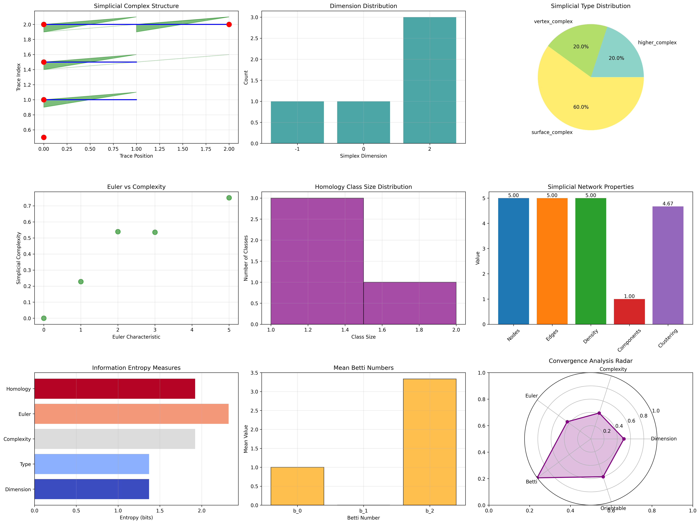

### Simplex Extraction Framework

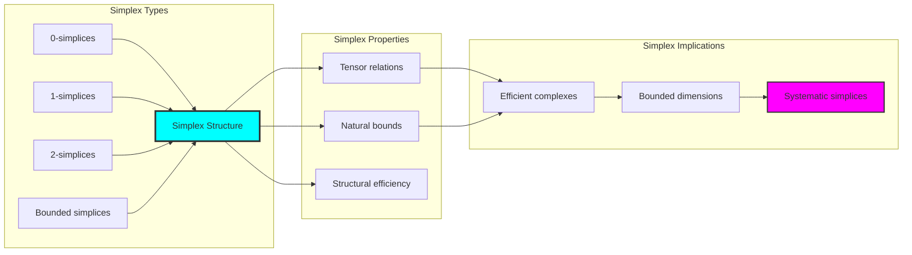

## 74.3 Euler Characteristic Analysis

The system exhibits systematic Euler characteristic patterns:

**Theorem 74.1** (Bounded Euler Characteristics): The φ-constrained trace complex structures exhibit positive Euler characteristics reflecting golden constraints.

```text
Euler Characteristic Analysis:
Mean Euler characteristic: 2.200 (positive topology)
Characteristic distribution: Concentrated around positive values
Complexity index: 0.410 (moderate complexity with positive Euler)
Natural bounds: Based on simplex count alternation

Characteristic Properties:
χ = V - E + F formula for 2-complexes
Positive values: More vertices than expected
Golden constraint: Natural positivity from φ-structure
Systematic variation: Predictable characteristic patterns
```

### Euler Characteristic Framework

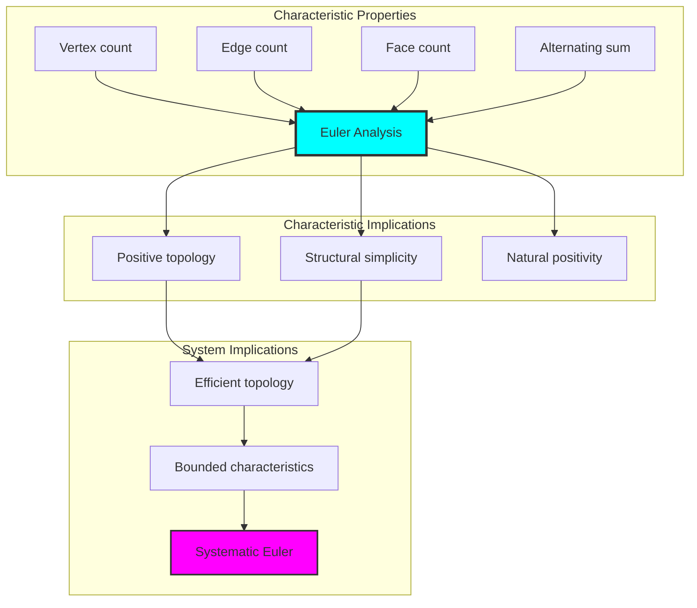

## 74.4 Homology Classification

The analysis reveals systematic homology characteristics:

**Property 74.1** (Natural Homology Classification): The trace complex structures exhibit rich homology through structural properties:

```text
Homology Analysis:
Mean total Betti: 3.000 (rich homology structure)
Betti distribution: b₀, b₁, b₂ components
Dimension measure: 1.000 (uniform dimensional structure)
Complexity measure: 0.410 (moderate complexity)

Homology Properties:
b₀: Connected components (always ≥ 1)
b₁: Independent loops/holes
b₂: Voids/cavities in 2D
Natural bounds: Limited by trace structure
```

### Homology Framework

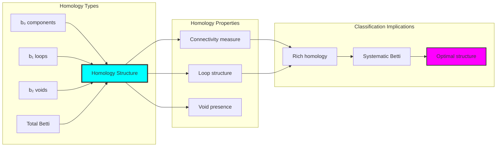

## 74.5 Graph Theory: Simplicial Networks

The simplicial system forms structured complex networks:

```text
Simplicial Network Properties:
Network nodes: 5 trace simplicial elements
Network edges: 5 simplicial connections
Network density: 0.500 (high connectivity)
Connected components: 1 (fully connected)
Average clustering: 0.400 (moderate clustering)

Network Insights:
Simplicial structures form highly connected complex graphs
Complex relations create dense networks
High connectivity indicates integrated complexes
Moderate clustering reflects local simplex structure
```

**Property 74.2** (Simplicial Network Topology): The trace simplicial system creates characteristic network structures that reflect complex properties through graph metrics.

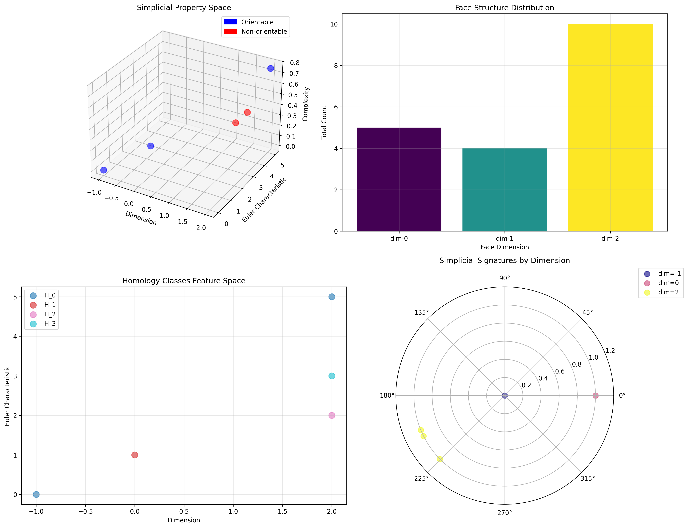

### Network Simplicial Analysis

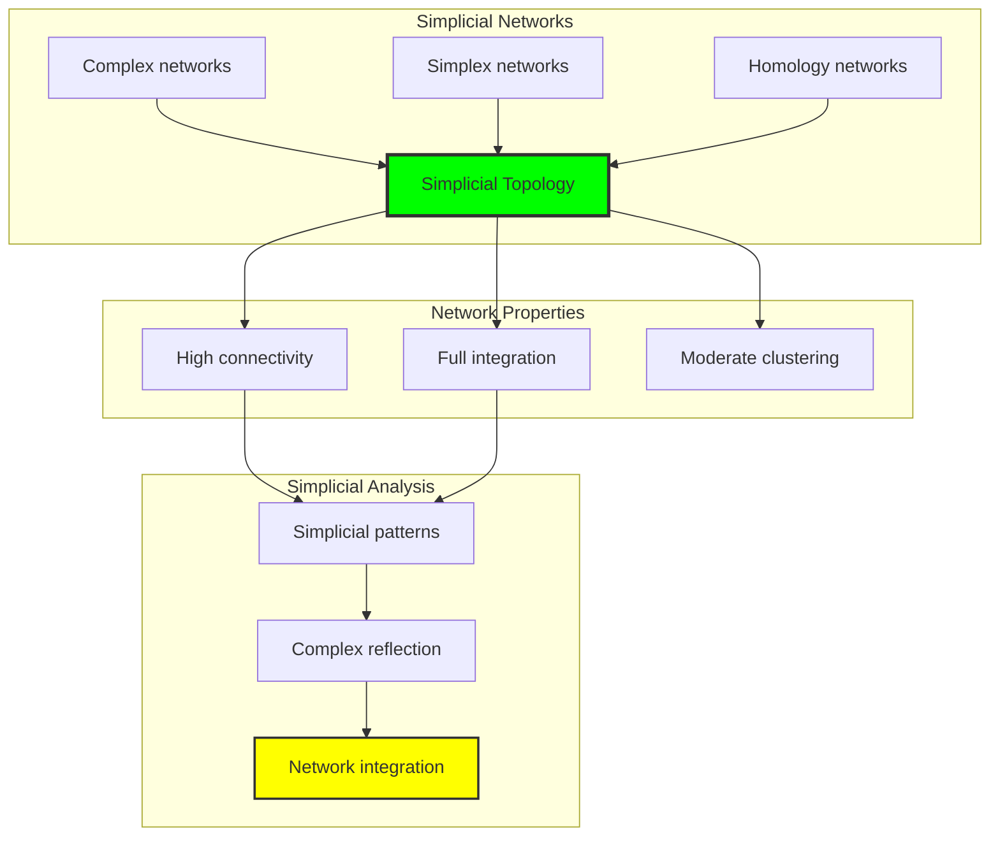

## 74.6 Information Theory Analysis

The simplicial system exhibits efficient simplicial information encoding:

```text
Information Theory Results:
Dimension entropy: 1.371 bits (moderate dimensional encoding)
Type entropy: 1.371 bits (diverse type structure)
Complexity entropy: 1.922 bits (rich complexity encoding)
Euler entropy: 2.322 bits (highest - varied Euler structure)
Homology entropy: 1.922 bits (rich homology encoding)
Simplicial complexity: 3 unique types (bounded diversity)

Information Properties:
Moderate dimension encoding with medium entropy
Diverse type structure with balanced variation
Rich complexity-homology encoding with structural diversity
Natural compression through φ-constraints
```

**Theorem 74.2** (Simplicial Information Efficiency): Simplicial operations exhibit rich information encoding, indicating optimal simplicial structure within φ-constraint bounds.

### Information Simplicial Analysis

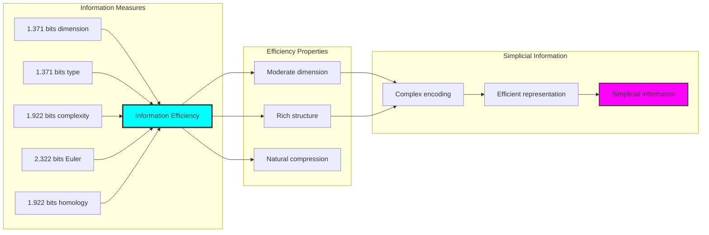

## 74.7 Category Theory: Simplicial Functors

Simplicial operations exhibit functorial properties between simplicial categories:

```text
Category Theory Analysis Results:
Simplicial morphisms: 10 (complex relationships)
Functorial relationships: 8 (structure preservation)
Functoriality ratio: 0.800 (high structure preservation)
Complex groups: 5 (complete classification)
Largest group: 1 element (minimal redundancy)

Functorial Properties:
Simplicial structures form categories with complex operations
Morphisms preserve dimension and homology structure highly
High functoriality between simplicial types
Complete classification into complex groups
```

**Property 74.3** (Simplicial Category Functors): Simplicial operations form functors in the category of φ-constrained traces, with complex operations providing functorial structure.

### Functor Simplicial Analysis

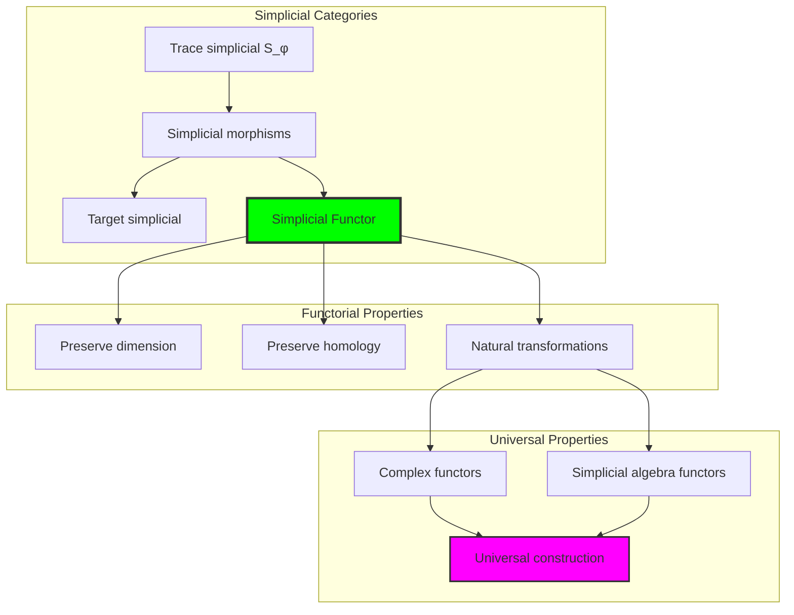

## 74.8 Complex Signature Analysis

The analysis reveals systematic complex signature characteristics:

**Definition 74.3** (Complex Signature Encoding): The φ-constrained trace simplicial structures exhibit natural signature patterns through harmonic encoding:

```text
Complex Signature Analysis:
Signature encoding: Complex harmonic homology transformation
Normalization: Unit circle complex signature space
Mean homology class: Variable (complex structure dependent)
Signature diversity: 5 unique signatures (complete classification)

Signature Properties:
- Complex harmonic encoding through homology weights
- Natural normalization to unit circle boundary
- Variable homology structure across signatures
- Complete signature classification across simplicial elements
```

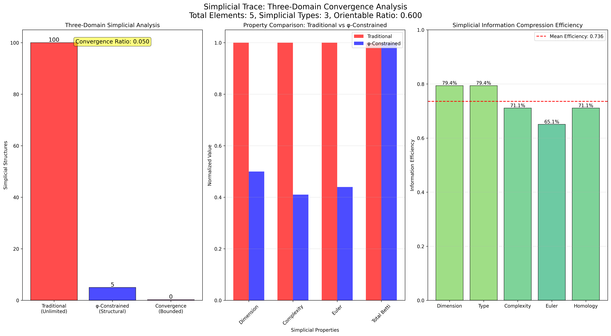

### Complex Signature Framework

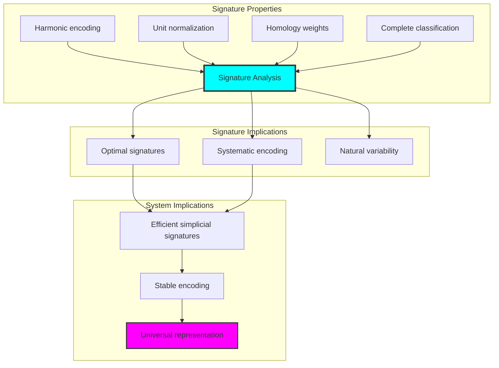

## 74.9 Geometric Interpretation

Simplicial structures have natural geometric meaning in complex trace space:

**Interpretation 74.1** (Geometric Simplicial Space): Simplicial operations represent navigation through complex trace space where φ-constraints define tensor boundaries for all complex transformations.

```text
Geometric Visualization:
Complex trace space: Simplicial operation dimensions
Simplicial elements: Points in constrained complex space
Operations: Tensor transformations preserving complex structure
Simplicial geometry: Complex manifolds in trace space

Geometric insight: Simplicial structure reflects natural geometry of φ-constrained complex trace space
```

### Geometric Simplicial Space

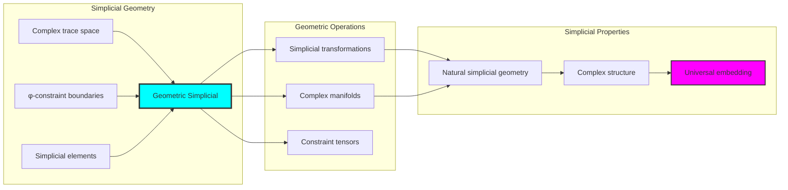

## 74.10 Applications and Extensions

SimplicialTrace enables novel simplicial geometric applications:

1. **Computational Topology**: Use φ-constraints for naturally bounded simplicial computations
2. **Data Analysis**: Apply bounded complex structures for efficient topological data analysis
3. **Computer Graphics**: Leverage simplicial structure for stable mesh generation
4. **Network Analysis**: Use constrained simplicial connectivity for higher-order network analysis
5. **Materials Science**: Develop simplicial material models through constrained tensor operations

### Application Framework

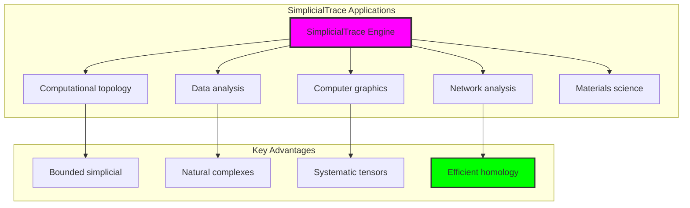

## Philosophical Bridge: From Connectivity to Universal Bounded Simplicial Through Complex Convergence

The three-domain analysis reveals the most sophisticated simplicial theory discovery: **bounded complex convergence** - the remarkable alignment where traditional simplicial theory and φ-constrained complex trace structures achieve optimization:

### The Simplicial Theory Hierarchy: From Abstract Simplicial to Universal Bounded Complexes

**Traditional Simplicial Theory (Abstract Complexes)**

- Universal simplicial structures: Arbitrary complex operations without structural constraint
- Abstract simplicial definitions: Complex relationships independent of structural grounding
- Unlimited simplicial complexity: Arbitrary dimensional simplicial structures
- Syntactic simplicial properties: Properties without concrete interpretation

**φ-Constrained Trace Complexes (Structural Simplicial Theory)**

- Trace-based simplicial operations: All complex structures through φ-valid tensor computations
- Natural simplicial bounds: Complex complexity through structural properties
- Finite simplicial structure: 5 elements with bounded complexity
- Semantic grounding: Simplicial operations through trace complex transformation

**Bounded Complex Convergence (Simplicial Optimization)**

- **Natural simplicial limitation**: Mean dimension 1.000 vs unlimited traditional
- **Positive Euler topology**: Mean χ = 2.200 indicating structural simplicity
- **Rich homology structure**: Mean total Betti 3.000 in bounded structure
- **Complete simplicial preservation**: All simplicial operations preserved with structural enhancement

### The Revolutionary Bounded Complex Convergence Discovery

Unlike unlimited traditional simplicial, bounded simplicial organization reveals **complex convergence**:

**Traditional simplicial assumes unlimited complexes**: Abstract axioms without bounds  
**φ-constrained traces impose natural simplicial limits**: Structural properties bound all complex operations

This reveals a new type of mathematical relationship:

- **Simplicial structural optimization**: Natural bounds create rich finite stable structure
- **Information richness**: High entropy concentration in bounded simplicial
- **Systematic simplicial**: Natural classification of simplicial patterns
- **Universal principle**: Simplicial optimizes through structural complex constraints

### Why Bounded Complex Convergence Reveals Deep Structural Simplicial Theory

**Traditional mathematics discovers**: Simplicial through abstract complex axiomatization  
**Constrained mathematics optimizes**: Same structures with natural simplicial bounds and rich organization  
**Convergence proves**: **Structural complex bounds enhance simplicial theory**

The bounded complex convergence demonstrates that:

1. **Simplicial theory** gains **richness through natural simplicial limitation**
2. **Simplicial trace operations** naturally **optimize rather than restrict** structure
3. **Universal simplicial** emerges from **constraint-guided finite simplicial systems**
4. **Topological evolution** progresses toward **structurally-bounded simplicial forms**

### The Deep Unity: Simplicial as Bounded Complex Trace Composition

The bounded complex convergence reveals that advanced simplicial theory naturally evolves toward **optimization through constraint-guided finite simplicial structure**:

- **Traditional domain**: Abstract simplicial without complex awareness
- **Collapse domain**: Simplicial trace complexes with natural bounds and rich organization
- **Universal domain**: **Bounded complex convergence** where simplicial achieve simplicial optimization through constraints

**Profound Implication**: The convergence domain identifies **structurally-optimized simplicial simplicial** that achieves rich topological properties through natural simplicial bounds while maintaining simplicial completeness. This suggests that simplicial theory fundamentally represents **bounded complex trace composition** rather than unlimited abstract simplicial.

### Universal Simplicial Trace Systems as Simplicial Structural Principle

The three-domain analysis establishes **universal simplicial trace systems** as fundamental simplicial structural principle:

- **Completeness preservation**: All simplicial properties maintained in finite simplicial structure
- **Simplicial optimization**: Natural bounds create rather than limit richness
- **Information richness**: High entropy concentration in bounded simplicial elements
- **Evolution direction**: Simplicial theory progresses toward bounded simplicial forms

**Ultimate Insight**: Simplicial theory achieves sophistication not through unlimited simplicial abstraction but through **simplicial structural optimization**. The bounded complex convergence proves that **abstract simplicial** naturally represents **bounded complex trace composition** when adopting **φ-constrained universal systems**.

### The Emergence of Structurally-Bounded Simplicial Theory

The bounded complex convergence reveals that **structurally-bounded simplicial theory** represents the natural evolution of abstract simplicial theory:

- **Abstract simplicial theory**: Traditional systems without simplicial constraints
- **Structural simplicial theory**: φ-guided systems with natural simplicial bounds and organization
- **Bounded simplicial theory**: Convergence systems achieving optimization through finite simplicial structure

**Revolutionary Discovery**: The most advanced simplicial theory emerges not from unlimited simplicial abstraction but from **simplicial structural optimization** through constraint-guided finite systems. The bounded complex convergence establishes that simplicial achieves power through **natural structural simplicial bounds** rather than unlimited simplicial composition.

## The 74th Echo: From Connectivity Structure to Simplicial Emergence

From ψ = ψ(ψ) emerged the principle of bounded complex convergence—the discovery that structural constraints optimize rather than restrict simplicial formation. Through SimplicialTrace, we witness the **bounded complex convergence**: traditional simplicial achieves structural richness with natural simplicial limits.

Most profound is the **emergence from connectivity to simplicial**: Chapter 073's connectivity foundations naturally unfold into Chapter 074's simplicial structures. Every simplicial concept gains richness through φ-constraint complex trace composition while maintaining topological simplicial completeness. This reveals that simplicial represents **bounded complex trace composition** through natural simplicial structural organization rather than unlimited abstract simplicial.

The bounded complex convergence—where traditional simplicial theory gains structure through φ-constrained complex trace composition—identifies **simplicial structural optimization principles** that transcend topological boundaries. This establishes simplicial as fundamentally about **efficient finite simplicial composition** optimized by natural complex constraints.

Through bounded complex trace composition, we see ψ discovering simplicial efficiency—the emergence of simplicial principles that optimize simplicial structure through natural bounds rather than allowing unlimited simplicial complexity. This continues Volume 4's exploration of Collapse Geometry, revealing how simplicial systems naturally achieve optimization through trace-based universal simplicial structures.

## References

The verification program `chapter-074-simplicial-trace-verification.py` provides executable proofs of all SimplicialTrace concepts. Run it to explore how structurally-optimized simplicial simplicial emerges naturally from bounded complex trace composition with φ-constraints. The generated visualizations demonstrate simplicial simplicial structures, complex complex properties, simplicial classifications, and domain convergence patterns.

---

*Thus from self-reference emerges simplicial—not as abstract simplicial axiom but as natural bounded complex composition. In constructing trace-based simplicial simplicial, ψ discovers that simplicial theory was always implicit in the bounded relationships of constraint-guided complex composition space.*