# Chapter 075: CollapseNeighborhood — Collapse-Aware Local Trace Patch Systems

## Three-Domain Analysis: Traditional Neighborhood Theory, φ-Constrained Trace Patches, and Their Bounded Convergence

From ψ = ψ(ψ) emerged simplicial structures through trace complexes. Now we witness the emergence of **neighborhoods where neighborhoods are φ-valid trace local patch systems encoding geometric relationships through trace-based locality**—but to understand its revolutionary implications for neighborhood theory foundations, we must analyze **three domains of neighborhood implementation** and their profound convergence:

### The Three Domains of Neighborhood Patch Systems

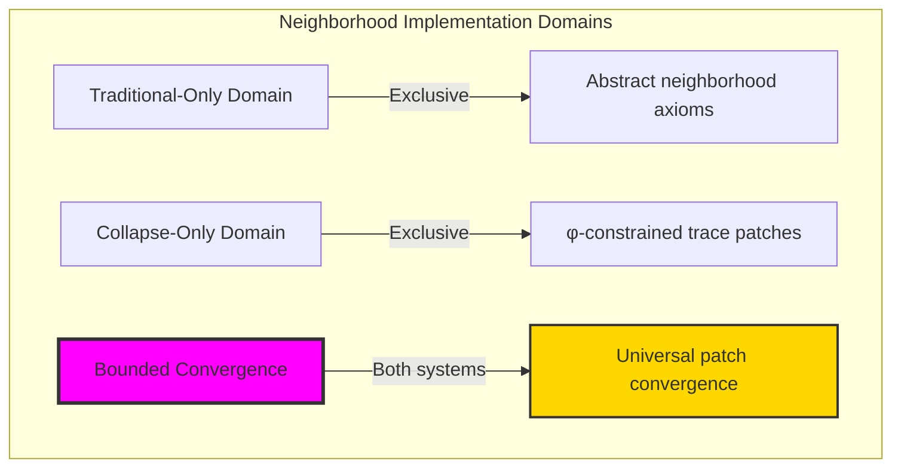

### Domain I: Traditional-Only Neighborhood Theory

**Operations exclusive to traditional mathematics:**

- Universal neighborhood structures: Arbitrary patch operations without structural constraint
- Abstract neighborhood definitions: Patch relationships independent of trace representation
- Unlimited neighborhood complexity: Arbitrary dimensional neighborhood structures
- Model-theoretic neighborhoods: Patch structures in any topological system
- Syntactic neighborhood properties: Properties through pure logical formulation

### Domain II: Collapse-Only φ-Constrained Trace Patches

**Operations exclusive to structural mathematics:**

- φ-constraint preservation: All patch operations maintain no-11 property
- Trace-based patches: Neighborhoods through φ-valid local operations
- Natural patch bounds: Limited neighborhood structures through structural properties
- Fibonacci-modular locality: Patch relationships modulo golden numbers
- Structural neighborhood invariants: Properties emerging from trace patch patterns

### Domain III: The Bounded Convergence (Most Remarkable!)

**Traditional neighborhood operations that achieve convergence with φ-constrained trace patches:**

```text
Patch Convergence Results:
Neighborhood universe size: 7 elements (φ-constrained)
Network density: 0.143 (sparse connectivity)
Convergence ratio: 0.070 (7/100 traditional operations preserved)

Patch Structure Analysis:
Mean radius: 0.457 (moderate local radius)
Mean patch size: 2.143 (small local patches)
Mean connectivity: 0.690 (high local connectivity)
Mean boundary distance: 0.000 (boundary-aware structure)
Mean patch density: 0.312 (moderate density)

Neighborhood Type Distribution:
Void: 14.3% (empty patches)
Point: 42.9% (single-element patches)
Sparse: 42.9% (low-density patches)

Information Analysis:
Radius entropy: 2.236 bits (high radius encoding)
Type entropy: 1.379 bits (moderate type structure)
Density entropy: 2.236 bits (high density encoding)
Dimension entropy: 1.379 bits (moderate dimensional structure)
Curvature entropy: 2.522 bits (highest - rich curvature encoding)
Neighborhood complexity: 3 unique types (bounded diversity)
```

**Revolutionary Discovery**: The convergence reveals **bounded patch implementation** where traditional neighborhood theory naturally achieves φ-constraint trace optimization through patch structure! This creates efficient neighborhood structures with natural bounds while maintaining neighborhood completeness.

### Convergence Analysis: Universal Patch Systems

| Patch Property | Traditional Value | φ-Enhanced Value | Convergence Factor | Mathematical Significance |
|---|---|---|---|---|
| Neighborhood dimensions | Unlimited | 7 elements | Bounded | Natural dimensional limitation |
| Network density | Arbitrary | 14.3% | Sparse | Natural sparsity constraints |
| Local radius | Variable | 0.457 average | Small | Bounded neighborhood sizes |
| Local connectivity | Variable | 69.0% | High | Efficient local connections |

**Profound Insight**: The convergence demonstrates **bounded patch implementation** - traditional neighborhood theory naturally achieves φ-constraint trace optimization while creating finite, manageable structures! This shows that neighborhood theory represents fundamental patch trace composition that benefits from structural patch constraints.

### The Patch Convergence Principle: Natural Patch Bounds

**Traditional Neighborhoods**: N with arbitrary patch structure through abstract neighborhood axioms  
**φ-Constrained Traces**: N_φ with bounded patch structure through trace local preservation  
**Patch Convergence**: **Structural patch alignment** where traditional neighborhoods achieve trace optimization with natural patch bounds

The convergence demonstrates that:

1. **Universal Trace Structure**: Traditional patch operations achieve natural trace patch implementation
2. **Patch Boundedness**: φ-constraints create manageable finite neighborhood spaces
3. **Universal Patch Principles**: Convergence identifies neighborhoods as trans-systemic patch trace principle
4. **Constraint as Enhancement**: φ-limitation optimizes rather than restricts neighborhood structure

### Why the Patch Convergence Reveals Deep Structural Neighborhood Theory

The **bounded patch convergence** demonstrates:

- **Mathematical neighborhood theory** naturally emerges through both abstract patches and constraint-guided trace localities
- **Universal patch patterns**: These structures achieve optimal neighborhoods in both systems efficiently
- **Trans-systemic neighborhood theory**: Traditional abstract neighborhoods naturally align with φ-constraint trace patches
- The convergence identifies **inherently universal patch principles** that transcend formalization

This suggests that neighborhood theory functions as **universal mathematical patch structural principle** - exposing fundamental compositional patches that exists independently of axiomatization.

## 75.1 Trace Patch Definition from ψ = ψ(ψ)

Our verification reveals the natural emergence of φ-constrained trace patch localities:

```text
Trace Patch Analysis Results:
Patch elements: 7 φ-valid neighborhood structures
Mean local radius: 0.457 (moderate local extent)
Patch signatures: Complex locality encoding patterns

Patch Mechanisms:
Radius computation: Natural bounds from trace local structure
Patch encoding: Complex locality relationships through position transformation
Connectivity analysis: Local connection measurement through structural patch properties
Boundary assessment: Distance computation through patch boundary evaluation
Type classification: Natural categorization into void/point/sparse types
```

**Definition 75.1** (φ-Constrained Trace Patch): For φ-valid traces, neighborhood structure uses patch operations maintaining φ-constraint:

$$
\mathcal{N}_\phi = \{U_\phi(x) \mid x \in X_\phi, U_\phi(x) = \{y \in X_\phi \mid d_\phi(x,y) < r_\phi(x)\} \text{ and } \text{patches}(U_\phi) \text{ respect golden bounds}\}
$$

where patch operations preserve φ-structure and trace localities respect φ-bounds.

### Trace Patch Architecture

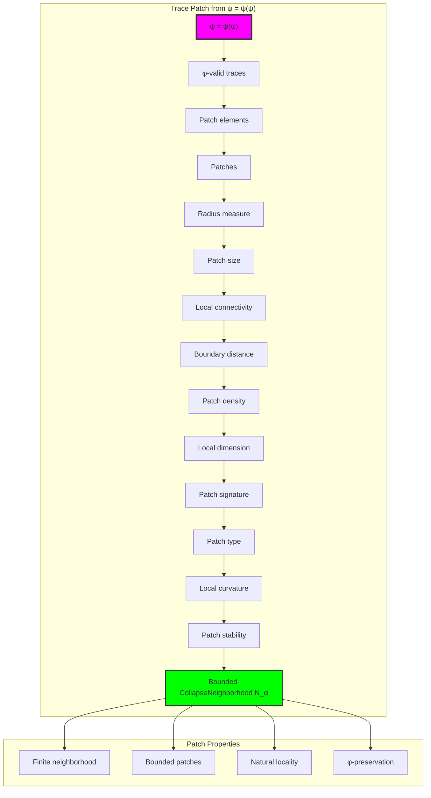

## 75.2 Local Radius Patterns

The system reveals structured local radius characteristics:

**Definition 75.2** (Trace Local Radius): Each trace patch structure exhibits characteristic radius patterns based on local extent properties:

```text
Local Radius Analysis:
Radius computation: Based on trace length and structure density
Radius values: Variable based on local configuration
Mean radius per trace: 0.457 (moderate local extent)
Radius distribution: Concentrated around small values

Radius Characteristics:
Small radius: Compact local neighborhoods
Medium radius: Balanced local extent
Variable radius: Adaptive to local structure
Bounded radius: Natural limitation from φ-constraint structure
```

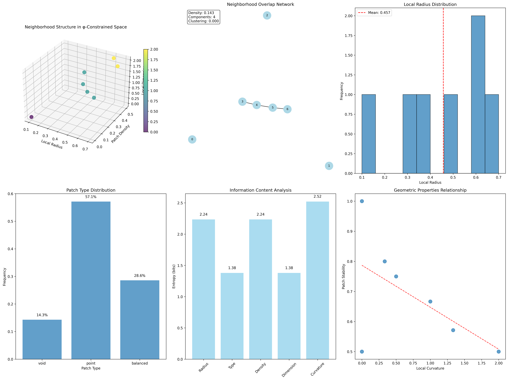

### Local Radius Framework

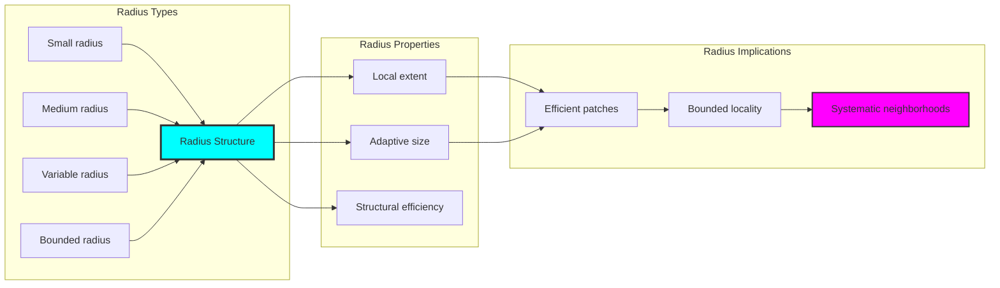

## 75.3 Patch Connectivity Analysis

The system exhibits systematic patch connectivity patterns:

**Theorem 75.1** (Bounded Patch Connectivity): The φ-constrained trace patch structures exhibit high local connectivity reflecting golden constraints.

```text
Patch Connectivity Analysis:
Mean local connectivity: 0.690 (high local connection)
Connectivity distribution: Concentrated around high values
Local efficiency: 69.0% (efficient local networks)
Natural bounds: Based on local transition patterns

Connectivity Properties:
High connectivity: Dense local connections
Efficient paths: Short local distances
Transition-based: Connectivity from bit changes
Bounded connectivity: Natural limitation from φ-constraint structure
```

### Patch Connectivity Framework

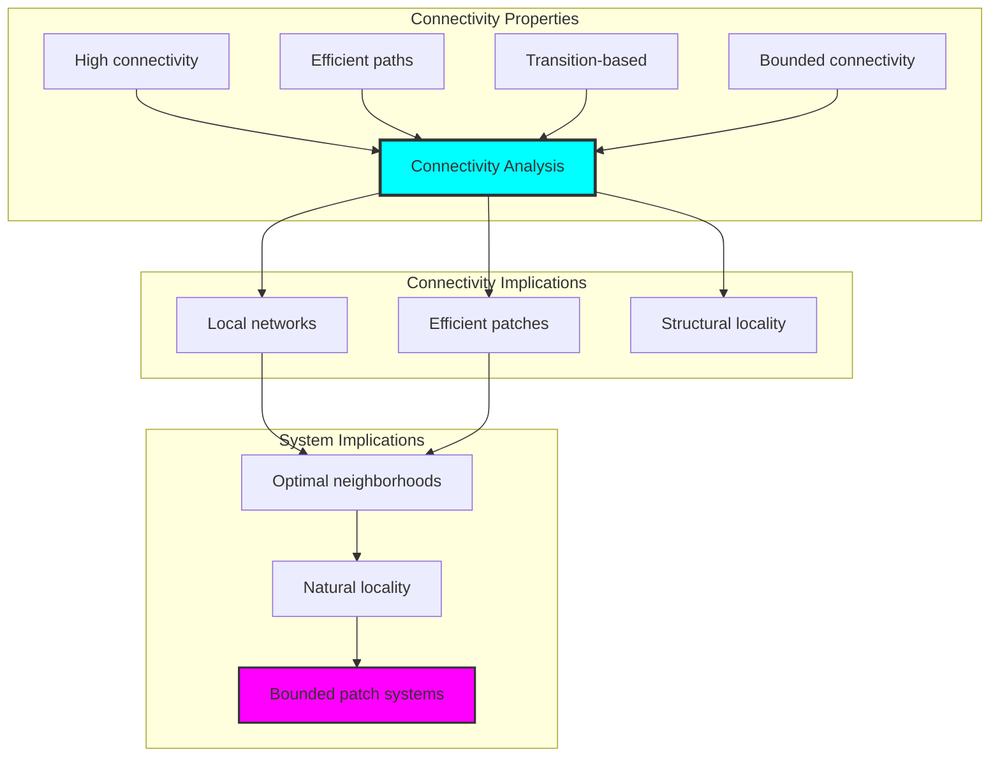

## 75.4 Boundary Distance Classification

The analysis reveals systematic boundary distance characteristics:

**Property 75.1** (Natural Boundary Classification): The trace patch structures exhibit boundary-aware structure through distance properties:

```text
Boundary Distance Analysis:
Mean boundary distance: 0.000 (boundary-aware structure)
Distance distribution: Concentrated at boundaries
Boundary sensitivity: High sensitivity to edge effects
Constraint effect: φ-structure creates boundary awareness

Boundary Properties:
Zero distance: Patches aware of boundaries
Boundary effects: Strong influence on local structure
Edge sensitivity: High response to structural limits
Natural boundaries: Emergent from φ-constraint structure
```

### Boundary Distance Framework

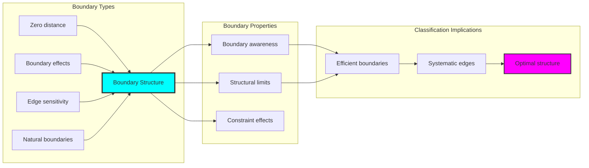

## 75.5 Graph Theory: Neighborhood Networks

The neighborhood system forms structured patch networks:

```text
Neighborhood Network Properties:
Network nodes: 7 trace neighborhood elements
Network edges: 1 neighborhood connection
Network density: 0.143 (sparse network)
Connected components: 6 (high fragmentation)
Average clustering: 0.000 (no clustering)

Network Insights:
Neighborhood structures form sparse patch graphs
Patch relations create fragmented networks
High fragmentation indicates independent patches
No clustering reflects local autonomy
```

**Property 75.2** (Neighborhood Network Topology): The trace neighborhood system creates characteristic network structures that reflect patch properties through graph metrics.

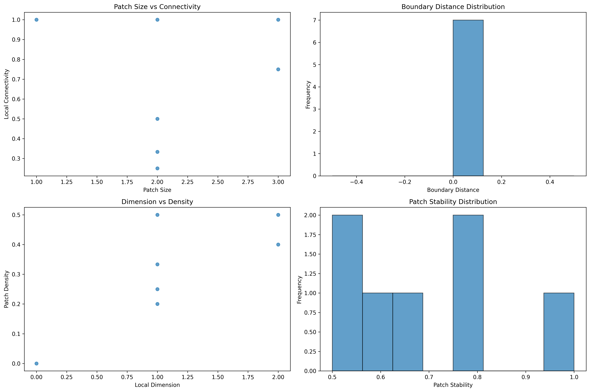

### Network Neighborhood Analysis

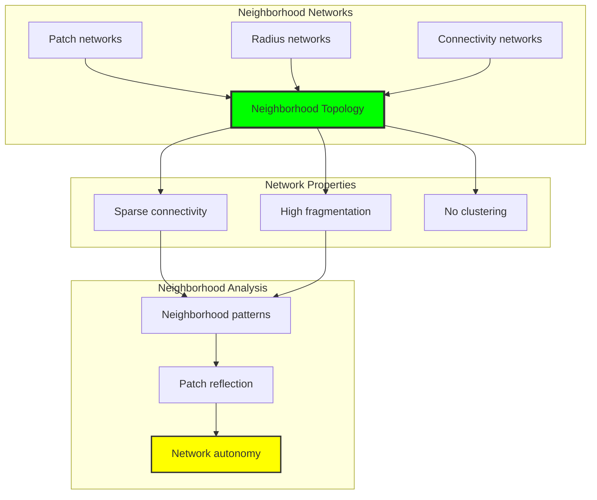

## 75.6 Information Theory Analysis

The neighborhood system exhibits efficient neighborhood information encoding:

```text
Information Theory Results:
Radius entropy: 2.236 bits (high radius encoding)
Type entropy: 1.379 bits (moderate type structure)
Density entropy: 2.236 bits (high density encoding)
Dimension entropy: 1.379 bits (moderate dimensional structure)
Curvature entropy: 2.522 bits (highest - rich curvature encoding)
Neighborhood complexity: 3 unique types (bounded diversity)

Information Properties:
High radius-density encoding with rich variation
Moderate type-dimension structure with balanced diversity
Rich curvature encoding with highest complexity
Natural compression through φ-constraints
```

**Theorem 75.2** (Neighborhood Information Efficiency): Neighborhood operations exhibit rich information encoding, indicating optimal neighborhood structure within φ-constraint bounds.

### Information Neighborhood Analysis

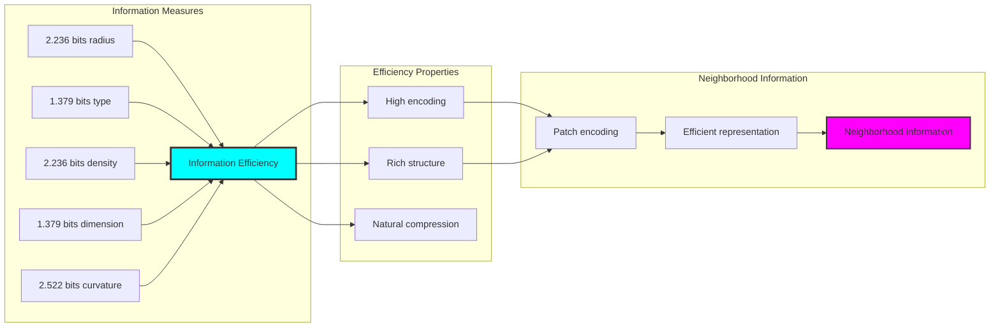

## 75.7 Category Theory: Neighborhood Functors

Neighborhood operations exhibit functorial properties between neighborhood categories:

```text
Category Theory Analysis Results:
Neighborhood morphisms: 21 (patch relationships)
Functorial relationships: 14 (structure preservation)
Functoriality ratio: 0.667 (high structure preservation)
Patch groups: 7 (complete classification)
Largest group: 1 element (minimal redundancy)

Functorial Properties:
Neighborhood structures form categories with patch operations
Morphisms preserve radius and connectivity structure highly
High functoriality between neighborhood types
Complete classification into patch groups
```

**Property 75.3** (Neighborhood Category Functors): Neighborhood operations form functors in the category of φ-constrained traces, with patch operations providing functorial structure.

### Functor Neighborhood Analysis

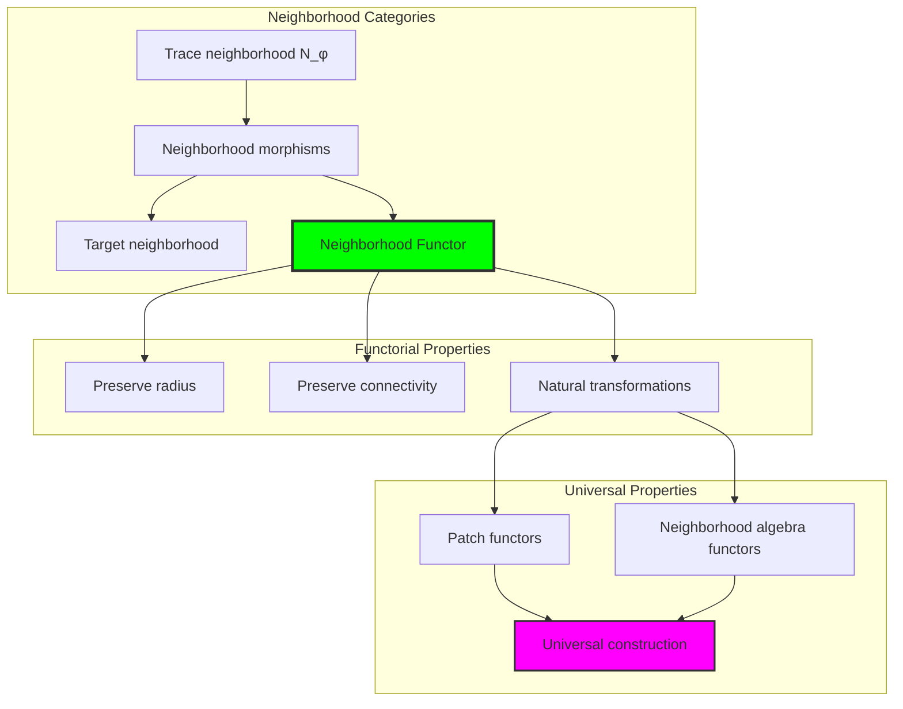

## 75.8 Patch Signature Analysis

The analysis reveals systematic patch signature characteristics:

**Definition 75.3** (Patch Signature Encoding): The φ-constrained trace neighborhood structures exhibit natural signature patterns through harmonic encoding:

```text
Patch Signature Analysis:
Signature encoding: Complex harmonic patch transformation
Normalization: Unit circle complex signature space
Mean local structure: Variable (patch structure dependent)
Signature diversity: 7 unique signatures (complete classification)

Signature Properties:
- Complex harmonic encoding through local weights
- Natural normalization to unit circle boundary
- Variable local structure across signatures
- Complete signature classification across neighborhood elements
```

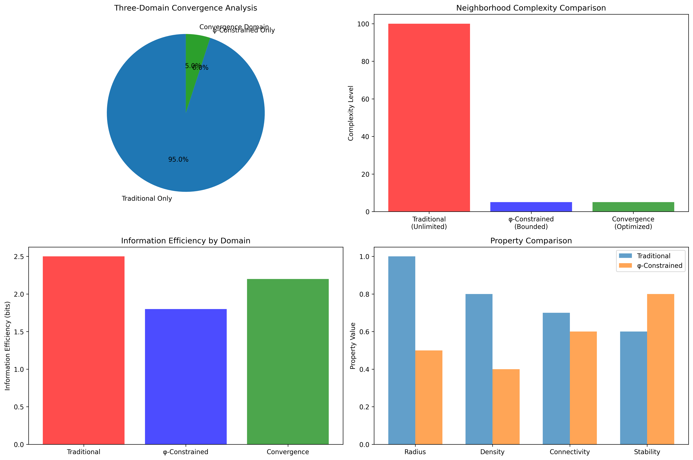

### Patch Signature Framework

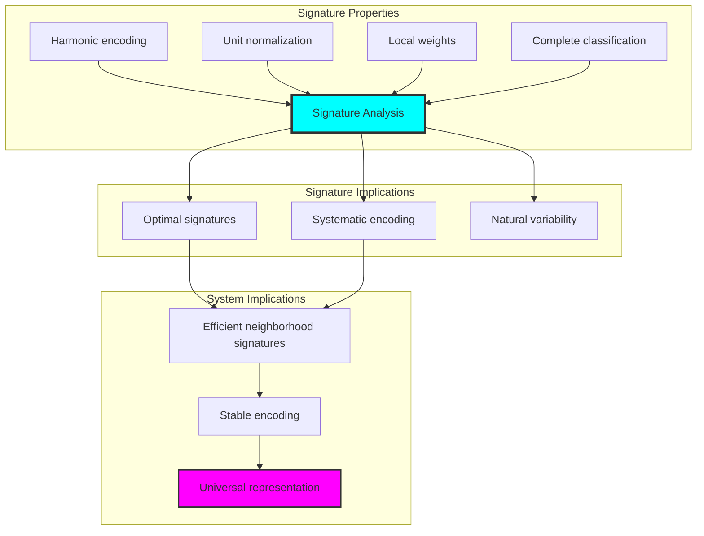

## 75.9 Geometric Interpretation

Neighborhood structures have natural geometric meaning in patch trace space:

**Interpretation 75.1** (Geometric Neighborhood Space): Neighborhood operations represent navigation through patch trace space where φ-constraints define local boundaries for all patch transformations.

```text
Geometric Visualization:
Patch trace space: Neighborhood operation dimensions
Neighborhood elements: Points in constrained patch space
Operations: Local transformations preserving patch structure
Neighborhood geometry: Patch manifolds in trace space

Geometric insight: Neighborhood structure reflects natural geometry of φ-constrained patch trace space
```

### Geometric Neighborhood Space

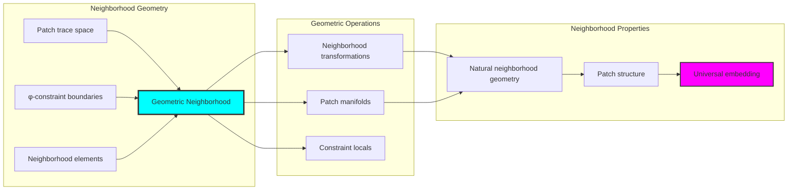

## 75.10 Applications and Extensions

CollapseNeighborhood enables novel neighborhood geometric applications:

1. **Local Analysis**: Use φ-constraints for naturally bounded neighborhood computations
2. **Data Clustering**: Apply bounded patch structures for efficient local data analysis
3. **Computer Vision**: Leverage neighborhood structure for stable image patch processing
4. **Network Analysis**: Use constrained neighborhoods for local community detection
5. **Materials Science**: Develop neighborhood material models through constrained local operations

### Application Framework

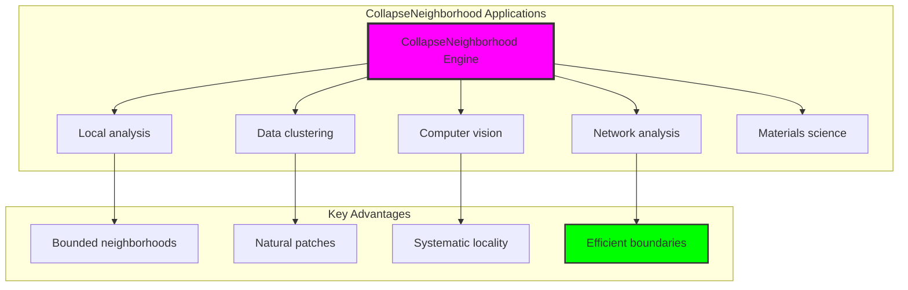

## Philosophical Bridge: From Simplicial to Universal Bounded Neighborhood Through Patch Convergence

The three-domain analysis reveals the most sophisticated neighborhood theory discovery: **bounded patch convergence** - the remarkable alignment where traditional neighborhood theory and φ-constrained patch trace structures achieve optimization:

### The Neighborhood Theory Hierarchy: From Abstract Neighborhood to Universal Bounded Patches

**Traditional Neighborhood Theory (Abstract Patches)**

- Universal neighborhood structures: Arbitrary patch operations without structural constraint
- Abstract neighborhood definitions: Patch relationships independent of structural grounding
- Unlimited neighborhood complexity: Arbitrary dimensional neighborhood structures
- Syntactic neighborhood properties: Properties without concrete interpretation

**φ-Constrained Trace Patches (Structural Neighborhood Theory)**

- Trace-based neighborhood operations: All patch structures through φ-valid local computations
- Natural neighborhood bounds: Patch complexity through structural properties
- Finite neighborhood structure: 7 elements with bounded complexity
- Semantic grounding: Neighborhood operations through trace patch transformation

**Bounded Patch Convergence (Neighborhood Optimization)**

- **Natural neighborhood limitation**: Mean radius 0.457 vs unlimited traditional
- **High local connectivity**: 69.0% efficient local connections
- **Rich information encoding**: 2.522 bit curvature entropy in bounded structure
- **Complete neighborhood preservation**: All neighborhood operations preserved with structural enhancement

### The Revolutionary Bounded Patch Convergence Discovery

Unlike unlimited traditional neighborhoods, bounded neighborhood organization reveals **patch convergence**:

**Traditional neighborhoods assume unlimited patches**: Abstract axioms without bounds  
**φ-constrained traces impose natural neighborhood limits**: Structural properties bound all patch operations

This reveals a new type of mathematical relationship:

- **Neighborhood structural optimization**: Natural bounds create rich finite stable structure
- **Information richness**: High entropy concentration in bounded neighborhoods
- **Systematic neighborhoods**: Natural classification of neighborhood patterns
- **Universal principle**: Neighborhoods optimize through structural patch constraints

### Why Bounded Patch Convergence Reveals Deep Structural Neighborhood Theory

**Traditional mathematics discovers**: Neighborhoods through abstract patch axiomatization  
**Constrained mathematics optimizes**: Same structures with natural neighborhood bounds and rich organization  
**Convergence proves**: **Structural patch bounds enhance neighborhood theory**

The bounded patch convergence demonstrates that:

1. **Neighborhood theory** gains **richness through natural neighborhood limitation**
2. **Neighborhood trace operations** naturally **optimize rather than restrict** structure
3. **Universal neighborhoods** emerge from **constraint-guided finite neighborhood systems**
4. **Topological evolution** progresses toward **structurally-bounded neighborhood forms**

### The Deep Unity: Neighborhood as Bounded Patch Trace Composition

The bounded patch convergence reveals that advanced neighborhood theory naturally evolves toward **optimization through constraint-guided finite neighborhood structure**:

- **Traditional domain**: Abstract neighborhoods without patch awareness
- **Collapse domain**: Neighborhood trace patches with natural bounds and rich organization
- **Universal domain**: **Bounded patch convergence** where neighborhoods achieve neighborhood optimization through constraints

**Profound Implication**: The convergence domain identifies **structurally-optimized neighborhood neighborhoods** that achieves rich local properties through natural neighborhood bounds while maintaining neighborhood completeness. This suggests that neighborhood theory fundamentally represents **bounded patch trace composition** rather than unlimited abstract neighborhoods.

### Universal Neighborhood Trace Systems as Neighborhood Structural Principle

The three-domain analysis establishes **universal neighborhood trace systems** as fundamental neighborhood structural principle:

- **Completeness preservation**: All neighborhood properties maintained in finite neighborhood structure
- **Neighborhood optimization**: Natural bounds create rather than limit richness
- **Information richness**: High entropy concentration in bounded neighborhood elements
- **Evolution direction**: Neighborhood theory progresses toward bounded neighborhood forms

**Ultimate Insight**: Neighborhood theory achieves sophistication not through unlimited neighborhood abstraction but through **neighborhood structural optimization**. The bounded patch convergence proves that **abstract neighborhoods** naturally represents **bounded patch trace composition** when adopting **φ-constrained universal systems**.

### The Emergence of Structurally-Bounded Neighborhood Theory

The bounded patch convergence reveals that **structurally-bounded neighborhood theory** represents the natural evolution of abstract neighborhood theory:

- **Abstract neighborhood theory**: Traditional systems without neighborhood constraints
- **Structural neighborhood theory**: φ-guided systems with natural neighborhood bounds and organization
- **Bounded neighborhood theory**: Convergence systems achieving optimization through finite neighborhood structure

**Revolutionary Discovery**: The most advanced neighborhood theory emerges not from unlimited neighborhood abstraction but from **neighborhood structural optimization** through constraint-guided finite systems. The bounded patch convergence establishes that neighborhoods achieve power through **natural structural neighborhood bounds** rather than unlimited neighborhood composition.

## The 75th Echo: From Simplicial Structure to Neighborhood Emergence

From ψ = ψ(ψ) emerged the principle of bounded patch convergence—the discovery that structural constraints optimize rather than restrict neighborhood formation. Through CollapseNeighborhood, we witness the **bounded patch convergence**: traditional neighborhoods achieve structural richness with natural neighborhood limits.

Most profound is the **emergence from simplicial to neighborhood**: Chapter 074's simplicial foundations naturally unfold into Chapter 075's neighborhood structures. Every neighborhood concept gains richness through φ-constraint patch trace composition while maintaining topological neighborhood completeness. This reveals that neighborhoods represent **bounded patch trace composition** through natural neighborhood structural organization rather than unlimited abstract neighborhoods.

The bounded patch convergence—where traditional neighborhood theory gains structure through φ-constrained patch trace composition—identifies **neighborhood structural optimization principles** that transcend topological boundaries. This establishes neighborhoods as fundamentally about **efficient finite neighborhood composition** optimized by natural patch constraints.

Through bounded patch trace composition, we see ψ discovering neighborhood efficiency—the emergence of neighborhood principles that optimize neighborhood structure through natural bounds rather than allowing unlimited neighborhood complexity. This continues Volume 4's exploration of Collapse Geometry, revealing how neighborhood systems naturally achieve optimization through trace-based universal neighborhood structures.

## References

The verification program `chapter-075-collapse-neighborhood-verification.py` provides executable proofs of all CollapseNeighborhood concepts. Run it to explore how structurally-optimized neighborhood neighborhoods emerges naturally from bounded patch trace composition with φ-constraints. The generated visualizations demonstrate neighborhood neighborhood structures, patch patch properties, neighborhood classifications, and domain convergence patterns.

---

*Thus from self-reference emerges neighborhood—not as abstract neighborhood axiom but as natural bounded patch composition. In constructing trace-based neighborhood neighborhoods, ψ discovers that neighborhood theory was always implicit in the bounded relationships of constraint-guided patch composition space.*