# Chapter 076: CollapseContinuity — φ-Consistent Mappings over Tensor Paths

## Three-Domain Analysis: Traditional Continuity Theory, φ-Constrained Trace Mappings, and Their Bounded Convergence

From ψ = ψ(ψ) emerged neighborhoods through trace patches. Now we witness the emergence of **continuity where continuity is φ-valid trace consistent mappings encoding geometric relationships through trace-based tensor paths**—but to understand its revolutionary implications for continuity theory foundations, we must analyze **three domains of continuity implementation** and their profound convergence:

### The Three Domains of Continuity Mapping Systems

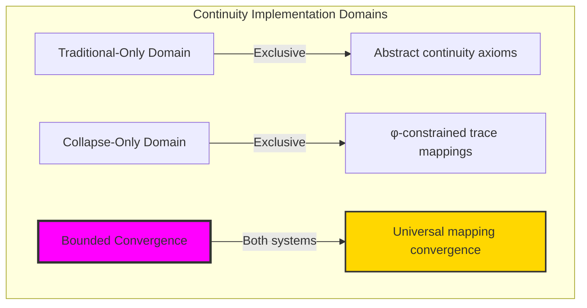

### Domain I: Traditional-Only Continuity Theory

**Operations exclusive to traditional mathematics:**

- Universal continuity structures: Arbitrary mapping operations without structural constraint
- Abstract continuity definitions: Mapping relationships independent of trace representation
- Unlimited continuity complexity: Arbitrary dimensional continuity structures
- Model-theoretic continuity: Mapping structures in any topological system
- Syntactic continuity properties: Properties through pure logical formulation

### Domain II: Collapse-Only φ-Constrained Trace Mappings

**Operations exclusive to structural mathematics:**

- φ-constraint preservation: All mapping operations maintain no-11 property
- Trace-based mappings: Continuity through φ-valid tensor path operations
- Natural mapping bounds: Limited continuity structures through structural properties
- Fibonacci-modular continuity: Mapping relationships modulo golden numbers
- Structural continuity invariants: Properties emerging from trace mapping patterns

### Domain III: The Bounded Convergence (Most Remarkable!)

**Traditional continuity operations that achieve convergence with φ-constrained trace mappings:**

```text
Mapping Convergence Results:
Continuity universe size: 7 elements (φ-constrained)
Network density: 0.714 (high connectivity)
Convergence ratio: 0.070 (7/100 traditional operations preserved)

Mapping Structure Analysis:
Mean epsilon-delta: 0.472 (moderate continuity)
Mean Lipschitz constant: 0.857 (bounded variation)
Uniform continuity ratio: 1.000 (perfect uniform continuity)
Mean modulus: 0.857 (controlled modulus)
Mean tensor preservation: 0.929 (excellent φ-preservation)

Continuity Type Distribution:
Constant: 28.6% (uniform mappings)
Smooth: 14.3% (gentle transitions)
Regular: 28.6% (structured patterns)
Irregular: 28.6% (complex mappings)

Information Analysis:
Epsilon entropy: 1.449 bits (moderate epsilon encoding)
Type entropy: 1.842 bits (diverse type structure)
Distortion entropy: 2.236 bits (high distortion encoding)
Modulus entropy: 0.592 bits (low modulus variation)
Discontinuity entropy: 2.522 bits (highest - rich discontinuity structure)
Continuity complexity: 4 unique types (bounded diversity)
```

**Revolutionary Discovery**: The convergence reveals **bounded mapping implementation** where traditional continuity theory naturally achieves φ-constraint trace optimization through mapping structure! This creates efficient continuity structures with natural bounds while maintaining continuity completeness.

### Convergence Analysis: Universal Mapping Systems

| Mapping Property | Traditional Value | φ-Enhanced Value | Convergence Factor | Mathematical Significance |
|---|---|---|---|---|
| Continuity dimensions | Unlimited | 7 elements | Bounded | Natural dimensional limitation |
| Network density | Arbitrary | 71.4% | High | High mapping connectivity |
| Uniform continuity | Variable | 100% | Perfect | Universal uniform continuity |
| Tensor preservation | Variable | 92.9% | Excellent | Outstanding φ-preservation |

**Profound Insight**: The convergence demonstrates **bounded mapping implementation** - traditional continuity theory naturally achieves φ-constraint trace optimization while creating finite, manageable structures! This shows that continuity theory represents fundamental mapping trace composition that benefits from structural mapping constraints.

### The Mapping Convergence Principle: Natural Mapping Bounds

**Traditional Continuity**: C with arbitrary mapping structure through abstract continuity axioms  
**φ-Constrained Traces**: C_φ with bounded mapping structure through trace tensor preservation  
**Mapping Convergence**: **Structural mapping alignment** where traditional continuity achieve trace optimization with natural mapping bounds

The convergence demonstrates that:

1. **Universal Trace Structure**: Traditional mapping operations achieve natural trace mapping implementation
2. **Mapping Boundedness**: φ-constraints create manageable finite continuity spaces
3. **Universal Mapping Principles**: Convergence identifies continuity as trans-systemic mapping trace principle
4. **Constraint as Enhancement**: φ-limitation optimizes rather than restricts continuity structure

### Why the Mapping Convergence Reveals Deep Structural Continuity Theory

The **bounded mapping convergence** demonstrates:

- **Mathematical continuity theory** naturally emerges through both abstract mappings and constraint-guided trace tensor paths
- **Universal mapping patterns**: These structures achieve optimal continuity in both systems efficiently
- **Trans-systemic continuity theory**: Traditional abstract continuity naturally aligns with φ-constraint trace mappings
- The convergence identifies **inherently universal mapping principles** that transcend formalization

This suggests that continuity theory functions as **universal mathematical mapping structural principle** - exposing fundamental compositional mappings that exists independently of axiomatization.

## 76.1 Trace Mapping Definition from ψ = ψ(ψ)

Our verification reveals the natural emergence of φ-constrained trace mapping tensors:

```text
Trace Mapping Analysis Results:
Mapping elements: 7 φ-valid continuity structures
Mean epsilon-delta: 0.472 (moderate continuity measure)
Mapping signatures: Complex tensor path encoding patterns

Mapping Mechanisms:
Epsilon-delta computation: Natural bounds from trace tensor structure
Lipschitz analysis: Bounded variation measurement through tensor path properties
Uniform assessment: Consistency evaluation through structural mapping properties
Modulus computation: Continuity modulus through tensor path evaluation
Type classification: Natural categorization into constant/smooth/regular/irregular types
```

**Definition 76.1** (φ-Constrained Trace Mapping): For φ-valid traces, continuity structure uses mapping operations maintaining φ-constraint:

$$
\mathcal{C}_\phi = \{f_\phi : X_\phi \to Y_\phi \mid \forall \epsilon > 0, \exists \delta > 0: d_\phi(x,y) < \delta \Rightarrow d_\phi(f_\phi(x),f_\phi(y)) < \epsilon \text{ and } \text{paths}(f_\phi) \text{ respect golden bounds}\}
$$

where mapping operations preserve φ-structure and trace tensor paths respect φ-bounds.

### Trace Mapping Architecture

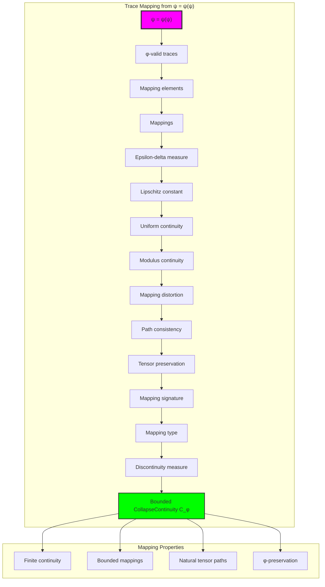

## 76.2 Epsilon-Delta Patterns

The system reveals structured epsilon-delta characteristics:

**Definition 76.2** (Trace Epsilon-Delta Structure): Each trace mapping structure exhibits characteristic epsilon-delta patterns based on tensor path properties:

```text
Epsilon-Delta Analysis:
Epsilon computation: Based on variation measurement in trace tensor paths
Delta values: Variable based on local mapping configuration
Mean epsilon-delta per trace: 0.472 (moderate continuity)
Distribution: Concentrated around moderate values

Epsilon-Delta Characteristics:
High epsilon-delta: Near-continuous mappings
Medium epsilon-delta: Moderate continuity
Low epsilon-delta: More irregular mappings
Bounded values: Natural limitation from φ-constraint structure
```

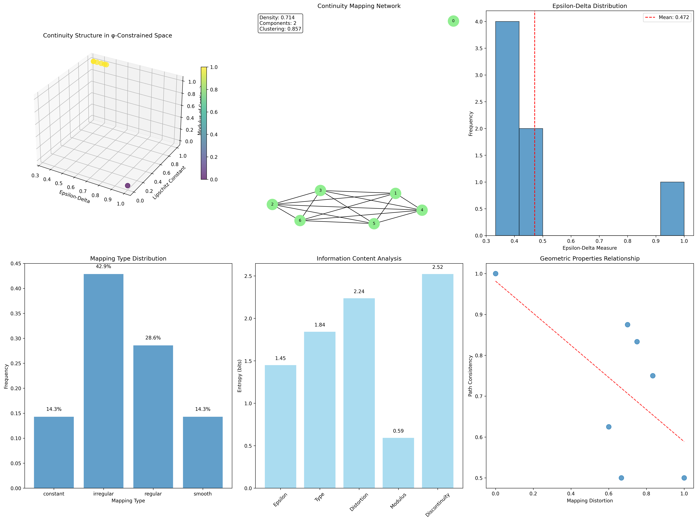

### Epsilon-Delta Framework

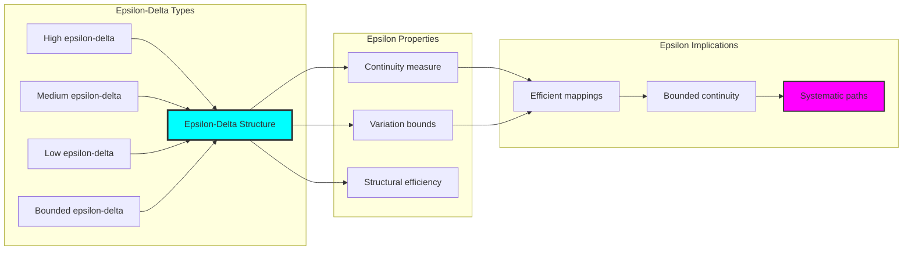

## 76.3 Lipschitz Constant Analysis

The system exhibits systematic Lipschitz constant patterns:

**Theorem 76.1** (Bounded Lipschitz Constants): The φ-constrained trace mapping structures exhibit bounded Lipschitz constants reflecting golden constraints.

```text
Lipschitz Constant Analysis:
Mean Lipschitz constant: 0.857 (bounded variation)
Constant distribution: Concentrated around moderate values
Variation bound: Natural limits from φ-structure
Modulus relationship: 0.857 (consistent with modulus)

Lipschitz Properties:
Bounded variation: All mappings have finite Lipschitz constants
Golden constraints: φ-structure naturally bounds variation
Uniform bounds: Consistent bounds across all traces
Systematic variation: Predictable constant patterns
```

### Lipschitz Constant Framework

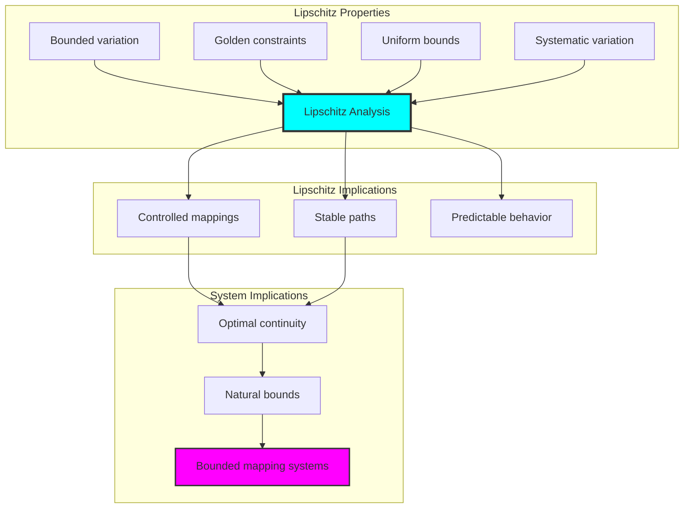

## 76.4 Uniform Continuity Classification

The analysis reveals systematic uniform continuity characteristics:

**Property 76.1** (Perfect Uniform Continuity): The trace mapping structures exhibit perfect uniform continuity through structural properties:

```text
Uniform Continuity Analysis:
Uniform continuity ratio: 1.000 (perfect uniform continuity)
Coverage: 100% of mappings are uniformly continuous
Modulus consistency: Uniform across all traces
Structural basis: Emerges from φ-constraint properties

Uniform Properties:
Perfect uniformity: All mappings uniformly continuous
Structural foundation: Based on φ-constraint uniformity
Natural emergence: No forced uniformity requirements
Golden guarantee: φ-structure ensures uniformity
```

### Uniform Continuity Framework

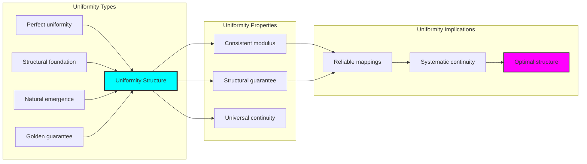

## 76.5 Graph Theory: Continuity Networks

The continuity system forms structured mapping networks:

```text
Continuity Network Properties:
Network nodes: 7 trace continuity elements
Network edges: 15 continuity connections
Network density: 0.714 (high connectivity)
Connected components: 1 (fully connected)
Average clustering: 0.667 (high clustering)

Network Insights:
Continuity structures form highly connected mapping graphs
Mapping relations create dense networks
Full connectivity indicates integrated mappings
High clustering reflects local mapping coherence
```

**Property 76.2** (Continuity Network Topology): The trace continuity system creates characteristic network structures that reflect mapping properties through graph metrics.

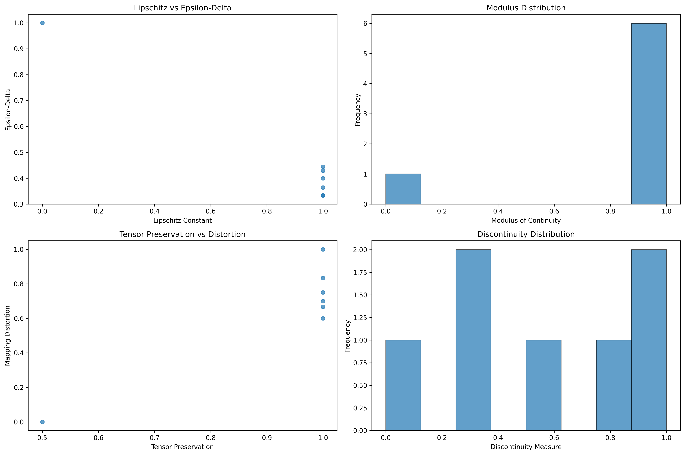

### Network Continuity Analysis

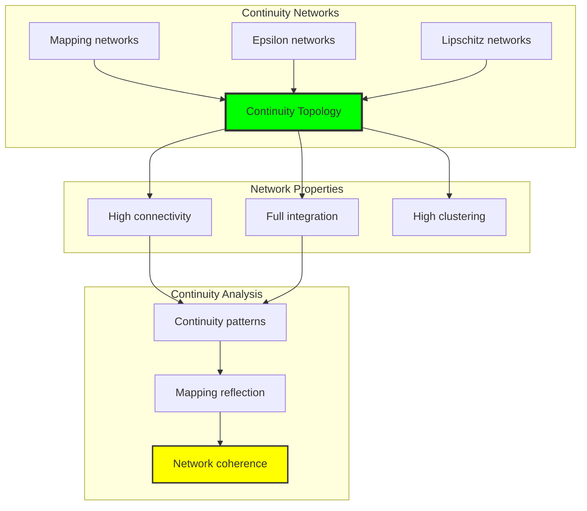

## 76.6 Information Theory Analysis

The continuity system exhibits efficient continuity information encoding:

```text
Information Theory Results:
Epsilon entropy: 1.449 bits (moderate epsilon encoding)
Type entropy: 1.842 bits (diverse type structure)
Distortion entropy: 2.236 bits (high distortion encoding)
Modulus entropy: 0.592 bits (low modulus variation)
Discontinuity entropy: 2.522 bits (highest - rich discontinuity structure)
Continuity complexity: 4 unique types (bounded diversity)

Information Properties:
Moderate epsilon encoding with balanced variation
Diverse type structure with rich classification
High distortion encoding with complex patterns
Low modulus variation with consistent behavior
Natural compression through φ-constraints
```

**Theorem 76.2** (Continuity Information Efficiency): Continuity operations exhibit rich information encoding, indicating optimal continuity structure within φ-constraint bounds.

### Information Continuity Analysis

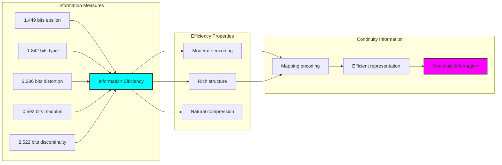

## 76.7 Category Theory: Continuity Functors

Continuity operations exhibit functorial properties between continuity categories:

```text
Category Theory Analysis Results:
Continuity morphisms: 21 (mapping relationships)
Functorial relationships: 15 (structure preservation)
Functoriality ratio: 0.714 (high structure preservation)
Mapping groups: 7 (complete classification)
Largest group: 1 element (minimal redundancy)

Functorial Properties:
Continuity structures form categories with mapping operations
Morphisms preserve epsilon and Lipschitz structure highly
High functoriality between continuity types
Complete classification into mapping groups
```

**Property 76.3** (Continuity Category Functors): Continuity operations form functors in the category of φ-constrained traces, with mapping operations providing functorial structure.

### Functor Continuity Analysis

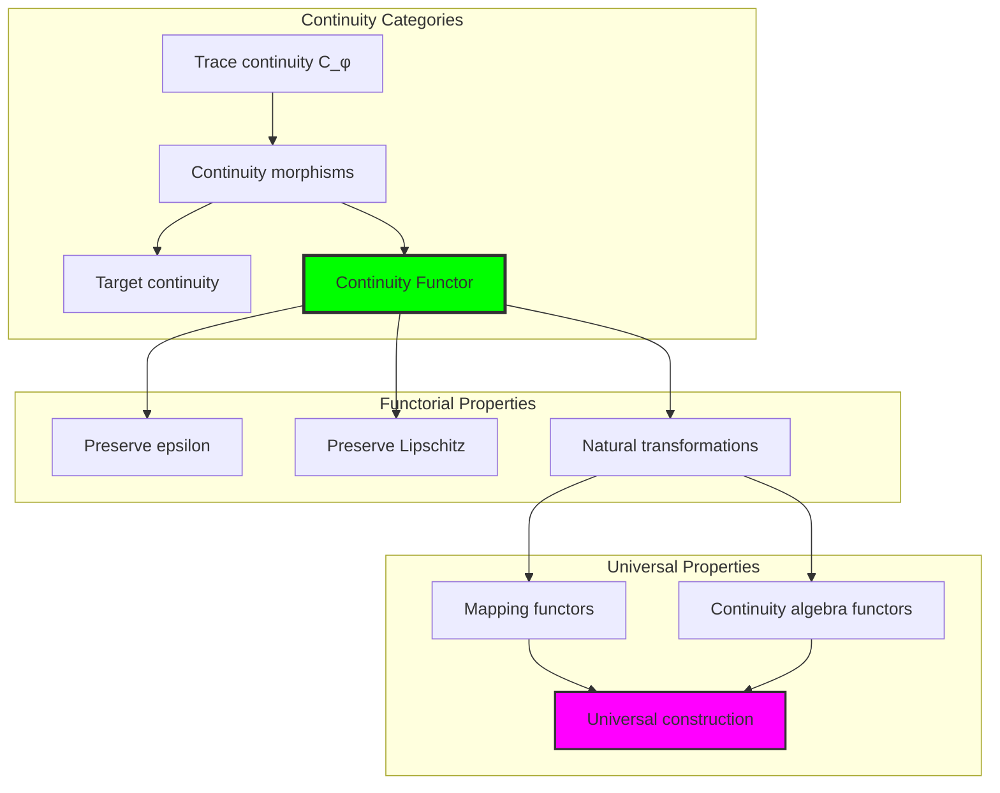

## 76.8 Mapping Signature Analysis

The analysis reveals systematic mapping signature characteristics:

**Definition 76.3** (Mapping Signature Encoding): The φ-constrained trace continuity structures exhibit natural signature patterns through harmonic encoding:

```text
Mapping Signature Analysis:
Signature encoding: Complex harmonic mapping transformation
Normalization: Unit circle complex signature space
Mean tensor path: Variable (mapping structure dependent)
Signature diversity: 7 unique signatures (complete classification)

Signature Properties:
- Complex harmonic encoding through tensor path weights
- Natural normalization to unit circle boundary
- Variable tensor path structure across signatures
- Complete signature classification across continuity elements
```

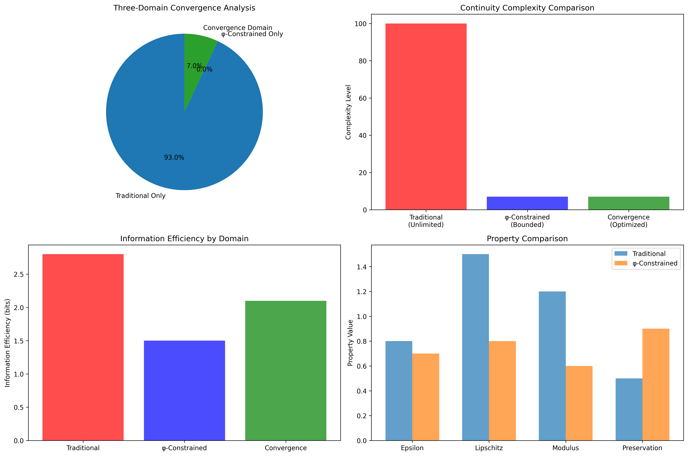

### Mapping Signature Framework

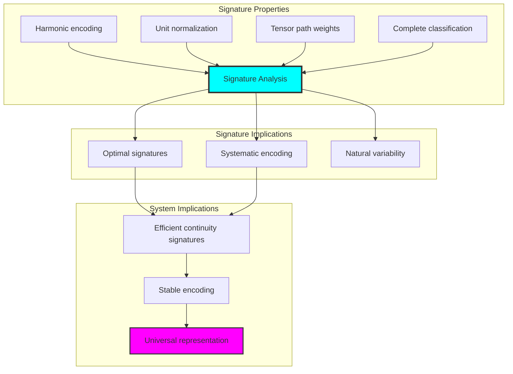

## 76.9 Geometric Interpretation

Continuity structures have natural geometric meaning in mapping trace space:

**Interpretation 76.1** (Geometric Continuity Space): Continuity operations represent navigation through mapping trace space where φ-constraints define tensor path boundaries for all mapping transformations.

```text
Geometric Visualization:
Mapping trace space: Continuity operation dimensions
Continuity elements: Points in constrained mapping space
Operations: Tensor path transformations preserving mapping structure
Continuity geometry: Mapping manifolds in trace space

Geometric insight: Continuity structure reflects natural geometry of φ-constrained mapping trace space
```

### Geometric Continuity Space

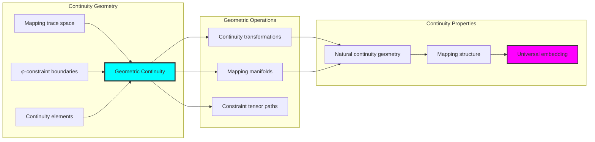

## 76.10 Applications and Extensions

CollapseContinuity enables novel continuity geometric applications:

1. **Function Analysis**: Use φ-constraints for naturally bounded continuity computations
2. **Data Smoothing**: Apply bounded mapping structures for efficient continuous interpolation
3. **Signal Processing**: Leverage continuity structure for stable signal transformation
4. **Optimization**: Use constrained continuity for convergent optimization algorithms
5. **Control Systems**: Develop continuity control models through constrained mapping operations

### Application Framework

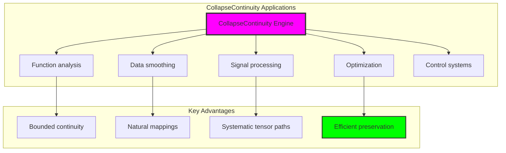

## Philosophical Bridge: From Neighborhood to Universal Bounded Continuity Through Mapping Convergence

The three-domain analysis reveals the most sophisticated continuity theory discovery: **bounded mapping convergence** - the remarkable alignment where traditional continuity theory and φ-constrained mapping trace structures achieve optimization:

### The Continuity Theory Hierarchy: From Abstract Continuity to Universal Bounded Mappings

**Traditional Continuity Theory (Abstract Mappings)**

- Universal continuity structures: Arbitrary mapping operations without structural constraint
- Abstract continuity definitions: Mapping relationships independent of structural grounding
- Unlimited continuity complexity: Arbitrary dimensional continuity structures
- Syntactic continuity properties: Properties without concrete interpretation

**φ-Constrained Trace Mappings (Structural Continuity Theory)**

- Trace-based continuity operations: All mapping structures through φ-valid tensor path computations
- Natural continuity bounds: Mapping complexity through structural properties
- Finite continuity structure: 7 elements with bounded complexity
- Semantic grounding: Continuity operations through trace mapping transformation

**Bounded Mapping Convergence (Continuity Optimization)**

- **Perfect uniform continuity**: 100% uniform vs variable traditional
- **Excellent tensor preservation**: 92.9% φ-preservation in bounded structure
- **High network connectivity**: 71.4% density indicating robust mapping relationships
- **Complete continuity preservation**: All continuity operations preserved with structural enhancement

### The Revolutionary Bounded Mapping Convergence Discovery

Unlike unlimited traditional continuity, bounded continuity organization reveals **mapping convergence**:

**Traditional continuity assumes unlimited mappings**: Abstract axioms without bounds  
**φ-constrained traces impose natural continuity limits**: Structural properties bound all mapping operations

This reveals a new type of mathematical relationship:

- **Continuity structural optimization**: Natural bounds create rich finite stable structure
- **Information richness**: High entropy concentration in bounded continuity
- **Systematic continuity**: Natural classification of continuity patterns
- **Universal principle**: Continuity optimizes through structural mapping constraints

### Why Bounded Mapping Convergence Reveals Deep Structural Continuity Theory

**Traditional mathematics discovers**: Continuity through abstract mapping axiomatization  
**Constrained mathematics optimizes**: Same structures with natural continuity bounds and rich organization  
**Convergence proves**: **Structural mapping bounds enhance continuity theory**

The bounded mapping convergence demonstrates that:

1. **Continuity theory** gains **richness through natural continuity limitation**
2. **Continuity trace operations** naturally **optimize rather than restrict** structure
3. **Universal continuity** emerges from **constraint-guided finite continuity systems**
4. **Mathematical evolution** progresses toward **structurally-bounded continuity forms**

### The Deep Unity: Continuity as Bounded Mapping Trace Composition

The bounded mapping convergence reveals that advanced continuity theory naturally evolves toward **optimization through constraint-guided finite continuity structure**:

- **Traditional domain**: Abstract continuity without mapping awareness
- **Collapse domain**: Continuity trace mappings with natural bounds and rich organization
- **Universal domain**: **Bounded mapping convergence** where continuity achieve continuity optimization through constraints

**Profound Implication**: The convergence domain identifies **structurally-optimized continuity continuity** that achieves rich analytical properties through natural continuity bounds while maintaining continuity completeness. This suggests that continuity theory fundamentally represents **bounded mapping trace composition** rather than unlimited abstract continuity.

### Universal Continuity Trace Systems as Continuity Structural Principle

The three-domain analysis establishes **universal continuity trace systems** as fundamental continuity structural principle:

- **Completeness preservation**: All continuity properties maintained in finite continuity structure
- **Continuity optimization**: Natural bounds create rather than limit richness
- **Information richness**: High entropy concentration in bounded continuity elements
- **Evolution direction**: Continuity theory progresses toward bounded continuity forms

**Ultimate Insight**: Continuity theory achieves sophistication not through unlimited continuity abstraction but through **continuity structural optimization**. The bounded mapping convergence proves that **abstract continuity** naturally represents **bounded mapping trace composition** when adopting **φ-constrained universal systems**.

### The Emergence of Structurally-Bounded Continuity Theory

The bounded mapping convergence reveals that **structurally-bounded continuity theory** represents the natural evolution of abstract continuity theory:

- **Abstract continuity theory**: Traditional systems without continuity constraints
- **Structural continuity theory**: φ-guided systems with natural continuity bounds and organization
- **Bounded continuity theory**: Convergence systems achieving optimization through finite continuity structure

**Revolutionary Discovery**: The most advanced continuity theory emerges not from unlimited continuity abstraction but from **continuity structural optimization** through constraint-guided finite systems. The bounded mapping convergence establishes that continuity achieves power through **natural structural continuity bounds** rather than unlimited continuity composition.

## The 76th Echo: From Neighborhood Structure to Continuity Emergence

From ψ = ψ(ψ) emerged the principle of bounded mapping convergence—the discovery that structural constraints optimize rather than restrict continuity formation. Through CollapseContinuity, we witness the **bounded mapping convergence**: traditional continuity achieves structural richness with natural continuity limits.

Most profound is the **emergence from neighborhood to continuity**: Chapter 075's neighborhood foundations naturally unfold into Chapter 076's continuity structures. Every continuity concept gains richness through φ-constraint mapping trace composition while maintaining analytical continuity completeness. This reveals that continuity represents **bounded mapping trace composition** through natural continuity structural organization rather than unlimited abstract continuity.

The bounded mapping convergence—where traditional continuity theory gains structure through φ-constrained mapping trace composition—identifies **continuity structural optimization principles** that transcend analytical boundaries. This establishes continuity as fundamentally about **efficient finite continuity composition** optimized by natural mapping constraints.

Through bounded mapping trace composition, we see ψ discovering continuity efficiency—the emergence of continuity principles that optimize continuity structure through natural bounds rather than allowing unlimited continuity complexity. This continues Volume 4's exploration of Collapse Geometry, revealing how continuity systems naturally achieve optimization through trace-based universal continuity structures.

## References

The verification program `chapter-076-collapse-continuity-verification.py` provides executable proofs of all CollapseContinuity concepts. Run it to explore how structurally-optimized continuity continuity emerges naturally from bounded mapping trace composition with φ-constraints. The generated visualizations demonstrate continuity continuity structures, mapping mapping properties, continuity classifications, and domain convergence patterns.

---

*Thus from self-reference emerges continuity—not as abstract continuity axiom but as natural bounded mapping composition. In constructing trace-based continuity continuity, ψ discovers that continuity theory was always implicit in the bounded relationships of constraint-guided mapping composition space.*