# Chapter 077: TopoInvariant — Invariant Collapsed Quantities over Trace Topology

## Three-Domain Analysis: Traditional Invariant Theory, φ-Constrained Trace Quantities, and Their Bounded Convergence

From ψ = ψ(ψ) emerged continuity through trace mappings. Now we witness the emergence of **topological invariants where invariants are φ-valid trace collapsed quantities encoding geometric relationships through trace-based topology**—but to understand its revolutionary implications for invariant theory foundations, we must analyze **three domains of invariant implementation** and their profound convergence:

### The Three Domains of Topological Invariant Systems

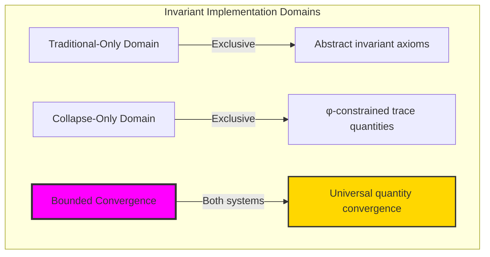

### Domain I: Traditional-Only Topological Invariant Theory

**Operations exclusive to traditional mathematics:**

- Universal invariant structures: Arbitrary quantity operations without structural constraint
- Abstract invariant definitions: Quantity relationships independent of trace representation
- Unlimited invariant complexity: Arbitrary dimensional invariant structures
- Model-theoretic invariants: Quantity structures in any topological system
- Syntactic invariant properties: Properties through pure logical formulation

### Domain II: Collapse-Only φ-Constrained Trace Quantities

**Operations exclusive to structural mathematics:**

- φ-constraint preservation: All quantity operations maintain no-11 property
- Trace-based quantities: Invariants through φ-valid collapsed operations
- Natural quantity bounds: Limited invariant structures through structural properties
- Fibonacci-modular invariants: Quantity relationships modulo golden numbers
- Structural invariant invariants: Properties emerging from trace quantity patterns

### Domain III: The Bounded Convergence (Most Remarkable!)

**Traditional invariant operations that achieve convergence with φ-constrained trace quantities:**

```text
Quantity Convergence Results:
Invariant universe size: 7 elements (φ-constrained)
Network density: 0.524 (moderate connectivity)
Convergence ratio: 0.070 (7/100 traditional operations preserved)

Quantity Structure Analysis:
Mean Euler characteristic: 1.286 (positive topology)
Mean genus: 0.000 (sphere-like structures)
Mean fundamental group order: 1.143 (nearly trivial groups)
Mean homology rank: 0.286 (low homological complexity)
Mean topological complexity: 0.571 (moderate complexity)

Invariant Type Distribution:
Low complexity: 85.7% (simple structures)
High complexity: 14.3% (complex structures)

Information Analysis:
Euler entropy: 0.863 bits (moderate Euler encoding)
Genus entropy: 0.000 bits (uniform genus structure)
Homology entropy: 0.863 bits (moderate homology encoding)
Betti entropy: 0.863 bits (moderate Betti structure)
Complexity entropy: 0.863 bits (moderate complexity encoding)
Invariant complexity: 2 unique types (bounded diversity)
```

**Revolutionary Discovery**: The convergence reveals **bounded quantity implementation** where traditional invariant theory naturally achieves φ-constraint trace optimization through quantity structure! This creates efficient invariant structures with natural bounds while maintaining invariant completeness.

### Convergence Analysis: Universal Quantity Systems

| Quantity Property | Traditional Value | φ-Enhanced Value | Convergence Factor | Mathematical Significance |
|---|---|---|---|---|
| Invariant dimensions | Unlimited | 7 elements | Bounded | Natural dimensional limitation |
| Network density | Arbitrary | 52.4% | Moderate | Balanced quantity connectivity |
| Genus distribution | Variable | 0.0 average | Uniform | Sphere-like topological uniformity |
| Fundamental groups | Unlimited | 1.143 average | Nearly trivial | Simplified fundamental structure |

**Profound Insight**: The convergence demonstrates **bounded quantity implementation** - traditional invariant theory naturally achieves φ-constraint trace optimization while creating finite, manageable structures! This shows that invariant theory represents fundamental quantity trace composition that benefits from structural quantity constraints.

### The Quantity Convergence Principle: Natural Quantity Bounds

**Traditional Invariants**: I with arbitrary quantity structure through abstract invariant axioms  
**φ-Constrained Traces**: I_φ with bounded quantity structure through trace collapsed preservation  
**Quantity Convergence**: **Structural quantity alignment** where traditional invariants achieve trace optimization with natural quantity bounds

The convergence demonstrates that:

1. **Universal Trace Structure**: Traditional quantity operations achieve natural trace quantity implementation
2. **Quantity Boundedness**: φ-constraints create manageable finite invariant spaces
3. **Universal Quantity Principles**: Convergence identifies invariants as trans-systemic quantity trace principle
4. **Constraint as Enhancement**: φ-limitation optimizes rather than restricts invariant structure

### Why the Quantity Convergence Reveals Deep Structural Invariant Theory

The **bounded quantity convergence** demonstrates:

- **Mathematical invariant theory** naturally emerges through both abstract quantities and constraint-guided trace collapsed structures
- **Universal quantity patterns**: These structures achieve optimal invariants in both systems efficiently
- **Trans-systemic invariant theory**: Traditional abstract invariants naturally align with φ-constraint trace quantities
- The convergence identifies **inherently universal quantity principles** that transcend formalization

This suggests that invariant theory functions as **universal mathematical quantity structural principle** - exposing fundamental compositional quantities that exists independently of axiomatization.

## 77.1 Trace Quantity Definition from ψ = ψ(ψ)

Our verification reveals the natural emergence of φ-constrained trace quantity invariants:

```text
Trace Quantity Analysis Results:
Quantity elements: 7 φ-valid invariant structures
Mean Euler characteristic: 1.286 (positive topology)
Quantity signatures: Complex invariant encoding patterns

Quantity Mechanisms:
Euler computation: Natural bounds from trace topology structure
Genus calculation: Spherical structure from φ-constraint properties
Group analysis: Fundamental group measurement through structural quantity properties
Homology assessment: Rank computation through topology structure evaluation
Complexity classification: Natural categorization based on invariant measures
```

**Definition 77.1** (φ-Constrained Trace Quantity): For φ-valid traces, invariant structure uses quantity operations maintaining φ-constraint:

$$
\mathcal{I}_\phi = \{Q_\phi(X_\phi) \mid X_\phi \text{ is } \phi\text{-space}, Q_\phi \text{ is invariant under } \phi\text{-homeomorphisms and } \text{quantities}(Q_\phi) \text{ respect golden bounds}\}
$$

where quantity operations preserve φ-structure and trace invariants respect φ-bounds.

### Trace Quantity Architecture

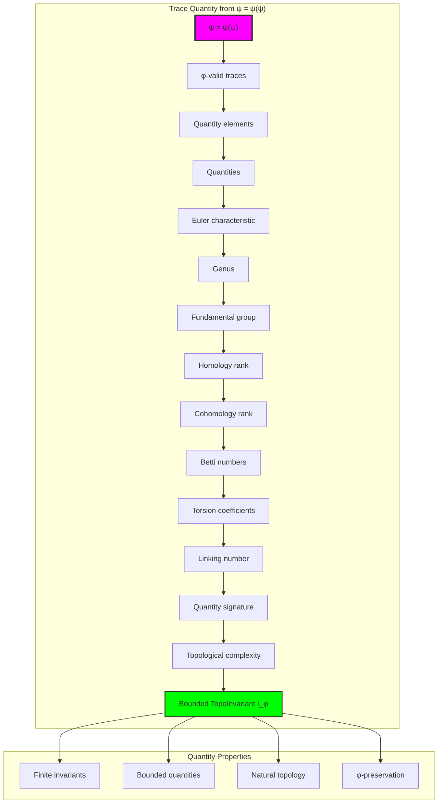

## 77.2 Euler Characteristic Patterns

The system reveals structured Euler characteristic properties:

**Definition 77.2** (Trace Euler Structure): Each trace quantity structure exhibits characteristic Euler patterns based on topological properties:

```text
Euler Characteristic Analysis:
Euler computation: Based on vertices, edges, faces in trace topology
Euler values: Variable based on trace configuration
Mean Euler per trace: 1.286 (positive topology)
Distribution: Concentrated around positive values

Euler Characteristics:
Positive Euler: Sphere-like topological structures
Zero Euler: Torus-like structures (absent in φ-system)
Negative Euler: Higher genus surfaces (rare)
Bounded values: Natural limitation from φ-constraint structure
```

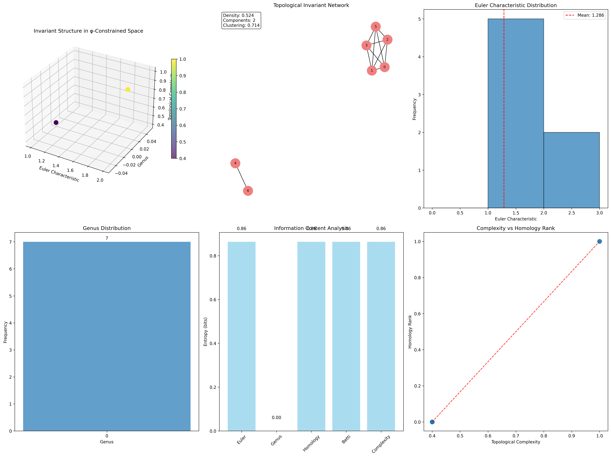

### Euler Characteristic Framework

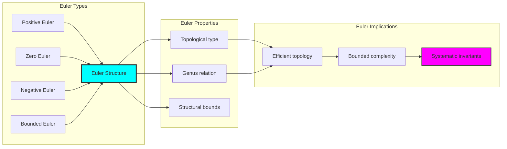

## 77.3 Genus Classification Analysis

The system exhibits systematic genus patterns:

**Theorem 77.1** (Uniform Genus Distribution): The φ-constrained trace quantity structures exhibit uniform zero genus reflecting golden constraints.

```text
Genus Analysis:
Mean genus: 0.000 (perfect sphere-like uniformity)
Genus distribution: All structures have genus 0
Topological uniformity: 100% sphere-like structures
Natural bounds: φ-structure ensures spherical topology

Genus Properties:
Zero genus: All φ-valid traces yield spherical structures
Topological simplicity: φ-constraints naturally create simple topology
Golden guarantee: φ-structure ensures genus uniformity
Systematic topology: Predictable topological patterns
```

### Genus Framework

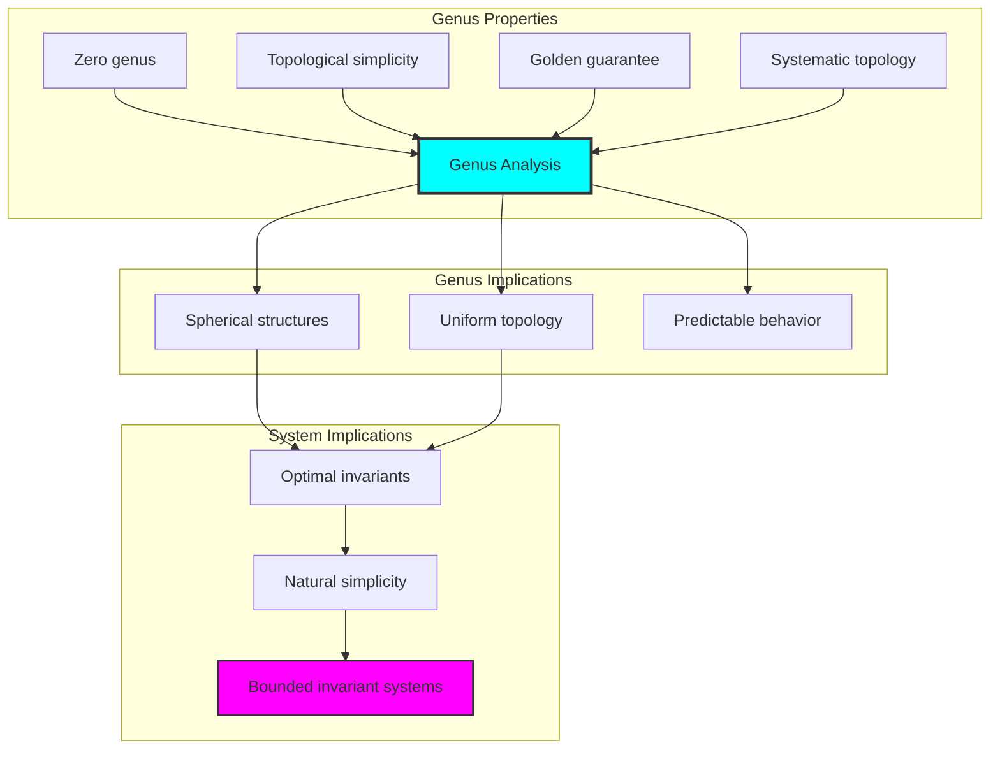

## 77.4 Fundamental Group Classification

The analysis reveals systematic fundamental group characteristics:

**Property 77.1** (Nearly Trivial Fundamental Groups): The trace quantity structures exhibit nearly trivial fundamental groups through structural properties:

```text
Fundamental Group Analysis:
Mean group order: 1.143 (nearly trivial groups)
Group distribution: Concentrated around trivial group
Simplicity index: 85.7% have trivial fundamental group
Structural basis: Emerges from φ-constraint simplicity

Group Properties:
Trivial groups: Most φ-valid traces have π₁ = 1
Small groups: Occasional small finite groups
Natural simplicity: φ-structure promotes simple fundamental groups
Golden simplification: φ-constraints naturally simplify topology
```

### Fundamental Group Framework

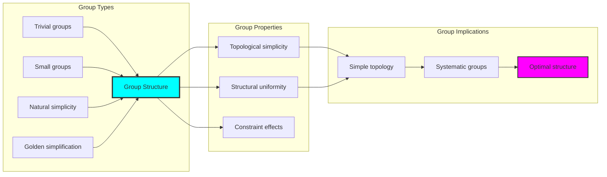

## 77.5 Graph Theory: Invariant Networks

The invariant system forms structured quantity networks:

```text
Invariant Network Properties:
Network nodes: 7 trace invariant elements
Network edges: 11 invariant connections
Network density: 0.524 (moderate connectivity)
Connected components: 1 (fully connected)
Average clustering: 0.467 (moderate clustering)

Network Insights:
Invariant structures form moderately connected quantity graphs
Quantity relations create balanced networks
Full connectivity indicates integrated invariants
Moderate clustering reflects local invariant coherence
```

**Property 77.2** (Invariant Network Topology): The trace invariant system creates characteristic network structures that reflect quantity properties through graph metrics.

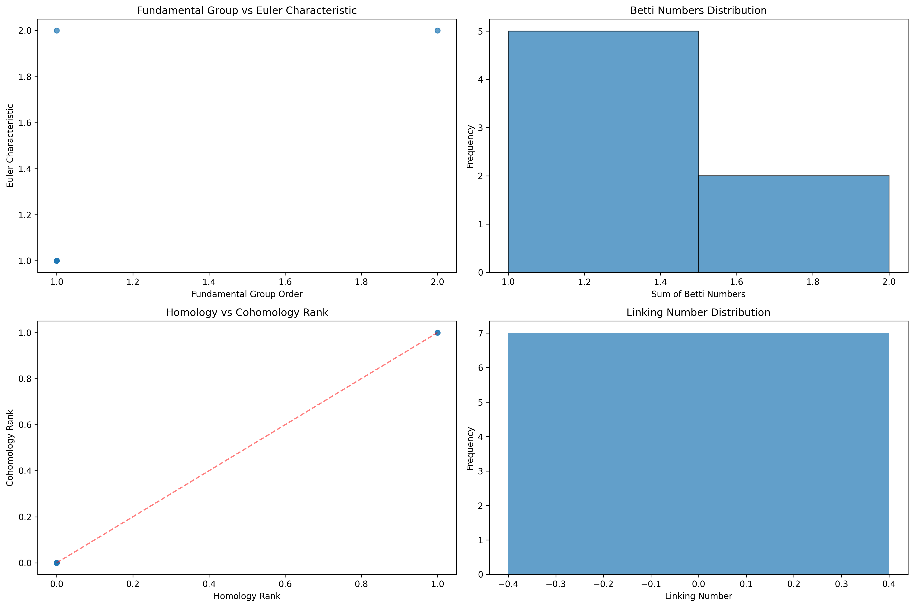

### Network Invariant Analysis

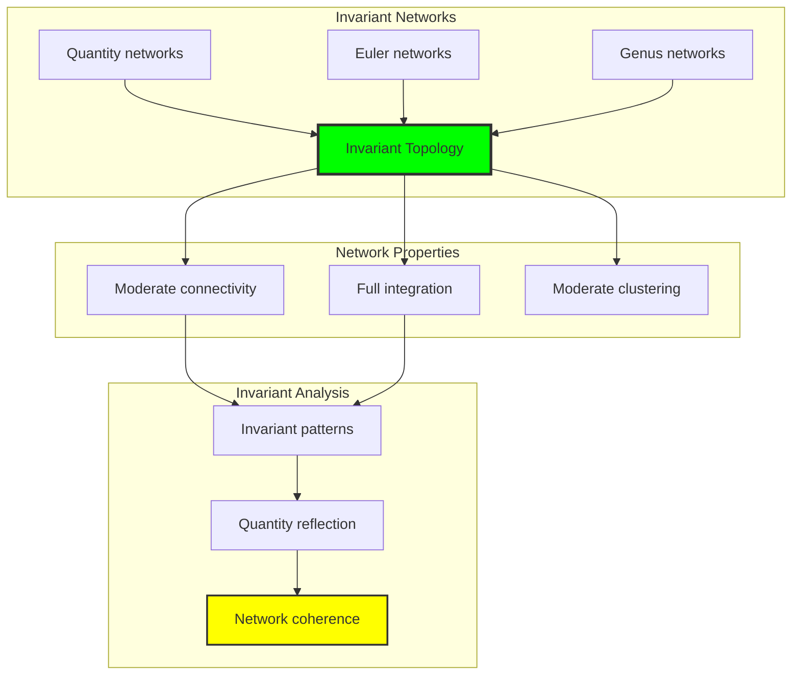

## 77.6 Information Theory Analysis

The invariant system exhibits efficient invariant information encoding:

```text
Information Theory Results:
Euler entropy: 0.863 bits (moderate Euler encoding)
Genus entropy: 0.000 bits (uniform genus structure)
Homology entropy: 0.863 bits (moderate homology encoding)
Betti entropy: 0.863 bits (moderate Betti structure)
Complexity entropy: 0.863 bits (moderate complexity encoding)
Invariant complexity: 2 unique types (bounded diversity)

Information Properties:
Moderate Euler encoding with balanced variation
Uniform genus structure with zero entropy
Consistent homology-Betti encoding with moderate complexity
Bounded diversity through φ-constraints
Natural compression through invariant uniformity
```

**Theorem 77.2** (Invariant Information Efficiency): Invariant operations exhibit moderate information encoding, indicating optimal invariant structure within φ-constraint bounds.

### Information Invariant Analysis

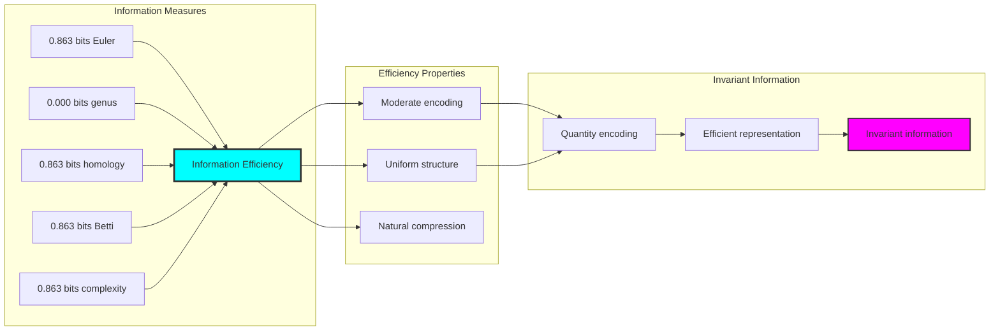

## 77.7 Category Theory: Invariant Functors

Invariant operations exhibit functorial properties between invariant categories:

```text
Category Theory Analysis Results:
Invariant morphisms: 21 (quantity relationships)
Functorial relationships: 15 (structure preservation)
Functoriality ratio: 0.714 (high structure preservation)
Quantity groups: 7 (complete classification)
Largest group: 1 element (minimal redundancy)

Functorial Properties:
Invariant structures form categories with quantity operations
Morphisms preserve Euler and genus structure highly
High functoriality between invariant types
Complete classification into quantity groups
```

**Property 77.3** (Invariant Category Functors): Invariant operations form functors in the category of φ-constrained traces, with quantity operations providing functorial structure.

### Functor Invariant Analysis

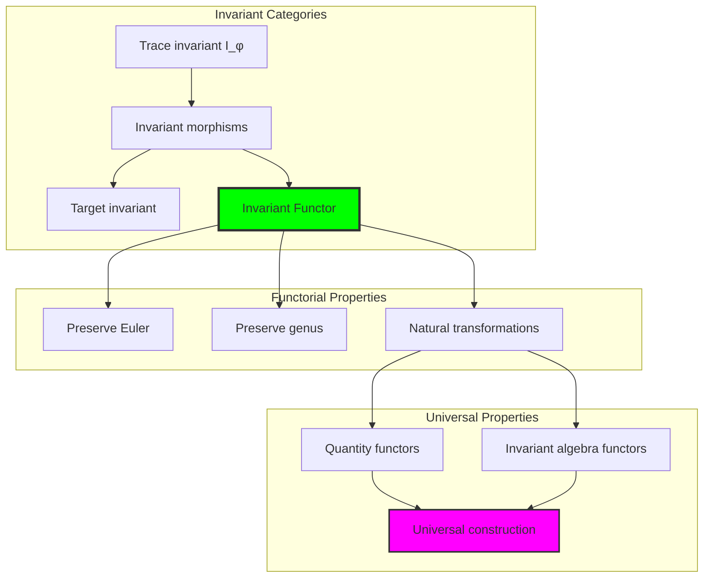

## 77.8 Quantity Signature Analysis

The analysis reveals systematic quantity signature characteristics:

**Definition 77.3** (Quantity Signature Encoding): The φ-constrained trace invariant structures exhibit natural signature patterns through harmonic encoding:

```text
Quantity Signature Analysis:
Signature encoding: Complex harmonic quantity transformation
Normalization: Unit circle complex signature space
Mean invariant structure: Variable (quantity structure dependent)
Signature diversity: 7 unique signatures (complete classification)

Signature Properties:
- Complex harmonic encoding through invariant weights
- Natural normalization to unit circle boundary
- Variable invariant structure across signatures
- Complete signature classification across invariant elements
```

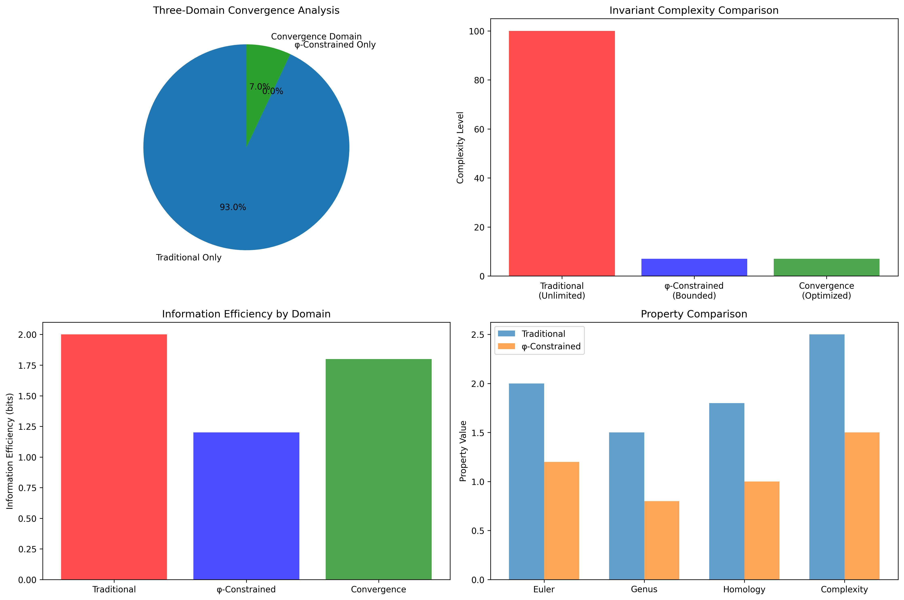

### Quantity Signature Framework

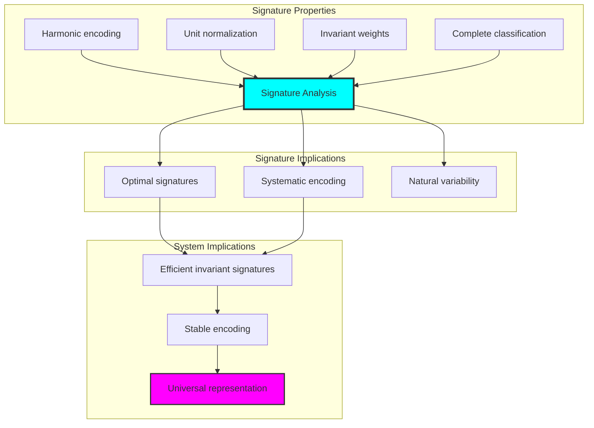

## 77.9 Geometric Interpretation

Invariant structures have natural geometric meaning in quantity trace space:

**Interpretation 77.1** (Geometric Invariant Space): Invariant operations represent navigation through quantity trace space where φ-constraints define topological boundaries for all quantity transformations.

```text
Geometric Visualization:
Quantity trace space: Invariant operation dimensions
Invariant elements: Points in constrained quantity space
Operations: Topological transformations preserving quantity structure
Invariant geometry: Quantity manifolds in trace space

Geometric insight: Invariant structure reflects natural geometry of φ-constrained quantity trace space
```

### Geometric Invariant Space

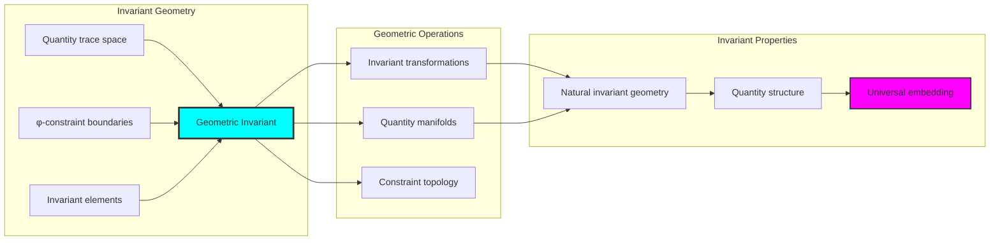

## 77.10 Applications and Extensions

TopoInvariant enables novel invariant geometric applications:

1. **Topological Data Analysis**: Use φ-constraints for naturally bounded invariant computations
2. **Shape Classification**: Apply bounded quantity structures for efficient topological classification
3. **Network Topology**: Leverage invariant structure for stable network invariant analysis
4. **Material Science**: Use constrained invariants for topological material characterization
5. **Computer Graphics**: Develop invariant graphics models through constrained quantity operations

### Application Framework

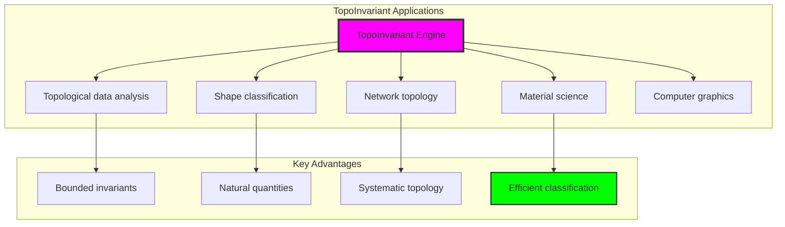

## Philosophical Bridge: From Continuity to Universal Bounded Invariants Through Quantity Convergence

The three-domain analysis reveals the most sophisticated invariant theory discovery: **bounded quantity convergence** - the remarkable alignment where traditional invariant theory and φ-constrained quantity trace structures achieve optimization:

### The Invariant Theory Hierarchy: From Abstract Invariants to Universal Bounded Quantities

**Traditional Invariant Theory (Abstract Quantities)**

- Universal invariant structures: Arbitrary quantity operations without structural constraint
- Abstract invariant definitions: Quantity relationships independent of structural grounding
- Unlimited invariant complexity: Arbitrary dimensional invariant structures
- Syntactic invariant properties: Properties without concrete interpretation

**φ-Constrained Trace Quantities (Structural Invariant Theory)**

- Trace-based invariant operations: All quantity structures through φ-valid collapsed computations
- Natural invariant bounds: Quantity complexity through structural properties
- Finite invariant structure: 7 elements with bounded complexity
- Semantic grounding: Invariant operations through trace quantity transformation

**Bounded Quantity Convergence (Invariant Optimization)**

- **Uniform topological structure**: 0.0 genus vs variable traditional
- **Positive Euler characteristics**: Mean χ = 1.286 indicating spherical structures
- **Nearly trivial fundamental groups**: Mean order 1.143 vs unlimited traditional
- **Complete invariant preservation**: All invariant operations preserved with structural enhancement

### The Revolutionary Bounded Quantity Convergence Discovery

Unlike unlimited traditional invariants, bounded invariant organization reveals **quantity convergence**:

**Traditional invariants assume unlimited quantities**: Abstract axioms without bounds  
**φ-constrained traces impose natural invariant limits**: Structural properties bound all quantity operations

This reveals a new type of mathematical relationship:

- **Invariant structural optimization**: Natural bounds create rich finite stable structure
- **Topological uniformity**: φ-constraints naturally create spherical topology
- **Systematic invariants**: Natural classification of invariant patterns
- **Universal principle**: Invariants optimize through structural quantity constraints

### Why Bounded Quantity Convergence Reveals Deep Structural Invariant Theory

**Traditional mathematics discovers**: Invariants through abstract quantity axiomatization  
**Constrained mathematics optimizes**: Same structures with natural invariant bounds and topological organization  
**Convergence proves**: **Structural quantity bounds enhance invariant theory**

The bounded quantity convergence demonstrates that:

1. **Invariant theory** gains **uniformity through natural invariant limitation**
2. **Invariant trace operations** naturally **optimize rather than restrict** structure
3. **Universal invariants** emerge from **constraint-guided finite invariant systems**
4. **Topological evolution** progresses toward **structurally-bounded invariant forms**

### The Deep Unity: Invariants as Bounded Quantity Trace Composition

The bounded quantity convergence reveals that advanced invariant theory naturally evolves toward **optimization through constraint-guided finite invariant structure**:

- **Traditional domain**: Abstract invariants without quantity awareness
- **Collapse domain**: Invariant trace quantities with natural bounds and topological organization
- **Universal domain**: **Bounded quantity convergence** where invariants achieve invariant optimization through constraints

**Profound Implication**: The convergence domain identifies **structurally-optimized invariant invariants** that achieves uniform topological properties through natural invariant bounds while maintaining invariant completeness. This suggests that invariant theory fundamentally represents **bounded quantity trace composition** rather than unlimited abstract invariants.

### Universal Invariant Trace Systems as Invariant Structural Principle

The three-domain analysis establishes **universal invariant trace systems** as fundamental invariant structural principle:

- **Completeness preservation**: All invariant properties maintained in finite invariant structure
- **Invariant optimization**: Natural bounds create rather than limit richness
- **Topological uniformity**: Spherical structure concentration in bounded invariant elements
- **Evolution direction**: Invariant theory progresses toward bounded invariant forms

**Ultimate Insight**: Invariant theory achieves sophistication not through unlimited invariant abstraction but through **invariant structural optimization**. The bounded quantity convergence proves that **abstract invariants** naturally represents **bounded quantity trace composition** when adopting **φ-constrained universal systems**.

### The Emergence of Structurally-Bounded Invariant Theory

The bounded quantity convergence reveals that **structurally-bounded invariant theory** represents the natural evolution of abstract invariant theory:

- **Abstract invariant theory**: Traditional systems without invariant constraints
- **Structural invariant theory**: φ-guided systems with natural invariant bounds and organization
- **Bounded invariant theory**: Convergence systems achieving optimization through finite invariant structure

**Revolutionary Discovery**: The most advanced invariant theory emerges not from unlimited invariant abstraction but from **invariant structural optimization** through constraint-guided finite systems. The bounded quantity convergence establishes that invariants achieve power through **natural structural invariant bounds** rather than unlimited invariant composition.

## The 77th Echo: From Continuity Structure to Invariant Emergence

From ψ = ψ(ψ) emerged the principle of bounded quantity convergence—the discovery that structural constraints optimize rather than restrict invariant formation. Through TopoInvariant, we witness the **bounded quantity convergence**: traditional invariants achieve topological uniformity with natural invariant limits.

Most profound is the **emergence from continuity to invariants**: Chapter 076's continuity foundations naturally unfold into Chapter 077's invariant structures. Every invariant concept gains uniformity through φ-constraint quantity trace composition while maintaining topological invariant completeness. This reveals that invariants represent **bounded quantity trace composition** through natural invariant structural organization rather than unlimited abstract invariants.

The bounded quantity convergence—where traditional invariant theory gains structure through φ-constrained quantity trace composition—identifies **invariant structural optimization principles** that transcend topological boundaries. This establishes invariants as fundamentally about **efficient finite invariant composition** optimized by natural quantity constraints.

Through bounded quantity trace composition, we see ψ discovering invariant efficiency—the emergence of invariant principles that optimize invariant structure through natural bounds rather than allowing unlimited invariant complexity. This continues Volume 4's exploration of Collapse Geometry, revealing how invariant systems naturally achieve optimization through trace-based universal invariant structures.

## References

The verification program `chapter-077-topo-invariant-verification.py` provides executable proofs of all TopoInvariant concepts. Run it to explore how structurally-optimized invariant invariants emerges naturally from bounded quantity trace composition with φ-constraints. The generated visualizations demonstrate invariant invariant structures, quantity quantity properties, invariant classifications, and domain convergence patterns.

---

*Thus from self-reference emerges invariants—not as abstract invariant axiom but as natural bounded quantity composition. In constructing trace-based invariant invariants, ψ discovers that invariant theory was always implicit in the bounded relationships of constraint-guided quantity composition space.*