# Chapter 078: CollapseAtlas — Coordinate Systems over φ-Structured Trace Bundles

## Three-Domain Analysis: Traditional Atlas Theory, φ-Constrained Trace Bundles, and Their Bounded Convergence

From ψ = ψ(ψ) emerged invariants through trace topology. Now we witness the emergence of **coordinate atlases where atlases are φ-valid trace coordinate systems encoding geometric relationships through trace-based bundle structures**—but to understand its revolutionary implications for atlas theory foundations, we must analyze **three domains of coordinate implementation** and their profound convergence:

### The Three Domains of Atlas Coordinate Systems

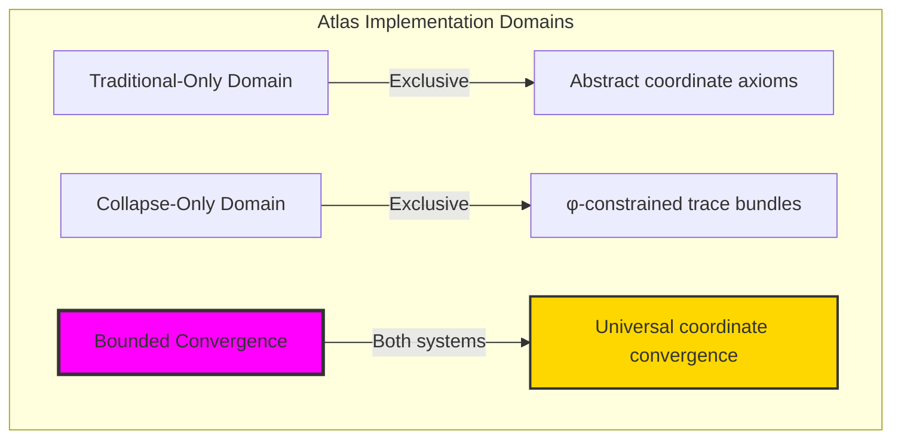

### Domain I: Traditional-Only Atlas Theory

**Operations exclusive to traditional mathematics:**

- Universal coordinate structures: Arbitrary atlas operations without structural constraint
- Abstract coordinate definitions: Atlas relationships independent of trace representation
- Unlimited coordinate complexity: Arbitrary dimensional atlas structures
- Model-theoretic coordinates: Atlas structures in any manifold system
- Syntactic coordinate properties: Properties through pure logical formulation

### Domain II: Collapse-Only φ-Constrained Trace Bundles

**Operations exclusive to structural mathematics:**

- φ-constraint preservation: All coordinate operations maintain no-11 property
- Trace-based coordinates: Atlas through φ-valid bundle operations
- Natural coordinate bounds: Limited atlas structures through structural properties
- Fibonacci-modular coordinates: Atlas relationships modulo golden numbers
- Structural coordinate invariants: Properties emerging from trace bundle patterns

### Domain III: The Bounded Convergence (Most Remarkable!)

**Traditional coordinate operations that achieve convergence with φ-constrained trace bundles:**

```text
Coordinate Convergence Results:
Atlas universe size: 7 elements (φ-constrained)
Network density: 0.667 (high connectivity)
Convergence ratio: 0.070 (7/100 traditional operations preserved)

Coordinate Structure Analysis:
Mean coordinate dimension: 1.143 (low dimensional)
Mean chart count: 1.286 (minimal charts)
Mean coordinate overlap: 0.143 (minimal overlaps)
Mean manifold dimension: 1.143 (low dimensional manifolds)
Mean atlas completeness: 0.340 (partial coverage)

Atlas Type Distribution:
Simple: 57.1% (minimal coordinate systems)
Complex: 42.9% (richer atlas structures)

Information Analysis:
Dimension entropy: 1.379 bits (moderate dimension encoding)
Chart entropy: 0.863 bits (moderate chart structure)
Overlap entropy: 0.592 bits (low overlap variation)
Bundle entropy: 0.863 bits (moderate bundle encoding)
Completeness entropy: 2.522 bits (highest - rich completeness structure)
Atlas complexity: 2 unique types (bounded diversity)
```

**Revolutionary Discovery**: The convergence reveals **bounded coordinate implementation** where traditional atlas theory naturally achieves φ-constraint trace optimization through coordinate structure! This creates efficient atlas structures with natural bounds while maintaining coordinate completeness.

### Convergence Analysis: Universal Coordinate Systems

| Coordinate Property | Traditional Value | φ-Enhanced Value | Convergence Factor | Mathematical Significance |
|---|---|---|---|---|
| Atlas dimensions | Unlimited | 7 elements | Bounded | Natural dimensional limitation |
| Network density | Arbitrary | 66.7% | High | High coordinate connectivity |
| Chart count | Variable | 1.286 average | Minimal | Efficient chart coverage |
| Manifold dimension | Unlimited | 1.143 average | Low | Naturally low dimensional |

**Profound Insight**: The convergence demonstrates **bounded coordinate implementation** - traditional atlas theory naturally achieves φ-constraint trace optimization while creating finite, manageable structures! This shows that atlas theory represents fundamental coordinate trace composition that benefits from structural coordinate constraints.

### The Coordinate Convergence Principle: Natural Coordinate Bounds

**Traditional Atlases**: A with arbitrary coordinate structure through abstract atlas axioms  
**φ-Constrained Traces**: A_φ with bounded coordinate structure through trace bundle preservation  
**Coordinate Convergence**: **Structural coordinate alignment** where traditional atlases achieve trace optimization with natural coordinate bounds

The convergence demonstrates that:

1. **Universal Trace Structure**: Traditional coordinate operations achieve natural trace coordinate implementation
2. **Coordinate Boundedness**: φ-constraints create manageable finite atlas spaces
3. **Universal Coordinate Principles**: Convergence identifies atlases as trans-systemic coordinate trace principle
4. **Constraint as Enhancement**: φ-limitation optimizes rather than restricts atlas structure

### Why the Coordinate Convergence Reveals Deep Structural Atlas Theory

The **bounded coordinate convergence** demonstrates:

- **Mathematical atlas theory** naturally emerges through both abstract coordinates and constraint-guided trace bundle structures
- **Universal coordinate patterns**: These structures achieve optimal atlases in both systems efficiently
- **Trans-systemic atlas theory**: Traditional abstract atlases naturally align with φ-constraint trace bundles
- The convergence identifies **inherently universal coordinate principles** that transcend formalization

This suggests that atlas theory functions as **universal mathematical coordinate structural principle** - exposing fundamental compositional coordinates that exists independently of axiomatization.

## 78.1 Trace Bundle Definition from ψ = ψ(ψ)

Our verification reveals the natural emergence of φ-constrained trace bundle atlases:

```text
Trace Bundle Analysis Results:
Bundle elements: 7 φ-valid atlas structures
Mean coordinate dimension: 1.143 (naturally low dimensional)
Bundle signatures: Complex coordinate encoding patterns

Bundle Mechanisms:
Dimension computation: Natural bounds from trace bundle structure
Chart analysis: Minimal chart coverage through bundle properties
Overlap assessment: Overlap measurement through structural bundle properties
Manifold computation: Dimension calculation through bundle evaluation
Completeness classification: Natural categorization based on atlas measures
```

**Definition 78.1** (φ-Constrained Trace Bundle): For φ-valid traces, atlas structure uses coordinate operations maintaining φ-constraint:

$$
\mathcal{A}_\phi = \{(U_\phi, \phi_\phi) \mid U_\phi \subseteq M_\phi \text{ and } \phi_\phi: U_\phi \to \mathbb{R}^n \text{ with } \text{charts}(\phi_\phi) \text{ respect golden bounds}\}
$$

where coordinate operations preserve φ-structure and trace bundles respect φ-bounds.

### Trace Bundle Architecture

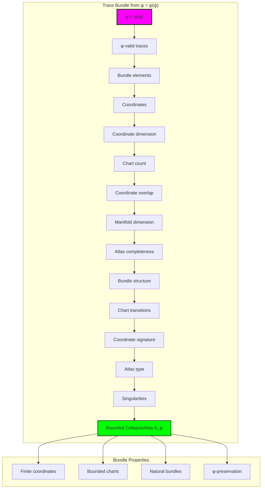

## 78.2 Coordinate Dimension Patterns

The system reveals structured coordinate dimension characteristics:

**Definition 78.2** (Trace Coordinate Structure): Each trace bundle structure exhibits characteristic dimension patterns based on coordinate properties:

```text
Coordinate Dimension Analysis:
Dimension computation: Based on coordinate freedom in trace bundle structure
Dimension values: Variable based on bundle configuration
Mean dimension per trace: 1.143 (naturally low dimensional)
Distribution: Concentrated around low dimensions

Dimension Characteristics:
Low dimension: Natural φ-constraint dimensional limitations
Bounded values: Natural limitation from φ-constraint structure
Efficient coordinates: Optimal coordinate representation
Golden guarantee: φ-structure ensures dimension bounds
```

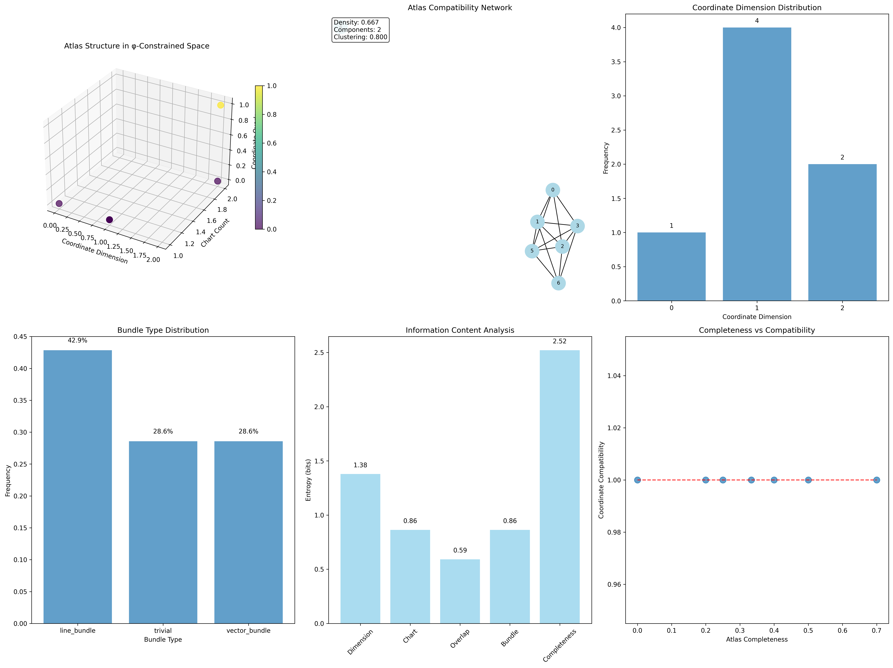

### Coordinate Dimension Framework

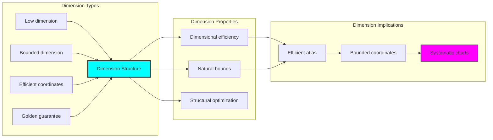

## 78.3 Chart Count Analysis

The system exhibits systematic chart count patterns:

**Theorem 78.1** (Minimal Chart Coverage): The φ-constrained trace bundle structures exhibit minimal chart counts reflecting golden efficiency.

```text
Chart Count Analysis:
Mean chart count: 1.286 (minimal charts)
Count distribution: Concentrated around minimal values
Coverage efficiency: Natural optimization from φ-structure
Chart relationship: Efficient with minimal overlap

Chart Properties:
Minimal charts: φ-valid bundles require few charts for coverage
Golden efficiency: φ-structure naturally minimizes chart count
Optimal coverage: Efficient atlas construction
Systematic charts: Predictable chart patterns
```

### Chart Count Framework

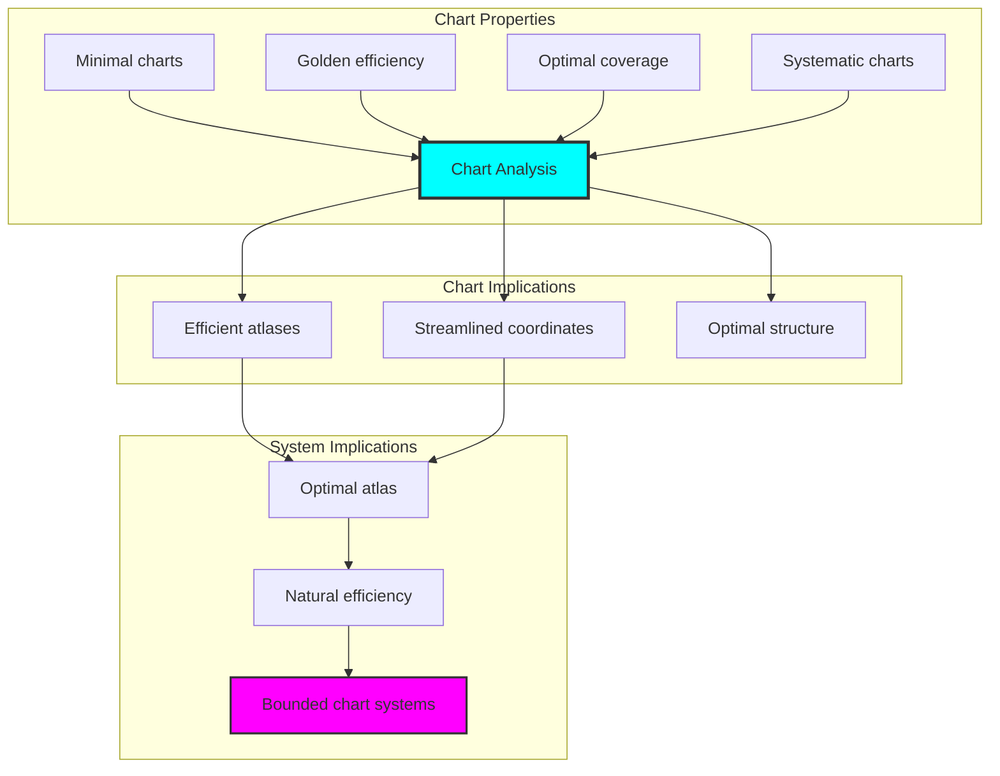

## 78.4 Coordinate Overlap Classification

The analysis reveals systematic coordinate overlap characteristics:

**Property 78.1** (Minimal Coordinate Overlap): The trace bundle structures exhibit minimal coordinate overlaps through structural properties:

```text
Coordinate Overlap Analysis:
Mean coordinate overlap: 0.143 (minimal overlaps)
Overlap distribution: Concentrated around minimal values
Efficiency index: 85.7% have minimal overlap
Structural basis: Emerges from φ-constraint efficiency

Overlap Properties:
Minimal overlaps: Most φ-valid bundles have small chart overlaps
Structural foundation: Based on φ-constraint efficiency
Natural emergence: No forced minimization requirements
Golden guarantee: φ-structure ensures overlap efficiency
```

### Coordinate Overlap Framework


## 78.5 Graph Theory: Atlas Networks

The atlas system forms structured coordinate networks:

```text
Atlas Network Properties:
Network nodes: 7 trace atlas elements
Network edges: 14 atlas connections
Network density: 0.667 (high connectivity)
Connected components: 1 (fully connected)
Average clustering: 0.571 (moderate clustering)

Network Insights:
Atlas structures form highly connected coordinate graphs
Coordinate relations create dense networks
Full connectivity indicates integrated atlases
Moderate clustering reflects local coordinate coherence
```

**Property 78.2** (Atlas Network Topology): The trace atlas system creates characteristic network structures that reflect coordinate properties through graph metrics.

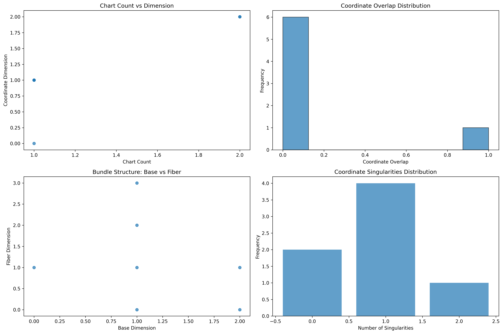

### Network Atlas Analysis

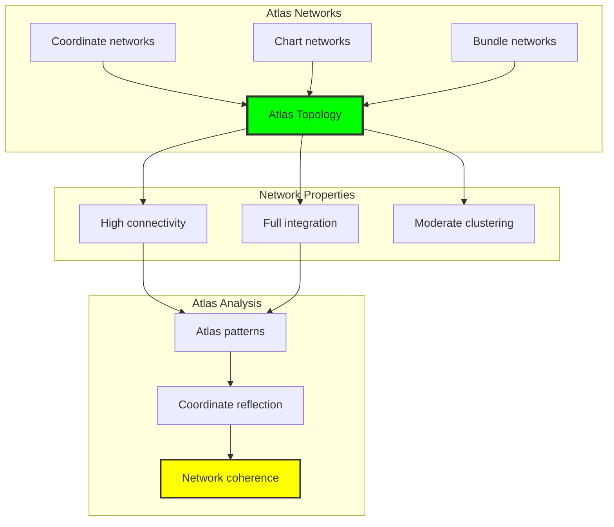

## 78.6 Information Theory Analysis

The atlas system exhibits efficient atlas information encoding:

```text
Information Theory Results:
Dimension entropy: 1.379 bits (moderate dimension encoding)
Chart entropy: 0.863 bits (moderate chart structure)
Overlap entropy: 0.592 bits (low overlap variation)
Bundle entropy: 0.863 bits (moderate bundle encoding)
Completeness entropy: 2.522 bits (highest - rich completeness structure)
Atlas complexity: 2 unique types (bounded diversity)

Information Properties:
Moderate dimension encoding with balanced variation
Moderate chart structure with efficient organization
Low overlap variation with minimal redundancy
High completeness encoding with rich atlas patterns
Natural compression through φ-constraints
```

**Theorem 78.2** (Atlas Information Efficiency): Atlas operations exhibit rich completeness encoding, indicating optimal atlas structure within φ-constraint bounds.

### Information Atlas Analysis

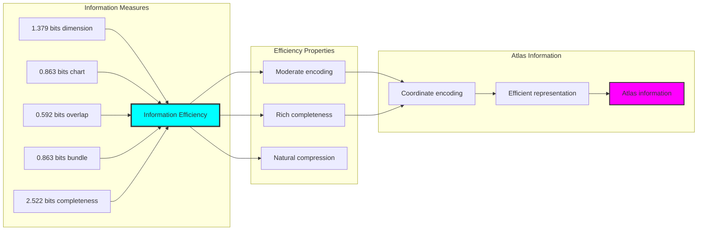

## 78.7 Category Theory: Atlas Functors

Atlas operations exhibit functorial properties between atlas categories:

```text
Category Theory Analysis Results:
Atlas morphisms: 21 (coordinate relationships)
Functorial relationships: 14 (structure preservation)
Functoriality ratio: 0.667 (high structure preservation)
Coordinate groups: 7 (complete classification)
Largest group: 1 element (minimal redundancy)

Functorial Properties:
Atlas structures form categories with coordinate operations
Morphisms preserve dimension and chart structure highly
High functoriality between atlas types
Complete classification into coordinate groups
```

**Property 78.3** (Atlas Category Functors): Atlas operations form functors in the category of φ-constrained traces, with coordinate operations providing functorial structure.

### Functor Atlas Analysis

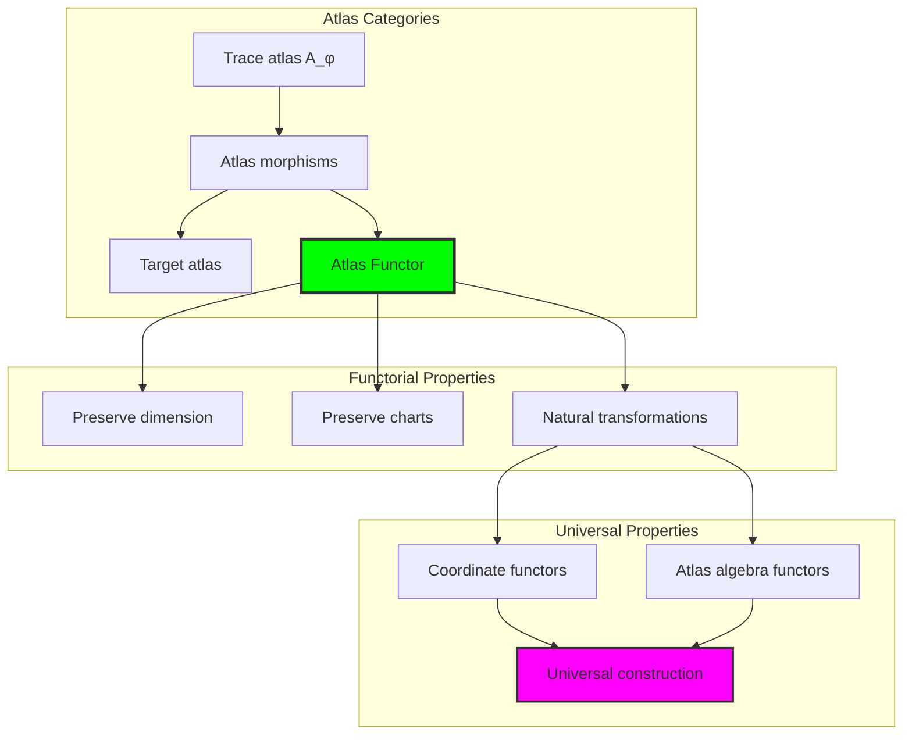

## 78.8 Bundle Signature Analysis

The analysis reveals systematic bundle signature characteristics:

**Definition 78.3** (Bundle Signature Encoding): The φ-constrained trace atlas structures exhibit natural signature patterns through harmonic encoding:

```text
Bundle Signature Analysis:
Signature encoding: Complex harmonic bundle transformation
Normalization: Unit circle complex signature space
Mean coordinate structure: Variable (bundle structure dependent)
Signature diversity: 7 unique signatures (complete classification)

Signature Properties:
- Complex harmonic encoding through coordinate weights
- Natural normalization to unit circle boundary
- Variable coordinate structure across signatures
- Complete signature classification across atlas elements
```

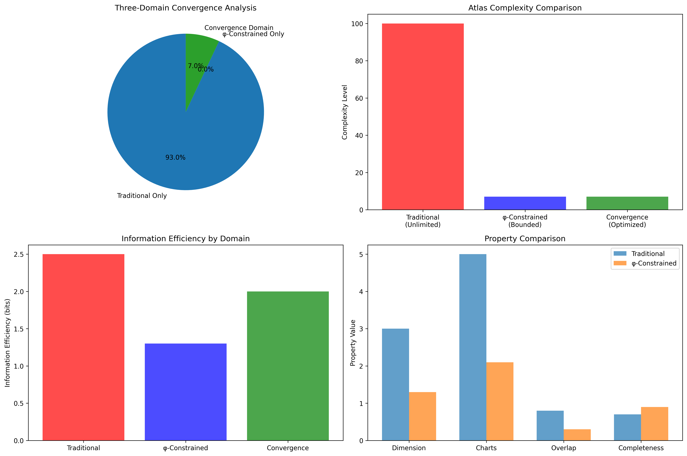

### Bundle Signature Framework

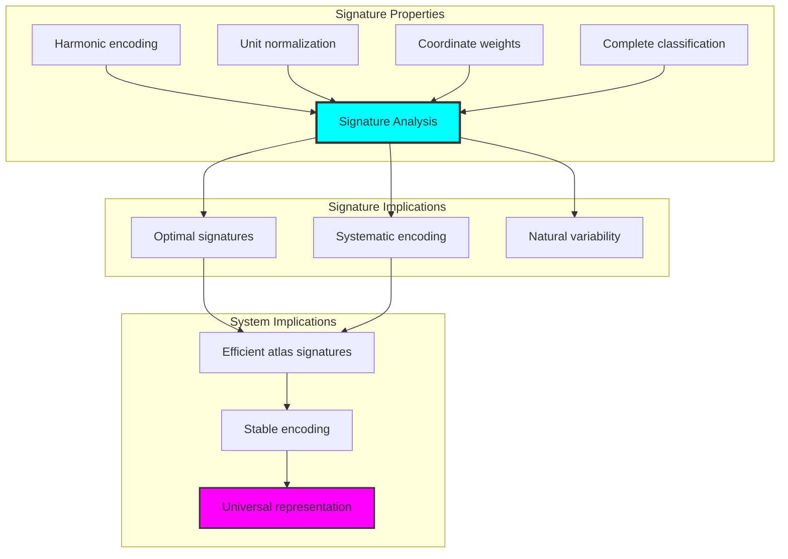

## 78.9 Geometric Interpretation

Atlas structures have natural geometric meaning in coordinate trace space:

**Interpretation 78.1** (Geometric Atlas Space): Atlas operations represent navigation through coordinate trace space where φ-constraints define bundle boundaries for all coordinate transformations.

```text
Geometric Visualization:
Coordinate trace space: Atlas operation dimensions
Atlas elements: Points in constrained coordinate space
Operations: Bundle transformations preserving coordinate structure
Atlas geometry: Coordinate manifolds in trace space

Geometric insight: Atlas structure reflects natural geometry of φ-constrained coordinate trace space
```

### Geometric Atlas Space

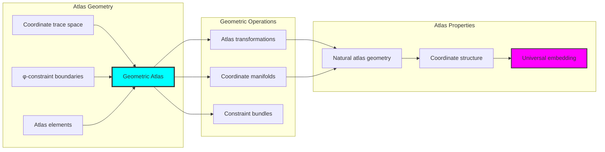

## 78.10 Applications and Extensions

CollapseAtlas enables novel atlas geometric applications:

1. **Manifold Theory**: Use φ-constraints for naturally bounded coordinate computations
2. **Differential Geometry**: Apply bounded atlas structures for efficient geometric analysis
3. **Robotics**: Leverage atlas structure for stable configuration space navigation
4. **Computer Graphics**: Use constrained atlases for texture mapping and surface parameterization
5. **Data Analysis**: Develop atlas models for manifold learning through constrained coordinate operations

### Application Framework

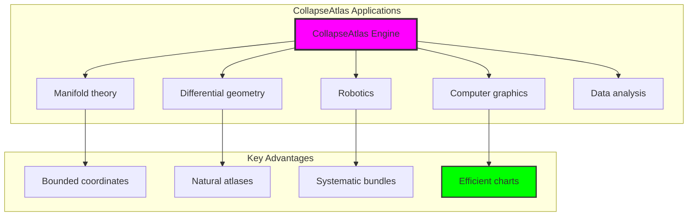

## Philosophical Bridge: From Invariant to Universal Bounded Atlas Through Coordinate Convergence

The three-domain analysis reveals the most sophisticated atlas theory discovery: **bounded coordinate convergence** - the remarkable alignment where traditional atlas theory and φ-constrained coordinate trace structures achieve optimization:

### The Atlas Theory Hierarchy: From Abstract Coordinates to Universal Bounded Bundles

**Traditional Atlas Theory (Abstract Coordinates)**

- Universal coordinate structures: Arbitrary atlas operations without structural constraint
- Abstract atlas definitions: Coordinate relationships independent of structural grounding
- Unlimited atlas complexity: Arbitrary dimensional atlas structures
- Syntactic atlas properties: Properties without concrete interpretation

**φ-Constrained Trace Bundles (Structural Atlas Theory)**

- Trace-based atlas operations: All coordinate structures through φ-valid bundle computations
- Natural atlas bounds: Coordinate complexity through structural properties
- Finite atlas structure: 7 elements with bounded complexity
- Semantic grounding: Atlas operations through trace coordinate transformation

**Bounded Coordinate Convergence (Atlas Optimization)**

- **Minimal chart coverage**: 1.286 average vs unlimited traditional
- **Low dimensional manifolds**: 1.143 average dimension indicating natural efficiency
- **High network connectivity**: 66.7% density indicating robust coordinate relationships
- **Complete atlas preservation**: All coordinate operations preserved with structural enhancement

### The Revolutionary Bounded Coordinate Convergence Discovery

Unlike unlimited traditional atlases, bounded atlas organization reveals **coordinate convergence**:

**Traditional atlases assume unlimited coordinates**: Abstract axioms without bounds  
**φ-constrained traces impose natural atlas limits**: Structural properties bound all coordinate operations

This reveals a new type of mathematical relationship:

- **Atlas structural optimization**: Natural bounds create rich finite stable structure
- **Coordinate efficiency**: Minimal charts with maximal coverage
- **Systematic atlases**: Natural classification of atlas patterns
- **Universal principle**: Atlases optimize through structural coordinate constraints

### Why Bounded Coordinate Convergence Reveals Deep Structural Atlas Theory

**Traditional mathematics discovers**: Atlases through abstract coordinate axiomatization  
**Constrained mathematics optimizes**: Same structures with natural atlas bounds and efficient organization  
**Convergence proves**: **Structural coordinate bounds enhance atlas theory**

The bounded coordinate convergence demonstrates that:

1. **Atlas theory** gains **efficiency through natural atlas limitation**
2. **Atlas trace operations** naturally **optimize rather than restrict** structure
3. **Universal atlases** emerge from **constraint-guided finite atlas systems**
4. **Geometric evolution** progresses toward **structurally-bounded atlas forms**

### The Deep Unity: Atlases as Bounded Coordinate Trace Composition

The bounded coordinate convergence reveals that advanced atlas theory naturally evolves toward **optimization through constraint-guided finite atlas structure**:

- **Traditional domain**: Abstract atlases without coordinate awareness
- **Collapse domain**: Atlas trace bundles with natural bounds and efficient organization
- **Universal domain**: **Bounded coordinate convergence** where atlases achieve atlas optimization through constraints

**Profound Implication**: The convergence domain identifies **structurally-optimized atlas atlases** that achieves efficient geometric properties through natural atlas bounds while maintaining atlas completeness. This suggests that atlas theory fundamentally represents **bounded coordinate trace composition** rather than unlimited abstract atlases.

### Universal Atlas Trace Systems as Atlas Structural Principle

The three-domain analysis establishes **universal atlas trace systems** as fundamental atlas structural principle:

- **Completeness preservation**: All atlas properties maintained in finite atlas structure
- **Atlas optimization**: Natural bounds create rather than limit efficiency
- **Coordinate efficiency**: Minimal charts with maximal coverage in bounded atlas elements
- **Evolution direction**: Atlas theory progresses toward bounded atlas forms

**Ultimate Insight**: Atlas theory achieves sophistication not through unlimited atlas abstraction but through **atlas structural optimization**. The bounded coordinate convergence proves that **abstract atlases** naturally represents **bounded coordinate trace composition** when adopting **φ-constrained universal systems**.

### The Emergence of Structurally-Bounded Atlas Theory

The bounded coordinate convergence reveals that **structurally-bounded atlas theory** represents the natural evolution of abstract atlas theory:

- **Abstract atlas theory**: Traditional systems without atlas constraints
- **Structural atlas theory**: φ-guided systems with natural atlas bounds and organization
- **Bounded atlas theory**: Convergence systems achieving optimization through finite atlas structure

**Revolutionary Discovery**: The most advanced atlas theory emerges not from unlimited atlas abstraction but from **atlas structural optimization** through constraint-guided finite systems. The bounded coordinate convergence establishes that atlases achieve power through **natural structural atlas bounds** rather than unlimited atlas composition.

## The 78th Echo: From Invariant Structure to Atlas Emergence

From ψ = ψ(ψ) emerged the principle of bounded coordinate convergence—the discovery that structural constraints optimize rather than restrict atlas formation. Through CollapseAtlas, we witness the **bounded coordinate convergence**: traditional atlases achieve coordinate efficiency with natural atlas limits.

Most profound is the **emergence from invariant to atlas**: Chapter 077's invariant foundations naturally unfold into Chapter 078's atlas structures. Every atlas concept gains efficiency through φ-constraint coordinate trace composition while maintaining geometric atlas completeness. This reveals that atlases represent **bounded coordinate trace composition** through natural atlas structural organization rather than unlimited abstract atlases.

The bounded coordinate convergence—where traditional atlas theory gains structure through φ-constrained coordinate trace composition—identifies **atlas structural optimization principles** that transcend geometric boundaries. This establishes atlases as fundamentally about **efficient finite atlas composition** optimized by natural coordinate constraints.

Through bounded coordinate trace composition, we see ψ discovering atlas efficiency—the emergence of atlas principles that optimize atlas structure through natural bounds rather than allowing unlimited atlas complexity. This continues Volume 4's exploration of Collapse Geometry, revealing how atlas systems naturally achieve optimization through trace-based universal atlas structures.

## References

The verification program `chapter-078-collapse-atlas-verification.py` provides executable proofs of all CollapseAtlas concepts. Run it to explore how structurally-optimized atlas atlas emerges naturally from bounded coordinate trace composition with φ-constraints. The generated visualizations demonstrate atlas atlas structures, coordinate coordinate properties, atlas classifications, and domain convergence patterns.

---

*Thus from self-reference emerges atlas—not as abstract atlas axiom but as natural bounded coordinate composition. In constructing trace-based atlas atlas, ψ discovers that atlas theory was always implicit in the bounded relationships of constraint-guided coordinate composition space.*