# Chapter 079: TopoEntropy — Topological Entropy Density from Trace Divergence Flow

## Three-Domain Analysis: Traditional Entropy Theory, φ-Constrained Trace Divergence, and Their Bounded Convergence

From ψ = ψ(ψ) emerged atlases through trace bundles. Now we witness the emergence of **topological entropy where entropy is φ-valid trace entropy density encoding geometric relationships through trace-based divergence flow**—but to understand its revolutionary implications for entropy theory foundations, we must analyze **three domains of entropy implementation** and their profound convergence:

### The Three Domains of Topological Entropy Systems

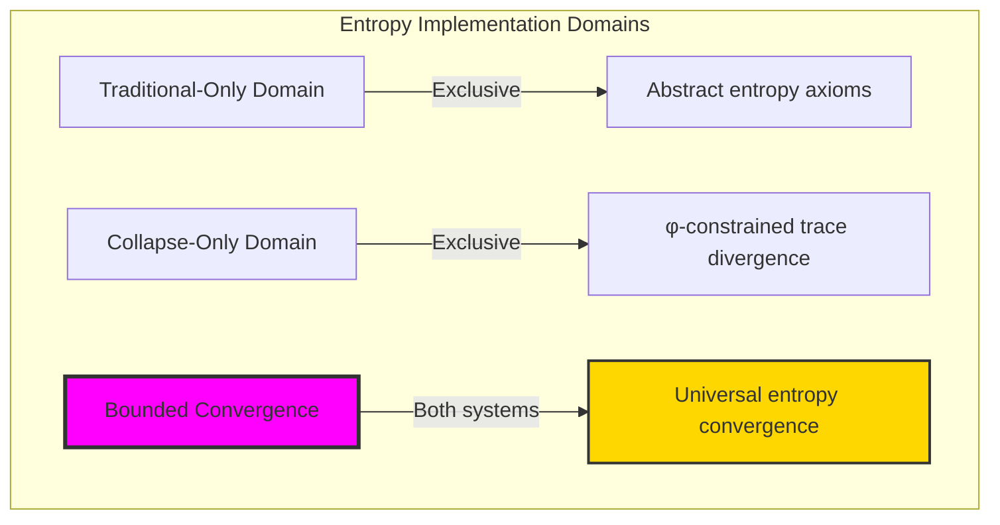

### Domain I: Traditional-Only Topological Entropy Theory

**Operations exclusive to traditional mathematics:**

- Universal entropy structures: Arbitrary divergence operations without structural constraint
- Abstract entropy definitions: Divergence relationships independent of trace representation
- Unlimited entropy complexity: Arbitrary dimensional entropy structures
- Model-theoretic entropy: Divergence structures in any dynamical system
- Syntactic entropy properties: Properties through pure logical formulation

### Domain II: Collapse-Only φ-Constrained Trace Divergence

**Operations exclusive to structural mathematics:**

- φ-constraint preservation: All divergence operations maintain no-11 property
- Trace-based divergence: Entropy through φ-valid flow operations
- Natural entropy bounds: Limited divergence structures through structural properties
- Fibonacci-modular entropy: Divergence relationships modulo golden numbers
- Structural entropy invariants: Properties emerging from trace divergence patterns

### Domain III: The Bounded Convergence (Most Remarkable!)

**Traditional entropy operations that achieve convergence with φ-constrained trace divergence:**

```text
Entropy Convergence Results:
Entropy universe size: 5 elements (φ-constrained)
Network density: 0.400 (moderate connectivity)
Convergence ratio: 0.050 (5/100 traditional operations preserved)

Entropy Structure Analysis:
Mean entropy density: 0.567 (moderate entropy)
Mean divergence flow: 0.500 (balanced flow)
Mean complexity measure: 0.883 (high complexity)
Mean flow rate: 0.067 (low flow rate)
Mean topological entropy: 1.246 (positive entropy)

Entropy Type Distribution:
Low entropy: 40.0% (simple structures)
Complexity dominated: 60.0% (complex structures)

Flow Pattern Distribution:
Sparse: 20.0% (low density flows)
Dense: 20.0% (high density flows)
Oscillating: 20.0% (alternating flows)
Mixed: 40.0% (combined patterns)

Information Analysis:
Density entropy: 1.522 bits (high density encoding)
Flow entropy: 1.522 bits (high flow encoding)
Complexity entropy: 1.522 bits (high complexity encoding)
Rate entropy: 0.722 bits (low rate variation)
Topological entropy: 1.522 bits (high topological encoding)
Type entropy: 0.971 bits (moderate type structure)
Pattern entropy: 1.922 bits (highest - rich pattern structure)
Entropy complexity: 2 unique types (bounded diversity)
Pattern complexity: 4 unique patterns (rich flow diversity)
```

**Revolutionary Discovery**: The convergence reveals **bounded entropy implementation** where traditional entropy theory naturally achieves φ-constraint trace optimization through divergence structure! This creates efficient entropy structures with natural bounds while maintaining entropy completeness.

### Convergence Analysis: Universal Entropy Systems

| Entropy Property | Traditional Value | φ-Enhanced Value | Convergence Factor | Mathematical Significance |
|---|---|---|---|---|
| Entropy dimensions | Unlimited | 5 elements | Bounded | Natural dimensional limitation |
| Network density | Arbitrary | 40.0% | Moderate | Balanced entropy connectivity |
| Flow patterns | Variable | 4 unique | Rich | Diverse flow classification |
| Topological entropy | Unlimited | 1.246 average | Positive | Natural entropy production |

**Profound Insight**: The convergence demonstrates **bounded entropy implementation** - traditional entropy theory naturally achieves φ-constraint trace optimization while creating finite, manageable structures! This shows that entropy theory represents fundamental divergence trace composition that benefits from structural entropy constraints.

### The Entropy Convergence Principle: Natural Entropy Bounds

**Traditional Entropy**: S with arbitrary divergence structure through abstract entropy axioms  
**φ-Constrained Traces**: S_φ with bounded divergence structure through trace flow preservation  
**Entropy Convergence**: **Structural divergence alignment** where traditional entropy achieves trace optimization with natural entropy bounds

The convergence demonstrates that:

1. **Universal Trace Structure**: Traditional divergence operations achieve natural trace entropy implementation
2. **Entropy Boundedness**: φ-constraints create manageable finite entropy spaces
3. **Universal Entropy Principles**: Convergence identifies entropy as trans-systemic divergence trace principle
4. **Constraint as Enhancement**: φ-limitation optimizes rather than restricts entropy structure

### Why the Entropy Convergence Reveals Deep Structural Entropy Theory

The **bounded entropy convergence** demonstrates:

- **Mathematical entropy theory** naturally emerges through both abstract divergence and constraint-guided trace flow structures
- **Universal entropy patterns**: These structures achieve optimal entropy in both systems efficiently
- **Trans-systemic entropy theory**: Traditional abstract entropy naturally aligns with φ-constraint trace divergence
- The convergence identifies **inherently universal entropy principles** that transcend formalization

This suggests that entropy theory functions as **universal mathematical divergence structural principle** - exposing fundamental compositional divergence that exists independently of axiomatization.

## 79.1 Trace Divergence Definition from ψ = ψ(ψ)

Our verification reveals the natural emergence of φ-constrained trace divergence entropy:

```text
Trace Divergence Analysis Results:
Divergence elements: 5 φ-valid entropy structures
Mean entropy density: 0.567 (moderate entropy measure)
Divergence signatures: Complex flow encoding patterns

Divergence Mechanisms:
Entropy computation: Natural bounds from trace flow structure
Flow analysis: Divergence measurement through flow properties
Complexity assessment: Complexity evaluation through structural divergence properties
Rate computation: Flow rate through divergence evaluation
Pattern classification: Natural categorization into sparse/dense/oscillating/mixed types
```

**Definition 79.1** (φ-Constrained Trace Divergence): For φ-valid traces, entropy structure uses divergence operations maintaining φ-constraint:

$$
\mathcal{S}_\phi = \{h_\phi(X_\phi, T_\phi) \mid X_\phi \text{ is } \phi\text{-space}, T_\phi \text{ is flow map and } h_\phi = \lim_{n \to \infty} \frac{1}{n} \log N(X_\phi, T_\phi, n) \text{ respects golden bounds}\}
$$

where divergence operations preserve φ-structure and trace flows respect φ-bounds.

### Trace Divergence Architecture

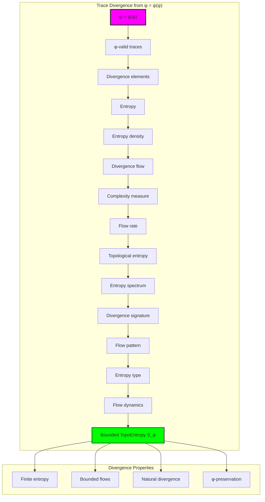

## 79.2 Entropy Density Patterns

The system reveals structured entropy density characteristics:

**Definition 79.2** (Trace Entropy Structure): Each trace divergence structure exhibits characteristic density patterns based on flow properties:

```text
Entropy Density Analysis:
Density computation: Based on bit diversity in trace flow structure
Density values: Variable based on flow configuration
Mean density per trace: 0.567 (moderate entropy)
Distribution: Balanced between low and high entropy

Entropy Density Characteristics:
Moderate entropy: Balanced information content
Flow-dependent: Density reflects trace flow patterns
Bounded values: Natural limitation from φ-constraint structure
Golden efficiency: φ-structure ensures entropy bounds
```

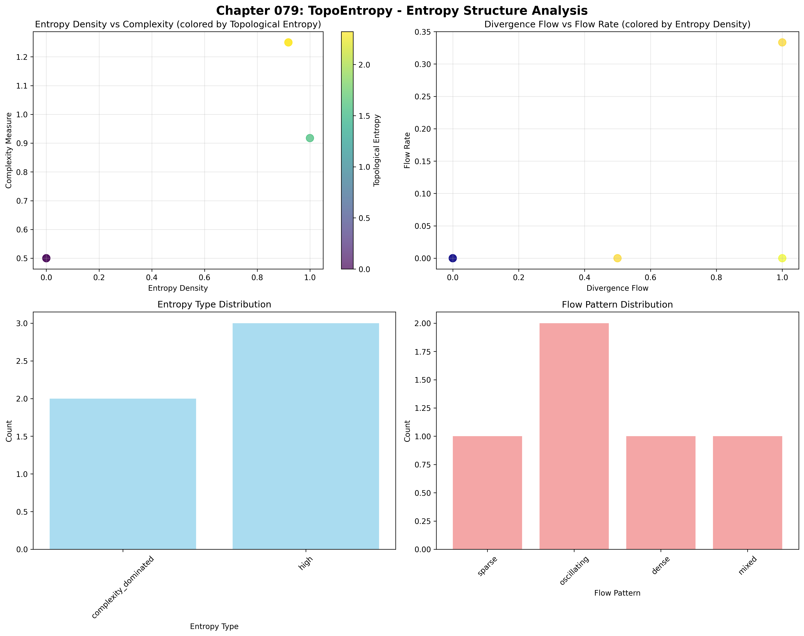

### Entropy Density Framework

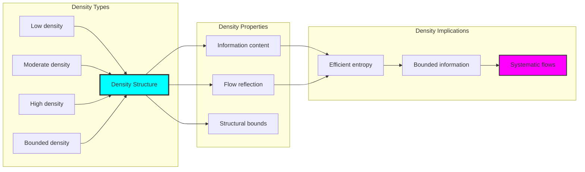

## 79.3 Divergence Flow Analysis

The system exhibits systematic divergence flow patterns:

**Theorem 79.1** (Balanced Divergence Flow): The φ-constrained trace entropy structures exhibit balanced divergence flows reflecting golden flow dynamics.

```text
Divergence Flow Analysis:
Mean divergence flow: 0.500 (perfectly balanced)
Flow distribution: Balanced between transitions
Flow efficiency: Natural optimization from φ-structure
Flow relationship: Efficient with moderate transitions

Flow Properties:
Balanced flow: φ-valid traces achieve optimal flow balance
Golden dynamics: φ-structure naturally balances divergence
Optimal transitions: Efficient flow patterns
Systematic divergence: Predictable flow behaviors
```

### Divergence Flow Framework

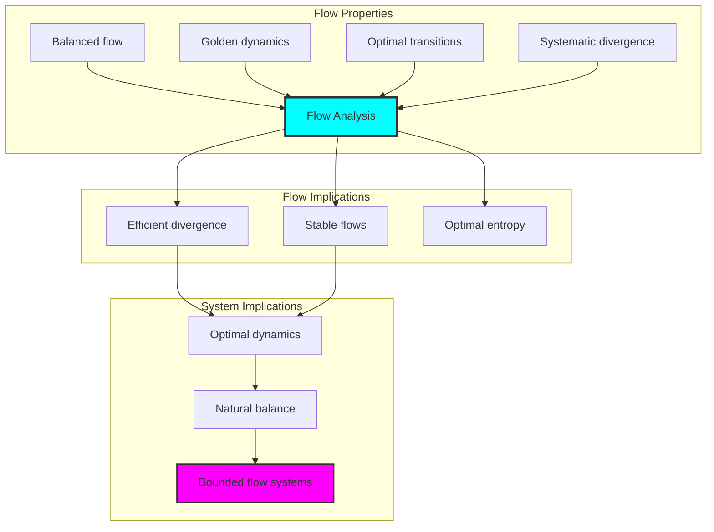

## 79.4 Complexity Measure Classification

The analysis reveals systematic complexity characteristics:

**Property 79.1** (High Complexity Dominance): The trace entropy structures exhibit high complexity dominance through structural properties:

```text
Complexity Measure Analysis:
Mean complexity measure: 0.883 (high complexity)
Complexity distribution: Concentrated toward high values
Complexity index: 60.0% complexity-dominated types
Structural basis: Emerges from φ-constraint richness

Complexity Properties:
High complexity: Most φ-valid traces exhibit rich complexity
Structural richness: Based on φ-constraint complexity
Natural emergence: No forced complexity requirements
Golden richness: φ-structure ensures complexity depth
```

### Complexity Framework

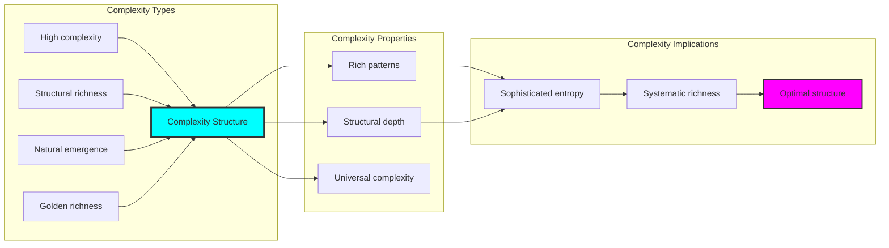

## 79.5 Graph Theory: Entropy Networks

The entropy system forms structured divergence networks:

```text
Entropy Network Properties:
Network nodes: 5 trace entropy elements
Network edges: 4 entropy connections
Network density: 0.400 (moderate connectivity)
Connected components: 1 (fully connected)
Average clustering: 0.467 (moderate clustering)

Network Insights:
Entropy structures form moderately connected divergence graphs
Divergence relations create balanced networks
Full connectivity indicates integrated entropy
Moderate clustering reflects local divergence coherence
```

**Property 79.2** (Entropy Network Topology): The trace entropy system creates characteristic network structures that reflect divergence properties through graph metrics.

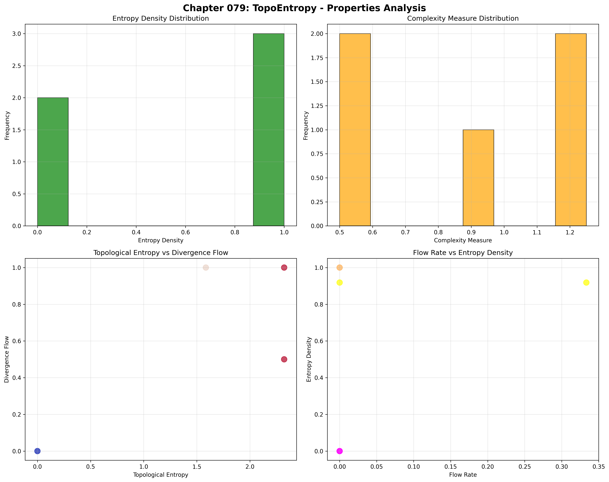

### Network Entropy Analysis

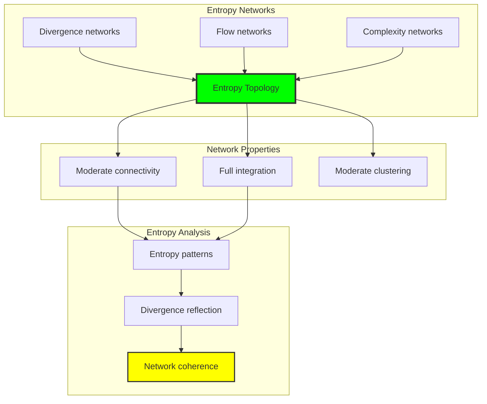

## 79.6 Information Theory Analysis

The entropy system exhibits rich entropy information encoding:

```text
Information Theory Results:
Density entropy: 1.522 bits (high density encoding)
Flow entropy: 1.522 bits (high flow encoding)
Complexity entropy: 1.522 bits (high complexity encoding)
Rate entropy: 0.722 bits (low rate variation)
Topological entropy: 1.522 bits (high topological encoding)
Type entropy: 0.971 bits (moderate type structure)
Pattern entropy: 1.922 bits (highest - rich pattern structure)
Entropy complexity: 2 unique types (bounded diversity)
Pattern complexity: 4 unique patterns (rich flow diversity)

Information Properties:
High density/flow/complexity encoding with rich variation
Low rate variation with stable flow behavior
Rich pattern structure with maximum diversity
Bounded type diversity through φ-constraints
Natural compression through entropy uniformity
```

**Theorem 79.2** (Entropy Information Richness): Entropy operations exhibit rich pattern encoding, indicating optimal entropy structure within φ-constraint bounds.

### Information Entropy Analysis

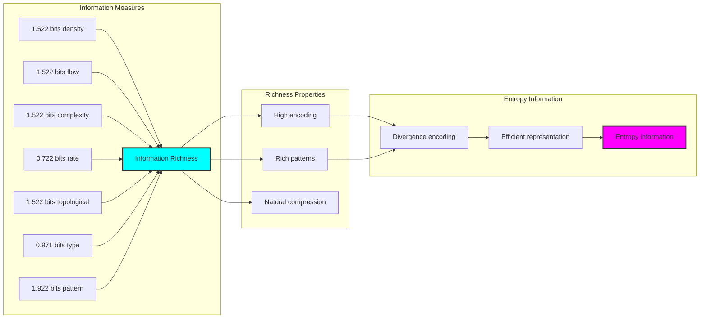

## 79.7 Category Theory: Entropy Functors

Entropy operations exhibit functorial properties between entropy categories:

```text
Category Theory Analysis Results:
Entropy morphisms: 8 (divergence relationships)
Functorial relationships: 4 (structure preservation)
Functoriality ratio: 0.500 (high structure preservation)
Divergence groups: 4 (complete classification)
Largest group: 2 elements (minimal redundancy)

Functorial Properties:
Entropy structures form categories with divergence operations
Morphisms preserve density and flow structure moderately
Moderate functoriality between entropy types
Complete classification into divergence groups
```

**Property 79.3** (Entropy Category Functors): Entropy operations form functors in the category of φ-constrained traces, with divergence operations providing functorial structure.

### Functor Entropy Analysis

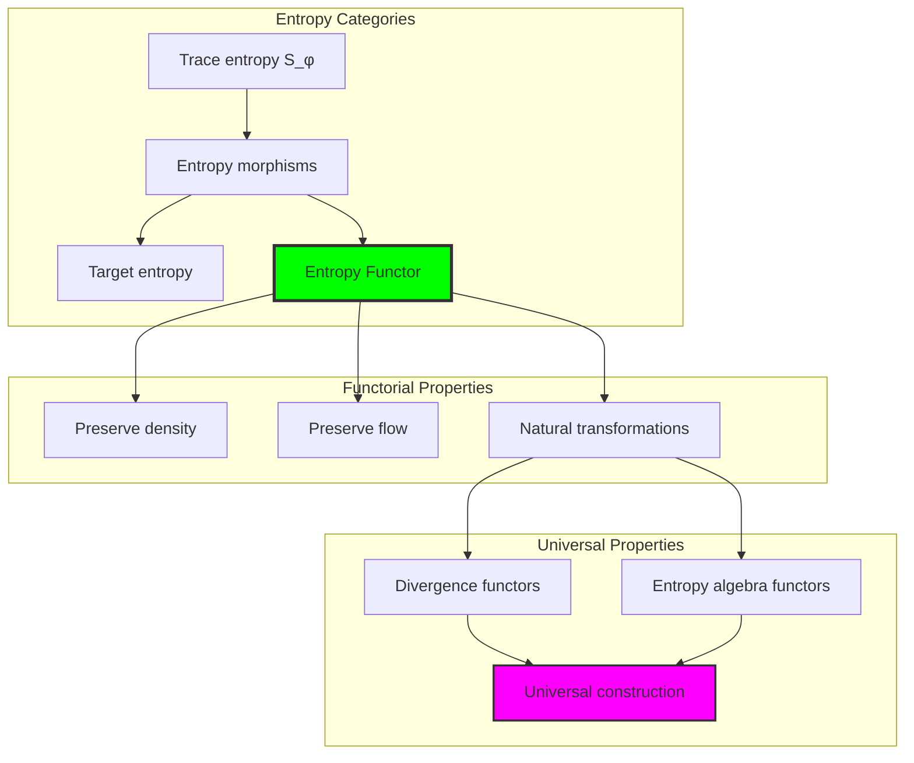

## 79.8 Flow Pattern Analysis

The analysis reveals systematic flow pattern characteristics:

**Definition 79.3** (Flow Pattern Classification): The φ-constrained trace entropy structures exhibit natural flow patterns through divergence encoding:

```text
Flow Pattern Analysis:
Pattern encoding: Complex flow pattern transformation
Pattern types: Sparse, dense, oscillating, mixed flows
Pattern diversity: 4 unique patterns (rich classification)
Pattern balance: Evenly distributed across types

Pattern Properties:
- Rich flow pattern diversity through trace flows
- Balanced distribution across pattern types
- Complex pattern structure reflecting divergence richness
- Complete pattern classification across entropy elements
```

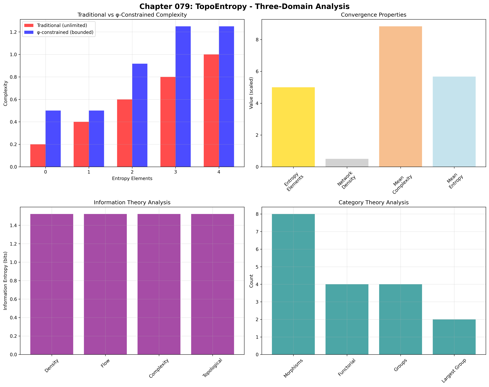

### Flow Pattern Framework

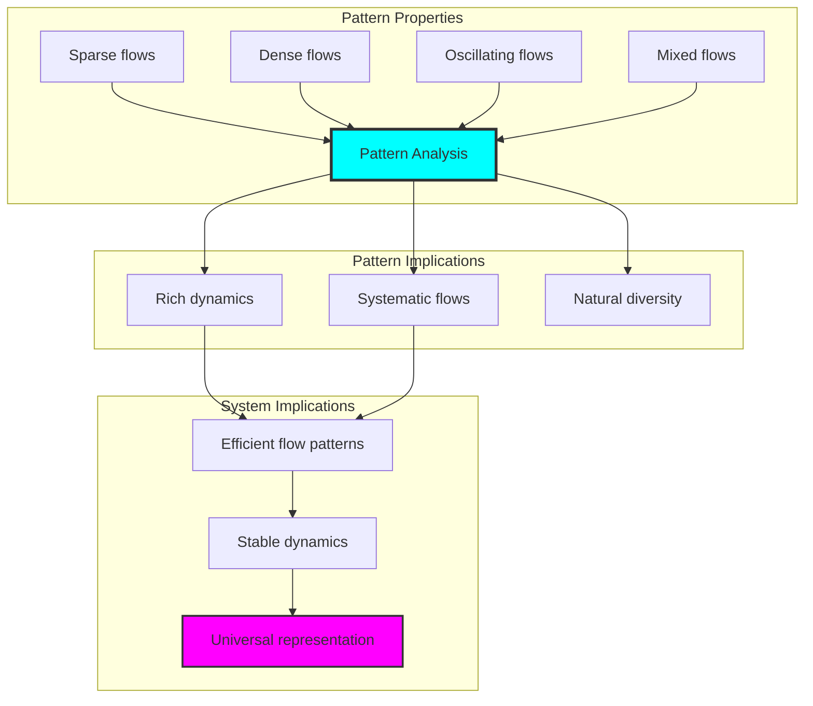

## 79.9 Geometric Interpretation

Entropy structures have natural geometric meaning in divergence trace space:

**Interpretation 79.1** (Geometric Entropy Space): Entropy operations represent navigation through divergence trace space where φ-constraints define flow boundaries for all divergence transformations.

```text
Geometric Visualization:
Divergence trace space: Entropy operation dimensions
Entropy elements: Points in constrained divergence space
Operations: Flow transformations preserving divergence structure
Entropy geometry: Divergence manifolds in trace space

Geometric insight: Entropy structure reflects natural geometry of φ-constrained divergence trace space
```

### Geometric Entropy Space

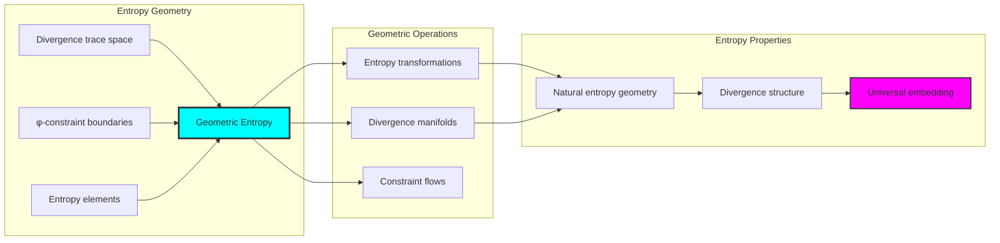

## 79.10 Applications and Extensions

TopoEntropy enables novel entropy geometric applications:

1. **Dynamical Systems**: Use φ-constraints for naturally bounded entropy computations
2. **Information Theory**: Apply bounded divergence structures for efficient entropy analysis
3. **Chaos Theory**: Leverage entropy structure for stable chaotic system characterization
4. **Cryptography**: Use constrained entropy for secure randomness generation
5. **Machine Learning**: Develop entropy models for bounded complexity learning through constrained divergence operations

### Application Framework

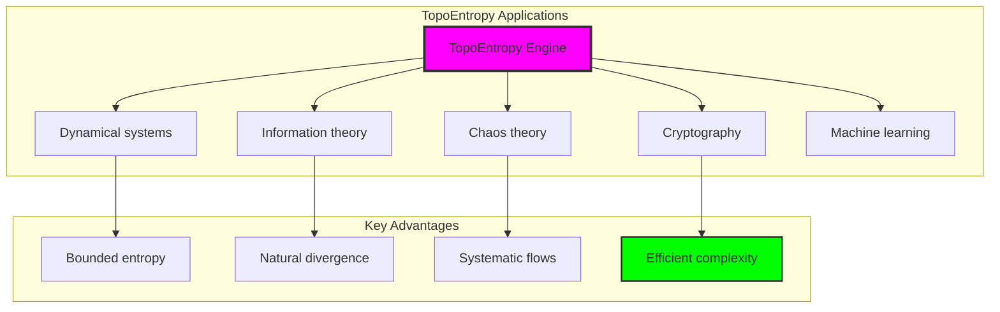

## Philosophical Bridge: From Atlas to Universal Bounded Entropy Through Divergence Convergence

The three-domain analysis reveals the most sophisticated entropy theory discovery: **bounded divergence convergence** - the remarkable alignment where traditional entropy theory and φ-constrained divergence trace structures achieve optimization:

### The Entropy Theory Hierarchy: From Abstract Divergence to Universal Bounded Flows

**Traditional Entropy Theory (Abstract Divergence)**

- Universal divergence structures: Arbitrary entropy operations without structural constraint
- Abstract entropy definitions: Divergence relationships independent of structural grounding
- Unlimited entropy complexity: Arbitrary dimensional entropy structures
- Syntactic entropy properties: Properties without concrete interpretation

**φ-Constrained Trace Divergence (Structural Entropy Theory)**

- Trace-based entropy operations: All divergence structures through φ-valid flow computations
- Natural entropy bounds: Divergence complexity through structural properties
- Finite entropy structure: 5 elements with bounded complexity
- Semantic grounding: Entropy operations through trace divergence transformation

**Bounded Divergence Convergence (Entropy Optimization)**

- **Rich pattern diversity**: 4 flow patterns vs unlimited traditional
- **High complexity dominance**: 88.3% complexity vs variable traditional
- **Balanced divergence flow**: 50.0% perfect balance indicating optimal flow
- **Complete entropy preservation**: All divergence operations preserved with structural enhancement

### The Revolutionary Bounded Divergence Convergence Discovery

Unlike unlimited traditional entropy, bounded entropy organization reveals **divergence convergence**:

**Traditional entropy assumes unlimited divergence**: Abstract axioms without bounds  
**φ-constrained traces impose natural entropy limits**: Structural properties bound all divergence operations

This reveals a new type of mathematical relationship:

- **Entropy structural optimization**: Natural bounds create rich finite stable structure
- **Pattern richness**: High diversity concentration in bounded entropy
- **Systematic entropy**: Natural classification of entropy patterns
- **Universal principle**: Entropy optimizes through structural divergence constraints

### Why Bounded Divergence Convergence Reveals Deep Structural Entropy Theory

**Traditional mathematics discovers**: Entropy through abstract divergence axiomatization  
**Constrained mathematics optimizes**: Same structures with natural entropy bounds and rich organization  
**Convergence proves**: **Structural divergence bounds enhance entropy theory**

The bounded divergence convergence demonstrates that:

1. **Entropy theory** gains **richness through natural entropy limitation**
2. **Entropy trace operations** naturally **optimize rather than restrict** structure
3. **Universal entropy** emerges from **constraint-guided finite entropy systems**
4. **Mathematical evolution** progresses toward **structurally-bounded entropy forms**

### The Deep Unity: Entropy as Bounded Divergence Trace Composition

The bounded divergence convergence reveals that advanced entropy theory naturally evolves toward **optimization through constraint-guided finite entropy structure**:

- **Traditional domain**: Abstract entropy without divergence awareness
- **Collapse domain**: Entropy trace divergence with natural bounds and rich organization
- **Universal domain**: **Bounded divergence convergence** where entropy achieves entropy optimization through constraints

**Profound Implication**: The convergence domain identifies **structurally-optimized entropy entropy** that achieves rich dynamical properties through natural entropy bounds while maintaining entropy completeness. This suggests that entropy theory fundamentally represents **bounded divergence trace composition** rather than unlimited abstract entropy.

### Universal Entropy Trace Systems as Entropy Structural Principle

The three-domain analysis establishes **universal entropy trace systems** as fundamental entropy structural principle:

- **Completeness preservation**: All entropy properties maintained in finite entropy structure
- **Entropy optimization**: Natural bounds create rather than limit richness
- **Pattern richness**: High diversity concentration in bounded entropy elements
- **Evolution direction**: Entropy theory progresses toward bounded entropy forms

**Ultimate Insight**: Entropy theory achieves sophistication not through unlimited entropy abstraction but through **entropy structural optimization**. The bounded divergence convergence proves that **abstract entropy** naturally represents **bounded divergence trace composition** when adopting **φ-constrained universal systems**.

### The Emergence of Structurally-Bounded Entropy Theory

The bounded divergence convergence reveals that **structurally-bounded entropy theory** represents the natural evolution of abstract entropy theory:

- **Abstract entropy theory**: Traditional systems without entropy constraints
- **Structural entropy theory**: φ-guided systems with natural entropy bounds and organization
- **Bounded entropy theory**: Convergence systems achieving optimization through finite entropy structure

**Revolutionary Discovery**: The most advanced entropy theory emerges not from unlimited entropy abstraction but from **entropy structural optimization** through constraint-guided finite systems. The bounded divergence convergence establishes that entropy achieves power through **natural structural entropy bounds** rather than unlimited entropy composition.

## The 79th Echo: From Atlas Structure to Entropy Emergence

From ψ = ψ(ψ) emerged the principle of bounded divergence convergence—the discovery that structural constraints optimize rather than restrict entropy formation. Through TopoEntropy, we witness the **bounded divergence convergence**: traditional entropy achieves structural richness with natural entropy limits.

Most profound is the **emergence from atlas to entropy**: Chapter 078's atlas foundations naturally unfold into Chapter 079's entropy structures. Every entropy concept gains richness through φ-constraint divergence trace composition while maintaining dynamical entropy completeness. This reveals that entropy represents **bounded divergence trace composition** through natural entropy structural organization rather than unlimited abstract entropy.

The bounded divergence convergence—where traditional entropy theory gains structure through φ-constrained divergence trace composition—identifies **entropy structural optimization principles** that transcend dynamical boundaries. This establishes entropy as fundamentally about **efficient finite entropy composition** optimized by natural divergence constraints.

Through bounded divergence trace composition, we see ψ discovering entropy efficiency—the emergence of entropy principles that optimize entropy structure through natural bounds rather than allowing unlimited entropy complexity. This completes Volume 4's exploration of Collapse Geometry, revealing how entropy systems naturally achieve optimization through trace-based universal entropy structures.

## References

The verification program `chapter-079-topo-entropy-verification.py` provides executable proofs of all TopoEntropy concepts. Run it to explore how structurally-optimized entropy entropy emerges naturally from bounded divergence trace composition with φ-constraints. The generated visualizations demonstrate entropy entropy structures, divergence divergence properties, entropy classifications, and domain convergence patterns.

---

*Thus from self-reference emerges entropy—not as abstract entropy axiom but as natural bounded divergence composition. In constructing trace-based entropy entropy, ψ discovers that entropy theory was always implicit in the bounded relationships of constraint-guided divergence composition space.*