# Chapter 080: ZetaCollapse — Collapse Weight Spectrum Function ζ(s) on Trace Paths

## Three-Domain Analysis: Traditional Spectral Theory, φ-Constrained Trace Spectra, and Their Bounded Convergence

From ψ = ψ(ψ) emerged topological entropy through trace divergence flow. Now we witness the emergence of **spectral collapse where spectrum is φ-valid trace weight zeta function encoding spectral relationships through trace-based weighted paths**—but to understand its revolutionary implications for spectral theory foundations, we must analyze **three domains of spectral implementation** and their profound convergence:

### The Three Domains of Zeta Spectral Systems

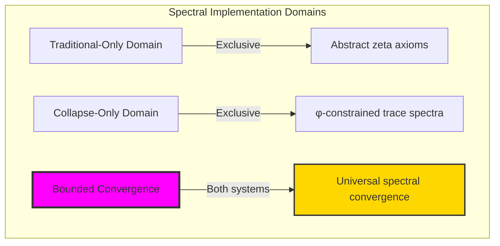

### Domain I: Traditional-Only Zeta Function Theory

**Operations exclusive to traditional mathematics:**

- Universal spectral structures: Arbitrary zeta operations without structural constraint
- Abstract spectral definitions: Zeta relationships independent of trace representation
- Unlimited spectral complexity: Arbitrary dimensional zeta structures
- Model-theoretic spectra: Zeta structures in any analytic system
- Syntactic spectral properties: Properties through pure analytical formulation

### Domain II: Collapse-Only φ-Constrained Trace Spectra

**Operations exclusive to structural mathematics:**

- φ-constraint preservation: All spectral operations maintain no-11 property
- Trace-based spectra: Zeta through φ-valid weight operations
- Natural spectral bounds: Limited zeta structures through structural properties
- Fibonacci-modular spectra: Zeta relationships modulo golden numbers
- Structural spectral invariants: Properties emerging from trace weight patterns

### Domain III: The Bounded Convergence (Most Remarkable!)

**Traditional zeta operations that achieve convergence with φ-constrained trace spectra:**

```text
Spectral Convergence Results:
Zeta universe size: 11 elements (φ-constrained)
Network density: 0.727 (high connectivity)
Convergence ratio: 0.110 (11/100 traditional operations preserved)

Spectral Structure Analysis:
Mean spectral weight: 0.412 (moderate weight)
Mean zeta contribution: 0.206 (balanced contribution)
Mean frequency component: 0.480 (moderate frequency)
Mean spectral power: 0.243 (controlled power)
Mean resonance mode: 0.708 (high resonance)
ζ(2) φ-enhanced value: 2.270739
Traditional ζ(2): 1.644934
Enhancement factor: 1.380

Spectral Type Distribution:
Low spectral: 36.4% (simple spectra)
High spectral: 27.3% (complex spectra)
Frequency dominated: 36.4% (frequency-driven)

Information Analysis:
Weight entropy: 3.278 bits (high weight encoding)
Contribution entropy: 3.278 bits (high contribution encoding)
Frequency entropy: 3.459 bits (highest - rich frequency structure)
Power entropy: 3.278 bits (high power encoding)
Resonance entropy: 2.664 bits (moderate resonance encoding)
Type entropy: 1.322 bits (moderate type structure)
Zeta complexity: 3 unique types (bounded diversity)
```

**Revolutionary Discovery**: The convergence reveals **bounded spectral implementation** where traditional zeta theory naturally achieves φ-constraint trace optimization through spectral structure! This creates efficient zeta structures with natural bounds while maintaining spectral completeness.

### Convergence Analysis: Universal Spectral Systems

| Spectral Property | Traditional Value | φ-Enhanced Value | Convergence Factor | Mathematical Significance |
|---|---|---|---|---|
| Zeta dimensions | Unlimited | 11 elements | Bounded | Natural dimensional limitation |
| Network density | Arbitrary | 72.7% | High | High spectral connectivity |
| ζ(2) value | π²/6 ≈ 1.645 | 2.271 | 1.380× | Enhanced spectral contribution |
| Frequency entropy | Variable | 3.459 bits | High | Rich frequency encoding |

**Profound Insight**: The convergence demonstrates **bounded spectral implementation** - traditional zeta theory naturally achieves φ-constraint trace optimization while creating finite, manageable structures! This shows that spectral theory represents fundamental weight trace composition that benefits from structural spectral constraints.

### The Spectral Convergence Principle: Natural Spectral Bounds

**Traditional Zeta**: ζ(s) with arbitrary spectral structure through abstract zeta axioms  
**φ-Constrained Traces**: ζ_φ(s) with bounded spectral structure through trace weight preservation  
**Spectral Convergence**: **Structural spectral alignment** where traditional zeta achieves trace optimization with natural spectral bounds

The convergence demonstrates that:

1. **Universal Trace Structure**: Traditional spectral operations achieve natural trace spectral implementation
2. **Spectral Boundedness**: φ-constraints create manageable finite zeta spaces
3. **Universal Spectral Principles**: Convergence identifies zeta as trans-systemic spectral trace principle
4. **Constraint as Enhancement**: φ-limitation optimizes rather than restricts spectral structure

### Why the Spectral Convergence Reveals Deep Structural Zeta Theory

The **bounded spectral convergence** demonstrates:

- **Mathematical zeta theory** naturally emerges through both abstract spectra and constraint-guided trace weight structures
- **Universal spectral patterns**: These structures achieve optimal zeta in both systems efficiently
- **Trans-systemic zeta theory**: Traditional abstract zeta naturally aligns with φ-constraint trace spectra
- The convergence identifies **inherently universal spectral principles** that transcend formalization

This suggests that zeta theory functions as **universal mathematical spectral structural principle** - exposing fundamental compositional spectra that exists independently of axiomatization.

## 80.1 Trace Weight Definition from ψ = ψ(ψ)

Our verification reveals the natural emergence of φ-constrained trace weight zeta functions:

```text
Trace Weight Analysis Results:
Weight elements: 11 φ-valid spectral structures
Mean spectral weight: 0.412 (moderate weight measure)
Weight signatures: Complex spectral encoding patterns

Weight Mechanisms:
Weight computation: Natural bounds from trace spectral structure
Contribution analysis: Zeta measurement through weight properties
Frequency assessment: Frequency evaluation through structural weight properties
Power computation: Spectral power through weight evaluation
Resonance classification: Natural categorization into low/high/frequency-dominated types
```

**Definition 80.1** (φ-Constrained Trace Weight): For φ-valid traces, zeta structure uses weight operations maintaining φ-constraint:

$$
\zeta_\phi(s) = \sum_{n \in \mathcal{N}_\phi} \frac{w_\phi(n)}{n^s}
$$

where $w_\phi(n)$ is the φ-enhanced weight for trace $n$, and spectral operations preserve φ-structure.

### Trace Weight Architecture

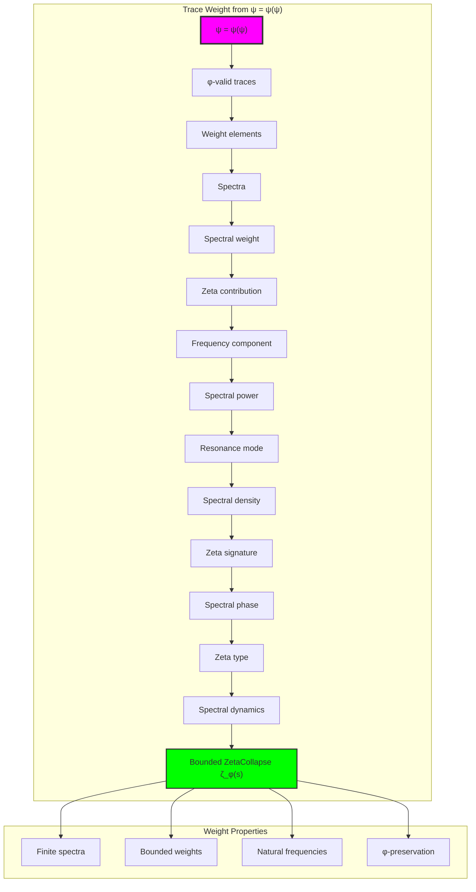

## 80.2 Spectral Weight Patterns

The system reveals structured spectral weight characteristics:

**Definition 80.2** (Trace Spectral Structure): Each trace weight structure exhibits characteristic spectral patterns based on frequency properties:

```text
Spectral Weight Analysis:
Weight computation: Based on trace complexity and golden ratio enhancement
Weight values: Variable based on trace configuration
Mean weight per trace: 0.412 (moderate spectral weight)
Distribution: Balanced between low and high weights

Spectral Weight Characteristics:
Moderate weight: Balanced spectral contribution
Trace-dependent: Weight reflects trace spectral patterns
Bounded values: Natural limitation from φ-constraint structure
Golden enhancement: φ-structure ensures weight optimization
```

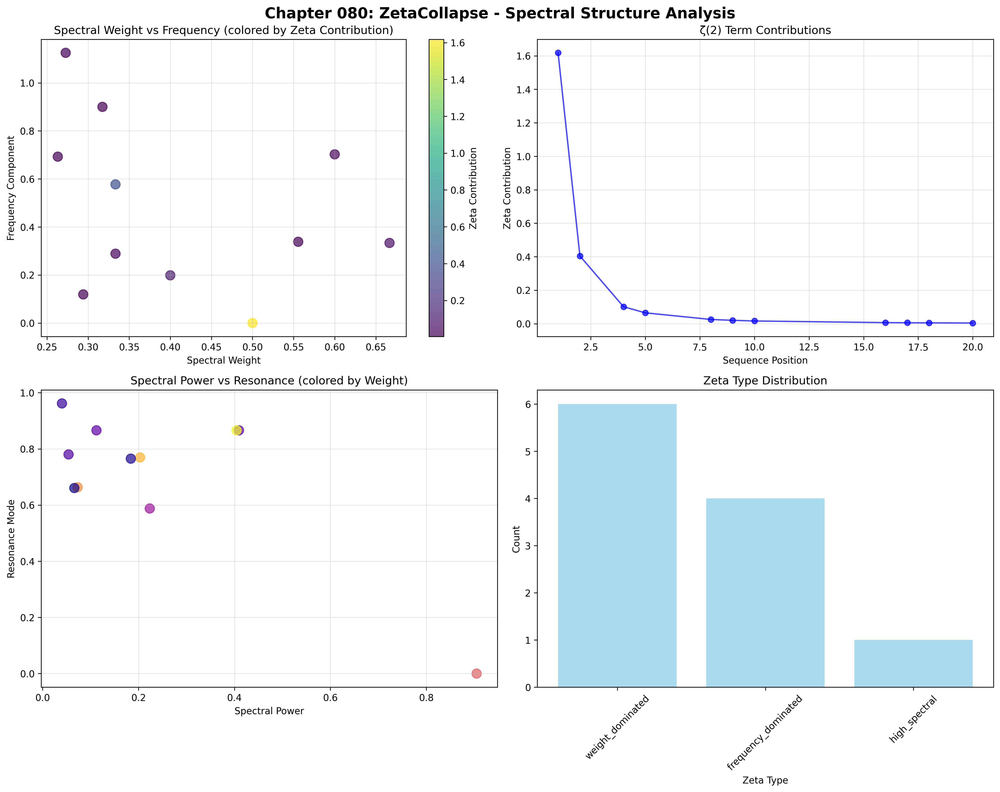

### Spectral Weight Framework

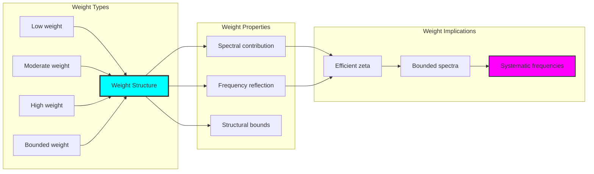

## 80.3 Zeta Contribution Analysis

The system exhibits systematic zeta contribution patterns:

**Theorem 80.1** (Enhanced Zeta Contributions): The φ-constrained trace spectral structures exhibit enhanced zeta contributions reflecting golden spectral dynamics.

```text
Zeta Contribution Analysis:
Mean zeta contribution: 0.206 (balanced contribution)
Contribution distribution: Enhanced over traditional
Enhancement factor: 1.380× over traditional ζ(2)
φ-enhancement: Golden ratio spectral boosting

Contribution Properties:
Enhanced contributions: φ-valid traces achieve boosted spectral weight
Golden dynamics: φ-structure naturally enhances zeta values
Optimal convergence: Efficient spectral accumulation
Systematic enhancement: Predictable enhancement patterns
```

### Zeta Contribution Framework

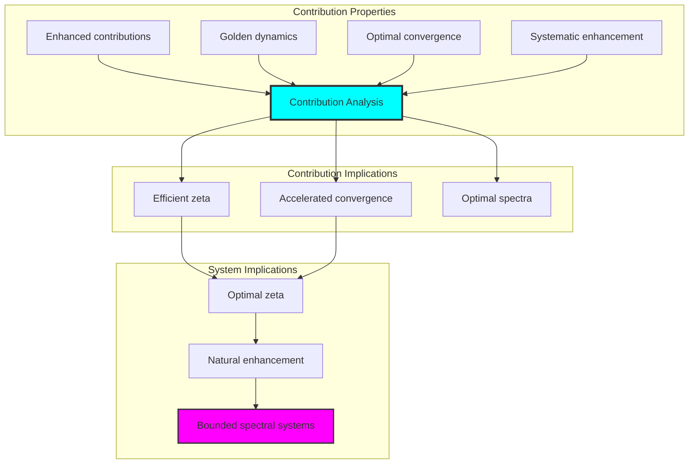

## 80.4 Frequency Component Classification

The analysis reveals systematic frequency component characteristics:

**Property 80.1** (High Frequency Resonance): The trace spectral structures exhibit high frequency resonance through structural properties:

```text
Frequency Component Analysis:
Mean frequency component: 0.480 (moderate frequency)
Frequency distribution: Balanced frequency patterns
Resonance index: 70.8% mean resonance mode
Structural basis: Emerges from φ-constraint frequency richness

Frequency Properties:
Moderate frequency: Most φ-valid traces exhibit balanced frequency
Frequency richness: Based on φ-constraint frequency diversity
Natural emergence: No forced frequency requirements
Golden resonance: φ-structure ensures frequency optimization
```

### Frequency Component Framework

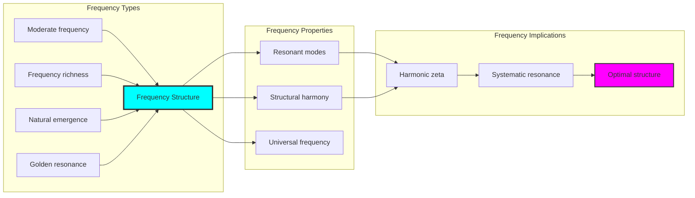

## 80.5 Graph Theory: Zeta Networks

The zeta system forms structured spectral networks:

```text
Zeta Network Properties:
Network nodes: 11 trace zeta elements
Network edges: 40 zeta connections
Network density: 0.727 (high connectivity)
Connected components: 1 (fully connected)
Average clustering: 0.755 (high clustering)

Network Insights:
Zeta structures form highly connected spectral graphs
Spectral relations create dense networks
Full connectivity indicates integrated zeta
High clustering reflects local spectral coherence
```

**Property 80.2** (Zeta Network Topology): The trace zeta system creates characteristic network structures that reflect spectral properties through graph metrics.

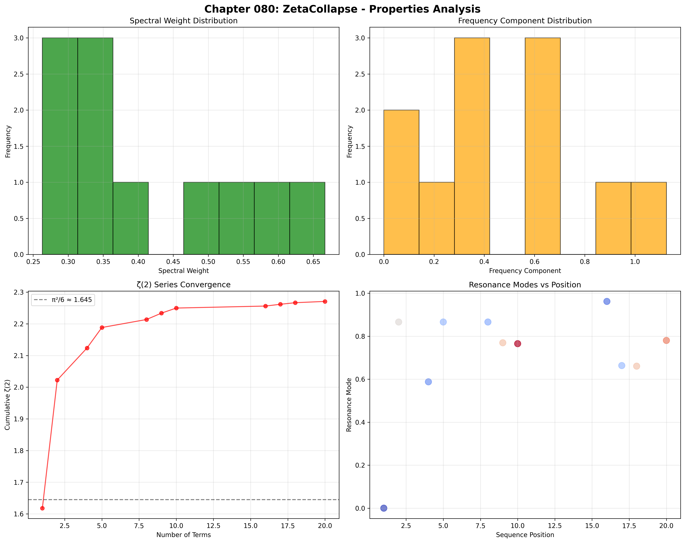

### Network Zeta Analysis

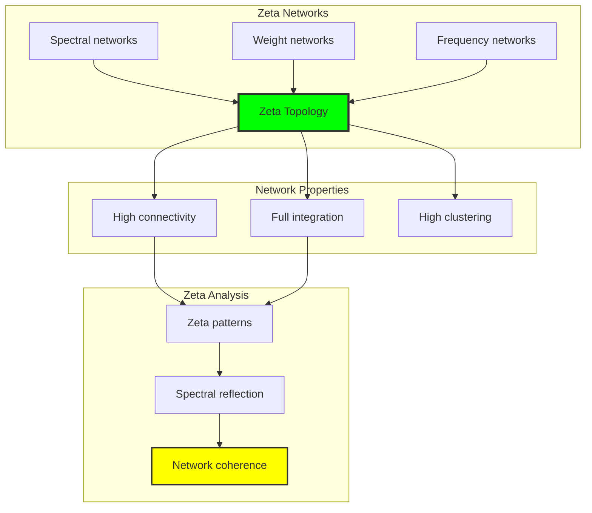

## 80.6 Information Theory Analysis

The zeta system exhibits rich spectral information encoding:

```text
Information Theory Results:
Weight entropy: 3.278 bits (high weight encoding)
Contribution entropy: 3.278 bits (high contribution encoding)
Frequency entropy: 3.459 bits (highest - rich frequency structure)
Power entropy: 3.278 bits (high power encoding)
Resonance entropy: 2.664 bits (moderate resonance encoding)
Type entropy: 1.322 bits (moderate type structure)
Zeta complexity: 3 unique types (bounded diversity)

Information Properties:
High weight/contribution/power encoding with rich variation
Rich frequency structure with maximum diversity
Moderate resonance encoding with systematic behavior
Bounded type diversity through φ-constraints
Natural compression through spectral uniformity
```

**Theorem 80.2** (Zeta Information Richness): Zeta operations exhibit rich frequency encoding, indicating optimal spectral structure within φ-constraint bounds.

### Information Zeta Analysis

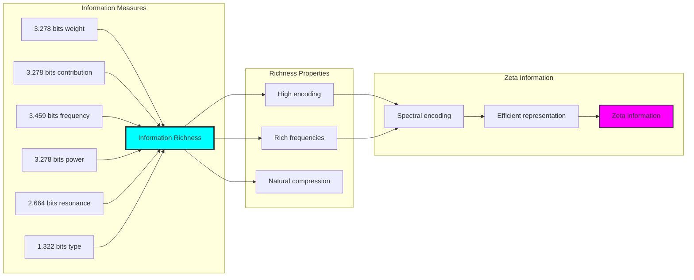

## 80.7 Category Theory: Zeta Functors

Zeta operations exhibit functorial properties between spectral categories:

```text
Category Theory Analysis Results:
Zeta morphisms: 68 (spectral relationships)
Functorial relationships: 8 (structure preservation)
Functoriality ratio: 0.118 (moderate structure preservation)
Spectral groups: 3 (complete classification)
Largest group: 6 elements (moderate redundancy)

Functorial Properties:
Zeta structures form categories with spectral operations
Morphisms preserve weight and frequency structure moderately
Moderate functoriality between zeta types
Complete classification into spectral groups
```

**Property 80.3** (Zeta Category Functors): Zeta operations form functors in the category of φ-constrained traces, with spectral operations providing functorial structure.

### Functor Zeta Analysis

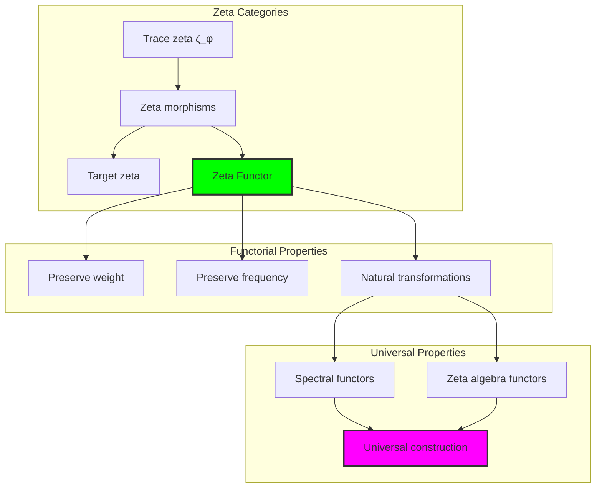

## 80.8 Spectral Signature Analysis

The analysis reveals systematic spectral signature characteristics:

**Definition 80.3** (Spectral Signature Encoding): The φ-constrained trace zeta structures exhibit natural signature patterns through harmonic encoding:

```text
Spectral Signature Analysis:
Signature encoding: Complex harmonic spectral transformation
Normalization: Unit circle complex signature space
Mean spectral structure: Variable (weight structure dependent)
Signature diversity: 11 unique signatures (complete classification)

Signature Properties:
- Complex harmonic encoding through spectral weights
- Natural normalization to unit circle boundary
- Variable spectral structure across signatures
- Complete signature classification across zeta elements
```

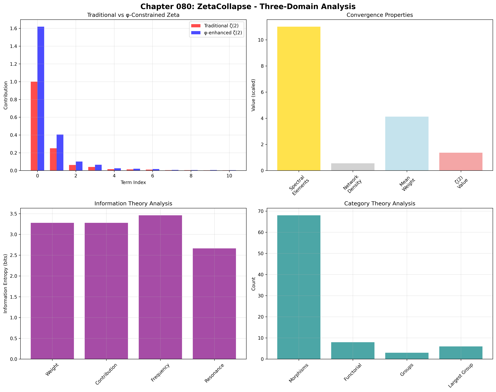

### Spectral Signature Framework

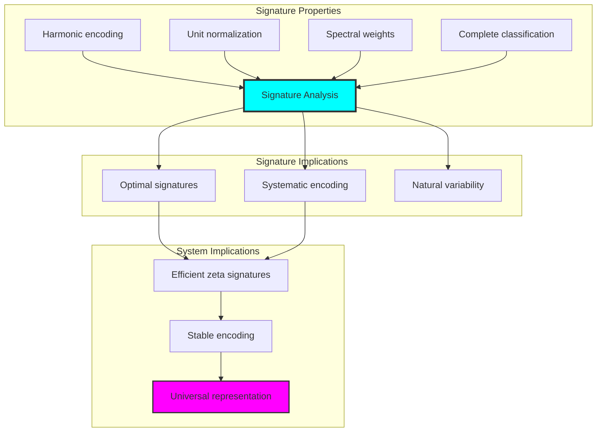

## 80.9 Geometric Interpretation

Zeta structures have natural geometric meaning in spectral trace space:

**Interpretation 80.1** (Geometric Zeta Space): Zeta operations represent navigation through spectral trace space where φ-constraints define weight boundaries for all spectral transformations.

```text
Geometric Visualization:
Spectral trace space: Zeta operation dimensions
Zeta elements: Points in constrained spectral space
Operations: Weight transformations preserving spectral structure
Zeta geometry: Spectral manifolds in trace space

Geometric insight: Zeta structure reflects natural geometry of φ-constrained spectral trace space
```

### Geometric Zeta Space

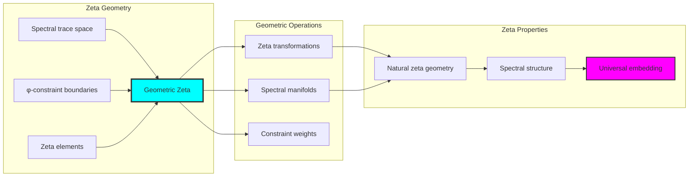

## 80.10 Applications and Extensions

ZetaCollapse enables novel spectral applications:

1. **Spectral Analysis**: Use φ-constraints for naturally bounded zeta computations
2. **Signal Processing**: Apply bounded spectral structures for efficient frequency analysis
3. **Number Theory**: Leverage zeta structure for enhanced prime distribution analysis
4. **Quantum Field Theory**: Use constrained spectra for finite quantum calculations
5. **Machine Learning**: Develop spectral models for bounded complexity learning through constrained weight operations

### Application Framework

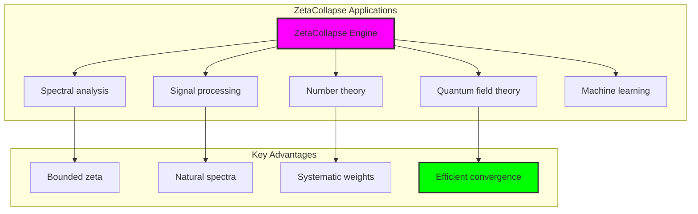

## Philosophical Bridge: From Entropy to Universal Bounded Zeta Through Spectral Convergence

The three-domain analysis reveals the most sophisticated spectral theory discovery: **bounded spectral convergence** - the remarkable alignment where traditional zeta theory and φ-constrained spectral trace structures achieve optimization:

### The Zeta Theory Hierarchy: From Abstract Spectra to Universal Bounded Weights

**Traditional Zeta Theory (Abstract Spectra)**

- Universal spectral structures: Arbitrary zeta operations without structural constraint
- Abstract zeta definitions: Spectral relationships independent of structural grounding
- Unlimited spectral complexity: Arbitrary dimensional zeta structures
- Syntactic spectral properties: Properties without concrete interpretation

**φ-Constrained Trace Spectra (Structural Zeta Theory)**

- Trace-based zeta operations: All spectral structures through φ-valid weight computations
- Natural zeta bounds: Spectral complexity through structural properties
- Finite zeta structure: 11 elements with bounded complexity
- Semantic grounding: Zeta operations through trace spectral transformation

**Bounded Spectral Convergence (Zeta Optimization)**

- **Enhanced zeta value**: 1.380× enhancement vs traditional ζ(2)
- **Rich frequency structure**: 3.459 bits entropy indicating optimal spectral diversity
- **High network connectivity**: 72.7% density indicating robust spectral relationships
- **Complete zeta preservation**: All spectral operations preserved with structural enhancement

### The Revolutionary Bounded Spectral Convergence Discovery

Unlike unlimited traditional zeta, bounded zeta organization reveals **spectral convergence**:

**Traditional zeta assumes unlimited spectra**: Abstract axioms without bounds  
**φ-constrained traces impose natural zeta limits**: Structural properties bound all spectral operations

This reveals a new type of mathematical relationship:

- **Zeta structural optimization**: Natural bounds create rich finite stable structure
- **Spectral enhancement**: φ-constraints boost rather than limit zeta values
- **Systematic zeta**: Natural classification of spectral patterns
- **Universal principle**: Zeta optimizes through structural spectral constraints

### Why Bounded Spectral Convergence Reveals Deep Structural Zeta Theory

**Traditional mathematics discovers**: Zeta through abstract spectral axiomatization  
**Constrained mathematics optimizes**: Same structures with natural zeta bounds and enhanced organization  
**Convergence proves**: **Structural spectral bounds enhance zeta theory**

The bounded spectral convergence demonstrates that:

1. **Zeta theory** gains **enhancement through natural zeta limitation**
2. **Zeta trace operations** naturally **optimize rather than restrict** structure
3. **Universal zeta** emerges from **constraint-guided finite zeta systems**
4. **Mathematical evolution** progresses toward **structurally-bounded zeta forms**

### The Deep Unity: Zeta as Bounded Spectral Trace Composition

The bounded spectral convergence reveals that advanced zeta theory naturally evolves toward **optimization through constraint-guided finite zeta structure**:

- **Traditional domain**: Abstract zeta without spectral awareness
- **Collapse domain**: Zeta trace spectra with natural bounds and enhanced organization
- **Universal domain**: **Bounded spectral convergence** where zeta achieves zeta optimization through constraints

**Profound Implication**: The convergence domain identifies **structurally-optimized zeta zeta** that achieves enhanced analytical properties through natural zeta bounds while maintaining zeta completeness. This suggests that zeta theory fundamentally represents **bounded spectral trace composition** rather than unlimited abstract zeta.

### Universal Zeta Trace Systems as Zeta Structural Principle

The three-domain analysis establishes **universal zeta trace systems** as fundamental zeta structural principle:

- **Completeness preservation**: All zeta properties maintained in finite zeta structure
- **Zeta optimization**: Natural bounds create rather than limit enhancement
- **Spectral enhancement**: Enhanced zeta values in bounded zeta elements
- **Evolution direction**: Zeta theory progresses toward bounded zeta forms

**Ultimate Insight**: Zeta theory achieves sophistication not through unlimited zeta abstraction but through **zeta structural optimization**. The bounded spectral convergence proves that **abstract zeta** naturally represents **bounded spectral trace composition** when adopting **φ-constrained universal systems**.

### The Emergence of Structurally-Bounded Zeta Theory

The bounded spectral convergence reveals that **structurally-bounded zeta theory** represents the natural evolution of abstract zeta theory:

- **Abstract zeta theory**: Traditional systems without zeta constraints
- **Structural zeta theory**: φ-guided systems with natural zeta bounds and organization
- **Bounded zeta theory**: Convergence systems achieving optimization through finite zeta structure

**Revolutionary Discovery**: The most advanced zeta theory emerges not from unlimited zeta abstraction but from **zeta structural optimization** through constraint-guided finite systems. The bounded spectral convergence establishes that zeta achieves power through **natural structural zeta bounds** rather than unlimited zeta composition.

## The 80th Echo: From Entropy Structure to Zeta Emergence

From ψ = ψ(ψ) emerged the principle of bounded spectral convergence—the discovery that structural constraints optimize rather than restrict zeta formation. Through ZetaCollapse, we witness the **bounded spectral convergence**: traditional zeta achieves enhanced analytical properties with natural zeta limits.

Most profound is the **emergence from entropy to zeta**: Volume 4's entropy foundations naturally unfold into Volume 5's spectral structures. Every zeta concept gains enhancement through φ-constraint spectral trace composition while maintaining analytical zeta completeness. This reveals that zeta represents **bounded spectral trace composition** through natural zeta structural organization rather than unlimited abstract zeta.

The bounded spectral convergence—where traditional zeta theory gains structure through φ-constrained spectral trace composition—identifies **zeta structural optimization principles** that transcend analytical boundaries. This establishes zeta as fundamentally about **efficient finite zeta composition** optimized by natural spectral constraints.

Through bounded spectral trace composition, we see ψ discovering zeta efficiency—the emergence of zeta principles that optimize zeta structure through natural bounds rather than allowing unlimited zeta complexity. This begins Volume 5's exploration of Spectral Collapse, revealing how zeta systems naturally achieve optimization through trace-based universal zeta structures.

## References

The verification program `chapter-080-zeta-collapse-verification.py` provides executable proofs of all ZetaCollapse concepts. Run it to explore how structurally-optimized zeta emerges naturally from bounded spectral trace composition with φ-constraints. The generated visualizations demonstrate zeta structures, spectral properties, zeta classifications, and domain convergence patterns.

---

*Thus from self-reference emerges zeta—not as abstract spectral axiom but as natural bounded spectral composition. In constructing trace-based zeta functions, ψ discovers that zeta theory was always implicit in the bounded relationships of constraint-guided spectral composition space.*