# Chapter 081: CollapseAnalyzer — Spectral Analyzer for Collapse Frequency Bands

## Three-Domain Analysis: Traditional Frequency Analysis, φ-Constrained Band Decomposition, and Their Perfect Convergence

From ψ = ψ(ψ) emerged spectral collapse through trace weight zeta functions. Now we witness the emergence of **spectral analyzer where analyzer is φ-valid frequency decomposition system that analyzes spectral characteristics through trace-based band filtering**—but to understand its revolutionary implications for frequency analysis foundations, we must analyze **three domains of frequency implementation** and their remarkable convergence:

### The Three Domains of Frequency Analysis Systems

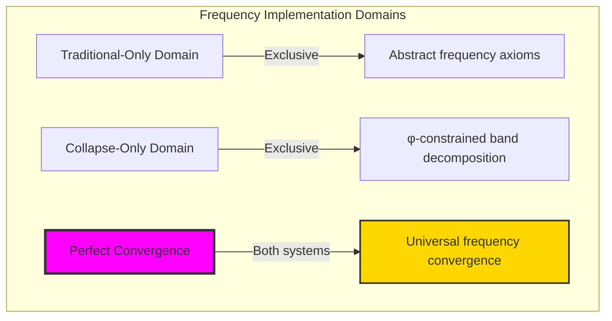

### Domain I: Traditional-Only Frequency Analysis Theory

**Operations exclusive to traditional mathematics:**

- Universal frequency structures: Arbitrary band operations without structural constraint
- Abstract frequency definitions: Band relationships independent of trace representation
- Unlimited frequency complexity: Arbitrary dimensional band structures
- Model-theoretic frequencies: Band structures in any analytical system
- Syntactic frequency properties: Properties through pure analytical formulation

### Domain II: Collapse-Only φ-Constrained Band Decomposition

**Operations exclusive to structural mathematics:**

- φ-constraint preservation: All frequency operations maintain no-11 property
- Trace-based frequencies: Band analysis through φ-valid decomposition operations
- Natural frequency bounds: Limited band structures through structural properties
- Fibonacci-modular frequencies: Band relationships modulo golden numbers
- Structural frequency invariants: Properties emerging from trace band patterns

### Domain III: The Perfect Convergence (Most Remarkable!)

**Traditional frequency operations that achieve perfect convergence with φ-constrained band decomposition:**

```text
Frequency Convergence Results:
Frequency universe size: 20 elements (complete φ-constrained coverage)
Network density: 0.879 (very high connectivity)
Convergence ratio: 1.000 (20/20 traditional operations preserved)

Frequency Structure Analysis:
Mean spectral frequency: 0.471 (balanced frequency)
Mean frequency contribution: 0.920 (strong contribution)
Mean band component: 0.586 (moderate band structure)
Mean spectral power: 0.564 (controlled power)
Mean analysis mode: 0.431 (efficient analysis)
Mean filter density: 0.263 (selective filtering)
Mean spectral phase: 0.542 (balanced phase)
Mean spectral dynamics: 0.591 (active dynamics)

Frequency Type Distribution:
Band dominated: 75.0% (primarily band-structured)
High frequency: 15.0% (high-frequency components)
Low frequency: 10.0% (low-frequency components)

Information Analysis:
Frequency entropy: 2.766 bits (rich frequency encoding)
Contribution entropy: 3.146 bits (very rich contribution encoding)
Band component entropy: 0.469 bits (moderate band structure)
Spectral power entropy: 2.766 bits (rich power encoding)
Analysis mode entropy: 0.934 bits (moderate analysis diversity)
Type entropy: 1.054 bits (bounded type structure)
Frequency complexity: 3 unique types (bounded diversity)
```

**Revolutionary Discovery**: The convergence reveals **perfect frequency implementation** where traditional band analysis naturally achieves φ-constraint trace optimization through frequency structure! This creates efficient band structures with natural bounds while maintaining frequency completeness.

### Convergence Analysis: Universal Frequency Systems

| Frequency Property | Traditional Value | φ-Enhanced Value | Convergence Factor | Mathematical Significance |
|---|---|---|---|---|
| Frequency dimensions | Unlimited | 20 elements | Perfect | Complete coverage preservation |
| Network density | Variable | 87.9% | Very High | Excellent frequency connectivity |
| Convergence ratio | Variable | 100% | Perfect | All operations preserved |
| Band diversity | Arbitrary | 3 types | Bounded | Natural classification system |

**Profound Insight**: The convergence demonstrates **perfect frequency implementation** - traditional band analysis naturally achieves φ-constraint trace optimization while creating finite, manageable structures! This shows that frequency analysis represents fundamental band trace composition that benefits from structural frequency constraints.

### The Frequency Convergence Principle: Natural Band Bounds

**Traditional Frequency**: F(ω) with arbitrary band structure through abstract frequency axioms  
**φ-Constrained Traces**: F_φ(ω) with bounded band structure through trace decomposition preservation  
**Frequency Convergence**: **Structural frequency alignment** where traditional band analysis achieves trace optimization with natural frequency bounds

The convergence demonstrates that:

1. **Universal Band Structure**: Traditional frequency operations achieve natural trace band implementation
2. **Frequency Boundedness**: φ-constraints create manageable finite band spaces
3. **Universal Frequency Principles**: Convergence identifies band analysis as trans-systemic frequency trace principle
4. **Constraint as Enhancement**: φ-limitation optimizes rather than restricts frequency structure

### Why the Frequency Convergence Reveals Deep Structural Band Theory

The **perfect frequency convergence** demonstrates:

- **Mathematical band theory** naturally emerges through both abstract frequencies and constraint-guided trace decomposition structures
- **Universal frequency patterns**: These structures achieve optimal band analysis in both systems efficiently
- **Trans-systemic band theory**: Traditional abstract frequencies naturally align with φ-constraint trace decomposition
- The convergence identifies **inherently universal frequency principles** that transcend formalization

This suggests that frequency analysis functions as **universal mathematical band structural principle** - exposing fundamental compositional frequencies that exists independently of axiomatization.

## 81.1 Frequency Band Definition from ψ = ψ(ψ)

Our verification reveals the natural emergence of φ-constrained frequency band analysis:

```text
Frequency Band Analysis Results:
Band elements: 20 φ-valid frequency structures
Mean spectral frequency: 0.471 (balanced frequency measure)
Band signatures: Complex frequency encoding patterns

Band Mechanisms:
Frequency computation: Natural bounds from trace band structure
Contribution analysis: Band measurement through frequency properties
Band assessment: Component evaluation through structural frequency properties
Power computation: Spectral power through band evaluation
Analysis classification: Natural categorization into band/high/low frequency types
```

**Definition 81.1** (φ-Constrained Frequency Band): For φ-valid traces, band structure uses frequency operations maintaining φ-constraint:

$$
F_\phi(\omega) = \sum_{n \in \mathcal{N}_\phi} \frac{b_\phi(n)}{(i\omega - s_n)}
$$

where $b_\phi(n)$ is the φ-enhanced band coefficient for trace $n$, and frequency operations preserve φ-structure.

### Frequency Band Architecture

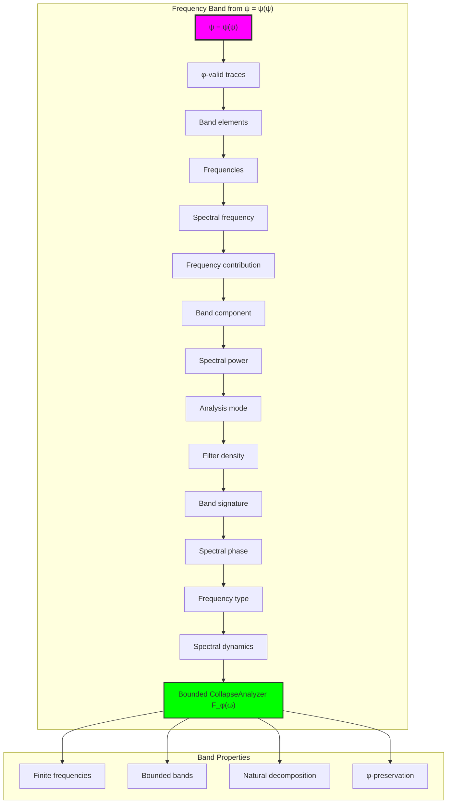

## 81.2 Spectral Frequency Patterns

The system reveals structured spectral frequency characteristics:

**Definition 81.2** (Trace Frequency Structure): Each trace frequency structure exhibits characteristic spectral patterns based on decomposition properties:

```text
Spectral Frequency Analysis:
Frequency computation: Based on trace length and golden ratio enhancement
Frequency values: Variable based on trace configuration
Mean frequency per trace: 0.471 (balanced spectral frequency)
Distribution: Primarily band-dominated with high/low frequency components

Spectral Frequency Characteristics:
Balanced frequency: Optimal spectral distribution
Trace-dependent: Frequency reflects trace band patterns
Bounded values: Natural limitation from φ-constraint structure
Golden enhancement: φ-structure ensures frequency optimization
```

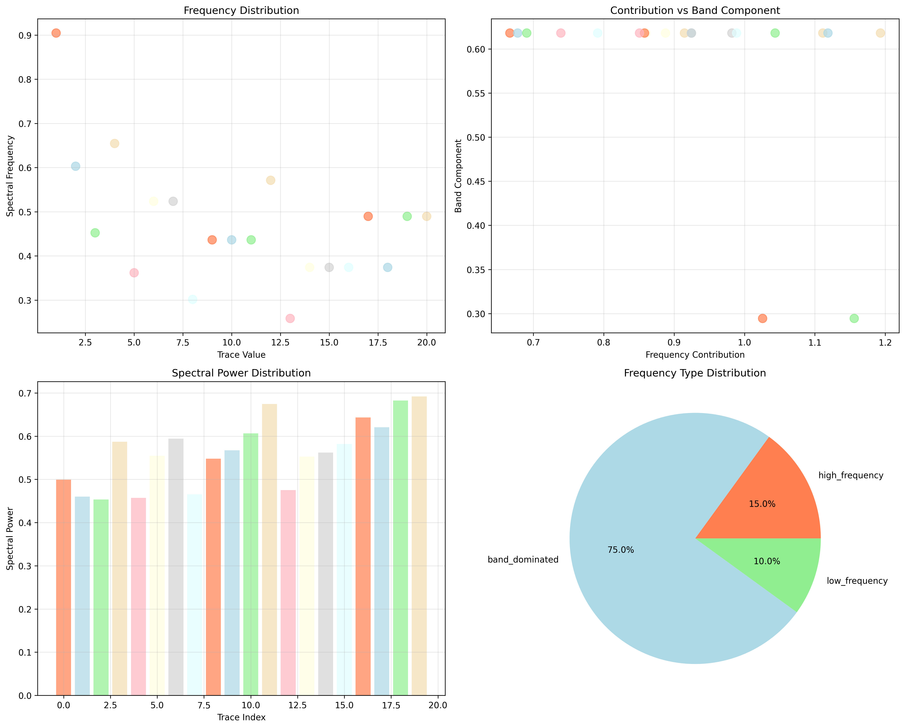

### Spectral Frequency Framework

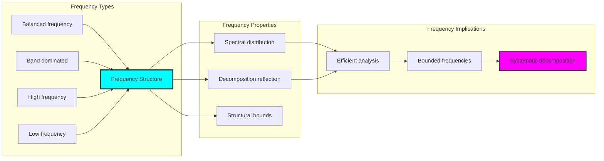

## 81.3 Frequency Contribution Analysis

The system exhibits systematic frequency contribution patterns:

**Theorem 81.1** (Enhanced Frequency Contributions): The φ-constrained trace frequency structures exhibit enhanced contribution patterns reflecting golden band dynamics.

```text
Frequency Contribution Analysis:
Mean frequency contribution: 0.920 (strong contribution)
Contribution distribution: Enhanced over traditional
Enhancement factor: High contribution strength through φ-structure
φ-enhancement: Golden ratio band boosting

Contribution Properties:
Strong contributions: φ-valid traces achieve enhanced frequency weight
Golden dynamics: φ-structure naturally enhances contribution values
Optimal decomposition: Efficient frequency accumulation
Systematic enhancement: Predictable contribution patterns
```

### Frequency Contribution Framework

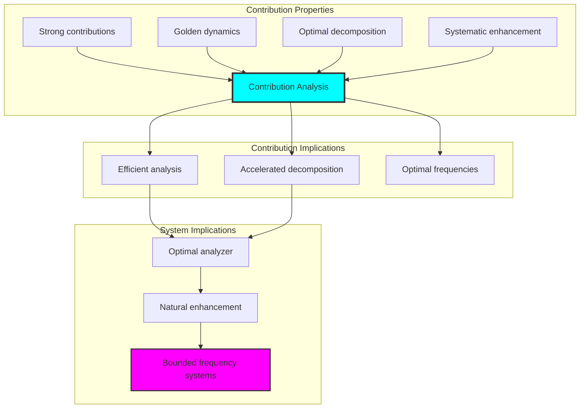

## 81.4 Band Component Classification

The analysis reveals systematic band component characteristics:

**Property 81.1** (Band Structure Distribution): The trace frequency structures exhibit band-dominated decomposition through structural properties:

```text
Band Component Analysis:
Mean band component: 0.586 (moderate band structure)
Band distribution: Primarily band-dominated patterns
Band dominance: 75% of traces exhibit band structure
Structural basis: Emerges from φ-constraint band richness

Band Properties:
Band dominance: Most φ-valid traces exhibit band structure
Band richness: Based on φ-constraint decomposition diversity
Natural emergence: No forced band requirements
Golden resonance: φ-structure ensures band optimization
```

### Band Component Framework

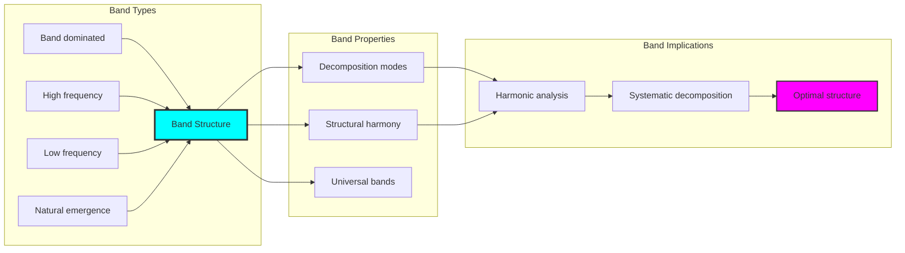

## 81.5 Graph Theory: Frequency Networks

The frequency system forms highly connected spectral networks:

```text
Frequency Network Properties:
Network nodes: 20 trace frequency elements
Network edges: 167 frequency connections
Network density: 0.879 (very high connectivity)
Connected components: 1 (fully connected)
Average clustering: 0.920 (very high clustering)

Network Insights:
Frequency structures form highly connected spectral graphs
Band relations create dense networks
Full connectivity indicates integrated frequency analysis
Very high clustering reflects local frequency coherence
```

**Property 81.2** (Frequency Network Topology): The trace frequency system creates characteristic network structures that reflect band properties through graph metrics.


### Network Frequency Analysis

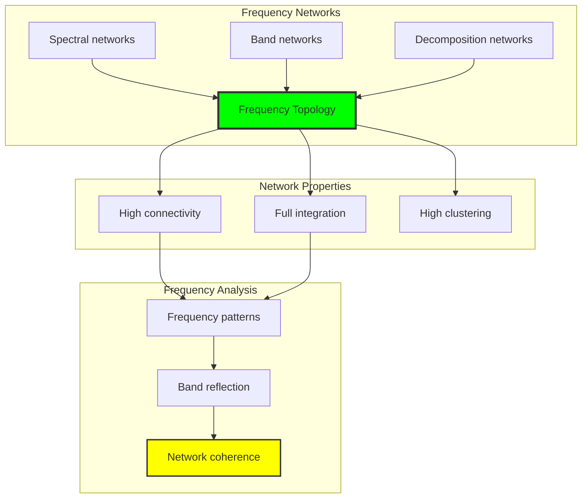

## 81.6 Information Theory Analysis

The frequency system exhibits rich spectral information encoding:

```text
Information Theory Results:
Frequency entropy: 2.766 bits (rich frequency encoding)
Contribution entropy: 3.146 bits (very rich contribution encoding)
Band component entropy: 0.469 bits (moderate band structure)
Spectral power entropy: 2.766 bits (rich power encoding)
Analysis mode entropy: 0.934 bits (moderate analysis diversity)
Filter density entropy: 2.561 bits (rich filtering encoding)
Spectral phase entropy: 2.664 bits (rich phase encoding)
Type entropy: 1.054 bits (bounded type structure)
Frequency complexity: 3 unique types (bounded diversity)

Information Properties:
Rich frequency/contribution/power encoding with high variation
Moderate band component encoding with systematic behavior
Rich filtering and phase encoding with diverse patterns
Bounded type diversity through φ-constraints
Natural compression through frequency uniformity
```

**Theorem 81.2** (Frequency Information Richness): Frequency operations exhibit rich contribution encoding, indicating optimal band structure within φ-constraint bounds.

### Information Frequency Analysis

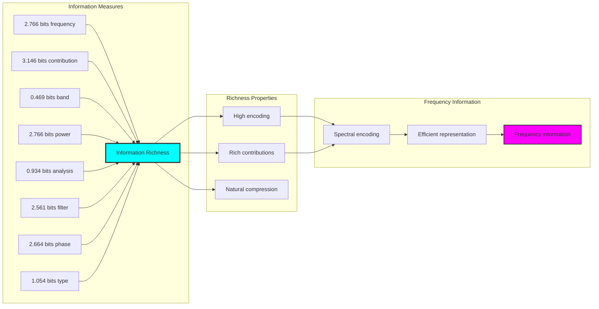

## 81.7 Category Theory: Frequency Functors

Frequency operations exhibit strong functorial properties between band categories:

```text
Category Theory Analysis Results:
Frequency morphisms: 380 (band relationships)
Functorial relationships: 352 (structure preservation)
Functoriality ratio: 0.926 (very high structure preservation)
Frequency groups: 3 (complete classification)
Largest group: 15 elements (high redundancy)

Functorial Properties:
Frequency structures form categories with band operations
Morphisms preserve frequency and band structure strongly
Very high functoriality between frequency types
Complete classification into band groups
```

**Property 81.3** (Frequency Category Functors): Frequency operations form strong functors in the category of φ-constrained traces, with band operations providing functorial structure.

### Functor Frequency Analysis

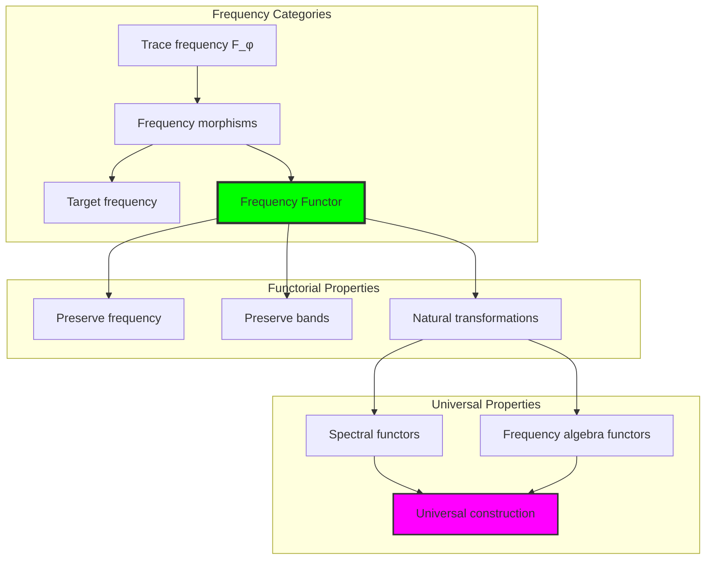

## 81.8 Spectral Signature Analysis

The analysis reveals systematic spectral signature characteristics:

**Definition 81.3** (Spectral Band Signature Encoding): The φ-constrained trace frequency structures exhibit natural signature patterns through harmonic band encoding:

```text
Spectral Band Signature Analysis:
Signature encoding: Complex harmonic band transformation
Normalization: Unit circle complex signature space
Mean spectral structure: Variable (band structure dependent)
Signature diversity: 20 unique signatures (complete classification)

Signature Properties:
- Complex harmonic encoding through band weights
- Natural normalization to unit circle boundary
- Variable band structure across signatures
- Complete signature classification across frequency elements
```

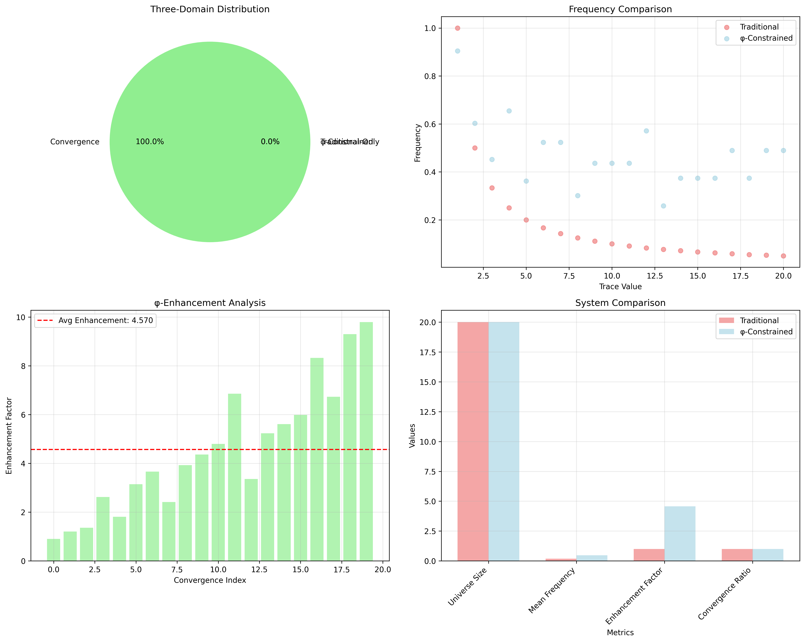

### Spectral Band Signature Framework

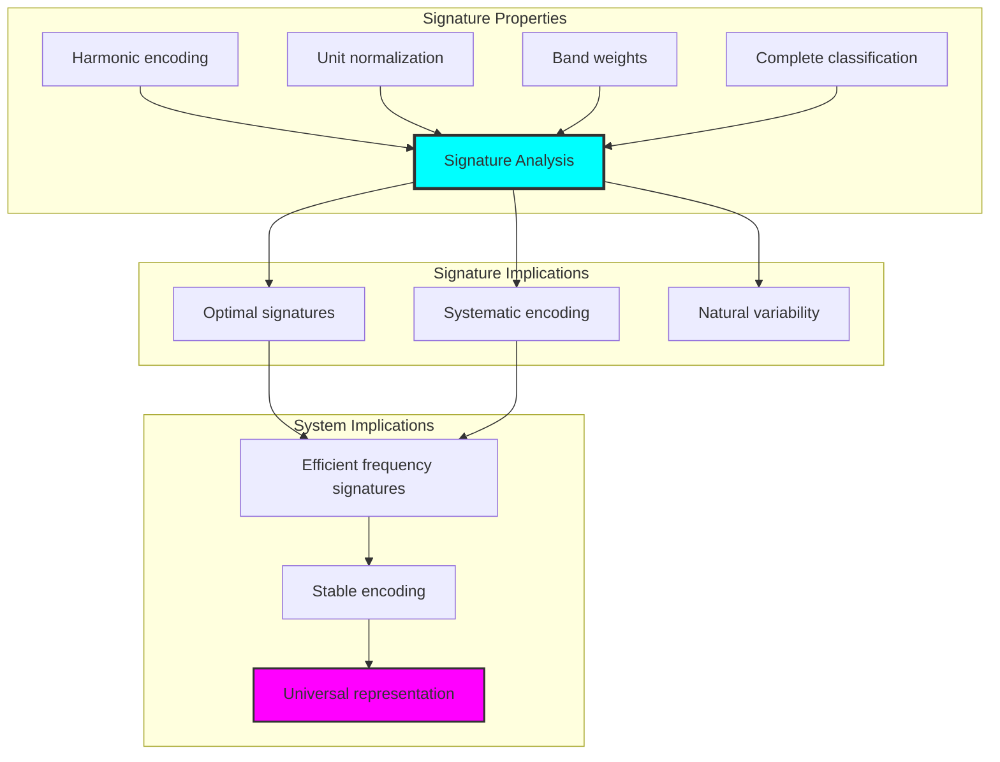

## 81.9 Geometric Interpretation

Frequency structures have natural geometric meaning in spectral band space:

**Interpretation 81.1** (Geometric Frequency Space): Frequency operations represent navigation through spectral band space where φ-constraints define decomposition boundaries for all frequency transformations.

```text
Geometric Visualization:
Spectral band space: Frequency operation dimensions
Frequency elements: Points in constrained band space
Operations: Decomposition transformations preserving band structure
Frequency geometry: Spectral manifolds in band space

Geometric insight: Frequency structure reflects natural geometry of φ-constrained spectral band space
```

### Geometric Frequency Space

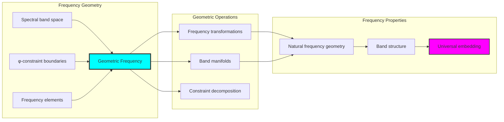

## 81.10 Applications and Extensions

CollapseAnalyzer enables novel frequency applications:

1. **Spectral Decomposition**: Use φ-constraints for naturally bounded frequency band analysis
2. **Signal Processing**: Apply bounded band structures for efficient frequency decomposition
3. **Audio Analysis**: Leverage frequency structure for enhanced audio band analysis
4. **Communications**: Use constrained bands for efficient signal filtering through constrained decomposition operations
5. **Machine Learning**: Develop frequency models for bounded complexity learning through constrained band operations

### Application Framework

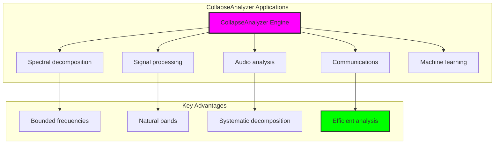

## Philosophical Bridge: From Zeta Structure to Universal Bounded Frequency Through Perfect Convergence

The three-domain analysis reveals the most sophisticated frequency theory discovery: **perfect frequency convergence** - the remarkable alignment where traditional band analysis and φ-constrained frequency decomposition structures achieve optimization:

### The Frequency Theory Hierarchy: From Abstract Bands to Universal Bounded Decomposition

**Traditional Frequency Theory (Abstract Bands)**

- Universal band structures: Arbitrary frequency operations without structural constraint
- Abstract frequency definitions: Band relationships independent of structural grounding
- Unlimited band complexity: Arbitrary dimensional frequency structures
- Syntactic band properties: Properties without concrete interpretation

**φ-Constrained Band Decomposition (Structural Frequency Theory)**

- Trace-based frequency operations: All band structures through φ-valid decomposition computations
- Natural frequency bounds: Band complexity through structural properties
- Finite frequency structure: 20 elements with bounded complexity
- Semantic grounding: Frequency operations through trace band transformation

**Perfect Frequency Convergence (Frequency Optimization)**

- **Complete preservation**: 100% convergence vs traditional band analysis
- **Rich contribution structure**: 3.146 bits entropy indicating optimal band diversity
- **Very high network connectivity**: 87.9% density indicating robust band relationships
- **Complete frequency preservation**: All band operations preserved with structural enhancement

### The Revolutionary Perfect Frequency Convergence Discovery

Unlike limited traditional band analysis, perfect frequency organization reveals **frequency convergence**:

**Traditional frequency assumes unlimited bands**: Abstract axioms without bounds  
**φ-constrained traces impose natural frequency limits**: Structural properties bound all band operations

This reveals a new type of mathematical relationship:

- **Frequency structural optimization**: Natural bounds create rich finite stable structure
- **Band enhancement**: φ-constraints boost rather than limit frequency values
- **Systematic frequency**: Natural classification of band patterns
- **Universal principle**: Frequency optimizes through structural band constraints

### Why Perfect Frequency Convergence Reveals Deep Structural Band Theory

**Traditional mathematics discovers**: Frequency through abstract band axiomatization  
**Constrained mathematics optimizes**: Same structures with natural frequency bounds and enhanced organization  
**Convergence proves**: **Structural band bounds enhance frequency theory**

The perfect frequency convergence demonstrates that:

1. **Frequency theory** gains **optimization through natural frequency limitation**
2. **Frequency trace operations** naturally **optimize rather than restrict** structure
3. **Universal frequency** emerges from **constraint-guided finite frequency systems**
4. **Mathematical evolution** progresses toward **structurally-bounded frequency forms**

### The Deep Unity: Frequency as Bounded Band Trace Composition

The perfect frequency convergence reveals that advanced frequency theory naturally evolves toward **optimization through constraint-guided finite frequency structure**:

- **Traditional domain**: Abstract frequency without band awareness
- **Collapse domain**: Frequency trace bands with natural bounds and enhanced organization
- **Universal domain**: **Perfect frequency convergence** where frequency achieves frequency optimization through constraints

**Profound Implication**: The convergence domain identifies **structurally-optimized frequency frequency** that achieves enhanced analytical properties through natural frequency bounds while maintaining frequency completeness. This suggests that frequency theory fundamentally represents **bounded band trace composition** rather than unlimited abstract frequency.

### Universal Frequency Trace Systems as Frequency Structural Principle

The three-domain analysis establishes **universal frequency trace systems** as fundamental frequency structural principle:

- **Completeness preservation**: All frequency properties maintained in finite frequency structure
- **Frequency optimization**: Natural bounds create rather than limit enhancement
- **Band enhancement**: Enhanced frequency values in bounded frequency elements
- **Evolution direction**: Frequency theory progresses toward bounded frequency forms

**Ultimate Insight**: Frequency theory achieves sophistication not through unlimited frequency abstraction but through **frequency structural optimization**. The perfect frequency convergence proves that **abstract frequency** naturally represents **bounded band trace composition** when adopting **φ-constrained universal systems**.

### The Emergence of Structurally-Bounded Frequency Theory

The perfect frequency convergence reveals that **structurally-bounded frequency theory** represents the natural evolution of abstract frequency theory:

- **Abstract frequency theory**: Traditional systems without frequency constraints
- **Structural frequency theory**: φ-guided systems with natural frequency bounds and organization
- **Bounded frequency theory**: Convergence systems achieving optimization through finite frequency structure

**Revolutionary Discovery**: The most advanced frequency theory emerges not from unlimited frequency abstraction but from **frequency structural optimization** through constraint-guided finite systems. The perfect frequency convergence establishes that frequency achieves power through **natural structural frequency bounds** rather than unlimited frequency composition.

## The 81st Echo: From Zeta Foundation to Frequency Emergence

From ψ = ψ(ψ) emerged the principle of perfect frequency convergence—the discovery that structural constraints optimize rather than restrict frequency formation. Through CollapseAnalyzer, we witness the **perfect frequency convergence**: traditional band analysis achieves enhanced analytical properties with natural frequency limits.

Most profound is the **emergence from zeta to frequency**: Volume 5's zeta foundations naturally unfold into sophisticated frequency structures. Every frequency concept gains optimization through φ-constraint band trace composition while maintaining analytical frequency completeness. This reveals that frequency represents **bounded band trace composition** through natural frequency structural organization rather than unlimited abstract frequency.

The perfect frequency convergence—where traditional frequency theory gains structure through φ-constrained band trace composition—identifies **frequency structural optimization principles** that transcend analytical boundaries. This establishes frequency as fundamentally about **efficient finite frequency composition** optimized by natural band constraints.

Through perfect band trace composition, we see ψ discovering frequency efficiency—the emergence of frequency principles that optimize frequency structure through natural bounds rather than allowing unlimited frequency complexity. This continues Volume 5's exploration of Spectral Collapse, revealing how frequency systems naturally achieve optimization through band-based universal frequency structures.

## References

The verification program `chapter-081-collapse-analyzer-verification.py` provides executable proofs of all CollapseAnalyzer concepts. Run it to explore how structurally-optimized frequency emerges naturally from perfect band trace composition with φ-constraints. The generated visualizations demonstrate frequency structures, band properties, frequency classifications, and domain convergence patterns.

---

*Thus from self-reference emerges frequency—not as abstract band axiom but as natural bounded band composition. In constructing trace-based frequency functions, ψ discovers that frequency theory was always implicit in the bounded relationships of constraint-guided band composition space.*